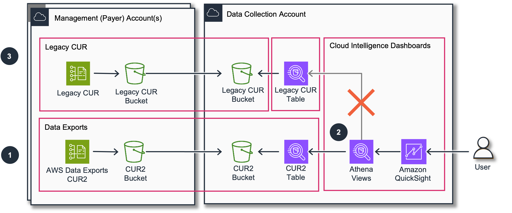

# Migration to CUR 2.0

## Migration Overview

AWS Provides a
[Cost
and Usage Report 2.0](../../../cur/latest/userguide/dataexports-migrate.md "../../../cur/latest/userguide/dataexports-migrate.md") that will gradually replace the
[Legacy
Cost and Usage Report](../../../cur/latest/userguide/cur-overview.md "../../../cur/latest/userguide/cur-overview.md"). This guide helps you to migrate existing CID
dashboards to the new CUR 2.0.

Use this guide if you already have CID dashboards installed via
CloudFormation or CLI methods.



Migration can be done in 3 steps:

1. Deploy CUR 2.0 via AWS Data Exports
2. Update Dashboards
3. (Optional) Decommission Legacy CUR

### Step 1 / 3: Deploy Data Exports

If you already have Data Exports Stack deployed for other dashboards
(CORA or FOCUS) please just make sure you have CUR2 option activated.

If you do not have Data Exports Stack please install it using
[this guide](data-exports.md "data-exports.md"). Please do not forget to request Back
Fill from source accounts for up to 36 months. If you need more then
this it can be possible to migrate your Legacy CUR data to the dataset
that will be close enough to CUR2 schema.

By the end of this step and if backfill completed you must have a table
with CUR2 available in Athena.

You can query the data to make sure that the data are identical.

CUR 2.0

```
SELECT
    billing_period,
    sum(line_item_unblended_cost)
FROM cid_data_export.cur2
GROUP BY 1
```

Legacy CUR

```
SELECT
    concat("`year`", '`-`', "`month`") AS billing_period,
    sum(line_item_unblended_cost)
FROM cid_cur.cur -- replace with your legacy CUR table
GROUP BY 1
```

Proceed to the next step once you have the data returned by Athena query
above for several billing periods.

### Step 2 / 3: Update Dashboards

Dashboards can be installed in 2 different ways: With CloudFormation
stack or with Command Line Tools. The update will be done with Command
Line Tool regardless of the deployment method, but if you used
CloudFormation for initial deployment, you need to update the stack.

With Command Line update you are in control of all modifications and you
can backport your customizations if needed.

#### Step 2.1: CloudFormation Update (If needed)

You can skip this if you used only Command Line for dashboards
deployment (cid-cmd).

1. Download [CloudFormation Stack](https://aws-managed-cost-intelligence-dashboards.s3.amazonaws.com/cfn/cid-cfn.yml "https://aws-managed-cost-intelligence-dashboards.s3.amazonaws.com/cfn/cid-cfn.yml").
2. Open [CloudFormation Console](https://console.aws.amazon.com/cloudformation/home?#/stacks "https://console.aws.amazon.com/cloudformation/home?#/stacks") in your Destination/Dashboard Account. Make sure to use the same region where you deployed the stack previously.
3. Update the stack (default name is Cloud-Intelligence-Dashboards) with the version you get from GitHub and set the parameter "CURVersion = 2". If you want to keep Legacy CUR, set "Keep Legacy CUR Table" (KeepLegacyCURTable) parameter to "Yes" and proceed with CLI update (Step 2.2).

These steps update the role used by QuickSight DataSources to access
Amazon S3 bucket and Athena Database with CUR2. At this point your
dashboard will not be updated (if you choose to KeepLegacyCURTable).

Once CloudFormation Stack is updated you need to proceed to Command Line
Update.

#### Step 2.2: Command line Update (Mandatory)

1. Open CloudShell in the same region and install the (cid-cmd) tool:

```
pip3 install -U cid-cmd
```

1. Run the tool to update your dashboard and dependencies:

```
cid-cmd update --force --recursive
```

Please select `cid_data_export.cur2` when asked to choose the CUR
table.

The tool will provide you with diff between the current Athena views and
the updated views SQL query. You can choose to "proceed and override"
or you can adjust your Athena views manually using the diff information
and choose "keep existing". Another option can be to backport changed
after the migration.

### Step 3 / 3: Decommission (Optional)

Once your dashboards are updated to CUR2 you can delete the Legacy CUR
using CloudFormation (CUR-Source/CUR-Destination) or manually depending
on how it was created.

## Troubleshooting and FAQ

### I do not see data on dashboards after migration

1. Run `cid-cmd status` to get more info about dataset status. Or manually check dataset status in QuickSight UI
2. Double check that QuickSight has permissions to read from your CUR bucket. If you use a default QuickSight Role please add manually permissions to read from `cid-ACCOUNTID-data-exports` bucket.
3. Check if data are in Athena table and view `SELECT * FROM summary_view LIMIT 10`

### How I can rollback

If you need to revert to the previous version

```
pip3 install cid-cmd==0.3.10
```

```
cid-cmd update --force --recursive
```

Choose Table with Legacy CUR when
asked

## Feedback

Please [contact the team](feedback-support.md "feedback-support.md") if any issue.
