# Net Amortized cost

## Last Updated

October 2024

## Author

- Deepthi Nune, Sr. Technical Account Manager, AWS

## Introduction

By Default CUDOS dashboard shows Amortized and Unblended cost. For
customers who would like to see cost after discounts, this guide
provides steps to implement possibility to switch between Amortized and
Net Amortized cost.

### Step 1 of 3. Modify Views/Queries in Athena

You will need to modify several views in Athena to include net amortized
cost. Views that you need to modify are:

- summary_view
- hourly_view
- resource_view

Navigate in the AWS Console to the **Athena** service

1. Select the **AwsDataCatalog** in the **DataSource** drop down
2. In the **Database** drop down select the database where your CUR table is located.
3. Under Views, scroll down until you locate the **summary_view**.
4. Select the three dots to the right of the view and select **Show/edit query** from the context menu.

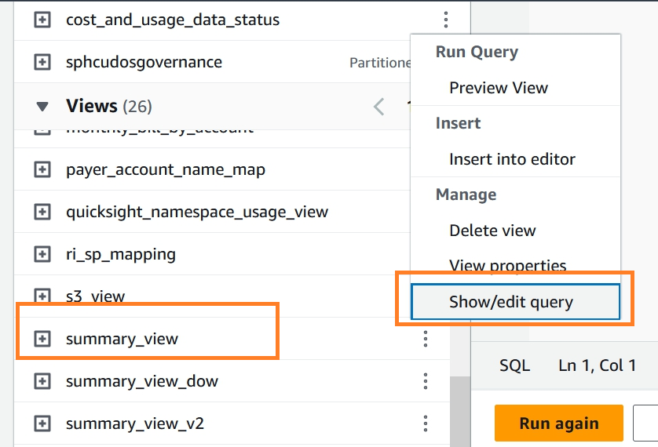

1. Find the line which ends with "amortized_cost" and add the below
   snippet

```
     , SUM(CASE
WHEN "line_item_line_item_type" = 'SavingsPlanRecurringFee' THEN (("savings_plan_total_commitment_to_date" - "savings_plan_used_commitment") * COALESCE((COALESCE("savings_plan_net_amortized_upfront_commitment_for_billing_period" , "savings_plan_amortized_upfront_commitment_for_billing_period") / NULLIF("savings_plan_amortized_upfront_commitment_for_billing_period" , 0)), 1))
WHEN "line_item_line_item_type" = 'RIFee' THEN COALESCE("reservation_net_unused_amortized_upfront_fee_for_billing_period" + "reservation_net_unused_recurring_fee", "reservation_unused_amortized_upfront_fee_for_billing_period" + "reservation_unused_recurring_fee")
WHEN "line_item_line_item_type" = 'SavingsPlanCoveredUsage' THEN COALESCE("savings_plan_net_savings_plan_effective_cost", "savings_plan_savings_plan_effective_cost")
WHEN "line_item_line_item_type" = 'DiscountedUsage' THEN COALESCE("reservation_net_effective_cost", "reservation_effective_cost")
WHEN "line_item_line_item_type" = 'Fee' AND COALESCE("reservation_reservation_a_r_n", '') = '' THEN COALESCE("line_item_net_unblended_cost", "line_item_unblended_cost")
WHEN "line_item_line_item_type" IN ('Usage', 'Tax', 'Credit', 'Refund') THEN COALESCE("line_item_net_unblended_cost", "line_item_unblended_cost")
ELSE 0 END) "net_amortized_cost"
```

1. click the **Run again** button and confirm that the query view updates
   successfully.

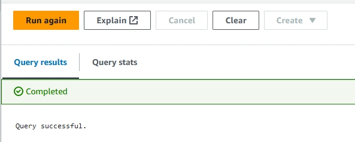

1. Under Views, locate **resource_view**, Select the three dots to the
   right of the view and select **Show/edit query** from the context menu.
2. Find the line which ends with "unblended_cost" , add the below
   snippet

```
 , "sum"("line_item_net_unblended_cost") "net_amortized_cost"
, "sum"("reservation_net_effective_cost") "reservation_net_effective_cost"
, "sum"("savings_plan_net_savings_plan_effective_cost") "savings_plan_net_effective_cost"
```

1. click the **Run again** button and confirm that the query view updates
   successfully.
2. Under Views, locate **hourly_view**, Select the three dots to the right
   of the view and select **Show/edit query** from the context menu.
3. Find the line which ends with "unblended_cost" , add the below
   snippet

```
 , "sum"("line_item_net_unblended_cost") "net_amortized_cost"
, "sum"("reservation_net_effective_cost") "reservation_net_effective_cost"
, "sum"("savings_plan_net_savings_plan_effective_cost") "savings_plan_net_effective_cost"
```

1. click the **Run again** button and confirm that the query view updates
   successfully.

### Step 2 of 3. Modify/Refresh DataSet in Amazon Quick Sight

Next the data set in Amazon Quick Sight needs to be refreshed in order to
see the added fields and use them in your analysis and dashboard.

1. Navigate to Amazon Quick Sight in the console.

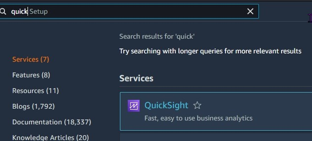 2. Select Datasets on the left side of the page.

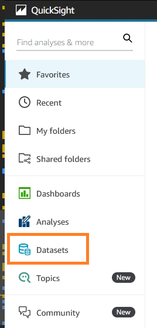 3. Locate **summary_view** in the list of datasets and click on the
dataset. 4. Click on Edit Dataset under the **summary** tab in the top right of the
page.

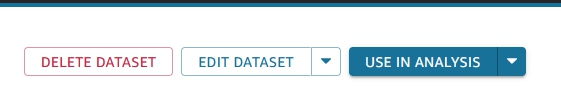 5. Allow the dataset preview windows to load. 6. Click on **Save & Publish** button in the top right of the page. this
will trigger a refresh of the dataset and import net_amortized field

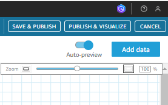 7. Repeat the steps to refresh **resource_view** and **hourly_view** dataset
as well.

### Step 3 of 3. Create/Modify CUDOS Dashboard Analysis

After the dataset has been updated you can now add the net_amortized
cost to different visualizations. Here we will demonstrate how you can
update the CUDOS dashboard to use the net_amortized cost along with
amortized_cost

###### Note

If you deploy an update to the CUDOS/CID dashboards with the
`--recursive` option it will overwrite your Athena query view changes
and published dashboard changes

1. First, we’ll need to [save the
   dashboard as an analysis](create-analysis.md "create-analysis.md") so we can make changes.
2. Open the CUDOS dashboard and select the save icon, selecting "save
   as" in the drop-down selection to save the dashboard as an analysis.

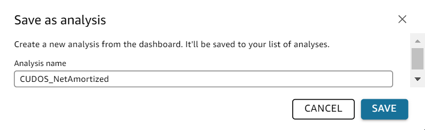 3. open the saved analysis.

### Step 3a. Create a parameter and control

We will create a new parameter and control/filter so we can switch
between unblended cost and net_amortized cost for all the visuals

1. Click on Insert → Add Parameter from the top left menu bar

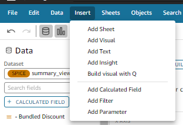

1. Enter a name: CostType for the parameter and enter the static default
   value : net amortized cost
2. Click create

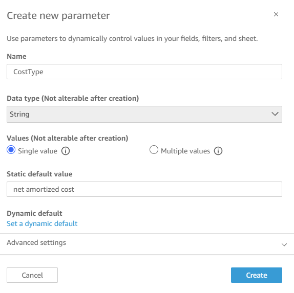

1. In the parameter added window, select Control to create a new control
   and connect to the parameter.

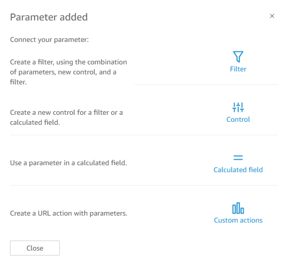 2. Enter in a display name : Cost Type, and ensure "Dropdown" is the
style. 3. Define specific values as displayed below

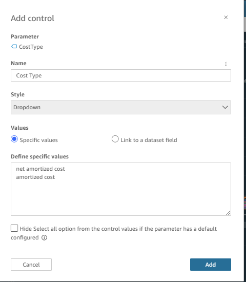 4. Finally click the add button. 5. The control will be added to the sheet in your analysis.

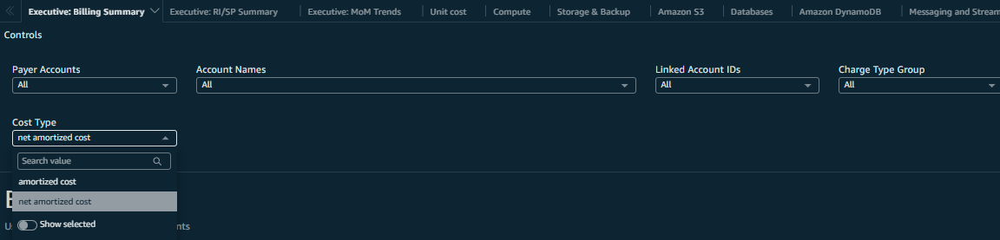

###### Note

The control has to be re-added to each sheet in the analysis

### Step 3b. Bind this control to calculated fields in datasets

Now that we’ve created the parameter and control we need to associate it
with few calculated fields in order to have an effect in our analysis
visualizations.

1. Click on Dataset from the left navigation and select the dataset **hourly_view**

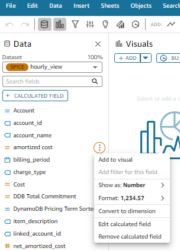

1. Find the calculated column **amortized cost** and edit the calculated
   field as shown below and click on save

```
 ifelse(
({charge_type} = 'SavingsPlanCoveredUsage' and ${CostType} = 'amortized cost'), {savings_plan_effective_cost},
({charge_type} = 'SavingsPlanCoveredUsage' and ${CostType} = 'net amortized cost' ), {savings_plan_net_effective_cost},
({charge_type} = 'DiscountedUsage' and ${CostType} = 'amortized cost'), {reservation_effective_cost},
({charge_type} = 'DiscountedUsage' and ${CostType} = 'net amortized cost'), {reservation_net_effective_cost},
({charge_type} = 'Usage' and ${CostType} = 'amortized cost'), {unblended_cost},
({charge_type} = 'Usage' and ${CostType} = 'net amortized cost'), {net_amortized_cost},
0
)
```

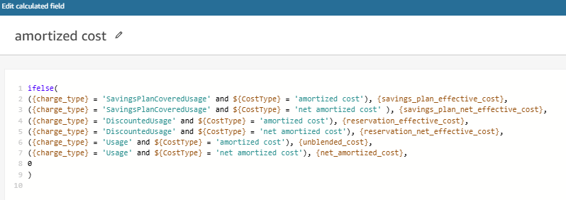 2. Now select the dataset **resource_view** and find the calculated field
**amortized cost**. Make changes as shown below and save

```
 ifelse(
({charge_type} = 'SavingsPlanCoveredUsage' and ${CostType} = 'amortized cost'), {savings_plan_effective_cost},
({charge_type} = 'SavingsPlanCoveredUsage' and ${CostType} = 'net amortized cost' ), {savings_plan_net_effective_cost},
({charge_type} = 'DiscountedUsage' and ${CostType} = 'amortized cost'), {reservation_effective_cost},
({charge_type} = 'DiscountedUsage' and ${CostType} = 'net amortized cost'), {reservation_net_effective_cost},
({charge_type} = 'Usage' and ${CostType} = 'amortized cost'), {unblended_cost},
({charge_type} = 'Usage' and ${CostType} = 'net amortized cost'), {net_amortized_cost},
0
)
```

 3. Find the calculated field **Workspace Total Resource Cost**, edit as
shown below and click on Save

```
sumOver(sum(Cost), [{Workspace ID}])
```

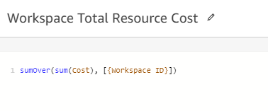 4. Find the calculated field **Workspace Average Cost**, edit as shown
below and click on Save

```
sum(Cost)/distinct_count({Workspace ID})
```

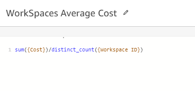 5. Now Select the dataset **summary_view** and find the calculated filed
**Cost_Amortized** . edit the calculated field as shown below and click on
save

```
ifelse(
${CostType}= 'amortized cost',{amortized_cost},
${CostType}= 'net amortized cost', {net_amortized_cost},
NULL)
```

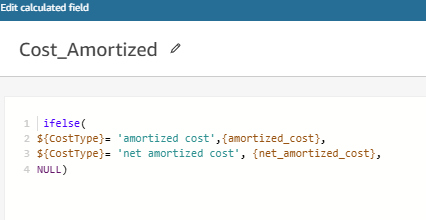 6. Publish the modified analysis as a new dashboard which now has option
to switch between both unblended and net_amortized cost.
