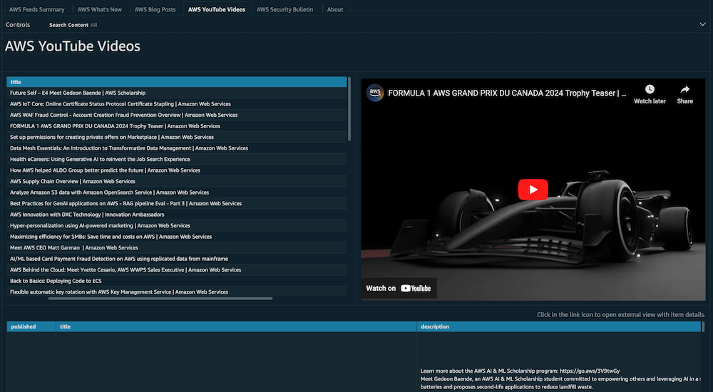

# AWS News Feeds

## Introduction

This dashboard provides recent AWS feeds including What’s New, Blog
Posts, Videos and Security Bulletins. It allows you to filter news by
AWS service, feed type and category and quickly focus on the most
important topics. You can deploy dashboard in your AWS account and embed
in your internal web sites. We keep our demo dashboard up to date and
you are welcome to use it to stay updated with AWS related news and
watch youtube videos directly from the demo dashboard.

## Demo Dashboard

Get more familiar with Dashboard using the live, interactive demo
dashboard following this [link](https://cid.workshops.aws.dev/demo?dashboard=aws-feeds "https://cid.workshops.aws.dev/demo?dashboard=aws-feeds")



## Prerequisites

Deploy [Data Collection Lab](data-collection.md "data-collection.md") and make sure AWS
Feeds Module is selected. Version 3.0.8 or higher required.

## Deployment

###### Example

CloudFormation

###### Note

**Prerequisite**: To install this dashboard using CloudFormation, you need to install Foundational Dashboards CFN with version v4.0.0 or above as described [here](deployment-in-global-regions.md#deployment-in-global-region-deploy-dashboard "deployment-in-global-regions.md#deployment-in-global-region-deploy-dashboard")

1. Log in to to your **Data Collection** Account.
2. Click the Launch Stack button below to open the **pre-populated stack template** in your CloudFormation.

[](https://console.aws.amazon.com/cloudformation/home#/stacks/create/review?templateURL=https://aws-managed-cost-intelligence-dashboards.s3.amazonaws.com/cfn/cid-plugin.yml&stackName=AWS-News-Feeds-Dashboard&param_DashboardId=aws-feeds&param_RequiresDataCollection=yes "https://console.aws.amazon.com/cloudformation/home#/stacks/create/review?templateURL=https://aws-managed-cost-intelligence-dashboards.s3.amazonaws.com/cfn/cid-plugin.yml&stackName=AWS-News-Feeds-Dashboard¶m_DashboardId=aws-feeds¶m_RequiresDataCollection=yes") 3. You can change **Stack name** for your template if you wish. 4. Leave **Parameters** values as it is. 5. Review the configuration and click **Create stack**. 6. You will see the stack will start in **CREATE_IN_PROGRESS**. Oncecomplete, the stack will show **CREATE_COMPLETE** 7. You can check the stack output for dashboard URLs.

###### Note

**Troubleshooting:** If you see error "No export named cid-CidExecArn found" during stack deployment, make sure you have completed prerequisite steps.

Command Line
Alternative method to install dashboards is the
[cid-cmd](https://github.com/aws-solutions-library-samples/cloud-intelligence-dashboards-framework/blob/main/CID-CMD.md#command-line-tool-cid-cmd "https://github.com/aws-solutions-library-samples/cloud-intelligence-dashboards-framework/blob/main/CID-CMD.md#command-line-tool-cid-cmd")
tool.

1. Log in to to your **Data Collection** Account.
2. Open up a command-line interface with permissions to run API requests
   in your AWS account. We recommend to use
   [CloudShell](https://console.aws.amazon.com/cloudshell "https://console.aws.amazon.com/cloudshell").
3. In your command-line interface run the following command to download
   and install the CID CLI tool:

```
 pip3 install --upgrade cid-cmd
```

4. In your command-line interface run the following command to deploy the
   dashboard:

```
 cid-cmd deploy --dashboard-id aws-feeds --data-collection-database-name optimization_data
```

Please follow the instructions from the deployment wizard. More info
about command line options are in the
[Readme](https://github.com/aws-solutions-library-samples/cloud-intelligence-dashboards-framework/blob/main/CID-CMD.md#command-line-tool-cid-cmd "https://github.com/aws-solutions-library-samples/cloud-intelligence-dashboards-framework/blob/main/CID-CMD.md#command-line-tool-cid-cmd")
or `cid-cmd --help`.

## Update

Please note that dashboards are not updated with update of
CloudFormation Stack. When new version of the dashboard template is
released, you can update your dashboard by running the following command
in your command-line interface:

```
cid-cmd update --dashboard-id aws-feeds
```

## Authors

- Francisco Tresgallo, Senior Technical Account Manager

## Contributors

- Iakov Gan, Ex-Amazonian
- Yuriy Prykhodko, Principal Technical Account Manager

## Feedback & Support

Follow [Feedback & Support](feedback-support.md "feedback-support.md") guide

###### Note

These dashboards and their content: (a) are for informational
purposes only, (b) represent current AWS product offerings and
practices, which are subject to change without notice, and (c) does not
create any commitments or assurances from AWS and its affiliates,
suppliers or licensors. AWS content, products or services are provided
"as is" without warranties, representations, or conditions of any
kind, whether express or implied. The responsibilities and liabilities
of AWS to its customers are controlled by AWS agreements, and this
document is not part of, nor does it modify, any agreement between AWS
and its customers.
