# Organization (OU) integration

This content is DEPRECATED. Please use [Organizational Taxonomy Guide](add-org-taxonomy.md "add-org-taxonomy.md").

## Introduction

Attribution of cost and operational data to Business Units, Divisions,
Project or Teams is important phase. This can attribute ownership of
assets and actions and follow up in scale.

If you use AWS Organizations, and your Organizational Units are align
with your actual organizational structure, you probably would like to
incorporate Organizational Units(OU) information into your Cloud
Intelligence Dashboards, creating filters, views and visualizations of
cost and usage based on your AWS Organizations structure. This
customization will guide you through this process.

Using this guide you will be able to extend your various CID dashboards
with AWS organization, such as:

- OU Names (can be from multiple levels of OU structure)
- OU and Account Tags - These tags that are applied on AWS Account or AWS Organization OU. Please note these are not the same Cost Allocation Tags that can work on resource level.
- Hierarchical Tags - The tags that can be defined on OU level and propagate to account level (More specific tags override less specific).
- Management Account names (or nicknames).


You also can leverage the OU information for your Row Level Security.

## Prerequisites

For this solution you must have the following:

- Deployed the [Data Collection Stack](data-collection.md "data-collection.md") with the **AWS Organizations** module deployed.
- Permissions to create and update Athena views.
- Permissions to update Quick Sight Cloud Intelligence dashboard (CID) datasets

## Step by Step Guide

This guide assumes you have enabled the [Data
Collection Stack](data-collection.md "data-collection.md") with the **AWS Organizations** module deployed. There
are two methods of incorporating organization data into your CID
dashboards. The first covers creating a dedicated view and add the data
into Quick Sight. The other covers updating the `account_map` that is
already used in most of CID datasets.

Method 2 is the recommended way to make this change.

Regardless of the path of customization, the last section provides how
to customize the dashboards in 3 ways: filters, controls and views.

## Method 1 - Updating Quick Sight dataset schema

### Step 1. Create View in Athena

You will need to create a new view `organization_map`.

1. Open the console and navigate to Athena.
2. Select the AwsDataCatalog data source and `cid_data` database (Please note that in older
   versions of [Data Collection Stack](data-collection.md "data-collection.md") the name of
   data base was `optimization_data` and you will need to adapt SQL
   accordingly).
3. Confirm that you have the table, organization_data and there is data in that table.
4. Create the following view:

```
CREATE OR REPLACE VIEW "organization_map" AS
SELECT "id" "account_id"
, "name" "account_name"
, "parent" "OU"
, "parentid" "OU_ID"
, "payer_id" "payer_org_account_id"
, "managementaccountid" "management_account_id"
FROM cid_data.organization_data
```

1. After creating the view, execute a query against the view and confirm you are getting the correct data:

```
SELECT *
FROM "organization_map" limit 10;
```

1. Move to the next step.

### Step 2. Modify Data Set in Amazon Quick Sight

Next the data set in Amazon Quick Sight needs to be updated so that you
can see the added fields to use them in your Dashboards and Analyses.

1. Navigate to Quick Sight in the console.
2. Select Datasets, and then select `summary_view` from the list of datasets.

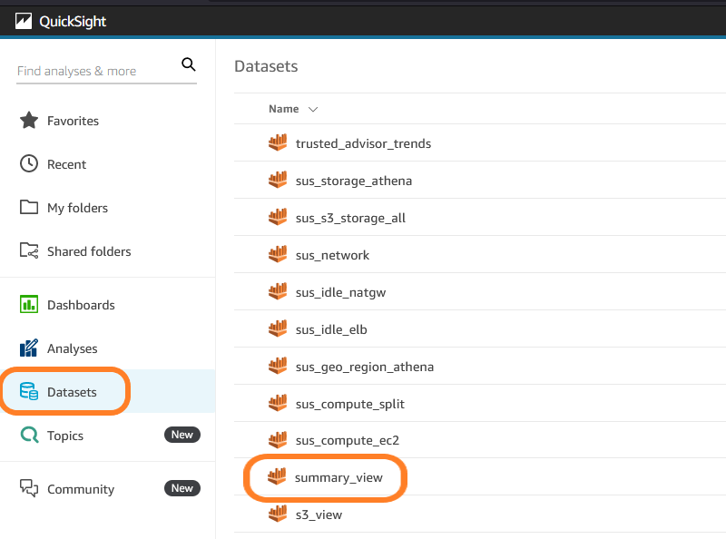 3. Click on EDIT DATASET.

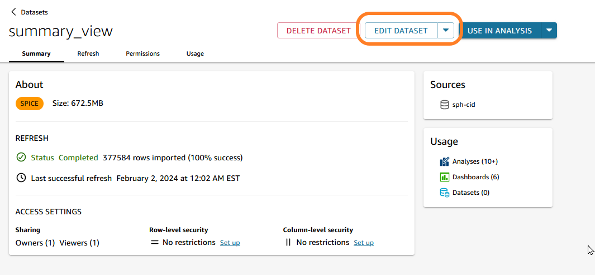 4. Click on Add data.

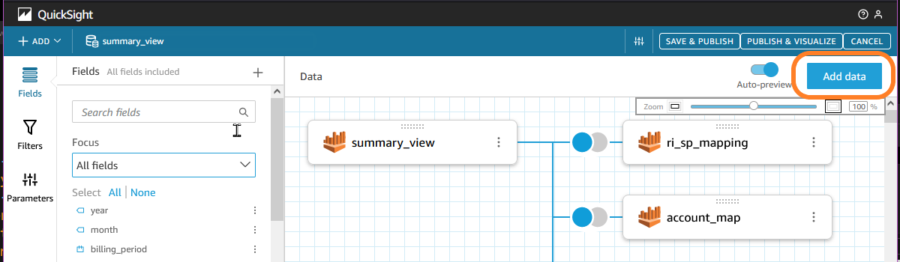

1. Make the following selections:
   - Select DataSource from the first drop down.
   - Next select the same DataSource that issued for `summary_view`.
   - Leave the Catalog as AwsDataCatalog.
   - Select cid_data as the database.

   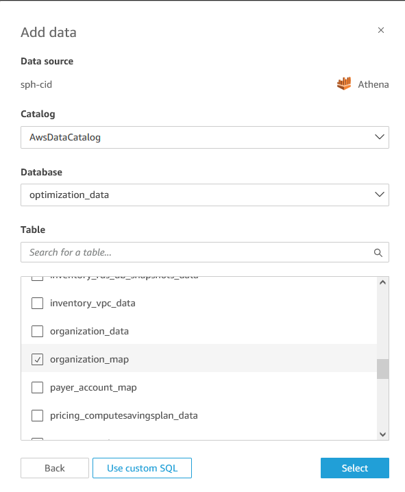
   - Search for the view `organization_map`, check the box.

1. Click Select.
1. Select the join between **summary_view** and **organization_map**.
1. Ensure the join type is set to left.

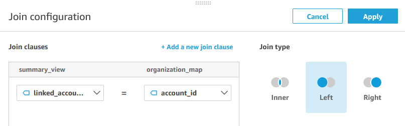

1. Set the join clause to be; _linked_account_id = account_id_.
2. Click Apply.
3. Save and Publish the dataset.

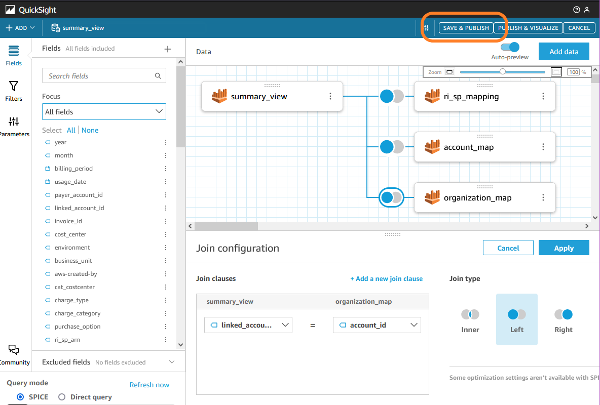

1. Now you can do the same for all other datasets (hourly_view, resource_view and others).
2. Once the dataset
   finishes loading successfully, you will then be able to incorporate
   payer account name in your dashboards, analysis to visuals, controls or
   filters.

## Method 2- Incorporating organization data into account_map

### Step 1. Modify View in Athena

This method demonstrates how to modify the account map view query to
include the data from the organization data directly. This requires you
to replace the account map view.

###### Note

When updating any view that is part of the cloud intelligence or
data collection deployments you should create a copy of the original
view so that you can rollback a change. This view could be overwritten
by a future deployment or forced update of these views. You should have
a backup copy of your customizations of view to be able to place them
back if this happens.

1. Navigate to Athena and the cur database.
2. Locate the
   `account_map` and click on the vertical ellipses next to the view and select _Show/edit query_ from the context menu.
3. First, make a copy of
   the view as backup, naming the new view something like
   _account_map_original_.
4. Select the entire view and replace it with this query:

```
CREATE OR REPLACE VIEW "account_map" AS
SELECT DISTINCT
    id account_id
  , name account_name
  , managementaccountid parent_account_id
  , email account_email_id
  , parent "ou"
FROM
  "cid_data"."organization_data"
```

Please explore `organization_data` table for more options that you can use in the view above.

1. Click _Run_ to execute the query and create the view.
2. Next, switch to Quick Sight, locate the `summary_view` dataset and edit that dataset.
3. Confirm you see the _OU_ field in your schema.
4. Save and publish that dataset to have the schema updated and data reloaded.
5. Repeat these previous steps in Quick Sight for each dataset that has `account_map`. Ex: `hourly_view` and `resource_view`
6. Then follow the section on dashboard customization to complete the customizations.

## Managing complex organization

Some organization can have a complex multi level structure. In these
cases we recommend adding multiple OU levels or leveraging
[AWS
Organization Tags](../../../organizations/latest/userguide/orgs_tagging.md "../../../organizations/latest/userguide/orgs_tagging.md"). You can define a set of Tags. Ex: `MyEnterprise`,
`MyBusinessLine` and `MyBusinessUnit`.

You can set these tags on any level of OU and then redefine on lower
level if needed. This gives you the flexibility and control in defining
org structure. Tags can be also redefined on the level of Account.

Here is an advanced example that leverage OU Tags as well as mapping for
Management Account Names that you can adjust to needs of your
Organization.

1. Navigate to Athena and the cur database (default: `cid_cur`).
2. Locate the `account_map` and click on the vertical ellipses (`⋮`) next to the view and select _Show/edit query_ from the context menu.
3. First, make a copy of the view as backup, naming the new view something like _account_map_original_.
4. Select the entire view and replace it with this query adjusted to your needs:

```
CREATE OR REPLACE VIEW "account_map" AS
SELECT DISTINCT
    id account_id
  , name account_name
  , email account_email_id
  , ManagementAccountId parent_account_id
  , "parent" "OU" -- The Name of the lowest level OU of the Account

  -- A simple mapping of Management Account Ids to user-friendly names
  , CASE ManagementAccountId
     WHEN '111111111111' THEN 'My Management Org'
     WHEN '222222222222' THEN 'My Test Org'
     ELSE ManagementAccountId
  END parent_account_name

  -- Full path separated with '>'
  , HierarchyPath as ou_hierarchy

  -- Levels of OU hierarchy
  , TRY(hierarchy[1].name) ou_l1
  , TRY(hierarchy[2].name) ou_l2
  , TRY(hierarchy[3].name) ou_l3
  , TRY(hierarchy[4].name) ou_l4
  , TRY(hierarchy[5].name) ou_l5

  -- Hierarchical Tags
  , TRY(FILTER(HierarchyTags, (x) -> (x.key = 'MyEnterprise'))[1].value) as ou_tag_enterprise
  , TRY(FILTER(HierarchyTags, (x) -> (x.key = 'MyBusinessLine'))[1].value) as ou_tag_business_line
  , TRY(FILTER(HierarchyTags, (x) -> (x.key = 'MyBusinessUnit'))[1].value) as ou_tag_business_unit
FROM
  "cid_data"."organization_data"
```

1. Click `Run` to execute the query and create the view.
2. Next, switch to Quick Sight, locate the `summary_view` dataset and edit that dataset.
3. Save and publish that dataset to have the schema updated and data reloaded.
4. Repeat these previous steps in Quick Sight for each dataset that has `account_map`. Ex: `hourly_view` and `resource_view`
5. Then follow the section on dashboard customization to complete the customizations.

## Dashboard Customization

###### Note

By design your customized dashboards will not be overwritten by
new releases of CUDOS dashboards. Best practice is to clearly name your
customized dashboards a clear and unique name separate from the
dashboards we deploy.

### Step 1. Modify Quick Sight Analysis - CUDOS Dashboard

After the dataset has been updated you can now add those fields to
different visualizations. Here we will demonstrate how you can update
the CUDOS dashboard to use the organization information in a
visualization. We’ll save the dashboard as an analysis to make an update
to "Invoiced Spend by Payer Account" visual on the "Executive:
Billing Summary" sheet to instead reflect the same information by
organization.

1. Open up Quick Sight.
2. Navigate Dashboards and select the CUDOS dashboard.
3. Save the dashboard as a new analysis named "cudos-out-customization".

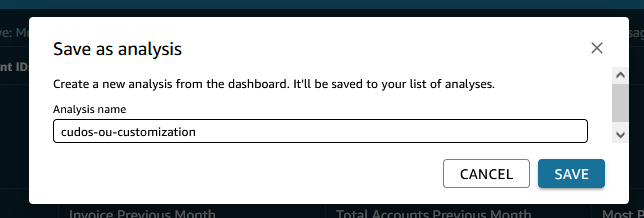

1. In that analysis, select the "Invoiced Spend by Payer Account" visual on the "Executive: Billing Summary" sheet.
2. Locate the "ou" field that was added in the field list for the _summary_view_ dataset.

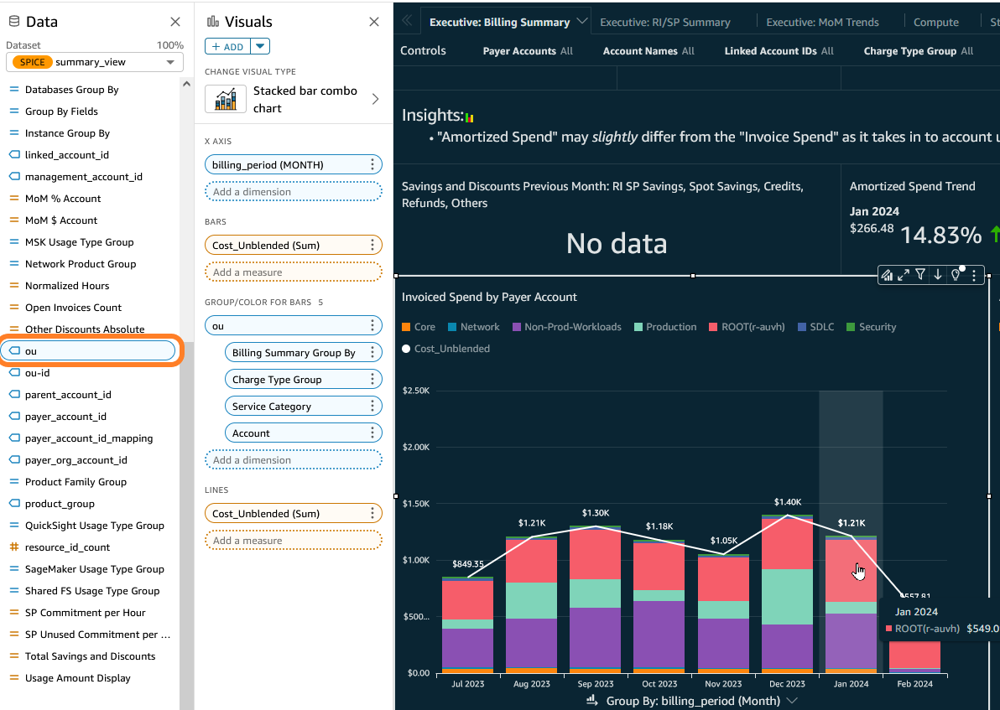

1. Select that field.
2. Drag and drop that field in Visual details under the GROUP/COLOR FOR BARS section. Make sure the field is at the top of the fields listed there.

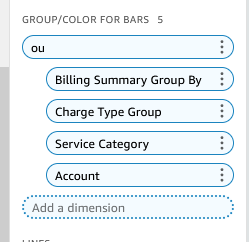

1. You will see the visual "Invoiced Spend by Payer Account"
   update to reflect the invoiced spend by organization instead of payer.

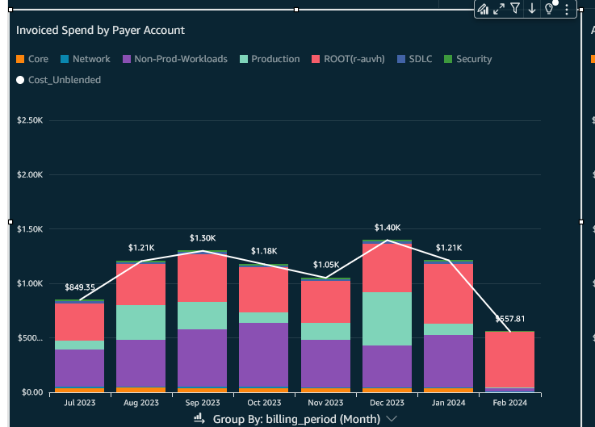

1. Lets update the title of this visual. Double-click on the title of the visual.
2. Select the "${BillingSummaryGroupBy}" parameter and delete it.
   Replace it with _organization_.

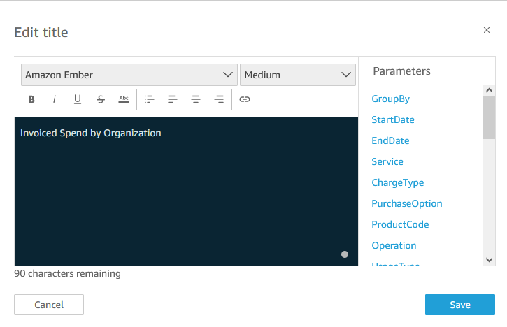

1. Click Save.
2. You will now see the visual updated to reflect the title and data grouped by organization.

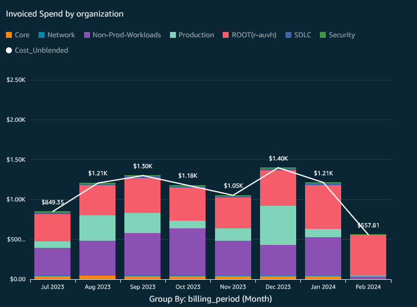

1. Continue with customizations of other visuals with organization as you need.
2. Publish the dashboard when you are done!

### Step 2. (Optional) Add to CUDOS controls

The CUDOS dashboard comes with several controls across the sheet by
default. You can add more controls to allow you to filter all the
visuals on a sheet at once. Here we’ll show you how to add organization
as a control.

1. Open up Quick Sight.
2. Navigate Dashboards and select the CUDOS dashboard.
3. Save the dashboard as a new analysis named "cudos-out-customization".


1. Click on _Insert_ from the analysis menu and select _Add Parameter_.

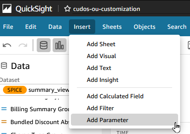

1. Enter _organization_ for the name, leave other settings to their default.

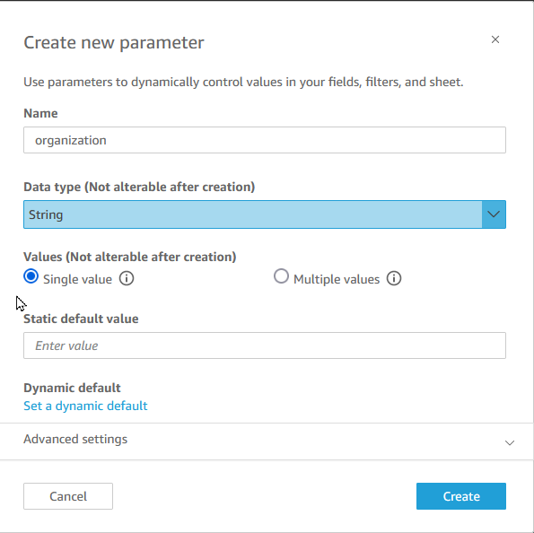 2. Click Create. 3. Click on _Control_.

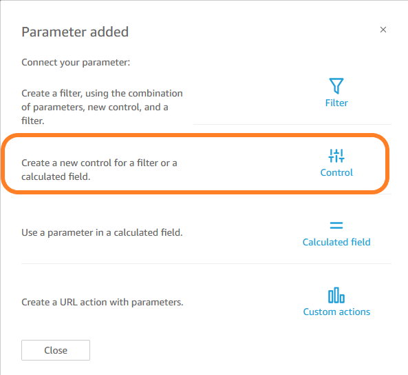 4. Make the following selections for the control configuration:

    * Name: **Organization**
    * Style: **Dropdown**
    * Values: **Link to dataset field**
    * Dataset: **summary\_view**
    * Field: **ou**

1. Click _Add_.
2. You will see the _Organization_ control added to the controls of the sheet.

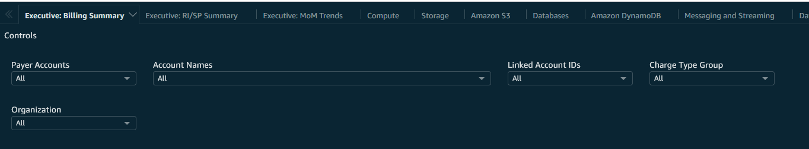

1. We need one more step for the control to work on the page.
2. Select a visual from the sheet and click on the `filters` icon
   from the analysis menu.
3. Click the \_ ADD\_ button under the **Filters**
   heading, search for the _ou_ field to add it to the filters.

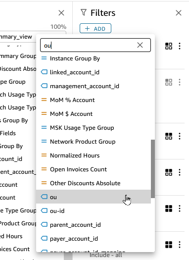

1. Click on the _ou_ filter to edit it and make the following selections:
   - Filter type: **Custom filter**
   - Filter condition: **equals**
   - Use Parameters: **checked**
   - Parameter: **organization**

1. Click _APPLY_.

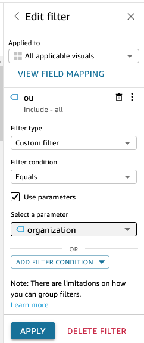

1. When you make a selection with the _Organization_ control, all the visuals on the sheet should be updated to be filtered by that organization unit.
2. To add this control to other sheets in the analysis, follow these steps:
   1. Select the sheet you want to add the control.
   2. Click the parameters icon from the toolbar.
   3. Search for `organization` in the parameters search.
   4. Select the vertical ellipses (`⋮`) next to the parameter.
   5. Select `Add control` from the context menu.
   6. Set the values like previously:
   7. Name: **Organization**
   8. Style: **Dropdown**
   9. Values: **Link to dataset field**
   10. Dataset: **summary_view**
   11. Field: **ou**
   12. Click _Add_.
   13. Select a visual from the sheet and click on the _filters_ icon from the analysis menu.
   14. Click the ` ADD` button under the **Filters** heading, search for the _ou_ field to add it to the filters.
   15. Click on the `ou` filter to edit it and make the following selections:
       1. Filter type: **Custom filter**
       2. Filter condition: **equals**
       3. Use Parameters: **checked**
       4. Parameter: **organization**

   16. Click `APPLY`.
   17. Repeat these steps for each sheet you want to see this control.

3. You’ve now customized the dashboard to add a control that filters all applicable visuals on a sheet. You can now publish your dashboard.

### Step 3. (Optional) Modify OPTICS Explorer sheet

The CUDOS dashboard has a sheet titled **OPTICS Explorer** which places
controls on the sheet with a number of common visualizations to allow
you to freely explore your CUR data or investigate different aspects of
your data quickly. You can add _Organization_ or any other control you
would like, such as _tags_ to add more flexibility to filter data on
this sheet.

After adding the control, it will be in as a drop down at the top of the
sheet. Follow these steps to move the control to the sheet.

1. Follow the steps in the optional step for adding controls
2. Expand the control menu at the top of the sheet.
3. Select the `Organization` control.
4. Select the 3 vertical ellipses for the control.
5. Select `Move to sheet`.

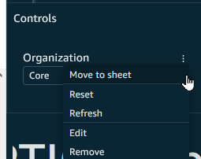

1. This will place the control at the very bottom of the sheet.
2. Select the control and drag the control up with the other controls.
3. You can edit the size the control and other controls to fit them in with the other controls.

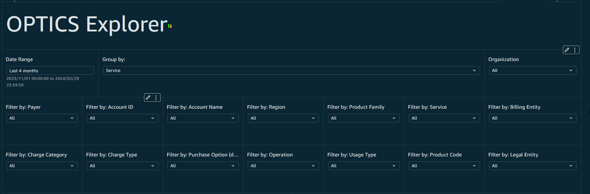

## Summary

We’ve shown you how you can customize your datasets, views and
dashboards to include AWS Organization data.
