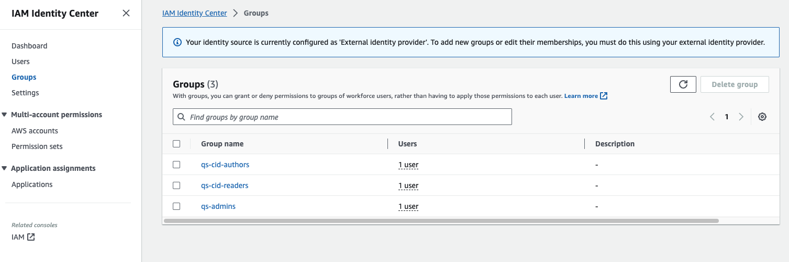
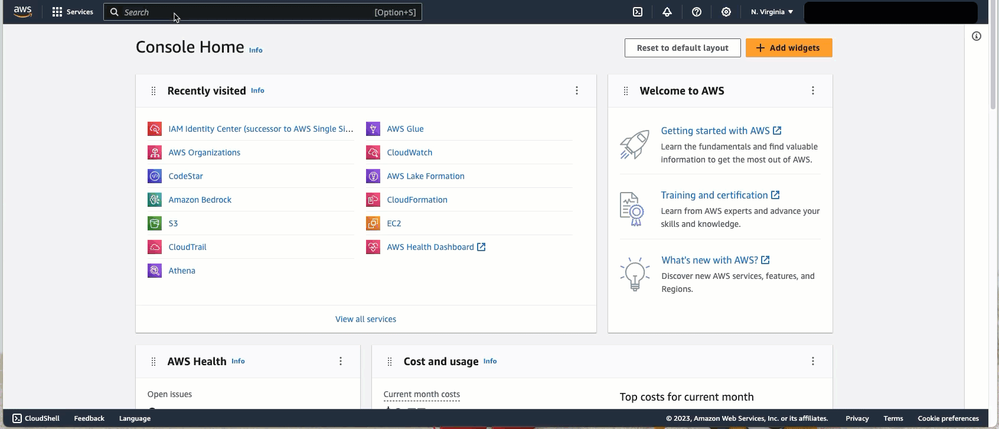
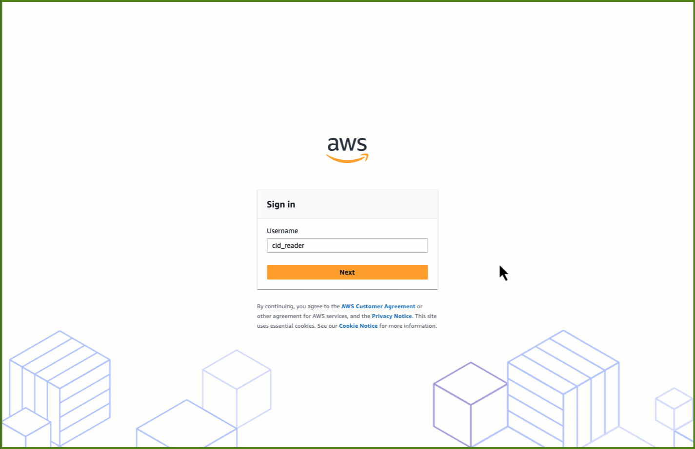
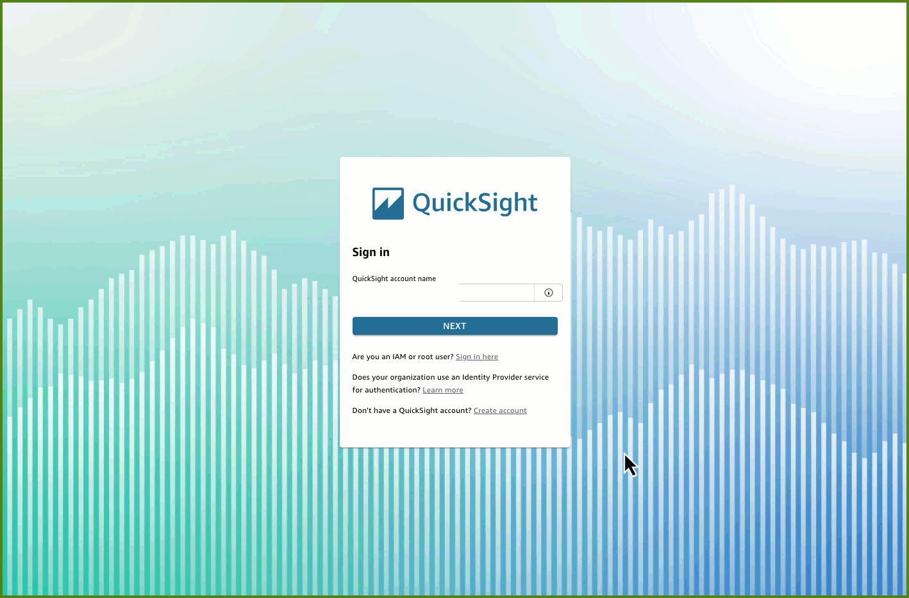

# Publishing as single sign-on (SSO) Application

## Last Updated

January 2024

## Authors

- Veaceslav Mindru, Sr. Technical Account Manager, AWS
- Stephanie Gooch, Sr. Commercial Architect, AWS OPTICS
- Sumit Dhuwalia, Technical Account Manager, AWS

## Introduction

Cloud Intelligence Dashboards (CID) help you visualize and understand
AWS cost and usage data for your entire organization using Amazon
Quick Sight. These dashboards can be used by different user personas
within your organization such as Product owners, Finance, and FinOps,
amongst others. To centrally manage user authentication/authorization
and also provide a seamless user-experience via SSO, we recommend
signing up for Quick Sight in your target Data Collection account using
AWS IAM Identity Center as the authentication method.

###### Important

This guide requires to configuring Quick Sight access through IAM
Identity Center. Currently it is not possible to enable IAM Identity
Center support for existing Quick Sight installation. For existing
Quick Sight that do not have this option enabled please use the
[legacy guide](sso-application-legacy.md "sso-application-legacy.md")

## Prerequisites

For this solution, you must have the following:

- AWS Organizations and IAM Identity Center enabled
  - For instructions on setting up IAM Identity Center, please follow the documentation [here](../../../singlesignon/latest/userguide/getting-started.md "../../../singlesignon/latest/userguide/getting-started.md")

- Data Collection AWS account should be part of the same AWS
  Organizations as IAM Identity Center

## Step 1: Create User Groups

The different user personas accessing CID may have different Quick Sight
access requirements, with some needing reader vs others needing author
access. You would also need to assign admins for your Quick Sight
account.

**Note:** This step needs to be performed within the management account of
your AWS Organizations or a delegated administrator account for IAM
Identity Center within your AWS Organizations.

Create the following groups either within IAM Identity Center (if you’re
managing identities here) or within your existing identity provider such
as Okta, Azure Active Directory (Azure AD), or others that you may have
configured with IAM Identity Center.

For instructions on how to add users and groups within IAM Identity
Center based on your identity source, please follow the documentation
[here](../../../singlesignon/latest/userguide/set-up-single-sign-on-access-to-accounts.md "../../../singlesignon/latest/userguide/set-up-single-sign-on-access-to-accounts.md")

Create the following user groups and assign appropriate users to these
groups:

1. **qs-cid-readers**: Users assigned to this group would have reader role within Quick Sight
2. **qs-cid-authors**: Users assigned to this group would have author role within Quick Sight
3. **qs-admins**: Users assigned to this group would have admin role within Quick Sight

Post this step, your IAM Identity Center should look similar to below:

## Step 2: Sign-up for Quick Sight

**Note:** This step needs to be performed within the target Data
Collection AWS account which should be part of the same AWS
Organizations as IAM Identity Center.

Please follow the gif below for an overview of the process and also note
the following:  

- Quick Sight region should be the same region where your IAM Identity Center is configured
- Quick Sight account name you choose should be unique (see [here](../../../quicksight/latest/user/signing-up.md "../../../quicksight/latest/user/signing-up.md") for details)
- Search for and select the relevant user groups you created in Step 1 above

## Step 3: Validate SSO flow

**Method 1**: From AWS IAM Identity Center Access portal

- Go to your AWS access portal URL available within IAM Identity Center
- Enter user credentials on your identity provider portal
- Click on Quick Sight tile on the AWS access portal to sign into Quick Sight

**Method 2**: From Quick Sight portal

- Go to Quick Sight portal URL: [https://quicksight.aws.amazon.com/](https://quicksight.aws.amazon.com/ "https://quicksight.aws.amazon.com/")
- Enter your Quick Sight account name
- Enter user credentials on your identity provider portal from where you would be redirected into Quick Sight

For a more in-depth walkthrough of setting up AWS IAM Identity Center,
please follow the blog
[Simplify
business intelligence identity management with Amazon Quick Sight and AWS
IAM Identity Center](https://aws.amazon.com/blogs/business-intelligence/simplify-business-intelligence-identity-management-with-amazon-quicksight-and-aws-iam-identity-center/ "https://aws.amazon.com/blogs/business-intelligence/simplify-business-intelligence-identity-management-with-amazon-quicksight-and-aws-iam-identity-center/")
