# Row Level Security

## Introduction

Cloud Intelligence Dashboards (CID) helps you to visualize and
understand AWS cost and usage data in your organization by exploring
interactive dashboards. However, in order to maintain least privilege
principle, customers who use CID at scale of organization often would
like to provide their users access only to the data for linked accounts
which they own. Using
[Row
Level Security](../../../quicksight/latest/user/restrict-access-to-a-data-set-using-row-level-security.md "../../../quicksight/latest/user/restrict-access-to-a-data-set-using-row-level-security.md") (RLS) enables you to restrict the data a user can see to
just what they are allowed to. This also applicable for customers with
Multiple Management (Payer) Accounts .

### Last Updated

June 2025

### Authors

- Stephanie Gooch, Sr. Commercial Architect, AWS OPTICS
- Veaceslav Mindru, Sr. Technical Account Manager, AWS

### Contributors

- Iakov Gan, Cloud Optimization Success SA, AWS

## Prerequisite

For this solution you must have the following:

- Access to your AWS Organizations and ability to tag resources
- One of the Foundational ([CUDOS, CID or KPI](cudos-cid-kpi.md "cudos-cid-kpi.md")) Cloud Intelligence Dashboards deployed
- A list of users and what level of access they require. This can be member accounts, organizational units (OU) or payers.

## Solution

This solution will use tags from your
[AWS Organization](https://aws.amazon.com/organizations/ "https://aws.amazon.com/organizations/") resources to
create a dataset that will be used for the Row Level Security for all
CID Datasets in [Amazon Quick Sight](https://aws.amazon.com/quicksight/ "https://aws.amazon.com/quicksight/").

The RLS rules can be based on Amazon Quick Sight Groups or Individual
Users.

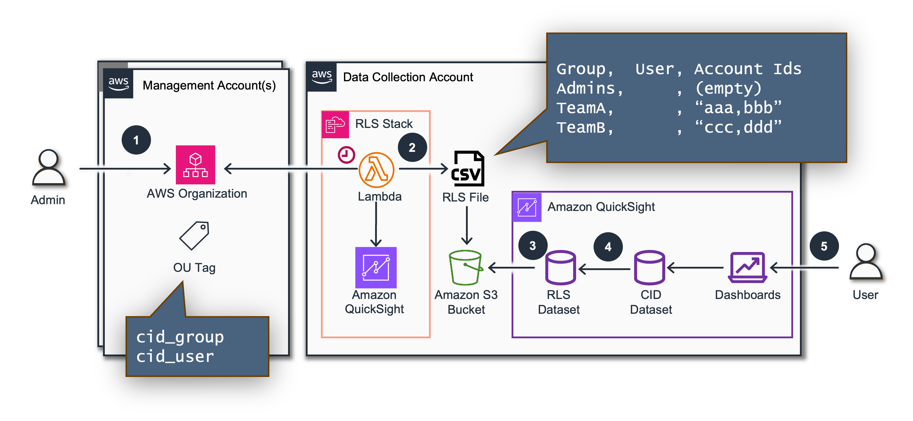

1.  An Admin of
    [AWS Organization](https://aws.amazon.com/organizations/ "https://aws.amazon.com/organizations/") assigns tags per
    AWS OU or per Account.

        * **Tag key**: `cid_user` / **Tag value**: a list
        of email of user (the same as in Quick Sight), with a separator `:`
        * **Tag key**: `cid_group` / **Tag value**: a list of Quick Sight group
        names.
        Tags will be propagated to all children OUs. The more specific tag on
        children OU or on Account level can override values commit from higher
        level OUs.

1.  [Amazon EventBridge](https://aws.amazon.com/eventbridge/ "https://aws.amazon.com/eventbridge/") rule invokes
    an [AWS Lambda](https://aws.amazon.com/lambda/ "https://aws.amazon.com/lambda/"). The Lambda function
    assumes an [IAM Role](https://aws.amazon.com/iam/ "https://aws.amazon.com/iam/") in Management(Payer)
    Accounts and retrieves account tags via the
    [AWS Organizations](https://aws.amazon.com/organizations/ "https://aws.amazon.com/organizations/") API. Also it
    retrieves a list of Users of [Amazon
    Quick Sight](https://aws.amazon.com/quicksight/ "https://aws.amazon.com/quicksight/") in the local AWS Account. Then the Lambda function generates
    a CSV file with RLS rules, and uploads the CSV file to an
    [Amazon S3](https://aws.amazon.com/s3/ "https://aws.amazon.com/s3/") Bucket. (Existing Bucket defined
    during CloudFormation deployment).
1.  [Amazon Quick Sight](https://aws.amazon.com/quicksight/ "https://aws.amazon.com/quicksight/") refreshes the
    RLS dataset every hour.
1.  The **RLS dataset** is applied to Quick Sight datasets.
1.  The **Quick Sight User** can visualize only the data based on RLS rules.

## Step by Step Guide

### Part 1: Roles

If you are deploying this in a linked account you will need a Role in
you Management account to let you access your AWS Organizations Data.
If you already deployed the
[Data Collection Lab](data-collection.md "data-collection.md") you can skip this step.

Login to Management Account and click Launch Stack for deploying
[Permission
Stack](https://github.com/awslabs/cid-framework/tree/main/data-collection/deploy/deploy-data-read-permissions.yaml "https://github.com/awslabs/cid-framework/tree/main/data-collection/deploy/deploy-data-read-permissions.yaml"):

[](https://console.aws.amazon.com/cloudformation/home#/stacks/create/review?&templateURL=https://aws-managed-cost-intelligence-dashboards-us-east-1.s3.amazonaws.com/cfn/data-collection/deploy-data-read-permissions.yaml&stackName=CidDataCollectionReadPermissionsStack&param_DataCollectionAccountID=REPLACE%20WITH%20DATA%20COLLECTION%20ACCOUNT%20ID&param_AllowModuleReadInMgmt=yes&param_OrganizationalUnitID=REPLACE%20WITH%20ORGANIZATIONAL%20UNIT%20ID&param_IncludeBackupModule=no&param_IncludeBudgetsModule=no&param_IncludeComputeOptimizerModule=no&param_IncludeCostAnomalyModule=no&param_IncludeECSChargebackModule=no&param_IncludeInventoryCollectorModule=no&param_IncludeRDSUtilizationModule=no&param_IncludeRightsizingModule=no&param_IncludeTAModule=no&param_IncludeTransitGatewayModule=no&param_IncludeHealthEventsModule=no&param_IncludeCostOptimizationHubModule=no&param_IncludeLicenseManagerModule=no "https://console.aws.amazon.com/cloudformation/home#/stacks/create/review?&templateURL=https://aws-managed-cost-intelligence-dashboards-us-east-1.s3.amazonaws.com/cfn/data-collection/deploy-data-read-permissions.yaml&stackName=CidDataCollectionReadPermissionsStack¶m_DataCollectionAccountID=REPLACE%20WITH%20DATA%20COLLECTION%20ACCOUNT%20ID¶m_AllowModuleReadInMgmt=yes¶m_OrganizationalUnitID=REPLACE%20WITH%20ORGANIZATIONAL%20UNIT%20ID¶m_IncludeBackupModule=no¶m_IncludeBudgetsModule=no¶m_IncludeComputeOptimizerModule=no¶m_IncludeCostAnomalyModule=no¶m_IncludeECSChargebackModule=no¶m_IncludeInventoryCollectorModule=no¶m_IncludeRDSUtilizationModule=no¶m_IncludeRightsizingModule=no¶m_IncludeTAModule=no¶m_IncludeTransitGatewayModule=no¶m_IncludeHealthEventsModule=no¶m_IncludeCostOptimizationHubModule=no¶m_IncludeLicenseManagerModule=no")

1. To ensure full visibility of data across your organization accounts,
   in the parameters section, we recommend to pass the Organization Root ID
   as the organizational unit parameter (OrganizationalUnitID). You can
   check it here:
   [https://console.aws.amazon.com/organizations/v2/home/accounts](https://console.aws.amazon.com/organizations/v2/home/accounts "https://console.aws.amazon.com/organizations/v2/home/accounts")


1. Make sure to select all modules that you want to allow access to your
   organization accounts data. You can check the list of the modules
   [on
   GitHub](https://github.com/awslabs/cid-framework/tree/main/data-collection#modules "https://github.com/awslabs/cid-framework/tree/main/data-collection#modules").


1. Please make sure you specify **Data Collection Account Id** correctly.
   It is not the Management Account Id, its an ID of the dedicated Data
   Collection Account.
2. Click **Next** at the bottom of the **Specify stack details** stage, and
   then, click **Next** again at the bottom of the **Configure stack options**
   stage to move to the **Review** stage. Click **Submit** at the end of the
   **Review** stage to initiate the update. This process will take a few
   minutes until completion.

### Part 2: Tag your AWS Organization Resources

You must tag the AWS Organization Resources with the emails of the
Quick Sight Users that you wish to allow access to see the resources cost
data. The below will show you how to tag a resource and this can be
repeated. We will be using **AWS Quick Sight User Emails**, see more
[here](../../../quicksight/latest/user/managing-users.md "../../../quicksight/latest/user/managing-users.md").
If you have a large list of accounts and want to use a script, please
see the section below [Use script to tag accounts](#row-levelsecutiy-script-to-tag-account "#row-levelsecutiy-script-to-tag-account").

1. Log into your **Management account** then click on the top right hand
   corner on your account and select **Organization**

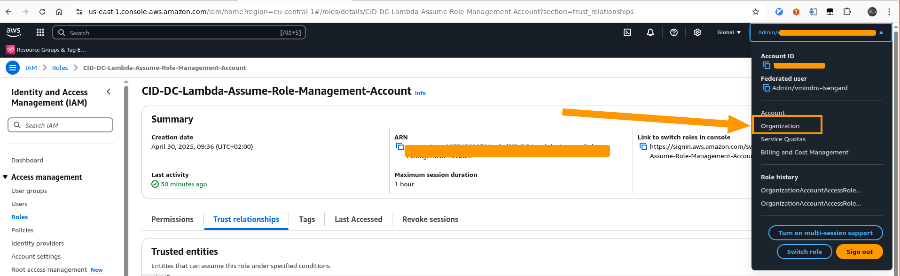

1. Ensure you are on the **AWS accounts** tab

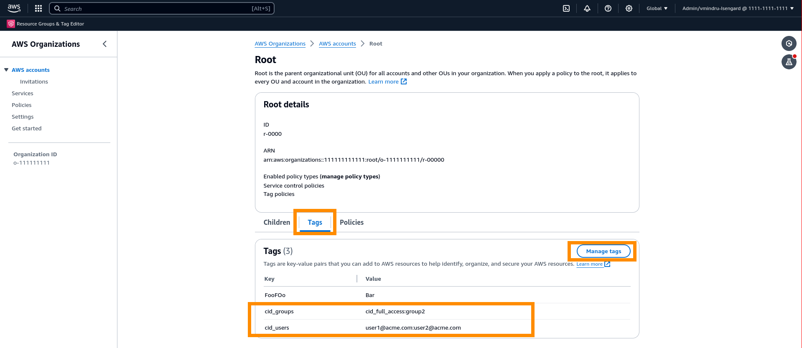

You can select different levels of access. Tag one of the following and then use will have access to all data of that resource and any child accounts below it.

    * Tag an Account
    * Tag an Organization Unit
    * Tag the Root

1. To tag the resource click its name an scroll down to the tag section and click **Manage tags**


1. Add the Key **cid_users** and the Value of any **emails** you wish to allow access. These are colon delimited. Once added click **Save changes**

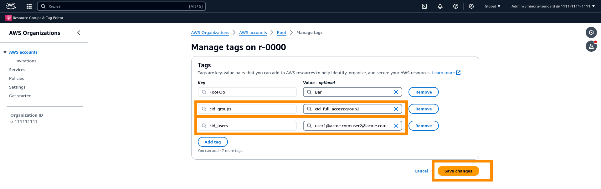

1. Add the Key **cid_groups** and the Value of any **group** you wish to allow access. These are colon delimited. Once added click **Save changes**


1. Repeat on all resources with relevant emails.

### Part 3: Deploy Lambda Function

Using AWS CloudFormation we will deploy the lambda function to collect these
tags. This is done in the Quick Sight Cloud Intelligence Dashboards
Account aka Data Collection Account.

[](<https://console.aws.amazon.com/cloudformation/home?#/stacks/quickcreate?templateURL=https%3A%2F%2Faws-managed-cost-intelligence-dashboards-us-east-1.s3.amazonaws.com%2Fcfn%2Frls%2Fdeploy_cid_rls.yaml&stackName=CIDRowLevelSecurity&param_ResourcePrefix=CID-DC-&param_DestinationBucket=&param_ManagementAccountRole=Lambda-Assume-Role-Management-Account&param_Schedule=rate(1%20hour)&param_CodeBucket=aws-managed-cost-intelligence-dashboards&param_CodeKey=cfn%2Frls%2Fcreate_rls.zip&param_ManagementAccountID=> "https://console.aws.amazon.com/cloudformation/home?#/stacks/quickcreate?templateURL=https%3A%2F%2Faws-managed-cost-intelligence-dashboards-us-east-1.s3.amazonaws.com%2Fcfn%2Frls%2Fdeploy_cid_rls.yaml&stackName=CIDRowLevelSecurity¶m_ResourcePrefix=CID-DC-¶m_DestinationBucket=¶m_ManagementAccountRole=Lambda-Assume-Role-Management-Account¶m_Schedule=rate(1%20hour)¶m_CodeBucket=aws-managed-cost-intelligence-dashboards¶m_CodeKey=cfn%2Frls%2Fcreate_rls.zip¶m_ManagementAccountID=")

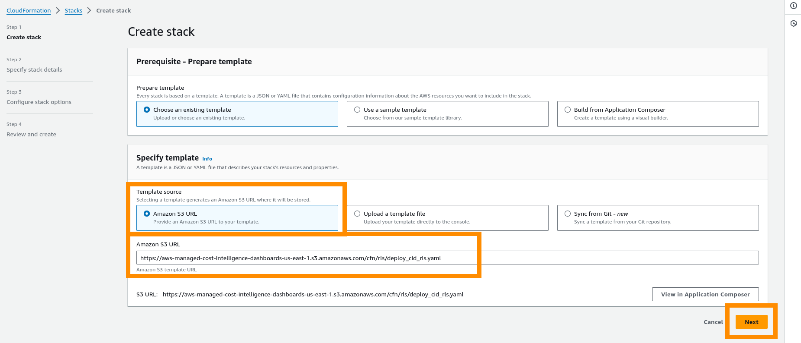

1. Click **Next**.
2. Fill in the Parameters as seen below.
   - `CodeBucket` - LEAVE AS DEFAULT
   - `CodeKey` - LEAVE AS DEFAULT
   - `DestinationBucket` - Amazon S3 Bucket in your account in the same
     region (this can be one from your Optimization data collector where
     where your CUR is stored). This bucket must have access to Amazon
     Quick Sight
   - `ManagementAccountID` - List of Payer/Management Account IDs you
     wish to collect data for. Can just be one Accounts(Ex:
     111222333,444555666,777888999)
   - `ManagementAccountRole` - The name of the IAM role that will be
     deployed in the management account which can retrieve AWS Organization
     data. Default: _Lambda-Assume-Role-Management-Account_ KEEP THE SAME AS
     WHAT IS DEPLOYED INTO MANAGEMENT ACCOUNT
   - `RolePrefix` - This prefix will be placed in front of all roles
     created. Note you may wish to add a dash at the end to make more
     readable. Default: _CID-DC-_
   - `Schedule` - Cron job to trigger the lambda using cloudwatch event.
     Default is every hour.

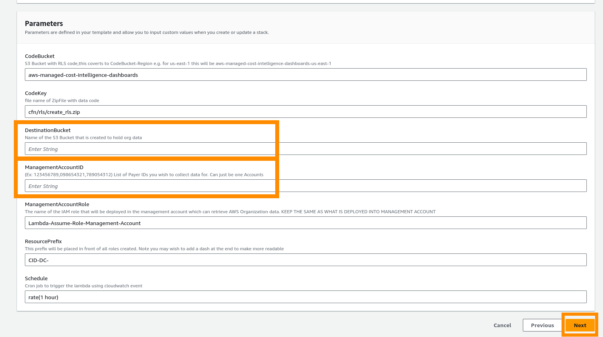

1. Tick the boxes and click **Create stack**.

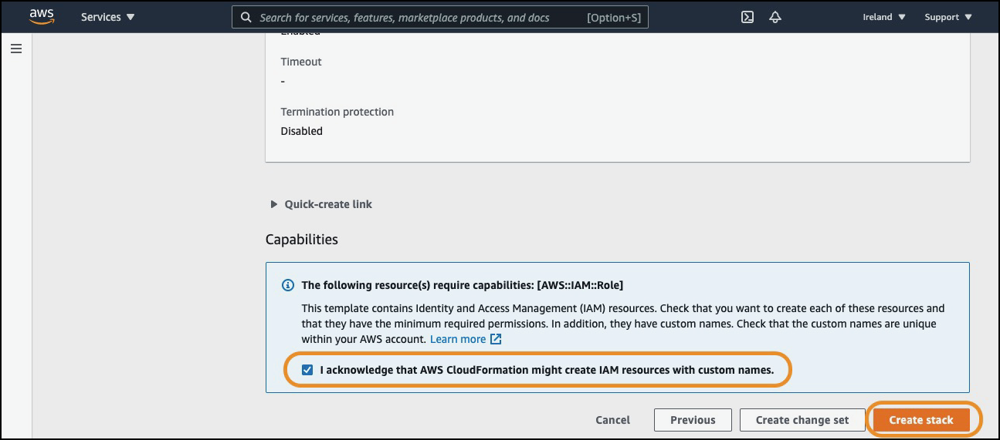

1. Wait until your CloudFormation has a status of **CREATE_COMPLETE**.

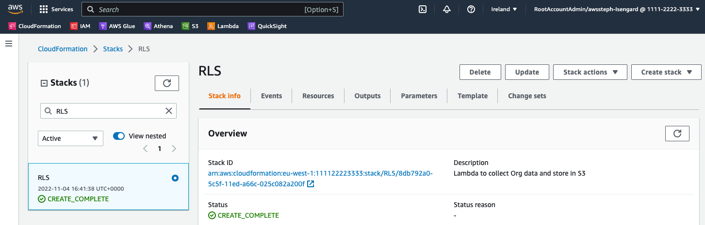

### Part 4: Test Lambda Function

Your lambda functions will run automatically on the schedule you chose
at deployment and will be ready within an hour. However, if you would
like to test your functions please see the steps below. Once you have
deployed your modules you will be able to test your Lambda function to
get your first set of data in Amazon S3.

1. From CloudFormation Click **Resources** and find the Lambda Function and click the Physical ID

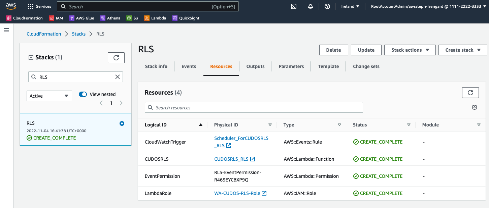

1. To test your Lambda function open respective Lambda in AWS Console and click **Test**

1. Enter an **Event name** of **Test**, click **Create**:

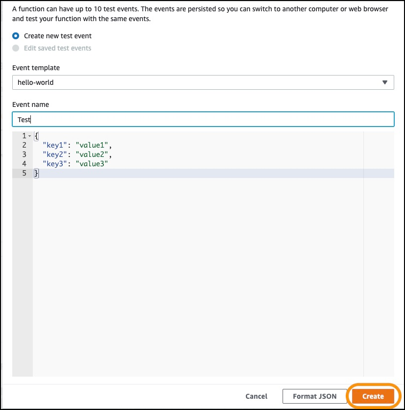

1. Click **Test**
2. The function will run, it will take a minute or two given the size of
   the Organizations files and processing required, then return success.
   Click **Details** and view the output.
3. You can go to your bucket in S3 and there should be a csv file in the
   folder `cid_rls/`.

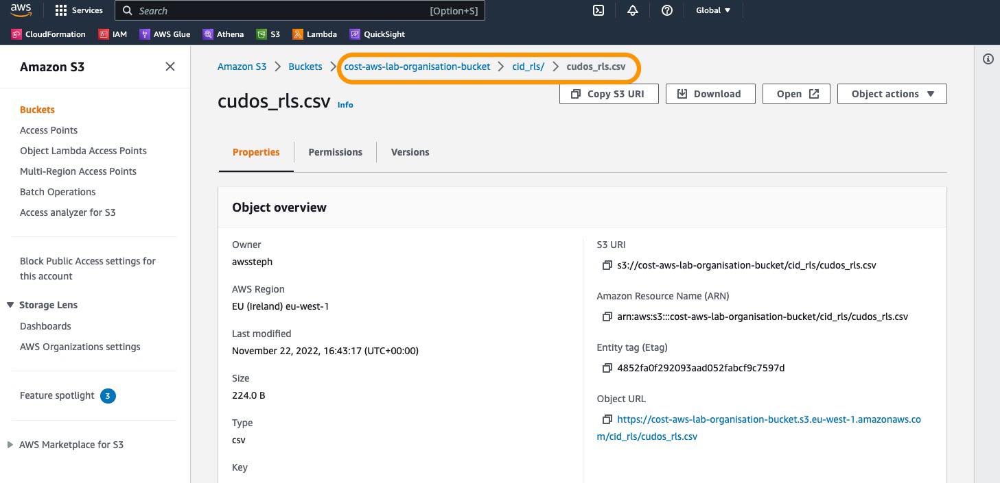

### Part 5: Create RLS

We will now create the RLS Dataset in Amazon Quick Sight and attach it to
your datasets for CID. Please ensure the bucket you have placed the RLS
file into has access to Amazon Quick Sight, see
[here](../../../quicksight/latest/user/troubleshoot-connect-S3.md "../../../quicksight/latest/user/troubleshoot-connect-S3.md")

1. Download and replace `<bucket>` with the bucket you can see your
   data in. If any syntax errors, reference
   [Manifest
   file format for Amazon Quick Sight](../../../quicksight/latest/user/supported-manifest-file-format.md#quicksight-manifest-file-format "../../../quicksight/latest/user/supported-manifest-file-format.md#quicksight-manifest-file-format")

[s3 json manifest file](samples/qs_s3_manifest.json.md "samples/qs_s3_manifest.json.md")

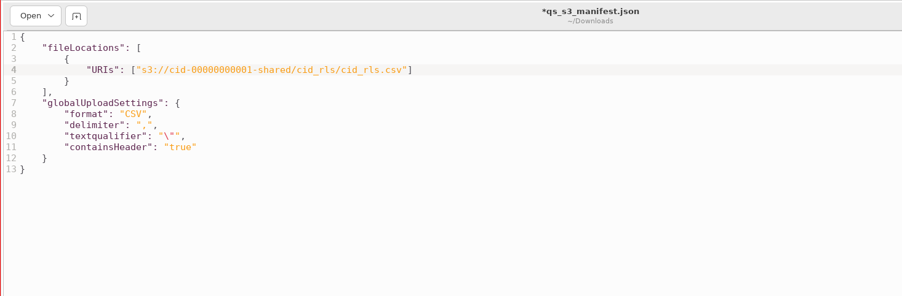

1. Go to Amazon Quick Sight
2. Go to Datasets and click on **New dataset** drop down menu, then click
   on **NEW RULES DATASET**

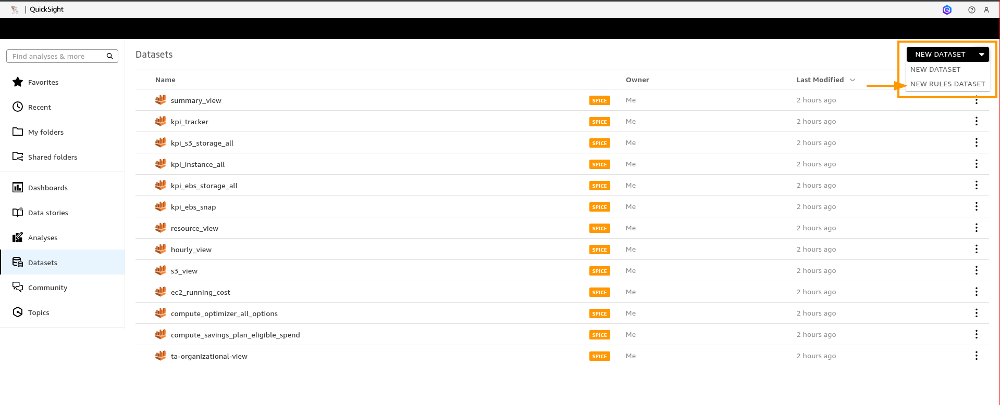

1. Create new Dataset by clicking **S3**

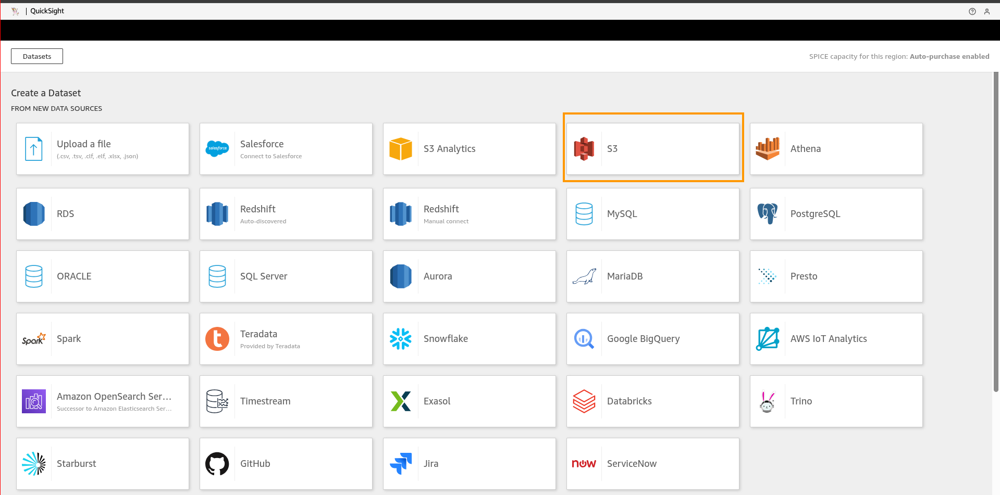

1. Set Data source name as **CID RLS** and the qs_s3_manifest.json file you edited earlier into the **Upload** box

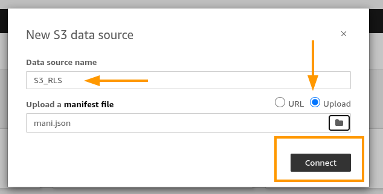

1. In the new Dialogue click **EDIT/PREVIEW Data**

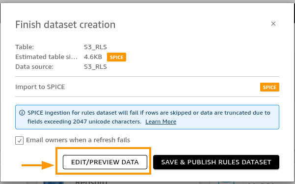

1. Make sure that all Fields on the left are **String** type, if not change the type to **String**

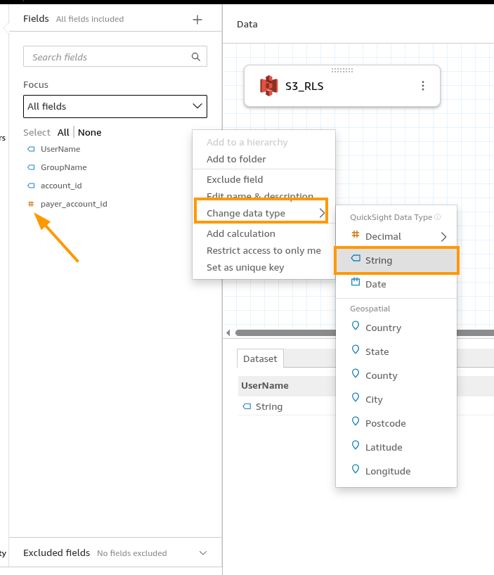

1. Find your new dataset by searching **CID RLS** then click on it


1. Click **Refresh** tab and click **ADD NEW SCHEDULE**, select **Hourly** then click **Save**

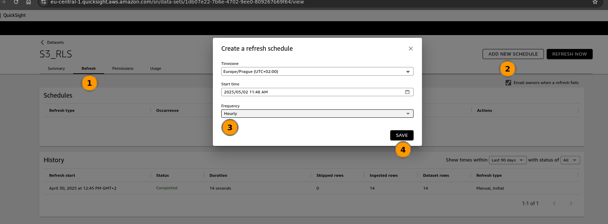

1. Go back to Datasets and select your CID data **summary_view**. On the Summary tab find Row-level security and click **Setup**

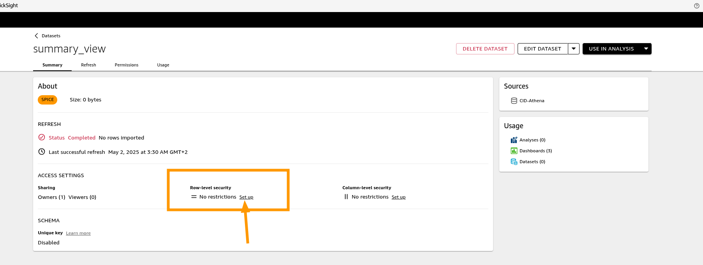

1. Click the toggle **User-based rules** drop down, in the expanded space select the new dataset and after click **APPLY RULES DATASET**

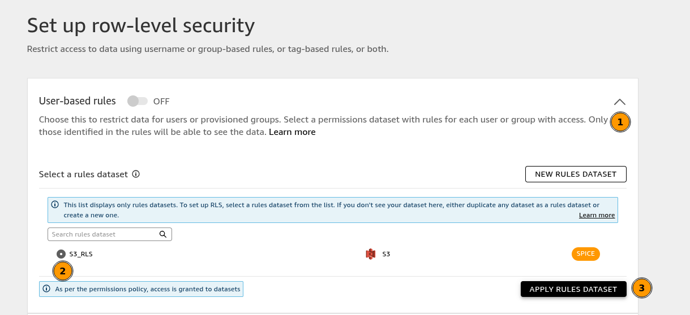

1. Repeat for all other CID Datasets and observe the new **RLS ENABLED** Label on the dataset

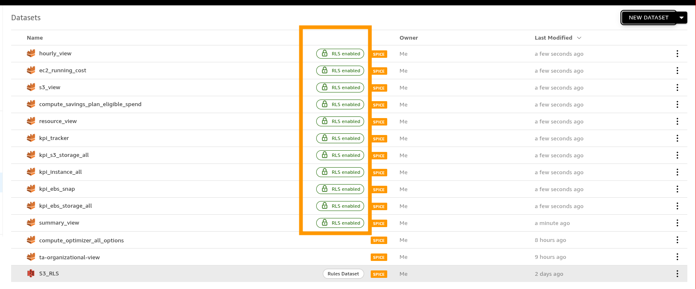

### Part 6: Verify Result

Acess your CID Dashboards, e.g. CUDOS. Expected result is that users
should see only data that they have access to according to your RLS
rules.

###### Warning

Users who are not added to RLS rules will see no data in
Dashboards, this is expected

### Anex 1: Use script to tag accounts

If you have a large number of accounts that need to be tagged then
please use the guide below to do a scripted method to save time.

For this you will need:

- a list of all of your accounts you wish to tag. If you do not have one, you can
  export your AWS Organizations using this
  [guide](../../../organizations/latest/userguide/orgs_manage_accounts_export.md "../../../organizations/latest/userguide/orgs_manage_accounts_export.md")
- a list of all Quick Sight users email which you wish to tag this
  Organization with. Currently you cannot directly download this data but
  you can use the following cli command replacing 111122223333 with your
  Management account
- cli credentials for your management account or ability to create a lambda function and you will find the file in your tmp folder

```
aws quicksight list-users --namespace default --output text --aws-account-id 111122223333 > /tmp/quicksight_user.txt
```

**Steps to tag**

1. Download this [example file](samples/rls_data.csv.md "samples/rls_data.csv.md") and this [code file](samples/aws_org_tagger_lambda.py.md "samples/aws_org_tagger_lambda.py.md") file and save as aws_org_tagger_lambda.py
2. In the file, remove the example line and add your list of account id’s
   in the first column. Then add the relevant Quick Sight users emails that
   you want to have access to the account. Remember if multiple they need
   to be **separated by :**
3. Save this file.
4. You can either run the script using cli or creating a lambda function.

**CLI**

- If CLI then ensure your data.csv file and aws_org_tagger_lambda.py are in the same folder
- Run `python3 aws_org_tagger_lambda.py`

**Lambda**

- Log into your Management account and go to Lambda
- Create new Lambda and call it **Tag-Organization** and use **Python 3.9**
- In the lambda, copy the code from the aws_org_tagger_lambda.py file
- Click on the left hand side of the Environment and click **New File**
- In the file paste your data.csv data making sure it has the comers in it
- Click **Deploy**
- Click on **Configuration** then **Permissions**. There will be a Role Name in blue, click on that link.
- This will take you to IAM where you **Add permissions** > **Attach policies**
- Search for **AWSOrganizationsFullAccess** and add this policy
- Go back to lambda and click to the **Test** tab then the orange **Test** button.
  Now your AWS Organization will have new or updated tags with the data
  from your excel sheet

###### Note

If you would like to turn off RLS you can just toggle the **User-based ON** to **OFF**
