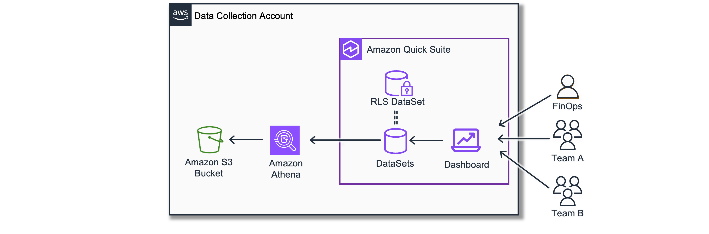
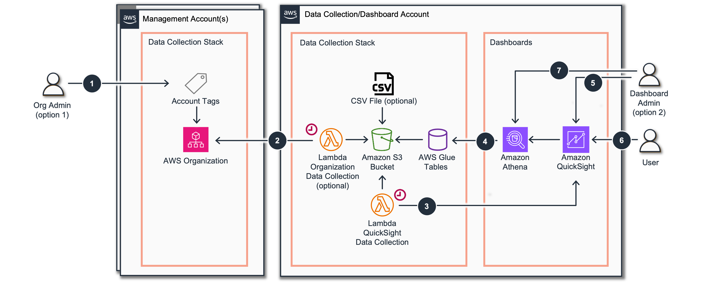
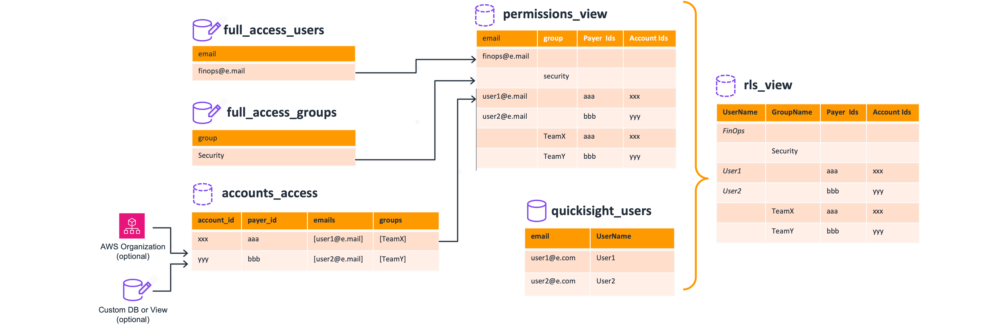

# Row Level Security

## Introduction

Cloud Intelligence Dashboards (CID) provide comprehensive visualization and analysis of AWS cost, usage, and operational data across your organization.

For enterprise customers implementing CID at organizational scale, maintaining the principle of least privilege is essential. Organizations need to ensure users can only access data from AWS accounts they are authorized to view. Amazon Quick Suite [Row Level Security](../../../quickSight/latest/user/restrict-access-to-a-data-set-using-row-level-security.md "../../../quickSight/latest/user/restrict-access-to-a-data-set-using-row-level-security.md") (RLS) addresses this requirement by enabling fine-grained access control at the data level.


This page covers a ready to use CID RLS solution, that you can install and easily configure for your needs. It also enables a wide range of customizations and integrations that you can build on top to adjust to your organization needs.

In the default configuration this solution allows:

- Easily attribute permissions to Quick Suite users and groups.
- Use Account level granularity as well as setting permissions on the level of AWS Organization Unit.
- Easily manage full visibility of permissions for users and groups (typically useful for FinOps and Security teams).

The solution also provides an RLS Dashboard that helps Amazon Quick Suite Administrators easily evaluate and troubleshoot users permissions.

## RLS Dataset

The RLS Dataset is a specialized dataset in Quick Suite that controls data access based on user permissions. Users connect to dashboard as usual but if Dashboard Datasets are configured with RLS, RLS Dataset defines what data users will see on the dashboard.



RLS Dataset contains User and Group mapping to fields that are common in all datasets of the dashboard. In case of CID, by default we use `account_id` and `payer_id` as the common fields to establish Row Level permissions boundaries. You can fine tune this solution to use Tags or other fields but we recommend starting with the default.

For CID dashboards, RLS dataset requires four essential fields:

- **UserName**: The Quick Suite user identifier (must match exactly)
- **GroupName**: The Quick Suite group identifier
- **account_id**: Comma-separated list of AWS accounts the user/group can access
- **payer_id**: Comma-separated list of billing accounts (management accounts)

CID provides ready to use RLS Dataset as a part of the RLS Dashboard, that helps you manage and control your RLS Dataset.

### Access Control Rules

It is important to understand the RLS Dataset and how it works for different cases.

- **No access**: Users not listed in the dataset will see empty dashboards
- **Full access**: Users with empty `account_id` and `payer_id` fields have full data access (recommended for Security, FinOps and Platform teams)
- **Organization access**: Users with empty `account_id` but populated `payer_id` have access to all accounts in the specified AWS Organization

You can create the RLS dataset manually in Quick Suite or use the automated solution provided in this guide. Once created, use the CID-CMD tool to [apply RLS](#how-to-apply-rls "#how-to-apply-rls") to all datasets of a specific dashboard.

## Source of RLS Data

The RLS dataset maps users and groups to the AWS accounts they can access. This mapping information must be stored in a system that enables easy tracking and adjustment. CID supports three options:

1. **AWS Organization Tags (Recommended)**: Stores access information in OU and Account Tags within your AWS Organization’s Management Account. Leverages existing AWS organizational structures but requires Management Account access. CID implements an “Hierarchical Tag” concept where Tags defined at higher levels of the OU hierarchy can be overridden by more specific Tag values at lower levels. This hierarchical approach enables flexible group ownership definition at high organizational levels while allowing for necessary exceptions that adapt to an existing organizational complexity.
2. **Amazon Athena Inline Tables**: Create and edit tables directly within Athena as a low-effort option with significant flexibility. Does not require Management Account access.
3. **CSV Files on Amazon S3**: Simple file-based mapping that doesn’t require Management Account access. Files can be generated as exports from existing Configuration Management Databases (CMDB) and identity providers.

## Architecture



The RLS implementation follows this workflow:

1. **(Optional) Tag Configuration**: Organization Admin sets OU or Account Tags in AWS Console with the following Tag keys:
   1. `cid_users`: Comma-separated list of user emails (must match Quick Suite exactly)
   2. `cid_groups`: Comma-separated list of Quick Suite groups with access
   3. Users and groups with Management Account access inherit access to all organization accounts

2. **(Optional) Organization Data Collection**: Lambda function in Data Collection Stack assumes a role in Management Account, retrieves account and OU information, and stores it in S3
3. **QuickSight Data Collection**: Lambda function collects user information from Amazon Quick Suite in the local account and stores it in the same S3 bucket
4. **RLS Dataset Formation**: Glue Tables and Athena Views create the RLS dataset based on AWS Organization Tags and Quick Suite data
5. **RLS Application**: CID Admin applies RLS to all datasets using the CID-CMD tool
6. **Access Control**: Users see only data from accounts configured for their Quick Suite group or user
7. **(Optional) Admin Override**: CID Admin can manage full admin lists or override mapping using Athena Inline Tables

## How It Works Under the Hood

CID constructs an RLS dataset from several sources.



1. **full_access_users** - is a view or a table that contains a list of emails of users who supposed to have a full unrestricted access to protected datasets. This view can be edited in Athena directly (https://docs.aws.amazon.com/athena/latest/ug/views-managing.html) as [linline table](https://prestodb.io/docs/current/sql/values.htm "https://prestodb.io/docs/current/sql/values.htm") or it can be replaced with the tables that comes from other sources (your identity management or a simple csv file on Amazon S3). We do not recommend using individual users for this and rather prioritize user management with groups, but it can be handy on the initial setup phase. Please make sure you put exactly the same email as you have in Quick Suite.
2. **full_access_groups** - is a view or a table that contains a list of Quick Suite Groups with users who will to have a full unrestricted access to protected datasets. This view can be edited in Athena directly (https://docs.aws.amazon.com/athena/latest/ug/views-managing.html) as [linline table](https://prestodb.io/docs/current/sql/values.htm "https://prestodb.io/docs/current/sql/values.htm") or it can be replaced with the tables that comes from other sources (your identity management or a simple csv file on Amazon S3).
3. **account_access** - a view or a table that has following fields:
   1. `account_id` - AWS Account Id (12 digits)
   2. `payer_id` - an AWS Management Account Id. Users and groups that have access to the `account_id` == `payer_id` will have access to all account under the AWS Organization with this management account id. The tool supports multiple AWS Organizations.
   3. `emails` - a list of emails of users who will have access to the account information (note that it is not a comma separated list but it must be Athena type `ARRAY<VARCHAR>`)
   4. `groups` - a list of Quick Suite Groups who will have access to the account information (note that it is not a comma separated list but it must be Athena type `ARRAY<VARCHAR>`)

4. **permission view** - is a union of several sub tables based on **full_access_users**, **full_access_groups** and **account_access**. It results to a following fields:
   1. `email` - email of users
   2. `group` - a Quick Suite Group
   3. `payer_id` - a comma separated list of accounts
   4. `account_id` - a comma separated list of accounts

5. **quickSight_users** table contains emails and UserName of QS User.
6. **rls_view** is the final form and represents the same fields as **permission view** but instead of user email it will have the QS User Names needed for RLS Dataset.

###### Note

###### In RLS dataset an empty string will result to the full access on the given field.

- if both `payer_id` and `account_id` are empty then the user or the group in this line will have a full access
- if only `payer_id` is provided but `account_id` is empty, the user or the group will have access to all account in the AWS Organization of the given payer Account
- If user/group is not present in the table, no access will be granted - user will see an empty dashboard

## Deployment

## Prerequisites

Before implementing RLS, ensure you have:

1. **(Recommended) QuickSight Configuration**: [Identity Source/SSO](sso-application-legacy.md "sso-application-legacy.md") configured for your Quick Suite environment
2. **CID Foundation**: [Foundational dashboards](cudos-cid-kpi.md "cudos-cid-kpi.md") already installed
3. **Account Access**: Admin access to the Data Collection/Dashboard Account
4. **Management Account Access** (Optional): Required only for AWS Organization Tags option. Alternative options available if not accessible
5. **Data Collection Stack** (Recommended): Preferably installed, but minimal setup instructions provided if needed

## Step 1: Define Your RLS Data Source and Deploy

Choose one of the three options described [above](#source-of-rls-data "#source-of-rls-data") to define your RLS data source:

If you have already [CID Data Collection Stack](data-collection.md "data-collection.md") you can just check if Quick Suite and OrganizationData modules are activated, and continue to the next step.

Here we will use the minimal setup for managing access from AWS Organization OU and Account Tags.

1. Login to Management Account(s) and install the Permission Stack by clicking Launch Stack below

[](https://console.aws.amazon.com/cloudformation/home#/stacks/create/review?&templateURL=https://aws-managed-cost-intelligence-dashboards-us-east-1.s3.amazonaws.com/cfn/data-collection/deploy-data-read-permissions.yaml&stackName=CidDataCollectionReadPermissionsStack&param_DataCollectionAccountID=REPLACE%20WITH%20DATA%20COLLECTION%20ACCOUNT%20ID%20OR%20EMPTY&param_AllowModuleReadInMgmt=no&param_OrganizationalUnitID=REPLACE%20WITH%20ORGANIZATIONAL%20UNIT%20ID%20OR%20EMPTY&param_IncludeBackupModule=no&param_IncludeBudgetsModule=no&param_IncludeComputeOptimizerModule=no&param_IncludeCostAnomalyModule=no&param_IncludeECSChargebackModule=no&param_IncludeInventoryCollectorModule=no&param_IncludeRDSUtilizationModule=no&param_IncludeRightsizingModule=no&param_IncludeTAModule=no&param_IncludeTransitGatewayModule=no&param_IncludeHealthEventsModule=no&param_IncludeCostOptimizationHubModule=no&param_IncludeLicenseManagerModule=no "https://console.aws.amazon.com/cloudformation/home#/stacks/create/review?&templateURL=https://aws-managed-cost-intelligence-dashboards-us-east-1.s3.amazonaws.com/cfn/data-collection/deploy-data-read-permissions.yaml&stackName=CidDataCollectionReadPermissionsStack¶m_DataCollectionAccountID=REPLACE%20WITH%20DATA%20COLLECTION%20ACCOUNT%20ID%20OR%20EMPTY¶m_AllowModuleReadInMgmt=no¶m_OrganizationalUnitID=REPLACE%20WITH%20ORGANIZATIONAL%20UNIT%20ID%20OR%20EMPTY¶m_IncludeBackupModule=no¶m_IncludeBudgetsModule=no¶m_IncludeComputeOptimizerModule=no¶m_IncludeCostAnomalyModule=no¶m_IncludeECSChargebackModule=no¶m_IncludeInventoryCollectorModule=no¶m_IncludeRDSUtilizationModule=no¶m_IncludeRightsizingModule=no¶m_IncludeTAModule=no¶m_IncludeTransitGatewayModule=no¶m_IncludeHealthEventsModule=no¶m_IncludeCostOptimizationHubModule=no¶m_IncludeLicenseManagerModule=no") 2. Login to Data Collection/Dashboard Account and install the Data Collection Stack by clicking Launch Stack below. Put Management Account Ids parameter as a comma separated list of your Management Accounts.

[](https://console.aws.amazon.com/cloudformation/home#/stacks/create/review?&templateURL=https://aws-managed-cost-intelligence-dashboards-us-east-1.s3.amazonaws.com/cfn/data-collection/deploy-data-collection.yaml&stackName=CidDataCollectionStack&param_ManagementAccountID=REPLACE%20WITH%20MANAGEMENT%20ACCOUNT%20ID&param_IncludeTAModule=no&param_IncludeRightsizingModule=no&param_IncludeCostAnomalyModule=no&param_IncludeInventoryCollectorModule=no&param_IncludeComputeOptimizerModule=no&param_IncludeECSChargebackModule=no&param_IncludeRDSUtilizationModule=no&param_IncludeOrgDataModule=yes&param_IncludeBudgetsModule=no&param_IncludeTransitGatewayModule=no&param_IncludeHealthEventsModule=no&param_IncludeQuickSightModule=yes "https://console.aws.amazon.com/cloudformation/home#/stacks/create/review?&templateURL=https://aws-managed-cost-intelligence-dashboards-us-east-1.s3.amazonaws.com/cfn/data-collection/deploy-data-collection.yaml&stackName=CidDataCollectionStack¶m_ManagementAccountID=REPLACE%20WITH%20MANAGEMENT%20ACCOUNT%20ID¶m_IncludeTAModule=no¶m_IncludeRightsizingModule=no¶m_IncludeCostAnomalyModule=no¶m_IncludeInventoryCollectorModule=no¶m_IncludeComputeOptimizerModule=no¶m_IncludeECSChargebackModule=no¶m_IncludeRDSUtilizationModule=no¶m_IncludeOrgDataModule=yes¶m_IncludeBudgetsModule=no¶m_IncludeTransitGatewayModule=no¶m_IncludeHealthEventsModule=no¶m_IncludeQuickSightModule=yes") 3. Once installed, you can go to AWS Organization in the Management Account and configure tags as follows:

    1. `cid_group` as comma separated Quick Suite Group.
    2. and/or `cid_user` as comma separated emails of individual users

4. After update you can launch execution of the data collection using a [StepFunction](https://console.aws.amazon.com/states/home "https://console.aws.amazon.com/states/home")
   `CID-DC-organizations-StateMachine`.
5. You can validate data using following query:

```
SELECT * FROM "organization_data"
```

The Data Collection is needed to collect data from local Quick Suite account and store on the local S3 bucket.

1. Login to Data Collection/Dashboard Account and install the Data Collection Stack by clicking Launch Stack below. If you have already [CID Data Collection Stack](data-collection.md "data-collection.md") you can just check if Quick Suite and OrgData modules are activated, and continue to the next item.

[](https://console.aws.amazon.com/cloudformation/home#/stacks/create/review?&templateURL=https://aws-managed-cost-intelligence-dashboards-us-east-1.s3.amazonaws.com/cfn/data-collection/deploy-data-collection.yaml&stackName=CidDataCollectionStack&param_ManagementAccountID=&param_IncludeTAModule=no&param_IncludeRightsizingModule=no&param_IncludeCostAnomalyModule=no&param_IncludeInventoryCollectorModule=no&param_IncludeComputeOptimizerModule=no&param_IncludeECSChargebackModule=no&param_IncludeRDSUtilizationModule=no&param_IncludeOrgDataModule=no&param_IncludeBudgetsModule=no&param_IncludeTransitGatewayModule=no&param_IncludeHealthEventsModule=no&param_IncludeQuickSightModule=yes "https://console.aws.amazon.com/cloudformation/home#/stacks/create/review?&templateURL=https://aws-managed-cost-intelligence-dashboards-us-east-1.s3.amazonaws.com/cfn/data-collection/deploy-data-collection.yaml&stackName=CidDataCollectionStack¶m_ManagementAccountID=¶m_IncludeTAModule=no¶m_IncludeRightsizingModule=no¶m_IncludeCostAnomalyModule=no¶m_IncludeInventoryCollectorModule=no¶m_IncludeComputeOptimizerModule=no¶m_IncludeECSChargebackModule=no¶m_IncludeRDSUtilizationModule=no¶m_IncludeOrgDataModule=no¶m_IncludeBudgetsModule=no¶m_IncludeTransitGatewayModule=no¶m_IncludeHealthEventsModule=no¶m_IncludeQuickSightModule=yes") 2. Create an inline Athena Table that simulates Data Collection organization_data, but can be edited directly in Athena to manage access.

```
CREATE OR REPLACE VIEW "cid_cur"."organization_data" AS
WITH accounts AS (
  SELECT *
  FROM (
    VALUES
      ROW ('1111111111111111', '1111111111111111', ARRAY['user11@e.mail', 'user12@e.mail'], ARRAY['group11', 'group12'])
    , ROW ('2222222222222222', '1111111111111111', ARRAY['user21@e.mail', 'user22@e.mail'], ARRAY['group21', 'group22'])
    , ROW ('3333333333333333', '1111111111111111', ARRAY['user31@e.mail', 'user32@e.mail'], ARRAY['group31', 'group32'])
  )  ignored_table_name ("account_id", "payer_id", "emails", "groups")
)
SELECT
  account_id as Id,
  payer_id as ManagementAccountId,
  ARRAY[
    CAST(ROW('cid_users', array_join("emails", ',')) AS ROW(key VARCHAR, value VARCHAR)),
    CAST(ROW('cid_groups', array_join("groups", ',')) AS ROW(key VARCHAR, value VARCHAR))
  ] as HierarchyTags
FROM accounts
```

1. Login to Data Collection/Dashboard Account and install the Data Collection Stack by clicking Launch Stack below

[](https://console.aws.amazon.com/cloudformation/home#/stacks/create/review?&templateURL=https://aws-managed-cost-intelligence-dashboards-us-east-1.s3.amazonaws.com/cfn/data-collection/deploy-data-collection.yaml&stackName=CidDataCollectionStack&param_ManagementAccountID=&param_IncludeTAModule=no&param_IncludeRightsizingModule=no&param_IncludeCostAnomalyModule=no&param_IncludeInventoryCollectorModule=no&param_IncludeComputeOptimizerModule=no&param_IncludeECSChargebackModule=no&param_IncludeRDSUtilizationModule=no&param_IncludeOrgDataModule=no&param_IncludeBudgetsModule=no&param_IncludeTransitGatewayModule=no&param_IncludeHealthEventsModule=no&param_IncludeQuickSightModule=yes "https://console.aws.amazon.com/cloudformation/home#/stacks/create/review?&templateURL=https://aws-managed-cost-intelligence-dashboards-us-east-1.s3.amazonaws.com/cfn/data-collection/deploy-data-collection.yaml&stackName=CidDataCollectionStack¶m_ManagementAccountID=¶m_IncludeTAModule=no¶m_IncludeRightsizingModule=no¶m_IncludeCostAnomalyModule=no¶m_IncludeInventoryCollectorModule=no¶m_IncludeComputeOptimizerModule=no¶m_IncludeECSChargebackModule=no¶m_IncludeRDSUtilizationModule=no¶m_IncludeOrgDataModule=no¶m_IncludeBudgetsModule=no¶m_IncludeTransitGatewayModule=no¶m_IncludeHealthEventsModule=no¶m_IncludeQuickSightModule=yes") 2. Create a CSV file (ex: `file.csv`):

```
"account_id", "payer_id", "emails", "groups"
"1111111111111111", "1111111111111111", "user11@e.mail,user12@e.mail", "group11,group12"
"2222222222222222", "1111111111111111", "user21@e.mail,user12@e.mail", ""
"3333333333333333", "1111111111111111", "", "group31,group32"
```

3. Upload CSV file to an Amazon S3 Bucket. Please use an existing Bucket that Quick Suite already has access to. Example: `cid-{account-id}-data-exports` or `cid-data-{account-id}`. You can use either the web interface or the command line:

```
account_id=$(aws sts get-caller-identity --query "Account" --output text)
aws s3 cp ./file.csv s3://cid-data-${account_id}/my_accounts/file.csv
```

4. Login to AWS Console, select Athena Service and Create a Table:

```
CREATE EXTERNAL TABLE "cid_cur"."my_accounts" (
    "account_id" string,
    "payer_id" string,
    "emails" string,
    "groups" string
)
ROW FORMAT SERDE 'org.apache.hadoop.hive.serde2.OpenCSVSerde'
WITH SERDEPROPERTIES (
    'separatorChar' = ',',
    'quoteChar' = '"',
    'escapeChar' = '\\'
)
STORED AS TEXTFILE
LOCATION 's3://cid-data-${account_id}/my_accounts/' -- REPLACE ${account_id} WITH YOUR ACCOUNT ID
TBLPROPERTIES (
    'has_encrypted_data'='false',
    'skip.header.line.count'='1'
);
```

5. Verify the table

```
SELECT * FROM "cid_cur"."my_accounts"
```

6. Create a view that simulates organization_data table

```
CREATE OR REPLACE VIEW "cid_cur"."organization_data" AS
  account_id as Id,
  payer_id as ManagementAccountId,
  ARRAY[
    CAST(ROW('cid_users',  "emails")) AS ROW(key VARCHAR, value VARCHAR)),
    CAST(ROW('cid_groups', "groups")) AS ROW(key VARCHAR, value VARCHAR))
  ] as HierarchyTags
FROM "cid_cur"."my_accounts"
```

## Step 2: Install RLS Dashboard and Verify Configuration

1. **Access Terminal**: Login to Amazon CloudShell or use your local terminal
2. **Install CID-CMD Tool**:

```
pip3 install -U cid-cmd
```

3. **Deploy RLS Dashboard**:

```
cid-cmd deploy --dashboard-id cid-rls
```

4. **Verify Dashboard**: Check the dashboard in Quick Suite. Ensure the dataset updates and displays data (may take several minutes after deployment)
5. **Configure Admin Access**: Edit Athena views **full_access_users** and **full_access_groups** replace placeholders with your admin users and groups for full dashboard access. After modifying data, refresh the `rls_dataset` dataset.

## Step 3: Apply RLS to Dashboards

1. **Access Terminal**: Login to Amazon CloudShell or use your local terminal
2. **Install CID-CMD Tool** (if not already installed):

```
pip3 install -U cid-cmd
```

3. **Enable RLS**: Update dashboard with RLS enabled. The tool will guide you through selecting the dashboard and RLS dataset, then update all associated datasets:

```
cid-cmd update --force --recursive --rls ENABLE
```

4. **RLS Management Options**:
   - Disable RLS: `--rls DISABLE`
   - Remove RLS: `--rls CLEAR`

## FAQ / Operations Guide

### How can I verify the access rights?

- **Review RLS Dataset**: Open the RLS Dashboard and verify the content of the RLS dataset
- **Test with Additional User**: Create an additional Quick Suite user for testing (note: additional costs apply, delete after testing)

### How can I manage users and groups with full access?

- **Athena Views**: Edit the **full_access_users** and **full_access_groups** views in Athena as inline tables
- **Dataset Refresh**: After modifications, refresh the `cid_rls` dataset in Quick Suite
- **CSV Alternative**: Configure a CSV file on S3 for more flexibility (views remain customizable and won’t be overwritten during updates)

### How do I apply RLS to other dashboards?

Use the CID-CMD tool to enable RLS on any dashboard:

```
cid-cmd update --force --recursive --rls ENABLE
```

**Management Options**: \* Disable: `--rls DISABLE` \* Remove: `--rls CLEAR`

### How do I check the RLS status for all datasets?

Use the CID-CMD status command:

```
cid-cmd status
```

### How can I configure mapping between user groups and business units?

This guide focuses on AWS Account ID-based access, but you can adapt it for [Organizational Taxonomy](add-org-taxonomy.md "add-org-taxonomy.md"):

- Use Account Tags or Resource Tags for business unit mapping
- Create a custom RLS dataset with **UserName**, **GroupName**, and the same field configured as dashboard [Organizational Taxonomy](add-org-taxonomy.md "add-org-taxonomy.md")

## Authors

- Stephanie Gooch, Sr. Commercial Architect, AWS OPTICS
- Veaceslav Mindru, Sr. Technical Account Manager, AWS
- Iakov Gan, Ex-Amazonian

## Feedback

Follow [Feedback & Support](feedback-support.md "feedback-support.md").
