# SaaS Unit Metrics

## Last Updated

November 2023

## Introduction

From time to time, customers will have concerns such as: "my AWS bills
are going up and I don’t know whether that’s a good thing or a bad
thing". Did the bill go up because they are operating more workloads in
the cloud, or is it because they are using AWS inefficiently? … Perhaps,
a little bit of both. Regardless of the reason, the most often
encountered interpretation is that more spend is bad. That isn’t always
the case.

When your AWS invoice is viewed without the appropriate context, it is
hard to tell if an increase in spend is a result of delivering more
value from your use of the Cloud, or if it is due to inefficient and
wasteful resource consumption. Being able to tell the difference is
important. You’re now likely asking: "well, how do I tell the
difference?" … Simply stated: with unit metrics.

This hands-on lab will guide you through the steps required to add your
business data to a visualization that represents a "cost-per" unit
metric. This will provide context to as to whether changes to your AWS
Cloud architecture and operations are improving, maintaining, or eroding
gross profit margins.

## Source Some Metrics

For this example, we will use the number of API calls to our service on
a daily basis. To acquire something that resembles real life, we will
use [these publicly available statistics](https://stats.boomi.com/ "https://stats.boomi.com/"). We
are going to use the day the API requests took place to map the data to
the existing datasets for cost and usage in your dashboards. Make sure
you have the date formatted as a
[date
format](../../../quicksight/latest/user/supported-date-formats.md "../../../quicksight/latest/user/supported-date-formats.md") in your spreadsheet.

1. Create a CSV file with this data.
2. Go to Quick Sight>>Datasets and click **New dataset**.
3. Click on upload a file. Select the CSV you’ve created. Click next then click **Edit settings and prepared data**.

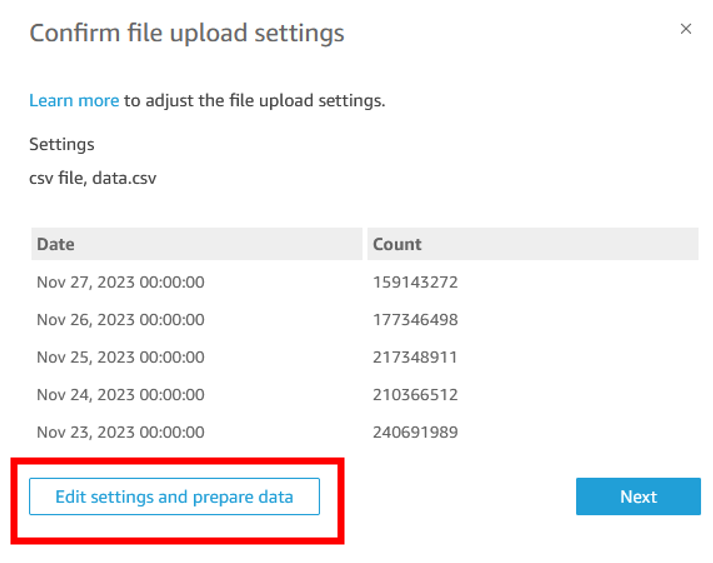 4. Make sure that the date field in your dataset is of type _date_.
Change it if it is not.

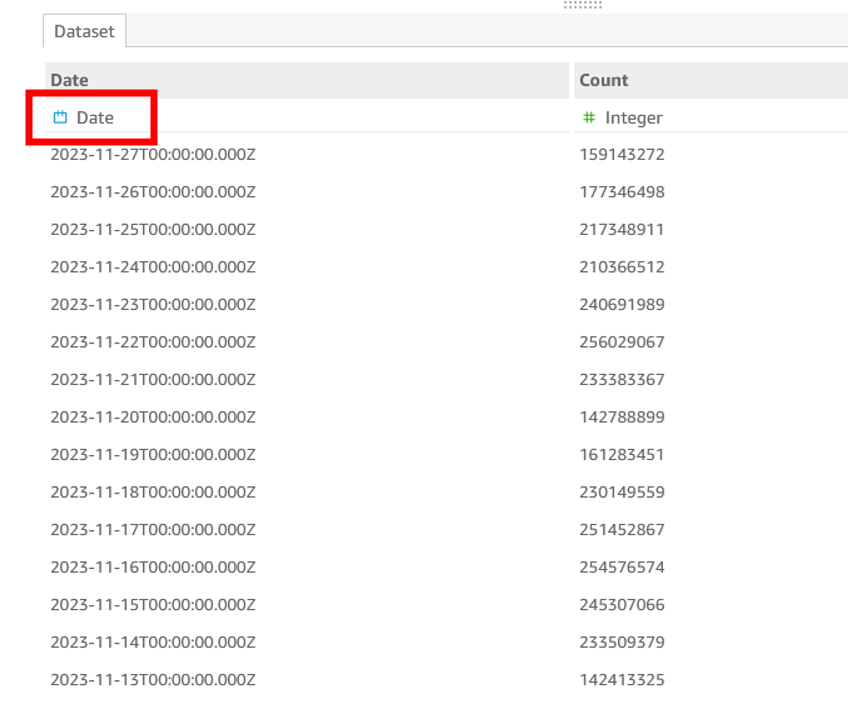 5. Click **Save & Publish** and return to the list of your datasets in
Quick Sight. 6. Click on summary_view and select **EDIT DATASET**.

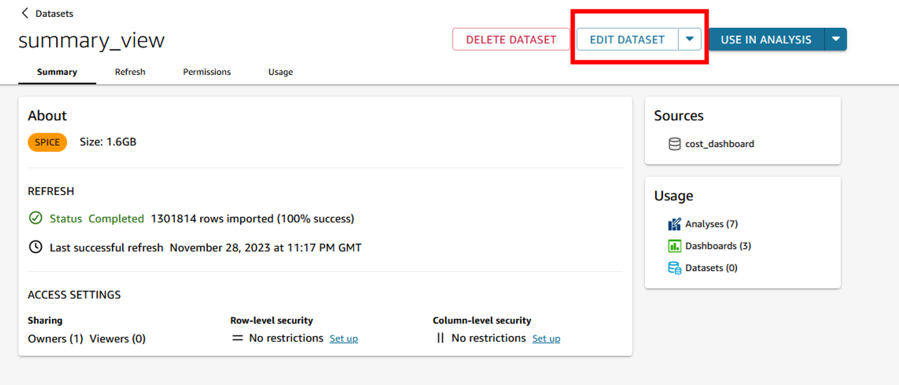 7. Click on **Add data**. Select from a dataset. Find your uploaded dataset
and click **Select**.

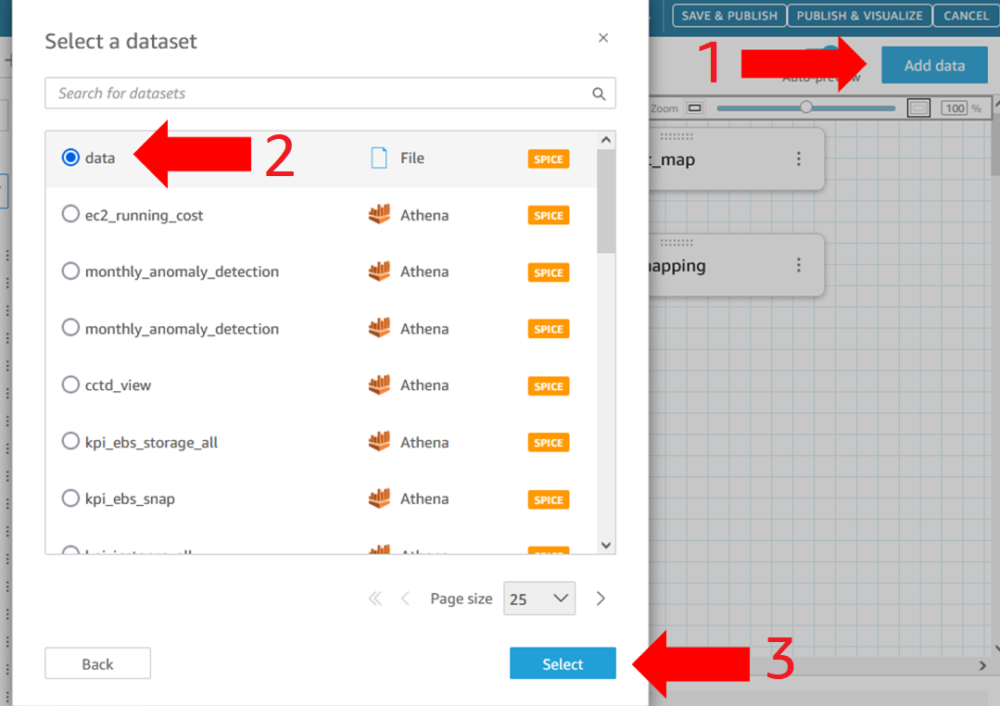 8. Click on the two pink dots next to your dataset. Select **Left** in the
join clauses section below select the _Usage_Date_ field on the left for
**Summary_View** and the _Date_ field from your uploaded dataset on the
right. Click **Apply**. Then click **Save & publish**.

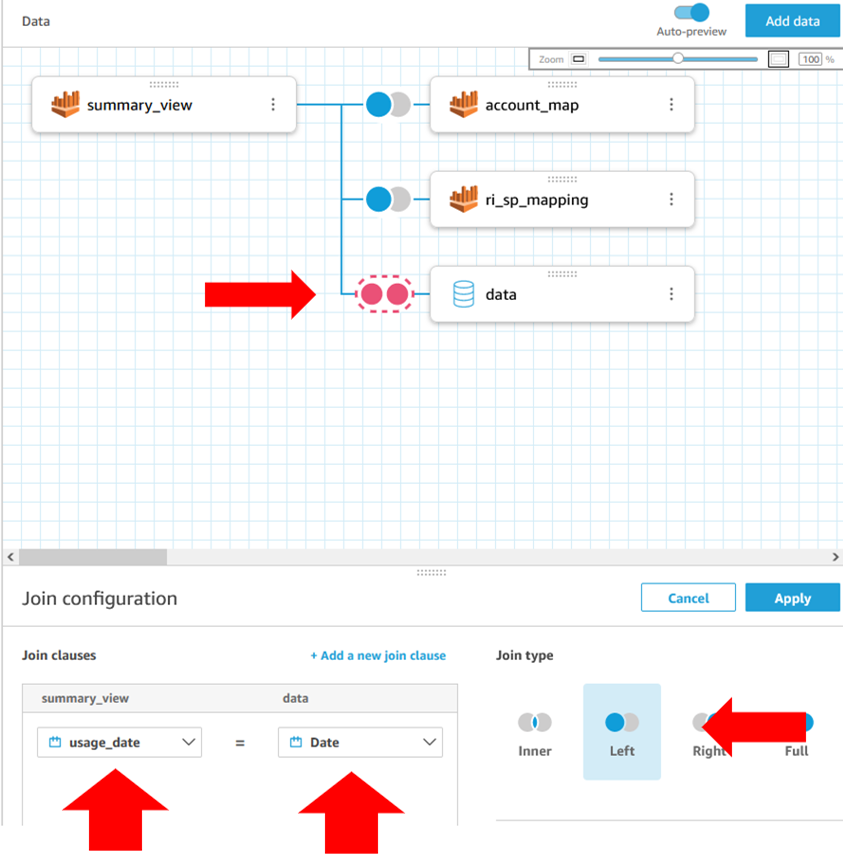

## Customize your Dashboard

For this guide we will use the Cost Intelligence Dashboard deployed in
the earlier part of this lab.

1. Open the **Analysis** version of your dashboard so we can edit it. Start
   by adding a new tab on the far right side of the dashboard. Rename it to
   "Unit Metrics".

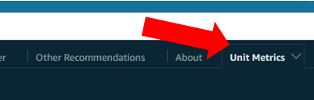 2. Lets start by creating a _per API cost_ field. On the top right click
**Insert** and then **Add calculated field**.

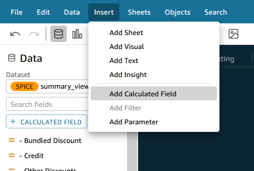 3. Call it _Cost per API Call_ and add syntax to divide your Cost field
by the new API Count field you imported. Click save.

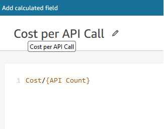 4. Let’s add a visual that shows us our new Cost per API call day over
day. Click **Visualize** and select **Add visual**. Drag over your new Cost
Per API Call field into the new visuals.

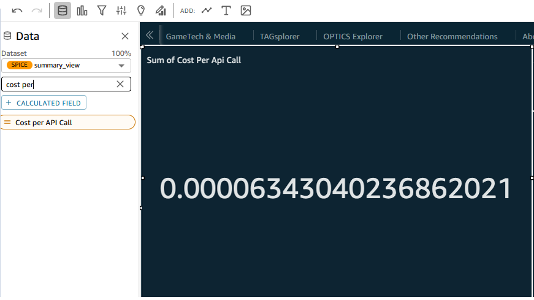 5. Let’s change this to a line graph that shows day-over-day trends.
Click on the Line Chart visual type. Next, add the usage_date field to
your X axis.

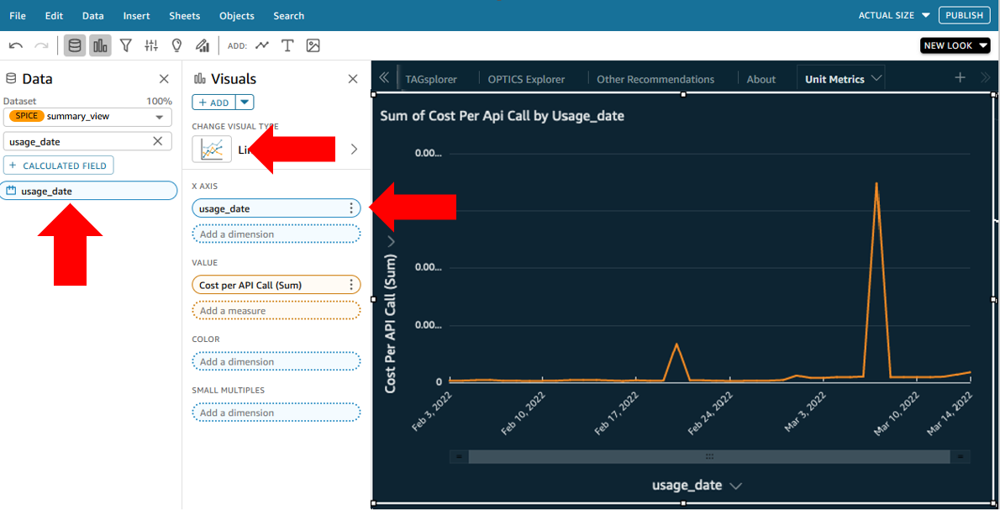 6. We now see our per API call unit cost day-over-day. Lets map the
number of API calls on top of this to see the correlation.

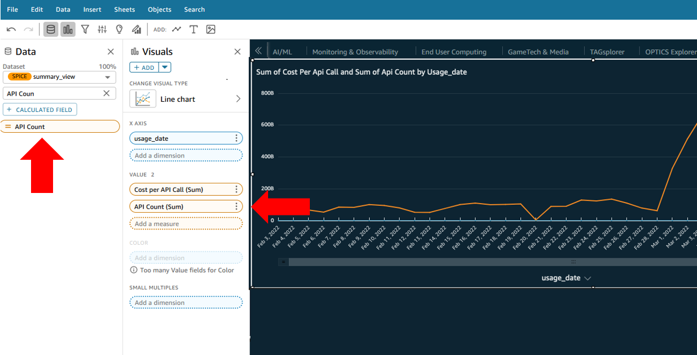 7. Tough to see it if our AWS spend is small. Let’s give the API count
its own Y axis.

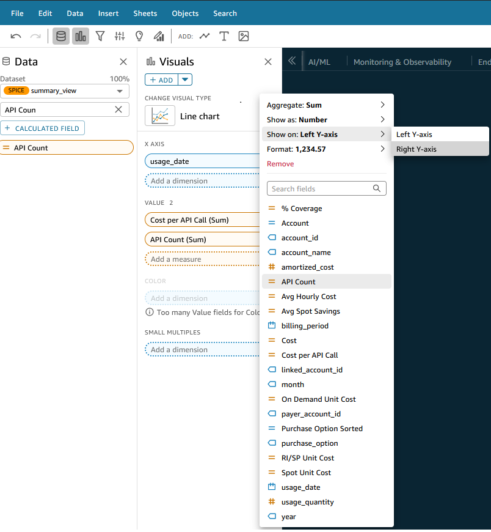 8. Now we have a visual that shows us the correlation between API counts
and the cost per API on that day. But it might be difficult to talk
about a cost per API call if its less than $0.01 on average. So how do
we adjust the multiplier so we can talk about cost per 10,000 API
requests? We will add a control and a parameter in Quick Sight to
accomplish this. Click on **Data**, then **Add Parameters**. Set it to an
**intInteger**, give it a name, and set the default to 10.

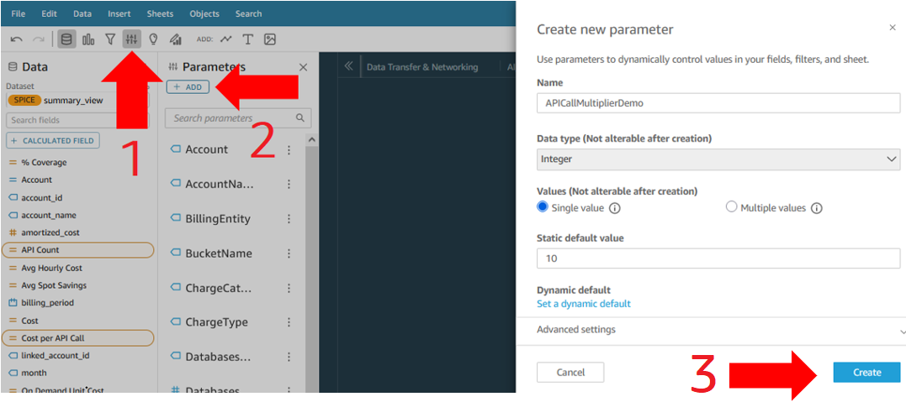 9. On the next selection screen, pick **Control**. On the next screen, give
the control a name (this will be seen in the dashboard), select Dropdown
or List for Style, and put in some multiplier options. I chose 1 through
1 million by orders of magnitude. Check "Hide select all option…".

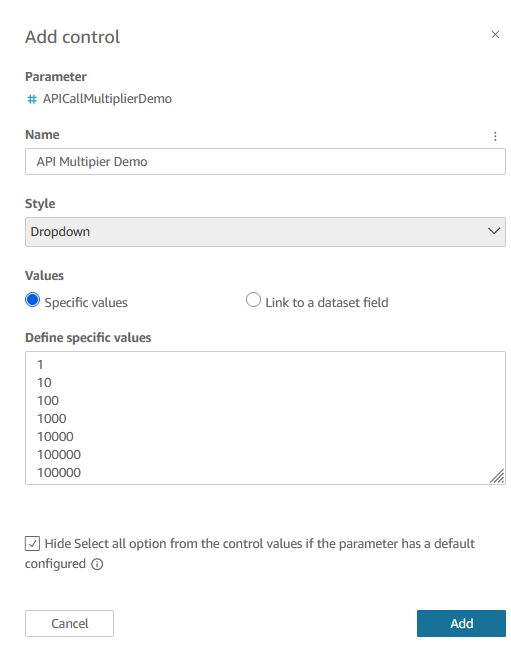 10. The control will appear at the top of your dashboard. Click on it,
click the three dots, select **Move to sheet**. Position it at the top or
wherever you like.

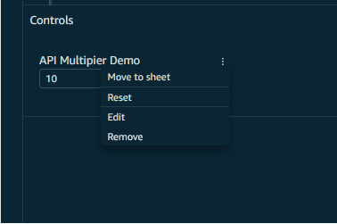 11. Now we need to tie whatever someone selects here to the actual per API
cost value. Create a **new calculated field** called Adjusted API Count
and set it to be {API Count}/${APIcallmultiplier}\_. The
_APIcallmultiplier_ is the name of the parameter you just created. Click
save. Next swap the API count field for the new Adjusted API Count
calculated field. Finally, edit the **Cost Per API Call** calculated field
we created in step 3 to be Cost/{Adjusted API Count}.

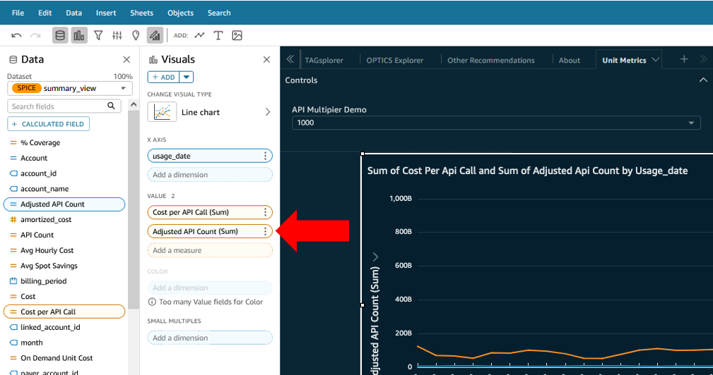 12. Now when you select a multiplier from your drop down or list, the cost
per API call amounts in the graph should change by that order of
magnitude. 13. Lets add a few more visuals to get you familiar with what else you can
do. Create a new visual, and in the **Visual Types** section choose KPI
indicator. 14. In the Field Wells along the top of the dashboard put the **usage_date**
in as the Trend group, click on the arrow next to it and select
**Aggregate** and choose month. Next, put the Cost Per API call field into
the Value box. And finally, to get rid of all those decimal places,
select the Cost per API call field in the well, click on the down arrow
next to it and select **Show as: Currency**.

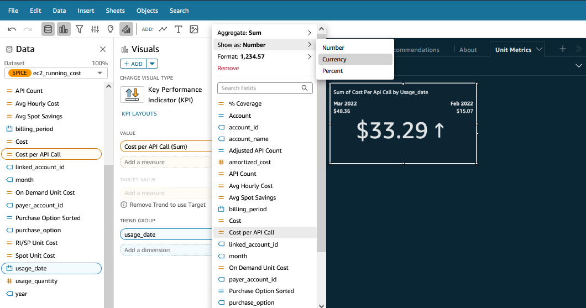 15. Now we can see how our cost per API call month-over-month changed from
this month to the prior month. Finally, lets add a table where you can
dig into the details and see cost per API call per service, per tag, per
business unit, per account, per region, etc. 16. Create a new visual and set the visual type to **Pivot Table**. In the
Values field well put Cost Per API Call set to Currency. In columns put
usage_date set to aggregate monthly. In rows, put the dimensions you
want to group on, for example tags, service, and operation.

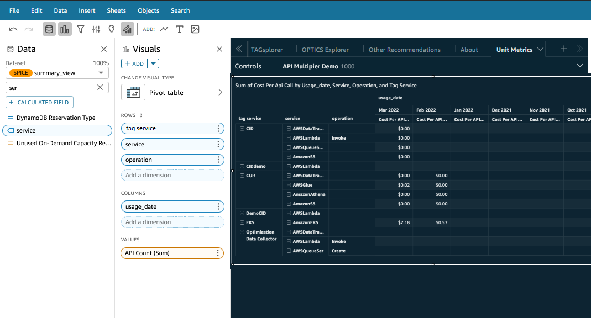

###### Note

Note the little plus and minus signs next to the values in the
columns and rows to the left. You can click on them to zoom in and see
more granularity. For example, pick a tag value in the first column and
click plus, then click plus on the relevant service, then click plus
again to see the operations. Now you should be able to see the cost per
API per operation, grouped by tag and service.

## Next Steps

1. Now that you know how to add controls, you might consider adding a
   control for a start date and end date to give users the ability to set
   the time being considered across all the visuals.
2. Explore
   [Quick Sight
   forecast](../../../quicksight/latest/user/forecasts-and-whatifs.md "../../../quicksight/latest/user/forecasts-and-whatifs.md") features to see if you can forecast what your cost per API
   call will be in the future.
