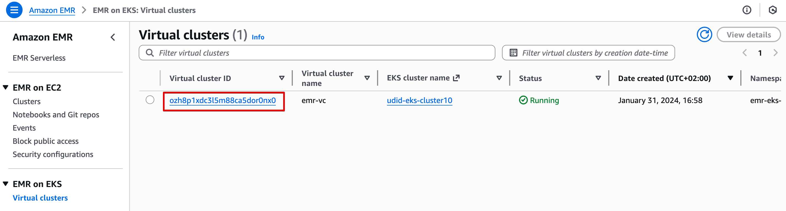
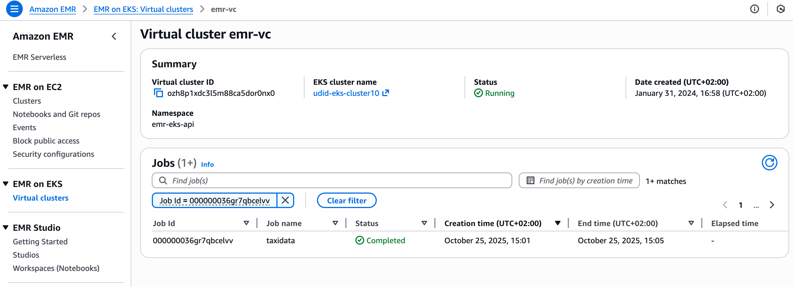
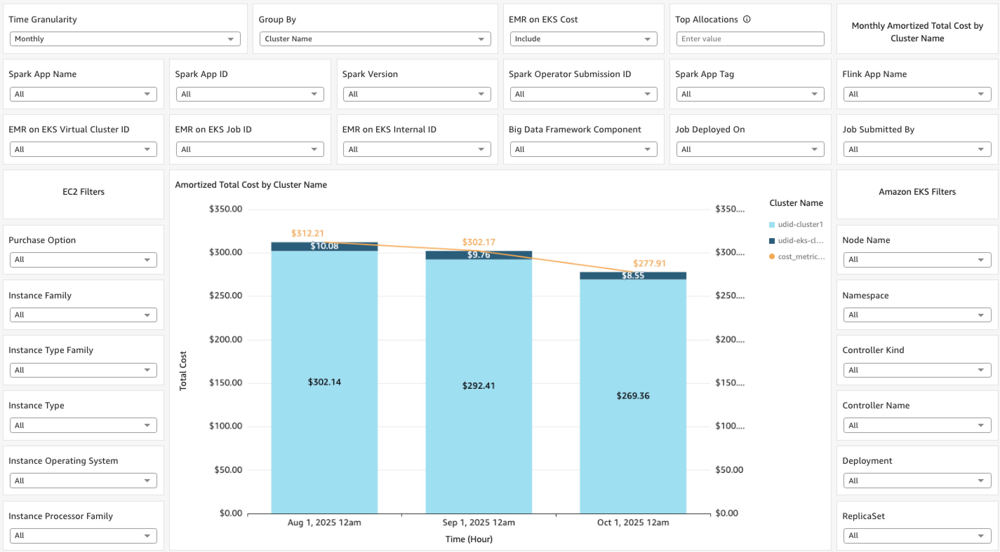
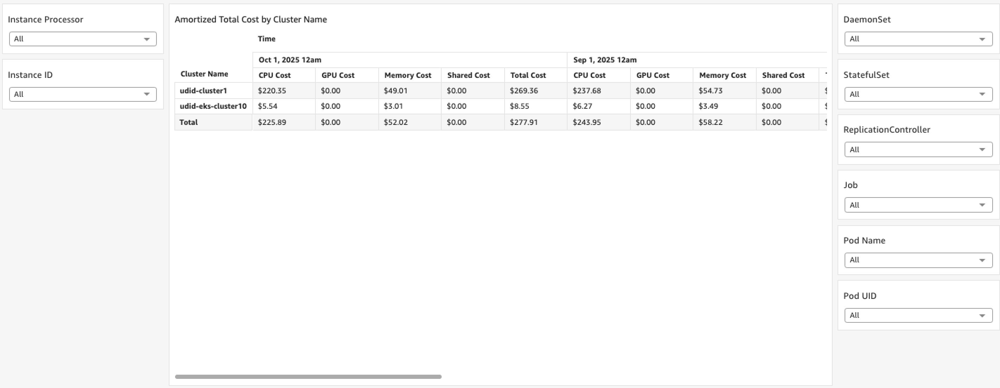
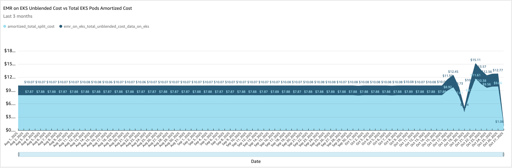
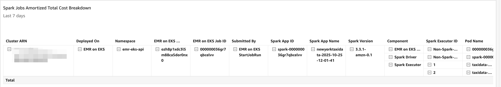
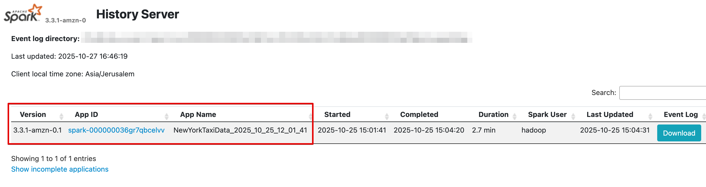
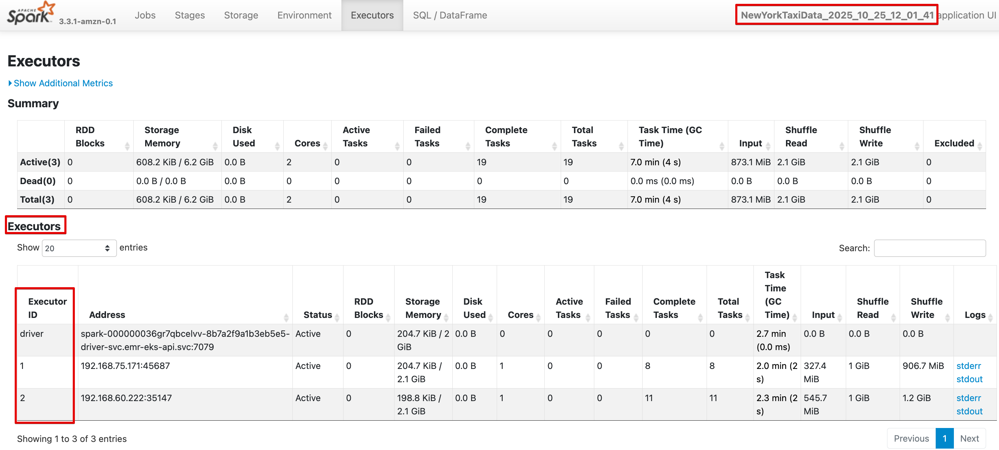
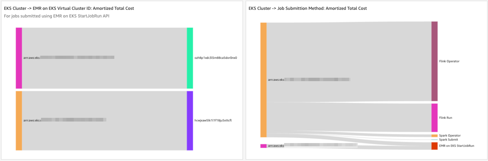

# Data on EKS - Cost Allocation for Spark and Flink Applications Running on EKS

## Introduction

Organizations that process big data and run Spark and Flink applications, often choose to run those applications on Kubernetes (K8s), specifically EKS in this context, leveraging the scheduling flexibility, autoscaling, scalability, and other advantages that come with running applications on K8s.

However, these advantages come with tradeoffs, such as allocating costs to your Spark and Flink applications, which becomes more challenging. The "Data on EKS" sheet in this dashboard, provides a pre-built solution for this challenge. It uses K8s labels that are automatically applied to Spark and Flink applications pods upon submission, to allocate costs to those applications.
This solution applies to Spark and Flink applications running either directly on EKS or on EMR on EKS. In this guide, we’ll explore how this dashboard can be used to allocate costs to Spark and Flink applications.

When running Spark or Flink applications on EKS or on EMR on EKS, some labels are automatically applied to the pods running those applications, and they can be used to identify Spark or Flink applications, or other constructs related to the applications, for the purpose of cost allocation.
You don’t need to apply the labels yourself to the pods (as they’re already applied when you submit the job), and you don’t need to add them to the Athena view and dashboard, as opposed to your own custom labels. These labels are already included in the Athena view and in the respective dashboard visuals.

## Prerequisites

Apart from the general dashboard prerequisites, below are additional prerequisites for allocating costs to Spark and Flink applications running on EKS or EMR on EKS.

### Activate Cost Allocation Tags

As mentioned above, there’s no need to label the pods or add labels to the Athena view. All that is required, is to activate the cost allocation tags that are representing the labels.
The following K8s pods labels cost allocations tags should be activated (some of them might not be available as cost allocation tags, depending on which framework you’re using and how you submit the jobs):

`spark-app-selector`, `spark-app-name`, `spark-exec-id`, `spark-exec-resourceprofile-id`, `spark-role`, `spark-version`, `sparkoperator.k8s.io/launched-by-spark-operator`, `sparkoperator.k8s.io/submission-id`, `created-by`, `spark-app-tag`, `emr-containers.amazonaws.com/virtual-cluster-id`, `emr-containers.amazonaws.com/job.id`, `eks-subscription.amazonaws.com/emr.internal.id`, `emr-containers.amazonaws.com/resource.type`, `emr-containers.amazonaws.com/component`, `type`, `app`, `component`

Here’s a breakdown of the labels cost allocation tags you need to activate, for each use-case (in case you want to selectively activate only the labels cost allocation tags you need):

- If you’re running Spark applications (regardless of wether they’re running directly on EKS or on EMR on EKS, and regardless of how you submit them), activate the following labels: `spark-app-selector`, `spark-app-name`, `spark-exec-id`, `spark-exec-resourceprofile-id`, `spark-role`, `spark-version`
- If you’re running Spark applications (regardless of wether they’re running directly on EKS or on EMR on EKS) and are submitting them using Spark Operator, activate all the cost allocation tags from the first bullet, and also: `sparkoperator.k8s.io/launched-by-spark-operator`, `sparkoperator.k8s.io/submission-id`
- If you’re running Spark applications (regardless of wether they’re running directly on EKS or on EMR on EKS) and are submitting them using Apache Livy, activate all the cost allocation tags from the first bullet, and also: `created-by`, `spark-app-tag`
- If you’re running Spark applications (regardless of wether they’re running directly on EKS or on EMR on EKS) and are submitting them using Spark Submit, activate all the cost allocation tags from the first bullet
- If you’re using EMR on EKS (regardless of which framework, Spark or Flink, you’re using, and regardless of how you’re submitting them), activate all the cost allocation tags from the first bullet and from other bullets based on submission method, and also: `emr-containers.amazonaws.com/virtual-cluster-id`, `emr-containers.amazonaws.com/job.id`, `eks-subscription.amazonaws.com/emr.internal.id`, `emr-containers.amazonaws.com/resource.type`, `emr-containers.amazonaws.com/component`
- If you’re running Flink applications (regardless of wether they’re running directly on EKS or on EMR on EKS, and regardless of how you submit them), activate the following labels: `type`, `app`, `component`

## How to Allocate Costs to Spark and Flink Applications

Here we’ll explore use-cases and examples for cost allocation of Spark and Flink applications.

### Allocating Cost to a Spark Application Running on EMR on EKS

Let’s see an example of a Spark Job submitted using `StartJobRun` on EMR on EKS, and work backwards from the EMR on EKS console to the dashboard. Working backwards from the EMR on EKS console is meant to show how you can use the information on the original native console to identify the cost of your Spark application. This can help you shift cost management left, to the developers, data engineers, DevOps engineers, or other teams using these clusters.

Navigate to the EMR on EKS console, and view the list of virtual clusters. In this case, we have one virtual cluster, as shown below:

We’ll click on the Virtual cluster ID, which will redirect us to the list of EMR on EKS jobs that were (or are) running on this virtual cluster:

Since new data in CUR isn’t updated in real-time, we’ll choose a job id that was running around 2 days before the time this guide was written. We’l use job id `000000036gr7qbcelvv`.
Copy the job id, then navigate to the "Data on EKS" sheet on the SCAD dashboard, and in it, to the "Data on EKS Workloads Explorer - Interactive Spark/Flink Jobs Visuals" section.
This section provides a set of interactive visuals to easily drill down into your Spark and Flink applications costs:

Open the "EMR on EKS Job ID" filter control above the stacked-bar chart, and paste the job id you copied into it, to fliter the visuals based on this job id.
Once done, all visuals on the sheet will be filtered. The 2 visuals in the "Data on EKS Workloads Explorer - Interactive Spark/Flink Jobs Visuals" section (the stacked-bar chart and pivot table) are grouped by cluster name by default, so they’ll still show the cluster name, but will only show the cost of job id `000000036gr7qbcelvv`.
You can then group by another dimension which may be interesting to you, but in this example, we’ll scroll down to the "Data on EKS Breakdown" section in the same sheet, to view more details on the job in question:

The 1st visual in this section shows the different cost dimensions which are relevant when running jobs on EMR on EKS (the EMR on EKS service cost and the EKS pods split cost). This gives you additional visibility into what you’re charged for, and is relevant only when running jobs on EMR on EKS (EMR on EKS service cost isn’t applicable when running Spark/Flink applications directly on EKS).
In the specific screenshot above, the visual is unfiltered (meaning, before applying the filter mentioned above), as the visual is more informative this way, in the specific environment used for this demonstration (due to the jobs being short-running ones). If you use the filters next to the "Data on EKS Workloads Explorer" visuals above, it’ll show only the cost based on the filters.
Further down we can find a pivot table which breaks down the Spark job cost by several relevant dimensions, as shown below:

In this screenshot, the data is shown after applying the EMR on EKS Job ID filter mentioned above. This pivot table is very useful if you want to drill down into more details of the Spark job components and additional information. For example, here you can find the Spark app version, Spark app name, Spark app id, and even the ID of each executor, along with the pod name and pod UID.
A similar pivot table is available further down, breaking down the cost of Flink jobs by different relevant dimensions.

Let’s now go back to the EMR on EKS console, and click on the "Spark UI" link on the right-most part of the line representing the job we chose, to open the Spark History Server console. On the landing page, we can see general information on the Spark job in question:

Check the "Version", "App ID" and "App Name" columns in the Spark History Server console. They exactly correlate to the equivalent columns in the Spark jobs cost breakdown pivot table in the dashboard ("Spark App Version", "Spark App ID", and "Spark App Name", respectively).
On the Spark History Server console, click on the link of the app id (below the "App ID" column). You’ll land on a page which shows more details on the Spark application in question. Then, click on the "Executors" menu on the top, which will show more details on the executors that were running as part of this Spark application:

Now go back to the dashboard, to the Spark jobs cost breakdown pivot table. You can see exactly the same executor IDs (1 and 2) under the "Spark Executor ID" column. This is helpful if you want to drill down into specific components of your Spark applications, for example if one executor took more time to run, you may want to know how much it costs. You can also see the pod name and UID of each executor, and the driver.

To summarize, this example shows how you can work backwards from the native console of the application (in this case, EMR on EKS console), to the dashboard, based on a specific application-run, to see how much it costs. This is very helpful, and can help you shift left your FinOps practice towards your developers, data engineers, DevOps engineers, or other teams who use these clusters, who can work with the dashboard using the same terminology they’re used to when working with the native console of the application. It works the same way when you work backwards from the Spark History Server.

### Drilling Down to Spark Applications from Top-Level Dimensions

In the previous example, we worked backwards from a specific job-run, from the native application console. In this example, we’re doing it the other way around - we’re starting with the dashboard, and work top down, from a high-level construct.

The first 2 Sankey visuals on the "Data on EKS" sheet, in the "General Overview" section, map EKS cluster ARNs to EMR on EKS virtual cluster IDs and to job submission method:

You can use this information to learn the spend of each high-level component, and then continue to the "Data on EKS Workloads Explorer - Interactive Spark/Flink Jobs Visuals" section, to further drill down.
The visuals in this section are grouped by cluster name by default. If you’re interested in investigating the costs of your Spark applications, you may want to start drilling down from this level.
For example, you can take the highest spending cluster, and use the "Cluster Name" filter (on the top part of the "Data on EKS" sheet) to filter the visuals based on it. Then, you can open the "Group By" control and select "Amazon EKS: Namespace" to group the visuals by namespace (which will result in the visuals being grouped by namespace, only for the cluster that was selected in the filter). You can continue on and on, for example from namespace to "Spark App ID", and then at this point, you can use the "Top Allocations" control to list the top 10 applications (for example).
From here, the interactive nature of the visual can be useful. You can click on any line in the pivot table, and Quick Sight will filter the rest of the visuals in the sheet. From here, the same approach applies - you can correlate the data seen in the visuals with the native console of your application (whether it’s EMR on EKS console or Spark History Server console).
