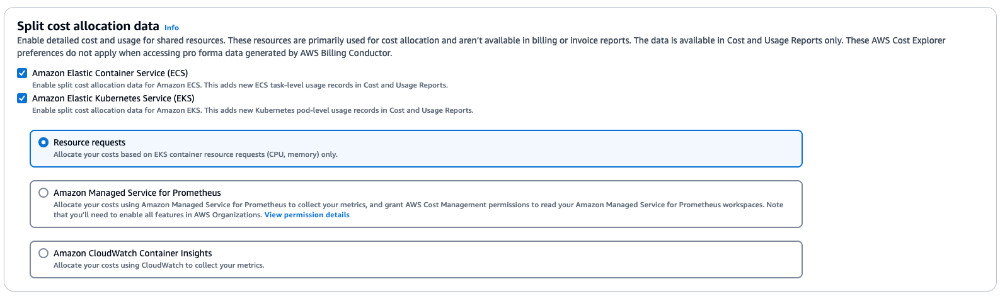
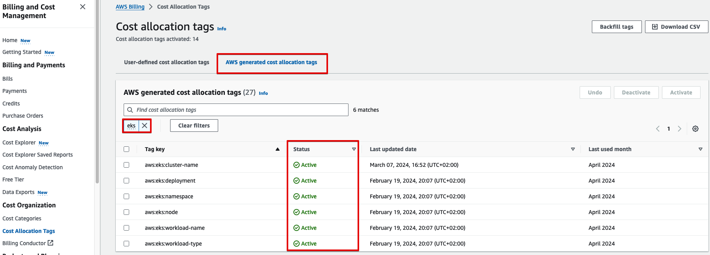
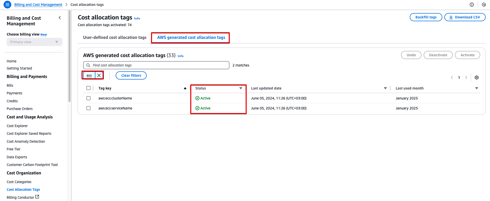
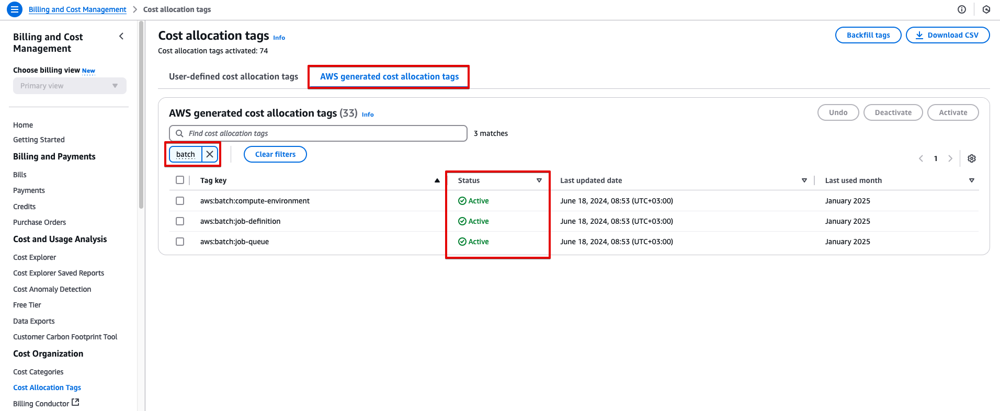
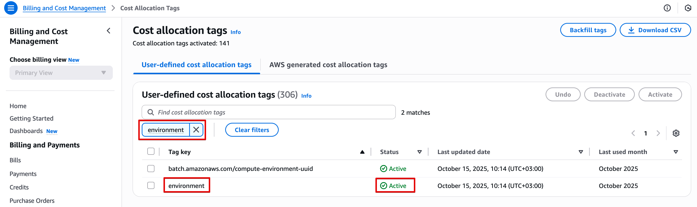
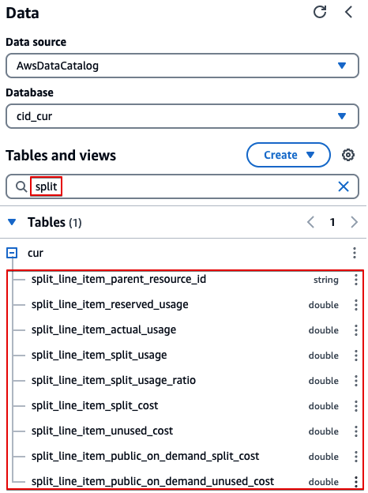
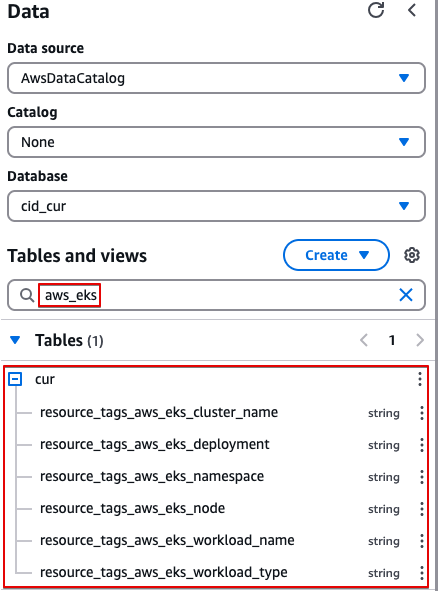
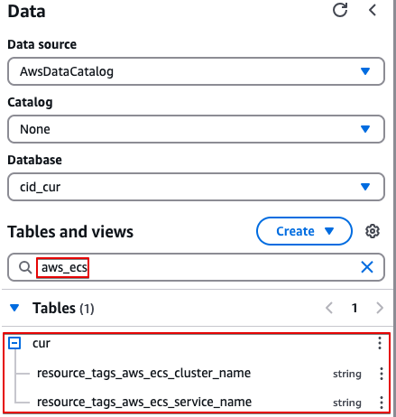
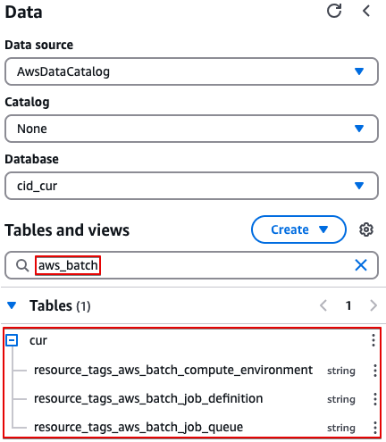

# Prerequisites

## Prerequisites

1. Enable AWS Split Cost Allocation Data (SCAD) in Cost Management Preferences:



You can enable SCAD for ECS, SCAD for EKS or both. If you enable SCAD for EKS, selecting "Resource requests"
will include only resource requests data, without actual usage. To have
actual usage data for your pods in CUR, either select the "Amazon
Managed Service for Promentheus" option and follow
[this
guide](../../../cur/latest/userguide/split-cost-allocation-data-resource-amp.md "../../../cur/latest/userguide/split-cost-allocation-data-resource-amp.md"), or select the "Amazon CloudWatch Container Insights" option
and follow
[this
guide](../../../cur/latest/userguide/split-cost-allocation-data-cloudwatch.md "../../../cur/latest/userguide/split-cost-allocation-data-cloudwatch.md")

1. Deploy the [foundational dashboards](cudos-cid-kpi.md "cudos-cid-kpi.md"), and make sure the parameter "Enable Split Cost Allocation Data (SCAD) in CUR 2.0" is set to "yes".
   As part of deploying the foundational dashboards with the parameter "Enable Split Cost Allocation Data (SCAD)" set to "yes", a new CUR will be created, with Split Cost Allocation Data enabled.

###### Note

Split Cost Allocation Data cannot be enabled or disabled in an existing CUR 2.0. Enabling or disabling Split Cost Allocation Data in an existing CUR is supported only in Legacy CUR

1. Make sure that the following AWS-generated cost allocation tags are active:

Amazon EKS



Amazon ECS



AWS Batch on Amazon ECS



AWS Batch on Amazon EKS



Please notice that some of these cost allocation tags are present only once you enabled SCAD for
the relevant service (EKS/ECS), and that it takes some time for them to
be present after enabling SCAD. The cost allocation tags may not be present if you don’t
use the respective service. 2. Wait till the SCAD data is updated in Athena

After enabling Split Cost Allocation Data for EKS, ECS or both, and activating
the AWS-generated cost allocation tags, allow at least 24h (can get up
to 48h) for new columns and data to be reflected in Athena CUR table.

Also, please note that CUR Backfill isn’t supported for SCAD. Even if
you request the CUR Backfill from AWS Support, the SCAD fields won’t be
populated. Data will only be populated for the current month onward, as stated
in the
[SCAD
documentation](../../../cur/latest/userguide/enabling-split-cost-allocation-data.md "../../../cur/latest/userguide/enabling-split-cost-allocation-data.md"):

_Once activated, split cost allocation data
automatically scans for tasks and containers. It ingests the telemetry
usage data for your container workloads and prepares the granular cost
data for the current month._

To validate that the new Split Cost Allocation Data columns exist in
CUR:

Legacy CUR

1. Open Athena console and change to CUR database
2. Expand CUR table and filter it as in the below screenshots to view the columns:
   Split line item columns (relevant for EKS and ECS):



EKS cost allocation tags (relevant only if you’re using EKS):



ECS cost allocation tags (relevant only if you’re using ECS):



AWS Batch cost allocation tags (relevant only if you’re using AWS Batch
on ECS):



CUR 2.0
Run the following Athena queryin against the CUR 2.0 table:

EKS cost allocation tags columns (relevant only if you’re using EKS):

```
 SELECT DISTINCT "key"
FROM "<table_name>"
CROSS JOIN UNNEST(MAP_KEYS("resource_tags")) AS "t"("key")
WHERE "key" LIKE 'aws_eks%'
```

Expected result:

```
 +---+-----------------------+
| # |          key          |
+---+-----------------------+
| 1 | aws_eks_node          |
| 2 | aws_eks_deployment    |
| 3 | aws_eks_namespace     |
| 4 | aws_eks_cluster_name  |
| 5 | aws_eks_workload_name |
| 6 | aws_eks_workload_type |
+---+-----------------------+
```

ECS cost allocation tags columns (relevant only if you’re using ECS):

```
 SELECT DISTINCT "key"
FROM "<table_name>"
CROSS JOIN UNNEST(MAP_KEYS("resource_tags")) AS "t"("key")
WHERE "key" LIKE 'aws_ecs%'
```

Expected result:

```
 +---+----------------------+
| # |         key          |
+---+----------------------+
| 1 | aws_ecs_cluster_name |
| 2 | aws_ecs_service_name |
+---+----------------------+
```

AWS Batch cost allocation tags columns (relevant only if you’re using AWS Batch on ECS):

```
 SELECT DISTINCT "key"
FROM "<table_name>"
CROSS JOIN UNNEST(MAP_KEYS("resource_tags")) AS "t"("key")
WHERE "key" LIKE 'aws_batch%'
```

Expected result:

```
 +---+-------------------------------+
| # |              key              |
+---+-------------------------------+
| 1 | aws_batch_job_definition      |
| 2 | aws_batch_job_queue           |
| 3 | aws_batch_compute_environment |
+---+-------------------------------+
```

Only once you see all these columns (respective for the service you use), proceed to the dashboard deployment in the [Deployment](scad-containers-dashboard-deployment.md "scad-containers-dashboard-deployment.md") chapter.

###### Note

If you’d like to use EKS K8s pod labels or ECS task tags for cost allocation or Total Cost of Ownership (TCO), there are additional prerequisites listed in [Total Cost of Ownership Using Kubernetes Labels and AWS Tags](scad-containers-dashboard-tco.md "scad-containers-dashboard-tco.md").
If you’re running Spark or Flink applications on EKS or on EMR on EKS, and you’d like to allocate cost to those applications, there are additional prerequisites listed in [Data on EKS - Cost Allocation for Spark and Flink Applications Running on EKS](scad-containers-dashboard-data-on-eks.md "scad-containers-dashboard-data-on-eks.md").
These prerequisites can be done now or after the deployment, when you reach the post-deployment section
