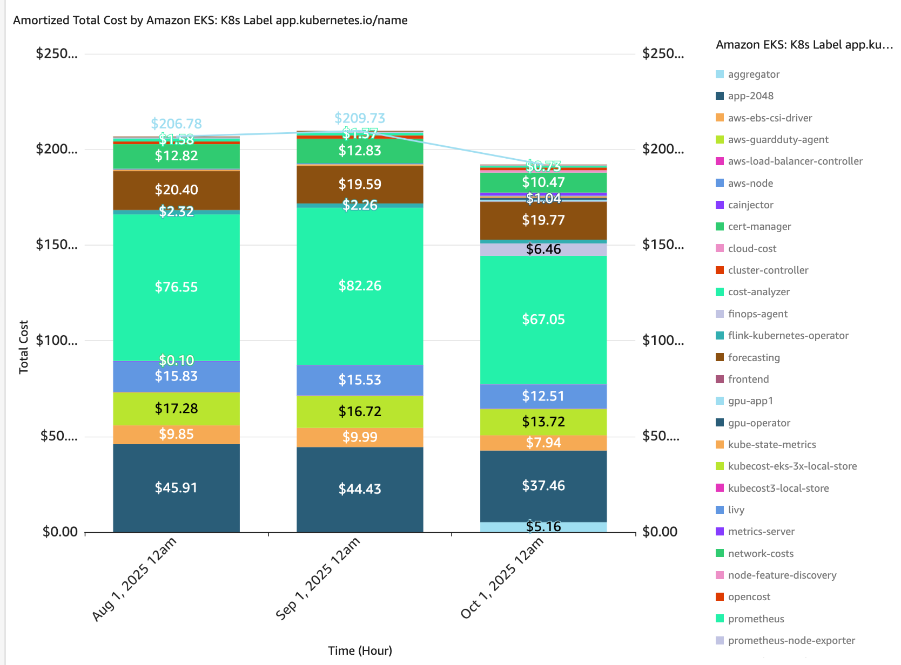
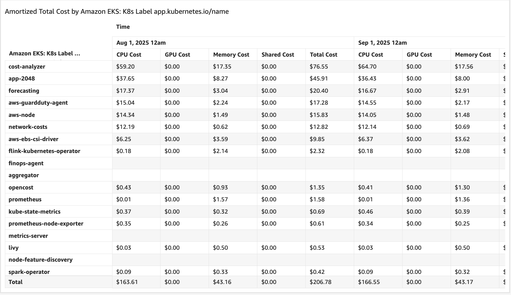
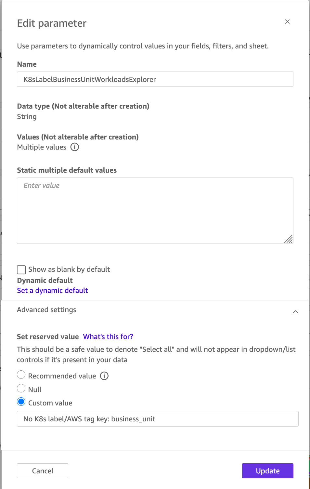
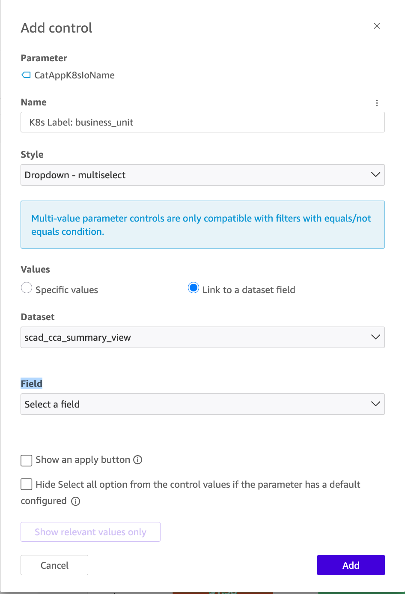
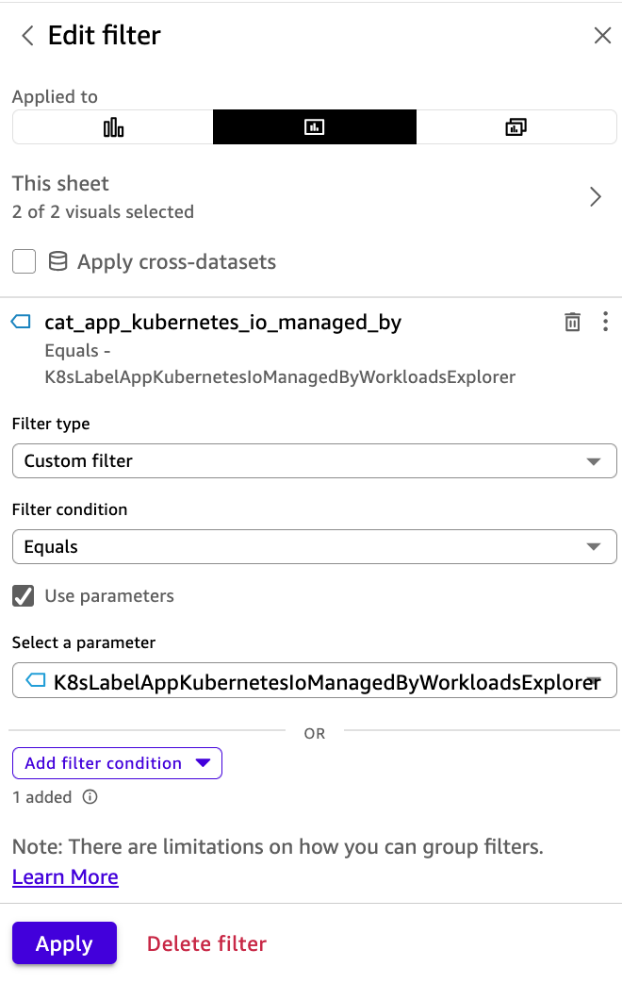
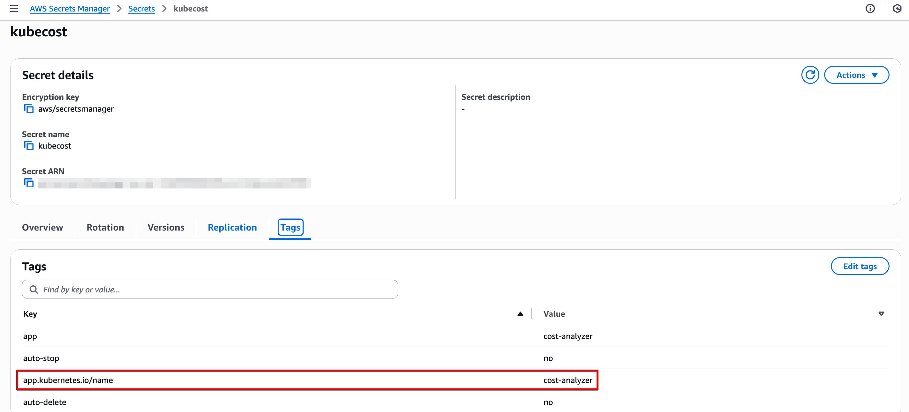
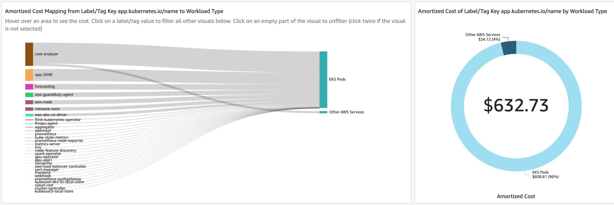
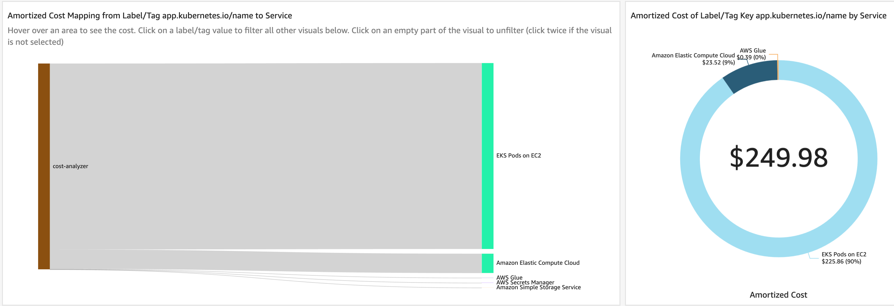

# Total Cost of Ownership Using Kubernetes Labels and AWS Tags

## Introduction

When allocating costs to workloads in EKS and ECS clusters, often organizations need to track costs using their own definitions that aren’t necessarily available using the common Kubernetes (K8s) objects or ECS constructs.
In these cases, organizations use K8s labels (on K8s pods) and AWS tags (on ECS tasks) to identify certain aspects based on which they want to allocate costs (for example, project, team, or business unit).
AWS Split Cost Allocation Data supports EKS K8s pods labels and ECS tasks tags, as cost allocation tags, for this purpose.
In addition for using EKS K8s pods labels and ECS tasks tags for the purpose of cost allocation to the containerized workloads, you can also allocate costs of AWS resources being used by those workloads, by consistently tagging the AWS resources with the same labels/tags applied to the pods that are using them. This is referred to as Total Cost of Ownership (TCO).
Starting SCAD Containers Cost Allocation Dashboard v4.0.0, the dashboard can be used to view the cost of your workloads based on EKS K8s pod labels or ECS tags, including the 2 use-cases mentioned above (cost allocation for your containerized workloads, and TCO).

While you can use K8s pods labels and ECS tasks tags in any visual in the dashboard through customization, the following sheets include pre-built functionality:

- The "Workloads Explorer" sheet includes the [Kubernetes Recommended Labels](https://kubernetes.io/docs/concepts/overview/working-with-objects/common-labels/ "https://kubernetes.io/docs/concepts/overview/working-with-objects/common-labels/") as dimensions in the "Group By" control and as filtes on the left. Also, the common labels `app`, `chart`, `release`, `version`, `component`, `type` and `created-by` are included
- The "Labels/Tags Explorer" sheet can be used to implement Total Cost of Ownership (TCO), allocating costs not only to the EKS K8s pods/ECS tasks, but also to AWS resources they’re using, by consistent labeling/tagging

## Prerequisites

Apart from the general dashboard prerequisites, below are additional prerequisites for allocating costs using EKS K8s pods labels and ECS tasks tags, using the SCAD dashboard.

### Activate Cost Allocation Tags

- For EKS users, activate the user-defined cost allocation tags for the [Kubernetes Recommended Labels](https://kubernetes.io/docs/concepts/overview/working-with-objects/common-labels/ "https://kubernetes.io/docs/concepts/overview/working-with-objects/common-labels/"), if you’re using them.
  Also, activate the user-defined cost allocation tags for labels `app`, `chart`, `release`, `version`, `component`, `type` and `created-by`, if you’re using them.
  Please note that at least some of these labels are likely assigned to your pods upon creation, as some 3rd party applications are using these labels by default in their Helm charts/K8s manifests.
  So, even if you’re not sure you’re using them, activating them is a good practice
- For all users (EKS and ECS), if you have your own custom K8s pods labels/ECS tasks tags, activate them too

### Add Cost Allocation Tags to the Athena View

The Athena view has some K8s labels included by default, as mentioned above. There’s no need to add them to the Athena view or to the dashboard, they’re already there. If you want to use other K8s pod labels/ECS tasks tags that aren’t listed above, please follow the [Adding K8s Pods Labels or Amazon ECS Tasks Tags to the Dashboard](scad-containers-dashboard-add-labels-tags.md "scad-containers-dashboard-add-labels-tags.md") chapter to add them to the Athena view.

## How to Use EKS K8s Pods Labels/ECS Tasks Tags for Cost Allocation

Here we’ll explore 2 use-cases and examples for cost allocation using EKS K8s pods labels/ECS tasks tags.
All examples will be using EKS K8s pods labels, but they apply to ECS tasks tags too.

### Cost Allocation Using K8s Pods Labels/ECS Tasks Tags

Let’s start with a simple use-case - allocating costs to pods/tasks.
This is a common use-case that is relevant to many organization that would like to allocate cost to pods/tasks using their own definitions that aren’t necessarily available using the common Kubernetes (K8s) objects or ECS constructs.
For example, you may want to allocate costs to projects, teams, business units, applications, and more.
Let’s walk though an example of using the "Workloads Explorer" sheet to allocate costs by K8s pods labels.

Let’s first do it using the [Kubernetes Recommended Labels](https://kubernetes.io/docs/concepts/overview/working-with-objects/common-labels/ "https://kubernetes.io/docs/concepts/overview/working-with-objects/common-labels/").
Once in the dashboard, navigate to the "Workloads Explorer" sheet, and open the "Group By" control.
Start searching for the string "K8s Label" - you’ll see a list of labels, select `Amazon EKS: K8s Label app.kubernetes.io/name`.
You’ll see that the stacked-bar chart and the pivot table below it, are grouped by the values of this label.
The stacked-bar chart and pivot table should look similar to the below:





Let’s say we now want to filter the visuals by a specific value of the `app.kubernetes.io/name` label. On the left part of the "Workloads Explorer" sheet, find the "K8s Labels Filters" section, and in it, find the control filter titled "K8s Label: app.kubernetes.io/name".
Select or unselect one or more values, and see how the chart and pivot change to show data only for the label value(s) you selected.
You can now continue grouping and filtering the visuals by other dimensions.

Let’s see another example, using your own K8s pod label. We’ll use the `business_unit` label that we added to the Athena view earlier, as an example.
First save the dashboard as an analysis, and then edit the calculated field named `group_by_workloads_explorer`. Like with the Athena view, find a line of an existing cost allocation tag, and add yours below it.
As an example, here’s an existing line:

```
 ${GroupByWorkloadsExplorer} = "Amazon EKS: K8s Label created-by", {cat_created_by},
```

Add your label cost allocation tag below it. Here’s an example of how the new line will look like, with the `business_unit` label:

```
 ${GroupByWorkloadsExplorer} = "Amazon EKS: K8s Label business_unit", {cat_business_unit},
```

Save the calculated field. Now, edit the `aggregation_include_exclude_workloads_explorer` calculated field.
Find a line of an existing cost allocation tag, and add yours below it. As an example, here’s an existing line:

```
 ${GroupByWorkloadsExplorer} = "Amazon EKS: K8s Label created-by" AND {cat_created_by} = "No K8s label/AWS tag key: created-by", "Exclude",
```

Add your label cost allocation tag below it. Here’s an example of how the new line will look like, with the `business_unit` label:

```
 ${GroupByWorkloadsExplorer} = "Amazon EKS: K8s Label business_unit" AND {cat_business_unit} = "No K8s label/AWS tag key: business_unit", "Exclude",
```

Save the calculated field. Now, we’ll add the label to the "Group By" control. Edit the "Group By" control, and add the text "Amazon EKS: K8s Label app.kubernetes.io/business_unit" anywhere in the control options (below one of the existing options).
No need to save. Now, open the "Group By" control and select your label. You should see the chart and pivot table change to show the values for this label key.

Now, let’s add a filter. We start by creating a new parameter. Here’s how it should be configured if your label is `business_unit`:



When prompted, proceed to add the control. Here’s how it should be configured (note, you need to select the field for your cost allocation tag):



Once created, you can either keep the control on top of the sheet or inside the sheet - arrange it to your convenience.
Lastly, we’ll add a filter to both visuals, that use the control. Open the chart visual filters, and add a new filter.
The filter should look like this (change the parameter and field to the one you created for your cost allocation tag field):



You’re now ready to use the control filter. Open it, select or unselect one or more values, and watch the visuals change to reflect your selection.

### Total Cost of Ownership (TCO) for K8s Applications

Organizations run applications on K8s, and those applications may be using other AWS resources.
When allocating costs to the application using labels, you may want to also include the cost of other AWS services that the application uses.
Assuming the AWS resources are single-tenant (meaning, they’re used only by the application in question), you can achieve TCO if you consistently label your pods and tag the AWS services using the same label/tag key-value pair.

Let’s first go through an example using the `app.kubernetes.io/name` label which is already included in the Athena view and dashboard.
First, let’s see how the pods and AWS resources are consistently labeled and tagged. Let’s start with the application pod.
Here’s an omitted output of the `kubectl describe pod` command for the application pod in question:

```
 kubectl describe pod/kubecost-eks-cost-analyzer-xxx-xxx -n kubecost-eks
Name:             kubecost-eks-cost-analyzer-xxx-xxx
Namespace:        kubecost-eks
Priority:         0
Service Account:  kubecost-eks-cost-analyzer
Node:             ip-192-xxx-xxx-xxx.ec2.internal/192.xxx.xxx.xxx
Start Time:       Sat, 21 Jun 2025 19:57:54 +0300
Labels:           app=cost-analyzer
                  app.kubernetes.io/instance=kubecost-eks
                  app.kubernetes.io/name=cost-analyzer
                  pod-template-hash=xxx
Annotations:      checksum/configs: xxxx
```

We can see the pod is labeled with the label key `app.kubernetes.io/name` having label value `cost-analyzer`.
Let’s now see one example of an AWS resource that this application uses, and see how it’s tagged.
Here’s an AWS Secrets Manager secret that this application is using:



You can see that it has a tag with the same tag key-value pair as the pod label (tag key `app.kubernetes.io/name` having label value `cost-analyzer`).
K8s pods labels and AWS resource tags are both reflected as cost allocation tag.
If you have a label and tag with the same key, they’ll be reflected as a single cost allocation tag.
This means that having a consistent labeling and tagging for your pods and AWS resources, allows you to easily sum the split cost of your pods and the amortized/unblended cost of their associated AWS resources.

Now that we saw how the pod and its associated AWS resources (AWS Secrets Manager secret in this case) are consistently labeled and tagged, let’s see how we can use the dashboard to achieve TCO.
Navigate to the "Labels/Tags Explorer" sheet. On the top "Controls" section, open the "Select Label/Tag Key" control, and select the "app.kubernetes.io/name" option.
In the first visual, you can see mapping of the different values of this label key, to workload types. Here’s an example:



From this visual, we can learn that for the label key we selected, the label value `cost-analyzer` (on the left part of the visual) is applied to EKS pods (designated as "EKS Pods" on the right side of the visual) and AWS resources (designated as "Other AWS Services", also on the right side of the visual). We can also learn that other values of this label key are only applied to EKS pods.
If you hover with your mouse on a section of the visual, you can see the cost value.
On the pie chart right next to the Sankey diagram visual, you can see the cost distribution between EKS pods and other AWS services.
The Sankey diagram visual is interactive - click on the `cost-analyzer` value, and it’ll fliter other visuals in this sheet.

Let’s continue to the 2nd Sankey diagram visual below, where we can see mapping of the different values of the label key we selected, to AWS services.
Here’s how it looks like after we filtered it by clicking on the `cost-analyzer` value on the previous visual:



From this visual, we can learn that for the label key we selected, the label value `cost-analyzer` is using several services such as AWS Secrets Manager, AWS Glue, and more.
This is possible thanks to consistent tagging. In one of the examples above, we saw an AWS Secrets Manager secret tagged with the same key-value pair as the K8s pod label.
Now we can see this service is shown in the Sankey diagram visual, as being used by the pods labeled with the same label key-value pair.
Here too, you can hover with your mouse to see the cost values, and you can click any part of the visual to filter other visuals.

You can continue scrolling down the sheet to see other visuals, breaking down the costs by different dimensions, allowing you to investigate the cost of your application, both from the K8s perspective and the AWS services perspective.

The same process can be repeated with your own labels.
To use your own labels, repeat the same process outlined earlier in this page, to add your labels to the Athena view.
Then in the dashboard, the process is the same, but in this case, the calculated fields are named `cat_selector_labels_tags_explorer` and `cat_selector_include_exclude_labels_tags_explorer`.
