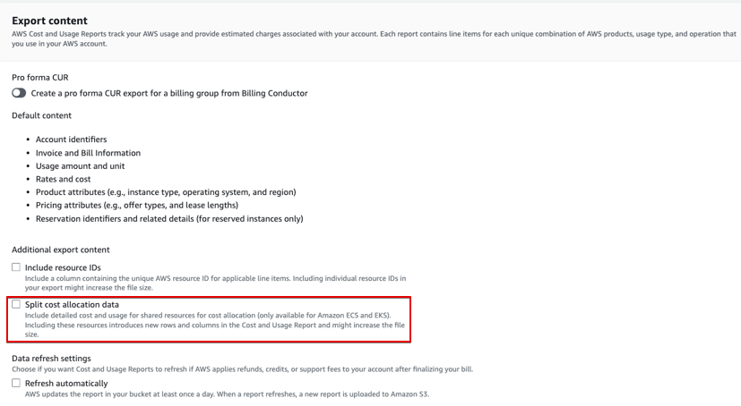
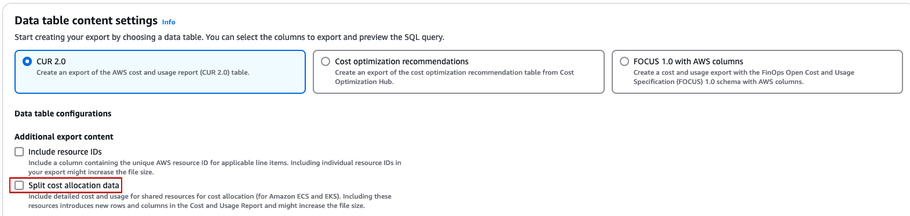

# SCAD Containers Cost Allocation Dashboard

## Introduction

The SCAD Containers Cost Allocation Dashboard provides insights into EKS
and ECS in-cluster cost based on data from CUR’s Split Cost Allocation
Data (SCAD) feature.
DevOps teams, FinOps team or any relevant stakeholder can gain insights
into cost of Kubernetes workloads inside their EKS and ECS clusters,
down to the EKS pod/ECS task level, and aggregated based on different
Kubernetes constructs (pod, namespace, controller, and more) or ECS and
Batch dimensions.
You can use it to implement showback and chargeback methodologies for
multi-tenant EKS and ECS clusters.
The dashboard’s visualizations include high-level KPI visuals to
understand general spend, and interactive visuals that allow easy-to-use
experience to drill down into EKS and ECS in-cluster cost.

The dashboard has three tabs:

- Executive Summary:
  - KPI visuals per cost metric (CPU cost, RAM cost, shared cost, total
    cost)
  - Total Cost by Account ID
  - Top Spending Clusters

- Workloads Explorer:
  - Interactive stacked-bar chart and pivot table visuals that show cost
    by different dimensions based on in-dashboard aggregations and filters

- Cluster Breakdown
  - Coverage and drill-down visuals

## Demo Dashboard

Get more familiar with Dashboard using the live, interactive demo
dashboard following this
[link](https://cid.workshops.aws.dev/demo/?dashboard=scad-containers-cost-allocation "https://cid.workshops.aws.dev/demo/?dashboard=scad-containers-cost-allocation")

**SCAD - Containers Cost Allocation Dashboard**


## CID’s Containers Cost Allocation Dashboards Comparison

The CID framework has two Containers Cost Allocation dashboards:

- This one, which is based on CUR’s Split Cost Allocation Data (SCAD)
- The [Kubecost Containers Cost Allocation Dashboard](kubecost-containers-dashboard.md "kubecost-containers-dashboard.md"), which is based on data collection
  from Kubecost

Please visit review the [Containers Cost Allocation dashboards comparison in the FAQs](faq.md#faq-scad-kubecost-dashboard-difference "faq.md#faq-scad-kubecost-dashboard-difference") for more information.

### Prerequisites

1. Deploy one or more of the foundational dashboards: [CUDOS, Cost Intelligence, or KPI Dashboard.](cudos-cid-kpi.md "cudos-cid-kpi.md")
2. Enable Split Cost Allocation Data:
   1. In Cost Management Preferences:

   

   You can enable SCAD for ECS, SCAD for EKS
   or both. If you enable SCAD for EKS, selecting "Resource requests"
   will include only resource requests data, without actual usage. To have
   actual usage data for your pods in CUR, either select the "Amazon
   Managed Service for Promentheus" option and follow
   [this
   guide](../../../cur/latest/userguide/split-cost-allocation-data-resource-amp.md "../../../cur/latest/userguide/split-cost-allocation-data-resource-amp.md"), or select the "Amazon CloudWatch Container Insights" option
   and follow
   [this
   guide](../../../cur/latest/userguide/split-cost-allocation-data-cloudwatch.md "../../../cur/latest/userguide/split-cost-allocation-data-cloudwatch.md") 2. In your CUR:

   Legacy CUR

   

   CUR 2.0

   

3. Make sure that the following AWS-generated cost allocation tags are active:

Amazon EKS


Amazon ECS


AWS Batch


Please notice that these tags are present only once you enabled SCAD for
the relevant service (EKS/ECS), and that it takes some time for them to
be present after enabling SCAD. The tags may not be present if you don’t
use the respective service. 2. Wait till the SCAD data updated in Athena:

After enabling Split Cost Allocation Data for EKS or ECS, and activating
the AWS-generated cost allocation tags, allow at least 24h (can get up
to 48h) for new columns and data to be reflected in Athena CUR table.

Also, please note that CUR Backfill isn’t supported for SCAD. Even if
you request the CUR Backfill from AWS Support, the SCAD fields won’t be
populated. Data will only be populated for the current month, as stated
in the
[SCAD
documentation](../../../cur/latest/userguide/enabling-split-cost-allocation-data.md "../../../cur/latest/userguide/enabling-split-cost-allocation-data.md"):

_Once activated, split cost allocation data
automatically scans for tasks and containers. It ingests the telemetry
usage data for your container workloads and prepares the granular cost
data for the current month._

To validate that the new Split Cost Allocation Data columns exist in
CUR:

Legacy CUR

1. Open Athena console and change to CUR database
2. Expand CUR table and filter it as in the below screenshots to view the columns:
   Split line item columns (relevant for EKS and ECS):


EKS cost allocation tags (relevant only if you’re using EKS):


ECS cost allocation tags (relevant only if you’re using ECS):


AWS Batch cost allocation tags (relevant only if you’re using AWS Batch
on ECS):


CUR 2.0
Run the following Athena queryin against the CUR 2.0 table:

EKS cost allocation tags columns (relevant only if you’re using EKS):

```
SELECT DISTINCT "key"
FROM "<table_name>"
CROSS JOIN UNNEST(MAP_KEYS("resource_tags")) AS "t"("key")
WHERE "key" LIKE 'aws_eks%'
```

Expected result:

````
+---+-----------------------+
| # |          key          | +---+-----------------------+
| 1 | aws_eks_node          |
| 2 | aws_eks_deployment    |
| 3 | aws_eks_namespace     |
| 4 | aws_eks_cluster_name  |
| 5 | aws_eks_workload_name |
| 6 | aws_eks_workload_type | +---+-----------------------+ ``` ECS cost allocation tags columns (relevant only if you’re using ECS): ``` SELECT DISTINCT "key" FROM "<table_name>" CROSS JOIN UNNEST(MAP_KEYS("resource_tags")) AS "t"("key") WHERE "key" LIKE 'aws_ecs%' ``` Expected result: ``` +---+----------------------+
| # |         key          | +---+----------------------+
| 1 | aws_ecs_cluster_name |
| 2 | aws_ecs_service_name | +---+----------------------+ ``` AWS Batch cost allocation tags columns (relevant only if you’re using AWS Batch on ECS): ``` SELECT DISTINCT "key" FROM "<table_name>" CROSS JOIN UNNEST(MAP_KEYS("resource_tags")) AS "t"("key") WHERE "key" LIKE 'aws_batch%' ``` Expected result: ``` +---+-------------------------------+
| # |              key              | +---+-------------------------------+
| 1 | aws_batch_job_definition      |
| 2 | aws_batch_job_queue           |
| 3 | aws_batch_compute_environment | +---+-------------------------------+ ``` Only once you see all these columns (respective for the service you use), proceed with the dashboard installation below. ### Deployment CloudFormation ###### Note **Prerequisite**: To install this dashboard using CloudFormation, you need to install Foundational Dashboards CFN with version v4.0.0 or above as described [here](deployment-in-global-regions.md#deployment-in-global-region-deploy-dashboard "deployment-in-global-regions.md#deployment-in-global-region-deploy-dashboard") 1. Log in to to your **Data Collection** Account. 2. Click the Launch Stack button below to open the **pre-populated stack template** in your CloudFormation. [](https://console.aws.amazon.com/cloudformation/home#/stacks/create/review?templateURL=https://aws-managed-cost-intelligence-dashboards.s3.amazonaws.com/cfn/cid-plugin.yml&stackName=SCAD-Containers-Dashboard&param_DashboardId=scad-containers-cost-allocation "https://console.aws.amazon.com/cloudformation/home#/stacks/create/review?templateURL=https://aws-managed-cost-intelligence-dashboards.s3.amazonaws.com/cfn/cid-plugin.yml&stackName=SCAD-Containers-Dashboard&param_DashboardId=scad-containers-cost-allocation") 3. You can change **Stack name** for your template if you wish. 4. Leave **Parameters** values as it is. 5. Review the configuration and click **Create stack**. 6. You will see the stack will start in **CREATE\_IN\_PROGRESS**. Once complete, the stack will show **CREATE\_COMPLETE** 7. You can check the stack output for dashboard URLs. ###### Note **Troubleshooting:** If you see error "No export named cid-CidExecArn found" during stack deployment, make sure you have completed prerequisite steps. Command Line Alternative method to install dashboards is the [cid-cmd](https://github.com/aws-solutions-library-samples/cloud-intelligence-dashboards-framework/blob/main/CID-CMD.md#command-line-tool-cid-cmd "https://github.com/aws-solutions-library-samples/cloud-intelligence-dashboards-framework/blob/main/CID-CMD.md#command-line-tool-cid-cmd") tool. 1. Log in to to your **Data Collection** Account. 2. Open up a command-line interface with permissions to run API requests in your AWS account. We recommend to use [CloudShell](https://console.aws.amazon.com/cloudshell "https://console.aws.amazon.com/cloudshell"). 3. In your command-line interface run the following command to download and install the CID CLI tool: ``` pip3 install --upgrade cid-cmd ``` 4. In your command-line interface run the following command to deploy the dashboard: ``` cid-cmd deploy --dashboard-id scad-containers-cost-allocation ``` Please follow the instructions from the deployment wizard. More info about command line options are in the [Readme](https://github.com/aws-solutions-library-samples/cloud-intelligence-dashboards-framework/blob/main/CID-CMD.md#command-line-tool-cid-cmd "https://github.com/aws-solutions-library-samples/cloud-intelligence-dashboards-framework/blob/main/CID-CMD.md#command-line-tool-cid-cmd") or `cid-cmd --help`. ###### Note Please note that DataExport can take up to 24-48 hours to deliver the first reports. If you just installed Data Exports, the dashboard will be most likely empty. Please come back after 24 hours. ### Update Please note that dashboards are not updated with update of CloudFormation Stack. When new version of the dashboard template is released, you can update your dashboard by running the following command in your command-line interface: ``` cid-cmd update --dashboard-id scad-containers-cost-allocation ``` Note: Starting from version (v2.0.0), the `scad_cca_hourly_resource_view` QuickSight dataset and Athena view are no longer used by the dashboard, and can be deleted. Please check the [SCAD Containers Cost Allocation Dashboard v2.0.0 changelog](https://github.com/aws-solutions-library-samples/cloud-intelligence-dashboards-framework/blob/main/changes/CHANGELOG-scad-cca.md#scad-containers-cost-allocation-dashboard---v200 "https://github.com/aws-solutions-library-samples/cloud-intelligence-dashboards-framework/blob/main/changes/CHANGELOG-scad-cca.md#scad-containers-cost-allocation-dashboard---v200") for more information. ### Learn more <br>• Split Cost Allocation Data for EKS documentation: + [SCAD EKS what’s new post](https://aws.amazon.com/about-aws/whats-new/2024/04/aws-split-cost-allocation-data-amazon-eks/ "https://aws.amazon.com/about-aws/whats-new/2024/04/aws-split-cost-allocation-data-amazon-eks/") + [SCAD ECS and AWS Batch what’s new post](https://aws.amazon.com/about-aws/whats-new/2023/04/aws-split-cost-allocation-data-amazon-ecs-batch/ "https://aws.amazon.com/about-aws/whats-new/2023/04/aws-split-cost-allocation-data-amazon-ecs-batch/") + [SCAD EKS Launch blog post](https://aws.amazon.com/blogs/aws-cloud-financial-management/improve-cost-visibility-of-amazon-eks-with-aws-split-cost-allocation-data/ "https://aws.amazon.com/blogs/aws-cloud-financial-management/improve-cost-visibility-of-amazon-eks-with-aws-split-cost-allocation-data/") + [SCAD ECS Launch blog post](https://aws.amazon.com/blogs/aws-cloud-financial-management/la-improve-cost-visibility-of-containerized-applications-with-aws-split-cost-allocation-data-for-ecs-and-batch-jobs/ "https://aws.amazon.com/blogs/aws-cloud-financial-management/la-improve-cost-visibility-of-containerized-applications-with-aws-split-cost-allocation-data-for-ecs-and-batch-jobs/") + [Understanding split cost allocation data](../../../cur/latest/userguide/split-cost-allocation-data.md "../../../cur/latest/userguide/split-cost-allocation-data.md") + [EKS Cost Monitoring](../../../eks/latest/userguide/cost-monitoring.md#cost-monitoring-aws "../../../eks/latest/userguide/cost-monitoring.md#cost-monitoring-aws") + [Legacy CUR Dictionary - Split Cost Allocation Data line items](../../../cur/latest/userguide/split-line-item-columns.md "../../../cur/latest/userguide/split-line-item-columns.md") + [CUR 2.0 Dictionary - Split Cost Allocation Data line items](../../../cur/latest/userguide/table-dictionary-cur2-split-line-item.md "../../../cur/latest/userguide/table-dictionary-cur2-split-line-item.md") <br>• [CUR Query Library - sample queries](https://catalog.workshops.aws/cur-query-library/en-US/queries/container#amazon-eks-split-cost-allocation-data "https://catalog.workshops.aws/cur-query-library/en-US/queries/container#amazon-eks-split-cost-allocation-data") ## Authors <br>• Udi Dahan, Technical Account Manager ### Feedback & Support Follow [Feedback & Support](feedback-support.md "feedback-support.md") guide Have a success story to share with the Team, suggest an improvement or report an error? <br>• Please email: [containers-cost-allocation-dashboard@amazon.com](mailto:containers-cost-allocation-dashboard@amazon.com "mailto:containers-cost-allocation-dashboard@amazon.com") ###### Note These dashboards and their content: (a) are for informational purposes only, (b) represent current AWS product offerings and practices, which are subject to change without notice, and (c) does not create any commitments or assurances from AWS and its affiliates, suppliers or licensors. AWS content, products or services are provided "as is" without warranties, representations, or conditions of any kind, whether express or implied. The responsibilities and liabilities of AWS to its customers are controlled by AWS agreements, and this document is not part of, nor does it modify, any agreement between AWS and its customers.
````
