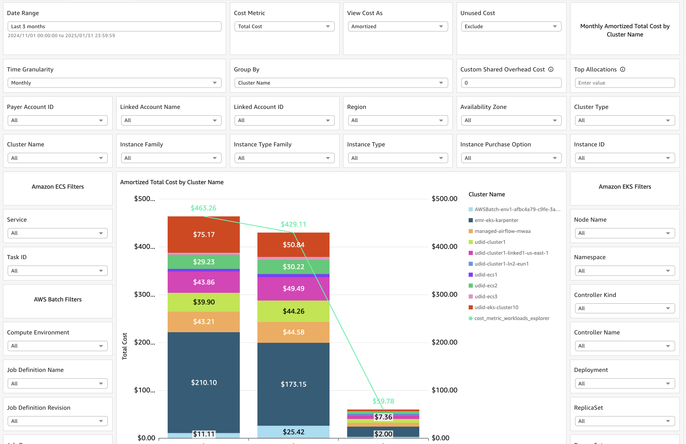

# SCAD Containers Cost Allocation Dashboard

The SCAD Containers Cost Allocation Dashboard provides insights into EKS
and ECS in-cluster cost based on data from CUR’s Split Cost Allocation
Data (SCAD) feature.
DevOps teams, FinOps team or any relevant stakeholder can gain insights
into cost of Kubernetes workloads inside their EKS and ECS clusters,
down to the EKS pod/ECS task level, and aggregated based on different
Kubernetes constructs (pod, namespace, controller, and more) or ECS and
Batch dimensions.
You can use it to implement showback and chargeback methodologies for
multi-tenant EKS and ECS clusters.
The dashboard’s visualizations include high-level KPI visuals to
understand general spend, and interactive visuals that allow easy-to-use
experience to drill down into EKS and ECS in-cluster cost.

The dashboard has three tabs:

- Executive Summary:
  - KPI visuals per cost metric (CPU cost, GPU cost, RAM cost, shared cost, total
    cost)
  - Total Cost by Account ID
  - Top Spending Clusters

- Workloads Explorer:
  - Interactive stacked-bar chart and pivot table visuals that show cost
    by different dimensions based on in-dashboard aggregations and filters

- Cluster Breakdown:
  - Coverage and drill-down visuals

- Labels/Tags Explorer:
  - Drill down into your pods/tasks split cost by dimensions that are customized using K8s pod labels/AWS ECS tasks tags, and combine them with tagged AWS resources costs to implement Total Cost of Ownership (TCO)

- Data on EKS:
  - Allocate costs to Spark and Flink applications running on EKS (directly or using EMR on EKS), with ability to combine EMR on EKS service cost and split cost

## Demo Dashboard

Get more familiar with Dashboard using the live, interactive demo
dashboard following [this link](https://cid.workshops.aws.dev/demo/?dashboard=scad-containers-cost-allocation "https://cid.workshops.aws.dev/demo/?dashboard=scad-containers-cost-allocation")

**SCAD - Containers Cost Allocation Dashboard**

## CID’s Containers Cost Allocation Dashboards Comparison

The CID framework has two Containers Cost Allocation dashboards:

- This one, which is based on CUR’s Split Cost Allocation Data (SCAD)
- The [Kubecost Containers Cost Allocation Dashboard](kubecost-containers-dashboard.md "kubecost-containers-dashboard.md"), which is based on data collection
  from Kubecost

Please visit review the [Containers Cost Allocation dashboards comparison in the FAQs](faq.md#faq-scad-kubecost-dashboard-difference "faq.md#faq-scad-kubecost-dashboard-difference") for more information.

- [Prerequisites](scad-containers-dashboard-prerequisites.md "scad-containers-dashboard-prerequisites.md")
- [Deployment](scad-containers-dashboard-deployment.md "scad-containers-dashboard-deployment.md")
- [Post Deployment](scad-containers-dashboard-post-deployment.md "scad-containers-dashboard-post-deployment.md")
  - [Adding K8s Pods Labels or Amazon ECS Tasks Tags to the Dashboard](scad-containers-dashboard-add-labels-tags.md "scad-containers-dashboard-add-labels-tags.md")
  - [Total Cost of Ownership Using Kubernetes Labels and AWS Tags](scad-containers-dashboard-tco.md "scad-containers-dashboard-tco.md")
  - [Data on EKS - Cost Allocation for Spark and Flink Applications Running on EKS](scad-containers-dashboard-data-on-eks.md "scad-containers-dashboard-data-on-eks.md")

## Learn more

- Split Cost Allocation Data for EKS documentation:
  - [SCAD
    EKS what’s new post](https://aws.amazon.com/about-aws/whats-new/2024/04/aws-split-cost-allocation-data-amazon-eks/ "https://aws.amazon.com/about-aws/whats-new/2024/04/aws-split-cost-allocation-data-amazon-eks/")
  - [SCAD
    ECS and AWS Batch what’s new post](https://aws.amazon.com/about-aws/whats-new/2023/04/aws-split-cost-allocation-data-amazon-ecs-batch/ "https://aws.amazon.com/about-aws/whats-new/2023/04/aws-split-cost-allocation-data-amazon-ecs-batch/")
  - [SCAD
    EKS Launch blog post](https://aws.amazon.com/blogs/aws-cloud-financial-management/improve-cost-visibility-of-amazon-eks-with-aws-split-cost-allocation-data/ "https://aws.amazon.com/blogs/aws-cloud-financial-management/improve-cost-visibility-of-amazon-eks-with-aws-split-cost-allocation-data/")
  - [SCAD
    ECS Launch blog post](https://aws.amazon.com/blogs/aws-cloud-financial-management/la-improve-cost-visibility-of-containerized-applications-with-aws-split-cost-allocation-data-for-ecs-and-batch-jobs/ "https://aws.amazon.com/blogs/aws-cloud-financial-management/la-improve-cost-visibility-of-containerized-applications-with-aws-split-cost-allocation-data-for-ecs-and-batch-jobs/")
  - [Understanding
    split cost allocation data](../../../cur/latest/userguide/split-cost-allocation-data.md "../../../cur/latest/userguide/split-cost-allocation-data.md")
  - [EKS
    Cost Monitoring](../../../eks/latest/userguide/cost-monitoring.md#cost-monitoring-aws "../../../eks/latest/userguide/cost-monitoring.md#cost-monitoring-aws")
  - [Legacy
    CUR Dictionary - Split Cost Allocation Data line items](../../../cur/latest/userguide/split-line-item-columns.md "../../../cur/latest/userguide/split-line-item-columns.md")
  - [CUR
    2.0 Dictionary - Split Cost Allocation Data line items](../../../cur/latest/userguide/table-dictionary-cur2-split-line-item.md "../../../cur/latest/userguide/table-dictionary-cur2-split-line-item.md")

- [CUR
  Query Library - sample queries](https://catalog.workshops.aws/cur-query-library/en-US/queries/container#amazon-eks-split-cost-allocation-data "https://catalog.workshops.aws/cur-query-library/en-US/queries/container#amazon-eks-split-cost-allocation-data")

## Authors

- Udi Dahan, Senior Technical Account Manager

### Feedback & Support

Follow [Feedback & Support](feedback-support.md "feedback-support.md") guide

Have a success story to share with the Team, suggest an improvement or
report an error?

- Please email: [containers-cost-allocation-dashboard@amazon.com](mailto:containers-cost-allocation-dashboard@amazon.com "mailto:containers-cost-allocation-dashboard@amazon.com")

###### Note

These dashboards and their content: (a) are for informational
purposes only, (b) represent current AWS product offerings and
practices, which are subject to change without notice, and (c) does not
create any commitments or assurances from AWS and its affiliates,
suppliers or licensors. AWS content, products or services are provided
"as is" without warranties, representations, or conditions of any
kind, whether express or implied. The responsibilities and liabilities
of AWS to its customers are controlled by AWS agreements, and this
document is not part of, nor does it modify, any agreement between AWS
and its customers.
