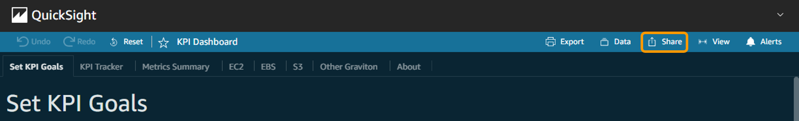
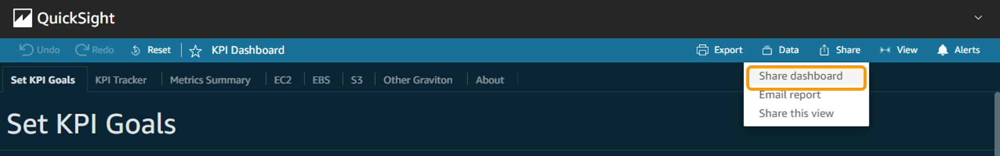
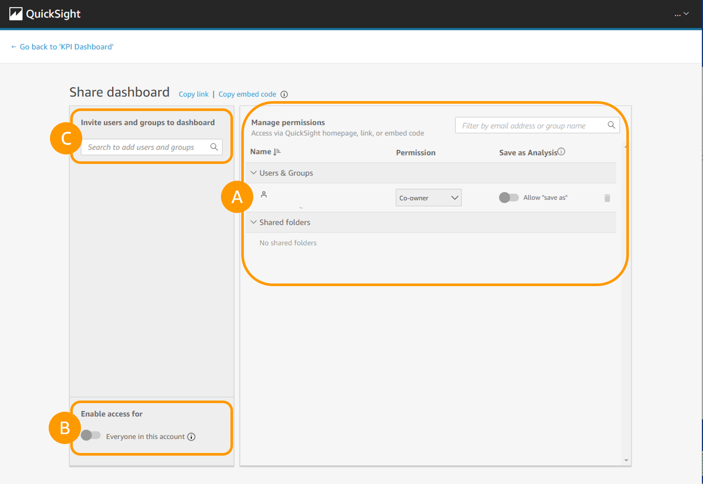
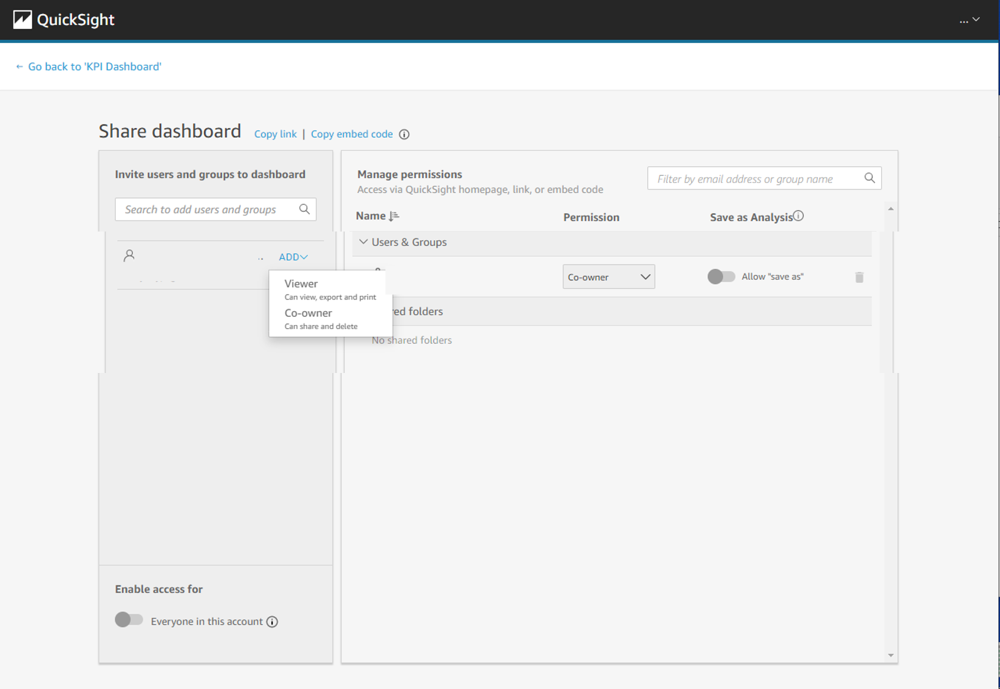

# Share Dashboards

###### Note

Adding users can have
[cost implications
for Quick Sight](https://aws.amazon.com/quicksight/pricing/?nc=sn&loc=4 "https://aws.amazon.com/quicksight/pricing/?nc=sn&loc=4")

Secure sharing and distribution of data is a key feature offered by
Amazon Quick Sight. Consider other groups of users within your
organization that would benefit from viewing the dashboard data. After
you deployed a Quick Sight dashboard, you can share it with other users
or groups, and choose the level of access to grant them. You can also
choose to share with all users in your Amazon Quick Sight subscription.

Users who are dashboard **viewers** can view and filter the dashboard
data. Any selections to filters, controls, or sorting that users apply
while viewing the dashboard exist only while the user is viewing the
dashboard, and aren’t saved once it’s closed. Users who are dashboard
**owners/co-owners** can edit and share the dashboard, and optionally can
edit and share the analysis.

1. Go to the **Quick Sight** service homepage inside your account. Be sure to select the correct region from the top right user menu or you will not see your expected tables
2. From the left hand menu, choose **Dashboards**
3. On the dashboard page, **select the dashboard you wish to share**.
4. Select **Share** on the application bar.

1. Select **Share dashboard**

1. Do one of the following:
   - Check what permissions already exist by choosing **Manage dashboard
     access**. Then choose **Add users** to return to this screen.
   - You have the option to share with all the users in your Amazon
     Quick Sight subscription. To do this, select the option **Share with all
     users in this account**. When you manage dashboard access through the
     Managed dashboard permissions screen, you see that the option Share with
     all users in this account is enabled. The individual users aren’t listed
     in this screen.
   - To share with an individual user or group, type the user or group into
     the search box. Then choose the user or group from the list that
     appears. Only active users and groups appear in the list.

1. After you have entered all the users that you want to share with,
   choose **ADD** and select the permission of **Viewer** or **Co-owner** to
   confirm your choices. You can see the username, email, permission level,
   user role, and privileges. You can also remove a user by using the
   delete icon.
2. Choose permissions for each user. **Note:** Users in the Reader role
   cannot have permissions modified from Viewer, and cannot have Save as
   privileges.

**Viewer**

Viewers can view, filter, and sort the dashboard data. They can also use
any controls or custom actions that are on the dashboard. Any changes
they make to the dashboard exist only while they are viewing it, and
aren’t saved once they close the dashboard.

**Co-owner**

Co-owners can edit and share the dashboard. You have the option to
provide them with the same permissions to the analysis. If you want them
to also edit and share the dataset, you can set that up inside the
analysis.

1. Choose whether to enable a user’s privilege to **Save as** in order to
   create a new dashboard from a copy of this one. This privilege grants
   read-only access to the datasets, so the user or group can create new
   analyses from it.

[AWS
Documentation For These Steps](../../../quicksight/latest/user/sharing-a-dashboard.md "../../../quicksight/latest/user/sharing-a-dashboard.md")
