# AWS Spend in Local Currency

## Last Updated

February 2025

## Authors

- Sumit Agarwal, Senior Technical Account Manager, AWS
- Iakov Gan, Ex-Amazonian
- Yuriy Prykhodko, Principal Technical Account Manager, AWS

## Introduction

By default, all CID dashboards are built in USD ($). AWS Billing allows
the use of local currencies, and even if the Billing is in USD, local
currencies may be more convenient for analyzing costs. This guide
provides steps to facilitate the customization of adding a choice of
currency to CUDOS dashboard. This solution requires currency conversion
rate data that you can obtain from public sources.

## Prerequisites

- [CUDOS v5](cudos-cid-kpi.md "cudos-cid-kpi.md") Dashboard deployed
- Access to upload CSV to S3, create external table in Athena and amend Quick Sight Dataset and Dashboards.
- Currency conversion rate file in CSV format [example.csv](samples/currency-conversion-rate.csv.md "samples/currency-conversion-rate.csv.md"), averaging currency conversion on monthly basis. For this example we use USD to GBP change rate, assuming that the CUR is in USD and we want to show it in GBP.

```
Month,CurrencyConversionRate
2024-02-01,0.7845326
2024-03-01,0.79015638
2024-04-01,0.79732566
2024-05-01,0.79801344
2024-06-01,0.78495453
2024-07-01,0.7915426
2024-08-01,0.78610283
2024-09-01,0.76168342
2024-10-01,0.75271059
2024-11-01,0.77358126
2024-12-01,0.78809978
2025-01-01,0.7978017
```

## Solution

This customization aims to streamline data interpretation and decision
making processes, providing a more personalized and efficient dashboard
experience for our valued customers.

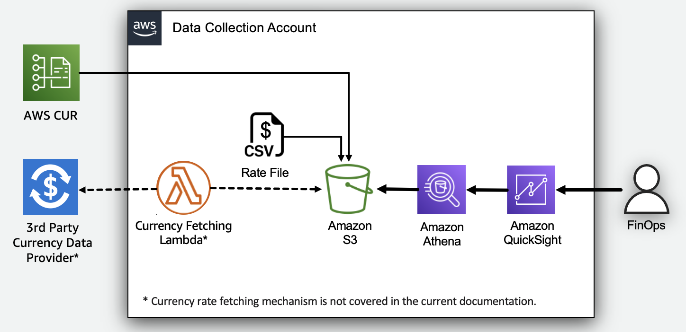

### Adding a Currency conversion

This customization requires several manual steps:

1. Prepare currency conversion csv as mentioned in Prerequisites.
2. Navigate to cid S3 bucket `s3://cid-{account_id}-shared/`, create a
   new folder named `CurrencyConversionRate` with in the bucket and
   upload the csv file to newly created CurrencyConversionRate folder. You
   can automate this step via Amazon Lambda function (outside of this
   guide).
3. In Amazon Athena, choose the cid database, then create an external
   table pointing to the currencyconversionrate.csv file uploaded to S3 by
   running the following SQL query. Please update the folder location with
   your Account Id.

```
    CREATE EXTERNAL TABLE IF NOT EXISTS currencyconversionrate (
        Month date,
        CurrencyConversionRate double
    )
    ROW FORMAT SERDE 'org.apache.hadoop.hive.serde2.lazy.LazySimpleSerDe'
    WITH SERDEPROPERTIES ('field.delim' = ',')
    STORED AS INPUTFORMAT 'org.apache.hadoop.mapred.TextInputFormat' OUTPUTFORMAT 'org.apache.hadoop.hive.ql.io.HiveIgnoreKeyTextOutputFormat'
    LOCATION 's3://cid-{account_id}-shared/CurrencyConversionRate/'
    TBLPROPERTIES (
        'classification' = 'csv',
        'skip.header.line.count' = '1'
    );
```

1. To preview the table and ensure the data is being populated correctly,
   run a `SELECT * FROM "currencyconversionrate" limit 10;` query in
   Athena.

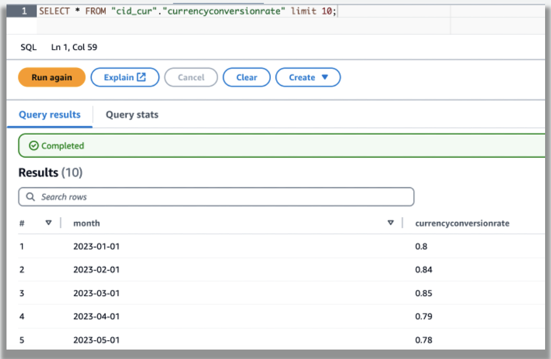

1. In Quick Sight, go to "Datasets" section and select summary_view
   dataset. Click on "Edit", then click on "Add data" in the top right
   corner. From the dropdown menu, choose "Data source". In the data
   source options, select CID datasource and then choose the
   currencyconversionrate table.

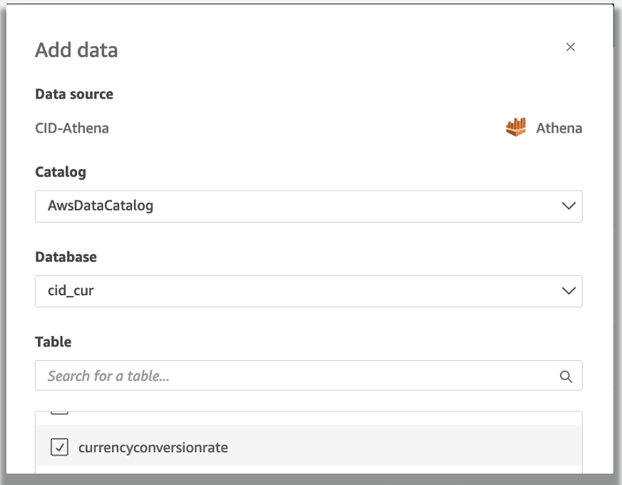

1. Select "Left Join" as the join type, and join the "billing_period"
   column from the "summary_view" table with the "month" column from
   the "currencyconversionrate" table. After this, apply the changes and
   then save and publish the dataset.

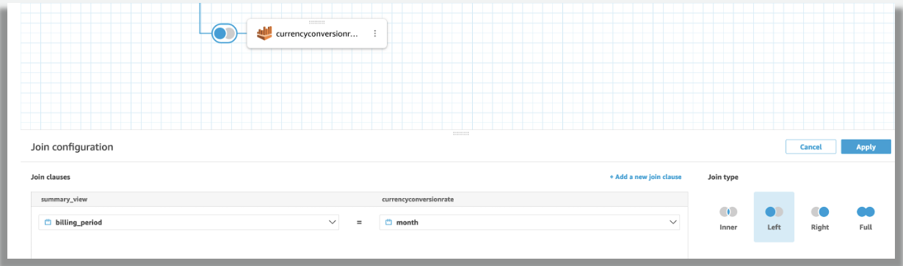

1. In the Quick Sight, go to the dashboards, then click CUDOS Dashboard
   and save it as new analyses.

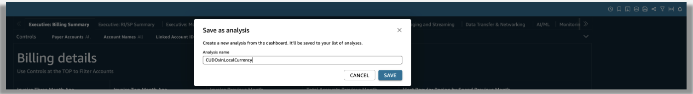

1. Go to the "Analyses" section , click on "CUDOSInLocalCurrency",
   then create a new parameter called "Currency". In "Datatype", choose
   "String", in "Values", select "single value", set "$" as the
   default currency, and then create the parameter.

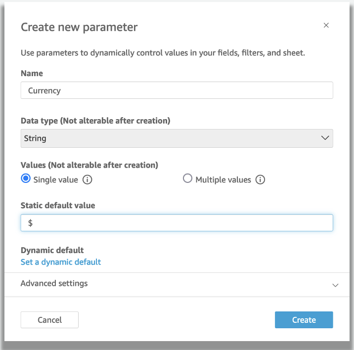

1. Once the "Currency" parameter is created, click on the three dots
   located on the right side of the parameter. Then, click on "Add
   Control".

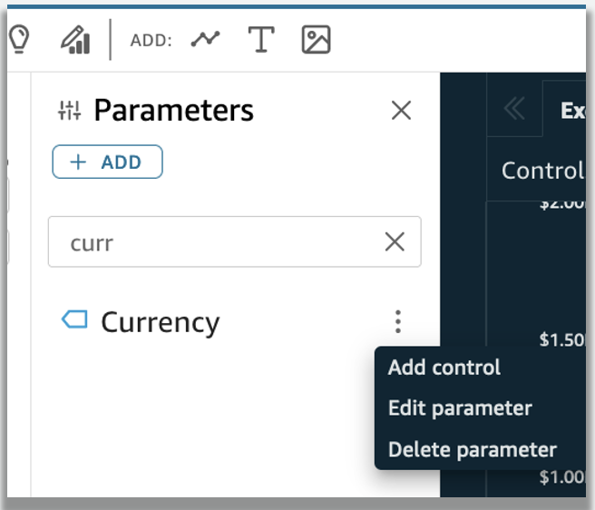

1. In the "Add control" window, select "Style" as "Dropdown". Next,
   click on "Specific values" and provide the local currency including
   "$"(for documentation purposes, we are using "£" as example). Ensure
   to check the option "Hide Select all.." option at the bottom. Finally,
   click to add the control.

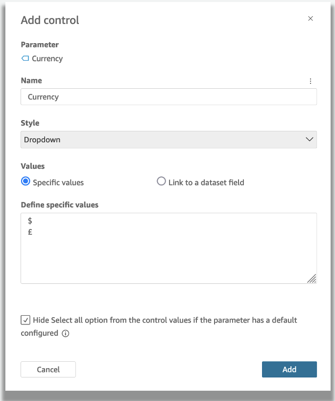

1. Now, we need to edit the calculated fields to convert the cost into
   the currency selected in the control. Select "cost_unblended" and
   click on the three dots located on the right side. Then, click on "Edit
   calculated field".

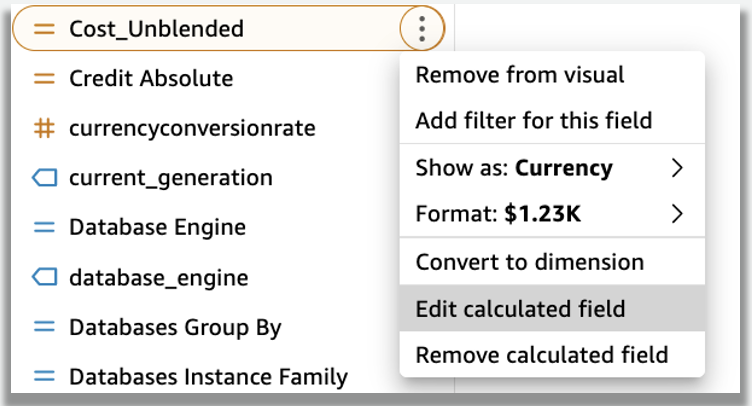

1. In the calculated field editor, replace the current code with the
   following code. Then, save the calculated field. If you combine
   different accounts with different currencies (ex: China and Global) you
   can check Multi Currency option below.

###### Example

Simple Conversion

```
switch( ${Currency},
    "$", {unblended_cost},
    "£", {unblended_cost} * {currencyconversionrate},
    NULL
)
```

Multi Currency

```
switch( ${Currency},
    "$", switch(substring(region, 1, 4), 'cn-', {unblended_cost} * {currencyconversionrate}, {unblended_cost}),
    "¥", switch(substring(region, 1, 4), 'cn-', {unblended_cost}, {unblended_cost} / {currencyconversionrate}),
    NULL
)
```

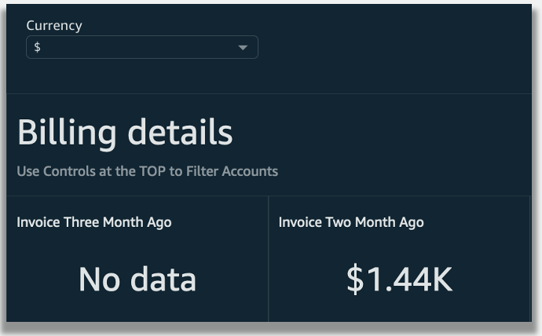

1. Do the same for Amortized Cost

###### Example

Simple Conversion

```
switch( ${Currency},
    "$", {amortized_cost},
    "£", {amortized_cost} * {currencyconversionrate},
    NULL
)
```

Multi Currency

```
switch( ${Currency},
    "$", switch(substring(region, 1, 4), 'cn-', {amortized_cost} * {currencyconversionrate}, {amortized_cost}),
    "¥", switch(substring(region, 1, 4), 'cn-', {amortized_cost}, {amortized_cost} / {currencyconversionrate}),
    NULL
)
```

1. If you select the currency "£", it will convert the cost to "£"
   based on the month and conversion rate provided in the initial CSV file.
   Note that you will still see the "$" symbol in the cost in both cases
   because the "cost_unblended" format is fixed as currency type and
   cannot be changed dynamically.

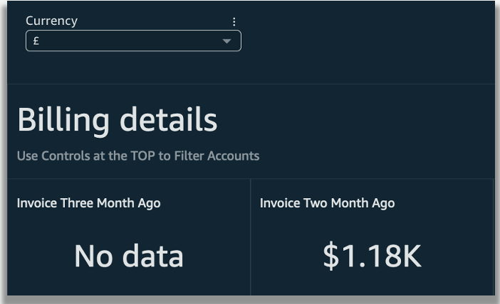

### Changing the symbol

As of today (Feb 2025) Amazon Quick Sight do not allow dynamically
changing a symbol on labels, so the only way to indicate changing
currency is to use titles of visuals.

1. To change symbol, you’ll first need first to convert the format to a
   number.

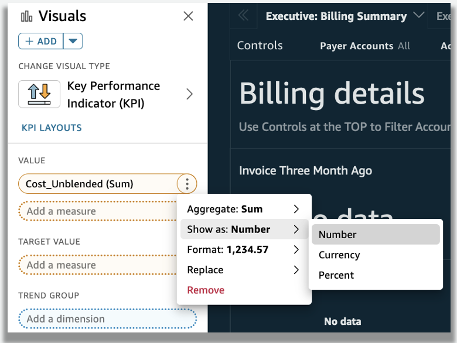

1. After changing the format to a number, the currency symbol will be
   removed.

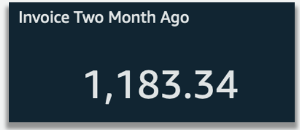

1. To change the format to thousands, click on "More formatting
   options" as shown below.

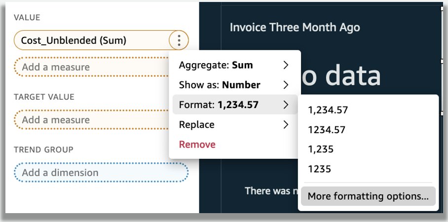

1. Select the custom decimal places to 2 and set the units to thousands.

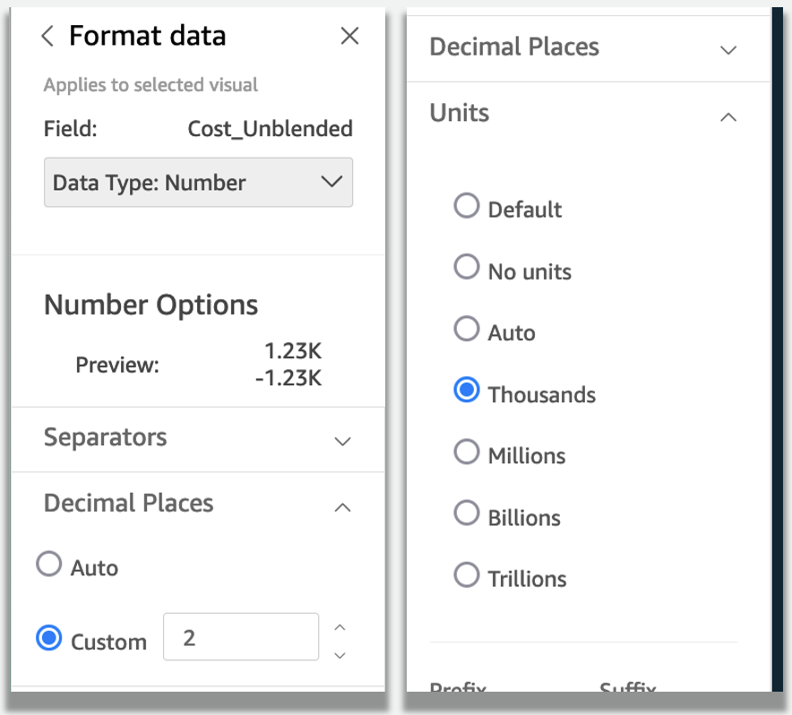

1. Now your visual is formatted in thousands with the appropriate decimal
   places. Since it has been converted to numbers, the currency symbol is
   no longer visible. We understand this may cause some confusion regarding
   currency when viewing the number alone.

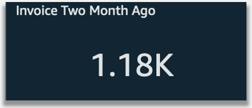

1. To address this, you can dynamically change the visual’s title.
   Double-click on the title to edit it as shown below, then save your
   changes. This will update the title to include the currency symbol based
   on your selection at the currency control level.

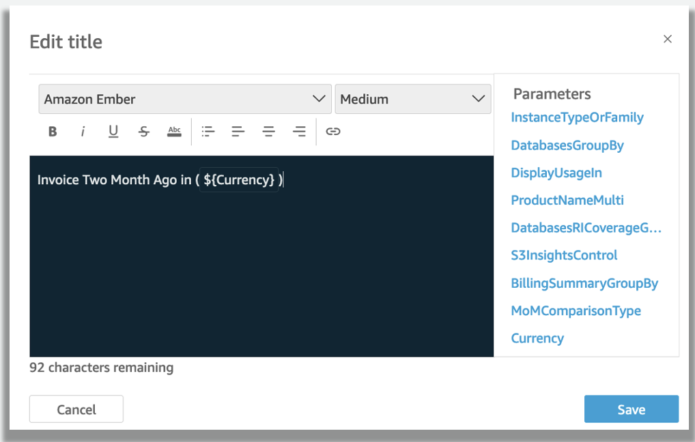

1. This will ensure that a dollar symbol `$` is added to the title when
   you have selected the `$` option in the currency control.

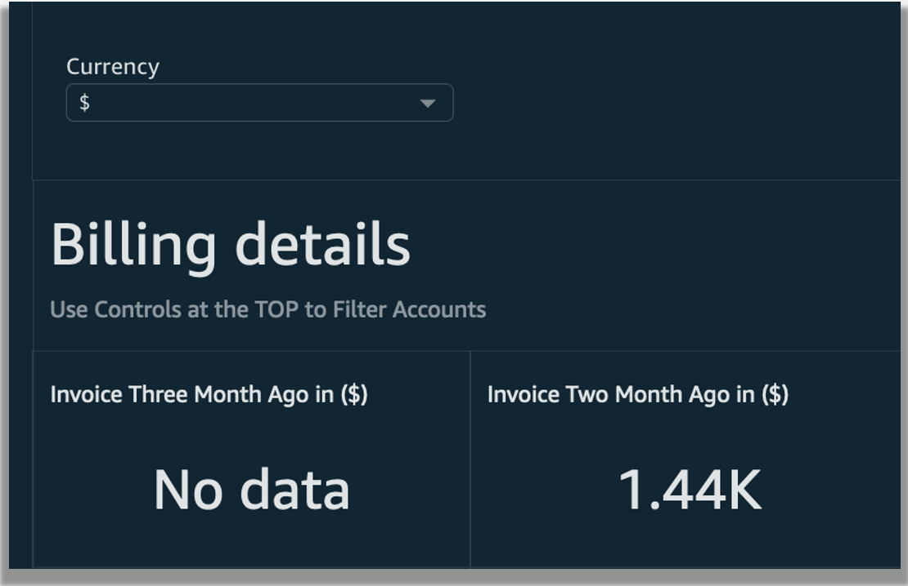

1. When you select the pound symbol (£), the title will automatically
   update to include the £ symbol.

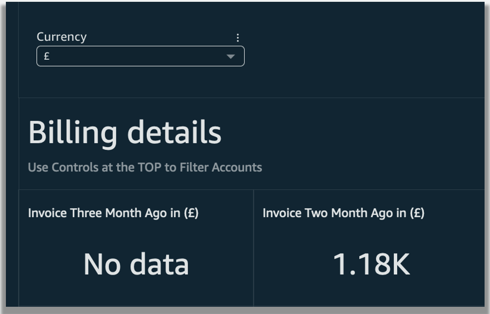

This summarizes the process for changing the currency of your visuals.
You can repeat these steps for any other visuals if you wish to convert
their currency as well.
