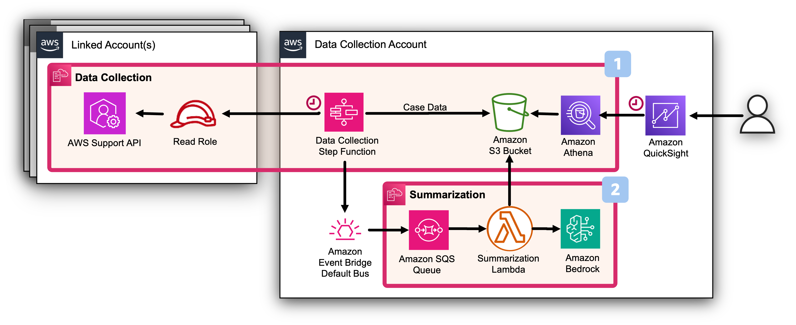

# Summarization Plugin

###### Note

The AWS Support Cases Summarization powered by Amazon Bedrock
may not capture all nuances of the original conversation with the AWS
Support. It should be verified against the full transcript which remains
the single source of truth for accuracy and completeness. See
[AWS Responsible AI
Policy](https://aws.amazon.com/ai/responsible-ai/policy/ "https://aws.amazon.com/ai/responsible-ai/policy/").

###### Note

The AWS Support Cases Dashboard is not realtime and might have
24h-48h delay. For the ongoing cases please check AWS Support Center in
the respective account.

## Authors

- Samuel Chniber, Senior Solution Architect
- Iakov Gan, Senior Solution Architect
- Yuriy Prykhodko, Principal Technical Account Manager

## Feedback & Support

Follow [Feedback & Support](feedback-support.md "feedback-support.md") guide

## Introduction

AWS Support Cases Summarization is a Plugin to the AWS Support Cases
Radar Dashboard that leverages the power of Generative AI (GenAI)
through the use of Amazon Bedrock.

This plugin aims at summarizing the
[AWS
support cases](../../../awssupport/latest/user/getting-started.md "../../../awssupport/latest/user/getting-started.md") problem statement, communications with the AWS Support
Engineers and recapping eventual actions to be carried out either by AWS
or by the customer for resolution.

## Architecture Overview

The Summarization Stack deploys a rule to Default Eventbridge bus to
capture events sent by the Data Collection Stack. The Eventbridge Rule
processes the message by sending it to an Amazon SQS queue. The SQS
Queue is responsible for triggering a lambda function that executes
Bedrock API call for the summarization and enriches the collected
support case data by adding the summaries back to Amazon S3.

## Deployment steps

### Step 1 of 4: Deploy the AWS Support Cases Radar Dashboard

This plugin has a dependency on the successful deployment of the AWS
Support Cases Radard Dashboard.

[Read More](support-cases-radar.md "support-cases-radar.md")

### Step 2 of 4: Enable Foundation Model on Amazon Bedrock

To get AWS Support Cases Summarized you need to
[add
access to Amazon Bedrock foundation models](../../../bedrock/latest/userguide/model-access-modify.md "../../../bedrock/latest/userguide/model-access-modify.md").

### Step 3 of 4: (Optional) Deploy an Amazon Bedrock Guardrail in the Data Collection Account in the Inference Region

[Amazon
Bedrock Guardrails](../../../bedrock/latest/userguide/guardrails.md "../../../bedrock/latest/userguide/guardrails.md") is a crucial security feature for generative AI
applications that helps implement safeguards based on specific use cases
and responsible AI policies. It provides an additional layer of
protection on top of the native safeguards offered by foundation models
(FMs).

We provide an example of Amazon Guardrails stack, but if your company is
already using Guardrails you can skip this Step and continue to
installation of the Plugin Stack (Step 4).

[](https://console.aws.amazon.com/cloudformation/home#/stacks/create/review?&templateURL=https://aws-managed-cost-intelligence-dashboards-us-east-1.s3.amazonaws.com/cfn/plugins/support-case-summarization/guardrail/guardrail.yaml&stackName=CidSupportCaseBedrockGuardrailStack "https://console.aws.amazon.com/cloudformation/home#/stacks/create/review?&templateURL=https://aws-managed-cost-intelligence-dashboards-us-east-1.s3.amazonaws.com/cfn/plugins/support-case-summarization/guardrail/guardrail.yaml&stackName=CidSupportCaseBedrockGuardrailStack")

This plugin comes with the following reasonable defaults that can be
overridden through the parameters exposed by the CloudFormation
template:

| Parameter                              | Description                                                                                                                                                                                                                                   | Default                                                                                                                                                                                |
| -------------------------------------- | --------------------------------------------------------------------------------------------------------------------------------------------------------------------------------------------------------------------------------------------- | -------------------------------------------------------------------------------------------------------------------------------------------------------------------------------------- |
| BlockedInputMessage                    | Message to return when the Amazon Bedrock Guardrail blocks a prompt.                                                                                                                                                                       | {"executive_summary":"Amazon Bedrock Guardrails has blocked the AWS Support Case Summarization.","proposed_solutions":"","actions":"","references":[],"tam_involved":"","feedback":""} |
| BlockedOutputMessage                   | Message to return when the Amazon Bedrock Guardrail blocks a model response                                                                                                                                                                | ’’                                                                                                                                                                                     |
| IncludeSexualContentFilter             | Whether to include Sexual Content Filter in the Guardrail or not                                                                                                                                                                           | 'yes'                                                                                                                                                                                  |
| SexualContentFilterInputStrength       | The strength of the content filter to apply to prompts. As you increase the filter strength, the likelihood of filtering harmful content increases and the probability of seeing harmful content in your application reduces.        | 'HIGH'                                                                                                                                                                                 |
| SexualContentFilterOutputStrength      | The strength of the content filter to apply to model responses. As you increase the filter strength, the likelihood of filtering harmful content increases and the probability of seeing harmful content in your application reduces | 'HIGH'                                                                                                                                                                                 |
| IncludeViolentContentFilter            | Whether to include Violent Content Filter in the Guardrail or not                                                                                                                                                                          | 'yes'                                                                                                                                                                                  |
| ViolentContentFilterInputStrength      | The strength of the content filter to apply to prompts. As you increase the filter strength, the likelihood of filtering harmful content increases and the probability of seeing harmful content in your application reduces         | 'HIGH'                                                                                                                                                                                 |
| ViolentContentFilterOutputStrength     | The strength of the content filter to apply to model responses. As you increase the filter strength, the likelihood of filtering harmful content increases and the probability of seeing harmful content in your application reduces | 'HIGH'                                                                                                                                                                                 |
| IncludeHateContentFilter               | Whether to include Violent Content Filter in the Guardrail or not                                                                                                                                                                          | 'yes'                                                                                                                                                                                  |
| HateContentFilterInputStrength         | The strength of the content filter to apply to prompts. As you increase the filter strength, the likelihood of filtering harmful content increases and the probability of seeing harmful content in your application reduces         | 'HIGH'                                                                                                                                                                                 |
| HateContentFilterOutputStrength        | The strength of the content filter to apply to prompts. As you increase the filter strength, the likelihood of filtering harmful content increases and the probability of seeing harmful content in your application reduces         | 'HIGH'                                                                                                                                                                                 |
| IncludeInsultsContentFilter            | Whether to include Insults Content Filter in the Guardrail or not                                                                                                                                                                          | 'yes'                                                                                                                                                                                  |
| InsultsContentFilterInputStrength      | The strength of the content filter to apply to prompts. As you increase the filter strength, the likelihood of filtering harmful content increases and the probability of seeing harmful content in your application reduces         | 'HIGH'                                                                                                                                                                                 |
| InsultsContentFilterOutputStrength     | The strength of the content filter to apply to prompts. As you increase the filter strength, the likelihood of filtering harmful content increases and the probability of seeing harmful content in your application reduces         | 'HIGH'                                                                                                                                                                                 |
| IncludeMisconductContentFilter         | Whether to include Insults Content Filter in the Guardrail or not                                                                                                                                                                          | 'yes'                                                                                                                                                                                  |
| MisconductContentFilterInputStrength   | The strength of the content filter to apply to prompts. As you increase the filter strength, the likelihood of filtering harmful content increases and the probability of seeing harmful content in your application reduces         | 'HIGH'                                                                                                                                                                                 |
| MisconductContentFilterOutputStrength  | The strength of the content filter to apply to prompts. As you increase the filter strength, the likelihood of filtering harmful content increases and the probability of seeing harmful content in your application reduces         | 'HIGH'                                                                                                                                                                                 |
| IncludePromptAttackContentFilter       | Whether to include Insults Content Filter in the Guardrail or not                                                                                                                                                                          | 'yes'                                                                                                                                                                                  |
| PromptAttackContentFilterInputStrength | The strength of the content filter to apply to prompts. As you increase the filter strength, the likelihood of filtering harmful content increases and the probability of seeing harmful content in your application reduces         | 'HIGH'                                                                                                                                                                                 |

### Step 3 of 4: Deploy the AWS Support Case Summarization Stack In the Data Collection Account

In this step we will deploy the summarization Plugin stack via cloud
formation.

This plugin comes with the following reasonable defaults that can be
overridden through the parameters exposed by the CloudFormation
template:

| Parameter        | Description                                                                                                                                                                                                | Default           |
| ---------------- | ---------------------------------------------------------------------------------------------------------------------------------------------------------------------------------------------------------- | ----------------- |
| BedrockRegion    | The AWS Region from which the Summarization is performed                                                                                                                                                   | us-east-1         |
| Instructions     | Additional instructions passed to the Large Language Model for the summarization process customizability                                                                                                | ’’                |
| Provider         | Large Language Model Provider for the summarization process customizability                                                                                                                             | Anthropic         |
| FoundationModel  | Foundation Model to be used for the summarization process                                                                                                                                               | Claude 3.5 Sonnet |
| InferenceType    | Summarization process Inference Type                                                                                                                                                                       | "ON_DEMAND"       |
| Temperature      | Summarization process Temperature                                                                                                                                                                          | 0                 |
| MaxTokens        | Summarization process Maximum Tokens                                                                                                                                                                       | 8096              |
| MaxRetries       | Summarization process Maximum Retries                                                                                                                                                                      | 30                |
| Timeout          | Summarization process Timeout in seconds                                                                                                                                                                   | 60                |
| BatchSize        | Summarization process Batch Size for parallel processing                                                                                                                                                   | 1                 |
| GuardrailId      | Amazon Bedrock Guardrail ID to be used (Use this parameter in case you are using an externally managed Guardrail configuration. Leave empty if not planning to use Amazon Bedrock Guardrail)         | ’’                |
| GuardrailVersion | Amazon Bedrock Guardrail Version to be used (Use this parameter in case you are using an externally managed Guardrail configuration. Leave empty if not planning to use Amazon Bedrock Guardrail) | ’’                |
| GuardrailTrace   | The trace behavior for the guardrail                                                                                                                                                                       | "ENABLED"         |

## Post Deployment

### Where i can see summarizations?

You will be able to see summarizations in the dashboard. There are short
executive summaries in the table with cases and also a more detailed
information with the summary of solution and current actions in the
table below once you select the case. The summaries only appear after
48-24h and only for updated cases.

### Can I force summarization for all cases?

Yes, you can trigger the refresh of all Support Cases and it will
generate summaries as well.

1. Go to the Amazon S3 Bucket of data collection and delete the folder `support-cases/` to trigger collection
   for the last 12 months. (Or you can modify `last_read` field in json
   file `s3://cid-data-XXX/support-cases/support-cases-status/payer_id=XXX/XXX.json` to trigger new collection and summaries generation for less then for 12 months).
2. Go to Amazon Step Functions and execute `CID-DC-support-cases-StateMachine` this must collect all Support
   Cases.
3. You can check the activity of the lambda `CID-DC-support-case-summarization-Lambda`. Make sure this lambda is
   not triggered errors (Typical issue is the enabling of access to the model. See above). 1. Go to Quick Sight and refresh the dataset `support_cases_communications_view`. Once the refresh finishes you can check the Dashboard. The table with cases and case details must contain executive and detailed summaries.

### How often Summarization are updates?

The summarization plugin automatically generates summaries of support
case histories based on past communications. The data collection by
default operates on a daily basis. Once the plugin is deployed, the
summarization stack enriches cases with summaries right after daily
collecting new data. Each day, data collection gathers all
communications that have occurred since the previous collection. The
Quick Sight dashboard updates data on the daily schedule as well. As a
result, there may be up to a 24-hour delay between when a communication
occurs and when it appears in the dashboard. We recommend using the AWS
Support center to get the latest information on the status of the
current cases.
