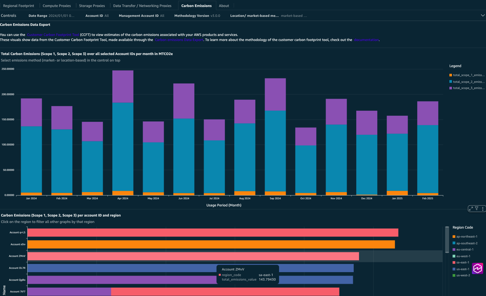

# Sustainability Proxy Metrics and Carbon Emissions Dashboard

## Introduction

The [Sustainability Proxy Metrics](https://aws.amazon.com/blogs/aws-cloud-financial-management/measure-and-track-cloud-efficiency-with-sustainability-proxy-metrics-part-i-what-are-proxy-metrics/ "https://aws.amazon.com/blogs/aws-cloud-financial-management/measure-and-track-cloud-efficiency-with-sustainability-proxy-metrics-part-i-what-are-proxy-metrics/") and Carbon Emissions Dashboard helps customers look for opportunities to reduce their sustainability impact by making changes to their AWS infrastructure. This dashboard shows resource use in key areas defined in the Sustainability Pillar of the AWS Well-Architected Framework. It helps customers implement an impact aware architecture and acts as a starting point for customers to implement business metrics as defined in the Well-Architected Framework.

The dashboard provides Amazon Quick Sight visualizations with sustainability proxy metrics for commonly used AWS technologies. You can use these visualizations to set workload-level sustainability targets and technical resource plans to reduce resource use in your workloads. The dashboard helps you identify proxy metrics that best reflect the type of improvement you are assessing and the resources targeted for improvement, such as vCPU hours for compute resources, storage usage, and data transfer metrics. It also helps visualize carbon emission data taken from the carbon data export.

## Demo Dashboards

Get more familiar with the Sustainability Proxy Metrics and Carbon Emissions Dashboard using the [live interactive demo dashboard](https://cid.workshops.aws.dev/demo?dashboard=sustainability-proxy-metrics "https://cid.workshops.aws.dev/demo?dashboard=sustainability-proxy-metrics") :



## Prerequisites

1. Deploy one or more of the foundational dashboards: [CUDOS, Cost Intelligence, or KPI Dashboard](cudos-cid-kpi.md "cudos-cid-kpi.md") as explained in [deployment guide](deployment-in-global-regions.md "deployment-in-global-regions.md"). Take special consideration to select "yes" to include the data export creation for carbon emissions (Step 1 in the guide)

## Deployment

###### Example

Command Line
Install the dashboard using the [cid-cmd](https://github.com/aws-solutions-library-samples/cloud-intelligence-dashboards-framework/blob/main/CID-CMD.md#command-line-tool-cid-cmd "https://github.com/aws-solutions-library-samples/cloud-intelligence-dashboards-framework/blob/main/CID-CMD.md#command-line-tool-cid-cmd") tool:

1. Log in to to your **Data Collection** Account.
2. Open up a command-line interface with permissions to run API requests in your AWS account. We recommend to use [CloudShell](https://console.aws.amazon.com/cloudshell "https://console.aws.amazon.com/cloudshell").
3. Check that the regional setup within the console is correct by overriding it to the region where you deployed the previous CloudFormation templates (Example: `us-east-1`):

```
export AWS_DEFAULT_REGION=us-east-1
```

4. In your command-line interface run the following command to download and install the CID CLI tool:

```
pip3 install --upgrade cid-cmd
```

5. In your command-line interface run the following command to deploy the dashboard:

```
cid-cmd deploy --dashboard-id sustainability-proxy-metrics
```

Please follow the instructions from the deployment wizard. During deployment, you may be asked for the following details:

    * **athena-workgroup**: The Athena workgroup used to access Athena (default: `CID`)
    * **datasource**: The Athena datasource created in previous steps (default: `AwsDataCatalog`)
    * **cur-table-name**: The CUR table name (default: `cur`)
    * **AWS Athena database**: The database within the Datasource (default: `cid_cur`)
    * **Tag**: A tag name used to categorize workloads. This gives you a list of all cost allocation tags. Select a tag that you apply to categorize workloads, like "workloadId". If you do not tag workloads, you can select "none".


    You will also be asked if you want to "Share the dashboard". This shares the dashboard with all Quick Sight users setup in your AWS account. If you want to restrict access, you can say no, which means only the current user can see it. You can share with selective users later using [QuickSight sharing features](../../../quicksight/latest/user/sharing-a-dashboard.md "../../../quicksight/latest/user/sharing-a-dashboard.md").


    More info about command line options are in the
    [Readme](https://github.com/aws-solutions-library-samples/cloud-intelligence-dashboards-framework/blob/main/CID-CMD.md#command-line-tool-cid-cmd "https://github.com/aws-solutions-library-samples/cloud-intelligence-dashboards-framework/blob/main/CID-CMD.md#command-line-tool-cid-cmd")
    or `cid-cmd --help`.

CloudFormation

###### Note

**Prerequisite**: To install this dashboard using CloudFormation, you need to install Foundational Dashboards CFN with version v4.0.0 or above as described [here](deployment-in-global-regions.md#deployment-in-global-region-deploy-dashboard "deployment-in-global-regions.md#deployment-in-global-region-deploy-dashboard").

1. Log in to to your **Data Collection** Account.
2. Click the Launch Stack button below to open the **pre-populated stack template** in your CloudFormation.

[](https://console.aws.amazon.com/cloudformation/home#/stacks/create/review?templateURL=https://aws-managed-cost-intelligence-dashboards.s3.amazonaws.com/cfn/cid-plugin.yml&stackName=Sustainability-Proxy-Metrics-Dashboard&param_DashboardId=sustainability-proxy-metrics&param_RequiresDataExports=yes "https://console.aws.amazon.com/cloudformation/home#/stacks/create/review?templateURL=https://aws-managed-cost-intelligence-dashboards.s3.amazonaws.com/cfn/cid-plugin.yml&stackName=Sustainability-Proxy-Metrics-Dashboard¶m_DashboardId=sustainability-proxy-metrics¶m_RequiresDataExports=yes") 3. You can change **Stack name** for your template if you wish. 4. Leave **Parameters** values as it is. 5. Review the configuration and click **Create stack**. 6. You will see the stack will start in **CREATE_IN_PROGRESS**. Once complete, the stack will show **CREATE_COMPLETE** 7. You can check the stack output for dashboard URLs.

###### Note

**Troubleshooting:** If you see error "No export named cid-CidExecArn found" during stack deployment, make sure you have completed prerequisite steps.

## Update

When a new version of the dashboard template is
released, update your dashboard by running the following command
in your command-line interface:

```
cid-cmd update --dashboard-id sustainability-proxy-metrics --force --recursive
```

###### Note

Please note that updating the dashboard might impact customizations you made on the dashboards. The tool will provide you an interactive prompt when it detects differences and you can accept the changes or keep existing modifications.

## Authors

- Tom Coombs, Principal Technical Account Manager
- Steffen Grunwald, Principal Solutions Architect
- Katja Philipp, Ex-Amazonian

## Feedback & Support

Follow [Feedback & Support](feedback-support.md "feedback-support.md") guide

###### Note

These dashboards and their content: (a) are for informational
purposes only, (b) represent current AWS product offerings and
practices, which are subject to change without notice, and (c) does not
create any commitments or assurances from AWS and its affiliates,
suppliers or licensors. AWS content, products or services are provided
"as is" without warranties, representations, or conditions of any
kind, whether express or implied. The responsibilities and liabilities
of AWS to its customers are controlled by AWS agreements, and this
document is not part of, nor does it modify, any agreement between AWS
and its customers.
