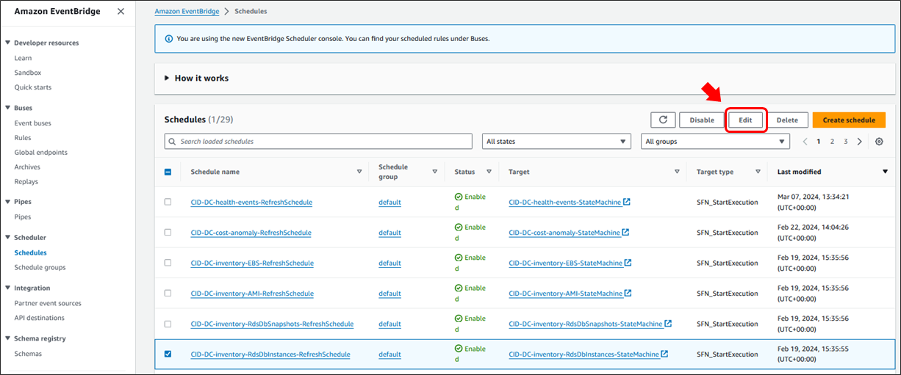
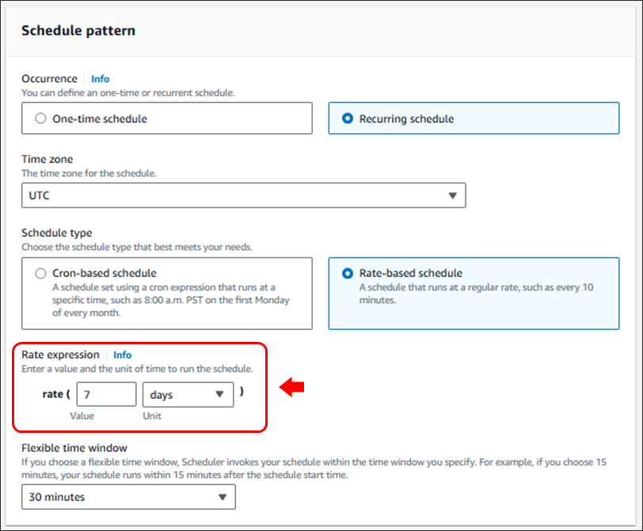
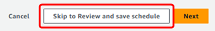
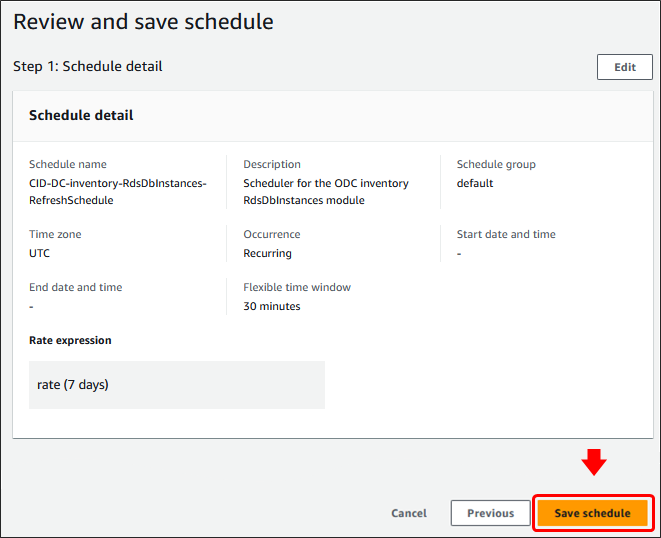

# Tailoring Data Collector schedules

## Last Updated

March 2024

## Tailoring Data Collector schedules

The CloudFormation template for the Data Collection framework allows you
to define two different schedules for collecting data. One schedule
controls the Trusted Advisor, Cost Optimization Hub, Compute Optimizer,
Organizations Data, Rightsizing, RDS Utilization, Inventory Collector,
Transit Gateway, Backup, and ECS Chargeback modules. That schedule
defaults to every 14 days, which should work well for those datasets in
most cases. A second schedule is provided for the Cost Anomalies and
Budgets modules, for which there are use cases that benefit from more
frequent updating. The default frequency for those is daily. In both
cases, you can override the template defaults and the set of modules
that each schedule governs will be affected accordingly.

However, your use cases may differ from those two generalizations such
that you may wish to tailor the schedule more granularly for individual
modules. Because the CloudFormation template ultimately deploys a
dedicated EventBridge schedule for each module, you can easily adjust
any module’s schedule to suit your needs. The following steps will show
you how to apply such customizations.

1. Navigate to the [Schedules](https://us-east-1.console.aws.amazon.com/scheduler/home?#schedules "https://us-east-1.console.aws.amazon.com/scheduler/home?#schedules") section of the **Amazon EventBridge** console.
2. Find and select the schedule that you want to change. All schedules for the Data Collection framework will be named starting with the prefix
   you defined at deployment (for example, "CID-DC-"). The rest of the name corresponds to the module name.
3. Click **Edit**

 4. On the **Specify schedule detail** page, scroll down to the **Schedule
pattern** section. 5. From there you can adjust the **Rate expression** to suit your needs.
Note: You can also change to a cron-based definition as well as make
adjustments to the flexibility of your time window.

 6. After you make your adjustments, click the **Skip to Review and save
schedule** button.

 7. Review your new schedule and click **Save schedule** at the bottom of
the page to complete the change.

