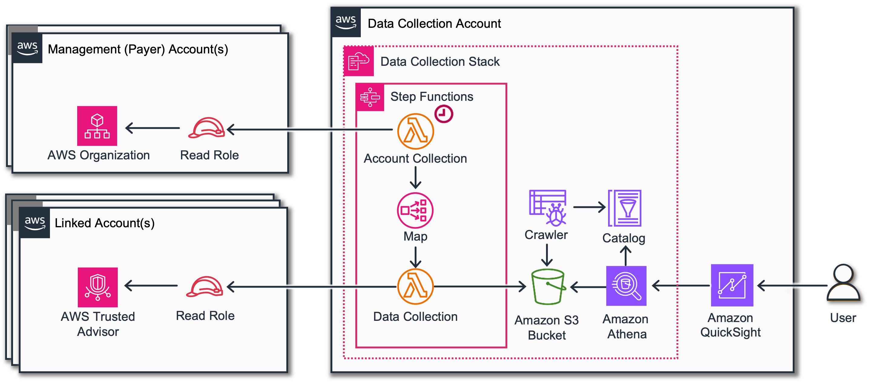
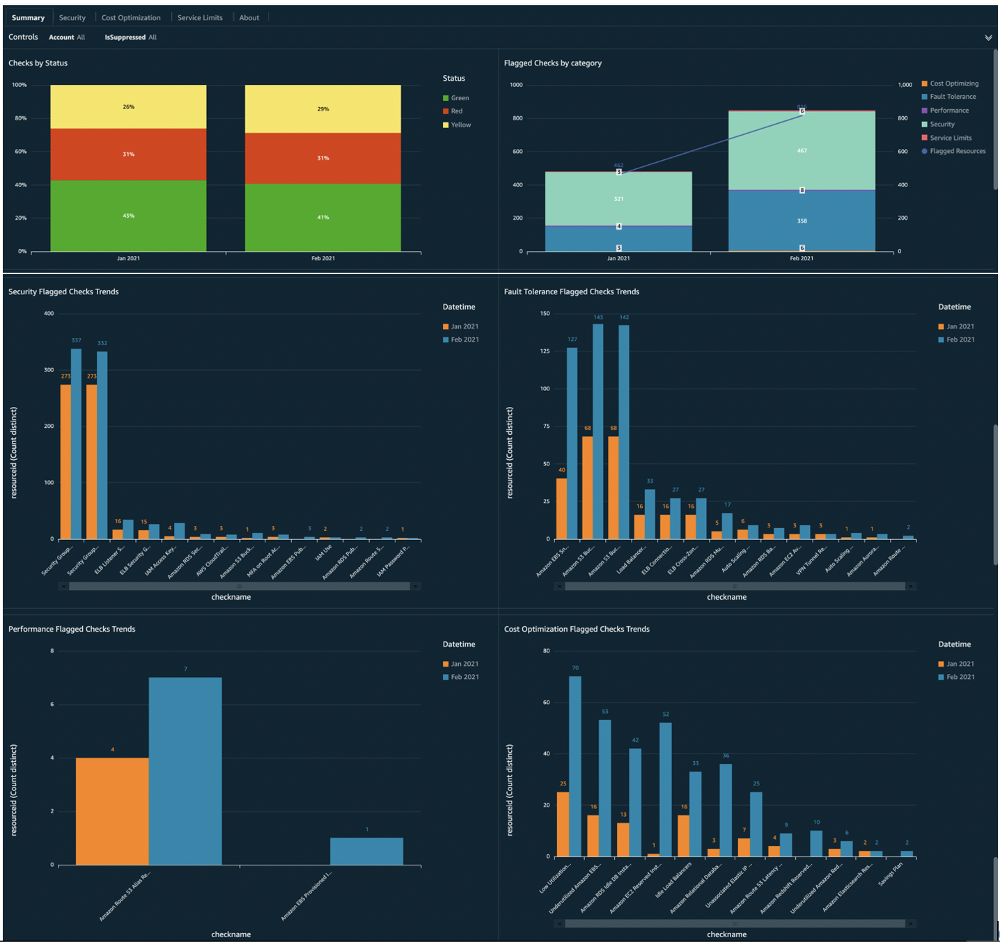

# Trusted Advisor Organizational (TAO) Dashboard

## Introduction

Amazon Trusted Advisor helps you optimize your AWS infrastructure,
improve security and performance, reduce overall costs, and monitors
service limits. Organizational view lets you view Trusted Advisor checks
for all accounts in your AWS Organizations. The only way to visualize
the organizational view is to use the TAO dashboard. The TAO dashboard
is a set of visualizations that provide comprehensive details and trends
across your entire AWS Organization. Out-of-the-box benefits of the TAO
dashboard include (but are not limited to):

- Quickly locate accounts that haven’t rotated their AWS IAM keys.
- Find then sort unutilized and underutilized resources by cost or
  account.
- Find accounts with not enabled CloudTrail logs
- See a list of accounts that have reached 80% of individual service
  limits.

###### Note

All accounts must have a **Business**, **On-Ramp** or **Enterprise**
Support Plan.



## Demo Dashboard

Get more familiar with Dashboard using the live, interactive demo
dashboard following this
[link](https://cid.workshops.aws.dev/demo?dashboard=tao "https://cid.workshops.aws.dev/demo?dashboard=tao")



## Prerequisites

1. Check Support Plan

Make sure all concerned accounts have a **Business**, **On-Ramp** or
**Enterprise**
[Support
Plan](https://console.aws.amazon.com/support/plans/home "https://console.aws.amazon.com/support/plans/home"). 2. Deploy or update [Data Collection Lab](data-collection.md "data-collection.md") and make
sure Trusted Advisor Data Collection Module is enabled. Version 3.14.1 or
higher required.

## Deployment

###### Example

CloudFormation
If you already have CUDOS, Cost Intelligence Dashboard or KPI Dashboard
installed via CloudFormation as described [here](deployment-in-global-regions.md "deployment-in-global-regions.md"), you can update
the Stack by setting **DeployTaoDashboard** to "yes" and updating the
path of Data Collection S3 bucket (if different from default).

If you do not have the stack installed, you can install using the
instructions [here](deployment-in-global-regions.md "deployment-in-global-regions.md") (Step 3) and setting **DeployTaoDashboard** parameter to "yes"
(you can ignore the Cost and Usage report part Step 1 and Step 2 as it is not required for
this dashboard).

Command Line
Alternative method to install dashboards is the
[cid-cmd](https://github.com/aws-solutions-library-samples/cloud-intelligence-dashboards-framework/blob/main/CID-CMD.md#command-line-tool-cid-cmd "https://github.com/aws-solutions-library-samples/cloud-intelligence-dashboards-framework/blob/main/CID-CMD.md#command-line-tool-cid-cmd")
tool.

1. Log in to to your **Data Collection** Account.
2. Open up a command-line interface with permissions to run API requests
   in your AWS account. We recommend to use
   [CloudShell](https://console.aws.amazon.com/cloudshell "https://console.aws.amazon.com/cloudshell").
3. In your command-line interface run the following command to download
   and install the CID CLI tool:

```
 pip3 install --upgrade cid-cmd
```

4. In your command-line interface run the following command to deploy the
   dashboard:

```
 cid-cmd deploy --dashboard-id ta-organizational-view
```

Please follow the instructions from the deployment wizard. More info
about command line options are in the
[Readme](https://github.com/aws-solutions-library-samples/cloud-intelligence-dashboards-framework/blob/main/CID-CMD.md#command-line-tool-cid-cmd "https://github.com/aws-solutions-library-samples/cloud-intelligence-dashboards-framework/blob/main/CID-CMD.md#command-line-tool-cid-cmd")
or `cid-cmd --help`.

## Update

Please note that dashboards are not updated with update of
CloudFormation Stack. When new version of the dashboard template is
released, you can update your dashboard by running the following command
in your command-line interface:

```
cid-cmd update --dashboard-id ta-organizational-view
```

## Authors

- Yuriy Prykhodko, Principal Technical Account Manager, AWS
- Timur Tulyaganov, Ex-Amazonian
- Sumit Dhuwalia, Senior Technical Account Manager, AWS

## Contributors

- Oleksandr Moskalenko, Ex-Amazonian
- Georgios Rozakis, Technical Account Manager, AWS

## Feedback & Support

Follow [Feedback & Support](feedback-support.md "feedback-support.md") guide

###### Note

These dashboards and their content: (a) are for informational
purposes only, (b) represent current AWS product offerings and
practices, which are subject to change without notice, and (c) does not
create any commitments or assurances from AWS and its affiliates,
suppliers or licensors. AWS content, products or services are provided
"as is" without warranties, representations, or conditions of any
kind, whether express or implied. The responsibilities and liabilities
of AWS to its customers are controlled by AWS agreements, and this
document is not part of, nor does it modify, any agreement between AWS
and its customers.
