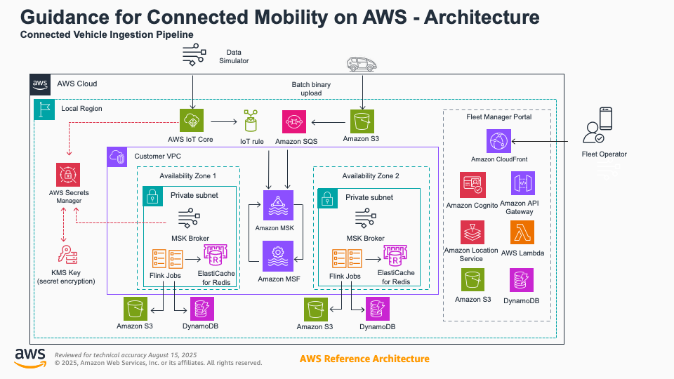

# Architecture overview

This section provides a high-level description of the guidance architecture, including the six integrated stacks that comprise the guidance. The architecture uses [AWS Cloud Development Kit (AWS CDK)](https://aws.amazon.com/cdk/ "https://aws.amazon.com/cdk/") for infrastructure deployment with a phase-based approach that ensures proper dependency management and efficient deployment.

The solution provides a modern, scalable telemetry architecture designed to handle high-volume, real-time data streams from connected vehicle fleets. Each installation follows the same core architecture with six foundational stacks that can be customized to meet specific requirements.

## Solution architecture

Deploying this solution with the default parameters creates the following architecture in your AWS account.

###### Note

CloudFormation resources are created from [AWS Cloud Development Kit (AWS CDK)](https://aws.amazon.com/cdk/ "https://aws.amazon.com/cdk/") constructs.

The solution architecture consists of six integrated stacks deployed in phases:

1. **InfrastructureStack** – Provides the foundational networking and caching infrastructure including Amazon VPC with public and private subnets, NAT Gateway for secure internet access, and Amazon ElastiCache for Redis to maintain real-time vehicle state for sub-second lookups.
2. **StorageStack** – Deploys Amazon DynamoDB tables for vehicles, trips, alerts, drivers, commands, geofences, and signal catalog with on-demand billing and point-in-time recovery enabled. Also provisions Amazon S3 buckets for telemetry data archival and web application assets.
3. **MSKStack** – Creates an Amazon MSK (Managed Streaming for Apache Kafka) cluster with three brokers for high-throughput telemetry data streaming. The cluster is deployed in the VPC with appropriate security groups and includes topics for telemetry, trips, alerts, FleetWise telemetry, and OEM telemetry.
4. **IoTStack** – Configures AWS IoT Core for vehicle connectivity including thing types, IoT policies, and certificate management. This stack handles fleet management operations and device provisioning.
5. **TelemetryIntegrationStack** – Establishes the connection between AWS IoT Core and Amazon MSK through IoT Rules and VPC Destinations, enabling real-time telemetry data flow from vehicles to the streaming platform.
6. **FlinkStack** – Deploys Amazon Kinesis Data Analytics for Apache Flink applications that process streaming telemetry data in real-time. Ten applications handle telemetry preprocessing, trip detection, safety events, maintenance alerts, FleetWise protobuf decoding, campaign synchronization, geofence evaluation, and OEM telemetry transformation. CloudWatch alarms monitor processor health and idle processing.
7. **UIStack** – Provides the Fleet Manager web application through Amazon CloudFront and Amazon S3, with backend APIs via Amazon API Gateway and AWS Lambda. Includes Amazon Cognito for user authentication and Amazon Location Service for real-time vehicle tracking and mapping capabilities.
8. **CommandsStack** – Enables bidirectional communication with vehicles through remote commands sent via IoT Core MQTT. Includes command catalog derived from the signal catalog, command status tracking with latency measurement, and geofence management APIs.
9. **SimulationStack** – Deploys cloud-based simulation infrastructure including Lambda functions for running fleet simulations without a local environment. Supports both MQTT Direct and FleetWise Edge simulation modes.
10. **FleetWiseStack** – Deploys AWS IoT FleetWise resources including signal catalogs, decoder manifests, and campaign management infrastructure for FleetWise Edge Agent integration.

### Deployment flow

The solution uses a phase-based deployment approach to manage dependencies between stacks:

**Phase 1: Foundation (Storage + IoT + UI)** – Deploys DynamoDB tables, IoT Core infrastructure, Fleet Manager UI (Lambda, Cognito, CloudFront, API Gateway, Location Service). Duration: 5-8 minutes.

**Phase 2: Data Seeding (optional)** – Seeds historical demo data (30 days of trips). Duration: 2-3 minutes.

**Phase 3: Networking + Streaming (VPC + MSK + Redis)** – Creates VPC, NAT Gateway, ElastiCache for Redis, and MSK Kafka cluster. Duration: 8-12 minutes.

**Phase 3b: Telemetry Integration** – Connects IoT Core to MSK via IoT Rules and VPC Destinations. Duration: 10-15 minutes.

**Phase 4: FleetWise Integration** – Deploys FleetWise IoT Rules, VPC endpoints, and CampaignSyncProcessor configuration. Duration: 3-5 minutes.

**Phase 5: Stream Processing (Flink)** – Builds the Flink JAR and deploys all 10 Flink applications. Duration: 5-7 minutes.

**Phase 6: Data Seeding** – Seeds the decoder manifest, default campaign, signal catalog, and event catalog into DynamoDB. Duration: 2-3 minutes.

**Phase 7: Pipeline Configuration** – Configures MSK bootstrap servers and IAM authentication for Flink applications. Duration: 3-5 minutes.

**Phase 8: Cloud Simulation** – Deploys the ECS Fargate simulation infrastructure (cluster, task definitions, Lambda orchestrator). Duration: 3-5 minutes.

**Phase 9: Remote Commands** – Deploys the Commands Lambda, Command Response Handler, and IoT Rules for bidirectional vehicle communication. Duration: 2-3 minutes.

Total deployment time: 45-65 minutes.

### Data flow

The solution implements an integrated telemetry pipeline:

1. **Vehicle Connectivity** – Vehicles connect securely to AWS IoT Core using X.509 certificates and MQTT protocol. In FleetWise Edge mode, the FWE agent handles connectivity, authentication, and campaign-driven signal collection from the vehicle CAN bus.
2. **Data Ingestion** – Telemetry data flows through IoT Rules to Amazon MSK for high-throughput processing. MQTT Direct telemetry lands on the `cms-telemetry` topic. FleetWise Edge protobuf telemetry lands on the `fw-telemetry-raw` topic and is decoded by the FWTelemetryProcessor before joining the standard pipeline.
3. **Campaign Management** – In FleetWise Edge mode, the CampaignSyncProcessor monitors agent checkins on the `fw-checkin` topic, resolves active campaigns from DynamoDB, and pushes decoder manifests and collection schemes to the edge agent through IoT Core MQTT.
4. **Real-time Processing** – Apache Flink applications on Amazon Kinesis Data Analytics process streams to generate trips, detect safety events, create maintenance alerts, and evaluate geofence boundaries.
5. **Remote Commands** – The CommandsStack enables bidirectional vehicle communication. Commands are sent from the Fleet Manager UI through API Gateway and Lambda, published to IoT Core MQTT, and tracked in DynamoDB with status updates and latency measurement. The command catalog is derived from actuatable signals in the signal catalog.
6. **Geofence Evaluation** – The GeofenceProcessor Flink application evaluates vehicle positions against active geofences in real-time, generating safety events when vehicles cross geofence boundaries.
7. **Data Storage** – Processed data is stored in DynamoDB with automatic scaling and backup.
8. **Real-time State** – Amazon ElastiCache for Redis maintains the last known vehicle state for sub-second lookups.
9. **Location Services** – Amazon Location Service provides maps, geocoding, and route calculation for vehicle tracking.
10. **Fleet Management** – The web application provides comprehensive fleet management, driver tracking, remote commands, geofence management, and analytics dashboards with real-time map visualization.

### Networking architecture

The solution uses a single Amazon VPC with the following configuration:

- **Public Subnets** – Host NAT Gateway for outbound internet access
- **Private Subnets** – Host MSK cluster and ElastiCache for security
- **Security Groups** – Restrict traffic between components following least-privilege principles
- **VPC Endpoints** – Enable private connectivity to AWS services where applicable

The networking architecture supports both public internet access and private network configurations through VPC peering or AWS Transit Gateway.
