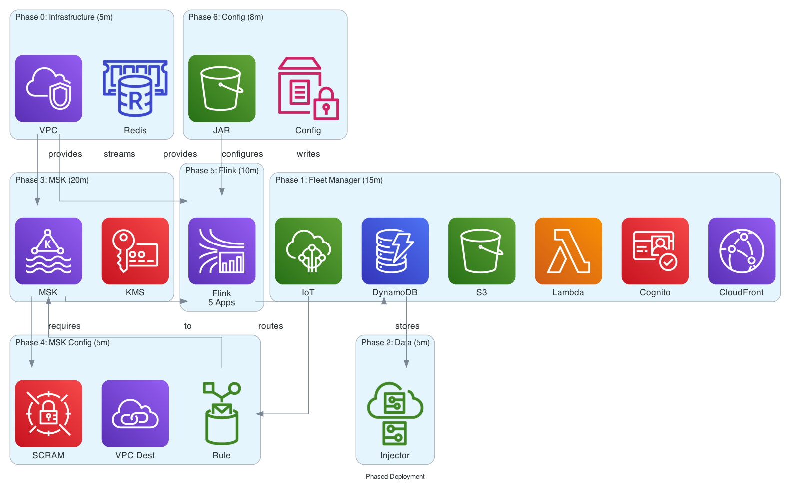

# CloudFormation templates

This guidance uses AWS CDK to generate CloudFormation templates. The CDK application synthesizes the following stacks.

**Core Infrastructure Stacks**:

- cms-<stage>-infrastructure - VPC, subnets, security groups, ElastiCache Redis
- cms-<stage>-storage - DynamoDB tables and S3 buckets
- cms-<stage>-iot - IoT Core configuration and rules
- cms-<stage>-ui - Cognito, CloudFront, and web application

**Telemetry Pipeline Stacks**:

- cms-<stage>-msk - MSK cluster and VPC configuration
- cms-<stage>-telemetry-integration - IoT to MSK integration
- cms-<stage>-flink - Flink applications for stream processing

**Stack Dependencies**:

The stacks have the following deployment dependencies:

1. Infrastructure Foundation (no dependencies)
2. Storage Stack (depends on Infrastructure)
3. IoT Stack (depends on Storage)
4. UI Stack (depends on Storage, IoT)
5. MSK Stack (depends on Infrastructure)
6. Telemetry Integration Stack (depends on MSK, IoT)
7. Flink Stack (depends on MSK, Storage)
   When using manual deployment, ensure dependencies are deployed in order. The interactive wizard and deploy-all command handle dependencies automatically.

**Standalone Fleet Manager UI Deployment**

The Fleet Manager UI can function as a standalone implementation without deploying the telemetry pipeline (Phases 3-7). This is useful for:

- Demonstrating fleet management capabilities without real-time telemetry processing
- Testing the UI and API layer independently
- Rapid prototyping and development
- Cost-effective demos that don’t require MSK and Flink infrastructure

**Standalone Deployment Steps**

Deploy only the core infrastructure and UI components:

```
 # Phase 0: Infrastructure Foundation
make infrastructure AWS_PROFILE=my-profile DEPLOYMENT_STAGE=dev

# Phase 1: Fleet Manager Interface
make phase1 AWS_PROFILE=my-profile DEPLOYMENT_STAGE=dev

# Phase 2: Historical Data Population
make phase2 AWS_PROFILE=my-profile DEPLOYMENT_STAGE=dev
```

After Phase 2 completes, the Fleet Manager UI is fully functional with sample data.

**Historical Data Injector**

The simulator includes a historical data injector that populates DynamoDB tables with realistic fleet data without requiring the telemetry pipeline:

- Drivers: Sample driver profiles with safety scores and performance metrics
- Fleets: Fleet configurations with vehicle assignments
- Vehicles: Vehicle inventory with make, model, VIN, and status
- Trips: Historical trip records with routes, duration, distance, and statistics
- Safety Events: Harsh braking, acceleration, speeding violations, and safety system activations
- Maintenance Events: Oil changes, brake wear, tire pressure alerts, and diagnostic trouble codes

**Running the Historical Data Injector**

The injector runs automatically during Phase 2, but can be executed manually:

```
 cd services/simulation
python3 enhanced_historical_data_injector.py
```

Configuration options:

- Number of vehicles to generate
- Date range for historical data (default: 90 days)
- Event frequency and distribution
- Driver behavior profiles (safe, average, aggressive)
- Fleet size and composition

**What Works in Standalone Mode**

The Fleet Manager UI provides full functionality without the telemetry pipeline:

- Vehicle inventory management and search
- Fleet organization and assignment
- Driver management and performance tracking
- Historical trip visualization with routes and statistics
- Safety event dashboard with severity filtering
- Maintenance alert tracking and scheduling
- Dashboard metrics and KPIs from historical data
- Map visualization of vehicle locations (last known positions)

**What Requires Telemetry Pipeline**

Real-time features require Phases 3-7 (MSK and Flink):

- Live vehicle tracking with 5-second updates
- Real-time telemetry processing and validation
- Stream-based trip detection and aggregation
- Real-time safety event detection from sensor data
- Predictive maintenance alerts from live diagnostics
- Real-time driver behavior scoring

**Use Cases for Standalone Deployment**

- Sales demonstrations and proof-of-concept presentations
- UI/UX development and testing without backend complexity
- Training environments for fleet managers
- Development environments for frontend engineers
- Cost-effective staging environments
- Integration testing with external systems (insurance, service centers)
  The standalone deployment costs approximately 00-400/month compared to 00-1200/month for the full guidance with telemetry pipeline.

## Deployment phases diagram

The following diagram illustrates the phased deployment approach, showing what gets deployed in each phase and the dependencies between phases.



This visual representation shows:

- Phase 0 provides the VPC foundation required by MSK and Flink
- Phases 1-2 create a standalone Fleet Manager UI with sample data
- Phases 3-4 add the streaming backbone (MSK) with IoT integration
- Phases 5-6 add real-time processing capabilities (Flink)
- Dependencies are shown with arrows indicating which phases must complete before others can begin
