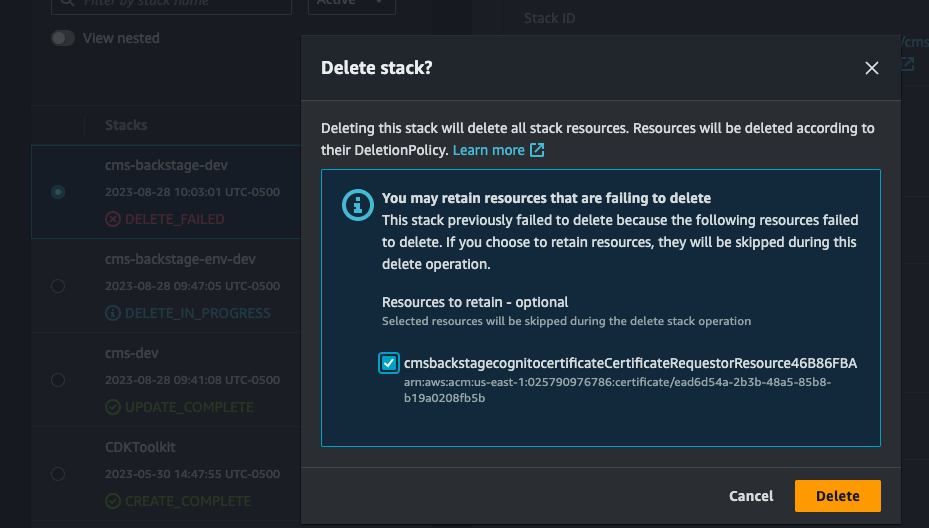

# Delete CMS on AWS modules in order

```
make destroy
```

###### Note

Backstage might fail to delete due to the ACM certificate creation custom resource. After delete fails, select DELETE again and select retain on the custom resource. This will not leave any resources in the account.



## Delete the Backstage ACM certificate (optional)

Navigate to Amazon Certificate Manager, and delete the Backstage certificate.
