# Fleet Manager console

The Fleet Manager console is a React-based web application built with [Cloudscape Design System](https://cloudscape.design/ "https://cloudscape.design/"). It provides fleet operators with real-time visibility into vehicle status, trip history, safety events, maintenance alerts, and data collection campaigns. The console connects to the Fleet Management API and Commands API documented in the [Developer guide](developer-guide.md "developer-guide.md").

## Dashboard

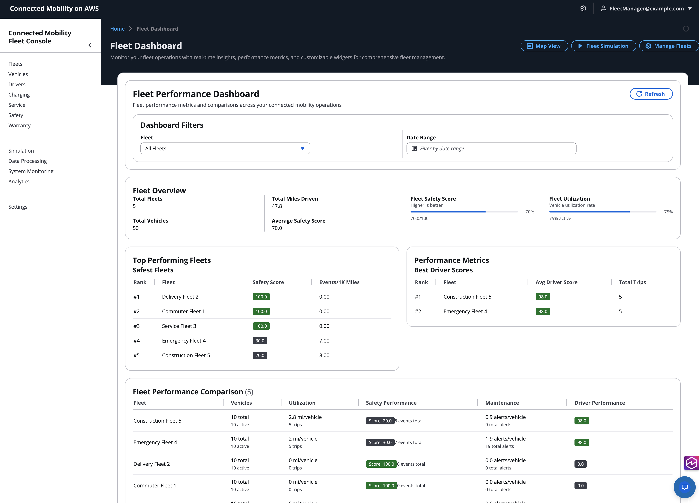

The dashboard is the landing page after sign-in. It displays configurable widgets for fleet-wide metrics including vehicle utilization, distance driven, driver safety scores, braking events, battery state of health, and vehicle health status. Operators can add, remove, and rearrange widgets to customize their view. Action buttons provide quick access to the fleet map, simulation, and fleet management.

## Fleet management

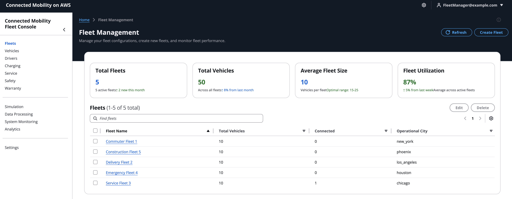

The fleet management page lists all fleets with their vehicle counts and status. Operators can create new fleets, edit fleet details, associate or disassociate vehicles, and delete fleets. Clicking a fleet opens the fleet detail page showing the fleet’s vehicles, active campaigns, and performance summary.

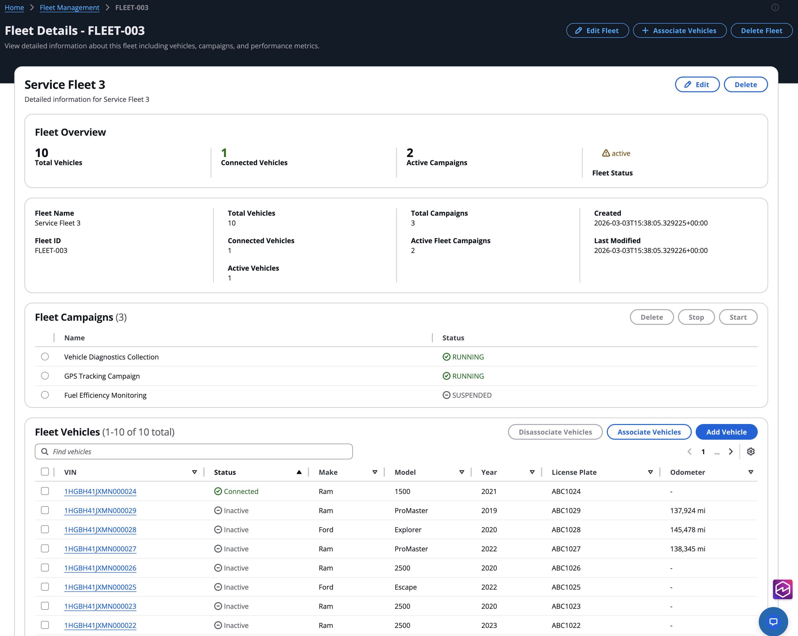

## Vehicle management

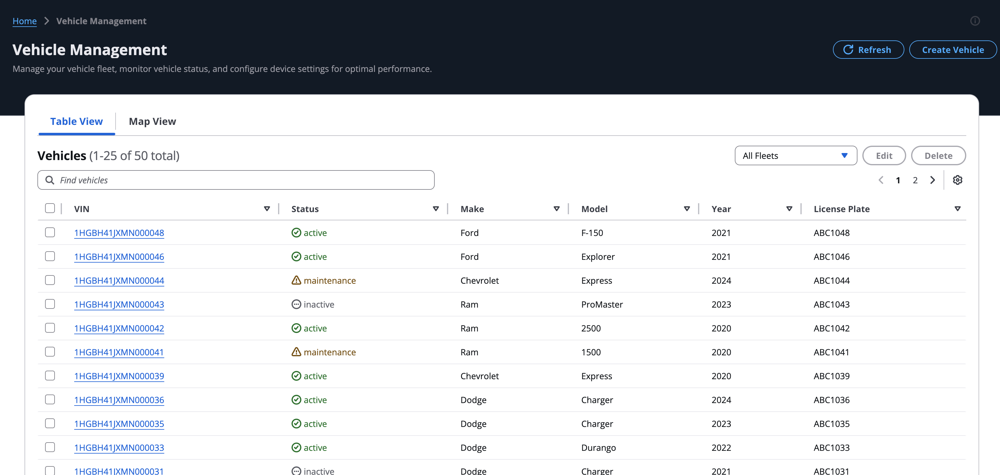

The vehicle management page displays a searchable, sortable table of all registered vehicles with columns for VIN, status, fleet assignment, and last known location. Operators can create new vehicles (which provisions an IoT certificate and thing in AWS IoT Core), edit vehicle attributes, or delete vehicles.

## Vehicle detail

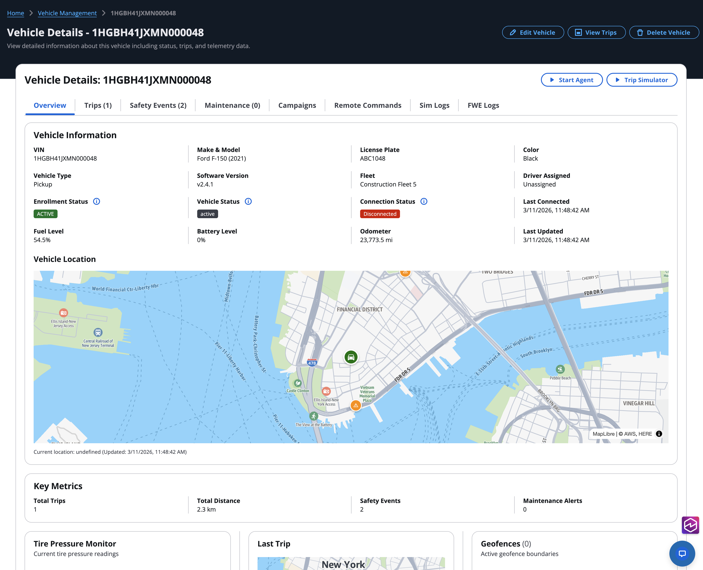

The vehicle detail page is the most information-dense screen in the console. It provides:

- **Live telemetry** — Real-time signal values served from the Redis Last Known State cache (see [Last Known State pattern](last-known-state-pattern.md "last-known-state-pattern.md")). Includes speed, engine RPM, temperatures, tire pressures, battery state, and all other signals from the signal catalog.
- **Trips tab** — List of completed and active trips with start/end times, distance, duration, and driver score.
- **Safety events tab** — Safety events detected during this vehicle’s trips (see [Safety event detection](safety-event-detection.md "safety-event-detection.md")).
- **Remote commands panel** — Send actuator commands to the vehicle (lock doors, flash lights, start engine) and view command history with round-trip latency (see [Remote commands](remote-commands-flow.md "remote-commands-flow.md")).
- **Geofence widget** — Configure and monitor geofence boundaries for the vehicle.
- **Tire pressure widget** — Visual display of per-wheel tire pressure and tread depth.
- **Campaign table** — Active FleetWise data collection campaigns targeting this vehicle.
- **FWE log viewer** — Stream FleetWise Edge agent logs when running in FWE simulation mode.

## Trip detail

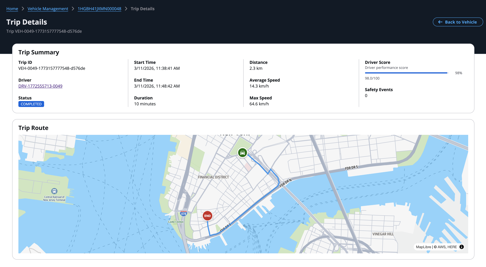

The trip detail page shows a completed or active trip with a route map visualization, telemetry timeline, safety events that occurred during the trip, and the driver safety score breakdown. The route is plotted on an Amazon Location Service map using the GPS coordinates stored in the trip’s DynamoDB record (see [Trip lifecycle](trip-lifecycle.md "trip-lifecycle.md")).

## Fleet map

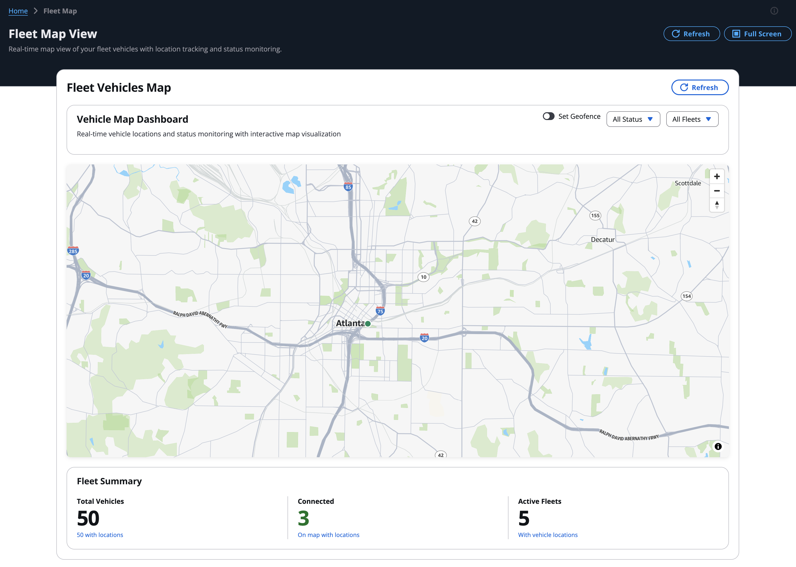

The fleet map displays real-time vehicle positions on an interactive map powered by Amazon Location Service. Vehicle locations are read from the Redis geospatial index using `GEOSEARCH` (see [LKS read path](last-known-state-pattern.md#lks-read-path-detail "last-known-state-pattern.md#lks-read-path-detail")). Only vehicles with active trips appear on the map. Clicking a vehicle marker shows a card with current speed, heading, driver, and trip status.

## Driver management

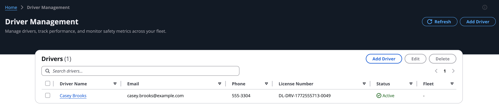

The driver management page lists all drivers with their safety scores, trip counts, and fleet assignments. Clicking a driver opens the driver detail page showing trip history, safety event history, and a per-trip score trend.

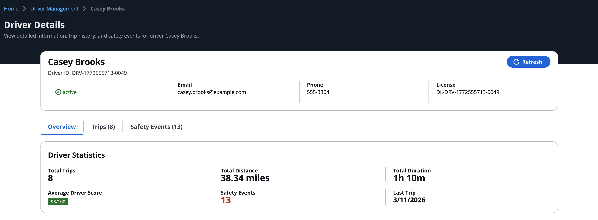

## Safety alerts

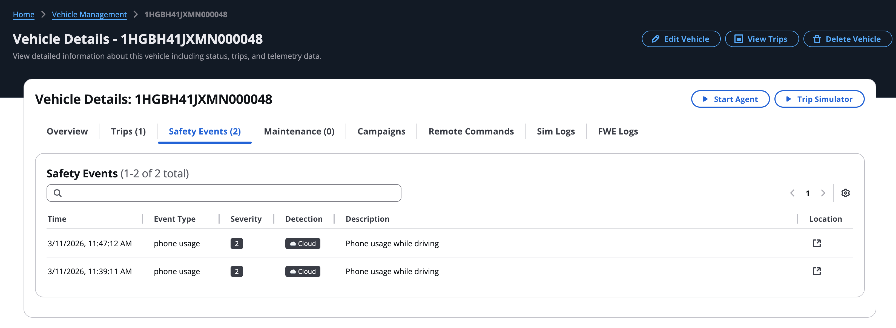

The safety alerts page displays all safety events across the fleet in a filterable table. Operators can filter by fleet, vehicle, event type, severity, and time range. Each row shows the event type, severity, vehicle, trip, timestamp, and trigger details. Clicking a row opens a location modal showing where the event occurred on a map. Events are generated by the SafetyProcessor (see [Safety event detection](safety-event-detection.md "safety-event-detection.md")).

## Service alerts

The service alerts page shows maintenance alerts generated by the MaintenanceProcessor (see [Maintenance alert detection](maintenance-alert-detection.md "maintenance-alert-detection.md")). Alerts are displayed with type, severity, vehicle, DTC code, trigger signal, and threshold. Operators can filter by fleet and time range to focus on specific maintenance concerns.

## Simulation

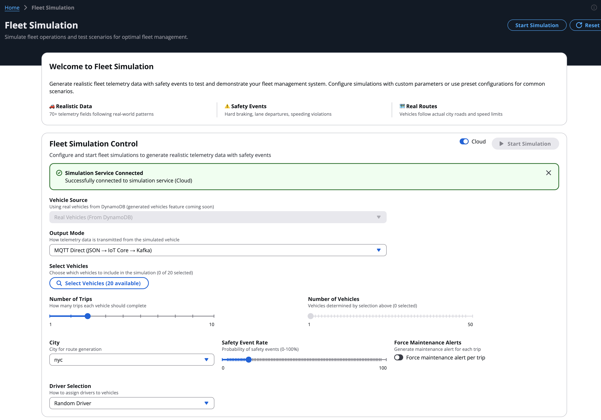

The simulation page provides controls to start, configure, and monitor vehicle telemetry simulations. Operators select the number of vehicles, trips per vehicle, city, safety event rate, and telemetry mode (MQTT Direct or FleetWise Edge). Built-in presets (Quick Test, Fleet Demo, Stress Test) provide one-click configurations. The page shows running simulations with status, vehicle count, and elapsed time. For details on how simulation works, see [Simulation platform](simulation-platform.md "simulation-platform.md").

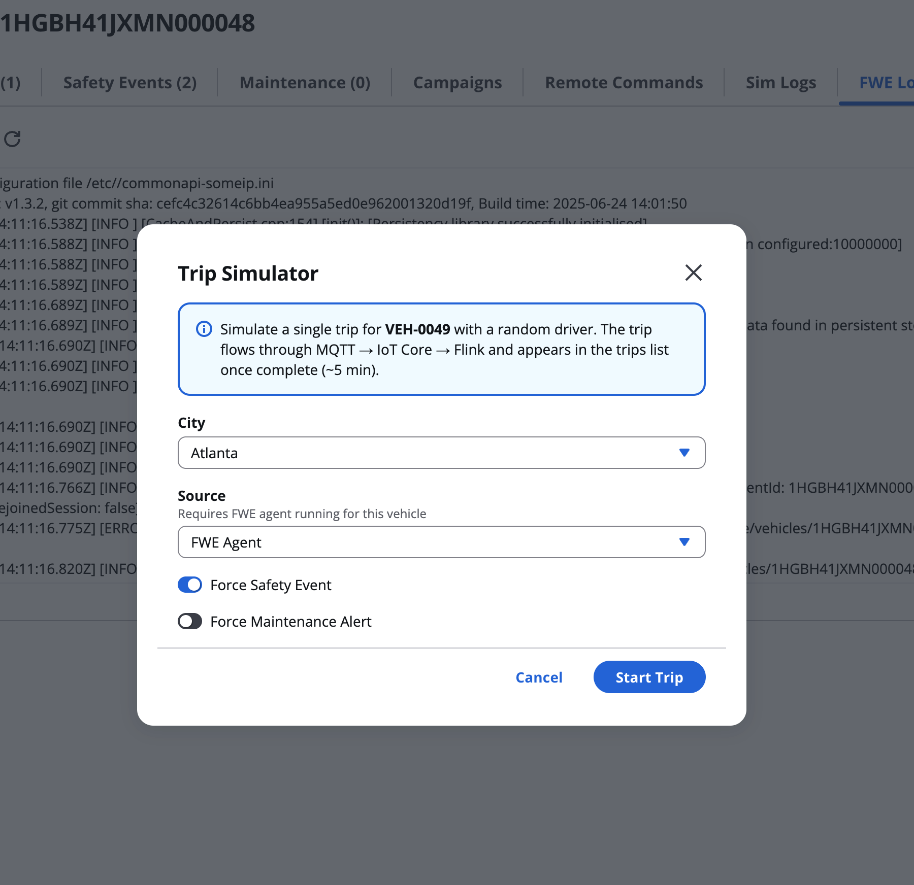

From the vehicle detail page, operators can launch a single-vehicle simulation directly. This starts a trip for the selected vehicle without leaving the detail view.

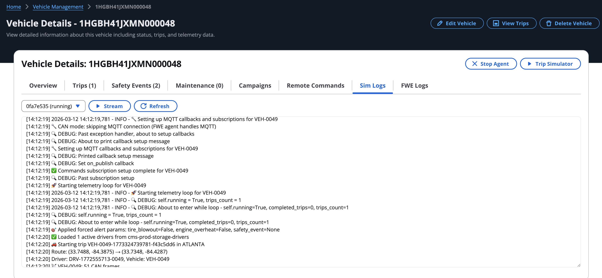

The simulator log viewer streams real-time output from the simulation process, showing telemetry publish events, trip start/end events, and safety event injections.

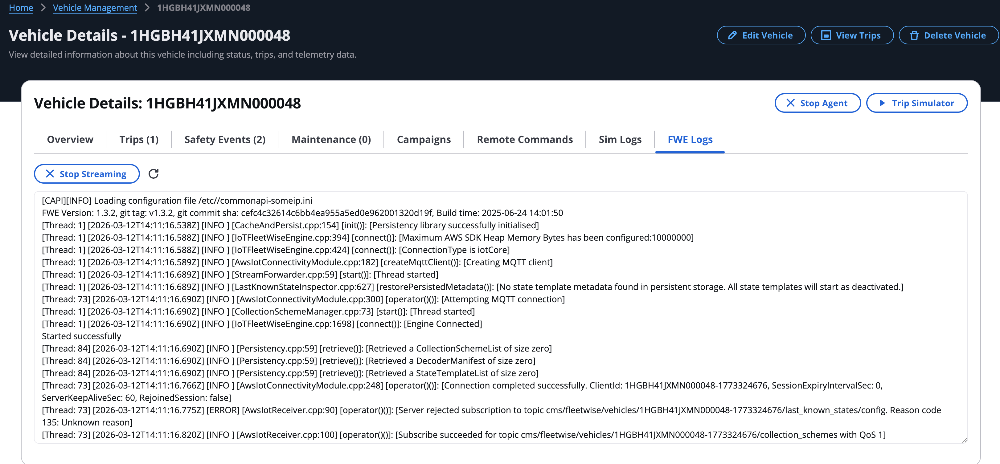

When running in FleetWise Edge mode, the FWE log viewer streams the agent’s stdout showing MQTT connection status, checkin messages, collection scheme receipts, and CAN signal collection activity.

## Data processing

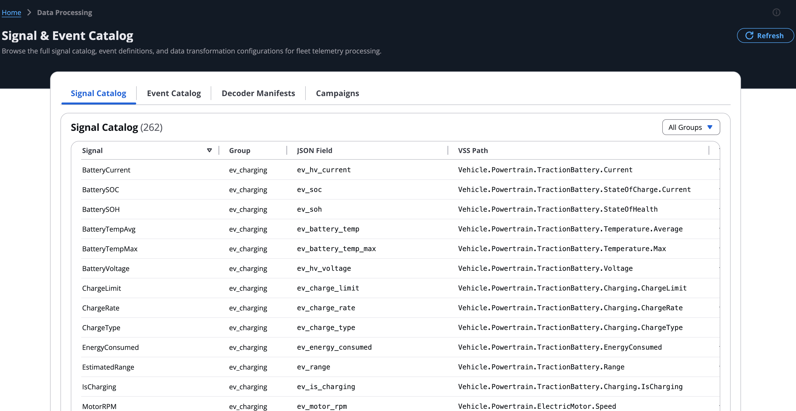

The data processing page provides a read-only browser for the signal catalog, event catalog, decoder manifests, and data transformation configurations. Operators can browse all 260+ signals grouped by category, view signal metadata (VSS path, unit, data type, range), and search for specific signals.

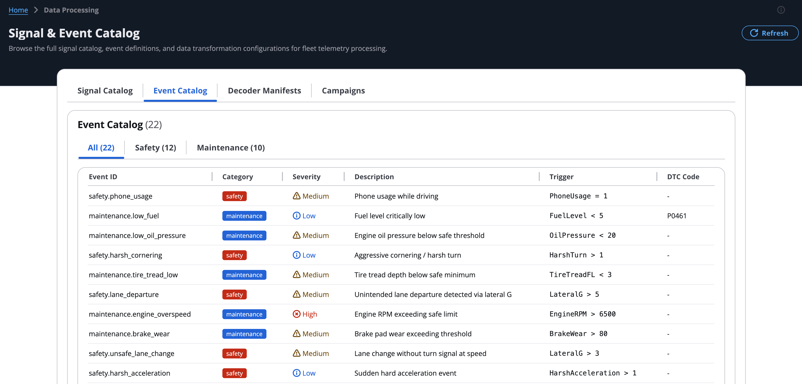

The event catalog viewer displays all safety and maintenance event detection rules with their trigger signals, operators, thresholds, and severity levels. This is the same catalog used by the SafetyProcessor and MaintenanceProcessor Flink applications (see [Safety event detection](safety-event-detection.md "safety-event-detection.md") and [Maintenance alert detection](maintenance-alert-detection.md "maintenance-alert-detection.md")).

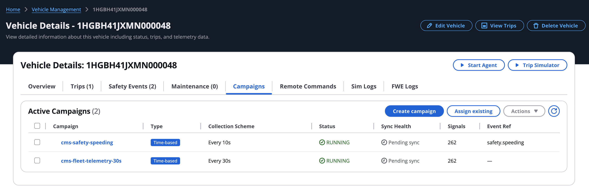

The campaigns view lists all FleetWise data collection campaigns with their status (RUNNING, SUSPENDED, COMPLETED), target vehicles, and signal counts. Operators can create new campaigns, suspend or resume active campaigns, and view campaign details. For details on how campaigns control FWE agent behavior, see [Campaigns](dynamic-data-collection.md#campaigns-overview "dynamic-data-collection.md#campaigns-overview").

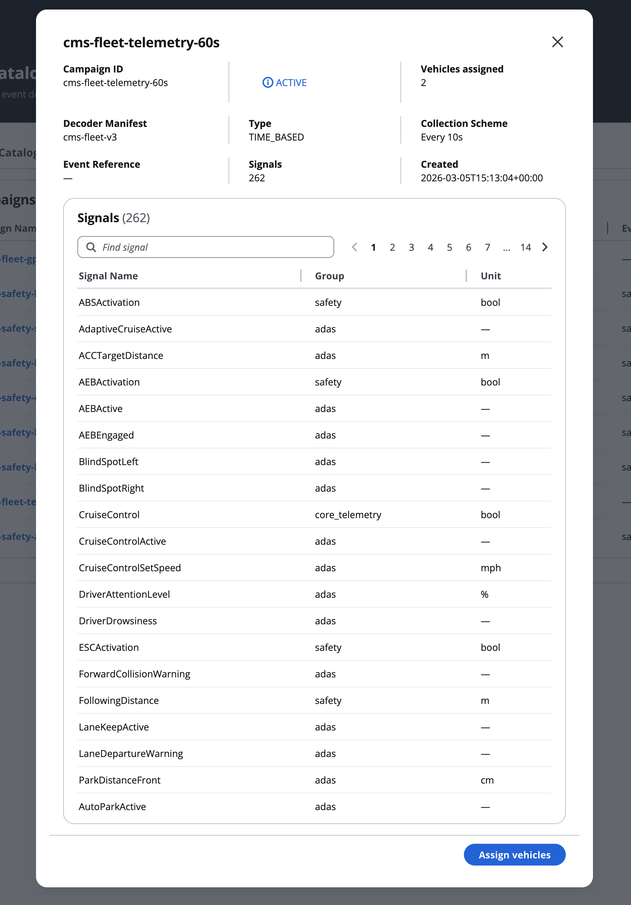

## Analytics

The analytics section provides four views:

- **Telemetry dashboard** — Real-time and historical telemetry visualization across the fleet.
- **Driver behavior** — Driver safety score trends, event frequency analysis, and fleet-wide behavior patterns.
- **Geofence events** — Geofence entry/exit events with map visualization.
- **Trip analytics** — Trip duration, distance, and efficiency metrics across the fleet.

## Settings

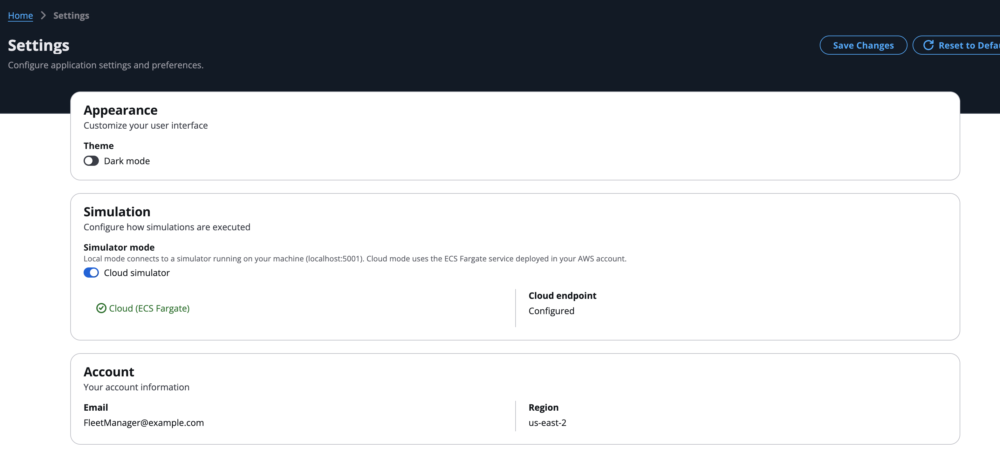

The settings page allows operators to configure application preferences including API endpoint, simulation service endpoint, theme, and display options.
