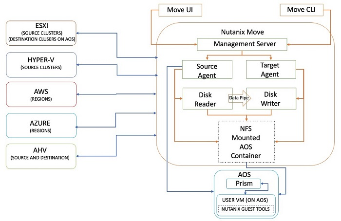

# Nutanix Move architecture

overview

Nutanix Move is delivered as a virtual machine (VM) appliance, which is typically hosted
on the target Nutanix AHV cluster running on AWS. The Nutanix Move tool is composed of
several software services that can be categorized into the following major software
components:

1. The management server
2. Virtual move appliances for both the source and target environments
3. Disk readers and writers
   The architecture of Nutanix Move for VMware ESXi environments utilizes the vCenter
   platform for inventory collection, and uses the vSphere Storage APIs for Data Protection
   (VADP), the Virtual Disk Development Kit (VDDK), and Changed Block Tracking (CBT)
   functionality to facilitate the data migration process.

An architecture diagram for the Nutanix Move solution is provided:

**Figure 1: Architecture diagram – Nutanix Move.**
