# Amazon RDS Backup & Restore Using AWS Backup

|                      |                                                                                                                                                                                            |
| -------------------- | ------------------------------------------------------------------------------------------------------------------------------------------------------------------------------------------ | ---------------------------------------------------------------------------------------------------------------------------------------------------------------------------------------------------------------------------------------------------------------------------------------------------------------------------------------------------------------------------------------------------------------------------------------------------------------------------------------------------------------------------------------------------------------------------------------------------------------------------------------------------------------------------------------------------------------------------------------------------------------------------------------------------------------------------------------------------------------------------------------------------------------------------------------------------------------------------------------------------------------------------------------------------------------------------------------------------------------------------------------------------------------------------------------------------------------------------------------------------------------------------------------------------------------------------------------------------------------------------------------------------------------------------------------------------------------------------------------------------------------------------------------------------------------------------------------------------------------------------------------------------------------------------------------------------------------------------------------------------------------------------------------------------------------------------------------------------------------------------------------------------------------------------------------------------------------------------------------------------------------------------------------------------------------------------------------------------------------------------------------------------------------------------------------------------------------------------------------------------------------------------------------------------------------------------------------------------------------------------------------------------------------------------------------------------------------------------------------------------------------------------------------------------------------------------------------------------------------------------------------------------------------------------------------------------------------------------------------------------------------------------------------------------------------------------------------------------------------------------------------------------------------------------------------------------------------------------------------------------------------------------------------------------------------------------------------------------------------------------------------------------------------------------------------------------------------------------------------------------------------------------------------------------------------------------------------------------------------------------------------------------------------------------------------------------------------------------------------------------------------------------------------------------------------------------------------------------------------------------------------------------------------------------------------------------------------------------------------------------------------------------------------------------------------------------------------------------------------------------------------------------------------------------------------------------------------------------------------------------------------------------------------------------------------------------------------------------------------------------------------------------------------------------------------------------------------------------------------------------------------------------------------------------------------------------------------------------------------------------------------------------------------------------------------------------------------------------------------------------------------------------------------------------------------------------------------------------------------------------------------------------------------------------------------------------------------------------------------------------------------------------------------------------------------------------------------------------------------------------------------------------------------------------------------------------------------------------------------------------------------------------------------------------------------------------------------------------------------------------------------------------------------------------------------------------------------------------------------------------------------------------------------------------------------------------------------------------------------------------------------------------------------------------------------------------------------------------------------------------------------------------------------------------------------------------------------------------------------------------------------------------------------------------------------------------------------------------------------------------------------------------------------------------------------------------------------------------------------------------------------------------------------------------------------------------------------------------------------------------------------------------------------------------------------------------------------------------------------------------------------------------------------------------------------------------------------------------------------------------------------------------------------------------------------------------------------------------------------------------------------------------------------------------------------------------------------------------------------------------------------------------------------------------------------------------------------------------------------------------------------------------------------------------------------------------------------------------------------------------------------------------------------------------------------------------------------------------------------------------------------------------------------------------------------------------------------------------------------------------------------------------------------------------------------------------------------------------------------------------------------------------------------------------------------------------------------------------------------------------------------------------------------------------------------------------------------------------------------------------------------------------------------------------------------------------------------------------------------------------------------------------------------------------------------------------------------------------------------------------------------------------------------------------------------------------------------------------------------------------------------------------------------------------------------------------------------------------------------------------------------------------------------------------------------------------------------------------------------------------------------------------------------------------------------------------------------------------------------------------------------------------------------------------------------------------------------------------------------------------------------------------------------------------------------------------------------------------------------------------------------------------------------------------------------------------------------------------------------------------------------------------------------------------------------------------------------------------------------------------------------------------------------------------------------------------------------------------------------------------------------------------------------------------------------------------------------------------------------------------------------------------------------------------------------------------------------------------------------------------------------------------------------------------------------------------------------------------------------------------------------------------------------------------------------------------------------------------------------------------------------------------------------------------------------------------------------------------------------------------------------------------------------------------------------------------------------------------------------------------------------------------------------------------------------------------------------------------------------------------------------------------------------------------------------------------------------------------------------------------------------------------------------------------------------------------------------------------------------------------------------------------------------------------------------------------------------------------------------------------------------------------------------------------------------------------------------------------------------------------------------------------------------------------------------------------------------------------------------------------------------------------------------------------------------------------------------------------------------------------------------------------------------------------------------------------------------------------------------------------------------------------------------------------------------------------------------------------------------------------------------------------------------------------------------------------------------------------------------------------------------------------------------------------------------------------------------------------------------------------------------------------------------------------------------------------------------------------------------------------------------------------------------------------------------------------------------------------------------------------------------------------------------------------------------------------------------------------------------------------------------------------------------------------------------------------------------------------------------------------------------------------------------------------------------------------------------------------------------------------------------------------------------------------------------------------------------------------------------------------------------------------------------------------------------------------------------------------------------------------------------------------------------------------------------------------------------------------------------------------------------------------------------------------------------------------------------------------------------------------------------------------------------------------------------------------------------------------------------------------------------------------------------------------------------------------------------------------------------------------------------------------------------------------------------------------------------------------------------------------------------------------------------------------------------------------------------------------------------------------------------------------------------------------------------------------------------------------------------------------------------------------------------------------------------------------------------------------------------------------------------------------------------------------------------------------------------------------------------------------------------------------------------------------------------------------------------------------------------------------------------------------------------------------------------------------------------------------------------------------------------------------------------------------------------------------------------------------------------------------------------------------------------------------------------------------------------------------------------------------------------------------------------------------------------------------------------------------------------------------------------------------------------------------------------------------------------------------------------------------------------------------------------------------------------------------------------------------------------------------------------------------------------------------------------------------------------------------------------------------------------------------------------------------------------------------------------------------------------------------------------------------------------------------------------------------------------------------------------------------------------------------------------------------------------------------------------------------------------------------------------------------------------------------------------------------------------------------------------------------------------------------------------------------------------------------------------------------------------------------------------------------------------------------------------------------------------------------------------------------------------------------------------------------------------------------------------------------------------------------------------------------------------------------------------------------------------------------------------------------------------------------------------------------------------------------------------------------------------------------------------------------------------------------------------------------------------------------------------------------------------------------------------------------------------------------------------------------------------------------------------------------------------------------------------------------------------------------------------------------------------------------------------------------------------------------------------------------------------------------------------------------------------------------------------------------------------------------------------------------------------------------------------------------------------------------------------------------------------------------------------------------------------------------------------------------------------------------------------------------------------------------------------------------------------------------------------------------------------------------------------------------------------------------------------------------------------------------------------------------------------------------------------------------------------------------------------------------------------------------------------------------------------------------------------------------------------------------------------------------------------------------------------------------------------------------------------------------------------------------------------------------------------------------------------------------------------------------------------------------------------------------------------------------------------------------------------------------------------------------------------------------------------------------------------------------------------------------------------------------------------------------------------------------------------------------------------------------------------------------------------------------------------------------------------------------------------------------------------------------------------------------------------------------------------------------------------------------------------------------------------------------------------------------------------------------------------------------------------------------------------------------------------------------------------------------------------------------------------------------------------------------------------------------------------------------------------------------------------------------------------------------------------------------------------------------------------------------------------------------------------------------------------------------------------------------------------------------------------------------------------------------------------------------------------------------------------------------------------------------------------------------------------------------------------------------------------------------------------------------------------------------------------------------------------------------------------------------------------------------------------------------------------------------------------------------------------------------------------------------------------------------------------------------------------------------------------------------------------------------------------------------------------------------------------------------------------------------------------------------------------------------------------------------------------------------------------------------------------------------------------------------------------------------------------------------------------------------------------------------------------------------------------------------------------------------------------------------------------------------------------------------------------------------------------------------------------------------------------------------------------------------------------------------------------------------------------------------------------------------------------------------------------------------------------------------------------------------------------------------------------------------------------------------------------------------------------------------------------------------------------------------------------------------------------------------------------------------------------------------------------------------------------------------------------------------------------------------------------------------------------------------------------------------------------------------------------------------------------------------------------------------------------------------------------------------------------------------------------------------------------------------------------------------------------------------------------------------------------------------------------------------------------------------------------------------------------------------------------------------------------------------------------------------------------------------------------------------------------------------------------------------------------------------------------------------------------------------------------------------------------------------------------------------------------------------------------------------------------------------------------------------------------------------------------------------------------------------------------------------------------------------------------------------------------------------------------------------------------------------------------------------------------------------------------------------------------------------------------------------------------------------------------------------------------------------------------------------------------------------------------------------------------------------------------------------------------------------------------------------------------------------------------------------------------------------------------------------------------------------------------------------------------------------------------------------------------------------------------------------------------------------------------------------------------------------------------------------------------------------------------------------------------------------------------------------------------------------------------------------------------------------------------------------------------------------------------------------------------------------------------------------------------------------------------------------------------------------------------------------------------------------------------------------------------------------------------------------------------------------------------------------------------------------------------------------------------------------------------------------------------------------------------------------------------------------------------------------------------------------------------------------------------------------------------------------------------------------------------------------------------------------------------------------------------------------------------------------------------------------------------------------------------------------------------------------------------------------------------------------------------------------------------------------------------------------------------------------------------------------------------------------------------------------------------------------------------------------------------------------------------------------------------------------------------------------------------------------------------------------------------------------------------------------------------------------------------------------------------------------------------------------------------------------------------------------------------------------------------------------------------------------------------------------------------------------------------------------------------------------------------------------------------------------------------------------------------------------------------------------------------------------------------------------------------------------------------------------------------------------------------------------------------------------------------------------------------------------------------------------------------------------------------------------------------------------------------------------------------------------------------------------------------------------------------------------------------------------------------------------------------------------------------------------------------------------------------------------------------------------------------------------------------------------------------------------------------------------------------------------------------------------------------------------------------------------------------------------------------------------------------------------------------------------------------------------------------------------------------------------------------------------------------------------------------------------------------------------------------------------------------------------------------------------------------------------------------------------------------------------------------------------------------------------------------------------------------------------------------------------------------------------------------------------------------------------------------------------------------------------------------------------------------------------------------------------------------------------------------------------------------------------------------------------------------------------------------------------------------------------------------------------------------------------------------------------------------------------------------------------------------------------------------------------------------------------------------------------------------------------------------------------------------------------------------------------------------------------------------------------------------------------------------------------------------------------------------------------------------------------------------------------------------------------------------------------------------------------------------------------------------------------------------------------------------------------------------------------------------------------------------------------------------------------------------------------------------------------------------------------------------------------------------------------------------------------------------------------------------------------------------------------------------------------------------------------------------------------------------------------------------------------------------------------------------------------------------------------------------------------------------------------------------------------------------------------------------------------------------------------------------------------------------------------------------------------------------------------------------------------------------------------------------------------------------------------------------------------------------------------------------------------------------------------------------------------------------------------------------------------------------------------------------------------------------------------------------------------------------------------------------------------------------------------------------------------------------------------------------------------------------------------------------------------------------------------------------------------------------------------------------------------------------------------------------------------------------------------------------------------------------------------------------------------------------------------------------------------------------------------------------------------------------------------------------------------------------------------------------------------------------------------------------------------------------------------------------------------------------------------------------------------------------------------------------------------------------------------------------------------------------------------------------------------------------------------------------------------------------------------------------------------------------------------------------------------------------------------------------------------------------------------------------------------------------------------------------------------------------------------------------------------------------------------------------------------------------------------------------------------------------------------------------------------------------------------------------------------------------- |
| **AWS experience**   | Intermediate                                                                                                                                                                               |
| **Time to complete** | 10 minutes                                                                                                                                                                                 |
| **Cost to complete** | Free ([Amazon RDS Free Tier](https://aws.amazon.com/rds/free/ "https://aws.amazon.com/rds/free/"))                                                                                         |
| **Services used**    | [AWS Backup](https://aws.amazon.com/backup/ "https://aws.amazon.com/backup/") [Amazon Relational Database Service (Amazon RDS)](https://aws.amazon.com/rds/ "https://aws.amazon.com/rds/") | ## Overview [AWS Backup](https://aws.amazon.com/backup/ "https://aws.amazon.com/backup/") enables you to centralize and automate data protection across AWS services. AWS Backup is a fully managed, policy-based service that simplifies data protection at scale. The service is ideal for use cases such as regulatory compliance obligations, business policies for data protection, and business continuity goals. In this how-to guide, we will use the AWS Management Console to set up automated backups of select AWS services using Amazon Relational Database Service (Amazon RDS), restore a backup, and clean up our resources to avoid unexpected costs. See [this list](../../../aws-backup/latest/devguide/whatisbackup.md#supported-resources "../../../aws-backup/latest/devguide/whatisbackup.md#supported-resources") for all the AWS and third-party services supported by AWS Backup. When going to production, remember to set up the correct schedules and retention management, and to monitor your costs. ## What you will accomplish  • Create an on-demand backup job of an Amazon RDS database  • Use a backup plan to back up Amazon RDS resources - using a backup plan within AWS Backup, you can automate your backups on a schedule  • Add resources to an existing backup plan using tags  • Restore a backup ## Prerequisites You will need the following resources or permissions to proceed with this how-to guide:  • An [AWS account](https://aws.amazon.com/premiumsupport/knowledge-center/create-and-activate-aws-account/ "https://aws.amazon.com/premiumsupport/knowledge-center/create-and-activate-aws-account/"). For more information on using AWS Backup for the first time, view the [AWS Backup Developer Guide](../../../aws-backup/latest/devguide/setting-up.md "../../../aws-backup/latest/devguide/setting-up.md").  • One or more Amazon RDS databases (including those that are free tier eligible). For the pricing of databases not in the free tier, refer to [Amazon RDS Pricing](https://aws.amazon.com/rds/pricing/ "https://aws.amazon.com/rds/pricing/"). For AWS Backup pricing, refer to [AWS Backup Pricing](https://aws.amazon.com/backup/pricing/ "https://aws.amazon.com/backup/pricing/").  • IAM roles used by AWS Backup to create a backup of the Amazon RDS database.  • If a subsequent role is not created, then the default IAM role can be used - AWSBackupDefaultRole ## Implementation 1. Open the AWS Backup console Log in to the [AWS Management Console](https://console.aws.amazon.com/ "https://console.aws.amazon.com/"), and open the [AWS Backup console.](https://console.aws.amazon.com/backup "https://console.aws.amazon.com/backup") 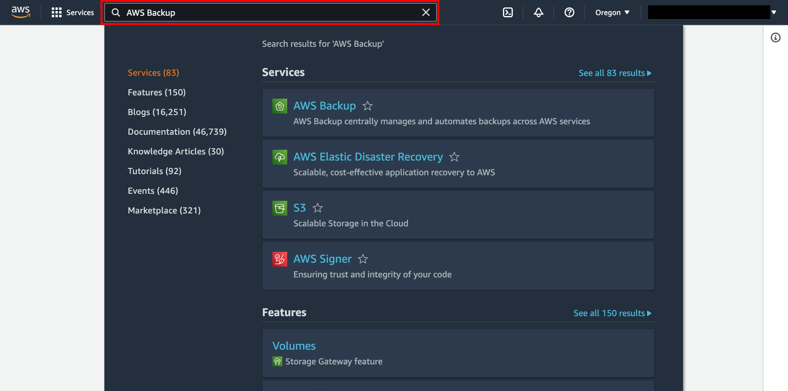 2. Configure the services used with AWS Backup On the navigation pane on the left side of the [AWS Backup console,](https://console.aws.amazon.com/backup "https://console.aws.amazon.com/backup") under **My account,** choose **Settings**. 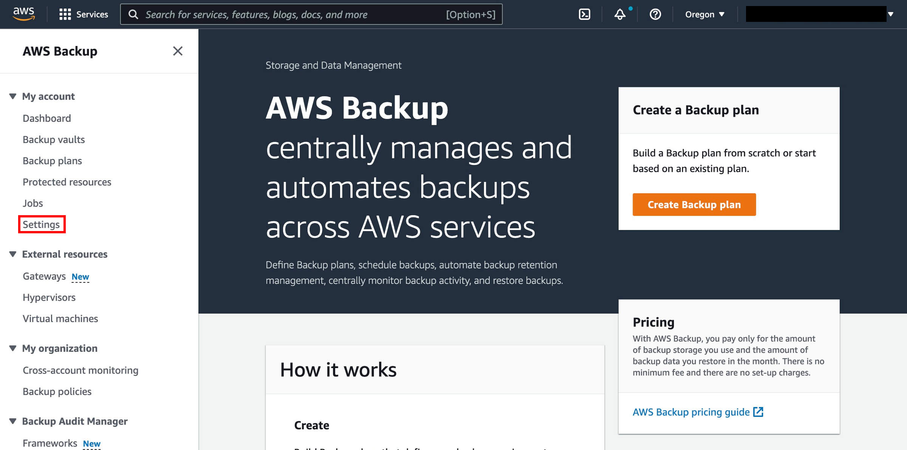 3. Configure resources On the **Service opt-in** page, choose **Configure resources**. 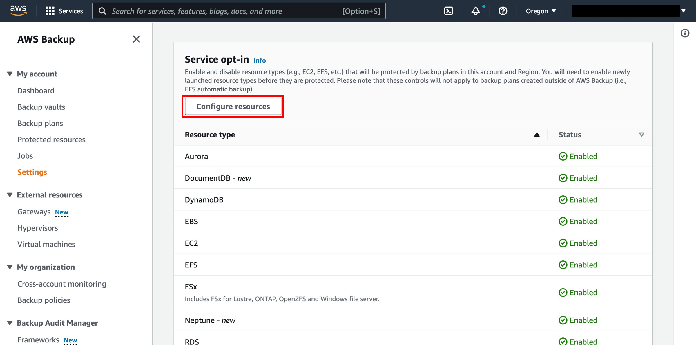 4. Select services for backup On the Configure resources page, use the toggle switches to enable or disable the services used with AWS Backup. Choose Confirm when your services are configured.  • AWS resources that you're backing up should be in the Region you are using for this how-to guide, and resources must all be in the same AWS Region (however, see step 2.11 for information on cross-Region copy). This how-to guide uses the US East (N. Virginia) Region (us-east-1). 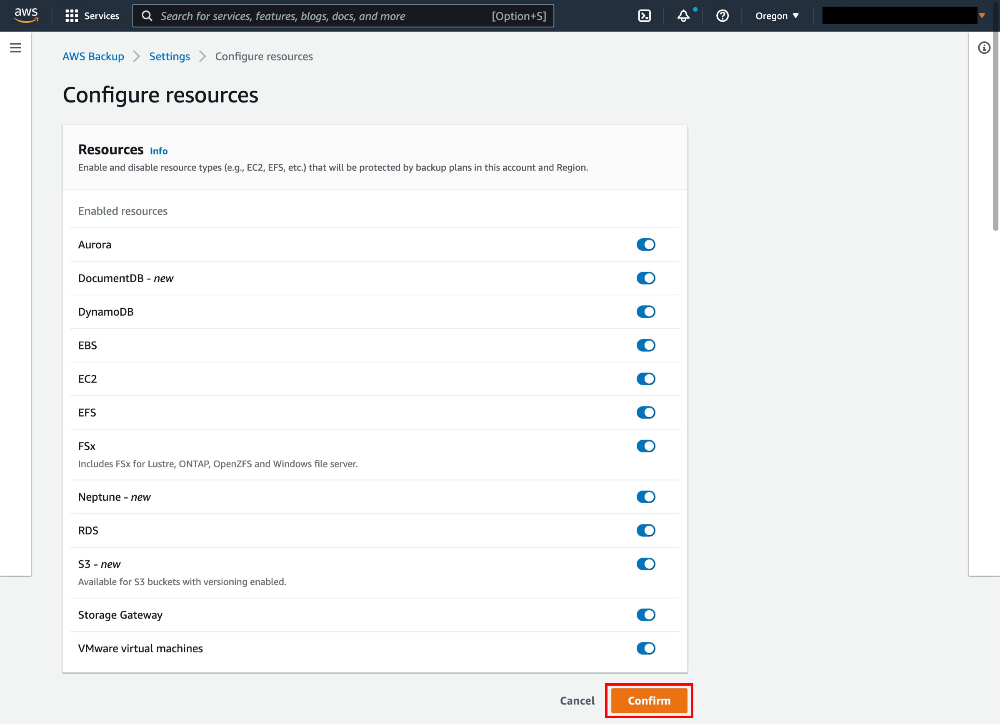 5. Create an on-demand backup job of an Amazon RDS database Back in the [AWS Backup console](https://console.aws.amazon.com/backup "https://console.aws.amazon.com/backup"), under **My account** on the left navigation pane, select **Protected resources.** 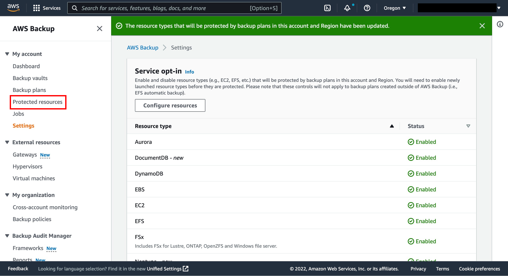 6. Choose Create an on-demand backup From the dashboard, select the **Create on-demand** **backup** button. 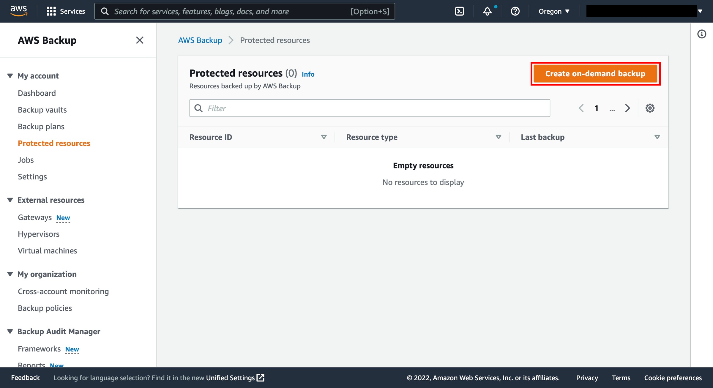 7. Configure on-demand backup settings On the **Create on-demand backup page**, choose the following options: Select the resource type that you want to back up; for example, choose **RDS** for Amazon RDS. Choose the **database name** or **ID** of the resource that you want to protect; for example, analytics. Ensure that **Create backup now** is selected. This initiates your backup job immediately and enables you to see your saved resource sooner on the **Protected resources** page. Select the desired **retention period**. AWS Backup automatically deletes your backups at the end of this period to save storage costs for you. Choose an existing backup vault. Choosing **Create new Backup vault** opens a new page to create a vault and then returns you to the **Create on-demand backup** page when you are finished. Under **IAM role**, choose **Default** role. ###### Note If the AWS Backup Default role is not present in your account, then an AWS Backup Default role is created with the correct permissions. Select the **Create on-demand backup** button. This takes you to the **Jobs** page, where you will see a list of jobs. 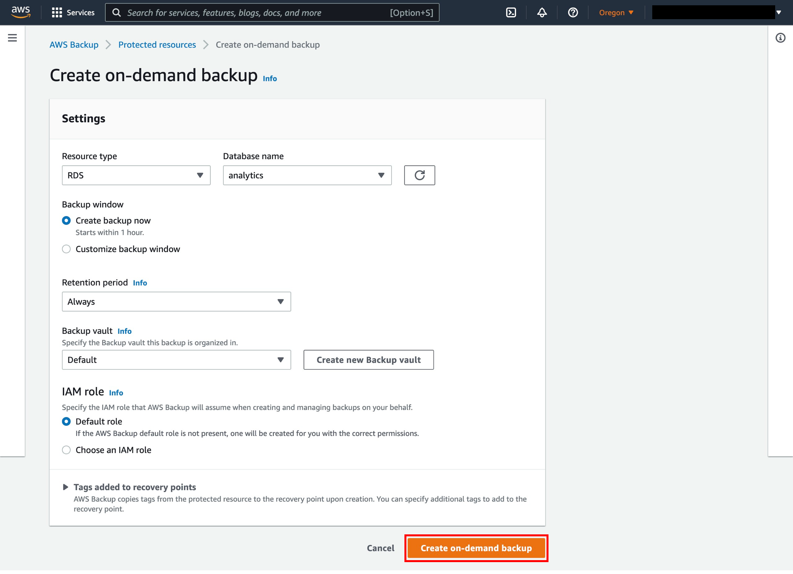 8. View the backup job details Choose the **Backup job ID** for the resource that you chose to back up to see the details of that job. 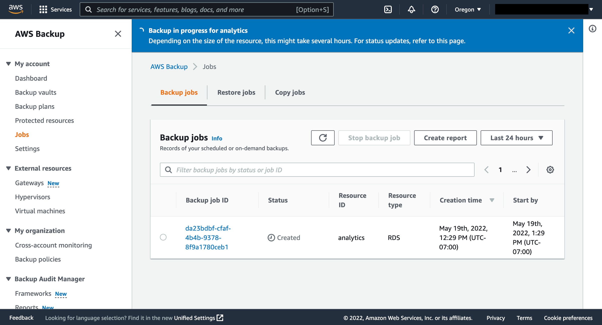 1. Configure the services used with AWS Backup Back on the left navigation pane in the AWS Backup console, under **My account**, choose **Settings**. 2. Configure resources On the **Service opt-in** page, choose **Configure resources**. 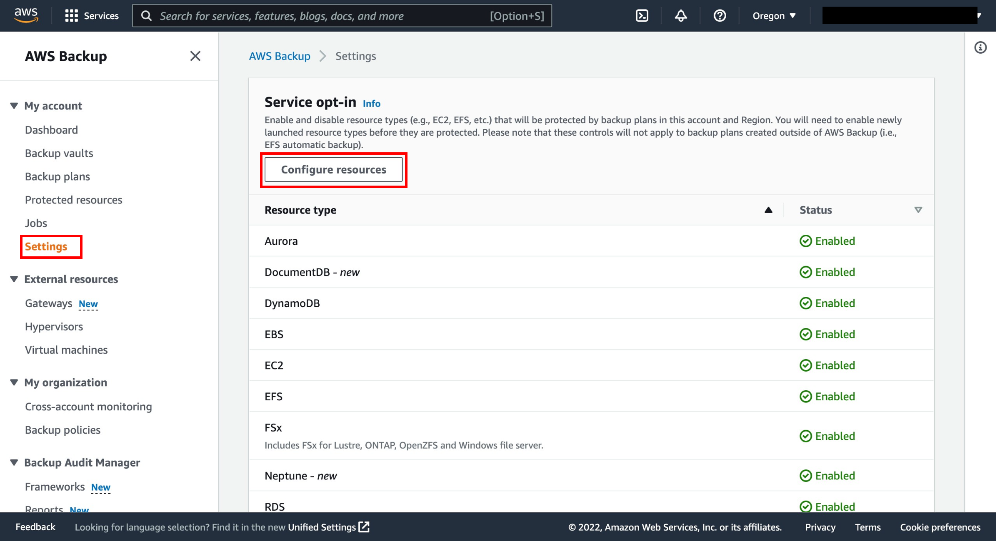 3. Select services for backup On the **Configure resources** page, use the toggle switches to enable or disable the services used with AWS Backup. Choose **Confirm** when your services are configured. AWS resources that you're backing up should be in the Region you are using for this tutorial, and resources must all be in the same AWS Region (however, see step 2.11 for information on cross-Region copy). This tutorial uses the US East (N. Virginia) Region (us-east-1). 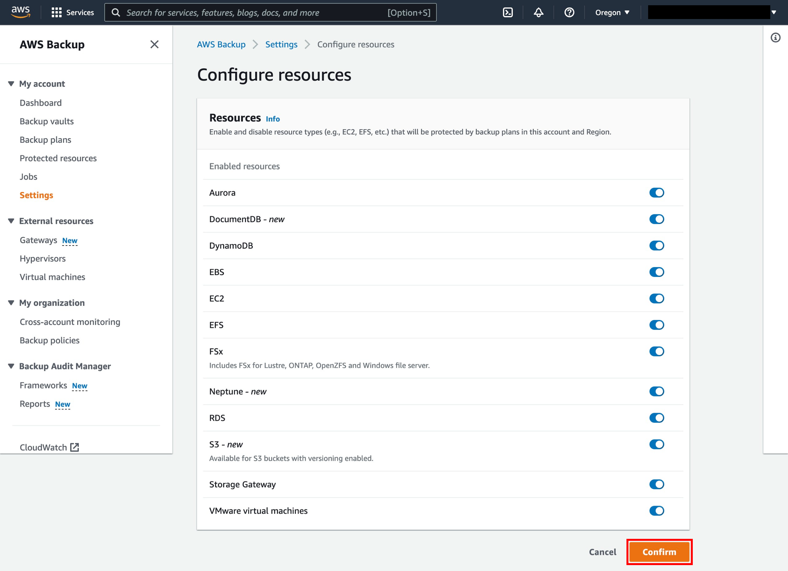 4. Configure a backup plan In the AWS Backup console, select **Backup plans** on the left navigation pane under **My account**, and then **Create backup** **plan**. 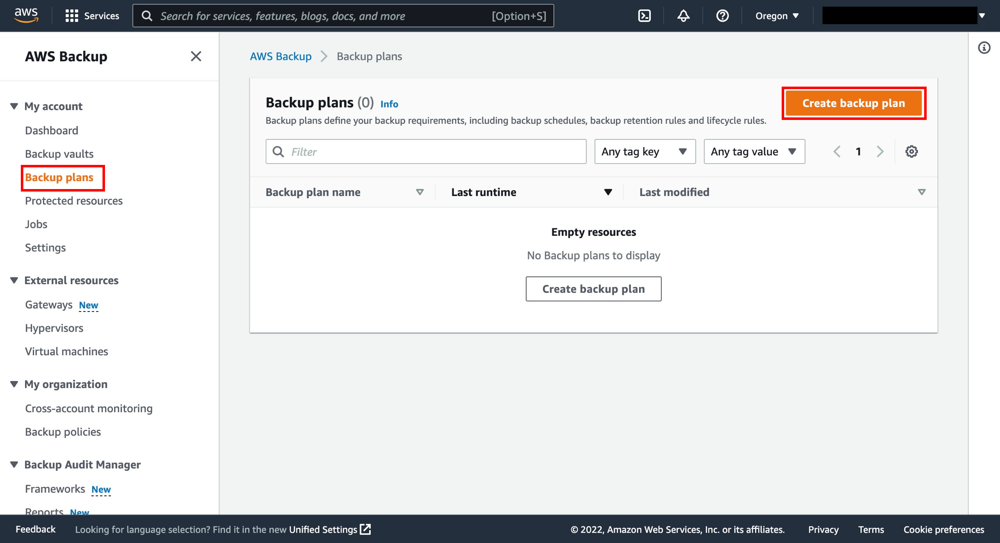 5. Create a new backup plan AWS Backup provides three ways to get started using the AWS Backup console but for this how-to guide, select **Build a new plan:**  • **Start with a template** — You can create a new backup plan based on a template provided by AWS Backup. Be aware that backup plans created by AWS Backup are based on backup best practices and common backup policy configurations. When you select an existing backup plan to start from, the configurations from that backup plan are automatically populated for your new backup plan. You can then change any of these configurations according to your backup requirements.  • **Build a new plan** — You can create a new backup plan by specifying each of the backup configuration details, as described in the next section. You can choose from the recommended default configurations.  • **Define a plan using JSON** - You can modify the JSON expression of an existing backup plan or create a new expression. **Backup plan name** - You must provide a unique backup plan name. If you try to create a backup plan that is identical to an existing plan, you get an _AlreadyExistsException_ error. For this how-to guide, enter **RDS-webapp**. 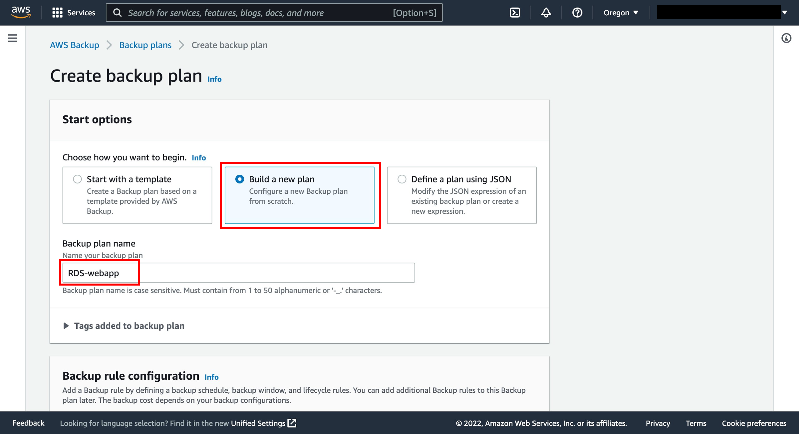 6. Enter a backup rule name **Backup rule name** - Backup plans are composed of one or more backup rules. Backup rule names are case sensitive. They must contain from 1 to 63 alphanumeric characters or hyphens. For this how-to guide, enter **RDS-Dailies.** 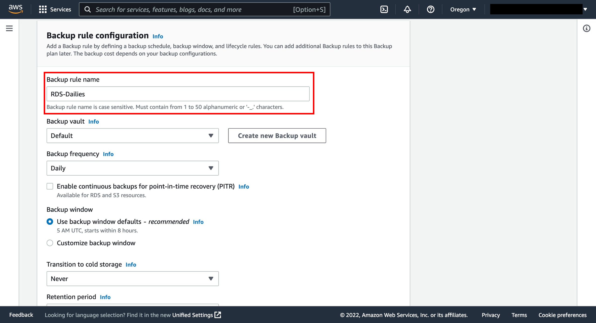 7. Create a backup vault **Backup vault** - A backup vault is a container to organize your backups in. Backups created by a backup rule are organized in the backup vault that you specify in the backup rule. You can use backup vaults to set the AWS Key Management Service (AWS KMS) encryption key that is used to encrypt backups in the backup vault and to control access to the backups in the backup vault. You can also add tags to backup vaults to help you organize them. If you don't want to use the default vault, you can create your own. **Create new backup vault** - Instead of using the default backup vault that is automatically created for you in the AWS Backup console, you can create specific backup vaults to save and organize groups of backups in the same vault. 1. To create a backup vault, choose **Create new Backup vault.** 2. Enter a name for your backup vault. You can name your vault to reflect what you will store in it, or to make it easier to search for the backups you need. For example, you could name it **FinancialBackups**. 3. Select an AWS KMS key. You can use either a key that you already created or select the default AWS Backup master key. 4. Optionally, add tags that will help you search for and identify your backup vault. 5. Select **Create Backup vault** button. 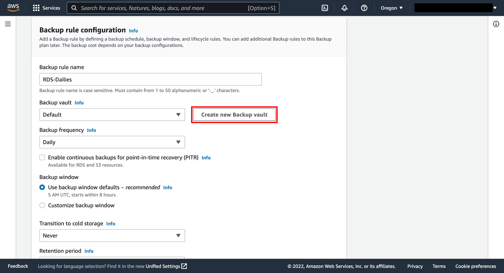 8. Configure the backup vault **Create new backup vault** - Instead of using the default backup vault that is automatically created for you in the AWS Backup console, you can create specific backup vaults to save and organize groups of backups in the same vault. 1. To create a backup vault, choose **Create new Backup vault.** 2. Enter a name for your backup vault. You can name your vault to reflect what you will store in it, or to make it easier to search for the backups you need. For example, you could name it **FinancialBackups**. 3. Select an AWS KMS key. You can use either a key that you already created or select the default AWS Backup master key. 4. Optionally, add tags that will help you search for and identify your backup vault. 5. Select **Create Backup vault** button. 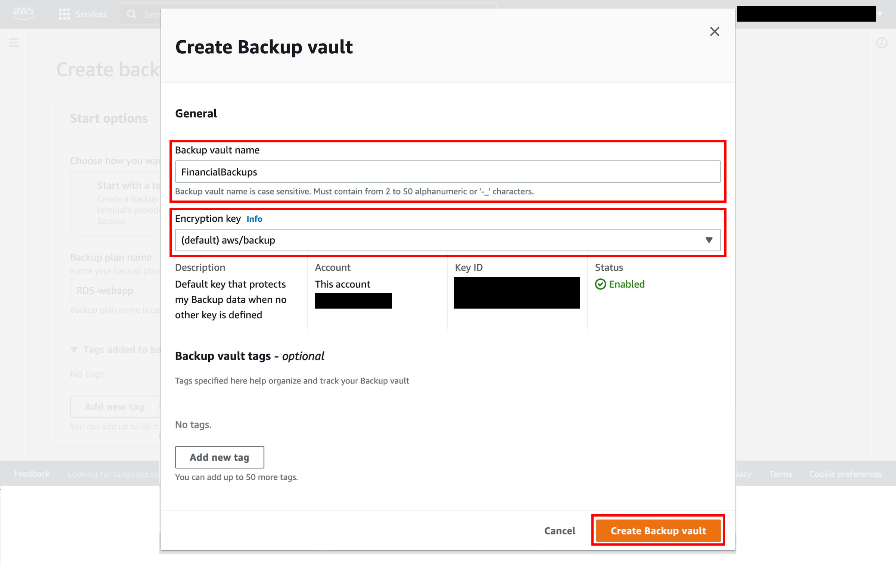 9. Configure backup schedule **Backup frequency** - The backup frequency determines how often a backup is created. You can choose a frequency of every 12 hours, daily, weekly, or monthly. When selecting weekly, you can specify which days of the week you want backups to be taken. When selecting monthly, you can choose a specific day of the month. **Enable continuous backups for point-in-time recovery** - With continuous backups, you can perform point-in-time restores (PITR) by choosing when to restore, down to the second. The most time that can elapse between the current state of your workload and your most recent point-in-time restore is 5 minutes. You can store continuous backups for up to 35 days. If you do not enable continuous backups, AWS Backup takes snapshot backups for you. **Backup window** - Backup windows consist of the time that the backup window begins and the duration of the window in hours. The default backup window is set to start at 5 AM UTC (Coordinated Universal Time) and lasts 8 hours. 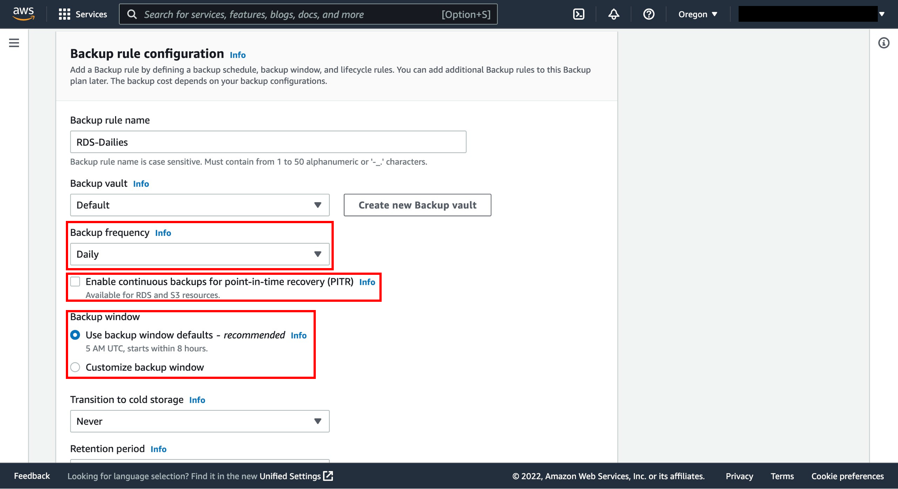 10. Configure retention settings **Transition to cold storage** - Currently only Amazon EFS file system backups can be transitioned to cold storage. The cold storage expression is ignored for the backups of Amazon Elastic Block Store (Amazon EBS), Amazon Relational Database Service (Amazon RDS), Amazon Aurora, Amazon DynamoDB, and AWS Storage Gateway. **Retention period** - AWS Backup automatically deletes your backups at the end of this period to save storage costs for you. AWS Backup can retain snapshots between 1 day and 100 years (or indefinitely, if you do not enter a retention period), and continuous backups between 1 and 35 days. 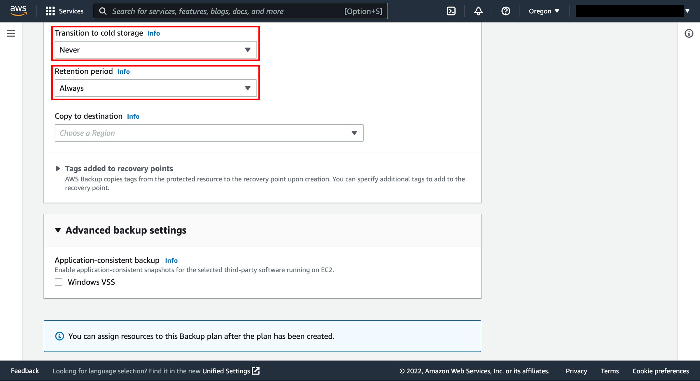 11. (Optional) Copy a backup to multiple regions **Copy to destination** - As part of your backup plan, you can optionally create a backup copy in another AWS Region. Using AWS Backup, you can copy backups to multiple AWS Regions on-demand, or automatically as part of a scheduled backup plan. Cross-Region Replication (CRR) is particularly valuable if you have business continuity or compliance requirements to store backups a minimum distance away from your production data. When you define a backup copy, you configure the following options:  • Copy to destination - The destination Region for the backup copy.  • Destination backup vault - The destination backup vault for the copy.  • (Advanced Settings) Transition to cold storage  • (Advanced Settings) Retention period ###### Note Cross-Region Copy incurs additional data transfer costs. You can refer to the [AWS Backup pricing page](https://aws.amazon.com/backup/pricing/ "https://aws.amazon.com/backup/pricing/") for more information. 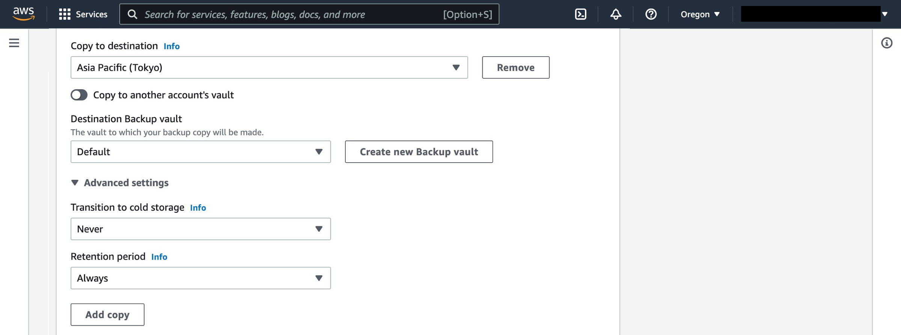 12. Create the plan **Tags added to recovery points** - The tags that you list here are automatically added to backups when they are created. **Advanced backup settings** - Enables application-consistent backups for third-party applications that are running on Amazon EC2 instances. Currently, AWS Backup supports Windows VSS backups. This is only applicable for Windows EC2 Instances running SQL Server or Exchange databases. Choose **Create plan.** 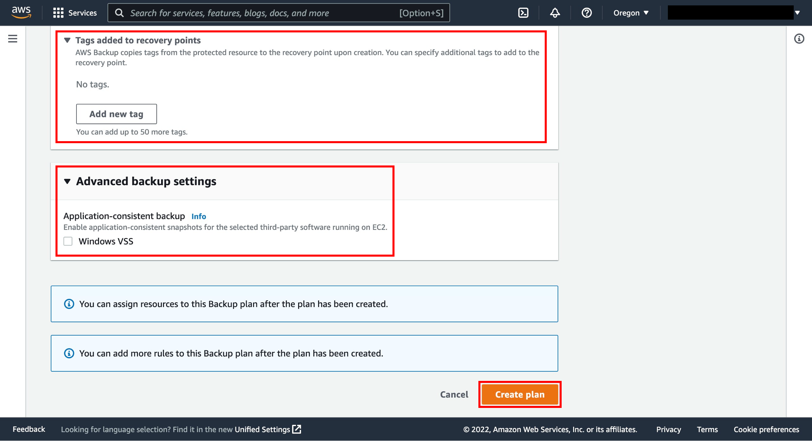 13. Assign resources When you assign a resource to a backup plan, that resource is backed up automatically according to the backup plan. The backups for that resource are managed according to the backup plan. You can assign resources using tags or resource IDs. Using tags to assign resources is a simple and scalable way to back up multiple resources. Select the created backup plan, and select the **Assign resources** button. 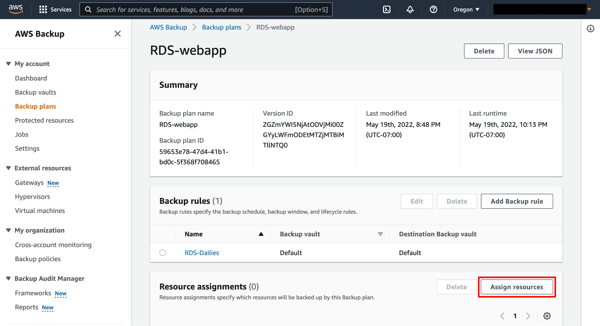 14. Enter an assignment name **Resource assignment name** - Provide a resource assignment name. **IAM role** - When creating a tag-based backup plan, if you choose a role other than **Default role**, make sure that it has the necessary permissions to back up all tagged resources. AWS Backup tries to process all resources with the selected tags. If it encounters a resource that it doesn't have permission to access, the backup plan fails. 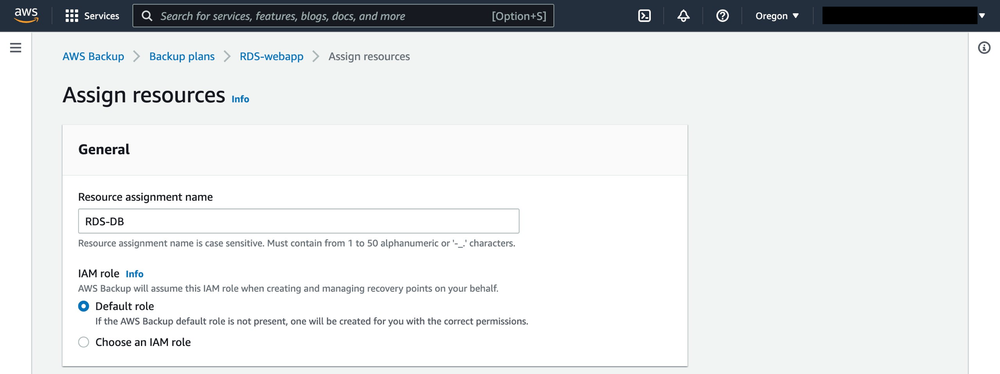 15. Choose a resource selection type **Define resource selection** - You can choose to include all resource types or specific resource types. 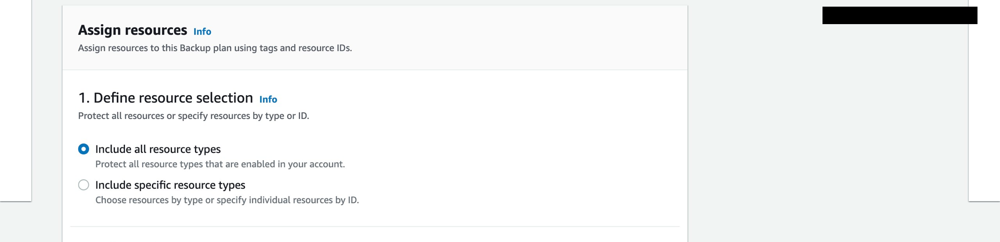 16. Define resource assignments For resource ID-based assignment, select **Resource type** and the name of the resource. To exclude specific resource IDs, select **Resource type** and the name of the resource. 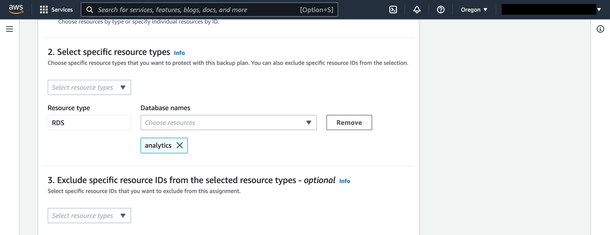 17. Assign the resources to the backup plan For tags-based resource assignment, provide the key-value pair of the Amazon RDS database. Select **Assign resources** and the backup plan has the resources assigned to it. 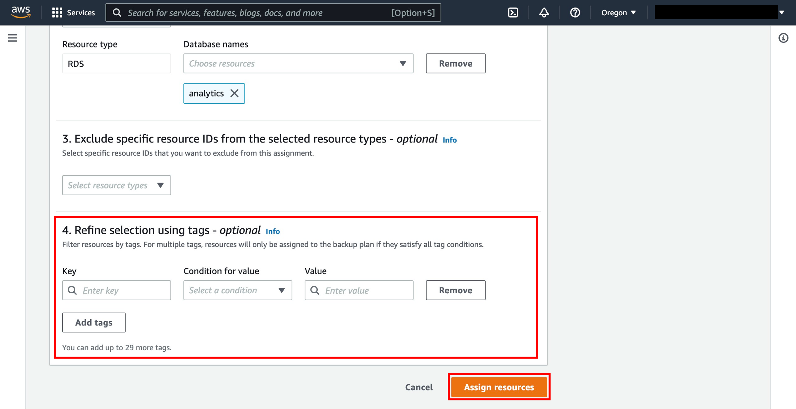 18. View the backup job Navigate to the [AWS Backup console](https://console.aws.amazon.com/backup "https://console.aws.amazon.com/backup") and the backup jobs will be seen under **Jobs.** A backup, or recovery point, represents the content of a resource, such as an Amazon Elastic Block Store (Amazon EBS) volume or Amazon RDS database, at a specified time. **Recovery point** is a term that refers generally to the different backups in AWS services, such as Amazon EBS snapshots and Amazon RDS backups. In AWS Backup, recovery points are saved in backup vaults, which you can organize according to your business needs. Each recovery point has a unique ID. 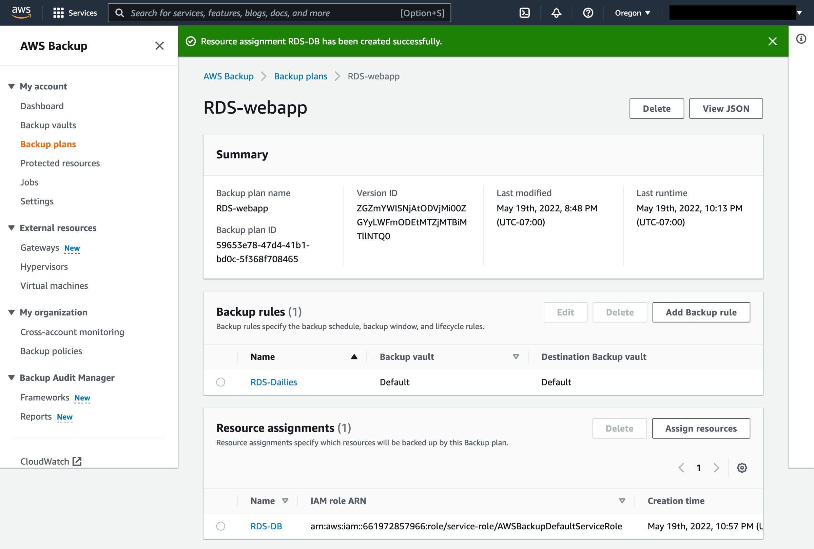 1. Select the backup Navigate to the backup vault that was selected in the backup plan and select the latest completed backup. 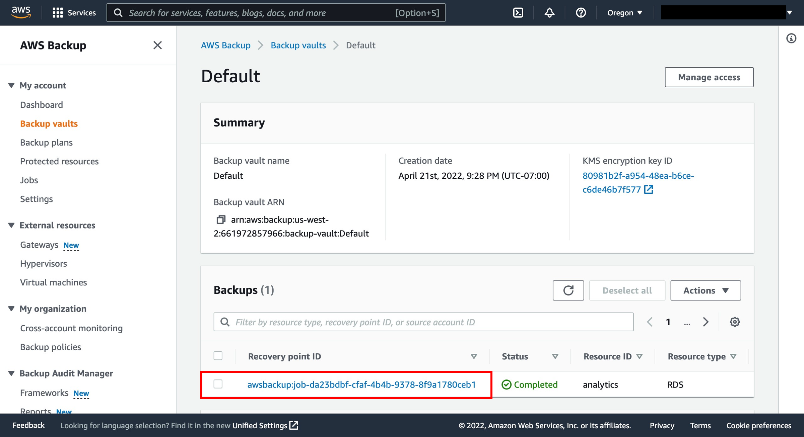 2. Restore the RDS instance To restore the database, click on the recovery point ARN and select **Restore.** 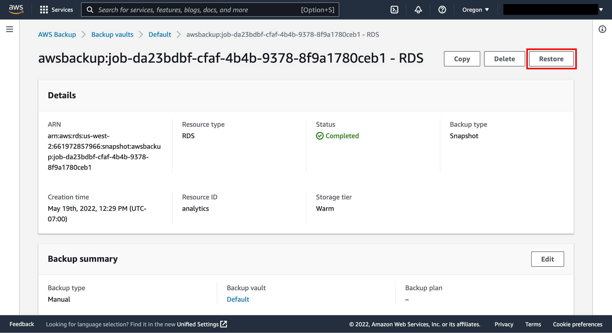 3. Review restore configuration The restore of the ARN will bring you to a **Restore backup** screen that will have Instance specifications and configurations for the Amazon RDS database. Select the **DB engine**, **License Model,** and **DB instance class.**  • Multi AZ - Using a Multi-AZ deployment will automatically provision and maintain a synchronous standby replica in a different Availability Zone. Note that you will have to pay for Multi-AZ deployment.  • Storage type - Select **Provisioned IOPS (SSD).**  • Provisioned IOPS - The requested number of I/O operations per second that the DB instance can support. Enter **3000**.  4. Enter a name for the DB instance **DB Instance Identifier** - Type a name for the DB instance that is unique for your account in the Region that you selected. If you're restoring from a DB instance that you deleted after you made the DB snapshot, you can use the name of that DB instance. 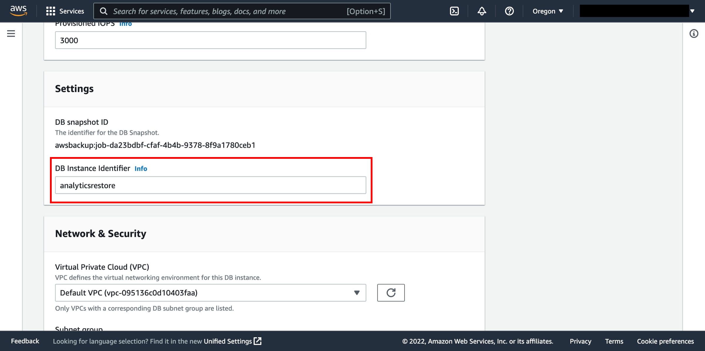 5. Configure network and security settings Select the appropriate network and security settings:  • VPC - Select the VPC where the database needs to be restored to.  • Subnet group - Select the subnet group in the VPC where the database needs to be restored to.  • Public accessibility - You can choose if you need the DB Instances to have a public address or not. If you choose **Yes**, this will allocate an IP address for your database instance so that you can directly connect to the database from your own device.  • **Availability zone** - Choose **No Preference.** 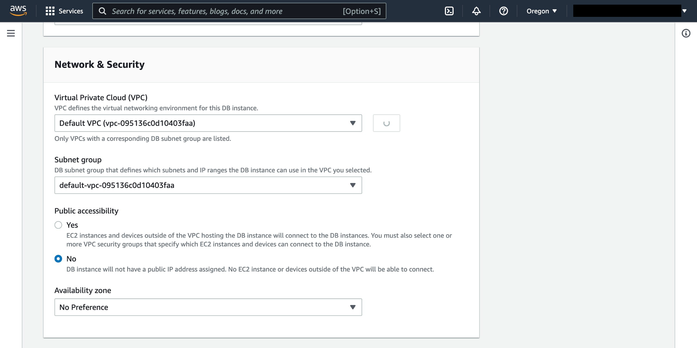 6. Select database options Select the appropriate database options.  • **Database port** - Leave the default value of **3306**.  • **DB parameter group** - Leave the **default value.**  • **Option Group** - Leave the **default value**. Amazon RDS uses option groups to enable and configure additional features.  • **IAM DB Authentication Enabled** - You can authenticate to your DB instance using AWS Identity and Access Management (IAM) database authentication. Select **Enable IAM DB authentication.** 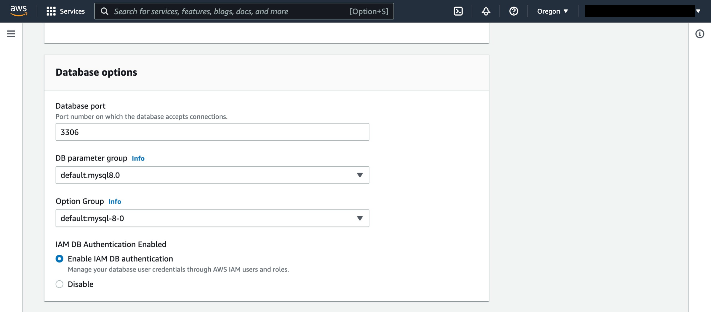 7. Copy tags to snapshots **Copy Tags to Snapshots** - Tags can be set on the database instances to be automatically copied to any automated or manual database snapshots that are created from your instances. 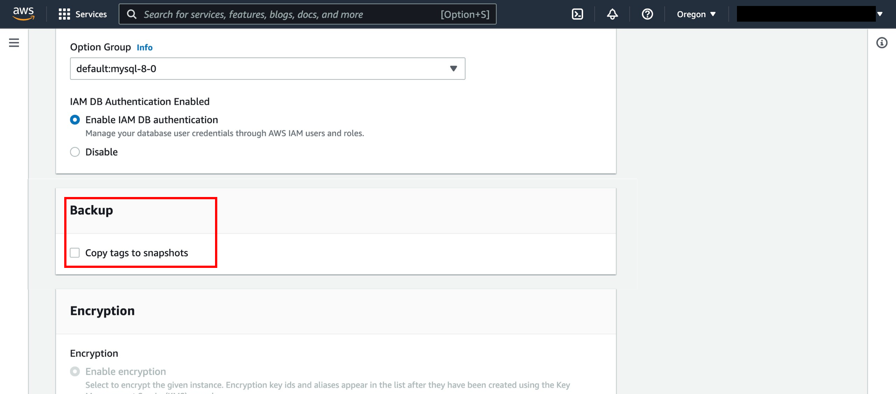 8. Configure encryption **Encryption** - This is the master key that will be used to protect the key that is used to encrypt the database volume. You can choose from master keys in your AWS account or enter the Amazon Resource Name (ARN) of a key from a different account. 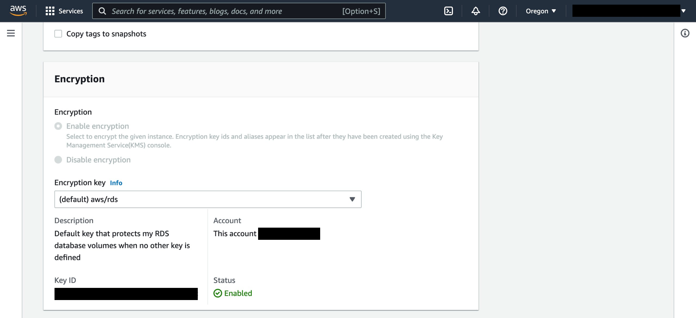 9. Select log types **Log exports** - Select the log types to publish to Amazon CloudWatch logs. 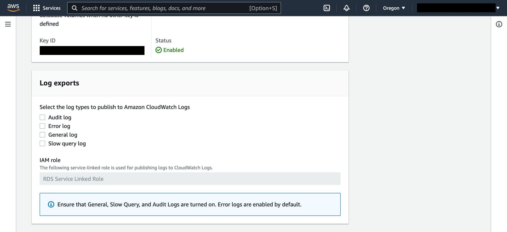 10. Configure automatic maintenance **Maintenance** - Select **Yes** if the DB instance should receive automatic engine version upgrades. 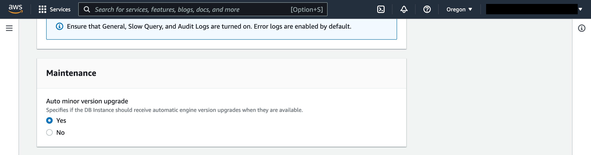 11. Choose a restore role **Restore role** - Select the **Default role** or **Choose an IAM role.** 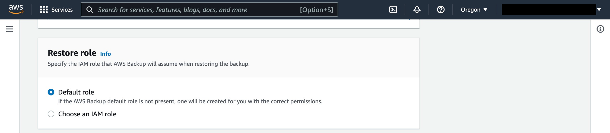 12. Restore the backup Select **Restore backup.**  • Your job will then appear under the **Jobs** section in the **Restore jobs** tab in the [AWS Backup console.](https://console.aws.amazon.com/backup "https://console.aws.amazon.com/backup")  • Once the restore job is completed, you can navigate to the [Amazon RDS console](https://console.aws.amazon.com/rds/home "https://console.aws.amazon.com/rds/home") and use the endpoint to connect to the database. 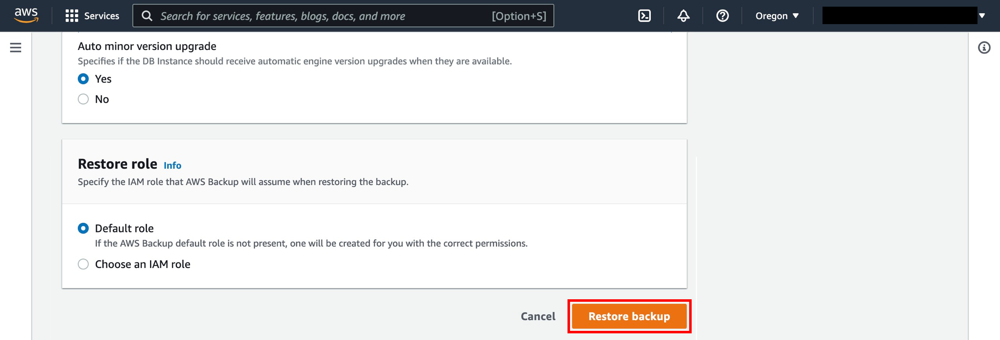 13. Monitor the restore job Your job will then appear under the **Jobs** section in the **Restore jobs** tab in the [AWS Backup console.](https://console.aws.amazon.com/backup "https://console.aws.amazon.com/backup") 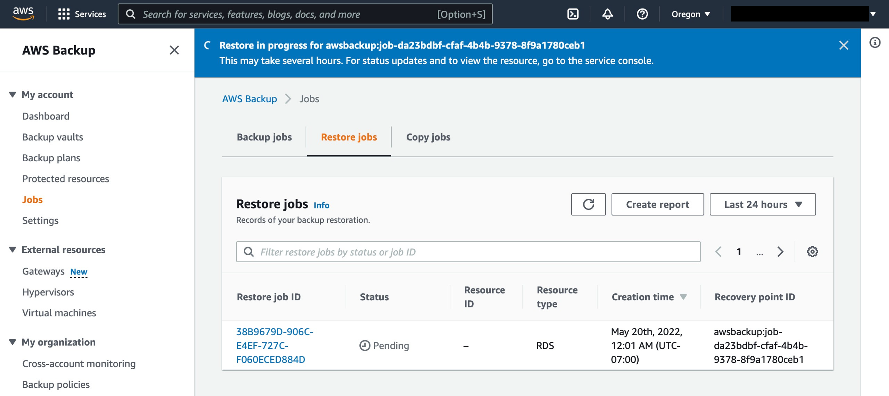 14. Find the DB endpoint Once the restore job is completed, you can navigate to the [Amazon RDS console](https://console.aws.amazon.com/rds/home "https://console.aws.amazon.com/rds/home") and use the endpoint to connect to the database. 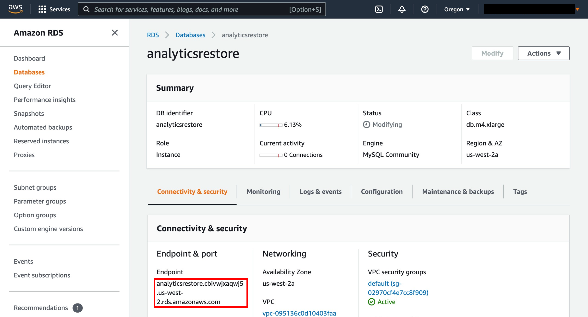 In the following steps, you will clean up the resources you created in this how-to guide. It is a best practice to delete instances and resources that you are no longer using so that you are not continually charged for them. 1. Delete the restored database Open the [Amazon RDS console.](https://console.aws.amazon.com/rds/home "https://console.aws.amazon.com/rds/home") In the navigation pane, choose **Databases**. Select the restored RDS database, and choose **Actions, Delete.** 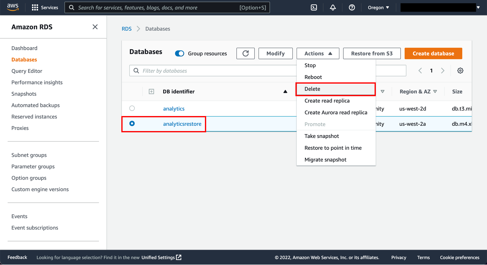 2. Confirm deletion To confirm deletion, type **delete me** into the field. ###### Note This process can take several seconds to complete. 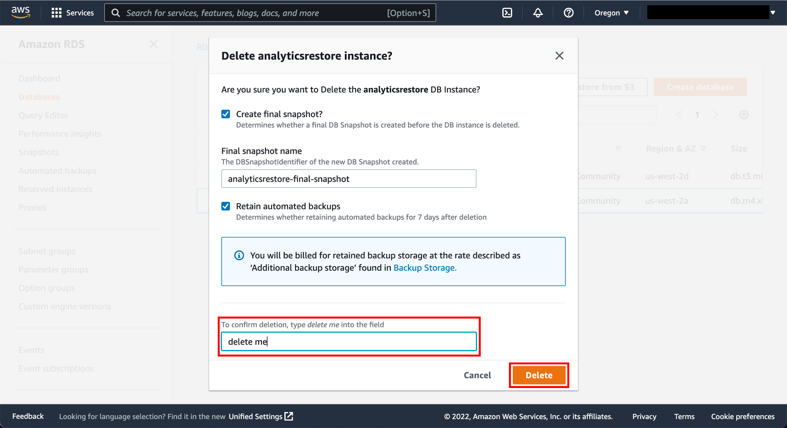 ## Additional resources: Working with Amazon RDS and Amazon Aurora  • [Getting started with AWS Backup](../../../aws-backup/latest/devguide/getting-started.md "../../../aws-backup/latest/devguide/getting-started.md")  • [How to restore an Amazon RDS database](../../../aws-backup/latest/devguide/restoring-rds.md "../../../aws-backup/latest/devguide/restoring-rds.md")  • [How to restore an Amazon Aurora cluster](../../../aws-backup/latest/devguide/restoring-aur.md "../../../aws-backup/latest/devguide/restoring-aur.md")  • [What is Amazon Relational Database Service (Amazon RDS)?](../../../AmazonRDS/latest/UserGuide/Welcome.md "../../../AmazonRDS/latest/UserGuide/Welcome.md")  • [What is Amazon Aurora?](../../../AmazonRDS/latest/AuroraUserGuide/CHAP_AuroraOverview.md "../../../AmazonRDS/latest/AuroraUserGuide/CHAP_AuroraOverview.md") ## Conclusion You successfully created an on-demand backup job of an Amazon RDS database! You also used a backup plan to back up Amazon RDS resources. As a great next step, check out recently published AWS Backup blogs to further your AWS Cloud knowledge. |
