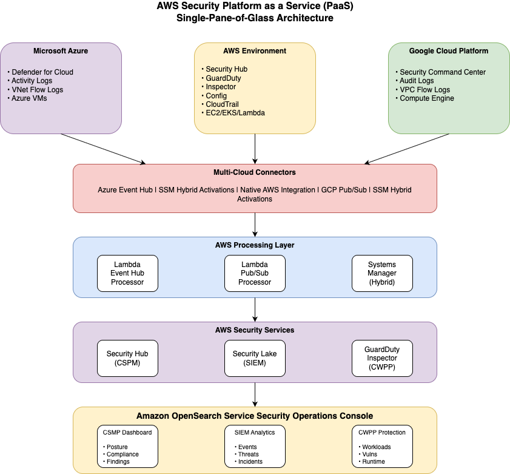
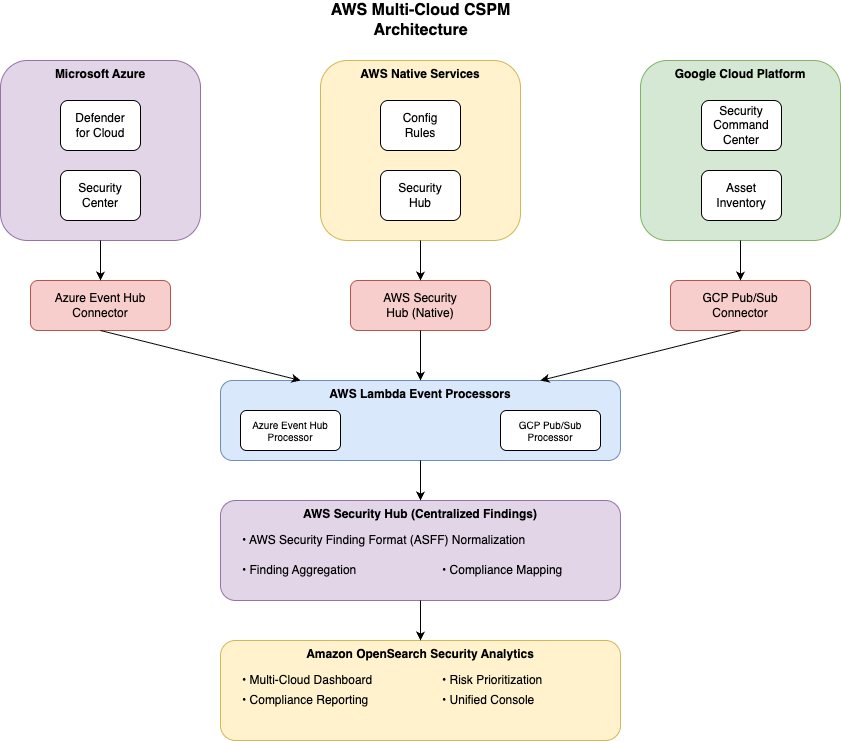
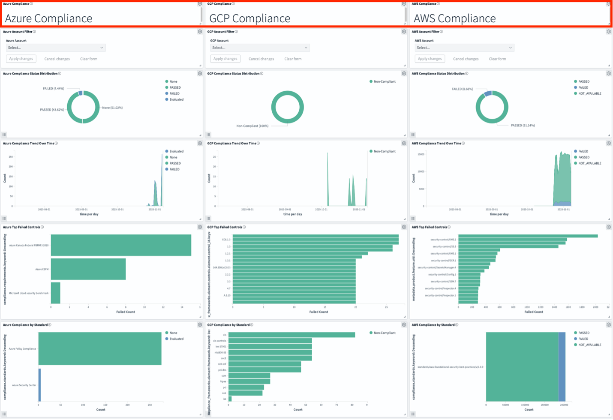
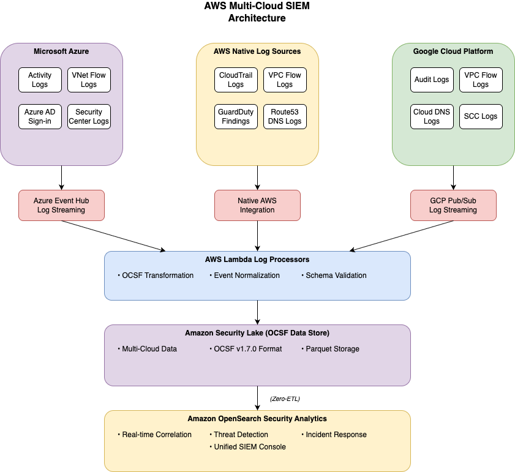
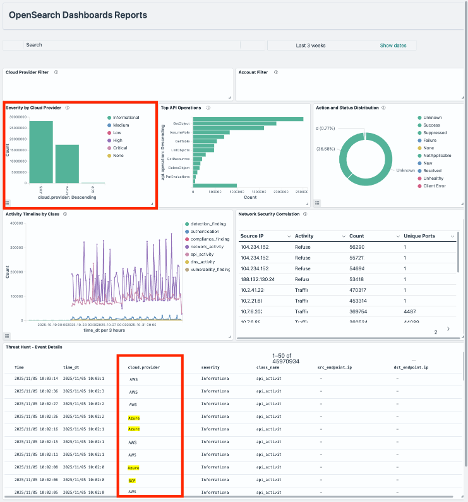
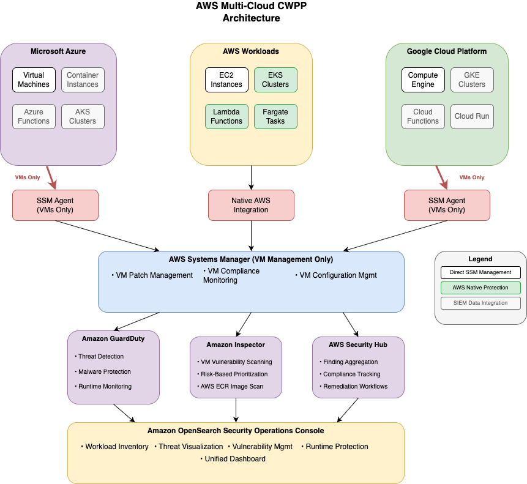
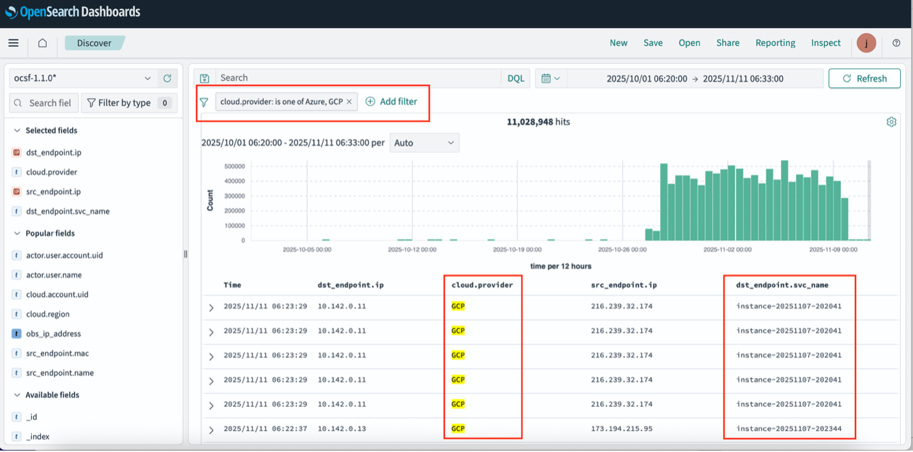
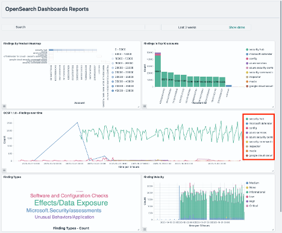

# Architecture

You get a unified security platform through Amazon OpenSearch Service as your central
security operations console. This integrates with native AWS security services and extends to
multi-cloud environments, as shown in the following diagram.

## AWS CDK

and multi-cloud integration

You use the AWS Cloud Development Kit (AWS CDK) to deploy pre-built connectors for the
third-party cloud integration. The AWS CDK automatically provisions AWS Lambda functions,
Amazon SQS queues, IAM roles, and other required services to establish secure connections with
the Microsoft Azure and Google Cloud Platform (GCP).

The modular framework lets you deploy production-ready connectors for Azure Event Hub
and Google Cloud Pub/Sub using configuration files. This removes the need for manual
infrastructure setup and helps to ensure consistent, secure deployments with built-in
monitoring and error handling.

## Cloud Security Posture Management with multi-cloud integration

You get comprehensive Cloud Security Posture Management (CSPM) through AWS Security
Hub integrated with Amazon OpenSearch Service. This gives you unified security visibility
across AWS, Microsoft Azure, and the Google Cloud Platform.

Your Amazon OpenSearch Security Analytics dashboard will display a multi-cloud
security posture overview with compliance status across AWS, Azure, and GCP
environments.

### Built-in multi-cloud

integration connectors

#### Microsoft Azure integration

**Service**: AWS Security Hub CSPM with Azure Security Center
Integration

- **Built-in connector**: Native [Azure Event Hub](https://azure.microsoft.com/en-us/products/event-hubs/ "https://azure.microsoft.com/en-us/products/event-hubs/")
  integration through [AWS Lambda](https://aws.amazon.com/lambda/ "https://aws.amazon.com/lambda/")
- **Data sources**: [Microsoft
  Defender for Cloud](https://azure.microsoft.com/en-us/products/defender-for-cloud/ "https://azure.microsoft.com/en-us/products/defender-for-cloud/") security findings, compliance assessments, secure score
  data
- **Implementation**: Automated Azure Event Hub,
  AWS Lambda, Security Hub CSPM, OpenSearch pipeline
- **Configuration**: Zero-code connector setup through
  [AWS CDK](https://aws.amazon.com/cdk/ "https://aws.amazon.com/cdk/") deployment templates

**Configuration reference**: See the [Azure CSPM integration settings](https://github.com/aws-samples/sample-aws-security-lake-integrations/blob/main/integrations/azure/microsoft_defender_cloud/README.md "https://github.com/aws-samples/sample-aws-security-lake-integrations/blob/main/integrations/azure/microsoft_defender_cloud/README.md") in the sample-aws-security-lake-integrations
repository on GitHub.

#### Google Cloud Platform

integration

**Service**: AWS Security Hub CSPM with [Google Security Command
Center](https://cloud.google.com/security-command-center "https://cloud.google.com/security-command-center") Integration

- **Built-in connector**: Native [GCP Pub/Sub](https://cloud.google.com/pubsub "https://cloud.google.com/pubsub") integration through
  AWS Lambda
- **Data sources**: Google SCC security findings,
  vulnerability assessments, compliance findings
- **Implementation**: Automated GCP Pub/Sub, AWS Lambda,
  Security Hub CSPM, OpenSearch pipeline
- **Configuration**: Zero-code connector setup through
  AWS CDK deployment templates

**Configuration reference**: See the [GCP CSPM integration settings](https://github.com/aws-samples/sample-aws-security-lake-integrations/tree/main/integrations/google_security_command_center#readme "https://github.com/aws-samples/sample-aws-security-lake-integrations/tree/main/integrations/google_security_command_center#readme") in the sample-aws-security-lake-integrations
repository on GitHub.

### Unified CSPM console features

**Amazon OpenSearch Service Security Analytics dashboard** provides:

- **Multi-cloud asset inventory**: Unified view of
  security posture across AWS, Azure, and GCP
- **Compliance dashboards**: Real-time compliance status
  across multiple frameworks (CIS, NIST, ISO 27001)
- **Security score trending**: Comparative security
  posture metrics across all cloud environments
- **Risk prioritization**: AI-powered risk scoring based
  on exploitability and business impact
- **Automated remediation**: Integration with AWS Systems Manager
  for cross-cloud remediation workflows

## Security Information and Event Management with multi-cloud integration

AWS provides enterprise-grade SIEM capabilities through **Amazon OpenSearch Service** with **Security Analytics plugin**, integrated with **Amazon Security Lake** for multi-cloud log ingestion and analysis.

The architecture diagram shows how Amazon Security Lake ingests logs from Azure Event
Hub and GCP Pub/Sub through native connectors. AWS Lambda processors transform data to OCSF
v1.7.0 format and zero-ETL integration to OpenSearch Security Analytics for unified SIEM
capabilities.

The Amazon OpenSearch Service Security Analytics timeline view shows correlated
security events from AWS, Azure, and GCP with unified event correlation and threat
detection.

### Built-in multi-cloud log

integration connectors

#### Microsoft Azure log integration

**Service**: Amazon Security Lake with [Azure Log Analytics](https://azure.microsoft.com/en-us/products/monitor/ "https://azure.microsoft.com/en-us/products/monitor/")
Integration

- **Built-in connector**: Native Azure Event Hub log
  streaming connector
- **Log sources**: [Azure Activity Logs](https://docs.microsoft.com/en-us/azure/azure-monitor/platform/activity-log "https://docs.microsoft.com/en-us/azure/azure-monitor/platform/activity-log"), [Azure AD](https://azure.microsoft.com/en-us/products/active-directory/ "https://azure.microsoft.com/en-us/products/active-directory/")
  Sign-in Logs, Azure Security Center Logs, [VNet Flow Logs](https://docs.microsoft.com/en-us/azure/network-watcher/network-watcher-nsg-flow-logging-overview "https://docs.microsoft.com/en-us/azure/network-watcher/network-watcher-nsg-flow-logging-overview")
- **Implementation**: Azure Event Hub,AWS Lambda, Amazon
  Security Lake, OpenSearch zero-ETL integration
- **OCSF compliance**: Automatic normalization to Open
  Cybersecurity Schema Framework v1.7.0

**Configuration reference**: See the [Azure SIEM log integration configuration file](https://github.com/aws-samples/sample-aws-security-lake-integrations/blob/main/integrations/security-lake/cdk/config.example.yaml "https://github.com/aws-samples/sample-aws-security-lake-integrations/blob/main/integrations/security-lake/cdk/config.example.yaml") in the
sample-aws-security-lake-integrations repository on GitHub.

#### Google Cloud Platform log

integration

**Service**: Amazon Security Lake with [GCP Cloud Logging](https://cloud.google.com/logging "https://cloud.google.com/logging") Integration

- **Built-in connector**: Native GCP Pub/Sub log
  streaming connector
- **Log sources**: [GCP Audit Logs](https://cloud.google.com/logging/docs/audit "https://cloud.google.com/logging/docs/audit"), [VPC Flow Logs](https://cloud.google.com/vpc/docs/flow-logs "https://cloud.google.com/vpc/docs/flow-logs"), [Cloud DNS](https://cloud.google.com/dns "https://cloud.google.com/dns") Logs, Security Command Center
  Logs
- **Implementation**: GCP Pub/Sub, AWS Lambda, Security
  Lake, OpenSearch zero-ETL integration
- **OCSF compliance**: Automatic normalization to Open
  Cybersecurity Schema Framework v1.7.0

**Configuration reference**: See the [GCP SIEM log integration configuration file](https://github.com/aws-samples/sample-aws-security-lake-integrations/blob/main/integrations/google_security_command_center/terraform/terraform.tfvars.example "https://github.com/aws-samples/sample-aws-security-lake-integrations/blob/main/integrations/google_security_command_center/terraform/terraform.tfvars.example") in the
sample-aws-security-lake-integrations repository on GitHub.

### Unified SIEM console features

**Amazon OpenSearch Service Security Analytics** provides:

- **Multi-cloud log correlation**: Unified timeline view
  of security events across AWS, Azure, and GCP
- **Threat detection rules**: Pre-built detection rules
  for multi-cloud attack patterns
- **Security incident response**: Automated playbooks
  triggered by cross-cloud security events
- **Threat hunting**: Interactive queries across
  normalized multi-cloud security data
- **Real-time alerting**: Integrated notifications for
  critical security events across all environments

### Advanced SIEM capabilities

**Amazon GuardDuty integration**:

- **Extended threat detection**: AI/ML-powered attack
  sequence identification across cloud boundaries
- **Malware protection**: Cross-cloud malware detection
  and response
- **Runtime monitoring**: Container and serverless threat
  detection across multi-cloud workloads

## Cloud Workload Protection Platform with multi-cloud integration

AWS provides comprehensive Cloud Workload Protection Platform (CWPP) capabilities
through **Amazon OpenSearch Service** as the central console, integrated with **Amazon GuardDuty**, **Amazon Inspector**, and **AWS Systems Manager** for multi-cloud workload protection.

The architecture diagram shows how AWS Systems Manager hybrid activations enable
virtual machine workload protection across Azure virtual machines (VMs) and GCP Compute Engine
instances. Systems Manager is integrated with Amazon GuardDuty, Amazon Inspector, and Security
Hub for unified threat detection, vulnerability management, and runtime protection in the
OpenSearch Security Operations console.

AWS multi-cloud virtual machine inventory dashboard shows the real-time protection
status of VMs across Amazon EC2, Azure VMs, and GCP Compute Engine instances through Systems
Manager.

### Multi-cloud workload protection

components

#### Threat detection across

multi-cloud workloads

**Amazon GuardDuty** provides:

- **Cross-cloud threat correlation**: AI/ML analysis of
  security signals across AWS, Azure, and GCP workloads
- **Container security**: Runtime threat detection for
  containers across all cloud environments
- **Serverless protection**: Lambda and Azure Functions
  security monitoring
- **Network threat detection**: [VPC Flow Log](../../../vpc/latest/userguide/flow-logs.md "../../../vpc/latest/userguide/flow-logs.md")
  analysis extended to [Azure VNet](https://azure.microsoft.com/en-us/products/virtual-network/ "https://azure.microsoft.com/en-us/products/virtual-network/")
  and [GCP VPC](https://cloud.google.com/vpc "https://cloud.google.com/vpc") networks

#### Vulnerability

management across multi-cloud workloads

**Amazon Inspector** integrated with **AWS Systems Manager** provides:

- **Multi-cloud VM scanning**: Vulnerability assessment
  of [Amazon EC2](https://aws.amazon.com/ec2/ "https://aws.amazon.com/ec2/"), [Azure
  VMs](https://azure.microsoft.com/en-us/products/virtual-machines/ "https://azure.microsoft.com/en-us/products/virtual-machines/"), and [GCP Compute
  instances](https://cloud.google.com/compute "https://cloud.google.com/compute") through Systems Manager Agent (SSM Agent)
- **Container image scanning**: [ECR](https://aws.amazon.com/ecr/ "https://aws.amazon.com/ecr/") vulnerability detection (native AWS capability)
- **AWS serverless vulnerability management**: Lambda
  function security assessment (native AWS capability)
- **Risk-based prioritization**: Contextualized
  vulnerability scoring across managed workloads
- **Multi-cloud scope**: Direct vulnerability scanning
  limited to virtual machines with SSM Agent (container and serverless scanning
  requires cloud-native tools)

#### Runtime protection

across multi-cloud workloads

**AWS Systems Manager** provides:

- **Hybrid activations**: Direct management of Azure
  VMs and GCP Compute Engine instances
- **Cross-cloud patch management**: Unified patching
  across Amazon EC2, Azure VMs, and GCP Compute instances
- **Compliance monitoring**: Security baseline
  enforcement across virtual machine workloads in all cloud environments
- **Automated response**: Remediation workflows
  triggered by security events across managed instances
- **Scope**: Limited to virtual machines and compute
  instances (containers and serverless functions require complementary security
  approaches)

### Built-in multi-cloud workload

connectors

#### Microsoft Azure workload

integration

**Service**: AWS Systems Manager hybrid activations and
Amazon Inspector

- **Built-in connector**: Native SSM Agent deployment
  on Azure virtual machines
- **Workload types**: Azure virtual machines (Windows
  and Linux)
- **Protection capabilities**:
  - Vulnerability scanning through Inspector (for VMs with SSM Agent)
  - Runtime protection through Systems Manager (patch management, compliance monitoring)
  - Threat detection through GuardDuty correlation (network-level analysis)

- **Implementation**: Automated SSM Agent
  installation and registration on Azure VMs
- **Limitations**: SSM Agent supports virtual
  machines only (containers and serverless functions require alternative monitoring
  approaches)

**Implementation reference**: See the [Azure workload integration setup](https://github.com/aws-samples/sample-aws-security-lake-integrations/blob/main/integrations/azure/microsoft_defender_cloud/README.md "https://github.com/aws-samples/sample-aws-security-lake-integrations/blob/main/integrations/azure/microsoft_defender_cloud/README.md") in the sample-aws-security-lake-integrations
repository on GitHub.

#### Google Cloud Platform

workload integration

**Service**: AWS Systems Manager hybrid activations and
Amazon Inspector

- **Built-in connector**: Native SSM Agent deployment
  on GCP Compute Engine instances
- **Workload types**: GCP Compute Engine (Windows and
  Linux virtual machines)
- **Protection capabilities**:
  - Vulnerability scanning through Inspector (for VMs with SSM Agent)
  - Runtime protection through Systems Manager (patch management, compliance monitoring)
  - Threat detection through GuardDuty correlation (network-level analysis)

- **Implementation**: Automated SSM Agent
  installation and registration on GCP Compute instances
- **Limitations**: SSM Agent supports virtual
  machines only (GKE containers and Cloud Functions require alternative monitoring
  approaches)

**Implementation reference**: See the [GCP workload integration setup](https://github.com/aws-samples/sample-aws-security-lake-integrations/blob/main/integrations/google_security_command_center/README.md "https://github.com/aws-samples/sample-aws-security-lake-integrations/blob/main/integrations/google_security_command_center/README.md") in the sample-aws-security-lake-integrations
repository on GitHub.

### Unified CWPP console features

**Amazon OpenSearch Service Security Operations Console** provides:

- **Multi-cloud workload inventory**: Real-time
  visibility of all workloads across AWS, Azure, and GCP
- **Threat detection dashboard**: Unified view of
  security threats across all cloud workloads
- **Vulnerability management console**: Centralized
  vulnerability assessment and remediation tracking
- **Runtime protection status**: Real-time monitoring of
  security controls across all environments
- **Automated response workflows**: Cross-cloud incident
  response and remediation automation

This AWS unified threat detection dashboard displays active security alerts and
incidents across all connected cloud environments.

### Advanced CWPP capabilities

**Container and serverless protection**:

- **Amazon GuardDuty with Amazon EKS runtime monitoring**:
  Kubernetes security for [Amazon EKS](https://aws.amazon.com/eks/ "https://aws.amazon.com/eks/") (native
  AWS capability)

**Lambda runtime protection**: Serverless security
monitoring for AWS Lambda functions (native AWS capability)

- **Container image vulnerability scanning**: Amazon ECR
  container image scanning (native AWS capability)
- **Multi-cloud container security**: Azure AKS, GCP GKE,
  Azure Functions, and GCP Cloud Functions require cloud-native security tools and
  integration through SIEM data ingestion

**Compliance and governance**:

- **Multi-cloud compliance monitoring**: Unified
  compliance dashboard across all cloud environments
- **Security baseline enforcement**: Automated security
  configuration management across clouds
- **Audit and reporting**: Comprehensive security
  reporting across all connected workloads
