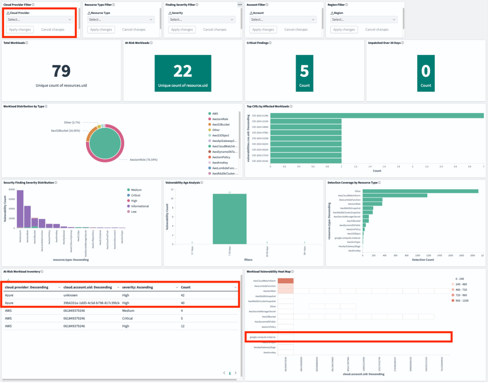

# Implementation

To implement an AWS Security Platform as a Service (PaaS) that provides a unified security operations console, complete the following tasks.

## Tasks

Deploy the Security Lake integration framework:

- **Primary configuration**: See the [config.example.yaml](https://github.com/aws-samples/sample-aws-security-lake-integrations/blob/main/integrations/security-lake/cdk/config.example.yaml "https://github.com/aws-samples/sample-aws-security-lake-integrations/blob/main/integrations/security-lake/cdk/config.example.yaml") file in the sample-aws-security-lake-integrations repository on
  GitHub.
- **Deployment scripts**: See the [deployment scripts](https://github.com/aws-samples/sample-aws-security-lake-integrations/tree/main/integrations/security-lake/cdk "https://github.com/aws-samples/sample-aws-security-lake-integrations/tree/main/integrations/security-lake/cdk") in the sample-aws-security-lake-integrations repository
  on GitHub.
  Configure Azure Integration using deployment templates:

- **Azure infrastructure**: See the [deployment templates](https://github.com/aws-samples/sample-aws-security-lake-integrations/integrations/azure/microsoft_defender_cloud/terraform/ "https://github.com/aws-samples/sample-aws-security-lake-integrations/integrations/azure/microsoft_defender_cloud/terraform/") in the sample-aws-security-lake-integrations
  repository on GitHub.
- **Azure configuration**: See the [terraform.tfvars](https://github.com/aws-samples/sample-aws-security-lake-integrations/blob/main/integrations/azure/microsoft_defender_cloud/terraform/terraform.tfvars.example "https://github.com/aws-samples/sample-aws-security-lake-integrations/blob/main/integrations/azure/microsoft_defender_cloud/terraform/terraform.tfvars.example") file in the sample-aws-security-lake-integrations
  repository on GitHub.
  Configure GCP Integration using deployment templates located at:

- **GCP infrastructure**: See the [deployment templates](https://github.com/aws-samples/sample-aws-security-lake-integrations/tree/main/integrations/google_security_command_center/terraform "https://github.com/aws-samples/sample-aws-security-lake-integrations/tree/main/integrations/google_security_command_center/terraform") in the sample-aws-security-lake-integrations
  repository on GitHub.
- **GCP configuration**: See the [terraform.tfvars](https://github.com/aws-samples/sample-aws-security-lake-integrations/blob/main/integrations/google_security_command_center/terraform/terraform.tfvars.example "https://github.com/aws-samples/sample-aws-security-lake-integrations/blob/main/integrations/google_security_command_center/terraform/terraform.tfvars.example") in the sample-aws-security-lake-integrations repository on
  GitHub.
  Configure cross-cloud credentials using automation scripts:

- **Azure credential configuration**: See the [configure-secrets-manager.sh](https://github.com/aws-samples/sample-aws-security-lake-integrations/blob/main/integrations/azure/microsoft_defender_cloud/scripts/configure-secrets-manager.sh "https://github.com/aws-samples/sample-aws-security-lake-integrations/blob/main/integrations/azure/microsoft_defender_cloud/scripts/configure-secrets-manager.sh") file in the
  sample-aws-security-lake-integrations repository on GitHub.
- **GCP credential configuration**: See the [configure-secrets-manager.sh](https://github.com/aws-samples/sample-aws-security-lake-integrations/blob/main/integrations/google_security_command_center/scripts/configure-secrets-manager.sh "https://github.com/aws-samples/sample-aws-security-lake-integrations/blob/main/integrations/google_security_command_center/scripts/configure-secrets-manager.sh") file in the
  sample-aws-security-lake-integrations repository on GitHub.
  Access the Amazon OpenSearch Service Security Analytics Dashboard to verify multi-cloud data ingestion
  and unified console functionality.

- **Validation procedures**: See the [validation queries and procedures](https://github.com/aws-samples/sample-aws-security-lake-integrations/blob/main/integrations/security-lake/docs/CONFIG_SCHEMA.md "https://github.com/aws-samples/sample-aws-security-lake-integrations/blob/main/integrations/security-lake/docs/CONFIG_SCHEMA.md") in the
  sample-aws-security-lake-integrations repository on GitHub.
  To remove all deployed resources, run the following:

```
cd integrations/security-lake/cdk
cdk destroy -c "configFile=config.example.yaml"
```

**Azure resource clean up**: Navigate to your Azure
Terraform configuration and run the following:

```
cd integrations/azure/microsoft_defender_cloud/terraform
# Preview what will be destroyed
terraform plan -destroy
```

After confirming what will be destroyed, run the following:

```
# Destroy all resources
terraform destroy
```

**GCP resource clean up**: Navigate to your GCP
Terraform configuration and run the following:

```
cd integrations/google_security_command_center/terraform
# Preview what will be destroyed
terraform plan -destroy
```

After confirming what will be destroyed, run the following:

```
# Destroy all resources
terraform destroy
```

## Supporting documentation URLs

### AWS security platform

documentation

- **Amazon OpenSearch Service**: [https://docs.aws.amazon.com/opensearch-service/](../../../opensearch-service.md "../../../opensearch-service.md")
- **Amazon Security Lake**: [https://docs.aws.amazon.com/security-lake/](../../../security-lake.md "../../../security-lake.md")
- **Amazon GuardDuty**: [https://docs.aws.amazon.com/guardduty/](../../../guardduty.md "../../../guardduty.md")
- **Amazon Inspector**: [https://docs.aws.amazon.com/inspector/](../../../inspector.md "../../../inspector.md")
- **AWS Systems Manager**: [https://docs.aws.amazon.com/systems-manager/](../../../systems-manager.md "../../../systems-manager.md")

### Multi-cloud integration

documentation

- **Security Lake multi-cloud integration**: [https://docs.aws.amazon.com/security-lake/latest/userguide/custom-sources.html](../../../security-lake/latest/userguide/custom-sources.md "../../../security-lake/latest/userguide/custom-sources.md")
- **Systems Manager hybrid activations**: [https://docs.aws.amazon.com/systems-manager/latest/userguide/activations.html](../../../systems-manager/latest/userguide/activations.md "../../../systems-manager/latest/userguide/activations.md")
- **OpenSearch Security Analytics plug-in**: [https://docs.aws.amazon.com/opensearch-service/latest/developerguide/security-analytics.html](../../../opensearch-service/latest/developerguide/security-analytics.md "../../../opensearch-service/latest/developerguide/security-analytics.md")

### Implementation guides

- **Azure integration guide**: Available in the project repository
  at [`https://github.com/aws-samples/sample-aws-security-lake-integrations/blob/main/integrations/azure/microsoft_defender_cloud/README.md`](https://github.com/aws-samples/sample-aws-security-lake-integrations/blob/main/integrations/azure/microsoft_defender_cloud/README.md "https://github.com/aws-samples/sample-aws-security-lake-integrations/blob/main/integrations/azure/microsoft_defender_cloud/README.md")
- **GCP integration guide**: Available in the project repository at
  [`https://github.com/aws-samples/sample-aws-security-lake-integrations/blob/main/integrations/google_security_command_center/README.md`](https://github.com/aws-samples/sample-aws-security-lake-integrations/blob/main/integrations/google_security_command_center/README.md "https://github.com/aws-samples/sample-aws-security-lake-integrations/blob/main/integrations/google_security_command_center/README.md")
- **Security Lake framework**: Available in the project repository
  at [`https://github.com/aws-samples/sample-aws-security-lake-integrations/blob/main/integrations/security-lake/cdk/README.md`](https://github.com/aws-samples/sample-aws-security-lake-integrations/blob/main/integrations/security-lake/cdk/README.md "https://github.com/aws-samples/sample-aws-security-lake-integrations/blob/main/integrations/security-lake/cdk/README.md")

## Conclusion

In this tutorial, we created and showed a comprehensive Security Platform as a Service
(PaaS) that delivers the required native, multifunction security operations console:

1. **Native multi-cloud CSPM**: Provides built-in connectors for
   Azure Security Center and GCP Security Command Center with unified OpenSearch
   dashboard.
2. **Native multi-cloud SIEM**: Provides built-in connectors for
   Azure and GCP log sources with unified Security Analytics console
3. **Native multi-cloud CWPP**: Provides built-in connectors for
   Azure and GCP workload protection with unified threat detection, vulnerability management,
   and runtime protection


