# Module 1: Create a Flutter app

## Overview

In this module, we will start by creating a new Flutter mobile app. Then we will add the Amplify packages and other dependencies to the app. Next, we will structure the app’s folders based on the Feature-First approach. Then, we will create the constants the app will use to define its routes and colors. And finally, we will use the Amplify CLI to provision a cloud backend for the app

## What you will accomplish

- Create a Flutter app
- Add the app dependencies
- Create the app folder structure
- Define the constants for the app’s routes and colors
- Create an Amplify backend for the app

## Implementation

|                              |                                                                                                                                                                                                                                                                                                                                                                                                                                                                                                                                                                                                                                                                                                                                                                                                                                                                                                                                                                                                                                                                                                                                                |
| ---------------------------- | ---------------------------------------------------------------------------------------------------------------------------------------------------------------------------------------------------------------------------------------------------------------------------------------------------------------------------------------------------------------------------------------------------------------------------------------------------------------------------------------------------------------------------------------------------------------------------------------------------------------------------------------------------------------------------------------------------------------------------------------------------------------------------------------------------------------------------------------------------------------------------------------------------------------------------------------------------------------------------------------------------------------------------------------------------------------------------------------------------------------------------------------------- | -------------------------------------------------------------------------------------------------------------------------------------------------------------------------------------------------------------------------------------------------------------------------------------------------------------------------------------------------------------------------------------------------------------------------------------------------------------------------------------------------------------------------------------------------------------------------------------------------------------------------------------------------------------------------------------------------------------------------------------------------------------------------------------------------------------------------------------------------------------------------------------------------------------------------------------------------------------------------------------------------------------------------------------------------------------------------------------------------------------------------------------------------------------------------------------------------------------------------------------------------------------------------------------------------------------------------------------------------------------------------------------------------------------------------------------------------------------------------------------------------------------------------------------------------------------------------------------------------------------------------------------------------------------------------------------------------------------------------------------------------------------------------------------------------------------------------------------------------------------------------------------------------------------------------------------------------------------------------------------------------------------------------------------------------------------------------------------------------------------------------------------------------------------------------------------------------------------------------------------------------------------------------------------------------------------------------------------------------------------------------------------------------------------------------------------------------------------------------------------------------------------------------------------------------------------------------------------------------------------------------------------------------------------------------------------------------------------------------------------------------------------------------------------------------------------------------------------------------------------------------------------------------------------------------------------------------------------------------------------------------------------------------------------------------------------------------------------------------------------------------------------------------------------------------------------------------------------------------------------------------------------------------------------------------------------------------------------------------------------------------------------------------------------------------------------------------------------------------------------------------------------------------------------------------------------------------------------------------------------------------------------------------------------------------------------------------------------------------------------------------------------------------------------------------------------------------------------------------------------------------------------------------------------------------------------------------------------------------------------------------------------------------------------------------------------------------------------------------------------------------------------------------------------------------------------------------------------------------------------------------------------------------------------------------------------------------------------------------------------------------------------------------------------------------------------------------------------------------------------------------------------------------------------------------------------------------------------------------------------------------------------------------------------------------------------------------------------------------------------------------------------------------------------------------------------------------------------------------------------------------------------------------------------------------------------------------------------------------------------------------------------------------------------------------------------------------------------------------------------------------------------------------------------------------------------------------------------------------------------------------------------------------------------------------------------------------------------------------------------------------------------------------------------------------------------------------------------------------------------------------------------------------------------------------------------------------------------------------------------------------------------------------------------------------------------------------------------------------------------------------------------------------------------------------------------------------------------------------------------------------------------------------------------------------------------------------------------------------------------------------------------------------------------------------------------------------------------------------------------------------------------------------------------------------------------------------------------------------------------------------------------------------------------------------------------------------------------------------------------------------------------------------------------------------------------------------------------------------------------------------------------------------------------------------------------------------------------------------------------------------------------------------------------------------------------------------------------------------------------------------------------------------------------------------------------------------------------------------------------------------------------------------------------------------- |
| **Minimum time to complete** | 15 minutes                                                                                                                                                                                                                                                                                                                                                                                                                                                                                                                                                                                                                                                                                                                                                                                                                                                                                                                                                                                                                                                                                                                                     | 1. Create a Flutter app by running the command below in your terminal. `flutter create amplify_trips_planner --platforms=ios,android` 2. Open the newly created Flutter application using VSCode. You can do that by running the commands below in your terminal. `cd amplify_trips_planner code . -r` 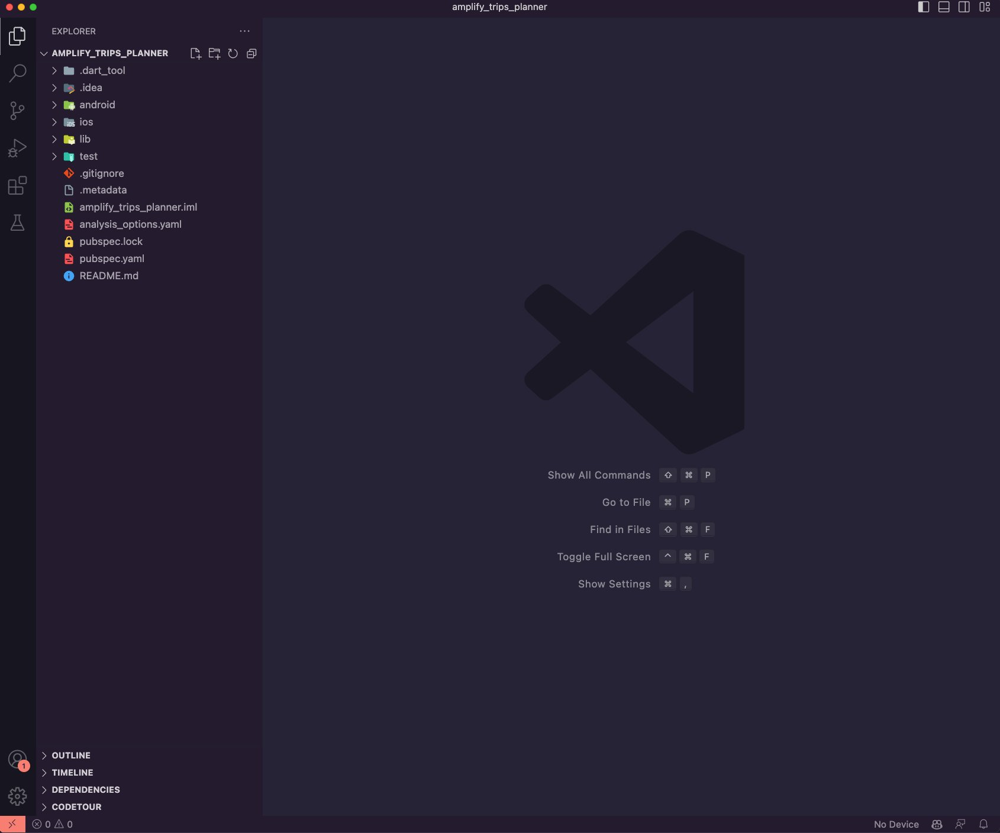 1. Update the file pubspec.yaml in the application root directory to add the following Amplify packages. `amplify_api: ^1.0.0 amplify_auth_cognito: ^1.0.0 amplify_authenticator: ^1.0.0 amplify_flutter: ^1.0.0 amplify_storage_s3: ^1.0.0` 2. The app will use additional dependencies for its functionality, such as State Management, Image Picker, and Navigation. Update the file pubspec.yaml in the application root directory to add the following packages as dependencies. `cached_network_image: ^3.2.3 cupertino_icons: ^1.0.5 flutter_riverpod: ^2.1.3 go_router: ^7.0.0 image_picker: ^0.8.0 intl: ^0.18.0 path: ^1.8.3 riverpod_annotation: ^2.0.1 uuid: ^3.0.7` 3. To improve the coding experience, we will use a set of development dependencies, such as code lint packages, which encourage good coding practices, and code generation packages to simplify the State Management implementation. Update the file pubspec.yaml in the application root directory to add the following packages as dev_dependencies. `amplify_lints: ^3.0.0 build_runner: custom_lint: flutter_test: sdk: flutter riverpod_generator: ^2.1.3 riverpod_lint: ^1.1.5` 4. The app will use a placeholder image (amplify.png) when creating a new trip. After [downloading the image](<https://d1.awsstatic.com/getting-started-guides/build-flutter-mobile-app/amplify%20(1).475c5857281340bb1b377b617fb6101faab4eab6.png> "https://d1.awsstatic.com/getting-started-guides/build-flutter-mobile-app/amplify%20(1).475c5857281340bb1b377b617fb6101faab4eab6.png"), create a new folder in the app root directory, name it **images**, and then add the image to it. 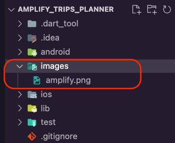 5. Update the file pubspec.yaml to add it to the assets section. `flutter: uses-material-design: true assets: <br>• images/amplify.png` The pubspec.yaml file should look like the this: `name: amplify_trips_planner description: A new Flutter project. version: 1.0.0+1 environment: sdk: ">=3.0.2 <4.0.0" dependencies: amplify_api: ^1.0.0 amplify_auth_cognito: ^1.0.0 amplify_authenticator: ^1.0.0 amplify_flutter: ^1.0.0 amplify_storage_s3: ^1.0.0 cached_network_image: ^3.2.3 cupertino_icons: ^1.0.5 flutter: sdk: flutter flutter_riverpod: ^2.1.3 go_router: ^7.0.0 image_picker: ^0.8.0 intl: ^0.18.0 path: ^1.8.3 riverpod_annotation: ^2.0.1 uuid: ^3.0.7 dev_dependencies: amplify_lints: ^3.0.0 build_runner: custom_lint: flutter_test: sdk: flutter riverpod_generator: ^2.1.3 riverpod_lint: ^1.1.5 flutter: uses-material-design: true assets: <br>• images/amplify.png` 6. Run the following command in your terminal to install the dependencies you added to the pubspec.yaml file. `flutter pub get` 7. Update the target iOS platform by navigating to the **ios/** folder and change the Podfile to target iOS platform 13.5 or higher. `platform :ios, '13.5'` 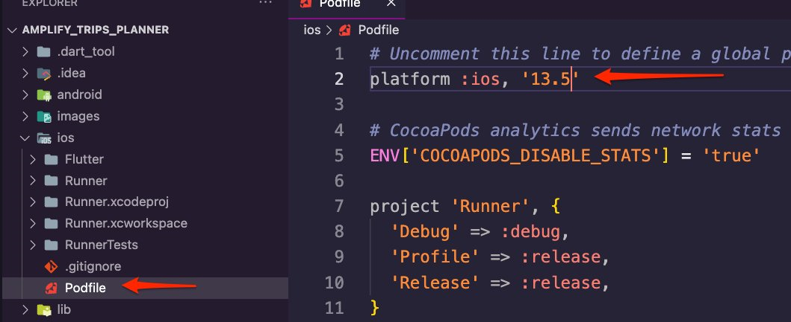 8. Update the target Android SDK by navigating to the **android/app/** folder and modifying the **build.gradle** file to update the target Android SDK version to 24 or higher. `minSdkVersion 24` 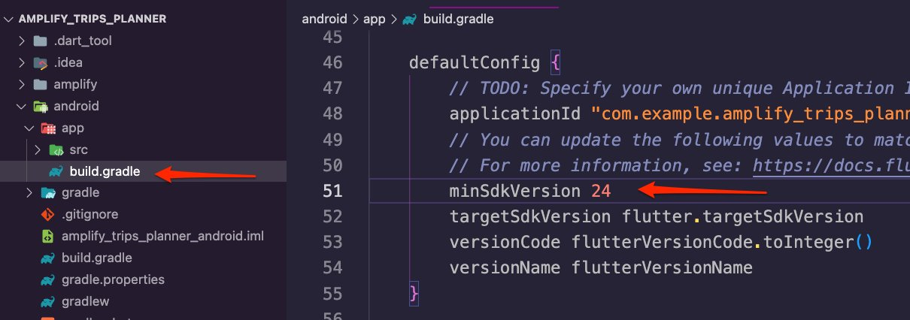 This guide will use the Feature-First approach to structure the app. We will create a folder for every app feature, and inside that folder, we can add the layers as sub-folders. 1. Create a new folder inside the **lib** folder, name it **features,** create a folder inside it, and name it **trip.** 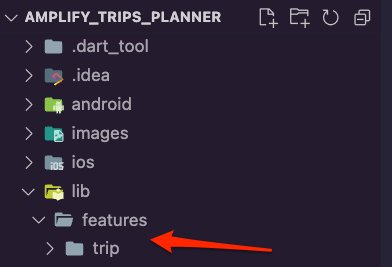 2. Create the following new folders inside the **trip** folder: <br>• **service:** The layer to connect with the Amplify backend. <br>• **data:** This will be the repository layer that abstracts away the networking code, specifically **service.** <br>• **controller:** This is an abstract layer to connect the UI with the repository. <br>• **ui:** Here, we will create the widgets and the pages that the app will present to the user. 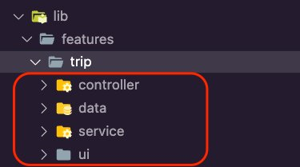 3. Create a new folder inside the **lib** folder and name it **common.** We will use this folder for the code shared across the app features. 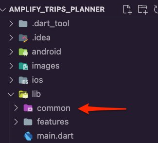 4. Create the following new folders inside the **common** folder: <br>• **ui:** Here, we will create the widgets and the pages that the app will present to the user. <br>• **navigation:** We will use this folder to define the app routes. <br>• **services:** This is where we will create the services to connect with the Amplify backend. <br>• **utils:** This folder will contain constants, such as colors, that the app will frequently use. 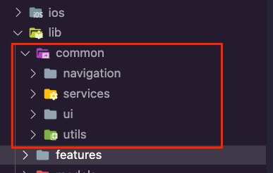 1. Create a folder inside the **lib/common/navigation** folder and call it **router,** and then create a new dart file inside it and call it **routes.dart.** 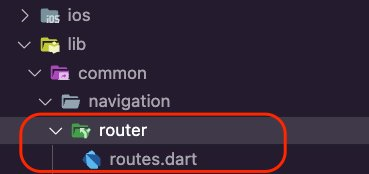 2. Open the **routes.dart** file and update it with the following code. We will use this enum to create the routing of the app. `enum AppRoute { home, trip, editTrip, }` 3. Create a new dart file inside the **lib/common/utils** folder and name it **colors.dart.** 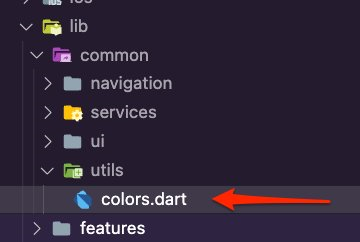 4. Open the **colors.dart** file and update it with the following code to create constant variables to set the app’s colors. `import 'package:flutter/material.dart'; const Map<int, Color> primarySwatch = { 50: Color.fromRGBO(255, 207, 68, .1), 100: Color.fromRGBO(255, 207, 68, .2), 200: Color.fromRGBO(255, 207, 68, .3), 300: Color.fromRGBO(255, 207, 68, .4), 400: Color.fromRGBO(255, 207, 68, .5), 500: Color.fromRGBO(255, 207, 68, .6), 600: Color.fromRGBO(255, 207, 68, .7), 700: Color.fromRGBO(255, 207, 68, .8), 800: Color.fromRGBO(255, 207, 68, .9), 900: Color.fromRGBO(255, 207, 68, 1), }; const MaterialColor primaryColor = MaterialColor(0xFFFFCF44, primarySwatch); const int primaryColorDark = 0xFFFD9725;` 1. Navigate to the app's root folder, and provision the Amplify backend for the app by running the following command in your terminal. `amplify init` 2. Enter a name for the Amplify project or accept the suggested name, then press **Enter**. ``` ? Enter a name for the project amplifytripsplanner The following configuration will be applied: Project information |
| Name: amplifytripsplanner    | Environment: dev                                                                                                                                                                                                                                                                                                                                                                                                                                                                                                                                                                                                                                                                                                                                                                                                                                                                                                                                                                                                                                                                                                                               | Default editor: Visual Studio Code                                                                                                                                                                                                                                                                                                                                                                                                                                                                                                                                                                                                                                                                                                                                                                                                                                                                                                                                                                                                                                                                                                                                                                                                                                                                                                                                                                                                                                                                                                                                                                                                                                                                                                                                                                                                                                                                                                                                                                                                                                                                                                                                                                                                                                                                                                                                                                                                                                                                                                                                                                                                                                                                                                                                                                                                                                                                                                                                                                                                                                                                                                                                                                                                                                                                                                                                                                                                                                                                                                                                                                                                                                                                                                                                                                                                                                                                                                                                                                                                                                                                                                                                                                                                                                                                                                                                                                                                                                                                                                                                                                                                                                                                                                                                                                                                                                                                                                                                                                                                                                                                                                                                                                                                                                                                                                                                                                                                                                                                                                                                                                                                                                                                                                                                                                                                                                                                                                                                                                                                                                                                                                                                                                                                                                                                                                                                                                                                                                                                                                                                                                                                                                                                                                                                                                                                                                                                                         |
| App type: flutter            | Configuration file location: ./lib/ ? Initialize the project with the above configuration? (Y/n) ``` 3. Press **Enter** again to accept the auto-generated options and select the AWS Authentication method. In this example, we are using an AWS profile. Amplify CLI will initialize the backend and connect the project to the cloud. 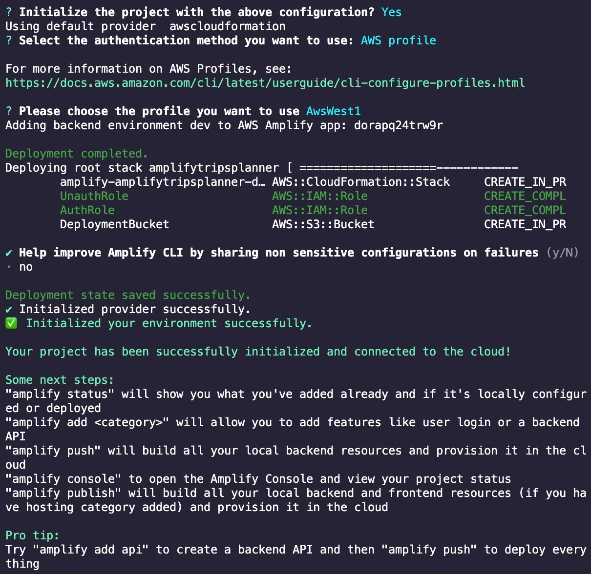 The Amplify CLI will add a new folder named **amplify** to the app's root folder, which contains the amplify project and backend details. It will also add a new dart file **(amplifyconfiguration.dart)** to the **lib/** folder. The app will use this file to know how to reach your provisioned backend resources at runtime. 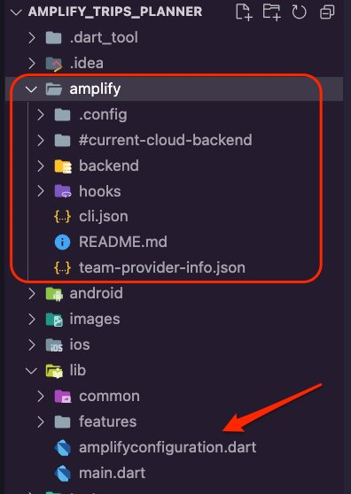 ## Conclusion In this module, you learned how to create a Flutter app. You also learned how to set its folder structure using the Feature-First approach. Additionally, you created constant variables for the app to use to set its routes and colors. Finally, you used the Amplify CLI to provision a cloud backend for the app. |
