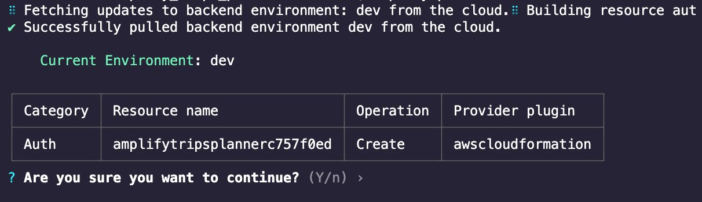
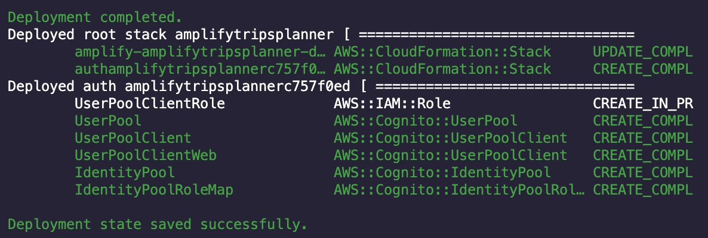
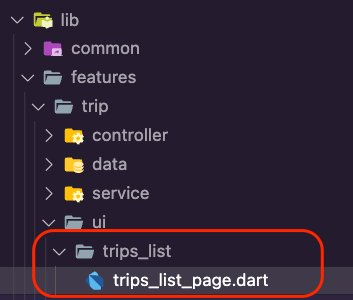
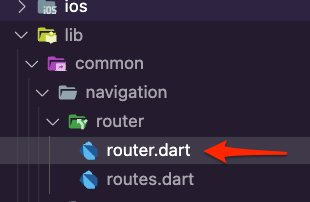
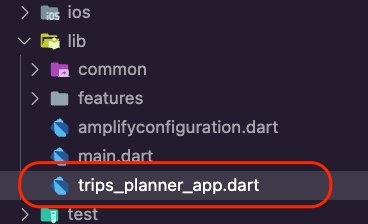
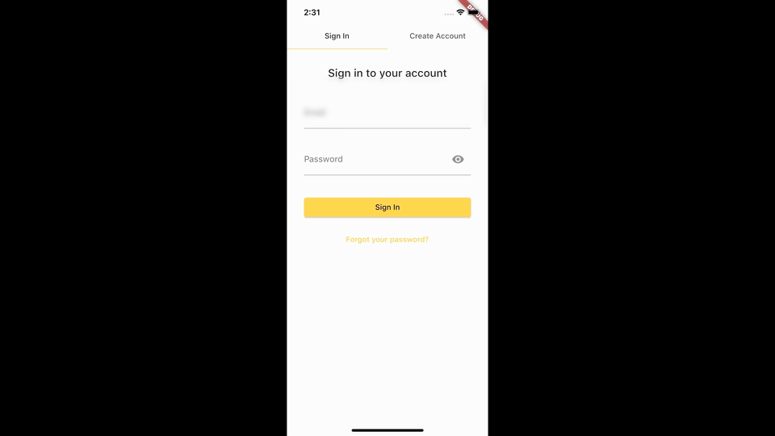

# Module 2: Add Amplify authentication

## Overview

In this module, you will learn how to authenticate a user with the [Amplify auth category](https://docs.amplify.aws/lib/auth/getting-started/q/platform/flutter/ "https://docs.amplify.aws/lib/auth/getting-started/q/platform/flutter/") by using Amazon Cognito, a managed user identity service.

You will also learn how to use the [Amplify Authenticator](https://ui.docs.amplify.aws/flutter/components/authenticator "https://ui.docs.amplify.aws/flutter/components/authenticator") library to quickly create an authentication flow for the app, allowing users to sign up, sign in, and reset their password with just a few lines of code.

## What you will accomplish

- Add Amplify authentication category to the app
- Implement the authentication flow using Amplify Authenticator

## Implementation

1. Navigate to the app's root folder and run the following command in your terminal.

```
amplify add auth
```

2. Select the **Default configuration** option and then select **Email** as the sign-in method. Then select the **No, I am done** option.

```
Using service: Cognito, provided by: awscloudformation The current configured provider is Amazon Cognito. Do you want to use the default authentication and security configuration? Default configuration Warning: you will not be able to edit these selections. How do you want users to be able to sign in? Email Do you want to configure advanced settings? No, I am done.
✅ Successfully added auth resource amplifytripsplanner035b18d6 locally ✅ Some next steps:
"amplify push" will build all your local backend resources and provision it in the cloud
"amplify publish" will build all your local backend and frontend resources (if you have hosting category added) and provision it in the cloud
```

3. Now the Amplify Auth category is ready. Run the command **amplify push** to create the resources in the cloud.

 4. Press **Enter**. The Amplify CLI will deploy the authentication resources and display a confirmation, as shown in the screenshot.



#### Minimum time to complete

10 minutes

1. Create a new folder inside the **lib/features/trip/ui** folder, name it **trips_list**, and then create the file **trips_list_page.dart** inside it.

 2. Open the **trips_list_page.dart** file and update it with the following code. This will be the app’s homepage.

```
import 'package:flutter/material.dart';
import 'package:amplify_trips_planner/common/utils/colors.dart' as constants; class TripsListPage extends StatelessWidget { const TripsListPage({ super.key, }); @override Widget build(BuildContext context) { return Scaffold( appBar: AppBar( centerTitle: true, title: const Text( 'Amplify Trips Planner', ), backgroundColor: const Color(constants.primaryColorDark), ), floatingActionButton: FloatingActionButton( onPressed: () {}, backgroundColor: const Color(constants.primaryColorDark), child: const Icon(Icons.add), ), body: const Center( child: Text('Trips List'), ), ); }
}
```

3. Create a new file inside the **lib/common/navigation/router** folder and call it **router.dart**.

 4. Open the **router.dart** file and update it with the following code to create the routes for the app.

```
import 'package:amplify_trips_planner/common/navigation/router/routes.dart';
import 'package:amplify_trips_planner/features/trip/ui/trips_list/trips_list_page.dart';
import 'package:flutter/material.dart';
import 'package:go_router/go_router.dart'; final router = GoRouter( routes: [ GoRoute( path: '/', name: AppRoute.home.name, builder: (context, state) => const TripsListPage(), ), ], errorBuilder: (context, state) => Scaffold( body: Center( child: Text(state.error.toString()), ), ),
);
```

5. Create a new dart file inside the **lib** folder and call it **trips_planner_app.dart**.

 6. Open the **trips_planner_app.dart** file and update it with the following code to wrap the **MaterialApp** in an Amplify Authenticator widget.

```
import 'package:amplify_authenticator/amplify_authenticator.dart';
import 'package:amplify_trips_planner/common/navigation/router/router.dart';
import 'package:amplify_trips_planner/common/utils/colors.dart' as constants;
import 'package:flutter/material.dart'; class TripsPlannerApp extends StatelessWidget { const TripsPlannerApp({ super.key, }); @override Widget build(BuildContext context) { return Authenticator( child: MaterialApp.router( routerConfig: router, builder: Authenticator.builder(), theme: ThemeData( colorScheme: ColorScheme.fromSwatch(primarySwatch: constants.primaryColor) .copyWith( background: const Color(0xff82CFEA), ), ), ), ); }
}
```

7. Open the **main.dart** file and update it with the following code. This contains the logic of configuring Amplify for the Auth category.

```
import 'package:amplify_auth_cognito/amplify_auth_cognito.dart';
import 'package:amplify_flutter/amplify_flutter.dart';
import 'package:amplify_trips_planner/trips_planner_app.dart';
import 'package:flutter/material.dart';
import 'package:flutter_riverpod/flutter_riverpod.dart'; import 'amplifyconfiguration.dart'; Future<void> main() async { WidgetsFlutterBinding.ensureInitialized(); try { await _configureAmplify(); } on AmplifyAlreadyConfiguredException { debugPrint('Amplify configuration failed.'); } runApp( const ProviderScope( child: TripsPlannerApp(), ), );
} Future<void> _configureAmplify() async { await Amplify.addPlugins([ AmplifyAuthCognito(), ]); await Amplify.configure(amplifyconfig);
}
```

8. Run the app in the simulator and use the authentication flow to create a user. The

following is an example using an iPhone simulator.



## Conclusion

In this module, you implemented a user authentication flow in your app with just a few lines of code. In the next module, we will add an API to your app.
