# Module 3: Add API

## Overview

In this module, you will add an API to your app using the Amplify CLI to retrieve and persist your trip data. The API you will create is a GraphQL API that uses AWS AppSync (a managed GraphQL service) backed by DynamoDB (a NoSQL database).

## What you will accomplish

- Add Amplify API to the app
- Add the trip data model to the app
- Implement the CRUD operations and flow for the trip feature
- Implement the trips listing UI

## Implementation

|                              |            |
| ---------------------------- | ---------- | --------------------------------------------------------------------------------------------------------------------------------------------------------------------------------------------------------------------------------------------------------------------------------------------------------------------------------------------------------------------------------------------------------------------------------------------------------------------------------------------------------------------------------------------------------------------------------------------------------------------------------------------------------------------------------------------------------------------------------------------------------------------------------------------------------------------------------------------------------------------------------------------------------------------------------------------------------------------------------------------------------------------------------------------------------------------------------------------------------------------------------------------------------------------------------------------------------------------------------------------------------------------------------------------------------------------------------------------------------------------------------------------------------------------------------------------------------------------------------------------------------------------------------------------------------------------------------------------------------------------------------------------------------------------------------------------------------------------------------------------------------------------------------------------------------------------------------------------------------------------------------------------------------------------------------------------------------------------------------------------------------------------------------------------------------------------------------------------------------------------------------------------------------------------------------------------------------------------------------------------------------------------------------------------------------------------------------------------------------------------------------------------------------------------------------------------------------------------------------------------------------------------------------------------------------------------------------------------------------------------------------------------------------------------------------------------------------------------------------------------------------------------------------------------------------------------------------------------------------------------------------------------------------------------------------------------------------------------------------------------------------------------------------------------------------------------------------------------------------------------------------------------------------------------------------------------------------------------------------------------------------------------------------------------------------------------------------------------------------------------------------------------------------------------------------------------------------------------------------------------------------------------------------------------------------------------------------------------------------------------------------------------------------------------------------------------------------------------------------------------------------------------------------------------------------------------------------------------------------------------------------------------------------------------------------------------------------------------------------------------------------------------------------------------------------------------------------------------------------------------------------------------------------------------------------------------------------------------------------------------------------------------------------------------------------------------------------------------------------------------------------------------------------------------------------------------------------------------------------------------------------------------------------------------------------------------------------------------------------------------------------------------------------------------------------------------------------------------------------------------------------------------------------------------------------------------------------------------------------------------------------------------------------------------------------------------------------------------------------------------------------------------------------------------------------------------------------------------------------------------------------------------------------------------------------------------------------------------------------------------------------------------------------------------------------------------------------------------------------------------------------------------------------------------------------------------------------------------------------------------------------------------------------------------------------------------------------------------------------------------------------------------------------------------------------------------------------------------------------------------------------------------------------------------------------------------------------------------------------------------------------------------------------------------------------------------------------------------------------------------------------------------------------------------------------------------------------------------------------------------------------------------------------------------------------------------------------------------------------------------------------------------------------------------------------------------------------------------------------------------------------------------------------------------------------------------------------------------------------------------------------------------------------------------------------------------------------------------------------------------------------------------------------------------------------------------------------------------------------------------------------------------------------------------------------------------------------------------------------------------------------------------------------------------------------------------------------------------------------------------------------------------------------------------------------------------------------------------------------------------------------------------------------------------------------------------------------------------------------------------------------------------------------------------------------------------------------------------------------------------------------------------------------------------------------------------------------------------------------------------------------------------------------------------------------------------------------------------------------------------------------------------------------------------------------------------------------------------------------------------------------------------------------------------------------------------------------------------------------------------------------------------------------------------------------------------------------------------------------------------------------------------------------------------------------------------------------------------------------------------------------------------------------------------------------------------------------------------------------------------------------------------------------------------------------------------------------------------------------------------------------------------------------------------------------------------------------------------------------------------------------------------------------------------------------------------------------------------------------------------------------------------------------------------------------------------------------------------------------------------------------------------------------------------------------------------------------------------------------------------------------------------------------------------------------------------------------------------------------------------------------------------------------------------------------------------------------------------------------------------------------------------------------------------------------------------------------------------------------------------------------------------------------------------------------------------------------------------------------------------------------------------------------------------------------------------------------------------------------------------------------------------------------------------------------------------------------------------------------------------------------------------------------------------------------------------------------------------------------------------------------------------------------------------------------------------------------------------------------------------------------------------------------------------------------------------------------------------------------------------------------------------------------------------------------------------------------------------------------------------------------------------------------------------------------------------------------------------------------------------------------------------------------------------------------------------------------------------------------------------------------------------------------------------------------------------------------------------------------------------------------------------------------------------------------------------------------------------------------------------------------------------------------------------------------------------------------------------------------------------------------------------------------------------------------------------------------------------------------------------------------------------------------------------------------------------------------------------------------------------------------------------------------------------------------------------------------------------------------------------------------------------------------------------------------------------------------------------------------------------------------------------------------------------------------------------------------------------------------------------------------------------------------------------------------------------------------------------------------------------------------------------------------- | --- | ------------------------------------------------------------------------------------------------------------------------------------------------------------------------------------------------------------------------------------------------------------------------------------------------------------------------------------------------------------------------------------------------------------------------------------------------------------------------------------------------------------------------------------------------------------------------------------------------------------------------------------------------------------------------------------------------------------------------------------------------------------------------------------------------------------------------------------------------------------------------------------------------------------------------------------------------------------------------------------------------------------------------------------------------------------------------------------------------------------------------------------------------------------------------------------------------------------------------------------------------------------------------------------------------------------------------------------------------------------------------------------------------------------------------------------------------------------------------------------------------------------------------------------------------------------------------------------------------------------------------------------------------------------------------------------------------------------------------------------------------------------------------------------------------------------------------------------------------------------------------------------------------------------------------------------------------------------------------------------------------------------------------------------------------------------------------------------------------------------------------------------------------------------------------------------------------------------------------------------------------------------------------------------------------------------------------------------------------------------------------------------------------------------------------------------------------------------------------------------------------------------------------------------------------------------------------------------------------------------------------------------------------------------------------------------------------------------------------------------------------------------------------------------------------------------------------------------------------------------------------------------------------------------------------------------------------------------------------------------------------------------------------------------------------------------------------------------------------------------------------------------------------------------------------------------------------------------------------------------------------------------------------------------------------------------------------------------------------------------------------------------------------------------------------------------------------------------------------------------------------------------------------------------------------------------------------------------------------------------------------------------------------------------------------------------------------------------------------------------------------------------------------------------------------------------------------------------------------------------------------------------------------------------------------------------------------------------------------------------------------------------------------------------------------------------------------------------------------------------------------------------------------------------------------------------------------------------------------------------------------------------------------------------------------------------------------------------------------------------------------------------------------------------------------------------------------------------------------------------------------------------------------------------------------------------------------------------------------------------------------------------------------------------------------------------------------------------------------------------------------------------------------------------------------------------------------------------------------------------------------------------------------------------------------------------------------------------------------------------------------------------------------------------------------------------------------------------------------------------------------------------------------------------------------------------------------------------------------------------------------------------------------------------------------------------------------------------------------------------------------------------------------------------------------------------------------------------------------------------------------------------------------------------------------------------------------------------------------------------------------------------------------------------------------------------------------------------------------------------------------------------------------------------------------------------------------------------------------------------------------------------------------------------------------------------------------------------------------------------------------------------------------------------------------------------------------------------------------------------------------------------------------------------------------------------------------------------------------------------------------------------------------------------------------------------------------------------------------------------------------------------------------------------------------------------------------------------------------------------------------------------------------------------------------------------------------------------------------------------------------------------------------------------------------------------------------------------------------------------------------------------------------------------------------------------------------------------------------------------------------------------------------------------------------------------------------------------------------------------------------------------------------------------------------------------------------------------------------------------------------------------------------------------------------------------------------------------------------------------------------------------------------------------------------------------------------------------------------------------------------------------------------------------------------------------------------------------------------------------------------------------------------------------------------------------------------------------------------------------------------------------------------------------------------------------------------------------------------------------------------------------------------------------------------------------------------------------------------------------------------------------------------------------------------------------------------------------------------------------------------------------------------------------------------------------------------------------------------------------------------------------------------------------------------------------------------------------------------------------------------------------------------------------------------------------------------------------------------------------------------------------------------------------------------------------------------------------------------------------------------------------------------------------------------------------------------------------------------------------------------------------------------------------------------------------------------------------------------------------------------------------------------------------------------------------------------------------------------------------------------------------------------------------------------------------------------------------------------------------------------------------------------------------------------------------------------------------------------------------------------------------------------------------------------------------------------------------------------------------------------------------------------------------------------------------------------------------------------------------------------------------------------------------------------------------------------------------------------------------------------------------------------------------------------------------------------------------------------------------------------------------------------------------------------------------------------------------------------------------------------------------------------------------------------------------------------------------------------------------------------------------------------------------------------------------------------------------------------------------------------------------------------------------------------------------------------------------------------------------------------------------------------------------------------------------------------------------------------------------------------------------------------------------------------------------------------------------------------------------------------------------------------------------------------------------------------------------------------------------------------------------------------------------------------------------------------------------------------------------------------------------------------------------------------------------------------------------------------------------------------------------------------------------------------------------------------------------------------------------------------------------------------------------------------------------------------------------------------------------------------------------------------------------------------------------------------------------------------------------------------------------------------------------------------------------------------------------------------------------------------------------------------------------------------------------------------------------------------------------------------------------------------------------------------------------------------------------------------------------------------------- |
| **Minimum time to complete** | 20 minutes | 1. Navigate to the root folder of the app and provision an Amplify API resource by running the following command in your terminal. `amplify add api` 2. To create the GraphQL API, enter the following when prompted: `? Select from one of the below mentioned services: GraphQL ? Here is the GraphQL API that we will create. Select a setting to edit or continue A uthorization modes: API key (default, expiration time: 7 days from now) ? Choose the default authorization type for the API Amazon Cognito User Pool Use a Cognito user pool configured as a part of this project. ? Configure additional auth types? No ? Here is the GraphQL API that we will create. Select a setting to edit or continue C ontinue ? Choose a schema template: Blank Schema ✅ GraphQL schema compiled successfully.` The Amplify CLI will add a new folder for the API, including the **schema.graphql** file where you will define the models for the app. 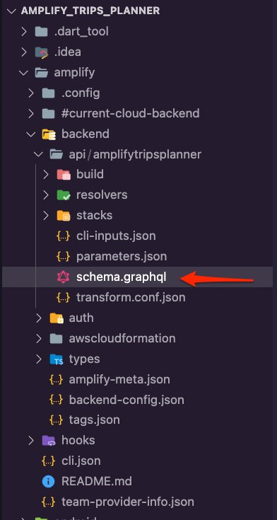 3. Open the **schema.graphql** file and update it with the following to define the trip model. `type Trip @model @auth(rules: [{ allow: owner }]) { id: ID! tripName: String! destination: String! startDate: AWSDate! endDate: AWSDate! tripImageUrl: String tripImageKey: String }` 1. Run the following command in the root folder of the app to generate the trip model file. `amplify codegen models` The Amplify CLI will generate the dart files in the **lib/models** folder. 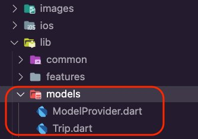 2. Run the command **amplify push** to create the resources in the cloud. 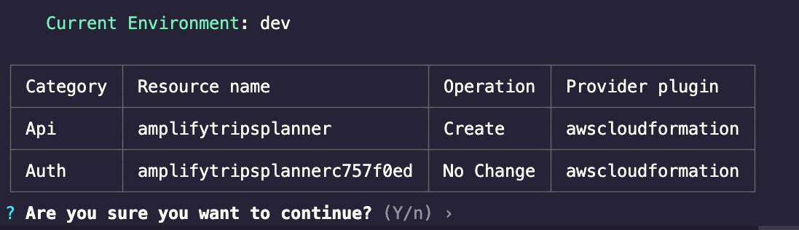 3. Press **Enter**. The Amplify CLI will deploy the resources and display a confirmation, as shown in the screenshot. 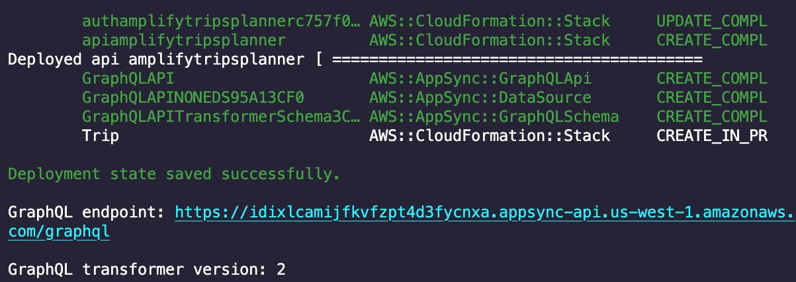 4. Open **main.dart** file and update the **\_configureAmplify()**function as shown in the code to add the Amplify API plugin. `Future<void> _configureAmplify() async { await Amplify.addPlugins([ AmplifyAuthCognito(), AmplifyAPI(modelProvider: ModelProvider.instance), ]); await Amplify.configure(amplifyconfig); }` The **main.dart** file should now look like the following code snippet. `import 'package:amplify_api/amplify_api.dart'; import 'package:amplify_auth_cognito/amplify_auth_cognito.dart'; import 'package:amplify_flutter/amplify_flutter.dart'; import 'package:amplify_trips_planner/models/ModelProvider.dart'; import 'package:amplify_trips_planner/trips_planner_app.dart'; import 'package:flutter/material.dart'; import 'package:flutter_riverpod/flutter_riverpod.dart'; import 'amplifyconfiguration.dart'; Future<void> main() async { WidgetsFlutterBinding.ensureInitialized(); try { await _configureAmplify(); } on AmplifyAlreadyConfiguredException { debugPrint('Amplify configuration failed.'); } runApp( const ProviderScope( child: TripsPlannerApp(), ), ); } Future<void> _configureAmplify() async { await Amplify.addPlugins([ AmplifyAuthCognito(), AmplifyAPI(modelProvider: ModelProvider.instance), ]); await Amplify.configure(amplifyconfig); }` 1. Create a new dart file inside the **lib/features/trip/service** folder and call it **trips_api_service.dart.** 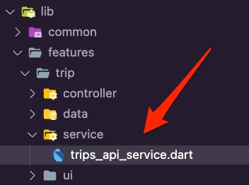 2. Open the **trips_api_service.dart** file and update it with the following code snippet to create the **TripsAPIService,**which contains the following functions: <br>• **getTrips** - This function will query the Amplify API for the **active and upcoming** trips and return a list of them. <br>• **getPastTrips** - This function will query the Amplify API for **past** trips and return a list of them. <br>• **getTrip** - This function will query the Amplify API for a specific trip. <br>• **addTrip** , **deleteTrip** , and **updateTrip** is for adding, deleting, or updating the trips in the Amplify API. `import 'dart:async'; import 'package:amplify_api/amplify_api.dart'; import 'package:amplify_flutter/amplify_flutter.dart'; import 'package:amplify_trips_planner/models/ModelProvider.dart'; import 'package:flutter_riverpod/flutter_riverpod.dart'; final tripsAPIServiceProvider = Provider<TripsAPIService>((ref) { final service = TripsAPIService(); return service; }); class TripsAPIService { TripsAPIService(); Future<List<Trip>> getTrips() async { try { final request = ModelQueries.list(Trip.classType); final response = await Amplify.API.query(request: request).response; final trips = response.data?.items; if (trips == null) { safePrint('getTrips errors: ${response.errors}'); return const []; } trips.sort( (a, b) => a!.startDate.getDateTime().compareTo(b!.startDate.getDateTime()), ); return trips .map((e) => e as Trip) .where( (element) => element.endDate.getDateTime().isAfter(DateTime.now()), ) .toList(); } on Exception catch (error) { safePrint('getTrips failed: $error'); return const []; } } Future<List<Trip>> getPastTrips() async { try { final request = ModelQueries.list(Trip.classType); final response = await Amplify.API.query(request: request).response; final trips = response.data?.items; if (trips == null) { safePrint('getPastTrips errors: ${response.errors}'); return const []; } trips.sort( (a, b) => a!.startDate.getDateTime().compareTo(b!.startDate.getDateTime()), ); return trips .map((e) => e as Trip) .where( (element) => element.endDate.getDateTime().isBefore(DateTime.now()), ) .toList(); } on Exception catch (error) { safePrint('getPastTrips failed: $error'); return const []; } } Future<void> addTrip(Trip trip) async { try { final request = ModelMutations.create(trip); final response = await Amplify.API.mutate(request: request).response; final createdTrip = response.data; if (createdTrip == null) { safePrint('addTrip errors: ${response.errors}'); return; } } on Exception catch (error) { safePrint('addTrip failed: $error'); } } Future<void> deleteTrip(Trip trip) async { try { await Amplify.API .mutate( request: ModelMutations.delete(trip), ) .response; } on Exception catch (error) { safePrint('deleteTrip failed: $error'); } } Future<void> updateTrip(Trip updatedTrip) async { try { await Amplify.API .mutate( request: ModelMutations.update(updatedTrip), ) .response; } on Exception catch (error) { safePrint('updateTrip failed: $error'); } } Future<Trip> getTrip(String tripId) async { try { final request = ModelQueries.get( Trip.classType, TripModelIdentifier(id: tripId), ); final response = await Amplify.API.query(request: request).response; final trip = response.data!; return trip; } on Exception catch (error) { safePrint('getTrip failed: $error'); rethrow; } } }` 3. Create a new dart file inside the **lib/features/trip/data** folder and call it **trips_repository.dart.** 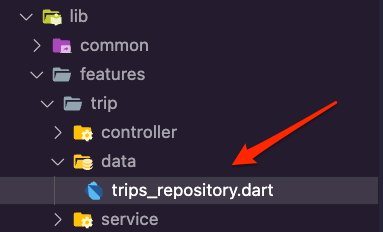 4. Open the **trips_repository.dar**t file and update it with the following code: `import 'package:amplify_trips_planner/features/trip/service/trips_api_service.dart'; import 'package:amplify_trips_planner/models/Trip.dart'; import 'package:flutter_riverpod/flutter_riverpod.dart'; final tripsRepositoryProvider = Provider<TripsRepository>((ref) { final tripsAPIService = ref.read(tripsAPIServiceProvider); return TripsRepository(tripsAPIService); }); class TripsRepository { TripsRepository(this.tripsAPIService); final TripsAPIService tripsAPIService; Future<List<Trip>> getTrips() { return tripsAPIService.getTrips(); } Future<List<Trip>> getPastTrips() { return tripsAPIService.getPastTrips(); } Future<void> add(Trip trip) async { return tripsAPIService.addTrip(trip); } Future<void> update(Trip updatedTrip) async { return tripsAPIService.updateTrip(updatedTrip); } Future<void> delete(Trip deletedTrip) async { return tripsAPIService.deleteTrip(deletedTrip); } Future<Trip> getTrip(String tripId) async { return tripsAPIService.getTrip(tripId); } }` 5. Create a new dart file inside the **lib/feature/trip/controller** folder and call it **trips_list_controller.dart**. 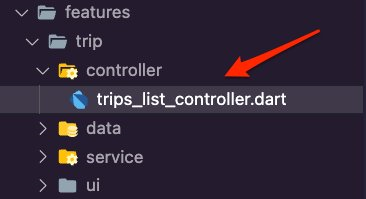 6. Open the **trips_list_controller.dart** file and update it with the following code. The UI will use the controller to add a new trip by creating the trip item and passing it as a parameter to the **tripsRepository.add(trip)** function. ###### Note VSCode will show errors due to the missing the **trips_list_controller.g.dart** file. You will fix that in the next step. `import 'dart:async'; import 'package:amplify_flutter/amplify_flutter.dart'; import 'package:amplify_trips_planner/features/trip/data/trips_repository.dart'; import 'package:amplify_trips_planner/models/ModelProvider.dart'; import 'package:riverpod_annotation/riverpod_annotation.dart'; part 'trips_list_controller.g.dart'; @riverpod class TripsListController extends _$TripsListController { Future<List<Trip>> _fetchTrips() async { final tripsRepository = ref.read(tripsRepositoryProvider); final trips = await tripsRepository.getTrips(); return trips; } @override FutureOr<List<Trip>> build() async { return _fetchTrips(); } Future<void> addTrip({ required String name, required String destination, required String startDate, required String endDate, }) async { final trip = Trip( tripName: name, destination: destination, startDate: TemporalDate(DateTime.parse(startDate)), endDate: TemporalDate(DateTime.parse(endDate)), ); state = const AsyncValue.loading(); state = await AsyncValue.guard(() async { final tripsRepository = ref.read(tripsRepositoryProvider); await tripsRepository.add(trip); return _fetchTrips(); }); } Future<void> removeTrip(Trip trip) async { state = const AsyncValue.loading(); state = await AsyncValue.guard(() async { final tripsRepository = ref.read(tripsRepositoryProvider); await tripsRepository.delete(trip); return _fetchTrips(); }); } }` 7. Navigate to the app's root folder and run the command below in your terminal. `dart run build_runner build -d` This will generate the **trips_list_controller.g.dart** file inside the  **lib/feature/trip/controller** folder. 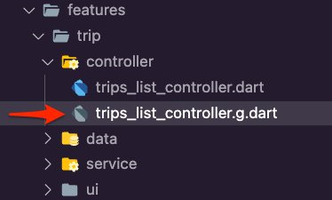 1. Create a new dart file in the **lib/common/ui** folder and call it **bottomsheet_text_form_field.dart**. 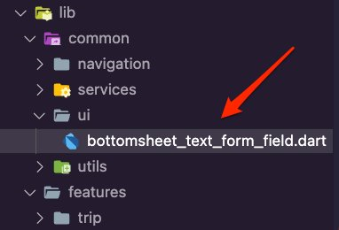 2. Open the **bottomsheet_text_form_field.dart** file and update it with the following code to create the **BottomSheetTextFormField** widget to build a **TextFormField** that the App will use in a form to create a new trip. ``` import 'package:flutter/material.dart'; class BottomSheetTextFormField extends StatelessWidget { const BottomSheetTextFormField({ required this.labelText, required this.controller, required this.keyboardType, this.onTap, super.key, }); final String labelText; final TextEditingController controller; final TextInputType keyboardType; final void Function()? onTap; @override Widget build(BuildContext context) { return TextFormField( controller: controller, keyboardType: keyboardType, autofocus: true, autocorrect: false, textInputAction: TextInputAction.next, validator: (value) { if (value == null |     | value.isEmpty) { return 'Please enter a value'; } return null; }, decoration: InputDecoration( labelText: labelText, ), onTap: onTap, ); } } `3. Create a new dart file in the **lib/common/utils** folder and call it **date\_time\_formatter.dart**. 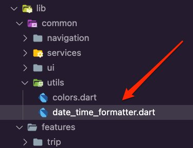 4. Open the **date\_time\_formatter.dart** file and update it with the following code to create the **DateTimeFormatter** extension to format the DateTime value.` import 'package:intl/intl.dart'; extension DateTimeFormatter on DateTime { String format(String format) { return DateFormat(format).format(this); } } `5. Create a new dart file inside the **lib/features/trip/ui/trips\_list** folder and call it **add\_trip\_bottomsheet.dart**. 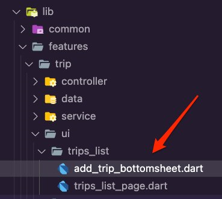 6. Open the **add\_trip\_bottomsheet.dart** file and update it with the following code. This will allow us to present a form to the user to submit the required details to create a new trip. Note how we are using the **BottomSheetTextFormField** widget and the **DateTimeFormatter**extension in the form.` import 'package:amplify*trips_planner/common/ui/bottomsheet_text_form_field.dart'; import 'package:amplify_trips_planner/common/utils/date_time_formatter.dart'; import 'package:amplify_trips_planner/features/trip/controller/trips_list_controller.dart'; import 'package:flutter/material.dart'; import 'package:flutter_riverpod/flutter_riverpod.dart'; import 'package:go_router/go_router.dart'; class AddTripBottomSheet extends ConsumerStatefulWidget { const AddTripBottomSheet({ super.key, }); @override AddTripBottomSheetState createState() => AddTripBottomSheetState(); } class AddTripBottomSheetState extends ConsumerState<AddTripBottomSheet> { final formGlobalKey = GlobalKey<FormState>(); final tripNameController = TextEditingController(); final destinationController = TextEditingController(); final startDateController = TextEditingController(); final endDateController = TextEditingController(); @override Widget build(BuildContext context) { return Form( key: formGlobalKey, child: Container( padding: EdgeInsets.only( top: 15, left: 15, right: 15, bottom: MediaQuery.of(context).viewInsets.bottom + 15, ), width: double.infinity, child: Column( mainAxisSize: MainAxisSize.min, crossAxisAlignment: CrossAxisAlignment.start, children: [ BottomSheetTextFormField( labelText: 'Trip Name', controller: tripNameController, keyboardType: TextInputType.name, ), const SizedBox( height: 20, ), BottomSheetTextFormField( labelText: 'Trip Destination', controller: destinationController, keyboardType: TextInputType.name, ), const SizedBox( height: 20, ), BottomSheetTextFormField( labelText: 'Start Date', controller: startDateController, keyboardType: TextInputType.datetime, onTap: () async { final pickedDate = await showDatePicker( context: context, initialDate: DateTime.now(), firstDate: DateTime(2000), lastDate: DateTime(2101), ); if (pickedDate != null) { print(pickedDate.format('yyyy-MM-dd')); startDateController.text = pickedDate.format('yyyy-MM-dd'); print(startDateController.text); } }, ), const SizedBox( height: 20, ), BottomSheetTextFormField( labelText: 'End Date', controller: endDateController, keyboardType: TextInputType.datetime, onTap: () async { if (startDateController.text.isNotEmpty) { final pickedDate = await showDatePicker( context: context, initialDate: DateTime.parse(startDateController.text), firstDate: DateTime.parse(startDateController.text), lastDate: DateTime(2101), ); if (pickedDate != null) { print(pickedDate.format('yyyy-MM-dd')); endDateController.text = pickedDate.format('yyyy-MM-dd'); } } }, ), const SizedBox( height: 20, ), TextButton( child: const Text('OK'), onPressed: () async { final currentState = formGlobalKey.currentState; if (currentState == null) { return; } if (currentState.validate()) { await ref.watch(tripsListControllerProvider.notifier).addTrip( name: tripNameController.text, destination: destinationController.text, startDate: startDateController.text, endDate: endDateController.text, ); if (context.mounted) { context.pop(); } } }, //, ), ], ), ), ); } } `7. Create a new folder inside the **lib/features/trip/ui** folder, name it **trips\_gridview**, and then create the file **trip\_gridview\_item\_card.dart** inside it. 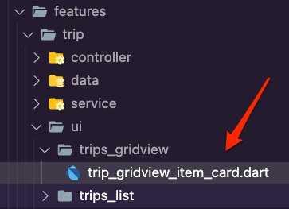 8. Open the **trip\_gridview\_item\_card.dart**file and update it with the following code. This will create a Card widget to display the trip details in the trips list page.` import 'package:amplify_trips_planner/common/utils/colors.dart' as constants; import 'package:amplify_trips_planner/common/utils/date_time_formatter.dart'; import 'package:amplify_trips_planner/models/ModelProvider.dart'; import 'package:cached_network_image/cached_network_image.dart'; import 'package:flutter/material.dart'; class TripGridViewItemCard extends StatelessWidget { const TripGridViewItemCard({ required this.trip, super.key, }); final Trip trip; @override Widget build(BuildContext context) { return Card( clipBehavior: Clip.antiAlias, shape: RoundedRectangleBorder( borderRadius: BorderRadius.circular(15), ), elevation: 5, child: Column( children: [ Expanded( child: Container( height: 500, alignment: Alignment.center, color: const Color(constants.primaryColorDark), child: Stack( children: [ Positioned.fill( child: trip.tripImageUrl != null ? Stack( children: [ const Center(child: CircularProgressIndicator()), CachedNetworkImage( errorWidget: (context, url, dynamic error) => const Icon(Icons.error_outline_outlined), imageUrl: trip.tripImageUrl!, cacheKey: trip.tripImageKey, width: double.maxFinite, height: 500, alignment: Alignment.topCenter, fit: BoxFit.fill, ), ], ) : Image.asset( 'images/amplify.png', fit: BoxFit.contain, ), ), Positioned( bottom: 16, left: 16, right: 16, child: FittedBox( fit: BoxFit.scaleDown, alignment: Alignment.centerLeft, child: Text( trip.destination, style: Theme.of(context) .textTheme .headlineSmall! .copyWith(color: Colors.white), ), ), ), ], ), ), ), Padding( padding: const EdgeInsets.fromLTRB(2, 8, 8, 4), child: DefaultTextStyle( softWrap: false, overflow: TextOverflow.ellipsis, style: Theme.of(context).textTheme.titleMedium!, child: Column( crossAxisAlignment: CrossAxisAlignment.start, children: [ Padding( padding: const EdgeInsets.only(bottom: 8), child: Text( trip.tripName, style: Theme.of(context) .textTheme .titleMedium! .copyWith(color: Colors.black54), ), ), Text( trip.startDate.getDateTime().format('MMMM dd, yyyy'), style: const TextStyle(fontSize: 12), ), Text( trip.endDate.getDateTime().format('MMMM dd, yyyy'), style: const TextStyle(fontSize: 12), ), ], ), ), ), ], ), ); } } `9. Create the file **trip\_gridview\_item.dart** in the **lib/features/trip/ui/trips\_gridview** folder. 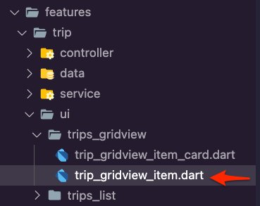 10. Open the **trip\_gridview\_item.dart** file and update it with the following code. The App will use this for the trips list grid.` import 'package:amplify_trips_planner/common/navigation/router/routes.dart'; import 'package:amplify_trips_planner/features/trip/ui/trips_gridview/trip_gridview_item_card.dart'; import 'package:amplify_trips_planner/models/ModelProvider.dart'; import 'package:flutter/material.dart'; import 'package:go_router/go_router.dart'; class TripGridViewItem extends StatelessWidget { const TripGridViewItem({ required this.trip, super.key, }); final Trip trip; @override Widget build(BuildContext context) { return InkWell( splashColor: Theme.of(context).primaryColor, borderRadius: BorderRadius.circular(15), onTap: () { context.goNamed( AppRoute.trip.name, pathParameters: {'id': trip.id}, extra: trip, ); }, child: TripGridViewItemCard( trip: trip, ), ); } } `11. Create the file **trips\_list\_gridview.dart** inside the **lib/features/trip/ui/trips\_gridview**folder. 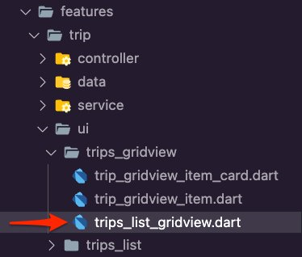 12. Open the **trips\_list\_gridview.dart**file and update it with the following code. This will cause the gridview to display the trips list.` import 'package:amplify_trips_planner/features/trip/ui/trips_gridview/trip_gridview_item.dart'; import 'package:amplify_trips_planner/models/ModelProvider.dart'; import 'package:flutter/material.dart'; import 'package:flutter_riverpod/flutter_riverpod.dart'; class TripsListGridView extends StatelessWidget { const TripsListGridView({ required this.tripsList, super.key, }); final AsyncValue<List<Trip>> tripsList; @override Widget build(BuildContext context) { switch (tripsList) { case AsyncData(:final value): return value.isEmpty ? const Center( child: Text('No Trips'), ) : OrientationBuilder( builder: (context, orientation) { return GridView.count( crossAxisCount: (orientation == Orientation.portrait) ? 2 : 3, mainAxisSpacing: 4, crossAxisSpacing: 4, padding: const EdgeInsets.all(4), childAspectRatio: (orientation == Orientation.portrait) ? 0.9 : 1.4, children: value.map((tripData) { return TripGridViewItem( trip: tripData, ); }).toList(growable: false), ); }, ); case AsyncError(): return const Center( child: Text('Error'), ); case AsyncLoading(): return const Center( child: CircularProgressIndicator(), ); case *: return const Center( child: Text('Error'), ); } } } `13. Open the **trips\_list\_page.dart** file and update it with the following code to use the **TripsListGridView** widget you created above for displaying the trips.` import 'package:amplify_trips_planner/common/utils/colors.dart' as constants; import 'package:amplify_trips_planner/features/trip/controller/trips_list_controller.dart'; import 'package:amplify_trips_planner/features/trip/ui/trips_gridview/trips_list_gridview.dart'; import 'package:amplify_trips_planner/features/trip/ui/trips_list/add_trip_bottomsheet.dart'; import 'package:flutter/material.dart'; import 'package:flutter_riverpod/flutter_riverpod.dart'; class TripsListPage extends ConsumerWidget { const TripsListPage({ super.key, }); Future<void> showAddTripDialog(BuildContext context) => showModalBottomSheet<void>( isScrollControlled: true, elevation: 5, context: context, builder: (sheetContext) { return const AddTripBottomSheet(); }, ); @override Widget build(BuildContext context, WidgetRef ref) { final tripsListValue = ref.watch(tripsListControllerProvider); return Scaffold( appBar: AppBar( centerTitle: true, title: const Text( 'Amplify Trips Planner', ), backgroundColor: const Color(constants.primaryColorDark), ), floatingActionButton: FloatingActionButton( onPressed: () { showAddTripDialog(context); }, backgroundColor: const Color(constants.primaryColorDark), child: const Icon(Icons.add), ), body: TripsListGridView( tripsList: tripsListValue, ), ); } } ``` 14. Run the app in the simulator and create a trip. The following is an example using an iPhone simulator. 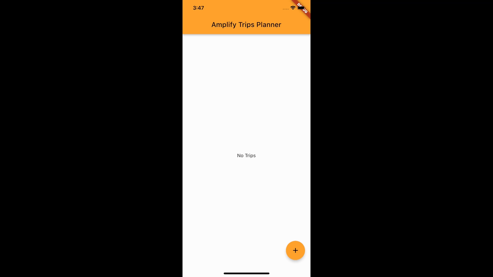 ## Conclusion In this module, you added a GraphQL API for trips using Amplify, and configured create, read, update, and delete trips functionality in your app. |
