# Module 4: Add Amplify storage

## Overview

In this module, you will add the ability to upload an image for each trip. You will add Amplify storage to enable image uploading and rendering.

The Amplify Storage category comes with default built-in support for Amazon Simple Storage Service (Amazon S3). The Amplify CLI helps you create and configure your app's storage buckets.

## What you will accomplish

- Add Amplify storage to the app
- Add the Trip Details page to the app
- Implement the upload image feature

## Implementation

|                              |            |
| ---------------------------- | ---------- |
| **Minimum time to complete** | 15 minutes |

1. Navigate to the root folder of the app and set up a storage resource by running the following command in your terminal.

```
amplify add storage
```

2. To create the Storage category, enter the following when prompted:

```
? Select from one of the below mentioned services: Content (Images, audio, video, etc.)
✔ Provide a friendly name for your resource that will be used to label this category in the project: · s3cf3f0a40
✔ Provide bucket name: · amplifytripsplannerstorage
✔ Who should have access: · Auth and guest users
✔ What kind of access do you want for Authenticated users? · create/update, read, delete
✔ What kind of access do you want for Guest users? · read
✔ Do you want to add a Lambda Trigger for your S3 Bucket? (y/N) · no
```

3. Run the command **amplify push** to create the resources in the cloud.

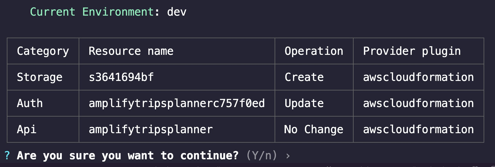 4. Press **Enter.** The Amplify CLI will deploy the resources and display a confirmation.

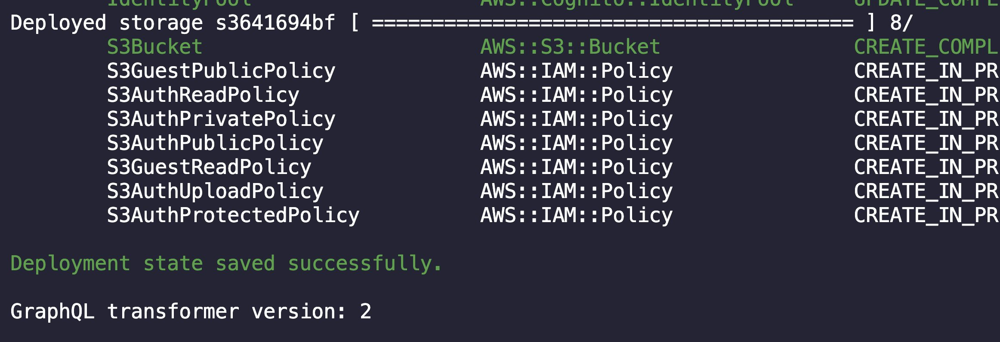 5. For iOS, open the file **ios/Runner/info.plist**. There are no configurations required for Android to access the phone camera and photo library.

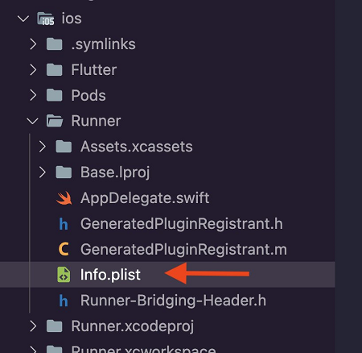

Add the following keys and values.

```
<key>NSCameraUsageDescription</key>
<string>Some Description</string>
<key>NSMicrophoneUsageDescription</key>
<string>Some Description</string>
<key>NSPhotoLibraryUsageDescription</key>
<string>Some Description</string>
```

The **ios/Runner/info.plist** file will look like the following.

```
<?xml version="1.0" encoding="UTF-8"?>
<!DOCTYPE plist PUBLIC "-//Apple//DTD PLIST 1.0//EN" "http://www.apple.com/DTDs/PropertyList-1.0.dtd">
<plist version="1.0">
<dict>
   <key>CFBundleDevelopmentRegion</key>
   <string>$(DEVELOPMENT_LANGUAGE)</string>
   <key>CFBundleDisplayName</key>
   <string>Amplify Trips Planner</string>
   <key>CFBundleExecutable</key>
   <string>$(EXECUTABLE_NAME)</string>
   <key>CFBundleIdentifier</key>
   <string>$(PRODUCT_BUNDLE_IDENTIFIER)</string>
   <key>CFBundleInfoDictionaryVersion</key>
   <string>6.0</string>
   <key>CFBundleName</key>
   <string>amplify_trips_planner</string>
   <key>CFBundlePackageType</key>
   <string>APPL</string>
   <key>CFBundleShortVersionString</key>
   <string>$(FLUTTER_BUILD_NAME)</string>
   <key>CFBundleSignature</key>
   <string>????</string>
   <key>CFBundleVersion</key>
   <string>$(FLUTTER_BUILD_NUMBER)</string>
   <key>LSRequiresIPhoneOS</key>
   <true/>
   <key>UILaunchStoryboardName</key>
   <string>LaunchScreen</string>
   <key>UIMainStoryboardFile</key>
   <string>Main</string>
   <key>UISupportedInterfaceOrientations</key>
   <array>
       <string>UIInterfaceOrientationPortrait</string>
       <string>UIInterfaceOrientationLandscapeLeft</string>
       <string>UIInterfaceOrientationLandscapeRight</string>
   </array>
   <key>UISupportedInterfaceOrientations~ipad</key>
   <array>
       <string>UIInterfaceOrientationPortrait</string>
       <string>UIInterfaceOrientationPortraitUpsideDown</string>
       <string>UIInterfaceOrientationLandscapeLeft</string>
       <string>UIInterfaceOrientationLandscapeRight</string>
   </array>
   <key>UIViewControllerBasedStatusBar</key> Appearance
   <false/>
   <key>CADisableMinimumFrameDurationOnPhone</key>
   <true/>
   <key>UIApplicationSupportsIndirectInputEvents</key>
   <true/>
   <key>NSCameraUsageDescription</key>
   <string>Some Description</string>
   <key>NSMicrophoneUsageDescription</key>
   <string>Some Description</string>
   <key>NSPhotoLibraryUsageDescription</key>
   <string>Some Description</string>
</dict>
</plist>
```

6. Open the **main.dart** file and update the **\_configureAmplify()** function as shown in the following code to add the Amplify storage plugin.

```
Future<void> _configureAmplify() async {
 await Amplify.addPlugins([
   AmplifyAuthCognito(),
   AmplifyAPI(modelProvider: ModelProvider.instance),
    AmplifyStorageS3()
 ]);
 await Amplify.configure(amplifyconfig);
}
```

The **main.dart** file should now look like the following.

```
import 'package:amplify_api/amplify_api.dart';
import 'package:amplify_auth_cognito/amplify_auth_cognito.dart';
import 'package:amplify_flutter/amplify_flutter.dart';
import 'package:amplify_trips_planner/models/ModelProvider.dart';
import 'package:amplify_trips_planner/trips_planner_app.dart';
import 'package:flutter/material.dart';
import 'package:flutter_riverpod/flutter_riverpod.dart';
import 'package:amplify_storage_s3/amplify_storage_s3.dart';

import 'amplifyconfiguration.dart';

Future<void> main() async {
 WidgetsFlutterBinding.ensureInitialized();
 try {
   await _configureAmplify();
 } on AmplifyAlreadyConfiguredException {
   debugPrint('Amplify configuration failed.');
 }

 runApp(
   const ProviderScope(
     child: TripsPlannerApp(),
   ),
 );
}

Future<void> _configureAmplify() async {
 await Amplify.addPlugins([
   AmplifyAuthCognito(),
   AmplifyAPI(modelProvider: ModelProvider.instance),
    AmplifyStorageS3()
 ]);
 await Amplify.configure(amplifyconfig);
}
```

7. Create a new dart file inside the folder **lib/common/services** and name it **storage_service.dart.**

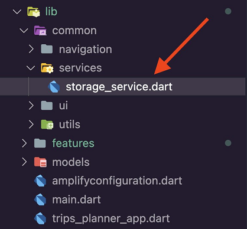 8. Open **storage_service.dart** file and update it with the following code to create the **StorageService**. In this service, you will find the **uploadFile** function, which uses the Amplify storage library to upload an image into an Amazon S3 bucket. Additionally, the service provides a **ValueNotifier** object to track the progress of the image upload.

```
import 'dart:io';

import 'package:amplify_flutter/amplify_flutter.dart';
import 'package:amplify_storage_s3/amplify_storage_s3.dart';
import 'package:flutter/material.dart';
import 'package:flutter_riverpod/flutter_riverpod.dart';
import 'package:path/path.dart' as p;
import 'package:uuid/uuid.dart';

final storageServiceProvider = Provider<StorageService>((ref) {
 return StorageService(ref: ref);
});

class StorageService {
 StorageService({
   required Ref ref,
 });

 ValueNotifier<double> uploadProgress = ValueNotifier<double>(0);
 Future<String> getImageUrl(String key) async {
   final result = await Amplify.Storage.getUrl(
     key: key,
     options: const StorageGetUrlOptions(
       pluginOptions: S3GetUrlPluginOptions(
         validateObjectExistence: true,
         expiresIn: Duration(days: 1),
       ),
     ),
   ).result;
   return result.url.toString();
 }

 ValueNotifier<double> getUploadProgress() {
   return uploadProgress;
 }

 Future<String?> uploadFile(File file) async {
   try {
     final extension = p.extension(file.path);
     final key = const Uuid().v1() + extension;
     final awsFile = AWSFile.fromPath(file.path);

     await Amplify.Storage.uploadFile(
       localFile: awsFile,
       key: key,
       onProgress: (progress) {
         uploadProgress.value = progress.fractionCompleted;
       },
     ).result;

     return key;
   } on Exception catch (e) {
     debugPrint(e.toString());
     return null;
   }
 }

 void resetUploadProgress() {
   uploadProgress.value = 0;
 }
}
```

9. Create a new dart file inside the folder **lib/common/ui** and name it **upload_progress_dialog.dart.**

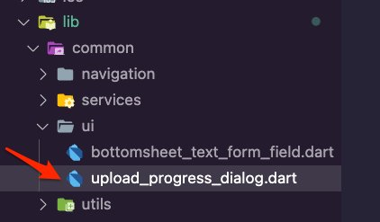 10. Open the **upload_progress_dialog.dart** file and update it with the following code to create a dialog that uses a progress indicator for the image upload.

###### Note

VSCode will show an error about missing the **trip_controller.dart** file. You will fix that in the next steps.

```
import 'package:amplify_trips_planner/features/trip/controller/trip_controller.dart';
import 'package:flutter/material.dart';
import 'package:flutter_riverpod/flutter_riverpod.dart';

class UploadProgressDialog extends ConsumerWidget {
 const UploadProgressDialog({super.key});

 @override
 Widget build(BuildContext context, WidgetRef ref) {
   return Dialog(
     backgroundColor: Colors.white,
     child: Padding(
       padding: const EdgeInsets.symmetric(vertical: 20),
       child: ValueListenableBuilder(
         valueListenable:
             ref.read(tripControllerProvider('').notifier).uploadProgress(),
         builder: (context, value, child) {
           return Column(
             mainAxisSize: MainAxisSize.min,
             children: [
               const CircularProgressIndicator(),
               const SizedBox(
                 height: 15,
               ),
               Text('${(double.parse(value.toString()) * 100).toInt()} %'),
               Container(
                 alignment: Alignment.topCenter,
                 margin: const EdgeInsets.all(20),
                 child: LinearProgressIndicator(
                   value: double.parse(value.toString()),
                   backgroundColor: Colors.grey,
                   color: Colors.purple,
                   minHeight: 10,
                 ),
               ),
             ],
           );
         },
       ),
     ),
   );
 }
}
```

1. Create a new dart file inside the folder **lib/features/trip/controller** and name it **trip_controller.dart.**

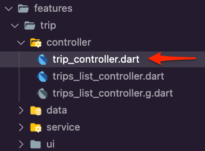 2. Open the **trip_controller.dart** file and update it with the following code. The UI will use this controller for editing and deleting a trip using its ID. The UI will also use the controller for uploading an image for the trip.

###### Note

VSCode will show errors due to the missing the **trip_controller.g.dart** file. You will fix that in the next
step.

```
import 'dart:async';
import 'dart:io';

import 'package:amplify_trips_planner/common/services/storage_service.dart';
import 'package:amplify_trips_planner/features/trip/data/trips_repository.dart';
import 'package:amplify_trips_planner/models/ModelProvider.dart';
import 'package:flutter/material.dart';
import 'package:riverpod_annotation/riverpod_annotation.dart';

part 'trip_controller.g.dart';

@riverpod
class TripController extends _$TripController {
 Future<Trip> _fetchTrip(String tripId) async {
   final tripsRepository = ref.read(tripsRepositoryProvider);
   return tripsRepository.getTrip(tripId);
 }

 @override
 FutureOr<Trip> build(String tripId) async {
   return _fetchTrip(tripId);
 }

 Future<void> updateTrip(Trip trip) async {
   state = const AsyncValue.loading();
   state = await AsyncValue.guard(() async {
     final tripsRepository = ref.read(tripsRepositoryProvider);
     await tripsRepository.update(trip);
     return _fetchTrip(trip.id);
   });
 }

 Future<void> uploadFile(File file, Trip trip) async {
   final fileKey = await ref.read(storageServiceProvider).uploadFile(file);
   if (fileKey != null) {
     final imageUrl =
         await ref.read(storageServiceProvider).getImageUrl(fileKey);
     final updatedTrip =
         trip.copyWith(tripImageKey: fileKey, tripImageUrl: imageUrl);
     await ref.read(tripsRepositoryProvider).update(updatedTrip);
     ref.read(storageServiceProvider).resetUploadProgress();
   }
 }

 ValueNotifier<double> uploadProgress() {
   return ref.read(storageServiceProvider).getUploadProgress();
 }
}
```

3. Navigate to the app's root folder and run the following command in your terminal.

```
dart run build_runner build -d
```

This will generate the **trip_controller.g.dart** file in the **lib/feature/trip/controller** folder

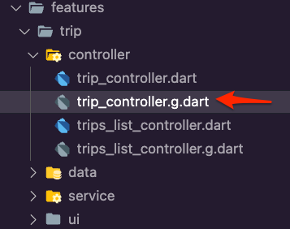 4. Create a new folder inside the **lib/features/trip/ui**
folder and name it **trip_page** and then create the file
**delete_trip_dialog.dart** inside it.

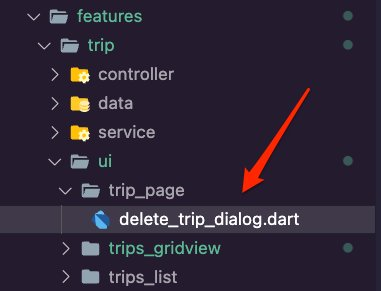 5. Open the **delete_trip_dialog.dart** file and update it with the following code. This will display a dialog for the user to confirm deleting the selected trip.

```
import 'package:flutter/material.dart';

class DeleteTripDialog extends StatelessWidget {
 const DeleteTripDialog({
   super.key,
 });

 @override
 Widget build(BuildContext context) {
   return AlertDialog(
     title: const Text('Please Confirm'),
     content: const Text('Delete this trip?'),
     actions: [
       TextButton(
         onPressed: () async {
           Navigator.of(context).pop(true);
         },
         child: const Text('Yes'),
       ),
       TextButton(
         onPressed: () {
           Navigator.of(context).pop(false);
         },
         child: const Text('No'),
       )
     ],
   );
 }
}
```

6. Create a new dart file inside the **lib/features/trip/ui/trip_page** folder and name it **selected_trip_card.dart**.

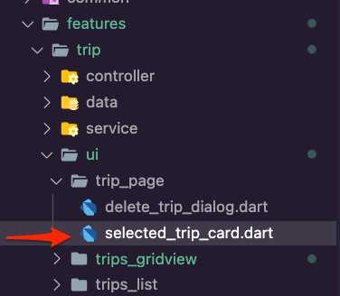 7. Open the **selected_trip_card.dart** file and update it with the following code. Here we check if there is an image for the trip and display it in a card widget. We use the placeholder image from the app assets if there is no image. We are also introducing three icon buttons for the user to choose to upload a photo, edit the trip, and delete the trip.

```
import 'dart:io';

import 'package:amplify_trips_planner/common/navigation/router/routes.dart';
import 'package:amplify_trips_planner/common/ui/upload_progress_dialog.dart';
import 'package:amplify_trips_planner/common/utils/colors.dart' as constants;
import 'package:amplify_trips_planner/features/trip/controller/trip_controller.dart';
import 'package:amplify_trips_planner/features/trip/controller/trips_list_controller.dart';
import 'package:amplify_trips_planner/features/trip/ui/trip_page/delete_trip_dialog.dart';
import 'package:amplify_trips_planner/models/Trip.dart';
import 'package:cached_network_image/cached_network_image.dart';
import 'package:flutter/material.dart';
import 'package:flutter_riverpod/flutter_riverpod.dart';
import 'package:go_router/go_router.dart';
import 'package:image_picker/image_picker.dart';

class SelectedTripCard extends ConsumerWidget {
 const SelectedTripCard({
   required this.trip,
   super.key,
 });

 final Trip trip;

 Future<bool> uploadImage({
   required BuildContext context,
   required WidgetRef ref,
   required Trip trip,
 }) async {
   final picker = ImagePicker();
   final pickedFile = await picker.pickImage(source: ImageSource.gallery);
   if (pickedFile == null) {
     return false;
   }
   final file = File(pickedFile.path);
   if (context.mounted) {
     showDialog<String>(
       context: context,
       barrierDismissible: false,
       builder: (BuildContext context) {
         return const UploadProgressDialog();
       },
     );

     await ref
         .watch(tripControllerProvider(trip.id).notifier)
         .uploadFile(file, trip);
   }

   return true;
 }

 Future<bool> deleteTrip(
   BuildContext context,
   WidgetRef ref,
   Trip trip,
 ) async {
   var value = await showDialog<bool>(
     context: context,
     builder: (BuildContext context) {
       return const DeleteTripDialog();
     },
   );
   value ??= false;

   if (value) {
     await ref.watch(tripsListControllerProvider.notifier).removeTrip(trip);
   }
   return value;
 }

 @override
 Widget build(BuildContext context, WidgetRef ref) {
   return Card(
     clipBehavior: Clip.antiAlias,
     shape: RoundedRectangleBorder(
       borderRadius: BorderRadius.circular(15),
     ),
     elevation: 5,
     child: Column(
       mainAxisSize: MainAxisSize.min,
       children: [
         Text(
           trip.tripName,
           textAlign: TextAlign.center,
           style: const TextStyle(
             fontSize: 20,
             fontWeight: FontWeight.bold,
           ),
         ),
         const SizedBox(
           height: 8,
         ),
         Container(
           alignment: Alignment.center,
           color: const Color(constants.primaryColorDark), //Color(0xffE1E5E4),
           height: 150,

           child: trip.tripImageUrl != null
               ? Stack(
                   children: [
                     const Center(child: CircularProgressIndicator()),
                     CachedNetworkImage(
                       cacheKey: trip.tripImageKey,
                       imageUrl: trip.tripImageUrl!,
                       width: double.maxFinite,
                       height: 500,
                       alignment: Alignment.topCenter,
                       fit: BoxFit.fill,
                     ),
                   ],
                 )
               : Image.asset(
                   'images/amplify.png',
                   fit: BoxFit.contain,
                 ),
         ),
         Row(
           mainAxisAlignment: MainAxisAlignment.spaceAround,
           children: [
             IconButton(
               onPressed: () {
                 context.goNamed(
                   AppRoute.editTrip.name,
                   pathParameters: {'id': trip.id},
                   extra: trip,
                 );
               },
               icon: const Icon(Icons.edit),
             ),
             IconButton(
               onPressed: () {
                 uploadImage(
                   context: context,
                   trip: trip,
                   ref: ref,
                 ).then((value) {
                   if (value) {
                     Navigator.of(context, rootNavigator: true).pop();
                     ref.invalidate(tripControllerProvider(trip.id));
                   }
                 });
               },
               icon: const Icon(Icons.camera_enhance_sharp),
             ),
             IconButton(
               onPressed: () {
                 deleteTrip(context, ref, trip).then((value) {
                   if (value) {
                     context.goNamed(
                       AppRoute.home.name,
                     );
                   }
                 });
               },
               icon: const Icon(Icons.delete),
             ),
           ],
         )
       ],
     ),
   );
 }
}
```

8. Create a new dart file inside the **lib/features/trip/ui/trip_page** folder and name it **trip_details.dart**.

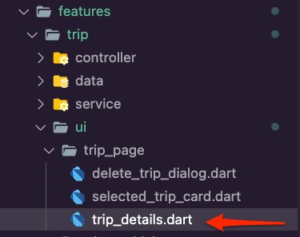 9. Open the **trip_details.dart** file and update it with the following code to create a column that uses the **SelectedTripCard** widget you created to display the details of the trip.

```
import 'package:amplify_trips_planner/features/trip/controller/trip_controller.dart';
import 'package:amplify_trips_planner/features/trip/ui/trip_page/selected_trip_card.dart';
import 'package:amplify_trips_planner/models/ModelProvider.dart';
import 'package:flutter/material.dart';
import 'package:flutter_riverpod/flutter_riverpod.dart';

class TripDetails extends ConsumerWidget {
 const TripDetails({
   required this.trip,
   required this.tripId,
   super.key,
 });

 final AsyncValue<Trip> trip;
 final String tripId;

 @override
 Widget build(BuildContext context, WidgetRef ref) {
   switch (trip) {
     case AsyncData(:final value):
       return Column(
         crossAxisAlignment: CrossAxisAlignment.stretch,
         children: [
           const SizedBox(
             height: 8,
           ),
           SelectedTripCard(trip: value),
           const SizedBox(
             height: 20,
           ),
           const Divider(
             height: 20,
             thickness: 5,
             indent: 20,
             endIndent: 20,
           ),
           const Text(
             'Your Activities',
             textAlign: TextAlign.center,
             style: TextStyle(
               fontSize: 20,
               fontWeight: FontWeight.bold,
             ),
           ),
           const SizedBox(
             height: 8,
           ),
         ],
       );

     case AsyncError():
       return Center(
         child: Column(
           children: [
             const Text('Error'),
             TextButton(
               onPressed: () async {
                 ref.invalidate(tripControllerProvider(tripId));
               },
               child: const Text('Try again'),
             ),
           ],
         ),
       );
     case AsyncLoading():
       return const Center(
         child: CircularProgressIndicator(),
       );

     case _:
       return const Center(
         child: Text('Error'),
       );
   }
 }
}
```

10. Create a new dart file in the **lib/features/trip/ui/trip_page** folder and name it **trip_page.dart**.

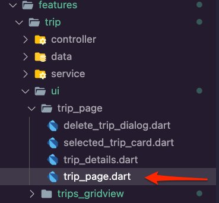 11. Open the **trip_page.dart** file and update it with the following code to create the **TripPage**, which will get the trip details using the **tripId**. The **TripPage** will use the **TripDetails** you created previously to display the data.

```
import 'package:amplify_trips_planner/common/navigation/router/routes.dart';
import 'package:amplify_trips_planner/common/utils/colors.dart' as constants;
import 'package:amplify_trips_planner/features/trip/controller/trip_controller.dart';
import 'package:amplify_trips_planner/features/trip/ui/trip_page/trip_details.dart';
import 'package:flutter/material.dart';
import 'package:flutter_riverpod/flutter_riverpod.dart';
import 'package:go_router/go_router.dart';

class TripPage extends ConsumerWidget {
 const TripPage({
   required this.tripId,
   super.key,
 });
 final String tripId;

 @override
 Widget build(BuildContext context, WidgetRef ref) {
   final tripValue = ref.watch(tripControllerProvider(tripId));

   return Scaffold(
     appBar: AppBar(
       centerTitle: true,
       title: const Text(
         'Amplify Trips Planner',
       ),
       actions: [
         IconButton(
           onPressed: () {
             context.goNamed(
               AppRoute.home.name,
             );
           },
           icon: const Icon(Icons.home),
         ),
       ],
       backgroundColor: const Color(constants.primaryColorDark),
     ),
     body: TripDetails(
       tripId: tripId,
       trip: tripValue,
     ),
   );
 }
}
```

12. Open the **lib/common/navigation/router/router.dart** file and update it to add the **TripPage** route.

```
GoRoute(
 path: '/trip/:id',
 name: AppRoute.trip.name,
 builder: (context, state) {
   final tripId = state.pathParameters['id']!;
   return TripPage(tripId: tripId);
 },
),
```

The **router.dart** should look like the following code snippet.

```
import 'package:amplify_trips_planner/common/navigation/router/routes.dart';
import 'package:amplify_trips_planner/features/trip/ui/trip_page/trip_page.dart';
import 'package:amplify_trips_planner/features/trip/ui/trips_list/trips_list_page.dart';
import 'package:flutter/material.dart';
import 'package:go_router/go_router.dart';

final router = GoRouter(
 routes: [
   GoRoute(
     path: '/',
     name: AppRoute.home.name,
     builder: (context, state) => const TripsListPage(),
   ),
   GoRoute(
     path: '/trip/:id',
     name: AppRoute.trip.name,
     builder: (context, state) {
       final tripId = state.pathParameters['id']!;
       return TripPage(tripId: tripId);
     },
   ),
 ],
 errorBuilder: (context, state) => Scaffold(
   body: Center(
     child: Text(state.error.toString()),
   ),
 ),
);
```

1. Create a new folder inside the **lib/features/trip/ui** folder and name it **edit_trip_page** and then create the file **edit_trip_page.dart** inside it.

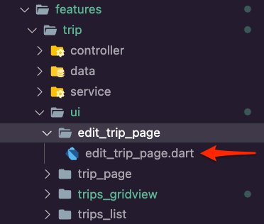 2. Open the **edit_trip_page.dart** file and update it with the following code to create the UI for the user to edit the selected trip.

```
import 'package:amplify_flutter/amplify_flutter.dart';
import 'package:amplify_trips_planner/common/navigation/router/routes.dart';
import 'package:amplify_trips_planner/common/ui/bottomsheet_text_form_field.dart';
import 'package:amplify_trips_planner/common/utils/colors.dart' as constants;
import 'package:amplify_trips_planner/common/utils/date_time_formatter.dart';
import 'package:amplify_trips_planner/features/trip/controller/trip_controller.dart';
import 'package:amplify_trips_planner/models/ModelProvider.dart';
import 'package:flutter/material.dart';
import 'package:flutter_riverpod/flutter_riverpod.dart';
import 'package:go_router/go_router.dart';

class EditTripPage extends ConsumerStatefulWidget {
 const EditTripPage({
   required this.trip,
   super.key,
 });

 final Trip trip;

 @override
 EditTripPageState createState() => EditTripPageState();
}

class EditTripPageState extends ConsumerState<EditTripPage> {
 @override
 void initState() {
   tripNameController.text = widget.trip.tripName;
   destinationController.text = widget.trip.destination;

   startDateController.text =
       widget.trip.startDate.getDateTime().format('yyyy-MM-dd');

   endDateController.text =
       widget.trip.endDate.getDateTime().format('yyyy-MM-dd');

   super.initState();
 }

 final formGlobalKey = GlobalKey<FormState>();
 final tripNameController = TextEditingController();
 final destinationController = TextEditingController();
 final startDateController = TextEditingController();

 final endDateController = TextEditingController();
 @override
 Widget build(BuildContext context) {
   return Scaffold(
     appBar: AppBar(
       centerTitle: true,
       title: const Text(
         'Amplify Trips Planner',
       ),
       leading: IconButton(
         onPressed: () {
           context.goNamed(
             AppRoute.trip.name,
             pathParameters: {'id': widget.trip.id},
           );
         },
         icon: const Icon(Icons.arrow_back),
       ),
       backgroundColor: const Color(constants.primaryColorDark),
     ),
     body: SingleChildScrollView(
       child: Form(
         key: formGlobalKey,
         child: Container(
           padding: EdgeInsets.only(
             top: 15,
             left: 15,
             right: 15,
             bottom: MediaQuery.of(context).viewInsets.bottom + 15,
           ),
           width: double.infinity,
           child: Column(
             mainAxisSize: MainAxisSize.min,
             crossAxisAlignment: CrossAxisAlignment.start,
             children: [
               BottomSheetTextFormField(
                 labelText: 'Trip Name',
                 controller: tripNameController,
                 keyboardType: TextInputType.name,
               ),
               const SizedBox(
                 height: 20,
               ),
               BottomSheetTextFormField(
                 labelText: 'Trip Destination',
                 controller: destinationController,
                 keyboardType: TextInputType.name,
               ),
               const SizedBox(
                 height: 20,
               ),
               BottomSheetTextFormField(
                 labelText: 'Start Date',
                 controller: startDateController,
                 keyboardType: TextInputType.datetime,
                 onTap: () async {
                   final pickedDate = await showDatePicker(
                     context: context,
                     initialDate: DateTime.now(),
                     firstDate: DateTime(2000),
                     lastDate: DateTime(2101),
                   );

                   if (pickedDate != null) {
                     startDateController.text =
                         pickedDate.format('yyyy-MM-dd');
                   }
                 },
               ),
               const SizedBox(
                 height: 20,
               ),
               BottomSheetTextFormField(
                 labelText: 'End Date',
                 controller: endDateController,
                 keyboardType: TextInputType.datetime,
                 onTap: () async {
                   if (startDateController.text.isNotEmpty) {
                     final pickedDate = await showDatePicker(
                       context: context,
                       initialDate: DateTime.parse(startDateController.text),
                       firstDate: DateTime.parse(startDateController.text),
                       lastDate: DateTime(2101),
                     );

                     if (pickedDate != null) {
                       endDateController.text =
                           pickedDate.format('yyyy-MM-dd');
                     }
                   }
                 },
               ),
               const SizedBox(
                 height: 20,
               ),
               TextButton(
                 child: const Text('OK'),
                 onPressed: () async {
                   final currentState = formGlobalKey.currentState;
                   if (currentState == null) {
                     return;
                   }
                   if (currentState.validate()) {
                     final updatedTrip = widget.trip.copyWith(
                       tripName: tripNameController.text,
                       destination: destinationController.text,
                       startDate: TemporalDate(
                         DateTime.parse(startDateController.text),
                       ),
                       endDate: TemporalDate(
                         DateTime.parse(endDateController.text),
                       ),
                     );

                     await ref
                         .watch(
                             tripControllerProvider(widget.trip.id).notifier)
                         .updateTrip(updatedTrip);
                     if (context.mounted) {
                       context.goNamed(
                         AppRoute.trip.name,
                         pathParameters: {'id': widget.trip.id},
                         extra: updatedTrip,
                       );
                     }
                   }
                 }, //,
               ),
             ],
           ),
         ),
       ),
     ),
   );
 }
}
```

3. Open the **lib/common/navigation/router/router.dart** file and update it to add the **EditTripPage** route.

```
GoRoute(
 path: '/edittrip/:id',
 name: AppRoute.editTrip.name,
 builder: (context, state) {
   return EditTripPage(
     trip: state.extra! as Trip,
   );
 },
),
```

The **router.dart** should look like the following code snippet.

```
import 'package:amplify_trips_planner/common/navigation/router/routes.dart';
import 'package:amplify_trips_planner/features/trip/ui/edit_trip_page/edit_trip_page.dart';
import 'package:amplify_trips_planner/features/trip/ui/trip_page/trip_page.dart';
import 'package:amplify_trips_planner/features/trip/ui/trips_list/trips_list_page.dart';
import 'package:amplify_trips_planner/models/ModelProvider.dart';
import 'package:flutter/material.dart';
import 'package:go_router/go_router.dart';

final router = GoRouter(
 routes: [
   GoRoute(
     path: '/',
     name: AppRoute.home.name,
     builder: (context, state) => const TripsListPage(),
   ),
   GoRoute(
     path: '/trip/:id',
     name: AppRoute.trip.name,
     builder: (context, state) {
       final tripId = state.pathParameters['id']!;
       return TripPage(tripId: tripId);
     },
   ),
   GoRoute(
     path: '/edittrip/:id',
     name: AppRoute.editTrip.name,
     builder: (context, state) {
       return EditTripPage(
         trip: state.extra! as Trip,
       );
     },
   ),
 ],
 errorBuilder: (context, state) => Scaffold(
   body: Center(
     child: Text(state.error.toString()),
   ),
 ),
);
```

4.  Run the app in the simulator and try the following:

        * Create a new trip
        * Edit the newly created trip
        * Upload an image for the trip
        * Delete the trip

    The following is an example using an iPhone simulator.

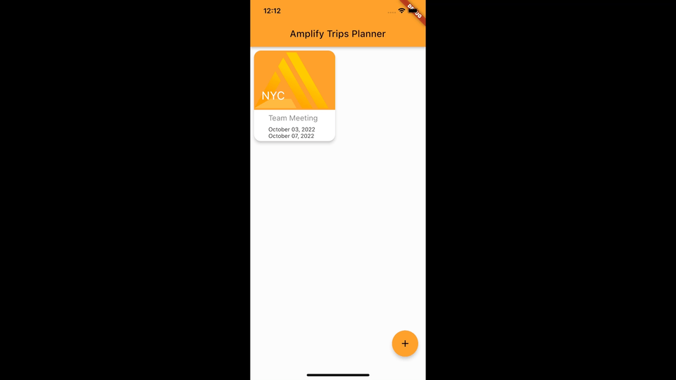

## Conclusion

In this module, you used AWS Amplify to add file storage to your app using Amazon S3 so that users can upload images and view them in their app.

## Congratulations!

Congratulations! You have created a cross-platform Flutter mobile app using AWS Amplify! You have added authentication to your app, allowing users to sign up, sign in, and manage their account. The app also has a scalable GraphQL API configured with an DynamoDB database, allowing users to create, read, update, and delete trips. You have also added cloud storage using Amazon S3 so that users can upload images and view them in their app.

## Clean up resources

Now that you’ve finished this walk-through, you can delete the backend resources to avoid incurring unexpected costs by running the command below in the root folder of the app.

```
amplify delete
```
