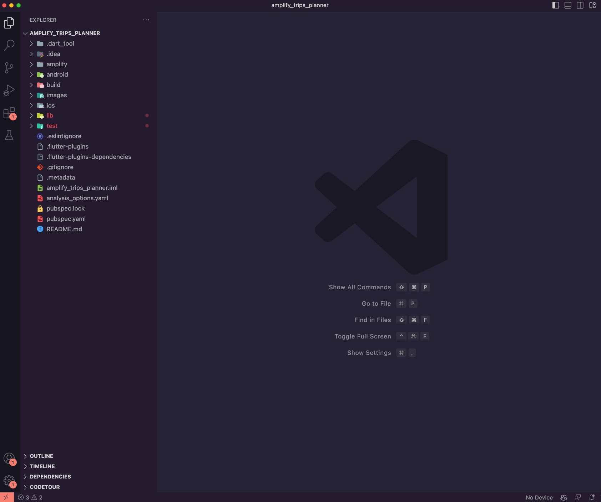
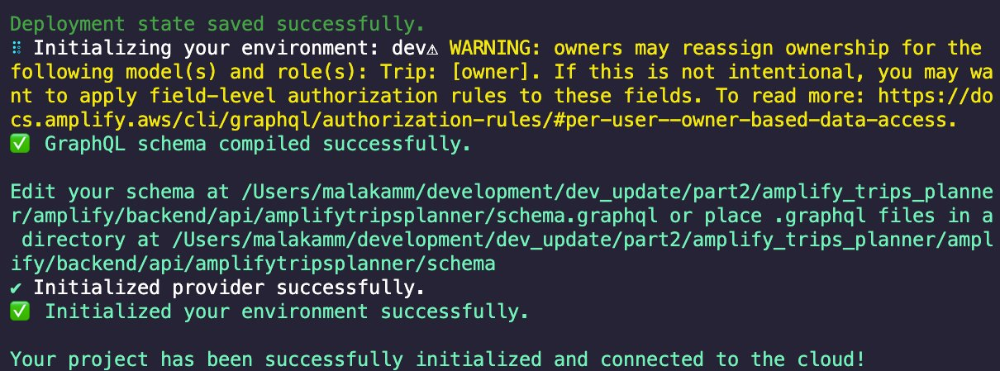
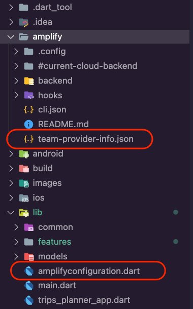
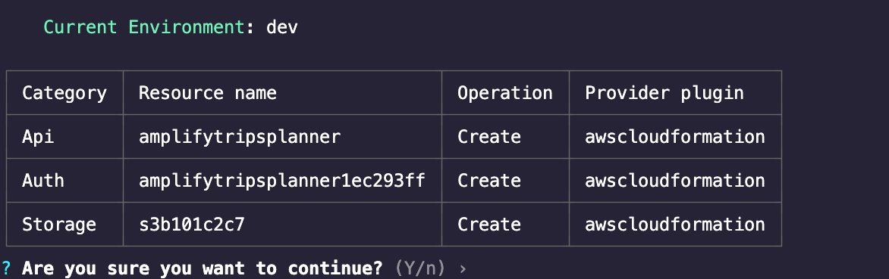
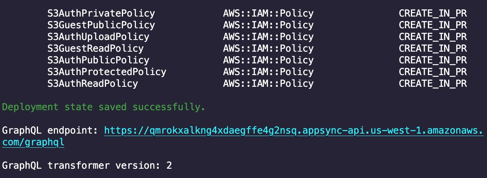
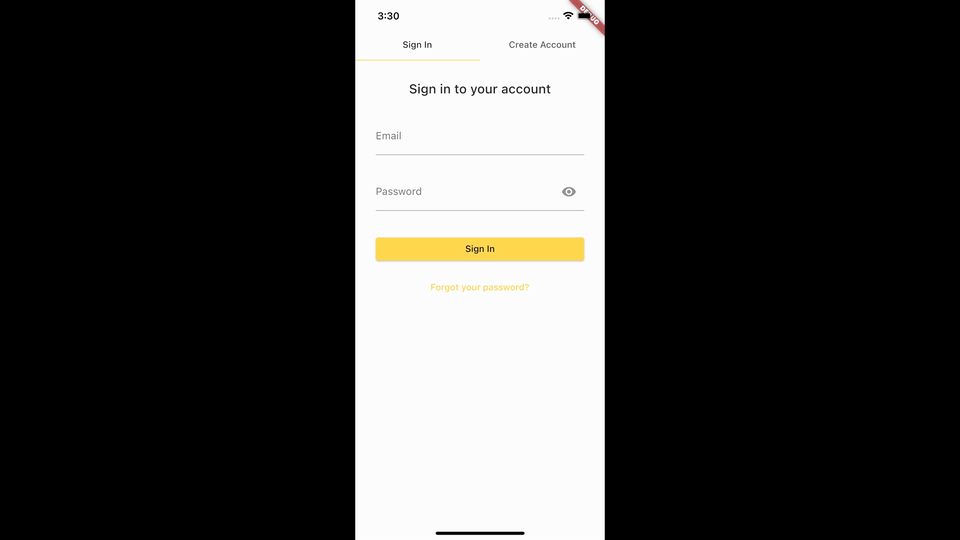

# Module 1: Clone the Flutter app

## Overview

In this module, we will start by cloning the Flutter app we built in the [first tutorial](../build-flutter-mobile-app-part-one/build-flutter-mobile-app-part-one.md "../build-flutter-mobile-app-part-one/build-flutter-mobile-app-part-one.md") of this series from GitHub. Then we will add additional
dependencies to the app and use the Amplify CLI to provision a cloud backend for the
app. And finally, we will improve the readability and maintainability of the app by
refactoring some of its code.

## What you will accomplish

In this module, you will:

- Clone the Flutter app
- Add additional dependencies to the app
- Create an Amplify backend for the app

## Implementation

|                              |            |
| ---------------------------- | ---------- |
| **Minimum time to complete** | 30 minutes |

1. Clone the Flutter app by running the command below in your terminal.

```
git clone https://github.com/aws-samples/amplify-trips-planner.git
```

2. Open the newly cloned Flutter app using VSCode. You can do that by running the
   commands below in your terminal.

```
cd amplify_trips_planner
code . -r
```



- The app will use additional dependencies for its new functionalities, such as
  uploading and displaying files and creating a timeline for the
  activities. Update the **pubspec.yaml** file in the application root directory to add
  the following packages under dependencies.

```
file_picker: ^5.0.0
timelines: ^0.1.0
url_launcher: ^6.1.5
```

The file **pubspec.yaml** should look like this:

```
name: amplify_trips_planner
description: A new Flutter project.
version: 1.0.0+1

environment:
 sdk: ">=3.0.2 <4.0.0"

dependencies:
 amplify_api: ^1.0.0
 amplify_auth_cognito: ^1.0.0
 amplify_authenticator: ^1.0.0
 amplify_flutter: ^1.0.0
 amplify_storage_s3: ^1.0.0
 cached_network_image: ^3.2.3
 cupertino_icons: ^1.0.5
 flutter:
   sdk: flutter
 flutter_riverpod: ^2.1.3
 go_router: ^7.0.0
 image_picker: ^0.8.0
 intl: ^0.18.0
 path: ^1.8.3
 riverpod_annotation: ^2.0.1
 uuid: ^3.0.7
 file_picker: ^5.0.0
 timelines: ^0.1.0
 url_launcher: ^6.1.5

dev_dependencies:
 amplify_lints: ^3.0.0
 build_runner:
 custom_lint:
 flutter_test:
   sdk: flutter
 riverpod_generator: ^2.1.3
 riverpod_lint: ^1.1.5

flutter:
 uses-material-design: true
 assets:
   - images/amplify.png
```

**Step 2**: Run the following command in your terminal to install the dependencies you added to the **pubspec.yaml** file.

```
flutter pub get
```

1. Navigate to the app's root folder, and provision an Amplify backend for the app by
   running the following command in your terminal.

```
amplify init
```

2. Accept the auto-generated option for the environment name and choose the default editor. In this guide, we are using VSCode. Then select the AWS authentication method; we are using an AWS profile. Finally, choose the profile you want to use.

```
Note: It is recommended to run this command from the root of your app directory
? Enter a name for the environment dev
? Choose your default editor: Visual Studio Code
Using default provider  awscloudformation
? Select the authentication method you want to use: AWS profile

For more information on AWS Profiles, see:
https://docs.aws.amazon.com/cli/latest/userguide/cli-configure-profiles.html

? Please choose the profile you want to use default
```

Press **Enter.** The Amplify CLI will initialize the backend and connect the project to the cloud. Once complete, you will get a confirmation, as shown in the screenshot.



The Amplify CLI will add a new file **team-provider-info.json** to the **amplify** folder, which contains the Amplify backend details. It will also add a new dart file **amplifyconfiguration.dart** to the **lib/** folder. The app will use this file to know how to reach your provisioned backend resources at runtime.

 3. In the previous how-to guide, you added the following categories to the app:

    * **Amplify Auth:** allows users to sign up, sign in, and manage their account
    * **Amplify API:** allows users to create, read, update, and delete trips
    * **Amplify Storage:** allows users to upload and view images in their app

Run the command **amplify push** to create the resources of the above categories in the cloud.

 4. Press **Enter**. The Amplify CLI will deploy the resources and display a confirmation, as shown in the screenshot.

 5. Run the app in an emulator or simulator and try the following:

    * Create a new account
    * Create a new trip
    * Edit the newly created trip
    * Upload an image for the trip
    * Delete the trip

The following is an example using an iPhone simulator.



## Conclusion

You learned how to clone a Flutter app from GitHub in this module. You also learned how to use the Amplify CLI to provision a cloud backend for the app.
