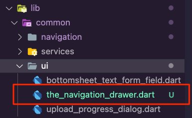
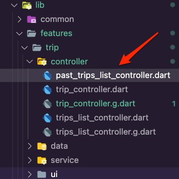
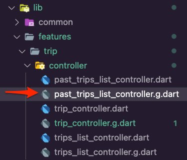
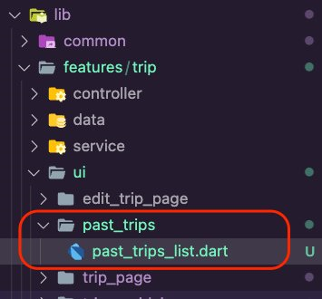
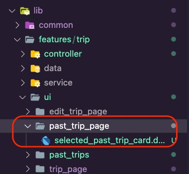
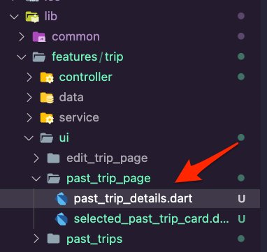
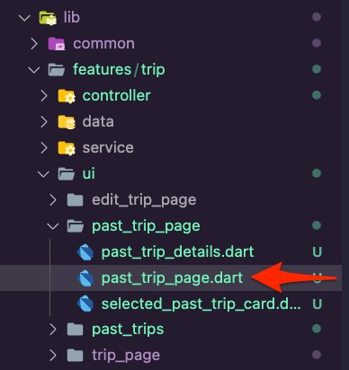
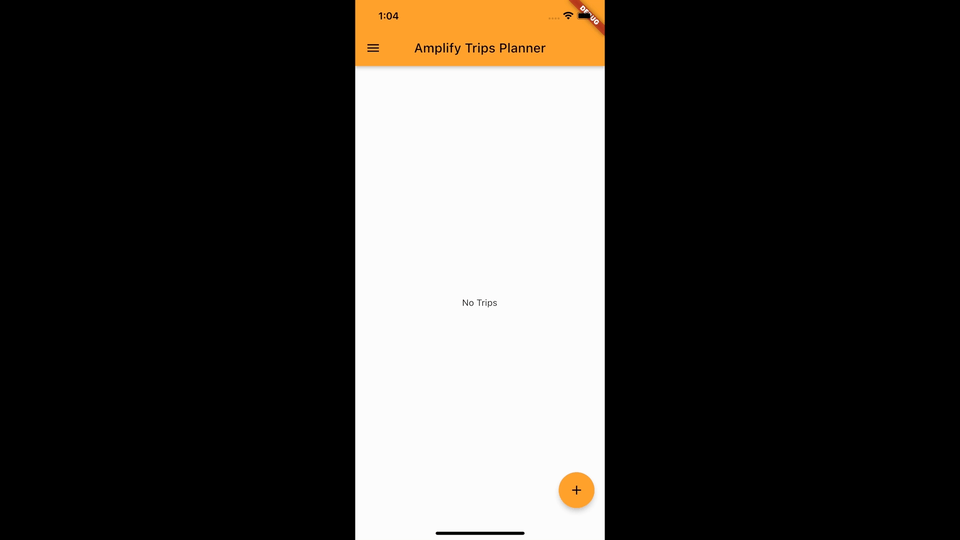

# Module 2: Add the Past Trips feature

## Overview

In this module, you will implement logic and UI to display past trips. You will also add a navigation drawer to the app allowing the users to navigate the different pages you will introduce in this tutorial.

## What you will accomplish

In this module, you will:

- Add a navigation drawer to the app
- Add the trip **TripGridViewItem** widget
- Implement the past trips list page
- Implement the selected past trip details page

## Implementation

|                              |            |
| ---------------------------- | ---------- |
| **Minimum time to complete** | 40 minutes |

1. Open the file **lib/common/navigation/router/routes.dart.** Update it to add **pastTrips** and **pastTrip** enum values. The file **routes.dart** should look like the following:

```
enum AppRoute {
 home,
 trip,
 editTrip,
 pastTrips,
 pastTrip,
}
```

2. Create a new dart file inside the folder **lib/common/ui** and name it the **the_navigation_drawer.dart**.

 3. Open **the_navigation_drawer.dart** file and update it with the following code to create the options to navigate to the trip’s route and the past trip's route.

```
import 'package:amplify_trips_planner/common/navigation/router/routes.dart';
import 'package:amplify_trips_planner/common/utils/colors.dart' as constants;
import 'package:flutter/material.dart';
import 'package:flutter_riverpod/flutter_riverpod.dart';
import 'package:go_router/go_router.dart';

class TheNavigationDrawer extends ConsumerWidget {
 const TheNavigationDrawer({
   super.key,
 });

 @override
 Widget build(BuildContext context, WidgetRef ref) {
   return Drawer(
     child: ListView(
       padding: EdgeInsets.zero,
       children: [
         const DrawerHeader(
           decoration: BoxDecoration(
             color: Color(constants.primaryColorDark),
           ),
           padding: EdgeInsets.all(16),
           child: Column(
             children: [
               SizedBox(height: 10),
               Text(
                 'Amplify Trips Planner',
                 style: TextStyle(fontSize: 22, color: Colors.white),
               ),
             ],
           ),
         ),
         ListTile(
           leading: const Icon(Icons.home),
           title: const Text('Trips'),
           onTap: () {
             context.goNamed(
               AppRoute.home.name,
             );
           },
         ),
         ListTile(
           leading: const Icon(Icons.category),
           title: const Text('Past Trips'),
           onTap: () {
             context.goNamed(
               AppRoute.pastTrips.name,
             );
           },
         ),
       ],
     ),
   );
 }
}
```

4. Open the **lib/features/trip/ui/trips_list/trips_list_page.dart** file and update it
   to add the navigation drawer.

```
drawer: const TheNavigationDrawer(),
```

The **trips_list_page.dart** should look like the
following code snippet.

```
import 'package:amplify_trips_planner/common/ui/the_navigation_drawer.dart';
import 'package:amplify_trips_planner/common/utils/colors.dart' as constants;
import 'package:amplify_trips_planner/features/trip/controller/trips_list_controller.dart';
import 'package:amplify_trips_planner/features/trip/ui/trips_gridview/trips_list_gridview.dart';
import 'package:amplify_trips_planner/features/trip/ui/trips_list/add_trip_bottomsheet.dart';
import 'package:flutter/material.dart';
import 'package:flutter_riverpod/flutter_riverpod.dart';

class TripsListPage extends ConsumerWidget {
const TripsListPage({
super.key,
});

Future<void> showAddTripDialog(BuildContext context) =>
  showModalBottomSheet<void>(
    isScrollControlled: true,
    elevation: 5,
    context: context,
    builder: (sheetContext) {
      return const AddTripBottomSheet();
    },
  );

@override
Widget build(BuildContext context, WidgetRef ref) {
final tripsListValue = ref.watch(tripsListControllerProvider);
return Scaffold(
  appBar: AppBar(
    centerTitle: true,
    title: const Text(
      'Amplify Trips Planner',
    ),
    backgroundColor: const Color(constants.primaryColorDark),
  ),
  drawer: const TheNavigationDrawer(),
  floatingActionButton: FloatingActionButton(
    onPressed: () {
      showAddTripDialog(context);
    },
    backgroundColor: const Color(constants.primaryColorDark),
    child: const Icon(Icons.add),
  ),
  body: TripsListGridView(
    tripsList: tripsListValue,
  ),
);
}
}
```

5. Open the **lib/features/trip/ui/trip_page/trip_page.dart** file and update it to add
   the navigation drawer.

```
drawer: const TheNavigationDrawer(),
```

The **trip_page.dart** should look like the following
code snippet.

```
import 'package:amplify_trips_planner/common/navigation/router/routes.dart';
import 'package:amplify_trips_planner/common/ui/the_navigation_drawer.dart';
import 'package:amplify_trips_planner/common/utils/colors.dart' as constants;
import 'package:amplify_trips_planner/features/trip/controller/trip_controller.dart';
import 'package:amplify_trips_planner/features/trip/ui/trip_page/trip_details.dart';
import 'package:flutter/material.dart';
import 'package:flutter_riverpod/flutter_riverpod.dart';
import 'package:go_router/go_router.dart';

class TripPage extends ConsumerWidget {
const TripPage({
required this.tripId,
super.key,
});
final String tripId;

@override
Widget build(BuildContext context, WidgetRef ref) {
final tripValue = ref.watch(tripControllerProvider(tripId));

return Scaffold(
  appBar: AppBar(
    centerTitle: true,
    title: const Text(
      'Amplify Trips Planner',
    ),
    actions: [
      IconButton(
        onPressed: () {
          context.goNamed(
            AppRoute.home.name,
          );
        },
        icon: const Icon(Icons.home),
      ),
    ],
    backgroundColor: const Color(constants.primaryColorDark),
  ),
  drawer: const TheNavigationDrawer(),
  body: TripDetails(
    tripId: tripId,
    trip: tripValue,
  ),
);
}
}
```

1. The app will highlight past trips by greying out their card widget. To achieve this, you will use a filter to transform the color. Open the**lib/common/utils/colors.dart** file and update it using the following to define a constant of type **List** for the **colorFilter**.

```
const List<double> greyoutMatrix = [
 0.2126,
 0.7152,
 0.0722,
 0,
 0,
 0.2126,
 0.7152,
 0.0722,
 0,
 0,
 0.2126,
 0.7152,
 0.0722,
 0,
 0,
 0,
 0,
 0,
 1,
 0,
];
```

The **colors.dart** should look like the following code snippet.

```
import 'package:flutter/material.dart';
const Map<int, Color> primarySwatch = {
 50: Color.fromRGBO(255, 207, 68, .1),
 100: Color.fromRGBO(255, 207, 68, .2),
 200: Color.fromRGBO(255, 207, 68, .3),
 300: Color.fromRGBO(255, 207, 68, .4),
 400: Color.fromRGBO(255, 207, 68, .5),
 500: Color.fromRGBO(255, 207, 68, .6),
 600: Color.fromRGBO(255, 207, 68, .7),
 700: Color.fromRGBO(255, 207, 68, .8),
 800: Color.fromRGBO(255, 207, 68, .9),
 900: Color.fromRGBO(255, 207, 68, 1),
};
const MaterialColor primaryColor = MaterialColor(0xFFFFCF44, primarySwatch);
const int primaryColorDark = 0xFFFD9725;
const List<double> greyoutMatrix = [
 0.2126,
 0.7152,
 0.0722,
 0,
 0,
 0.2126,
 0.7152,
 0.0722,
 0,
 0,
 0.2126,
 0.7152,
 0.0722,
 0,
 0,
 0,
 0,
 0,
 1,
 0,
];
```

2. Open the **lib/features/trip/ui/trips_gridview/trip_gridview_item.dart** file and
   update it with the following code. The app will use a widget to display the trip card
   in a **GridView**. If the trip is in the past, it will be
   greyed out using a color filter and the constant you created above.

###### Note

VSCode will show an error in the **trips_list_gridview.dart** file about a missing **isPast** parameter for the **TripGridViewItem** widget. You will fix that in the next steps.

```
import 'package:amplify_trips_planner/common/navigation/router/routes.dart';
import 'package:amplify_trips_planner/common/utils/colors.dart' as constants;
import 'package:amplify_trips_planner/features/trip/ui/trips_gridview/trip_gridview_item_card.dart';
import 'package:amplify_trips_planner/models/ModelProvider.dart';
import 'package:flutter/material.dart';
import 'package:go_router/go_router.dart';

class TripGridViewItem extends StatelessWidget {
 const TripGridViewItem({
   required this.trip,
   required this.isPast,
   super.key,
 });

 final Trip trip;
 final bool isPast;

 @override
 Widget build(BuildContext context) {
   return InkWell(
     splashColor: Theme.of(context).primaryColor,
     borderRadius: BorderRadius.circular(15),
     onTap: () {
       context.goNamed(
         isPast ? AppRoute.pastTrip.name : AppRoute.trip.name,
         pathParameters: {'id': trip.id},
         extra: trip,
       );
     },
     child: isPast
         ? ColorFiltered(
             colorFilter: const ColorFilter.matrix(constants.greyoutMatrix),
             child: TripGridViewItemCard(
               trip: trip,
             ),
           )
         : TripGridViewItemCard(
             trip: trip,
           ),
   );
 }
}
```

3. Open the **lib/features/trip/ui/trips_gridview/trips_list_gridview.dart** file and
   update it with the following code.

```
import 'package:amplify_trips_planner/features/trip/ui/trips_gridview/trip_gridview_item.dart';
import 'package:amplify_trips_planner/models/ModelProvider.dart';
import 'package:flutter/material.dart';
import 'package:flutter_riverpod/flutter_riverpod.dart';

class TripsListGridView extends StatelessWidget {
 const TripsListGridView({
   required this.tripsList,
   required this.isPast,
   super.key,
 });

 final AsyncValue<List<Trip>> tripsList;
 final bool isPast;

 @override
 Widget build(BuildContext context) {
   switch (tripsList) {
     case AsyncData(:final value):
       return value.isEmpty
           ? const Center(
               child: Text('No Trips'),
             )
           : OrientationBuilder(
               builder: (context, orientation) {
                 return GridView.count(
                   crossAxisCount:
                       (orientation == Orientation.portrait) ? 2 : 3,
                   mainAxisSpacing: 4,
                   crossAxisSpacing: 4,
                   padding: const EdgeInsets.all(4),
                   childAspectRatio:
                       (orientation == Orientation.portrait) ? 0.9 : 1.4,
                   children: value.map((tripData) {
                     return TripGridViewItem(
                       trip: tripData,
                       isPast: isPast,
                     );
                   }).toList(growable: false),
                 );
               },
             );

     case AsyncError():
       return const Center(
         child: Text('Error'),
       );
     case AsyncLoading():
       return const Center(
         child: CircularProgressIndicator(),
       );

     case _:
       return const Center(
         child: Text('Error'),
       );
   }
 }
}
```

4. Open the **lib/features/trip/ui/trips_list/trips_list_page.dart** file and update it
   to set the **isPast** parameter.

```
import 'package:amplify_trips_planner/common/ui/the_navigation_drawer.dart';
import 'package:amplify_trips_planner/common/utils/colors.dart' as constants;
import 'package:amplify_trips_planner/features/trip/controller/trips_list_controller.dart';
import 'package:amplify_trips_planner/features/trip/ui/trips_gridview/trips_list_gridview.dart';
import 'package:amplify_trips_planner/features/trip/ui/trips_list/add_trip_bottomsheet.dart';
import 'package:flutter/material.dart';
import 'package:flutter_riverpod/flutter_riverpod.dart';

class TripsListPage extends ConsumerWidget {
 const TripsListPage({
   super.key,
 });

 Future<void> showAddTripDialog(BuildContext context) =>
     showModalBottomSheet<void>(
       isScrollControlled: true,
       elevation: 5,
       context: context,
       builder: (sheetContext) {
         return const AddTripBottomSheet();
       },
     );

 @override
 Widget build(BuildContext context, WidgetRef ref) {
   final tripsListValue = ref.watch(tripsListControllerProvider);
   return Scaffold(
     appBar: AppBar(
       centerTitle: true,
       title: const Text(
         'Amplify Trips Planner',
       ),
       backgroundColor: const Color(constants.primaryColorDark),
     ),
     drawer: const TheNavigationDrawer(),
     floatingActionButton: FloatingActionButton(
       onPressed: () {
         showAddTripDialog(context);
       },
       backgroundColor: const Color(constants.primaryColorDark),
       child: const Icon(Icons.add),
     ),
     body: TripsListGridView(
       tripsList: tripsListValue,
       isPast: false,
     ),
   );
 }
}
```

1. Create a new dart file inside the **lib/feature/trip/controller** folder and name it **past_trips_list_controller.dart**.

 2. Open the **past_trips_list_controller.dart** file and
update it with the following code. The UI will use the controller to get the user’s
past trips using the **tripsRepository.getPastTrips()**function.

###### Note

VSCode will show errors due to the missing **past_trips_list_controller.g.dart** file. You will fix that in the next
step.

```
import 'dart:async';

import 'package:amplify_trips_planner/features/trip/data/trips_repository.dart';
import 'package:amplify_trips_planner/models/ModelProvider.dart';
import 'package:riverpod_annotation/riverpod_annotation.dart';

part 'past_trips_list_controller.g.dart';

@riverpod
class PastTripsListController extends _$PastTripsListController {
Future<List<Trip>> _fetchTrips() async {
final tripsRepository = ref.read(tripsRepositoryProvider);
final trips = await tripsRepository.getPastTrips();
return trips;
}

@override
FutureOr<List<Trip>> build() async {
return _fetchTrips();
}
}
```

3. Navigate to the app's root folder and run the following command in your
   terminal.

```
dart run build_runner build -d
```

This will generate the **past_trips_list_controller.g.dart** file in the**lib/feature/trip/controller**folder.

 4. Create a new folder in the **lib/features/trip/ui**
folder, name it **past_trips**, and then create the file
**past_trips_list.dart** inside it.

 5. Open the **past_trips_list.dart** file and update it
with the following code to create a **GridView** for
displaying the past trips.

```
import 'package:amplify_trips_planner/common/ui/the_navigation_drawer.dart';
import 'package:amplify_trips_planner/common/utils/colors.dart' as constants;
import 'package:amplify_trips_planner/features/trip/controller/past_trips_list_controller.dart';
import 'package:amplify_trips_planner/features/trip/ui/trips_gridview/trips_list_gridview.dart';
import 'package:flutter/material.dart';
import 'package:flutter_riverpod/flutter_riverpod.dart';

class PastTripsList extends ConsumerWidget {
const PastTripsList({
super.key,
});

@override
Widget build(BuildContext context, WidgetRef ref) {
final tripsListValue = ref.watch(pastTripsListControllerProvider);

return Scaffold(
  appBar: AppBar(
    centerTitle: true,
    title: const Text(
      'Amplify Trips Planner',
    ),
    backgroundColor: const Color(constants.primaryColorDark),
  ),
  drawer: const TheNavigationDrawer(),
  body: TripsListGridView(
    tripsList: tripsListValue,
    isPast: true,
  ),
);
}
}
```

6. Open the **lib/common/navigation/router/router.dart** file and update it to add
   the **PastTripsList** route.

```
    GoRoute(
      path: '/pasttrips',
      name: AppRoute.pastTrips.name,
      builder: (context, state) => const PastTripsList(),
    ),
```

The **router.dart** file should look like the
following code snippet.

```
import 'package:amplify_trips_planner/common/navigation/router/routes.dart';
import 'package:amplify_trips_planner/features/trip/ui/edit_trip_page/edit_trip_page.dart';
import 'package:amplify_trips_planner/features/trip/ui/past_trips/past_trips_list.dart';
import 'package:amplify_trips_planner/features/trip/ui/trip_page/trip_page.dart';
import 'package:amplify_trips_planner/features/trip/ui/trips_list/trips_list_page.dart';
import 'package:amplify_trips_planner/models/ModelProvider.dart';
import 'package:flutter/material.dart';
import 'package:go_router/go_router.dart';

final router = GoRouter(
  routes: [
    GoRoute(
      path: '/',
      name: AppRoute.home.name,
      builder: (context, state) => const TripsListPage(),
    ),
    GoRoute(
      path: '/trip/:id',
      name: AppRoute.trip.name,
      builder: (context, state) {
        final tripId = state.pathParameters['id']!;
        return TripPage(tripId: tripId);
      },
    ),
    GoRoute(
      path: '/edittrip/:id',
      name: AppRoute.editTrip.name,
      builder: (context, state) {
        return EditTripPage(
          trip: state.extra! as Trip,
        );
      },
    ),
    GoRoute(
      path: '/pasttrips',
      name: AppRoute.pastTrips.name,
      builder: (context, state) => const PastTripsList(),
    ),
  ],
  errorBuilder: (context, state) => Scaffold(
    body: Center(
      child: Text(state.error.toString()),
    ),
  ),
);
```

1. Create a new folder inside the **lib/features/trip/ui** folder, name it **past_trip_page**, and  then create the file **selected_past_trip_card.dart** inside it.

 2. Open the **selected_past_trip_card.dart** file and update it with the following code. Here we check if there is an image for the past trip and display it in a card widget. We use the placeholder image from the app assets if there is no image.

```
import 'package:amplify_trips_planner/common/utils/colors.dart' as constants;
import 'package:amplify_trips_planner/models/ModelProvider.dart';
import 'package:cached_network_image/cached_network_image.dart';
import 'package:flutter/material.dart';

class SelectedPastTripCard extends StatelessWidget {
 const SelectedPastTripCard({
   required this.trip,
   super.key,
 });

 final Trip trip;

 @override
 Widget build(BuildContext context) {
   return Card(
     clipBehavior: Clip.antiAlias,
     shape: RoundedRectangleBorder(
       borderRadius: BorderRadius.circular(15),
     ),
     elevation: 5,
     child: Column(
       mainAxisSize: MainAxisSize.min,
       children: [
         Text(
           trip.tripName,
           textAlign: TextAlign.center,
           style: const TextStyle(
             fontSize: 20,
             fontWeight: FontWeight.bold,
           ),
         ),
         const SizedBox(
           height: 8,
         ),
         Container(
           alignment: Alignment.center,
           color: const Color(constants.primaryColorDark),
           height: 150,
           child: trip.tripImageUrl != null
               ? Stack(
                   children: [
                     const Center(child: CircularProgressIndicator()),
                     CachedNetworkImage(
                       imageUrl: trip.tripImageUrl!,
                       cacheKey: trip.tripImageKey,
                       width: double.maxFinite,
                       height: 500,
                       alignment: Alignment.topCenter,
                       fit: BoxFit.fill,
                     ),
                   ],
                 )
               : Image.asset(
                   'images/amplify.png',
                   fit: BoxFit.contain,
                 ),
         ),
       ],
     ),
   );
 }
}
```

3. Create a new dart file inside the **lib/features/trip/ui/past_trip_page** folder and call it **past_trip_details.dart**.

 4. Open the **past_trip_details.dart** file and update it with the following code to create the **PastTripDetails**, which will use the **SelectedPastTripCard** you created above to display the data.

```
import 'package:amplify_trips_planner/features/trip/ui/past_trip_page/selected_past_trip_card.dart';
import 'package:amplify_trips_planner/models/ModelProvider.dart';
import 'package:flutter/material.dart';
import 'package:flutter_riverpod/flutter_riverpod.dart';

class PastTripDetails extends ConsumerWidget {
 const PastTripDetails({
   required this.trip,
   super.key,
 });

 final AsyncValue<Trip> trip;

 @override
 Widget build(BuildContext context, WidgetRef ref) {
   switch (trip) {
     case AsyncData(:final value):
       return Column(
         crossAxisAlignment: CrossAxisAlignment.stretch,
         children: [
           const SizedBox(
             height: 8,
           ),
           SelectedPastTripCard(trip: value),
           const SizedBox(
             height: 20,
           ),
           const Divider(
             height: 20,
             thickness: 5,
             indent: 20,
             endIndent: 20,
           ),
           const Text(
             'Your Activities',
             textAlign: TextAlign.center,
             style: TextStyle(
               fontSize: 20,
               fontWeight: FontWeight.bold,
             ),
           ),
           const SizedBox(
             height: 8,
           ),
         ],
       );

     case AsyncError():
       return const Center(
         child: Text('Error'),
       );
     case AsyncLoading():
       return const Center(
         child: CircularProgressIndicator(),
       );

     case _:
       return const Center(
         child: Text('Error'),
       );
   }
 }
}
```

5. Create a new dart file inside the **lib/features/trip/ui/past_trip_page** folder and name it **past_trip_page.dart**.

 6. Open the **past_trip_page.dart** file and update it
with the following code to create the **PastTripPage**,
which will get the past trip details using the **tripId**. The **PastTripPage** will grey out
and use the **PastTripDetails** you created above to
display the data.

```
import 'package:amplify_trips_planner/common/navigation/router/routes.dart';
import 'package:amplify_trips_planner/common/ui/the_navigation_drawer.dart';
import 'package:amplify_trips_planner/common/utils/colors.dart' as constants;
import 'package:amplify_trips_planner/features/trip/controller/trip_controller.dart';
import 'package:amplify_trips_planner/features/trip/ui/past_trip_page/past_trip_details.dart';
import 'package:flutter/material.dart';
import 'package:flutter_riverpod/flutter_riverpod.dart';
import 'package:go_router/go_router.dart';

class PastTripPage extends ConsumerWidget {
  const PastTripPage({
    required this.tripId,
    super.key,
  });
  final String tripId;

  @override
  Widget build(BuildContext context, WidgetRef ref) {
    final tripValue = ref.watch(tripControllerProvider(tripId));
    return Scaffold(
      appBar: AppBar(
        centerTitle: true,
        title: const Text(
          'Amplify Trips Planner',
        ),
        actions: [
          IconButton(
            onPressed: () {
              context.goNamed(
                AppRoute.home.name,
              );
            },
            icon: const Icon(Icons.home),
          ),
        ],
        backgroundColor: const Color(constants.primaryColorDark),
      ),
      drawer: const TheNavigationDrawer(),
      body: ColorFiltered(
        colorFilter: const ColorFilter.matrix(constants.greyoutMatrix),
        child: PastTripDetails(
          trip: tripValue,
        ),
      ),
    );
  }
}
```

7. Open the **/lib/common/navigation/router/router.dart** file and update it to add
   the **PastTripPage** route.

```
GoRoute(
  path: '/pasttrip/:id',
  name: AppRoute.pastTrip.name,
  builder: (context, state) {
    final tripId = state.pathParameters['id']!;
    return PastTripPage(tripId: tripId);
  },
),
```

The **router.dart** should look like the following
code snippet.

```
import 'package:amplify_trips_planner/common/navigation/router/routes.dart';
import 'package:amplify_trips_planner/features/trip/ui/edit_trip_page/edit_trip_page.dart';
import 'package:amplify_trips_planner/features/trip/ui/past_trip_page/past_trip_page.dart';
import 'package:amplify_trips_planner/features/trip/ui/past_trips/past_trips_list.dart';
import 'package:amplify_trips_planner/features/trip/ui/trip_page/trip_page.dart';
import 'package:amplify_trips_planner/features/trip/ui/trips_list/trips_list_page.dart';
import 'package:amplify_trips_planner/models/ModelProvider.dart';
import 'package:flutter/material.dart';
import 'package:go_router/go_router.dart';

final router = GoRouter(
  routes: [
    GoRoute(
      path: '/',
      name: AppRoute.home.name,
      builder: (context, state) => const TripsListPage(),
    ),
    GoRoute(
      path: '/trip/:id',
      name: AppRoute.trip.name,
      builder: (context, state) {
        final tripId = state.pathParameters['id']!;
        return TripPage(tripId: tripId);
      },
    ),
    GoRoute(
      path: '/edittrip/:id',
      name: AppRoute.editTrip.name,
      builder: (context, state) {
        return EditTripPage(
          trip: state.extra! as Trip,
        );
      },
    ),
    GoRoute(
      path: '/pasttrip/:id',
      name: AppRoute.pastTrip.name,
      builder: (context, state) {
        final tripId = state.pathParameters['id']!;
        return PastTripPage(tripId: tripId);
      },
    ),
    GoRoute(
      path: '/pasttrips',
      name: AppRoute.pastTrips.name,
      builder: (context, state) => const PastTripsList(),
    ),
  ],
  errorBuilder: (context, state) => Scaffold(
    body: Center(
      child: Text(state.error.toString()),
    ),
  ),
);
```

8. Run the app in an emulator or simulator and create a trip. Set its start and end date in the past. The following is an example using an iPhone simulator.



## Conclusion

In this module, you implemented the UI to display the user’s past trips. In the next module, we will add the trip’s Activity feature to your app.
