# Module 3: Add the Activity feature

## Overview

In this module, you will update the Amplify API to retrieve and persist your trip’s activities data. The API is a GraphQL API that uses AWS AppSync (a managed GraphQL service) backed by DynamoDB (a NoSQL database).

## What you will accomplish

In this module, you will:

- Add the activity data model to the app
- Implement the create, read, update, and delete (CRUD) operations and flow for the activity feature
- Implement the activities listing UI
- Add the Activity Details page to the app

## Implementation

|                              |            |
| ---------------------------- | ---------- |
| **Minimum time to complete** | 45 minutes |

1. Open the **amplify/backend/api/amplifytripsplanner/schema.graphql** file and update
   it as follows:
   - Create a data model for the activity
   - Introduce an enum for the activity’s categories
   - Update the Trip model to set up a 1:n relation with the Activity

```
type Trip @model @auth(rules: [{ allow: owner }]) {
  id: ID!
  tripName: String!
  destination: String!
  startDate: AWSDate!
  endDate: AWSDate!
  tripImageUrl: String
  tripImageKey: String
  Activities: [Activity] @hasMany(indexName: "byTrip", fields: ["id"])
}

type Activity @model @auth(rules: [{allow: owner}]) {
  id: ID!
  activityName: String!
  tripID: ID! @index(name: "byTrip", sortKeyFields: ["activityName"])
  trip: Trip! @belongsTo(fields: ["tripID"])
  activityImageUrl: String
  activityImageKey: String
  activityDate: AWSDate!
  activityTime: AWSTime
  category: ActivityCategory!
}

enum ActivityCategory { Flight, Lodging, Meeting, Restaurant }
```

2. Run the following command in the root folder of the app to generate the models files.

```
amplify codegen models
```

The Amplify CLI will generate the dart files in the **lib/models** folder.

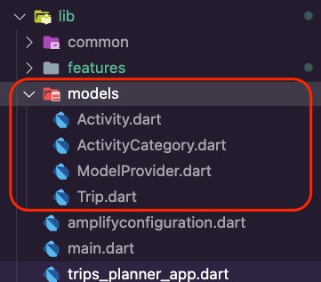 3. Run the command **amplify push** to create the resources
in the cloud.

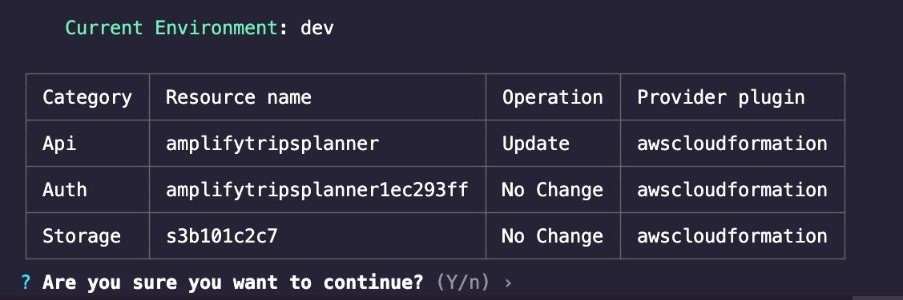 4. Press **Enter**. The Amplify CLI will deploy the resources and display a confirmation, as shown in the screenshot.

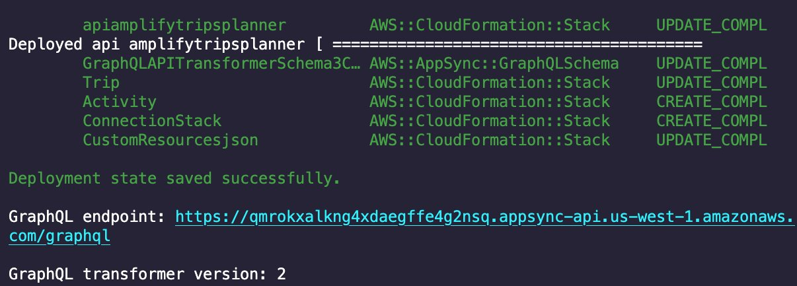

1. Create a new folder inside **lib/features** and name it
   **activity**.

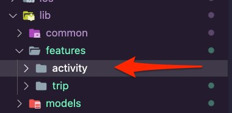 2. Create the following new folders inside the **activity** folder:

    * **service:** The layer to connect with the Amplify backend.
    * **data:** This will be the repository layer that abstracts away the networking code, specifically **service** .
    * **controller:** This is the domain layer to connect the UI with the repository.
    * **ui:** Here, we will create the widgets and the pages that the app will present to the user.

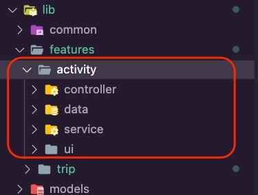 3. Open the **lib/common/navigation/router/routes.dart** file. Update it to add the enum values for the activity feature. The **routes.dart** file should look like this:

```
enum AppRoute {
 home,
 trip,
 editTrip,
 pastTrips,
 pastTrip,
 activity,
 addActivity,
 editActivity,
}
```

1. Create a new dart file inside the **lib/features/activity/service** folder and call it **activities_api_service.dart**.

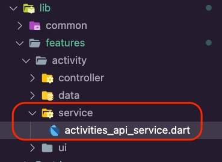 2. Open the **activities_api_service.dart** file and
update it with the following code snippet to create the **ActivitiesAPIService**, which contains the following functions:

    * **getActivitiesForTrip:** Queries the Amplify
     API for the activities of a specific trip and returns a list of the
     activities.
    * **getActivity:** Queries the Amplify API for a
     specific activity and returns its details.
    * **getActivity, deleteActivity,** and **updateActivity:** Add, delete, or update the activities in
     the Amplify API.

```
import 'dart:async';

import 'package:amplify_api/amplify_api.dart';
import 'package:amplify_flutter/amplify_flutter.dart';
import 'package:amplify_trips_planner/models/ModelProvider.dart';
import 'package:flutter_riverpod/flutter_riverpod.dart';

final activitiesAPIServiceProvider = Provider<ActivitiesAPIService>((ref) {
  final service = ActivitiesAPIService();
  return service;
});

class ActivitiesAPIService {
  ActivitiesAPIService();

  Future<List<Activity>> getActivitiesForTrip(String tripId) async {
    try {
      final request = ModelQueries.list(
        Activity.classType,
        where: Activity.TRIP.eq(tripId),
      );

      final response = await Amplify.API.query(request: request).response;

      final activites = response.data?.items;
      if (activites == null) {
        safePrint('errors: ${response.errors}');
        return const [];
      }
      activites.sort(
        (a, b) => a!.activityDate
            .getDateTime()
            .compareTo(b!.activityDate.getDateTime()),
      );
      return activites.map((e) => e as Activity).toList();
    } on Exception catch (error) {
      safePrint('getActivitiesForTrip failed: $error');
      return const [];
    }
  }

  Future<void> addActivity(Activity activity) async {
    try {
      final request = ModelMutations.create(activity);
      final response = await Amplify.API.mutate(request: request).response;

      final createdActivity = response.data;
      if (createdActivity == null) {
        safePrint('errors: ${response.errors}');
        return;
      }
    } on Exception catch (error) {
      safePrint('addActivity failed: $error');
    }
  }

  Future<void> deleteActivity(Activity activity) async {
    try {
      await Amplify.API
          .mutate(
            request: ModelMutations.delete(activity),
          )
          .response;
    } on Exception catch (error) {
      safePrint('deleteActivity failed: $error');
    }
  }

  Future<void> updateActivity(Activity updatedActivity) async {
    try {
      await Amplify.API
          .mutate(
            request: ModelMutations.update(updatedActivity),
          )
          .response;
    } on Exception catch (error) {
      safePrint('updateActivity failed: $error');
    }
  }

  Future<Activity> getActivity(String activityId) async {
    try {
      final request = ModelQueries.get(
        Activity.classType,
        ActivityModelIdentifier(id: activityId),
      );
      final response = await Amplify.API.query(request: request).response;

      final activity = response.data!;
      return activity;
    } on Exception catch (error) {
      safePrint('getActivity failed: $error');
      rethrow;
    }
  }
}
```

3. Create a new dart file in the **lib/features/activity/data** folder and name it  **activities_repository.dart**.

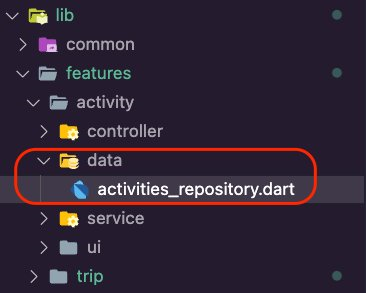 4. Open the **activities_repository.dart** file and update it with the following code:

```
import 'package:amplify_trips_planner/features/activity/service/activities_api_service.dart';
import 'package:amplify_trips_planner/models/ModelProvider.dart';
import 'package:flutter_riverpod/flutter_riverpod.dart';

final activitiesRepositoryProvider = Provider<ActivitiesRepository>((ref) {
 final activitiesAPIService = ref.read(activitiesAPIServiceProvider);
 return ActivitiesRepository(activitiesAPIService);
});

class ActivitiesRepository {
 ActivitiesRepository(
   this.activitiesAPIService,
 );

 final ActivitiesAPIService activitiesAPIService;

 Future<List<Activity>> getActivitiesForTrip(String tripId) {
   return activitiesAPIService.getActivitiesForTrip(tripId);
 }

 Future<Activity> getActivity(String activityId) {
   return activitiesAPIService.getActivity(activityId);
 }

 Future<void> add(Activity activity) async {
   return activitiesAPIService.addActivity(activity);
 }

 Future<void> delete(Activity activity) async {
   return activitiesAPIService.deleteActivity(activity);
 }

 Future<void> update(Activity activity) async {
   return activitiesAPIService.updateActivity(activity);
 }
}
```

1. Create a new dart file inside the **lib/features/activity/controller** folder and name it **activities_list_controller.dart.**

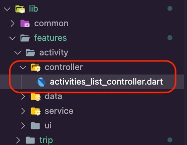 2. Open the **activities_list_controller.dart** file and update it with the following code. The UI will use the controller to get the activities for a trip, add a new activity, and delete an activity.

###### Note

VSCode will show errors due to the missing **activities_list_controller.g.dart** file. You will fix that in the next
step.

```
import 'dart:async';

import 'package:amplify_flutter/amplify_flutter.dart';
import 'package:amplify_trips_planner/common/utils/date_time_formatter.dart';
import 'package:amplify_trips_planner/features/activity/data/activities_repository.dart';
import 'package:amplify_trips_planner/models/ModelProvider.dart';
import 'package:flutter/material.dart';
import 'package:riverpod_annotation/riverpod_annotation.dart';

part 'activities_list_controller.g.dart';

@riverpod
class ActivitiesListController extends _$ActivitiesListController {
 Future<List<Activity>> _fetchActivities(String tripId) async {
   final activitiesRepository = ref.read(activitiesRepositoryProvider);
   final activities = await activitiesRepository.getActivitiesForTrip(tripId);
   return activities;
 }

 @override
 FutureOr<List<Activity>> build(String tripId) async {
   return _fetchActivities(tripId);
 }

 Future<void> removeActivity(Activity activity) async {
   state = const AsyncValue.loading();
   state = await AsyncValue.guard(() async {
     final activitiesRepository = ref.read(activitiesRepositoryProvider);
     await activitiesRepository.delete(activity);

     return _fetchActivities(activity.trip.id);
   });
 }

 Future<void> add({
   required String name,
   required String activityDate,
   required TimeOfDay activityTime,
   required ActivityCategory category,
   required Trip trip,
 }) async {
   final now = DateTime.now();
   final time = DateTime(
     now.year,
     now.month,
     now.day,
     activityTime.hour,
     activityTime.minute,
   );

   final activity = Activity(
     activityName: name,
     activityDate: TemporalDate(DateTime.parse(activityDate)),
     activityTime: TemporalTime.fromString(time.format('HH:mm:ss.sss')),
     trip: trip,
     category: category,
   );
   state = const AsyncValue.loading();
   state = await AsyncValue.guard(() async {
     final activitiesRepository = ref.read(activitiesRepositoryProvider);

     await activitiesRepository.add(activity);

     return _fetchActivities(trip.id);
   });
 }
}
```

3. Navigate to the app's root folder and run the following command in your terminal.

```
dart run build_runner build -d
```

This will generate the **activities_list.g.dart** file inside the **lib/feature/activity/controller** folder.

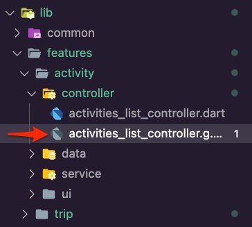 4. Create a new dart file in the **lib/features/activity/ui** folder and name it **activity_category_icon.dart**.

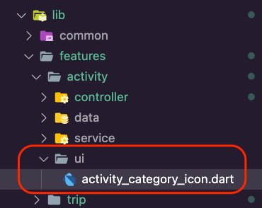 5. Open the **activity_category_icon.dart** file and
update it with the following code. This will allow the app to display an icon
representing the activity’s category.

```
import 'package:amplify_trips_planner/common/utils/colors.dart' as constants;
import 'package:amplify_trips_planner/models/ModelProvider.dart';
import 'package:flutter/material.dart';

class ActivityCategoryIcon extends StatelessWidget {
  const ActivityCategoryIcon({
    required this.activityCategory,
    super.key,
  });
  final ActivityCategory activityCategory;

  @override
  Widget build(BuildContext context) {
    switch (activityCategory) {
      case ActivityCategory.Flight:
        return const Icon(
          Icons.flight,
          size: 50,
          color: Color(constants.primaryColorDark),
        );

      case ActivityCategory.Lodging:
        return const Icon(
          Icons.hotel,
          size: 50,
          color: Color(constants.primaryColorDark),
        );
      case ActivityCategory.Meeting:
        return const Icon(
          Icons.computer,
          size: 50,
          color: Color(constants.primaryColorDark),
        );
      case ActivityCategory.Restaurant:
        return const Icon(
          Icons.restaurant,
          size: 50,
          color: Color(constants.primaryColorDark),
        );
      default:
        ActivityCategory.Flight;
    }
    return const Icon(
      Icons.flight,
      size: 50,
      color: Color(constants.primaryColorDark),
    );
  }
}
```

6. Create a new folder inside the **lib/features/activity/ui
   folder**, name it **activities_list**, and
   then create the file **activities_timeline.dart** inside
   it.

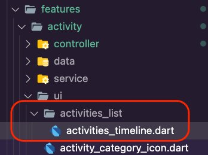 7. Open the **activities_timeline.dart** file and update
it with the following code. This will display a timeline of the trip’s
activities.

```
import 'package:amplify_trips_planner/common/navigation/router/routes.dart';
import 'package:amplify_trips_planner/common/utils/date_time_formatter.dart';
import 'package:amplify_trips_planner/features/activity/ui/activity_category_icon.dart';
import 'package:amplify_trips_planner/models/ModelProvider.dart';
import 'package:flutter/material.dart';
import 'package:go_router/go_router.dart';
import 'package:timelines/timelines.dart';

class ActivitiesTimeline extends StatelessWidget {
  const ActivitiesTimeline({
    super.key,
    required this.activities,
  });

  final List<Activity> activities;

  @override
  Widget build(BuildContext context) {
    return Column(
      children: [
        Flexible(
          child: Timeline.tileBuilder(
            builder: TimelineTileBuilder.fromStyle(
              oppositeContentsBuilder: (context, index) {
                return InkWell(
                  onTap: () => context.goNamed(
                    AppRoute.activity.name,
                    pathParameters: {'id': activities[index].id},
                  ),
                  child: Padding(
                    padding: const EdgeInsets.only(bottom: 15),
                    child: ActivityCategoryIcon(
                      activityCategory: activities[index].category,
                    ),
                  ),
                );
              },
              contentsAlign: ContentsAlign.alternating,
              contentsBuilder: (context, index) => InkWell(
                onTap: () => context.goNamed(
                  AppRoute.activity.name,
                  pathParameters: {'id': activities[index].id},
                ),
                child: Padding(
                  padding: const EdgeInsets.all(24),
                  child: Column(
                    children: [
                      Text(
                        activities[index].activityName,
                        style: Theme.of(context).textTheme.titleMedium,
                        textAlign: TextAlign.center,
                      ),
                      const SizedBox(
                        height: 5,
                      ),
                      Text(
                        activities[index]
                            .activityDate
                            .getDateTime()
                            .format('yyyy-MM-dd'),
                        style: Theme.of(context).textTheme.bodySmall,
                      ),
                      Text(
                        activities[index]
                            .activityTime!
                            .getDateTime()
                            .format('hh:mm a'),
                        style: Theme.of(context).textTheme.bodySmall,
                      ),
                    ],
                  ),
                ),
              ),
              itemCount: activities.length,
            ),
          ),
        ),
      ],
    );
  }
}
```

8. Create the file **activities_list.dart** inside the
   **lib/features/activity/ui/activities_list**
   folder.

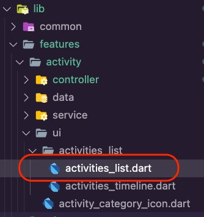 9. Open the **activities_list.dart** file and update it
with the following code to use the **ActivitiesTimeline**
widget you created previously to display a timeline of the trip’s activities.

```
import 'package:amplify_trips_planner/features/activity/controller/activities_list_controller.dart';
import 'package:amplify_trips_planner/features/activity/ui/activities_list/activities_timeline.dart';
import 'package:amplify_trips_planner/models/ModelProvider.dart';
import 'package:flutter/material.dart';
import 'package:flutter_riverpod/flutter_riverpod.dart';

class ActivitiesList extends ConsumerWidget {
  const ActivitiesList({
    required this.trip,
    super.key,
  });
  final Trip trip;

  @override
  Widget build(BuildContext context, WidgetRef ref) {
    final activitiesListValue = ref.watch(activitiesListControllerProvider(trip.id));
    switch (activitiesListValue) {
      case AsyncData(:final value):
        return value.isEmpty
            ? const Center(
                child: Text('No Activities'),
              )
            : ActivitiesTimeline(activities: value);

      case AsyncError():
        return const Center(
          child: Text('Error'),
        );
      case AsyncLoading():
        return const Center(
          child: CircularProgressIndicator(),
        );

      case _:
        return const Center(
          child: Text('Error'),
        );
    }
  }
}
```

1. Create a new folder inside the **lib/features/activity/ui** folder, name it **add_activity**, and then create the file **add_activity_form.dart** inside it.

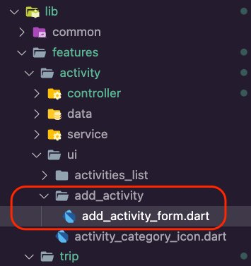 2. Open the **add_activity_form.dart** file and update
it with the following code. This will allow us to present a form to the user to submit
the required details to create a new activity for the selected trip.

```
import 'package:amplify_trips_planner/common/navigation/router/routes.dart';
import 'package:amplify_trips_planner/common/ui/bottomsheet_text_form_field.dart';
import 'package:amplify_trips_planner/common/utils/date_time_formatter.dart';
import 'package:amplify_trips_planner/features/activity/controller/activities_list_controller.dart';
import 'package:amplify_trips_planner/models/ModelProvider.dart';
import 'package:flutter/material.dart';
import 'package:flutter_riverpod/flutter_riverpod.dart';
import 'package:go_router/go_router.dart';

class AddActivityForm extends ConsumerStatefulWidget {
const AddActivityForm({
required this.trip,
super.key,
});

final AsyncValue<Trip> trip;

@override
AddActivityFormState createState() => AddActivityFormState();
}

class AddActivityFormState extends ConsumerState<AddActivityForm> {
final formGlobalKey = GlobalKey<FormState>();

final activityNameController = TextEditingController();
final activityDateController = TextEditingController();
final activityTimeController = TextEditingController();
var activityCategory = ActivityCategory.Flight;
var activityTime = TimeOfDay.now();

@override
Widget build(BuildContext context) {
final activityNameController = TextEditingController();
final activityDateController = TextEditingController();
final activityTimeController = TextEditingController();
var activityCategory = ActivityCategory.Flight;
var activityTime = TimeOfDay.now();
switch (widget.trip) {
  case AsyncData(:final value):
    return SingleChildScrollView(
      child: Form(
        key: formGlobalKey,
        child: Container(
          padding: EdgeInsets.only(
            top: 15,
            left: 15,
            right: 15,
            bottom: MediaQuery.of(context).viewInsets.bottom + 15,
          ),
          width: double.infinity,
          child: Column(
            mainAxisSize: MainAxisSize.min,
            crossAxisAlignment: CrossAxisAlignment.start,
            children: [
              BottomSheetTextFormField(
                labelText: 'Activity Name',
                controller: activityNameController,
                keyboardType: TextInputType.name,
              ),
              const SizedBox(
                height: 20,
              ),
              DropdownButtonFormField<ActivityCategory>(
                onChanged: (value) {
                  activityCategory = value!;
                },
                value: activityCategory,
                decoration: const InputDecoration(
                  labelText: 'Category',
                ),
                items: [
                  for (var category in ActivityCategory.values)
                    DropdownMenuItem(
                      value: category,
                      child: Text(category.name),
                    ),
                ],
              ),
              const SizedBox(
                height: 20,
              ),
              BottomSheetTextFormField(
                labelText: 'Activity Date',
                controller: activityDateController,
                keyboardType: TextInputType.datetime,
                onTap: () async {
                  final pickedDate = await showDatePicker(
                    context: context,
                    initialDate: DateTime.parse(value.startDate.toString()),
                    firstDate: DateTime.parse(value.startDate.toString()),
                    lastDate: DateTime.parse(value.endDate.toString()),
                  );

                  if (pickedDate != null) {
                    activityDateController.text =
                        pickedDate.format('yyyy-MM-dd');
                  } else {}
                },
              ),
              const SizedBox(
                height: 20,
              ),
              BottomSheetTextFormField(
                labelText: 'Activity Time',
                controller: activityTimeController,
                keyboardType: TextInputType.datetime,
                onTap: () async {
                  await showTimePicker(
                    context: context,
                    initialTime: activityTime,
                    initialEntryMode: TimePickerEntryMode.dial,
                  ).then((timeOfDay) {
                    if (timeOfDay != null) {
                      final localizations =
                          MaterialLocalizations.of(context);
                      final formattedTimeOfDay =
                          localizations.formatTimeOfDay(timeOfDay);

                      activityTimeController.text = formattedTimeOfDay;
                      activityTime = timeOfDay;
                    }
                  });
                },
              ),
              const SizedBox(
                height: 20,
              ),
              TextButton(
                child: const Text('OK'),
                onPressed: () async {
                  final currentState = formGlobalKey.currentState;
                  if (currentState == null) {
                    return;
                  }
                  if (currentState.validate()) {
                    await ref
                        .watch(activitiesListControllerProvider(value.id)
                            .notifier)
                        .add(
                          name: activityNameController.text,
                          activityDate: activityDateController.text,
                          activityTime: activityTime,
                          category: activityCategory,
                          trip: value,
                        );
                    if (context.mounted) {
                      context.goNamed(
                        AppRoute.trip.name,
                        pathParameters: {'id': value.id},
                      );
                    }
                  }
                }, //,
              ),
            ],
          ),
        ),
      ),
    );

  case AsyncError():
    return const Center(
      child: Text('Error'),
    );
  case AsyncLoading():
    return const Center(
      child: CircularProgressIndicator(),
    );

  case _:
    return const Center(
      child: Text('Error'),
      );
    }
  }
}
```

3. Create a new file inside the **lib/features/activity/ui/add_activity** folder and name it **add_activity_page.dart**.

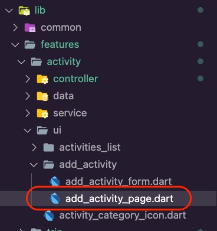 4. Open the **add_activity_page.dart** file and update
it with the following code to use the **AddActivityForm**
you created above to create a new activity for the selected trip.

```
import 'package:amplify_trips_planner/common/navigation/router/routes.dart';
import 'package:amplify_trips_planner/common/utils/colors.dart' as constants;
import 'package:amplify_trips_planner/features/activity/ui/add_activity/add_activity_form.dart';
import 'package:amplify_trips_planner/features/trip/controller/trip_controller.dart';
import 'package:flutter/material.dart';
import 'package:flutter_riverpod/flutter_riverpod.dart';
import 'package:go_router/go_router.dart';

class AddActivityPage extends ConsumerWidget {
  AddActivityPage({
    required this.tripId,
    super.key,
  });

  final String tripId;

  final formGlobalKey = GlobalKey<FormState>();

  @override
  Widget build(BuildContext context, WidgetRef ref) {
    final tripValue = ref.watch(tripControllerProvider(tripId));

    return Scaffold(
      appBar: AppBar(
        centerTitle: true,
        title: const Text(
          'Amplify Trips Planner',
        ),
        leading: IconButton(
          onPressed: () {
            context.goNamed(
              AppRoute.trip.name,
              pathParameters: {'id': tripId},
            );
          },
          icon: const Icon(Icons.arrow_back),
        ),
        backgroundColor: const Color(constants.primaryColorDark),
      ),
      body: AddActivityForm(
        trip: tripValue,
      ),
    );
  }
}
```

5. Create a new file in the **lib/features/trip/ui/trip_page** folder and name it **trip_page_floating_button.dart**.

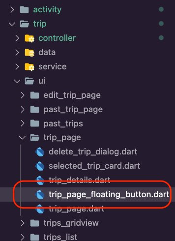 6. Open the **lib/features/trip/ui/trip_page/trip_page_floating_button.dart** file and
update it to a **floatingActionButton** to open the
**AddActivityForm**.

```
import 'package:amplify_trips_planner/common/navigation/router/routes.dart';
import 'package:amplify_trips_planner/common/utils/colors.dart' as constants;
import 'package:amplify_trips_planner/models/ModelProvider.dart';
import 'package:flutter/material.dart';
import 'package:flutter_riverpod/flutter_riverpod.dart';
import 'package:go_router/go_router.dart';

class TripPageFloatingButton extends StatelessWidget {
const TripPageFloatingButton({
required this.trip,
super.key,
});

final AsyncValue<Trip> trip;

@override
Widget build(BuildContext context) {
switch (trip) {
  case AsyncData(:final value):
    return FloatingActionButton(
      onPressed: () {
        context.goNamed(
          AppRoute.addActivity.name,
          pathParameters: {'id': value.id},
        );
      },
      backgroundColor: const Color(constants.primaryColorDark),
      child: const Icon(Icons.add),
    );

  case AsyncError():
    return const Placeholder();
  case AsyncLoading():
    return const SizedBox();

  case _:
    return const SizedBox();
    }
  }
}
```

7. Open the **lib/features/trip/ui/trip_page/trip_page.dart** file and update it to use
   the **TripPageFloatingButton** to add an activity to the
   trip.

```
floatingActionButton: TripPageFloatingButton(
  trip: tripValue,
),
```

The **trip_page.dart** should look like the following
code snippet.

```
import 'package:amplify_trips_planner/common/navigation/router/routes.dart';
import 'package:amplify_trips_planner/common/ui/the_navigation_drawer.dart';
import 'package:amplify_trips_planner/common/utils/colors.dart' as constants;
import 'package:amplify_trips_planner/features/trip/controller/trip_controller.dart';
import 'package:amplify_trips_planner/features/trip/ui/trip_page/trip_details.dart';
import 'package:amplify_trips_planner/features/trip/ui/trip_page/trip_page_floating_button.dart';
import 'package:flutter/material.dart';
import 'package:flutter_riverpod/flutter_riverpod.dart';
import 'package:go_router/go_router.dart';

class TripPage extends ConsumerWidget {
  const TripPage({
    required this.tripId,
    super.key,
  });
  final String tripId;

  @override
  Widget build(BuildContext context, WidgetRef ref) {
    final tripValue = ref.watch(tripControllerProvider(tripId));

    return Scaffold(
      appBar: AppBar(
        centerTitle: true,
        title: const Text(
          'Amplify Trips Planner',
        ),
        actions: [
          IconButton(
            onPressed: () {
              context.goNamed(
                AppRoute.home.name,
              );
            },
            icon: const Icon(Icons.home),
          ),
        ],
        backgroundColor: const Color(constants.primaryColorDark),
      ),
      drawer: const TheNavigationDrawer(),
      floatingActionButton: TripPageFloatingButton(
        trip: tripValue,
      ),
      body: TripDetails(
        tripId: tripId,
        trip: tripValue,
      ),
    );
  }
}
```

8. Open the **lib/features/trip/ui/trip_page/trip_details.dart** file and update it as
   shown in the following to display the list of activities for the trip.

```
    Expanded(
    child: ActivitiesList(
    trip: value,
    ),
)
```

The **trip_details.dart** should look like the
following code snippet.

```
import 'package:amplify_trips_planner/features/activity/ui/activities_list/activities_list.dart';
import 'package:amplify_trips_planner/features/trip/controller/trip_controller.dart';
import 'package:amplify_trips_planner/features/trip/ui/trip_page/selected_trip_card.dart';
import 'package:amplify_trips_planner/models/ModelProvider.dart';
import 'package:flutter/material.dart';
import 'package:flutter_riverpod/flutter_riverpod.dart';

class TripDetails extends ConsumerWidget {
const TripDetails({
required this.trip,
required this.tripId,
super.key,
});

final AsyncValue<Trip> trip;
final String tripId;

@override
Widget build(BuildContext context, WidgetRef ref) {
switch (trip) {
  case AsyncData(:final value):
    return Column(
      crossAxisAlignment: CrossAxisAlignment.stretch,
      children: [
        const SizedBox(
          height: 8,
        ),
        SelectedTripCard(trip: value),
        const SizedBox(
          height: 20,
        ),
        const Divider(
          height: 20,
          thickness: 5,
          indent: 20,
          endIndent: 20,
        ),
        const Text(
          'Your Activities',
          textAlign: TextAlign.center,
          style: TextStyle(
            fontSize: 20,
            fontWeight: FontWeight.bold,
          ),
        ),
        const SizedBox(
          height: 8,
        ),
        Expanded(
          child: ActivitiesList(
            trip: value,
          ),
        )
      ],
    );

  case AsyncError():
    return Center(
      child: Column(
        children: [
          const Text('Error'),
          TextButton(
            onPressed: () async {
              ref.invalidate(tripControllerProvider(tripId));
            },
            child: const Text('Try again'),
          ),
        ],
      ),
    );
  case AsyncLoading():
    return const Center(
      child: CircularProgressIndicator(),
    );

  case _:
    return const Center(
      child: Text('Error'),
      );
    }
  }
}
```

9. Open the **lib/common/navigation/router/router.dart**
   file and update it to add the **AddActivityPage**
   route.

```
GoRoute(
  path: '/addActivity/:id',
  name: AppRoute.addActivity.name,
  builder: (context, state) {
    final tripId = state.pathParameters['id']!;
    return AddActivityPage(tripId: tripId);
  },
),
```

The **router.dart** should look like the following
code snippet.

```
import 'package:amplify_trips_planner/common/navigation/router/routes.dart';
import 'package:amplify_trips_planner/features/activity/ui/add_activity/add_activity_page.dart';
import 'package:amplify_trips_planner/features/trip/ui/edit_trip_page/edit_trip_page.dart';
import 'package:amplify_trips_planner/features/trip/ui/past_trip_page/past_trip_page.dart';
import 'package:amplify_trips_planner/features/trip/ui/past_trips/past_trips_list.dart';
import 'package:amplify_trips_planner/features/trip/ui/trip_page/trip_page.dart';
import 'package:amplify_trips_planner/features/trip/ui/trips_list/trips_list_page.dart';
import 'package:amplify_trips_planner/models/ModelProvider.dart';
import 'package:flutter/material.dart';
import 'package:go_router/go_router.dart';

final router = GoRouter(
  routes: [
    GoRoute(
      path: '/',
      name: AppRoute.home.name,
      builder: (context, state) => const TripsListPage(),
    ),
    GoRoute(
      path: '/trip/:id',
      name: AppRoute.trip.name,
      builder: (context, state) {
        final tripId = state.pathParameters['id']!;
        return TripPage(tripId: tripId);
      },
    ),
    GoRoute(
      path: '/edittrip/:id',
      name: AppRoute.editTrip.name,
      builder: (context, state) {
        return EditTripPage(
          trip: state.extra! as Trip,
        );
      },
    ),
    GoRoute(
      path: '/pasttrip/:id',
      name: AppRoute.pastTrip.name,
      builder: (context, state) {
        final tripId = state.pathParameters['id']!;
        return PastTripPage(tripId: tripId);
      },
    ),
    GoRoute(
      path: '/pasttrips',
      name: AppRoute.pastTrips.name,
      builder: (context, state) => const PastTripsList(),
    ),
    GoRoute(
      path: '/addActivity/:id',
      name: AppRoute.addActivity.name,
      builder: (context, state) {
        final tripId = state.pathParameters['id']!;
        return AddActivityPage(tripId: tripId);
      },
    ),
  ],
  errorBuilder: (context, state) => Scaffold(
    body: Center(
      child: Text(state.error.toString()),
    ),
  ),
);
```

1. Create a new dart file inside the folder **lib/features/activity/controller** and name it **activity_controller.dart.**

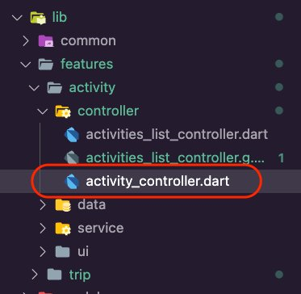 2. Open the **activity_controller.dart** file and update
it with the following code. The UI will use this controller for editing and deleting
an activity using its ID. The UI will also use the controller for uploading a file for
the activity.

###### Note

VSCode will show errors due to the missing **activity_controller.g.dart** file. You will fix that in the next
step.

```
import 'dart:io';

import 'package:amplify_trips_planner/common/services/storage_service.dart';
import 'package:amplify_trips_planner/features/activity/data/activities_repository.dart';
import 'package:amplify_trips_planner/models/ModelProvider.dart';
import 'package:flutter/material.dart';
import 'package:riverpod_annotation/riverpod_annotation.dart';

part 'activity_controller.g.dart';

@riverpod
class ActivityController extends _$ActivityController {
  Future<Activity> _fetchActivity(String activityId) async {
    final activitiesRepository = ref.read(activitiesRepositoryProvider);
    return activitiesRepository.getActivity(activityId);
  }

  @override
  FutureOr<Activity> build(String activityId) async {
    return _fetchActivity(activityId);
  }

  Future<void> uploadFile(File file, Activity activity) async {
    final fileKey = await ref.read(storageServiceProvider).uploadFile(file);
    if (fileKey != null) {
      final imageUrl =
          await ref.read(storageServiceProvider).getImageUrl(fileKey);
      final updatedActivity = activity.copyWith(
        activityImageKey: fileKey,
        activityImageUrl: imageUrl,
      );
      await updateActivity(updatedActivity);
      ref.read(storageServiceProvider).resetUploadProgress();
    }
  }

  Future<String> getFileUrl(Activity activity) async {
    final fileKey = activity.activityImageKey;

    return ref.read(storageServiceProvider).getImageUrl(fileKey!);
  }

  ValueNotifier<double> uploadProgress() {
    return ref.read(storageServiceProvider).getUploadProgress();
  }

  Future<void> updateActivity(Activity activity) async {
    state = const AsyncValue.loading();
    state = await AsyncValue.guard(() async {
      final activitiesRepository = ref.read(activitiesRepositoryProvider);
      await activitiesRepository.update(activity);
      return _fetchActivity(activity.id);
    });
  }
}
```

3. Navigate to the app's root folder and run the following command in your
   terminal.

```
dart run build_runner build -d
```

This will generate the **activity_controller.g.dart**
file inside the **lib/feature/activity/controller** folder.

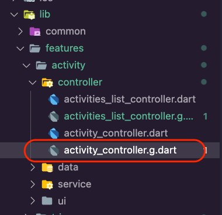 4. Create a new folder inside the **lib/features/activity/ui** folder, name it **activity_page**, and then create the file **delete_activity_dialog.dart** inside it.

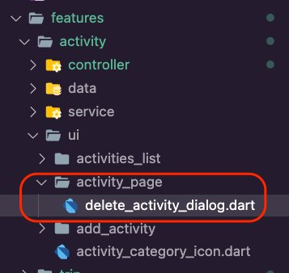 5. Open the **delete_activity_dialog.dart** file and
update it with the following code. This will display a dialog for the user to confirm
deleting the selected activity.

```
import 'package:flutter/material.dart';

class DeleteActivityDialog extends StatelessWidget {
  const DeleteActivityDialog({
    super.key,
  });

  @override
  Widget build(BuildContext context) {
    return AlertDialog(
      title: const Text('Please Confirm'),
      content: const Text('Delete this activity?'),
      actions: [
        TextButton(
          onPressed: () async {
            Navigator.of(context).pop(true);
          },
          child: const Text('Yes'),
        ),
        TextButton(
          onPressed: () {
            Navigator.of(context).pop(false);
          },
          child: const Text('No'),
        )
      ],
    );
  }
}
```

6. Create a new dart file inside the folder **lib/features/activity/ui/activity_page** and name it **activity_page_appbar_icon.dart**.

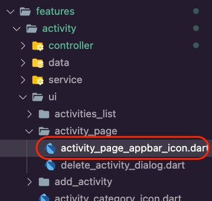 7. Open the **activity_page_appbar_icon.dart** file and
update it with the following code to create an **IconButton** to navigate back to the activity’s trip page.

```
import 'package:amplify_trips_planner/common/navigation/router/routes.dart';
import 'package:amplify_trips_planner/models/ModelProvider.dart';
import 'package:flutter/material.dart';
import 'package:flutter_riverpod/flutter_riverpod.dart';
import 'package:go_router/go_router.dart';

class ActivityPageAppBarIcon extends StatelessWidget {
  const ActivityPageAppBarIcon({
    super.key,
    required this.activity,
  });

  final AsyncValue<Activity> activity;

  @override
  Widget build(BuildContext context) {
    switch (activity) {
      case AsyncData(:final value):
        return IconButton(
          onPressed: () {
            context.goNamed(
              AppRoute.trip.name,
              pathParameters: {'id': value.trip.id},
            );
          },
          icon: const Icon(Icons.arrow_back),
        );

      case AsyncError():
        return const Placeholder();
      case AsyncLoading():
        return const SizedBox();

      case _:
        return const Center(
          child: Text('Error'),
        );
    }
  }
}
```

8. Create a new dart file inside the folder**lib/features/activity/ui/activity_page** and name it **activity_listview.dart**.

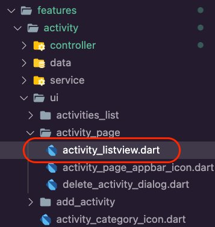 9. Open the **activity_listview.dart** file and update
it with the following code to display the activity details and enable the user to
upload and open a file for the activity.

```
import 'dart:io';

import 'package:amplify_trips_planner/common/navigation/router/routes.dart';
import 'package:amplify_trips_planner/common/ui/upload_progress_dialog.dart';
import 'package:amplify_trips_planner/common/utils/date_time_formatter.dart';
import 'package:amplify_trips_planner/features/activity/controller/activities_list_controller.dart';

import 'package:amplify_trips_planner/features/activity/controller/activity_controller.dart';
import 'package:amplify_trips_planner/features/activity/ui/activity_category_icon.dart';
import 'package:amplify_trips_planner/features/activity/ui/activity_page/delete_activity_dialog.dart';
import 'package:amplify_trips_planner/models/ModelProvider.dart';
import 'package:file_picker/file_picker.dart';
import 'package:flutter/material.dart';
import 'package:flutter_riverpod/flutter_riverpod.dart';
import 'package:go_router/go_router.dart';
import 'package:url_launcher/url_launcher.dart';

class ActivityListView extends ConsumerWidget {
  const ActivityListView({
    required this.activity,
    super.key,
  });

  final AsyncValue<Activity> activity;

  Future<bool> deleteActivity(
    BuildContext context,
    WidgetRef ref,
    Activity activity,
  ) async {
    var value = await showDialog<bool>(
      context: context,
      builder: (BuildContext context) {
        return const DeleteActivityDialog();
      },
    );
    value ??= false;

    if (value) {
      await ref
          .watch(activitiesListControllerProvider(activity.trip.id).notifier)
          .removeActivity(activity);
    }

    return value;
  }

  Future<void> openFile({
    required BuildContext context,
    required WidgetRef ref,
    required Activity activity,
  }) async {
    final fileUrl = await ref
        .watch(activityControllerProvider(activity.id).notifier)
        .getFileUrl(activity);

    final url = Uri.parse(fileUrl);
    await launchUrl(url);
  }

  Future<bool> uploadFile({
    required BuildContext context,
    required WidgetRef ref,
    required Activity activity,
  }) async {
    final result = await FilePicker.platform.pickFiles(
      type: FileType.custom,
      allowedExtensions: ['jpg', 'pdf', 'png'],
    );

    if (result == null) {
      return false;
    }

    final platformFile = result.files.first;

    final file = File(platformFile.path!);
    if (context.mounted) {
      await showDialog<String>(
        context: context,
        barrierDismissible: false,
        builder: (BuildContext context) {
          return const UploadProgressDialog();
        },
      );
      await ref
          .watch(activityControllerProvider(activity.id).notifier)
          .uploadFile(file, activity);
    }
    return true;
  }

  @override
  Widget build(BuildContext context, WidgetRef ref) {
    switch (activity) {
      case AsyncData(:final value):
        return ListView(
          children: [
            Card(
              child: ListTile(
                leading: ActivityCategoryIcon(activityCategory: value.category),
                title: Text(
                  value.activityName,
                  style: Theme.of(context).textTheme.titleLarge,
                ),
                subtitle: Text(value.category.name),
              ),
            ),
            ListTile(
              dense: true,
              title: Text(
                'Activity Date',
                style: Theme.of(context)
                    .textTheme
                    .titleSmall!
                    .copyWith(color: Colors.white),
              ),
              tileColor: Colors.grey,
            ),
            Card(
              child: ListTile(
                title: Text(
                  value.activityDate.getDateTime().format('EE MMMM dd'),
                  style: Theme.of(context).textTheme.titleLarge,
                ),
                subtitle: Text(
                  value.activityTime!.getDateTime().format('hh:mm a'),
                ),
              ),
            ),
            ListTile(
              dense: true,
              title: Text(
                'Documents',
                style: Theme.of(context)
                    .textTheme
                    .titleSmall!
                    .copyWith(color: Colors.white),
              ),
              tileColor: Colors.grey,
            ),
            Card(
              child: value.activityImageUrl != null
                  ? Row(
                      mainAxisAlignment: MainAxisAlignment.spaceAround,
                      children: [
                        TextButton(
                          style: TextButton.styleFrom(
                            textStyle: const TextStyle(fontSize: 20),
                          ),
                          onPressed: () {
                            openFile(
                              context: context,
                              ref: ref,
                              activity: value,
                            );
                          },
                          child: const Text('Open'),
                        ),
                        TextButton(
                          style: TextButton.styleFrom(
                            textStyle: const TextStyle(fontSize: 20),
                          ),
                          onPressed: () {
                            uploadFile(
                              context: context,
                              activity: value,
                              ref: ref,
                            ).then(
                              (isUploaded) => isUploaded ? context.pop() : null,
                            );
                          },
                          child: const Text('Replace'),
                        ),
                      ],
                    )
                  : ListTile(
                      title: TextButton(
                        style: TextButton.styleFrom(
                          textStyle: const TextStyle(fontSize: 20),
                        ),
                        onPressed: () {
                          uploadFile(
                            context: context,
                            activity: value,
                            ref: ref,
                          ).then(
                            (isUploaded) => isUploaded ? context.pop() : null,
                          );
                          // Navigator.of(context, rootNavigator: true)
                          //     .pop());
                        },
                        child: const Text('Attach a PDF or photo'),
                      ),
                    ),
            ),
            const ListTile(
              dense: true,
              tileColor: Colors.grey,
              visualDensity: VisualDensity(vertical: -4),
            ),
            Card(
              child: Row(
                mainAxisAlignment: MainAxisAlignment.spaceAround,
                children: [
                  TextButton(
                    style: TextButton.styleFrom(
                      textStyle: const TextStyle(fontSize: 20),
                    ),
                    onPressed: () {
                      context.goNamed(
                        AppRoute.editActivity.name,
                        pathParameters: {'id': value.id},
                        extra: value,
                      );
                    },
                    child: const Text('Edit'),
                  ),
                  TextButton(
                    style: TextButton.styleFrom(
                      textStyle: const TextStyle(fontSize: 20),
                    ),
                    onPressed: () {
                      deleteActivity(context, ref, value).then(
                        (isDeleted) {
                          if (isDeleted) {
                            context.goNamed(
                              AppRoute.trip.name,
                              pathParameters: {'id': value.trip.id},
                            );
                          }
                        },
                      );
                    },
                    child: const Text('Delete'),
                  ),
                ],
              ),
            )
          ],
        );

      case AsyncError():
        return const Center(
          child: Text('Error'),
        );
      case AsyncLoading():
        return const Center(
          child: CircularProgressIndicator(),
        );

      case _:
        return const Center(
          child: Text('Error'),
        );
    }
  }
}
```

10. Create a new dart file inside the folder **lib/features/activity/ui/activity_page** and name it **activity_page.dart**.

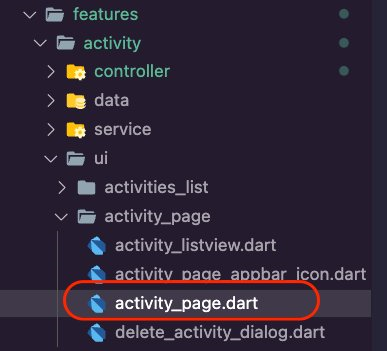 11. Open the **activity_page.dart** file and update it
with the following code to create the **ActivityPage**
which will use the **ActivityListView** you created above
to display the activity’s details.

```
import 'package:amplify_trips_planner/common/utils/colors.dart' as constants;
import 'package:amplify_trips_planner/features/activity/controller/activity_controller.dart';
import 'package:amplify_trips_planner/features/activity/ui/activity_page/activity_listview.dart';
import 'package:amplify_trips_planner/features/activity/ui/activity_page/activity_page_appbar_icon.dart';
import 'package:flutter/material.dart';
import 'package:flutter_riverpod/flutter_riverpod.dart';

class ActivityPage extends ConsumerWidget {
  const ActivityPage({
    required this.activityId,
    super.key,
  });

  final String activityId;

  @override
  Widget build(BuildContext context, WidgetRef ref) {
    final activityValue = ref.watch(activityControllerProvider(activityId));

    return Scaffold(
      appBar: AppBar(
        centerTitle: true,
        title: const Text(
          'Amplify Trips Planner',
        ),
        leading: ActivityPageAppBarIcon(
          activity: activityValue,
        ),
        backgroundColor: const Color(constants.primaryColorDark),
      ),
      body: ActivityListView(
        activity: activityValue,
      ),
    );
  }
}
```

12. Open the **/lib/common/navigation/router/router.dart** file and update it to add the
    **AddActivityPage** route.

```
    GoRoute(
      path: '/activity/:id',
      name: AppRoute.activity.name,
      builder: (context, state) {
        final activityId = state.pathParameters['id']!;
        return ActivityPage(activityId: activityId);
      },
    ),
```

The **router.dart** file should look like the
following code snippet.

```
import 'package:amplify_trips_planner/common/navigation/router/routes.dart';
import 'package:amplify_trips_planner/features/activity/ui/activity_page/activity_page.dart';
import 'package:amplify_trips_planner/features/activity/ui/add_activity/add_activity_page.dart';
import 'package:amplify_trips_planner/features/trip/ui/edit_trip_page/edit_trip_page.dart';
import 'package:amplify_trips_planner/features/trip/ui/past_trip_page/past_trip_page.dart';
import 'package:amplify_trips_planner/features/trip/ui/past_trips/past_trips_list.dart';
import 'package:amplify_trips_planner/features/trip/ui/trip_page/trip_page.dart';
import 'package:amplify_trips_planner/features/trip/ui/trips_list/trips_list_page.dart';
import 'package:amplify_trips_planner/models/ModelProvider.dart';
import 'package:flutter/material.dart';
import 'package:go_router/go_router.dart';

final router = GoRouter(
  routes: [
    GoRoute(
      path: '/',
      name: AppRoute.home.name,
      builder: (context, state) => const TripsListPage(),
    ),
    GoRoute(
      path: '/trip/:id',
      name: AppRoute.trip.name,
      builder: (context, state) {
        final tripId = state.pathParameters['id']!;
        return TripPage(tripId: tripId);
      },
    ),
    GoRoute(
      path: '/edittrip/:id',
      name: AppRoute.editTrip.name,
      builder: (context, state) {
        return EditTripPage(
          trip: state.extra! as Trip,
        );
      },
    ),
    GoRoute(
      path: '/pasttrip/:id',
      name: AppRoute.pastTrip.name,
      builder: (context, state) {
        final tripId = state.pathParameters['id']!;
        return PastTripPage(tripId: tripId);
      },
    ),
    GoRoute(
      path: '/pasttrips',
      name: AppRoute.pastTrips.name,
      builder: (context, state) => const PastTripsList(),
    ),
    GoRoute(
      path: '/addActivity/:id',
      name: AppRoute.addActivity.name,
      builder: (context, state) {
        final tripId = state.pathParameters['id']!;
        return AddActivityPage(tripId: tripId);
      },
    ),
    GoRoute(
      path: '/activity/:id',
      name: AppRoute.activity.name,
      builder: (context, state) {
        final activityId = state.pathParameters['id']!;
        return ActivityPage(activityId: activityId);
      },
    ),

  ],
  errorBuilder: (context, state) => Scaffold(
    body: Center(
      child: Text(state.error.toString()),
    ),
  ),
);
```

1. Create a new folder inside the **lib/features/activity/ui** folder, name it **edit_activity**, and then create the file **edit_activity_page.dart** inside it.

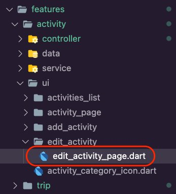 2. Open the **edit_activity_page.dart** file and update it with the following code. This will allow us to present a form to the user to update the details of the selected activity.

```
import 'package:amplify_flutter/amplify_flutter.dart';
import 'package:amplify_trips_planner/common/navigation/router/routes.dart';
import 'package:amplify_trips_planner/common/ui/bottomsheet_text_form_field.dart';
import 'package:amplify_trips_planner/common/utils/colors.dart' as constants;
import 'package:amplify_trips_planner/common/utils/date_time_formatter.dart';
import 'package:amplify_trips_planner/features/activity/controller/activity_controller.dart';
import 'package:amplify_trips_planner/models/ModelProvider.dart';
import 'package:flutter/material.dart';
import 'package:flutter_riverpod/flutter_riverpod.dart';
import 'package:go_router/go_router.dart';
import 'package:intl/intl.dart';

class EditActivityPage extends ConsumerStatefulWidget {
 const EditActivityPage({
   required this.activity,
   super.key,
 });

 final Activity activity;

 @override
 EditActivityPageState createState() => EditActivityPageState();
}

class EditActivityPageState extends ConsumerState<EditActivityPage> {
 @override
 void initState() {
   activityNameController.text = widget.activity.activityName;
   activityDateController.text =
       widget.activity.activityDate.getDateTime().format('yyyy-MM-dd');

   activityTime =
       TimeOfDay.fromDateTime(widget.activity.activityTime!.getDateTime());
   activityTimeController.text =
       widget.activity.activityTime!.getDateTime().format('hh:mm a');

   activityCategoryController.text = widget.activity.category.name;

   activityCategory = widget.activity.category;

   super.initState();
 }

 final formGlobalKey = GlobalKey<FormState>();
 final activityNameController = TextEditingController();
 final activityDateController = TextEditingController();

 var activityTime = TimeOfDay.now();
 final activityTimeController = TextEditingController();

 final activityCategoryController = TextEditingController();

 var activityCategory = ActivityCategory.Flight;

 @override
 Widget build(BuildContext context) {
   return Scaffold(
     appBar: AppBar(
       centerTitle: true,
       title: const Text(
         'Amplify Trips Planner',
       ),
       leading: IconButton(
         onPressed: () {
           context.goNamed(
             AppRoute.activity.name,
             pathParameters: {'id': widget.activity.id},
           );
         },
         icon: const Icon(Icons.arrow_back),
       ),
       backgroundColor: const Color(constants.primaryColorDark),
     ),
     body: SingleChildScrollView(
       child: Form(
         key: formGlobalKey,
         child: Container(
           padding: EdgeInsets.only(
             top: 15,
             left: 15,
             right: 15,
             bottom: MediaQuery.of(context).viewInsets.bottom + 15,
           ),
           width: double.infinity,
           child: Column(
             mainAxisSize: MainAxisSize.min,
             crossAxisAlignment: CrossAxisAlignment.start,
             children: [
               BottomSheetTextFormField(
                 labelText: 'Activity Name',
                 controller: activityNameController,
                 keyboardType: TextInputType.name,
               ),
               const SizedBox(
                 height: 20,
               ),
               DropdownButtonFormField<ActivityCategory>(
                 onChanged: (value) {
                   activityCategoryController.text = value!.name;
                   activityCategory = value;
                 },
                 value: activityCategory,
                 decoration: const InputDecoration(
                   labelText: 'Category',
                 ),
                 items: [
                   for (var category in ActivityCategory.values)
                     DropdownMenuItem(
                       value: category,
                       child: Text(category.name),
                     ),
                 ],
               ),
               const SizedBox(
                 height: 20,
               ),
               BottomSheetTextFormField(
                 labelText: 'Activity Date',
                 controller: activityDateController,
                 keyboardType: TextInputType.datetime,
                 onTap: () async {
                   final pickedDate = await showDatePicker(
                     context: context,
                     initialDate: DateTime.parse(
                         widget.activity.activityDate.toString()),
                     firstDate: DateTime.parse(
                         widget.activity.trip.startDate.toString()),
                     lastDate: DateTime.parse(
                         widget.activity.trip.endDate.toString()),
                   );

                   if (pickedDate != null) {
                     activityDateController.text =
                         pickedDate.format('yyyy-MM-dd');
                   } else {}
                 },
               ),
               const SizedBox(
                 height: 20,
               ),
               BottomSheetTextFormField(
                 labelText: 'Activity Time',
                 controller: activityTimeController,
                 keyboardType: TextInputType.datetime,
                 onTap: () async {
                   await showTimePicker(
                     context: context,
                     initialTime: activityTime,
                     initialEntryMode: TimePickerEntryMode.dial,
                   ).then((timeOfDay) {
                     if (timeOfDay != null) {
                       final localizations = MaterialLocalizations.of(context);
                       final formattedTimeOfDay =
                           localizations.formatTimeOfDay(timeOfDay);

                       activityTimeController.text = formattedTimeOfDay;
                       activityTime = timeOfDay;
                     }
                   });
                 },
               ),
               const SizedBox(
                 height: 20,
               ),
               TextButton(
                 child: const Text('OK'),
                 onPressed: () async {
                   final currentState = formGlobalKey.currentState;
                   if (currentState == null) {
                     return;
                   }
                   if (currentState.validate()) {
                     final format = DateFormat.jm();

                     activityTime = TimeOfDay.fromDateTime(
                       format.parse(activityTimeController.text),
                     );

                     final now = DateTime.now();
                     final time = DateTime(
                       now.year,
                       now.month,
                       now.day,
                       activityTime.hour,
                       activityTime.minute,
                     );

                     final updatedActivity = widget.activity.copyWith(
                       category: ActivityCategory.values
                           .byName(activityCategoryController.text),
                       activityName: activityNameController.text,
                       activityDate: TemporalDate(
                         DateTime.parse(activityDateController.text),
                       ),
                       activityTime: TemporalTime.fromString(
                         time.format('HH:mm:ss.sss'),
                       ),
                     );

                     await ref
                         .watch(
                           activityControllerProvider(widget.activity.id)
                               .notifier,
                         )
                         .updateActivity(updatedActivity);
                     if (context.mounted) {
                       context.goNamed(
                         AppRoute.activity.name,
                         pathParameters: {'id': widget.activity.id},
                       );
                     }
                   }
                 },
               ),
             ],
           ),
         ),
       ),
     ),
   );
 }
}
```

3. Open the **/lib/common/navigation/router/router.dart** file and update it to add the **EditActivityPage** route.

```
GoRoute(
 path: '/editactivity/:id',
 name: AppRoute.editActivity.name,
 builder: (context, state) {
   return EditActivityPage(
     activity: state.extra! as Activity,
   );
 },
),
```

The **router.dart** should look like the following code snippet.

```
import 'package:amplify_trips_planner/common/navigation/router/routes.dart';
import 'package:amplify_trips_planner/features/activity/ui/activity_page/activity_page.dart';
import 'package:amplify_trips_planner/features/activity/ui/add_activity/add_activity_page.dart';
import 'package:amplify_trips_planner/features/activity/ui/edit_activity/edit_activity_page.dart';
import 'package:amplify_trips_planner/features/trip/ui/edit_trip_page/edit_trip_page.dart';
import 'package:amplify_trips_planner/features/trip/ui/past_trip_page/past_trip_page.dart';
import 'package:amplify_trips_planner/features/trip/ui/past_trips/past_trips_list.dart';
import 'package:amplify_trips_planner/features/trip/ui/trip_page/trip_page.dart';
import 'package:amplify_trips_planner/features/trip/ui/trips_list/trips_list_page.dart';
import 'package:amplify_trips_planner/models/ModelProvider.dart';
import 'package:flutter/material.dart';
import 'package:go_router/go_router.dart';

final router = GoRouter(
 routes: [
   GoRoute(
     path: '/',
     name: AppRoute.home.name,
     builder: (context, state) => const TripsListPage(),
   ),
   GoRoute(
     path: '/trip/:id',
     name: AppRoute.trip.name,
     builder: (context, state) {
       final tripId = state.pathParameters['id']!;
       return TripPage(tripId: tripId);
     },
   ),
   GoRoute(
     path: '/edittrip/:id',
     name: AppRoute.editTrip.name,
     builder: (context, state) {
       return EditTripPage(
         trip: state.extra! as Trip,
       );
     },
   ),
   GoRoute(
     path: '/pasttrip/:id',
     name: AppRoute.pastTrip.name,
     builder: (context, state) {
       final tripId = state.pathParameters['id']!;
       return PastTripPage(tripId: tripId);
     },
   ),
   GoRoute(
     path: '/pasttrips',
     name: AppRoute.pastTrips.name,
     builder: (context, state) => const PastTripsList(),
   ),
   GoRoute(
     path: '/addActivity/:id',
     name: AppRoute.addActivity.name,
     builder: (context, state) {
       final tripId = state.pathParameters['id']!;
       return AddActivityPage(tripId: tripId);
     },
   ),
   GoRoute(
     path: '/activity/:id',
     name: AppRoute.activity.name,
     builder: (context, state) {
       final activityId = state.pathParameters['id']!;
       return ActivityPage(activityId: activityId);
     },
   ),
   GoRoute(
     path: '/editactivity/:id',
     name: AppRoute.editActivity.name,
     builder: (context, state) {
       return EditActivityPage(
         activity: state.extra! as Activity,
       );
     },
   ),
 ],
 errorBuilder: (context, state) => Scaffold(
   body: Center(
     child: Text(state.error.toString()),
   ),
 ),
);
```

4. Run the app in an emulator or simulator and create a trip, then add a few activities to it. The following is an example using an iPhone simulator.

###### Note

Due to the changes in the data schema, you need to erase the app and its
contents from the emulator or simulator.


## Conclusion

In this module, you introduced create, read, update, and delete (CRUD) functionality for trip activities in your app. You also updated the Amplify API to retrieve and persist your trip’s activities data.
