# Module 4: Add the Profile feature

## Overview

In this module, you will add the ability to display and edit the user’s profile in your app. You will add an Amplify function to create the profile when the user completes sign-up.

The Amplify function will interact with a GraphQL API that uses AWS AppSync (a managed GraphQL service) backed by DynamoDB (a NoSQL database).

## What you will accomplish

In this module, you will:

- Add the profile data model to the app
- Add an Amplify function to create the user profile
- Implement the UI for displaying and editing the profile

## Implementation

|                              |            |
| ---------------------------- | ---------- |
| **Minimum time to complete** | 45 minutes |

1. You need to configure the API for AWS Identity and Access Management (IAM) authentication to grant the Lambda function access to the GraphQL API. Run the following command in the root folder of the app to update the authorization modes of the API.

```
amplify update api
```

2. Select the **GraphQL** option, then select **Authorization modes** to edit it. Accept the **Amazon Cognito User Pool** as the default authorization type, select **Y** in response to the **Configure additional auth types** prompt. Finally, choose **IAM** from the additional authorization types.

```
? Select from one of the below mentioned services: GraphQL

General information

- Name: amplifytripsplanner

- API endpoint: https://qmrokxalkng4xdaegffe4g2nsq.appsync-api.us-west-1.amazonaws.com/graphql

Authorization modes

- Default: Amazon Cognito User Pool

Conflict detection (required for DataStore)

- Disabled

? Select a setting to edit Authorization modes
? Choose the default authorization type for the API Amazon Cognito User Pool
Use a Cognito user pool configured as a part of this project.
? Configure additional auth types? Yes
? Choose the additional authorization types you want to configure for the API IAM
```

3. Open the **amplify/backend/api/amplifytripsplanner/schema.graphql** file and add a data model for the profile

```
type Trip @model @auth(rules: [{ allow: owner }]) {
 id: ID!
 tripName: String!
 destination: String!
 startDate: AWSDate!
 endDate: AWSDate!
 tripImageUrl: String
 tripImageKey: String
 Activities: [Activity] @hasMany(indexName: "byTrip", fields: ["id"])
}

type Activity @model @auth(rules: [{allow: owner}]) {
 id: ID!
 activityName: String!
 tripID: ID! @index(name: "byTrip", sortKeyFields: ["activityName"])
 trip: Trip! @belongsTo(fields: ["tripID"])
 activityImageUrl: String
 activityImageKey: String
 activityDate: AWSDate!
 activityTime: AWSTime
 category: ActivityCategory!
}

type Profile
 @model
 @auth(
   rules: [
     { allow: private, provider: iam }
     { allow: owner, operations: [read, update, create] }
   ]
 ) {
 id: ID!
 email: String!
 firstName: String
 lastName: String
 homeCity: String
 owner: String!
}

enum ActivityCategory { Flight, Lodging, Meeting, Restaurant }
```

4. Run the following command in the root folder of the app to generate the models files.

```
amplify codegen models
```

The Amplify CLI will generate the dart files in the **lib/models** folder.

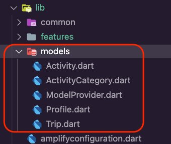 5. Run the command **amplify push** to create the resources in the cloud.

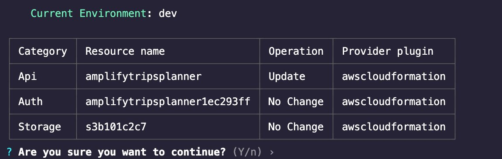 6. Press **Enter**. The Amplify CLI will deploy the resources and display a confirmation, as shown in the screenshot.

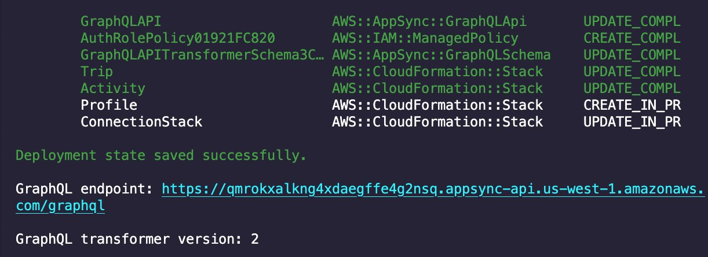

1. Create a new dart file inside the folder **lib/common/services** and name it **auth_service.dart**.

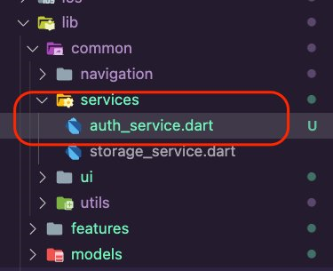 2. Open **auth_service.dart** file and update it with
the following code to create the **AuthService**. The
service will use Amplify to sign the user out.

```
import 'package:amplify_flutter/amplify_flutter.dart';
import 'package:flutter/material.dart';
import 'package:flutter_riverpod/flutter_riverpod.dart';

final authServiceProvider = Provider<AuthService>((ref) {
  return AuthService();
});

class AuthService {
  AuthService();

  Future<void> signOut() async {
    try {
      await Amplify.Auth.signOut();
    } on Exception catch (e) {
      debugPrint(e.toString());
    }
  }
}
```

3. Open the file **lib/common/navigation/ui/the_navigation_drawer.dart**. Update it with the
   following code to add the option to sign out from the app.

```
          ListTile(
            leading: const Icon(Icons.exit_to_app),
            title: const Text('Logout'),
            onTap: () => ref.read(authServiceProvider).signOut(),
          ),
```

The **the_navigation_drawer.dart** should look like
the following code snippet.

```
import 'package:amplify_trips_planner/common/navigation/router/routes.dart';
import 'package:amplify_trips_planner/common/services/auth_service.dart';
import 'package:amplify_trips_planner/common/utils/colors.dart' as constants;
import 'package:flutter/material.dart';
import 'package:flutter_riverpod/flutter_riverpod.dart';
import 'package:go_router/go_router.dart';

class TheNavigationDrawer extends ConsumerWidget {
  const TheNavigationDrawer({
    super.key,
  });

  @override
  Widget build(BuildContext context, WidgetRef ref) {
    return Drawer(
      child: ListView(
        padding: EdgeInsets.zero,
        children: [
          const DrawerHeader(
            decoration: BoxDecoration(
              color: Color(constants.primaryColorDark),
            ),
            padding: EdgeInsets.all(16),
            child: Column(
              children: [
                SizedBox(height: 10),
                Text(
                  'Amplify Trips Planner',
                  style: TextStyle(fontSize: 22, color: Colors.white),
                ),
              ],
            ),
          ),
          ListTile(
            leading: const Icon(Icons.home),
            title: const Text('Trips'),
            onTap: () {
              context.goNamed(
                AppRoute.home.name,
              );
            },
          ),
          ListTile(
            leading: const Icon(Icons.category),
            title: const Text('Past Trips'),
            onTap: () {
              context.goNamed(
                AppRoute.pastTrips.name,
              );
            },
          ),
          ListTile(
            leading: const Icon(Icons.exit_to_app),
            title: const Text('Logout'),
            onTap: () => ref.read(authServiceProvider).signOut(),
          ),
        ],
      ),
    );
  }
}
```

1. Navigate to the root folder of the app and run the following command in your terminal
   to update the authentication configurations.

```
amplify update auth
```

2. Go through the configuration and select **Yes** for configuring Lambda triggers and then enable a **Post Confirmation** trigger:

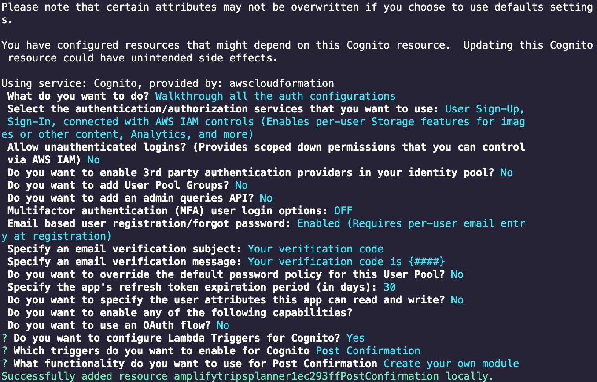

```
Please note that certain attributes may not be overwritten if you choose to use defaults settings.

You have configured resources that might depend on this Cognito resource.  Updating this Cognito resource could have unintended side effects.

Using service: Cognito, provided by: awscloudformation
What do you want to do? Walkthrough all the auth configurations
Select the authentication/authorization services that you want to use: User Sign-Up, Sign-In, connected with IAM controls (Enables per-user Storage features for images or other content, Analytics, and more)
Allow unauthenticated logins? (Provides scoped down permissions that you can control via IAM) No
Do you want to enable 3rd party authentication providers in your identity pool? No
Do you want to add User Pool Groups? No
Do you want to add an admin queries API? No
Multifactor authentication (MFA) user login options: OFF
Email based user registration/forgot password: Enabled (Requires per-user email entry at registration)
Specify an email verification subject: Your verification code
Specify an email verification message: Your verification code is {####}

Do you want to override the default password policy for this User Pool? No
Specify the app's refresh token expiration period (in days): 30
Do you want to specify the user attributes this app can read and write? No
Do you want to enable any of the following capabilities?
Do you want to use an OAuth flow? No
? Do you want to configure Lambda Triggers for Cognito? Yes
? Which triggers do you want to enable for Cognito Post Confirmation
? What functionality do you want to use for Post Confirmation Create your own module
Successfully added resource amplifytripsplannere57d0b5cPostConfirmation locally.
```

The Amplify CLI will add a new folder for the function which will include the **Post Confirmation** trigger where you will write the function to create the user’s profile

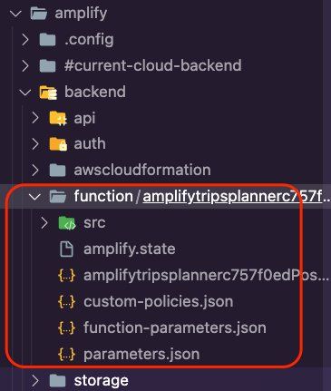 3. **Open the** package.json **file in the** src\*\* folder, which is inside the function’s folder.

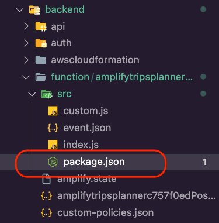 4. Update the **package.json** file as shown in the
following to install the required dependencies.

```
"dependencies": {
 "axios": "latest",
 "@aws-crypto/sha256-js": "^2.0.1",
 "@aws-sdk/credential-provider-node": "^3.76.0",
 "@aws-sdk/protocol-http": "^3.58.0",
 "@aws-sdk/signature-v4": "^3.58.0",
 "node-fetch": "2"
},
```

The **package.json** file should now look like the
following.

```
{
 "name": "amplifytripsplannere57d0b5cPostConfirmation",
 "version": "2.0.0",
 "description": "Lambda function generated by Amplify",
 "main": "index.js",
 "license": "Apache-2.0",
 "dependencies": {
   "axios": "latest",
   "@aws-crypto/sha256-js": "^2.0.1",
   "@aws-sdk/credential-provider-node": "^3.76.0",
   "@aws-sdk/protocol-http": "^3.58.0",
   "@aws-sdk/signature-v4": "^3.58.0",
   "node-fetch": "2"
 },
 "devDependencies": {
   "@types/aws-lambda": "^8.10.92"
 }
}
```

5. Open the **custom.js** file inside the function **src** folder.

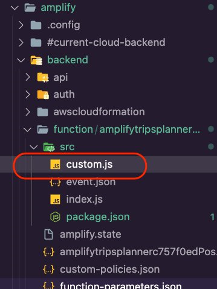 6. Update the **custom.js** file as shown in the following
to run a GraphQL mutation and pass the required variables as arguments to create a
profile record.

```
const { Sha256 } = require("@aws-crypto/sha256-js");
const { defaultProvider } = require("@aws-sdk/credential-provider-node");
const { SignatureV4 } = require("@aws-sdk/signature-v4");
const { HttpRequest } = require("@aws-sdk/protocol-http");
const { default: fetch, Request } = require("node-fetch");

const GRAPHQL_ENDPOINT = process.env.API_AMPLIFYTRIPSPLANNER_GRAPHQLAPIENDPOINTOUTPUT;
const AWS_REGION = process.env.AWS_REGION || 'us-east-1';

const query = /* GraphQL */ `
 mutation createProfile($email: String!,$owner: String!) {
   createProfile(input: {
     email: $email,
     owner: $owner,

   }) {
     email
   }
 }
`;

/**
* @type {import('@types/aws-lambda').PostConfirmationTriggerHandler}
*/
exports.handler = async (event) => {
 console.log(`EVENT: ${JSON.stringify(event)}`);

 const variables = {

     email: event.request.userAttributes.email,
     owner: `${event.request.userAttributes.sub}::${event.userName}`

 };

 const endpoint = new URL(GRAPHQL_ENDPOINT);

 const signer = new SignatureV4({
   credentials: defaultProvider(),
   region: AWS_REGION,
   service: 'appsync',
   sha256: Sha256
 });

 const requestToBeSigned = new HttpRequest({
   method: 'POST',
   headers: {
     'Content-Type': 'application/json',
     host: endpoint.host
   },
   hostname: endpoint.host,
   body: JSON.stringify({ query, variables }),
   path: endpoint.pathname
 });

 const signed = await signer.sign(requestToBeSigned);
 const request = new Request(endpoint, signed);

 let statusCode = 200;
 let body;
 let response;

 try {
   response = await fetch(request);
   body = await response.json();
   if (body.errors) statusCode = 400;
 } catch (error) {
   statusCode = 500;
   body = {
     errors: [
       {
         message: error.message
       }
     ]
   };
 }

 console.log(`statusCode: ${statusCode}`);
 console.log(`body: ${JSON.stringify(body)}`);

 return {
   statusCode,
   body: JSON.stringify(body)
 };
};
```

7. Navigate to the root folder of the app and run the following command in your terminal
   to update the configurations of the function you created above.

```
amplify update function
```

8. Select the function you created above and update the Resource access permissions to
   allow the function to access the API for Query, Mutation, and Subscription

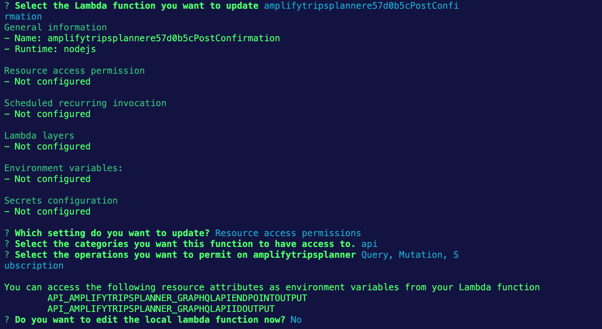

```
? Select the Lambda function you want to update amplifytripsplannere57d0b5cPostConfi
rmation
General information
- Name: amplifytripsplannere57d0b5cPostConfirmation
- Runtime: nodejs

Resource access permission
- Not configured

Scheduled recurring invocation
- Not configured

Lambda layers
- Not configured

Environment variables:
- Not configured

Secrets configuration
- Not configured

? Which setting do you want to update? Resource access permissions
? Select the categories you want this function to have access to. api
? Select the operations you want to permit on amplifytripsplanner Query, Mutation, S
ubscription

You can access the following resource attributes as environment variables from your Lambda function
        API_AMPLIFYTRIPSPLANNER_GRAPHQLAPIENDPOINTOUTPUT
        API_AMPLIFYTRIPSPLANNER_GRAPHQLAPIIDOUTPUT
? Do you want to edit the local lambda function now? No
```

9. Run the command **amplify push** to create the resources
   in the cloud.

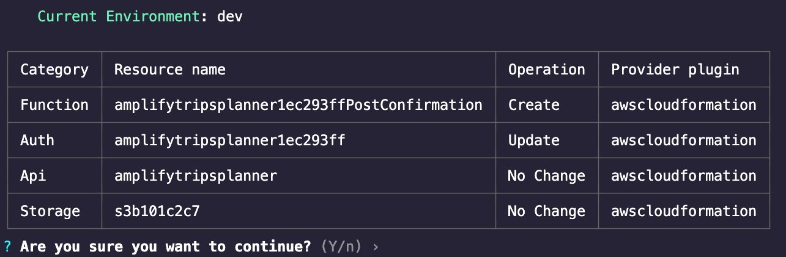 10. Press **Enter**. The Amplify CLI will deploy the resources and display a confirmation, as shown in the screenshot.

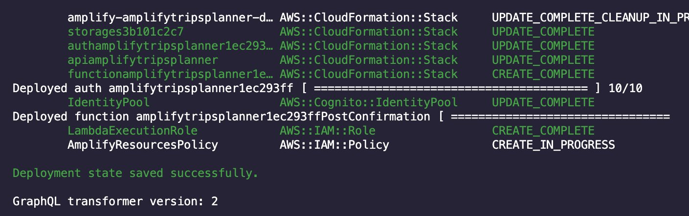

1. Create a new folder inside **lib/features**, and name it **profile**.

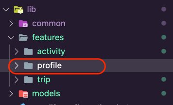 2. Create the following new folders inside the **profile** folder:

    * **service:** The layer to connect with the Amplify backend.
    * **data:** This will be the repository layer that abstracts away the networking code, specifically **service** .
    * **controller:** This is an abstract layer to connect the UI with the repository.
    * **ui:** Here, we will create the widgets and the pages that the app will present to the user.

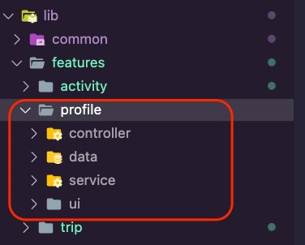 3. Open the file **lib/common/navigation/router/routes.dart**. Update it to add the enum values for the profile feature. The file **routes.dart** should look like the following:

```
enum AppRoute {
 home,
 trip,
 editTrip,
 pastTrips,
 pastTrip,
 activity,
 addActivity,
 editActivity,
 profile,
}
```

4. Create a new dart file inside the **lib/features/profile/service** folder and call it **profile_api_service.dart**.

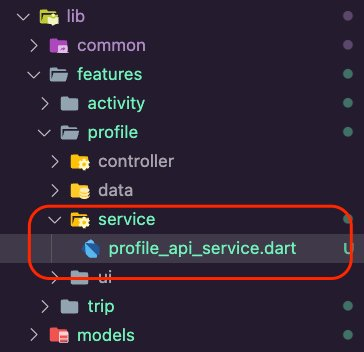 5. Open the **profile_api_service.dart** file and update it with the following code snippet to create **ProfileAPIService**, which contains the following functions:

    * **getProfile:** Queries the Amplify API for the user’s profile and returns its details.
    * **updateProfile:** Update the user’s profile using the Amplify API.

```
import 'package:amplify_api/amplify_api.dart';
import 'package:amplify_flutter/amplify_flutter.dart';
import 'package:amplify_trips_planner/models/ModelProvider.dart';
import 'package:flutter_riverpod/flutter_riverpod.dart';

final profileAPIServiceProvider = Provider<ProfileAPIService>((ref) {
  return ProfileAPIService();
});

class ProfileAPIService {
  ProfileAPIService();

  Future<Profile> getProfile() async {
    try {
      final request = ModelQueries.list(Profile.classType);
      final response = await Amplify.API.query(request: request).response;

      final profile = response.data!.items.first;

      return profile!;
    } on Exception catch (error) {
      safePrint('getProfile failed: $error');
      rethrow;
    }
  }

  Future<void> updateProfile(Profile updatedProfile) async {
    try {
      await Amplify.API
          .mutate(
            request: ModelMutations.update(updatedProfile),
          )
          .response;
    } on Exception catch (error) {
      safePrint('updateProfile failed: $error');
    }
  }
}
```

6. Create a new dart file inside the **lib/features/profile/data** folder and call it **profile_repository.dart**.

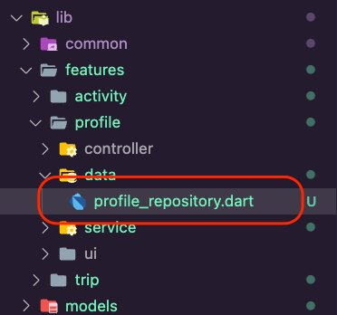 7. Open the **profile_repository.dart** file and update it
with the following code:

```
import 'package:amplify_trips_planner/features/profile/service/profile_api_service.dart';
import 'package:amplify_trips_planner/models/ModelProvider.dart';
import 'package:flutter_riverpod/flutter_riverpod.dart';

final profileRepositoryProvider = Provider<ProfileRepository>((ref) {
 final profileAPIService = ref.read(profileAPIServiceProvider);
 return ProfileRepository(profileAPIService);
});

class ProfileRepository {
 ProfileRepository(this.profileAPIService);
 final ProfileAPIService profileAPIService;

 Future<Profile> getProfile() {
   return profileAPIService.getProfile();
 }

 Future<void> update(Profile updatedProfile) async {
   return profileAPIService.updateProfile(updatedProfile);
 }
}
```

1. Create a new dart file inside the folder **lib/features/profile/controller** and name it **profile_controller.dart**/

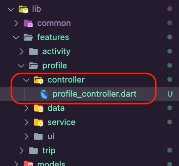 2. Open the **profile_controller.dart** file and update it with the following code. The UI will use the controller to edit the details of the profile.

###### Note

VSCode will show errors due to the missing **profile_controller.g.dart** file. You will fix that in the next
step.

```
import 'package:amplify_trips_planner/features/profile/data/profile_repository.dart';
import 'package:amplify_trips_planner/models/ModelProvider.dart';
import 'package:riverpod_annotation/riverpod_annotation.dart';

part 'profile_controller.g.dart';

@riverpod
class ProfileController extends _$ProfileController {
 Future<Profile> _fetchProfile() async {
   final profileRepository = ref.read(profileRepositoryProvider);
   return profileRepository.getProfile();
 }

 @override
 FutureOr<Profile> build() async {
   return _fetchProfile();
 }

 Future<void> updateProfile(Profile profile) async {
   state = const AsyncValue.loading();
   state = await AsyncValue.guard(() async {
     final profileRepository = ref.read(profileRepositoryProvider);
     await profileRepository.update(profile);
     return _fetchProfile();
   });
 }
}
```

3. Create a new folder inside the **lib/features/profile/ui
   folder**, name it **profile_page**, and then
   create the file **edit_profile_bottomsheet.dart** inside
   it.

```
dart run build_runner build -d
```

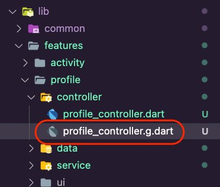 4. Create a new folder inside the **lib/features/profile/ui** folder, name it **profile_page**, and then create the file **edit_profile_bottomsheet.dart** inside it.

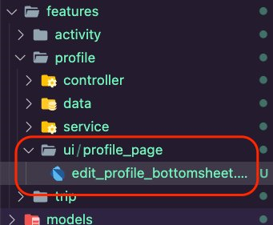 5. Open the **edit_profile_bottomsheet.dart** file and
update it with the following code. This will allow us to present a form to the user to
submit the required details to update the user’s profile.

```
import 'package:amplify_trips_planner/common/ui/bottomsheet_text_form_field.dart';
import 'package:amplify_trips_planner/features/profile/controller/profile_controller.dart';
import 'package:amplify_trips_planner/models/ModelProvider.dart';
import 'package:flutter/material.dart';
import 'package:flutter_riverpod/flutter_riverpod.dart';
import 'package:go_router/go_router.dart';

class EditProfileBottomSheet extends ConsumerWidget {
  EditProfileBottomSheet({
    required this.profile,
    super.key,
  });

  final Profile profile;

  final formGlobalKey = GlobalKey<FormState>();

  @override
  Widget build(BuildContext context, WidgetRef ref) {
    final firstNameController = TextEditingController(
      text: profile.firstName != null ? profile.firstName! : '',
    );
    final lastNameController = TextEditingController(
      text: profile.lastName != null ? profile.lastName! : '',
    );
    final homeCityController = TextEditingController(
      text: profile.homeCity != null ? profile.homeCity! : '',
    );

    return Form(
      key: formGlobalKey,
      child: Container(
        padding: EdgeInsets.only(
          top: 15,
          left: 15,
          right: 15,
          bottom: MediaQuery.of(context).viewInsets.bottom + 15,
        ),
        width: double.infinity,
        child: Column(
          mainAxisSize: MainAxisSize.min,
          crossAxisAlignment: CrossAxisAlignment.start,
          children: [
            BottomSheetTextFormField(
              labelText: 'First Name',
              controller: firstNameController,
              keyboardType: TextInputType.name,
            ),
            const SizedBox(
              height: 20,
            ),
            BottomSheetTextFormField(
              labelText: 'Last Name',
              controller: lastNameController,
              keyboardType: TextInputType.name,
            ),
            const SizedBox(
              height: 20,
            ),
            BottomSheetTextFormField(
              labelText: 'Home City',
              controller: homeCityController,
              keyboardType: TextInputType.name,
            ),
            const SizedBox(
              height: 20,
            ),
            TextButton(
              child: const Text('OK'),
              onPressed: () async {
                final currentState = formGlobalKey.currentState;
                if (currentState == null) {
                  return;
                }
                if (currentState.validate()) {
                  final updatedProfile = profile.copyWith(
                    firstName: firstNameController.text,
                    lastName: lastNameController.text,
                    homeCity: homeCityController.text,
                  );
                  await ref
                      .watch(profileControllerProvider.notifier)
                      .updateProfile(updatedProfile);

                  if (context.mounted) {
                    context.pop();
                  }
                }
              }, //,
            ),
          ],
        ),
      ),
    );
  }
}
```

6. Create a new dart file inside the folder **lib/features/profile/ui/profile_page** and name it **profile_listview.dart**.

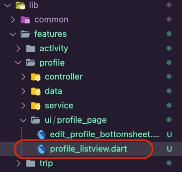 7. Open the **profile_listview.dart** file and update it
with the following code. This will display the user’s profile details.

```
import 'package:amplify_trips_planner/common/utils/colors.dart' as constants;
import 'package:amplify_trips_planner/features/profile/controller/profile_controller.dart';
import 'package:amplify_trips_planner/features/profile/ui/profile_page/edit_profile_bottomsheet.dart';
import 'package:amplify_trips_planner/models/ModelProvider.dart';
import 'package:flutter/material.dart';
import 'package:flutter_riverpod/flutter_riverpod.dart';

class ProfileListView extends ConsumerWidget {
  const ProfileListView({
    required this.profile,
    super.key,
  });

  final AsyncValue<Profile> profile;

  void editProfile(BuildContext context, Profile profile) async {
    await showModalBottomSheet<void>(
      isScrollControlled: true,
      elevation: 5,
      context: context,
      builder: (BuildContext context) {
        return EditProfileBottomSheet(
          profile: profile,
        );
      },
    );
  }

  @override
  Widget build(BuildContext context, WidgetRef ref) {
    switch (profile) {
      case AsyncData(:final value):
        return ListView(
          children: [
            Card(
              child: ListTile(
                leading: const Icon(
                  Icons.verified_user,
                  size: 50,
                  color: Color(constants.primaryColorDark),
                ),
                title: Text(
                  value.firstName != null ? value.firstName! : 'Add your name',
                  style: Theme.of(context).textTheme.titleLarge,
                ),
                subtitle: Text(value.email),
              ),
            ),
            ListTile(
              dense: true,
              title: Text(
                'Home',
                style: Theme.of(context)
                    .textTheme
                    .titleSmall!
                    .copyWith(color: Colors.white),
              ),
              tileColor: Colors.grey,
            ),
            Card(
              child: ListTile(
                title: Text(
                  value.firstName != null ? value.homeCity! : 'Add your city',
                  style: Theme.of(context).textTheme.titleLarge,
                ),
              ),
            ),
            const ListTile(
              dense: true,
              tileColor: Colors.grey,
              visualDensity: VisualDensity(vertical: -4),
            ),
            Card(
              child: Row(
                mainAxisAlignment: MainAxisAlignment.spaceAround,
                children: [
                  TextButton(
                    style: TextButton.styleFrom(
                      textStyle: const TextStyle(fontSize: 20),
                    ),
                    onPressed: () {
                      editProfile(context, value);
                    },
                    child: const Text('Edit'),
                  ),
                ],
              ),
            )
          ],
        );

      case AsyncError():
        return Column(
          mainAxisSize: MainAxisSize.min,
          crossAxisAlignment: CrossAxisAlignment.center,
          children: [
            Padding(
              padding: const EdgeInsets.all(8),
              child: Text(
                'Error',
                style: Theme.of(context).textTheme.titleMedium,
                textAlign: TextAlign.center,
              ),
            ),
            TextButton(
              style: TextButton.styleFrom(
                textStyle: const TextStyle(fontSize: 20),
              ),
              onPressed: () async {
                ref.invalidate(profileControllerProvider);
              },
              child: const Text('Try again'),
            ),
          ],
        );
      case AsyncLoading():
        return const Center(
          child: CircularProgressIndicator(),
        );

      case _:
        return const Center(
          child: Text('Error'),
        );
    }
  }
}
```

8. Create a new dart file inside the folder **lib/features/profile/ui/profile_page** and name it **profile_page.dart**.

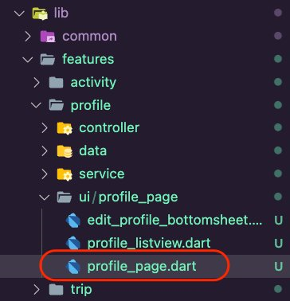 9. Open the **profile_page.dart** file and update it
with the following code to use the**ProfileListView**
you created above to display the user’s profile details.

```
import 'package:amplify_trips_planner/common/ui/the_navigation_drawer.dart';
import 'package:amplify_trips_planner/common/utils/colors.dart' as constants;
import 'package:amplify_trips_planner/features/profile/controller/profile_controller.dart';
import 'package:amplify_trips_planner/features/profile/ui/profile_page/profile_listview.dart';
import 'package:flutter/material.dart';
import 'package:flutter_riverpod/flutter_riverpod.dart';

class ProfilePage extends ConsumerWidget {
  const ProfilePage({
    super.key,
  });

  @override
  Widget build(BuildContext context, WidgetRef ref) {
    final profileValue = ref.watch(profileControllerProvider);
    return Scaffold(
      appBar: AppBar(
        centerTitle: true,
        title: const Text(
          'Amplify Trips Planner',
        ),
        backgroundColor: const Color(constants.primaryColorDark),
      ),
      drawer: const TheNavigationDrawer(),
      body: ProfileListView(
        profile: profileValue,
      ),
    );
  }
}
```

10. : Open the **lib/common/navigation/router/router.dart** file and update it to add the
    **ProfilePage** route.

```
    GoRoute(
      path: '/profile',
      name: AppRoute.profile.name,
      builder: (context, state) => const ProfilePage(),
    ),
```

The **router.dart** should look like the following
code snippet.

```
import 'package:amplify_trips_planner/common/navigation/router/routes.dart';
import 'package:amplify_trips_planner/features/activity/ui/activity_page/activity_page.dart';
import 'package:amplify_trips_planner/features/activity/ui/add_activity/add_activity_page.dart';
import 'package:amplify_trips_planner/features/activity/ui/edit_activity/edit_activity_page.dart';
import 'package:amplify_trips_planner/features/profile/ui/profile_page/profile_page.dart';
import 'package:amplify_trips_planner/features/trip/ui/edit_trip_page/edit_trip_page.dart';
import 'package:amplify_trips_planner/features/trip/ui/past_trip_page/past_trip_page.dart';
import 'package:amplify_trips_planner/features/trip/ui/past_trips/past_trips_list.dart';
import 'package:amplify_trips_planner/features/trip/ui/trip_page/trip_page.dart';
import 'package:amplify_trips_planner/features/trip/ui/trips_list/trips_list_page.dart';
import 'package:amplify_trips_planner/models/ModelProvider.dart';
import 'package:flutter/material.dart';
import 'package:go_router/go_router.dart';

final router = GoRouter(
  routes: [
    GoRoute(
      path: '/',
      name: AppRoute.home.name,
      builder: (context, state) => const TripsListPage(),
    ),
    GoRoute(
      path: '/trip/:id',
      name: AppRoute.trip.name,
      builder: (context, state) {
        final tripId = state.pathParameters['id']!;
        return TripPage(tripId: tripId);
      },
    ),
    GoRoute(
      path: '/edittrip/:id',
      name: AppRoute.editTrip.name,
      builder: (context, state) {
        return EditTripPage(
          trip: state.extra! as Trip,
        );
      },
    ),
    GoRoute(
      path: '/pasttrip/:id',
      name: AppRoute.pastTrip.name,
      builder: (context, state) {
        final tripId = state.pathParameters['id']!;
        return PastTripPage(tripId: tripId);
      },
    ),
    GoRoute(
      path: '/pasttrips',
      name: AppRoute.pastTrips.name,
      builder: (context, state) => const PastTripsList(),
    ),
    GoRoute(
      path: '/addActivity/:id',
      name: AppRoute.addActivity.name,
      builder: (context, state) {
        final tripId = state.pathParameters['id']!;
        return AddActivityPage(tripId: tripId);
      },
    ),
    GoRoute(
      path: '/activity/:id',
      name: AppRoute.activity.name,
      builder: (context, state) {
        final activityId = state.pathParameters['id']!;
        return ActivityPage(activityId: activityId);
      },
    ),
    GoRoute(
      path: '/editactivity/:id',
      name: AppRoute.editActivity.name,
      builder: (context, state) {
        return EditActivityPage(
          activity: state.extra! as Activity,
        );
      },
    ),
    GoRoute(
      path: '/profile',
      name: AppRoute.profile.name,
      builder: (context, state) => const ProfilePage(),
    ),
  ],
  errorBuilder: (context, state) => Scaffold(
    body: Center(
      child: Text(state.error.toString()),
    ),
  ),
);
```

11. Open the file **lib/common/navigation/ui/the_navigation_drawer.dart**. Update it with the
    following code to add the option to navigate to the profile route.

```
          ListTile(
            leading: const Icon(Icons.settings),
            title: const Text('Settings'),
            onTap: () {
              context.goNamed(
                AppRoute.profile.name,
              );
            },
          ),
```

The **the_navigation_drawer.dart** should look like
the following code snippet.

```
import 'package:amplify_trips_planner/common/navigation/router/routes.dart';
import 'package:amplify_trips_planner/common/services/auth_service.dart';
import 'package:amplify_trips_planner/common/utils/colors.dart' as constants;
import 'package:flutter/material.dart';
import 'package:flutter_riverpod/flutter_riverpod.dart';
import 'package:go_router/go_router.dart';

class TheNavigationDrawer extends ConsumerWidget {
  const TheNavigationDrawer({
    super.key,
  });

  @override
  Widget build(BuildContext context, WidgetRef ref) {
    return Drawer(
      child: ListView(
        padding: EdgeInsets.zero,
        children: [
          const DrawerHeader(
            decoration: BoxDecoration(
              color: Color(constants.primaryColorDark),
            ),
            padding: EdgeInsets.all(16),
            child: Column(
              children: [
                SizedBox(height: 10),
                Text(
                  'Amplify Trips Planner',
                  style: TextStyle(fontSize: 22, color: Colors.white),
                ),
              ],
            ),
          ),
          ListTile(
            leading: const Icon(Icons.home),
            title: const Text('Trips'),
            onTap: () {
              context.goNamed(
                AppRoute.home.name,
              );
            },
          ),
          ListTile(
            leading: const Icon(Icons.category),
            title: const Text('Past Trips'),
            onTap: () {
              context.goNamed(
                AppRoute.pastTrips.name,
              );
            },
          ),
          ListTile(
            leading: const Icon(Icons.settings),
            title: const Text('Settings'),
            onTap: () {
              context.goNamed(
                AppRoute.profile.name,
              );
            },
          ),
          ListTile(
            leading: const Icon(Icons.exit_to_app),
            title: const Text('Logout'),
            onTap: () => ref.read(authServiceProvider).signOut(),
          ),
        ],
      ),
    );
  }
}
```

12. Run the app in an emulator or simulator and create a new user, navigate to the
    settings screen and update the user profile. The following is an example using an
    iPhone simulator.

###### Note

    * Due to the changes in the data schema, you need to erase the app and its
     contents from the emulator or simulator.
    * If you encounter an error on the settings page, it could be because the VTL
     resolvers were not updated properly. To resolve the issue, add an empty line to
     the **schema.graphql** file and run the **amplify push** command.

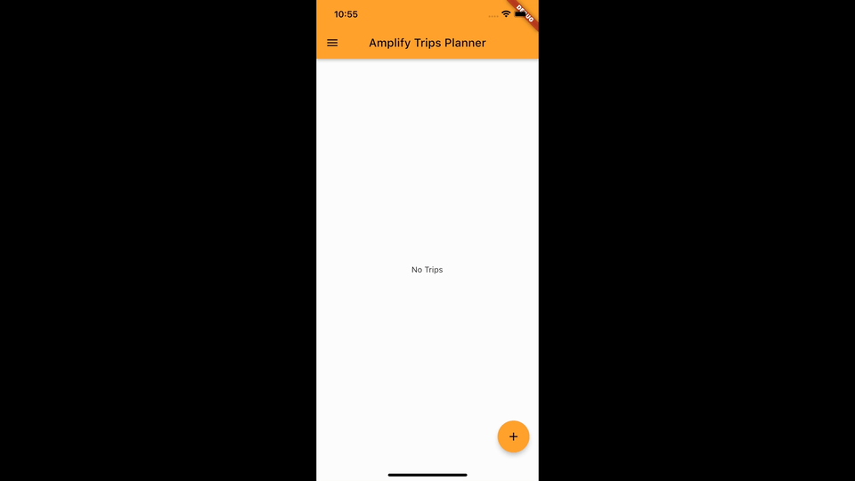

## Conclusion

In this module, you introduced the feature of displaying and editing the user’s profile.
You used an Amplify function to create the user’s profile. You also implemented the UI for
displaying the profile details and updating it.

## Congratulations!

Congratulations! You have created a cross-platform Flutter mobile app using AWS Amplify! You
have cloned the app you created in the [first tutorial](../build-flutter-mobile-app-part-one/build-flutter-mobile-app-part-one.md "../build-flutter-mobile-app-part-one/build-flutter-mobile-app-part-one.md") in this series. You then introduced the ability to display the
user’s past trips. Additionally, you updated the Amplify API, allowing users to create,
read, update, and delete their trip’s activities. You have also added an Amplify function to
create a user profile, then you implemented the UI to allow the user to update their profile
details.

## Clean up resources

Now that you’ve finished this walkthrough, you can delete the backend resources to avoid incurring unexpected costs by running the command below in the root folder of the app.

```
amplify delete
```
