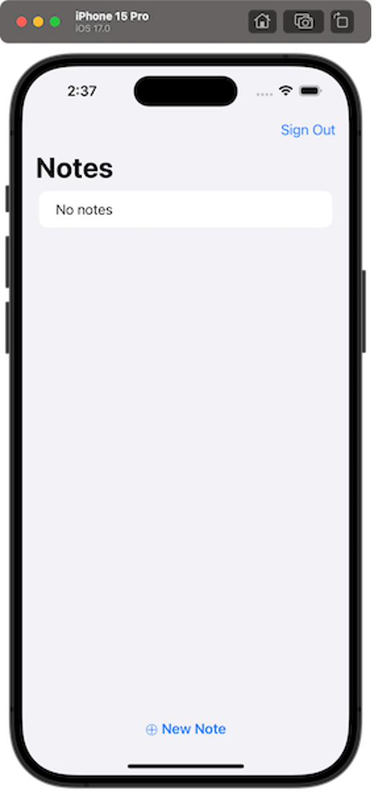
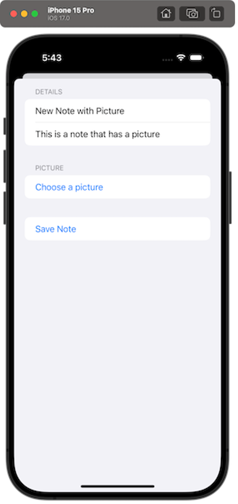
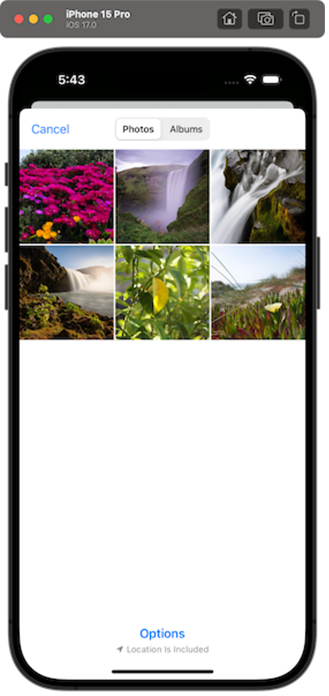
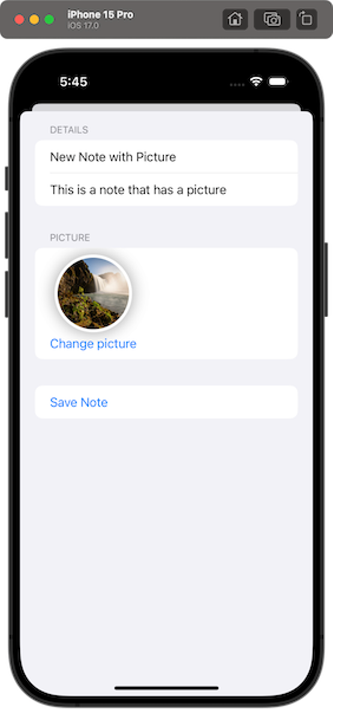

# Module 5: Add the Ability to Store Images

|                      |                                                                                  |
| -------------------- | -------------------------------------------------------------------------------- |
| **Time to complete** | 5 minutes                                                                        |
| **Services used**    | [AWS Amplify](https://aws.amazon.com/amplify/ "https://aws.amazon.com/amplify/") |

## Overview

Now that the notes app is working, you will add the ability to
associate an image with each note.

In this module, you will use the Amplify CLI and libraries to
create a storage service using [Amazon S3](https://aws.amazon.com/s3/ "https://aws.amazon.com/s3/"). Then, you will update the iOS app to enable image
uploading, fetching, and rendering.

## What you will accomplish

In this tutorial, you will:

- Create a storage service
- Update your iOS app with logic to upload and download images
- Update the UI of your iOS app

## Key concepts

**Storage service –** Storing and
querying of files, such as images and videos, is a common
requirement for applications. One option to do this is to Base64
encode the file and send it as a string to save in the database.
This comes with disadvantages, such as the encoded file being
larger than the original binary, the operation being
computationally expensive, and the added complexity around
encoding and decoding properly. Another option is to have a
storage service specifically built and optimized for file storage.

Storage services like Amazon S3 exist to make this as easy,
performant, and inexpensive as possible.

## Implementation

1. Add storage

Open the **Terminal,** navigate to
your **project root directory**, and
run the following **command**:

```
amplify add storage

```

2. Configure options

When prompted, make the following selections:

```
Select from one of the below mentioned services:
    ❯ Content (Images, audio, video, etc.)

Provide a friendly name for your resource that will be used to label this category in the project
    image

Provide bucket name
    «default value»

Who should have access:
    ❯ Auth users only

What kind of access do you want for Authenticated users?
    ● create/update
    ● read
    ● delete
    «i.e. select all options»

Do you want to add a Lambda Trigger for your S3 Bucket?
    N
```

3. Deploy the service

Finally, deploy the service by running the following
**command**:

```
amplify push

Are you sure you want to continue?
    Y
```

1. Open the general tab

Navigate to the **General** tab of
your Target application (Your Project > Targets > General),
and select the **plus (+)** in
the **Frameworks, Libraries, and Embedded
Content** section.

 2. Choose the plugin

Choose **AWSS3StoragePlugin**, and
select **Add**.

 3. Verify dependency

You will
see **AWSS3StoragePlugin** as a
dependency for your project.


- Modify the Xcode

Navigate back to **Xcode** and open
the \***\*GettingStartedApp.swift\*\***
file. To configure Amplify API, you will need to:

    + Add the****import AWSS3StoragePlugin****statement.
    + Create
     the ****AWSS3StoragePlugin****plugin,
     and register it with Amplify.

Your code should look like the following.

```
import Amplify
import AWSAPIPlugin
import AWSCognitoAuthPlugin
import AWSS3StoragePlugin
import SwiftUI

@main
struct GettingStartedApp: App {
    init() {
        do {
            try Amplify.add(plugin: AWSCognitoAuthPlugin())
            try Amplify.add(plugin: AWSAPIPlugin(modelRegistration: AmplifyModels()))
            try Amplify.add(plugin: AWSS3StoragePlugin())
            try Amplify.configure()
            print("Initialized Amplify");
        } catch {
            print("Could not initialize Amplify: \(error)")
        }
    }

    var body: some Scene {
        WindowGroup {
            LandingView()
                .environmentObject(NotesService())
                .environmentObject(AuthenticationService())
        }
    }
}
```

- Create a StorageSwift file

Create a **new Swift file** named \***\*StorageService.swift\*\*** with
the following content:

```
import Amplify
import Foundation

class StorageService: ObservableObject {
    func upload(_ data: Data, name: String) async {
        let task = Amplify.Storage.uploadData(
            key: name,
            data: data,
            options: .init(accessLevel: .private)
        )
        do {
            let result = try await task.value
            print("Upload data completed with result: \(result)")
        } catch {
            print("Upload data failed with error: \(error)")
        }
    }

    func download(withName name: String) async -> Data? {
        let task = Amplify.Storage.downloadData(
            key: name,
            options: .init(accessLevel: .private)
        )
        do {
            let result = try await task.value
            print("Download data completed")
            return result
        } catch {
            print("Download data failed with error: \(error)")
            return nil
        }
    }

    func remove(withName name: String) async {
        do {
            let result = try await Amplify.Storage.remove(
                key: name,
                options: .init(accessLevel: .private)
            )
            print("Remove completed with result: \(result)")
        } catch {
            print("Remove failed with error: \(error)")
        }
    }
}
```

The methods in this class simply call their Amplify counterpart.
Amplify Storage has three file protection levels:

    + **Public**: Accessible by all
     users
    + **Protected**: Readable by all
     users, but only writable by the creating user
    + **Private**: Readable and
     writable only by the creating user

For this app, we want the images to only be available to the note
owner, so we set the \***\*accessLevel:
.private property\*\*** in each operation's options.

1. Create a RemoteImage file

Create a **new Swift file**
named \***\*RemoteImage.swift\*\***with
the following content:

```
import SwiftUI

struct RemoteImage: View {
    @EnvironmentObject private var storageService: StorageService
    @State private var image: UIImage? = nil
    @State private var isLoading = true
    var name: String

    var body: some View {
        content
            .task {
                if let data = await storageService.download(withName: name) {
                    image = UIImage(data: data)
                }
                isLoading = false
            }
    }

    @ViewBuilder
    private var content: some View {
        if isLoading {
            ProgressView()
        } else if let image {
            Image(uiImage: image)
                .resizable()
                .aspectRatio(contentMode: .fill)
        } else {
            EmptyView()
        }
    }
}
```

This view will attempt to download the data using the storage
service and the provided name, while displaying a loading view while
the operation is in progress. If the data cannot be downloaded, it
shows an empty view. 2. Update the NoteView file

Next,
update \***\*NoteView.swift\*\*** to
use this new view when displaying the image:

```
    if let image = note.image {
        Spacer()
        RemoteImage(name: image)
            .frame(width: 30, height: 30)
    }
```

3. Update the GettingStartedApp file

Finally, update the \***\*GettingStartedApp.swift's\*\***
body to set the \***\*StorageService\*\***
object:

```
    var body: some Scene {
        WindowGroup {
            LandingView()
                .environmentObject(NotesService())
                .environmentObject(AuthenticationService())
                .environmentObject(StorageService())
        }
    }
```

4. Create a PicturePicker file

In order to allow the user to select a picture from their library,
create a **new Swift file**
named \***\*PicturePicker.swift\*\***with
the following content:

```
import PhotosUI
import SwiftUI

struct PicturePicker: View {
    @State private var selectedPhoto: PhotosPickerItem? = nil
    @Binding var selectedData: Data?

    var body: some View {
        VStack {
            if let selectedData, let image = UIImage(data: selectedData) {
                Image(uiImage: image)
                    .resizable()
                    .frame(width: 100, height: 100)
                    .clipShape(Circle())
                    .overlay(Circle().stroke(Color.white, lineWidth: 4))
                    .shadow(radius: 10)
            }

            PhotosPicker(title, selection: $selectedPhoto)
        }
        .onChange(of: selectedPhoto) {
            Task {
                selectedData = try? await selectedPhoto?.loadTransferable(type: Data.self)
            }
        }
    }

    private var title: String {
        return selectedPhoto == nil ? "Choose a picture" : "Change picture"
    }
}
```

5. Update the SaveNoteView file

Make the following changes to
the \***\*SaveNoteView.swift\*\*** files:

    * Add a new ****@EnvironmentObject
     private var storageService:
     StorageService**** property.
    * Replace the type of the image property
     to **Data**instead
     of **String**.
    * Display ****PicturePicker(selectedData:
     $image)**** on
     the **Picture** section instead
     of a text field.
    * Modify the **Save Note** button's
     action to also save the image using storageService. Keep in mind
     that the note's image value should match the name you give to
     the stored image.

You file should look like the following:

```
struct SaveNoteView: View {
    @Environment(\.dismiss) private var dismiss
    @EnvironmentObject private var notesService: NotesService
    @EnvironmentObject private var storageService: StorageService
    @State private var name = ""
    @State private var description = ""
    @State private var image: Data? = nil

    var body: some View {
        Form {
            Section("Details") {
                TextField("Name", text: $name)
                TextField("Description", text: $description)
            }

            Section("Picture") {
                PicturePicker(selectedData: $image)
            }

            Button("Save Note") {
                let imageName = image != nil ? UUID().uuidString : nil
                let note = Note(
                    name: name,
                    description: description.isEmpty ? nil : description,
                    image: imageName
                )

                Task {
                    if let image, let imageName {
                        await storageService.upload(image, name: imageName)
                    }
                    await notesService.save(note)

                    dismiss()
                }
            }
        }
    }
}
```

6. Configure image deletion

To delete images that are associated with a note that is deleted,
update
the \***\*NotesView.swift\*\*** file:

    * Add a new****@EnvironmentObject
     private var storageService:
     StorageService****property
    * Call ****storageService.remove(withName:)****inside
     the **o**nDelete****callback
     after
     calling ****notesService.delete(\_:)****.

Your file should look like the following:

```
struct NotesView: View {
    @EnvironmentObject private var authenticationService: AuthenticationService
    @EnvironmentObject private var notesService: NotesService
    @EnvironmentObject private var storageService: StorageService
    @State private var isSavingNote = false

    var body: some View {
        NavigationStack{
            List {
                if notesService.notes.isEmpty {
                    Text("No notes")
                }
                ForEach(notesService.notes, id: \.id) { note in
                    NoteView(note: note)
                }
                .onDelete { indices in
                    for index in indices {
                        let note = notesService.notes[index]
                        Task {
                            await notesService.delete(note)
                            if let image = note.image {
                                await storageService.remove(withName: image)
                            }
                        }
                    }
                }
            }
            .navigationTitle("Notes")
            .toolbar {
                Button("Sign Out") {
                    Task {
                        await authenticationService.signOut()
                    }
                }
            }
            .toolbar {
                ToolbarItem(placement: .bottomBar) {
                    Button("⨁ New Note") {
                        isSavingNote = true
                    }
                    .bold()
                }
            }
            .sheet(isPresented: $isSavingNote) {
                SaveNoteView()
            }
        }
        .task {
            await notesService.fetchNotes()
        }
    }
}
```

- Run the project

To verify everything works as expected, build, and run the project.

Choose the **►** button in the
toolbar. Alternatively, you can also do it by going
to **Product -> Run**, or by
pressing **Cmd + R**.

The iOS simulator will open and the app should show you the Notes
view, assuming you are still signed in.

You can tap on the "**⨁ New
Note**" button at the bottom to create a new list, and
now you should be able to select a picture from the device's photo
library.

#### List of notes



#### Create a note



#### Select a picture



#### Note with picture



Amplify makes it easy to share a single backend among multiple frontend
applications.

1. Synchronize your local project

Open the **Terminal**, navigate to your other
**project directory**, and run the following **command**:

```
amplify pull
```

2. Configure options

When prompted, make the following selections:

```
Select the authentication method you want to use
    ❯ AWS profile
Please choose the profile you want to use (Use arrow keys)
    ❯ default
Which app are you working on?
    ❯ GettingStarted («id»)
Choose your default editor:
    ❯ «Choose your desired editor»
Choose the type of app that you're building …
    ❯ «Choose your desired app type, and any subsequent configuration related to it»
Do you plan on modifying this backend?
    ❯ N

```

When creating a backend for a test or a prototype, or just for learning purposes like
this tutorial, you should delete the Cloud resources you created.

- Delete the project

Open **Terminal**, navigate to your **project root folder**, and run the following **command**:

```
amplify delete
```

## Conclusion

You have built an iOS application using AWS Amplify! You have added
authentication to your app allowing users to sign up, sign in, and
manage their account. The app also has a scalable GraphQL API
configured with an Amazon DynamoDB database which users can use to
create and delete notes. You have also added file storage using
Amazon S3, which users can use to upload images and view them in
their app.

To conclude this guide, you can find instructions to reuse or delete
the backend you have been using in this tutorial.

## Congratulations!

You successfully built a web application on AWS! As a great next step, dive deeper into specific AWS technologies and take your application to the next level.
