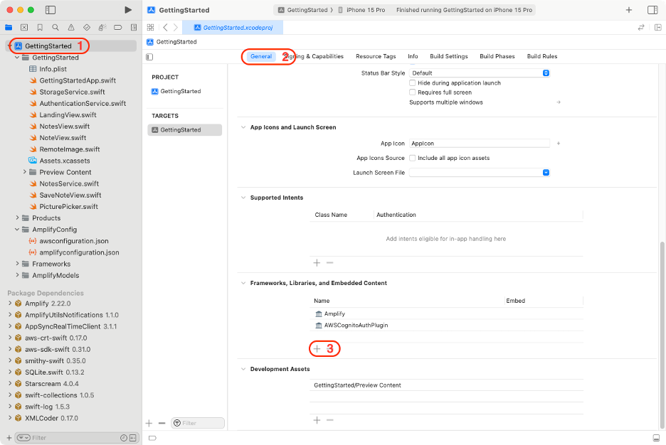
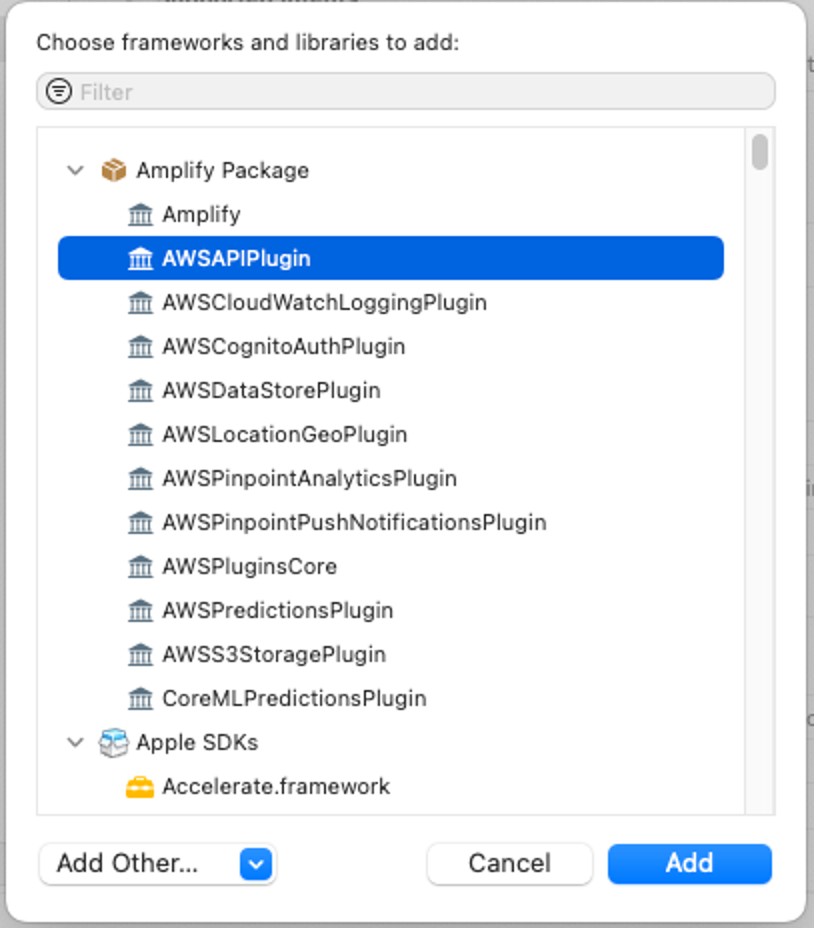
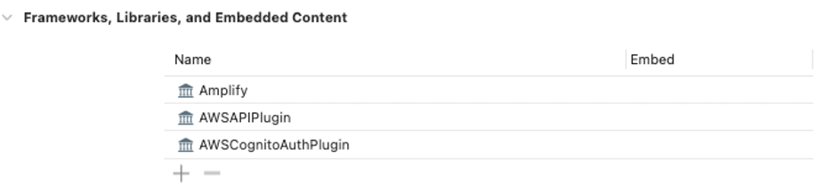
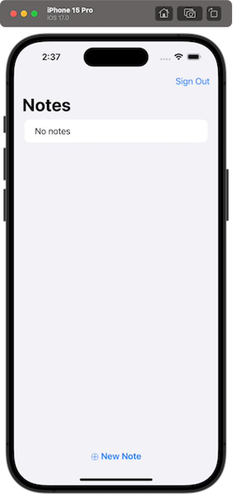
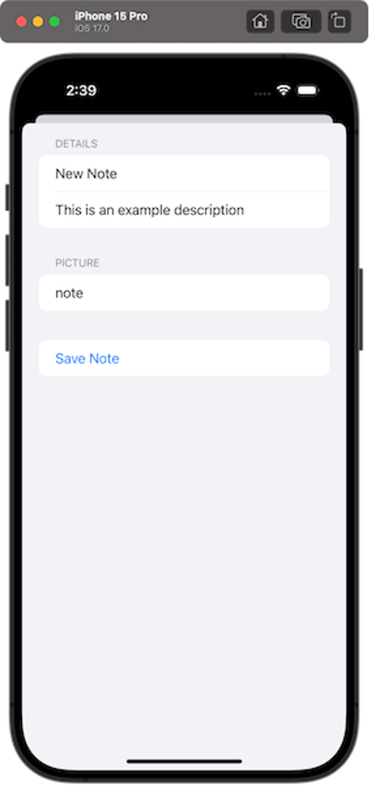
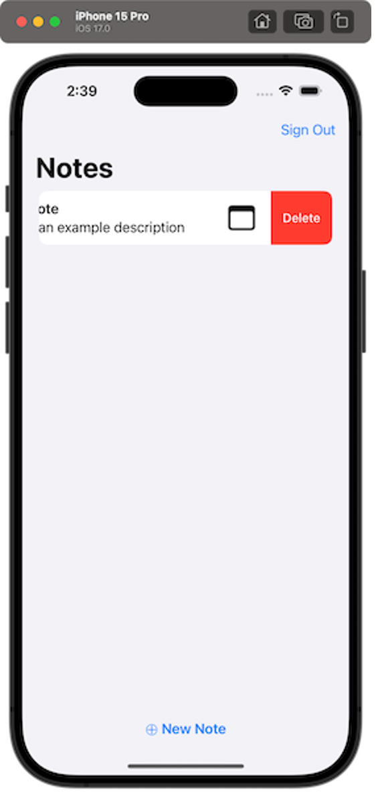

# Module 4: Add a GraphQL API service and a database

|                      |                                                                                  |
| -------------------- | -------------------------------------------------------------------------------- | -------------------------------------------------------------------------------------------------------------------------------------------------------------------------------------------------------------------------------------------------------------------------------------------------------------------------------------------------------------------------------------------------------------------------------------------------------------------------------------------------------------------------------------------------------------------------------------------------------------------------------------------------------------------------------------------------------------------------------------------------------------------------------------------------------------------------------------------------------------------------------------------------------------------------------------------------------------------------------------------------------------------------------------------------------------------------------------------------------------------------------------------------------------------------------------------------------------------------------------------------------------------------------------------------------------------------------------------------------------------------------------------------------------------------------------------------------------------------------------------------------------------------------------------------------------------------------------------------------------------------------------------------------------------------------------------------------------------------------------------------------------------------------------------------------------------------------------------------------------------------------------------------------------------------------------------------------------------------------------------------------------------------------------------------------------------------------------------------------------------------------------------------------------------------------------------------------------------------------------------------------------------------------------------------------------------------------------------------------------------------------------------------------------------------------------------------------------------------------------------------------------------------------------------------------------------------------------------------------------------------------------------------------------------------------------------------------------------------------------------------------------------------------------------------------------------------------------------------------------------------------------------------------------------------------------------------------------------------------------------------------------------------------------------------------------------------------------------------------------------------------------------------------------------------------------------------------------------------------------------------------------------------------------------------------------------------------------------------------------------------------------------------------------------------------------------------------------------------------------------------------------------------------------------------------------------------------------------------------------------------------------------------------------------------------------------------------------------------------------------------------------------------------------------------------------------------------------------------------------------------------------------------------------------------------------------------------------------------------------------------------------------------------------------------------------------------------------------------------------------------------------------------------------------------------------------------------------------------------------------------------------------------------------------------------------------------------------------------------------------------------------------------------------------------------------------------------------------------------------------------------------------------------------------------------------------------------------------------------------------------------------------------------------------------------------------------------------------------------------------------------------------------------------------------------------------------------------------------------------------------------------------------------------------------------------------------------------------------------------------------------------------------------------------------------------------------------------------------------------------------------------------------------------------------------------------------------------------------------------------------------------------------------------------------------------------------------------------------------------------------------------------------------------------------------------------------------------------------------------------------------------------------------------------------------------------------------------------------------------------------------------------------------------------------------------------------------------------------------------------------------------------------------------------------------------------------------------------------------------------------------------------------------------------------------------------------------------------------------------------------------------------------------------------------------------------------------------------------------------------------------------------------------------------------------------------------------------------------------------------------------------------------------------------------------------------------------------------------------------------------------------------------------------------------------------------------------------------------------------------------------------------------------------------------------------------------------------------------------------------------------------------------------------------------------------------------------------------------------------------------------------------------------------------------------------------------------------------------------------------------------------------------------------------------------------------------------------------------------------------------------------------------------------------------------------------------------------------------------------------------------------------------------------------------------------------------------------------------------------------------------------------------------------------------------------------------------------------------------------------------------------------------------------------------------------------------------------------------------------------------------------------------------------------------------------------------------------------------------------------------------------------------------------------------------------------------------------------------------------------------------------------------------------------------------------------------------------------------------------------------------------------------------------------------------------------------------------------------------------------------------------------------------------------------------------------------------------------------------------------------------------------------------------------------------------------------------------------------------------------------------------------------------------------------------------------------------------------------------------------------------------------------------------------------------------------------------------------------------------------------------------------------------------------------------------------------------------------------------------------------------------------------------------------------------------------------------------------------------------------------------------------------------------------------------------------------------------------------------------------------------------------------------------------------------------------------------------------------------------------------------------------------------------------------------------------------------------------------------------------------------------------------------------------------------------------------------------------------------------------------------------------------------------------------------------------------------------------------------------------------------------------------------------------------------------------------------------------------------------------------------------------------------------------------------------------------------------------------------------------------------------------------------------------------------------------------------------------------------------------------------------------------------------------------------------------------------------------------------------------------------------------------------------------------------------------------------------------------------------------------------------------------------------------------------------------------------------------------------------------------------------------------------------------------------------------------------------------------------------------------------------------------------------------------------------------------------------------------------------------------------------------------------------------------------------------------------------------------------------------------------------------------------------------- |
| **Time to complete** | 20 minutes                                                                       |
| **Services used**    | [AWS Amplify](https://aws.amazon.com/amplify/ "https://aws.amazon.com/amplify/") | ## Overview Now that you have created and configured the app with user authentication, you will add an API and create, read, update, delete (CRUD) operations on a database. In this module, you will add an API to our app using the Amplify CLI and libraries. The API you will be creating is a [GraphQL](https://graphql.org/ "https://graphql.org/") API that uses [AWS AppSync](https://aws.amazon.com/appsync/ "https://aws.amazon.com/appsync/") (a managed GraphQL service) which is backed by [Amazon DynamoDB](https://aws.amazon.com/dynamodb/ "https://aws.amazon.com/dynamodb/") (a NoSQL database). For an introduction to GraphQL, [visit this page](https://graphql.org/learn/ "https://graphql.org/learn/"). The app you will be building is a note-taking app where users can create, delete, and list notes. This example gives you a good idea of how to build many popular types of CRUD+L (create, read, update, delete, and list) applications. ## What you will accomplish In this tutorial, you will:  • Create and deploy a GraphQL API  • Write frontend code to interact with the API ## Key concepts **API –** Provides a programming interface that allows communication and interactions between multiple software intermediaries. **GraphQL –** A query language and server-side API implementation based on a typed representation of your application. This API representation is declared using a schema based on the GraphQL type system. To learn more about GraphQL, visit [this page](https://graphql.org/learn/ "https://graphql.org/learn/"). ## Implementation 1. Add the Amplify API Open the **Terminal,** navigate to your **project root directory** , and run the following **command**: `amplify add api` 2. Configure the API When prompted, make the following selections: `Select from one of the below mentioned services: ❯ GraphQL Authorization modes: Choose the default authorization type for the API ❯ Amazon Cognito User Pool Configure additional auth types? N` 3. Confirm selections Validate the selected options, and choose **Continue.** `Here is the GraphQL API that we will create. Select a setting to edit or continue (Use arrow keys) Name: gettingstarted Authorization modes: Amazon Cognito User Pool (default) Conflict detection (required for DataStore): Disabled ❯ Continue` 4. Edit the schema Select **Blank Schema** and **choose Y** when asked to edit the schema: `Choose a schema template: ❯ Blank Schema Do you want to edit the schema now? Y` 5. Update the schema As we want to represent the model we previously defined in the \***\*Note.swift\*\*** file, use the following schema and **save** the file: `type Note @model @auth (rules: [ { allow: owner } ]) { id: ID! name: String! description: String image: String }` The data model is made of one class named **Note**  and four String properties:  **id**  and **name**  are mandatory; **description**  and **image**  are optional.  • The \***\*@model\*\*** transformer indicates we want to create a database to store these data.  • The \***\*@auth\*\*** transformer adds authentication rules to allow access to these data. For this project, we want only the owner of Notes to have access to them. Delete the  **Note.swift** file, we will re-generate the models in the next step. Amplify generates client-side code.  • Generate the code To generate the code, run the following **command** in your terminal: `amplify codegen models` This creates Swift files in the **amplify/generated/models** directory and automatically add them to your project. 1. Deploy the backend database To deploy the backend API and database we have just created, in your terminal run the following **command**: `amplify push` 2. Push the deployment When prompted, make the following selections: `amplify push Are you sure you want to continue? Y Do you want to generate code for your newly created GraphQL API? N` 1. Open the general tab Navigate to the  **General**  tab of your Target application (Your Project > Targets > General), and select the **plus (+)** in the  **Frameworks, Libraries, and Embedded Content**  section.  2. Choose the plugin Choose the **AWSAPIPlugin** , and select  **Add**.  3. Verify the dependency created You have now added **AWSAPIPlugin** as a dependency for your project.   • Configure the library Navigate back to **Xcode** , and open the \***\*GettingStartedApp.swift\*\*** file. To configure Amplify API, you will need to: + Add the  \***\*import AWSAPIPlugin\*\*** statement. + Create the \***\*AWSAPIPlugin\*\*** plugin and register it with Amplify. Your code should look like the following: `import Amplify import AWSAPIPlugin import AWSCognitoAuthPlugin import SwiftUI @main struct GettingStartedApp: App { init() { do { try Amplify.add(plugin: AWSCognitoAuthPlugin()) try Amplify.add(plugin: AWSAPIPlugin(modelRegistration: AmplifyModels())) try Amplify.configure() print("Initialized Amplify"); } catch { print("Could not initialize Amplify: \(error)") } } var body: some Scene { WindowGroup { LandingView() .environmentObject(AuthenticationService()) } } }`  • Create a NotesService.swift file Create a **new Swift file** named \***\*NotesService.swift\*\*** with the following code. `import Amplify import SwiftUI @MainActor class NotesService: ObservableObject { @Published var notes: [Note] = [] func fetchNotes() async { do { let result = try await Amplify.API.query(request: .list(Note.self)) switch result { case .success(let notesList): print("Fetched \(notesList.count) notes") notes = notesList.elements case .failure(let error): print("Fetch Notes failed with error: \(error)") } } catch { print("Fetch Notes failed with error: \(error)") } } func save(_ note: Note) async { do { let result = try await Amplify.API.mutate(request: .create(note)) switch result { case .success(let note): print("Save note completed") notes.append(note) case .failure(let error): print("Save Note failed with error: \(error)") } } catch { print("Save Note failed with error: \(error)") } } func delete(_ note: Note) async { do { let result = try await Amplify.API.mutate(request: .delete(note)) switch result { case .success(let note): print("Delete note completed") notes.removeAll(where: { $0.id == note.id }) case .failure(let error): print("Delete Note failed with error: \(error)") } } catch { print("Delete Note failed with error: \(error)") } } }` This class allows to fetch all notes, save a new note, and delete an existing note, while also publishing the fetched notes in a notes array.  • List notes Make the following changes to the \***\*NotesView.swift\*\*** file: + Add a new  \***\*@EnvironmentObject private var notesService: NotesService\*\*** property + Delete the local  **notes** array and instead use published \***\*notesService.notes\*\*** when creating the List items in the ForEach loop. + Call \***\*notesService.fetchNotes()\*\*** when the view appears. We can do this using the \***\*task(priority:\_:)\*\*** method. Your file should look like the following code. `struct NotesView: View { @EnvironmentObject private var authenticationService: AuthenticationService @EnvironmentObject private var notesService: NotesService var body: some View { NavigationStack{ List { if notesService.notes.isEmpty { Text("No notes") } ForEach(notesService.notes, id: \.id) { note in NoteView(note: note) } } .navigationTitle("Notes") .toolbar { Button("Sign Out") { Task { await authenticationService.signOut() } } } } .task { await notesService.fetchNotes() } } }` 1. Run the project To verify everything works as expected, build, and run the project. Choose the  **►**  button in the toolbar. Alternatively, you can also do it by navigating to **Product -> Run** , or by pressing  **Cmd + R** . The iOS simulator will open and the app should show you the Notes view, assuming you are still signed in. 2. Create a new note Choose the " **⨁ New Note** " button at the bottom to create a new list.  3. Enter details Enter details for the note and choose **Save Note**.  4. View note View the note in the list.  5. Delete the note You can delete a note by swiping from the left of its row.  ## Conclusion You have now added a GraphQL API and configured create, read, and delete functionality in your app. In the next module, we will add UI and behavior to manage pictures. |
