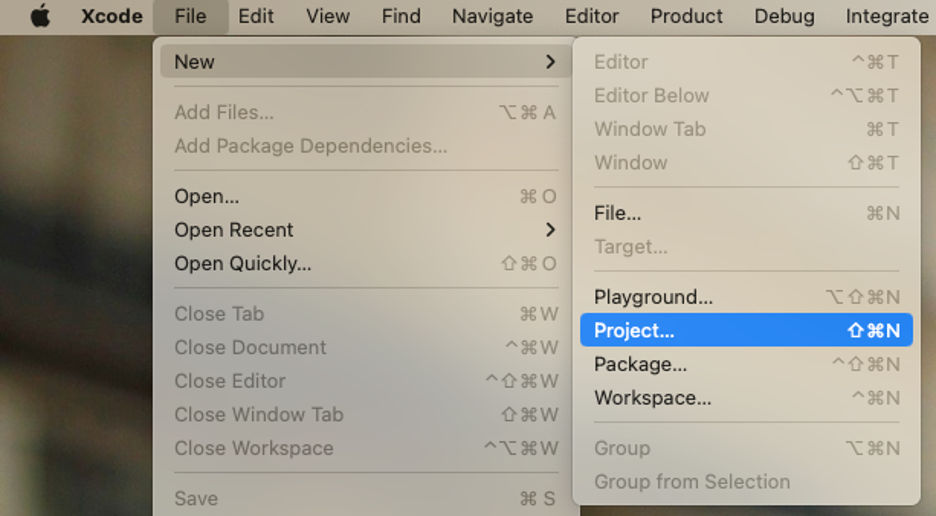
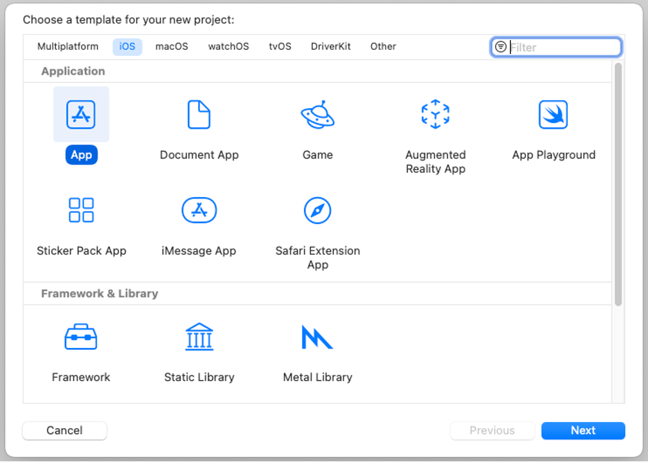
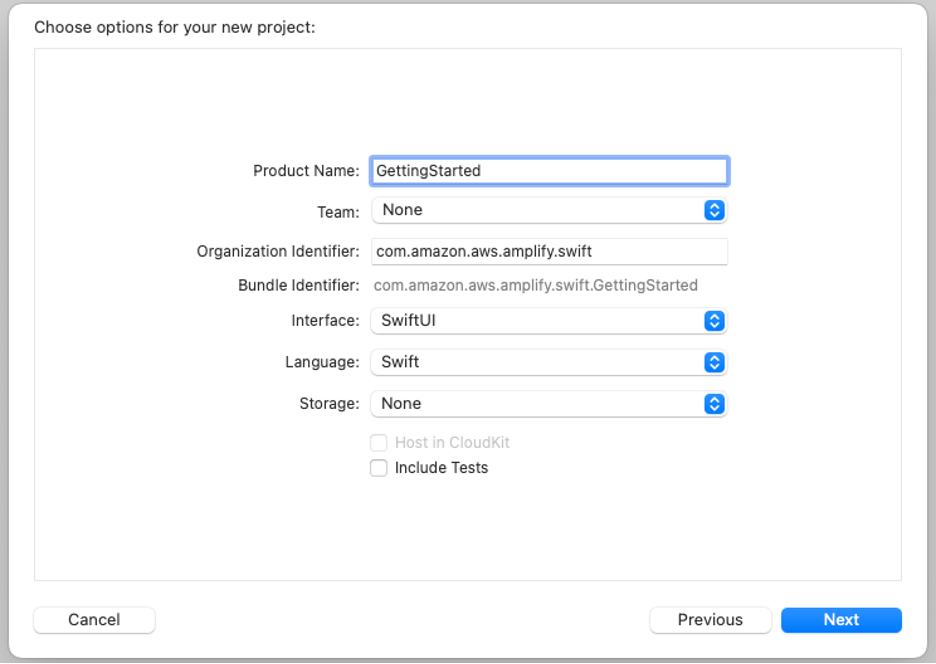
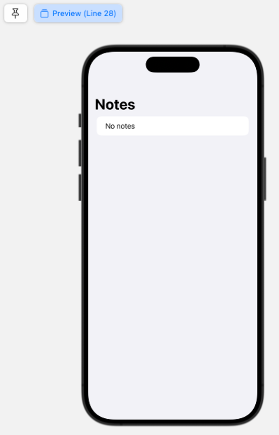
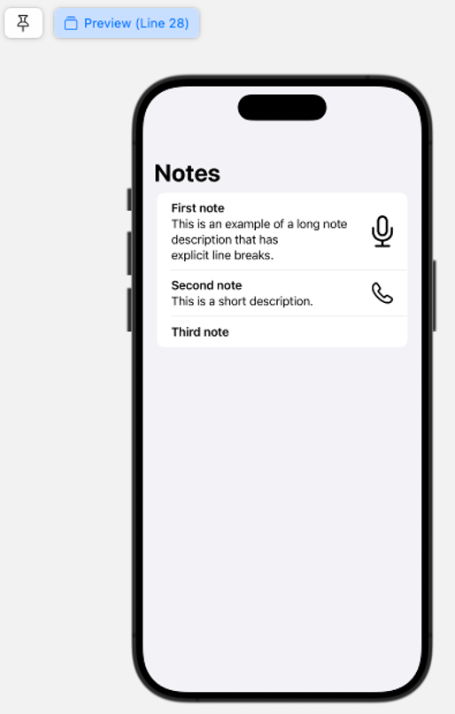

# Module 1: Create an iOS app

|                      |                                                                                                                                                                                                                                                                                              |
| -------------------- | -------------------------------------------------------------------------------------------------------------------------------------------------------------------------------------------------------------------------------------------------------------------------------------------- |
| **Time to complete** | > 10 minutes                                                                                                                                                                                                                                                                                 |
| **Key concepts**     | **SwiftUI** –<br>[SwiftUI](https://developer.apple.com/swiftui/ "https://developer.apple.com/swiftui/")<br>is a simple way to build user interfaces across all Apple platforms<br>with the power of<br>the [Swift](https://www.swift.org/ "https://www.swift.org/")<br>programming language. |
| **Services used**    | [AWS Amplify](https://aws.amazon.com/amplify/ "https://aws.amazon.com/amplify/")                                                                                                                                                                                                             |

## Overview

In this tutorial, you will set up your AWS account and development
environment. This will allow you to interact with your AWS account
and programmatically provision any resources you need.

## What you will accomplish

In this module, you will:

- Create an iOS application
- Update the main view
- Build and test your application

## Implementation

1. Start Xcode

Start **Xcode** and create a new
project by going to **File > New >
Project...** or by pressing \*\*Shift

- Cmd + N\*\*.

 2. Choose your app template

Choose **App** under
**iOS**,
**Application**, and then choose
**Next**.

 3. Name and configure the project

Type a name for your project, for example, **Getting
Started.** Make sure the
**Interface** is
**SwiftUI** and
**Language** is
**Swift**, then choose
**Next.**

 4. Finalize the project

Select a directory and choose
**Create** to create the project.

1. Create Note file

Create a new **Swift File** by
clicking the plus (**+**) at the
bottom of the navigation pane, or by
pressing **Cmd + N**.

Name the file \***\*Note.swift\*\***,
and add the following content:

```
import Foundation

struct Note {
    let id: String
    let name: String
    let description: String?
    let image: String?

    init(
        id: String = UUID().uuidString,
        name: String,
        description: String? = nil,
        image: String? = nil
    ) {
        self.id = id
        self.name = name
        self.description = description
        self.image = image
    }
}
```

This struct holds information about notes, such as a name,
description and image.

###### Note

Only the name is a
mandatory parameter in its initializer. 2. Create view for Note objects

Next, create another file
named \***\*NoteView.swift\*\*** with
the following content:

```
import SwiftUI

struct NoteView: View {
    @State var note: Note

    var body: some View {
        HStack(alignment: .center, spacing: 5.0) {
            VStack(alignment: .leading, spacing: 5.0) {
                Text(note.name)
                    .bold()
                if let description = note.description {
                    Text(description)
                }
            }

            if let image = note.image {
                Spacer()

                Divider()

                Image(systemName: image)
                    .resizable()
                    .aspectRatio(contentMode: .fill)
                    .frame(width: 30, height: 30)

            }
        }
    }
}
```

This defines a view that displays the information of a Note object,
including creating an Image from its image property. 3. Create view for Notes array

Create a new **SwiftUI View** file
named \***\*NotesView.swift\*\*** with
the following content:

```
import SwiftUI

struct NotesView: View {
    @State var notes: [Note] = []

    var body: some View {
        NavigationStack{
            List {
                if notes.isEmpty {
                    Text("No notes")
                }
                ForEach(notes, id: \.id) { note in
                    NoteView(note: note)
                }
            }
            .navigationTitle("Notes")
        }
    }
}

#Preview {
    NotesView()
}
```

This view will use the NoteView view to display all the notes in
the notes array. If the array is empty, it will show a "No
notes" message, as you can see in
the **Canvas**.

###### Note

If you do not see the
canvas, you can enable it by going
to **Editor > Canvas**. If you
see a **Preview paused** message,
you can resume it by pressing
the **↻** button next to it.

 4. Set and view Notes arguments

You can set the notes argument in
the **#Preview** block to test how
the view looks when the array is populated. For example:

```
#Preview {
    NotesView(notes: [
        Note(
            name: "First note",
            description: "This is an example of a long note description that has \nexplicit line breaks.",
            image: "mic"
        ),
        Note(
            name: "Second note",
            description: "This is a short description.",
            image: "phone"
        ),
        Note(
            name: "Third note"
        )
    ])
}
```

 5. Configure the App instance

Open the file that defines your App instance (for example, \***\*GettingStartedApp.swift\*\***)
and replace
the \***\*ContentView() initialization\*\***
with \***\*NotesView()\*\***.

Delete
the \***\*ContentView.swift\*\***
file, we will not be using it for this tutorial.

```
import SwiftUI

@main
struct GettingStartedApp: App {
    var body: some Scene {
        WindowGroup {
            NotesView()
        }
    }
}
```

Build and launch the app in the simulator by pressing
the **►** button in the toolbar.
Alternatively, you can also do it by going
to **Product > Run**, or by
pressing **Cmd + R**.

The iOS simulator will open and the app will run. As we are not
setting a notes array, the default empty array is used and the
"No notes" message is displayed.


## Conclusion

You have successfully created an iOS app. You are ready to start
building with Amplify!
