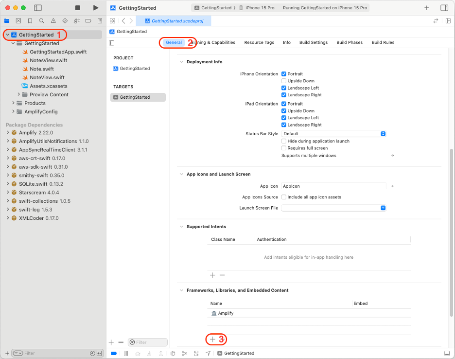
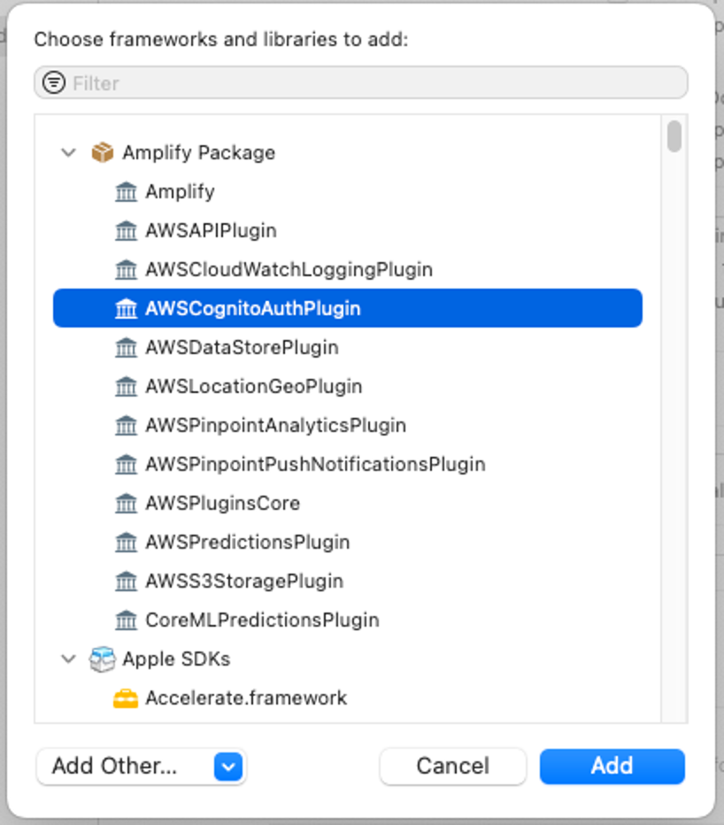
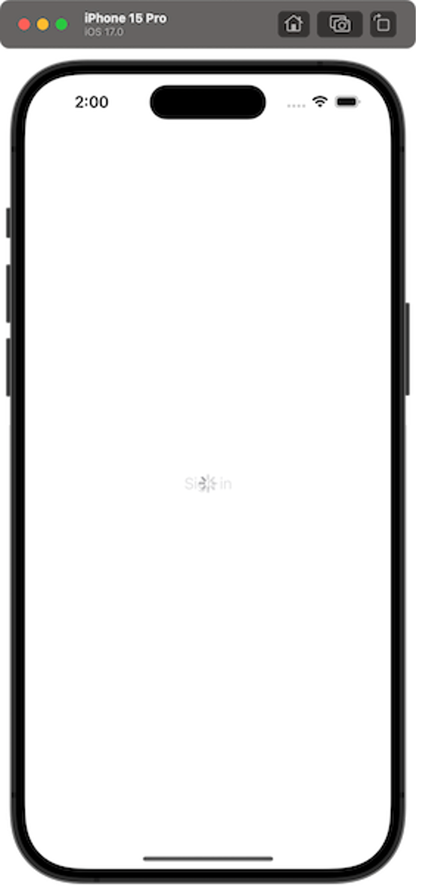
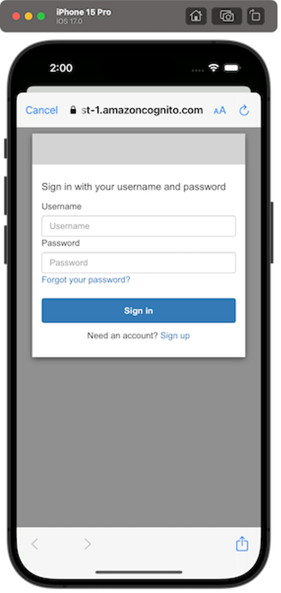
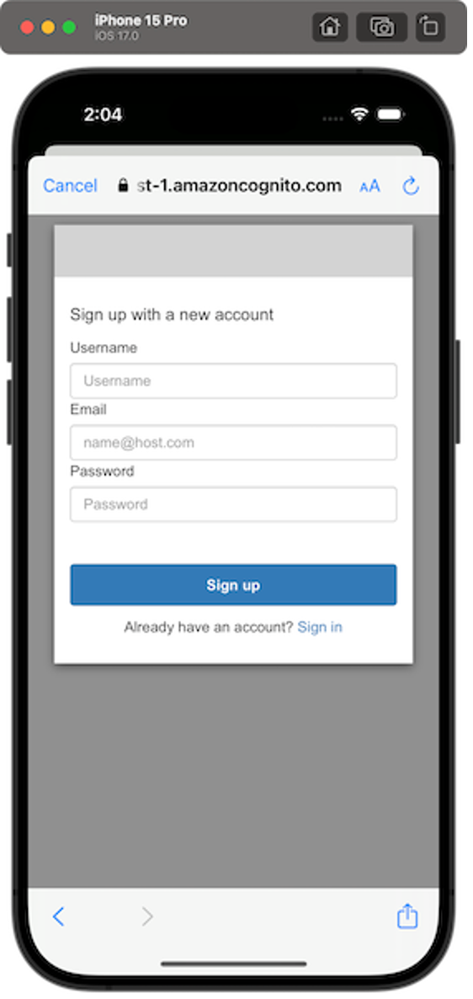
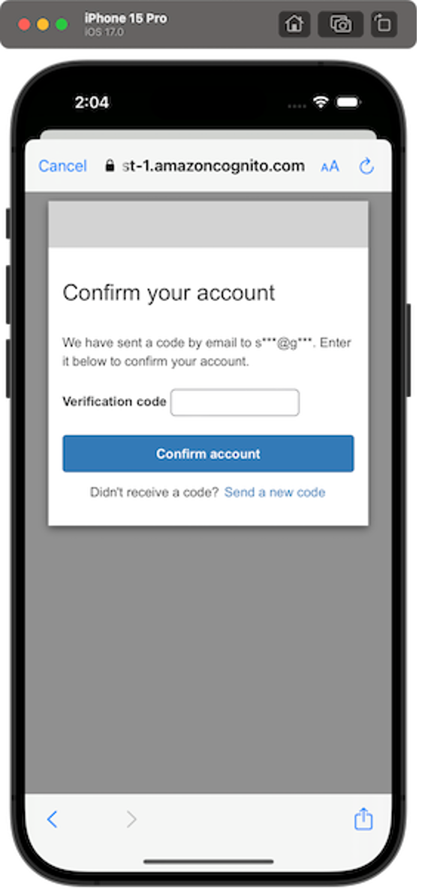
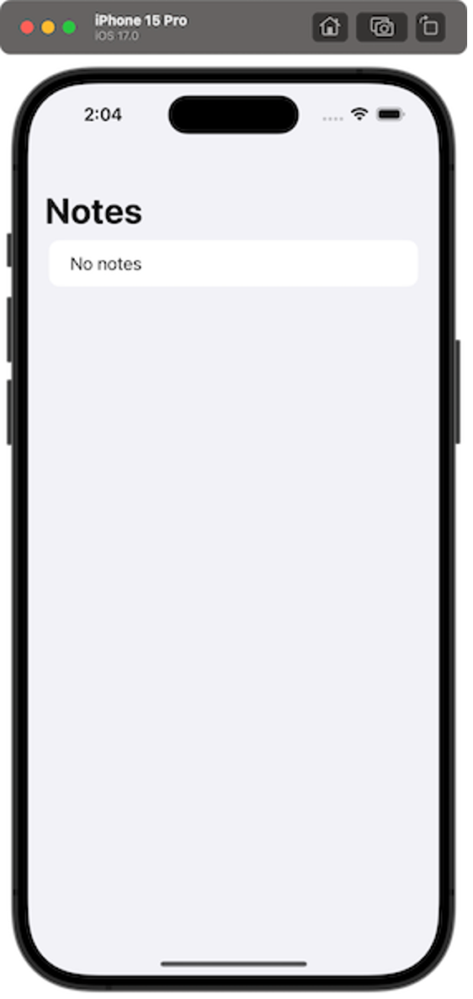

# Module 3: Add Authentication

|                      |                                                                                  |
| -------------------- | -------------------------------------------------------------------------------- | --------------------------------------------------------------------------------------------------------------------------------------------------------------------------------------------------------------------------------------------------------------------------------------------------------------------------------------------------------------------------------------------------------------------------------------------------------------------------------------------------------------------------------------------------------------------------------------------------------------------------------------------------------------------------------------------------------------------------------------------------------------------------------------------------------------------------------------------------------------------------------------------------------------------------------------------------------------------------------------------------------------------------------------------------------------------------------------------------------------------------------------------------------------------------------------------------------------------------------------------------------------------------------------------------------------------------------------------------------------------------------------------------------------------------------------------------------------------------------------------------------------------------------------------------------------------------------------------------------------------------------------------------------------------------------------------------------------------------------------------------------------------------------------------------------------------------------------------------------------------------------------------------------------------------------------------------------------------------------------------------------------------------------------------------------------------------------------------------------------------------------------------------------------------------------------------------------------------------------------------------------------------------------------------------------------------------------------------------------------------------------------------------------------------------------------------------------------------------------------------------------------------------------------------------------------------------------------------------------------------------------------------------------------------------------------------------------------------------------------------------------------------------------------------------------------------------------------------------------------------------------------------------------------------------------------------------------------------------------------------------------------------------------------------------------------------------------------------------------------------------------------------------------------------------------------------------------------------------------------------------------------------------------------------------------------------------------------------------------------------------------------------------------------------------------------------------------------------------------------------------------------------------------------------------------------------------------------------------------------------------------------------------------------------------------------------------------------------------------------------------------------------------------------------------------------------------------------------------------------------------------------------------------------------------------------------------------------------------------------------------------------------------------------------------------------------------------------------------------------------------------------------------------------------------------------------------------------------------------------------------------------------------------------------------------------------------------------------------------------------------------------------------------------------------------------------------------------------------------------------------------------------------------------------------------------------------------------------------------------------------------------------------------------------------------------------------------------------------------------------------------------------------------------------------------------------------------------------------------------------------------------------------------------------------------------------------------------------------------------------------------------------------------------------------------------------------------------------------------------------------------------------------------------------------------------------------------------------------------------------------------------------------------------------------------------------------------------------------------------------------------------------------------------------------------------------------------------------------------------------------------------------------------------------------------------------------------------------------------------------------------------------------------------------------------------------------------------------------------------------------------------------------------------------------------------------------------------------------------------------------------------------------------------------------------------------------------------------------------------------------------------------------------------------------------------------------------------------------------------------------------------------------------------------------------------------------------------------------------------------------------------------------------------------------------------------------------------------------------------------------------------------------------------------------------------------------------------------------------------------------------------------------------------------------------------------------------------------------------------------------------------------------------------------------------------------------------------------------------------------------------------------------------------------------------------------------------------------------------------------------------------------------------------------------------------------------------------------------------------------------------------------------------------------------------------------------------------------------------------------------------------------------------------------------------------------------------------------------------------------------------------------------------------------------------------------------------------------------------------------------------------------------------------------------------------------------------------------------------------------------------------------------------------------------------------------------------------------------------------------------------------------------------------------------------------------------------------------------------------------------------------------------------------------------------------------------------------------------------------------------------------------------------------------------------------------------------------------------------------------------------------------------------------------------------------------------------------------------------------------------------------------------------------------------------------------------------------------------------------------------------------------------------------------------------------------------------------------------------------------------------------------------------------------------------------------------------------------------------------------------------------------------------------------------------------------------------------------------------------------------------------------------------------------------------------------------------------------------------------------------------------------------------------------------------------------------------------------------------------------------------------------------------------------------------------------------------------------------------------------------------------------------------------------------------------------------------------------------------------------------------------------------------------------------------------------------------------------------------------------------------------------------------------------------------------------------------------------------------------------------------------------------------------------------------------------------------------------------------------------------------------------------------------------------------------------------------------------------------------------------------------------------------------------------------------------------------------------------------------------------------------------------------------------------------------------------------------------------------------------------------------------------------------------------------------------------------------------------------------------------------------------------------------------------------------------------------------------------------------------------------------------------------------------------------------------------------------------------------------------------------------------------------------------------------------- |
| **Time to complete** | 5 minutes                                                                        |
| **Services used**    | [AWS Amplify](https://aws.amazon.com/amplify/ "https://aws.amazon.com/amplify/") | ## Overview The next feature you will be adding is user authentication. In this module, you will learn how to authenticate a user with the Amplify CLI and libraries, using [Amazon Cognito](https://aws.amazon.com/cognito/ "https://aws.amazon.com/cognito/"), a managed user identity provider. You will also learn how to use the Amazon Cognito hosted UI (user interface) to present an entire user authentication flow, allowing users to sign up, sign in, and reset their password with just a few lines of code. Using a hosted UI means the application uses the Amazon Cognito web pages for the sign-in and sign-up UI flows. The user of the app is redirected to a web page hosted by Amazon Cognito and redirected back to the app after sign-in. Amplify also offers a native UI component for authentication flows. You can follow [these workshop instructions](https://amplify-ios-workshop.go-aws.com/70_add_custom_gui/30_customized_ui.html "https://amplify-ios-workshop.go-aws.com/70_add_custom_gui/30_customized_ui.html") to learn more. ## What you will accomplish In this module, you will:  • Create and deploy an authentication service  • Configure your iOS app to include Amazon Cognito hosted UI authentication ## Key concepts **Amplify libraries –** Using Amplify libraries you can interact with AWS services from a web or mobile application. **Authentication –** In software, authentication is the process of verifying and managing the identity of a user using an authentication service or API. ## Implementation 1. Add authorization To create the authentication service, open **Terminal** and run the following **command** in your project root directory: `amplify add auth` 2. Configure authorization options Select the following **options**, when prompted: `Do you want to use the default authentication and security configuration? ❯ Default configuration with Social Provider (Federation) How do you want users to be able to sign in? ❯ Username Do you want to configure advanced settings? ❯ No, I am done. What domain name prefix do you want to use? «default value» Enter your redirect signin URI: gettingstarted:// Do you want to add another redirect signin URI? (y/N) N Enter your redirect signout URI: gettingstarted:// Do you want to add another redirect signout URI? (y/N) N Select the social providers you want to configure for your user pool: «Do not select any and just press enter»` ###### Note Do not forget to type the redirect URIs. They are needed for the redirection for Amazon Cognito Hosted UI to work. 3. Deploy the service Run the following **command** to deploy the service: `amplify push` Press **Enter (Y)** when asked to continue. 1. Open the general tab To add the Amplify Authentication library to the dependencies of your project, navigate to the **General** tab of your Target application (Your Project > Targets > General). Select the **plus (+)** in the **Frameworks, Libraries, and Embedded Content** section.  2. Select the plugin Select **AWSCognitoAuthPlugin**,and choose **Add**.   • Configure authentication Navigate back to Xcode, and open the **GettingStartedApp.swift**file. To configure Amplify Authentication, you will need to: + Add the **import AWSCognitoAuthPlugin** statement. + Create the **AWSCognitoAuthPlugin** plugin and register it with. Your code should look like the following: `import Amplify import AWSCognitoAuthPlugin import SwiftUI @main struct GettingStartedApp: App { init() { do { try Amplify.add(plugin: AWSCognitoAuthPlugin()) try Amplify.configure() print("Initialized Amplify") } catch { print("Could not initialize Amplify: \(error)") } } var body: some Scene { WindowGroup { NotesView() } } }` Create a **new Swift file** named **AuthenticationService.swift** with the following content: `import Amplify import AuthenticationServices import AWSCognitoAuthPlugin import SwiftUI @MainActor class AuthenticationService: ObservableObject { @Published var isSignedIn = false func fetchSession() async { do { let result = try await Amplify.Auth.fetchAuthSession() isSignedIn = result.isSignedIn print("Fetch session completed. isSignedIn = \(isSignedIn)") } catch { print("Fetch Session failed with error: \(error)") } } func signIn(presentationAnchor: ASPresentationAnchor) async { do { let result = try await Amplify.Auth.signInWithWebUI( presentationAnchor: presentationAnchor, options: .preferPrivateSession() ) isSignedIn = result.isSignedIn print("Sign In completed. isSignedIn = \(isSignedIn)") } catch { print("Sign In failed with error: \(error)") } } func signOut() async { guard let result = await Amplify.Auth.signOut() as? AWSCognitoSignOutResult else { return } switch result { case .complete, .partial: isSignedIn = false case .failed: break } print("Sign Out completed. isSignedIn = \(isSignedIn)") } }` This class takes care of handling authentication by relying on Amplify's HostedUI capabilities, while also informing whether a user is signed in or not. 1. Create authentication for signing in Create a **new Swift file** named **LandingView.swift** with the following content: `import AuthenticationServices import SwiftUI struct LandingView: View { @EnvironmentObject private var authenticationService: AuthenticationService @State private var isLoading = true var body: some View { ZStack { if isLoading { ProgressView() } Group { if authenticationService.isSignedIn { NotesView() } else { Button("Sign in") { Task { await authenticationService.signIn(presentationAnchor: window) } } } } .opacity(isLoading ? 0.5 : 1) .disabled(isLoading) } .task { isLoading = true await authenticationService.fetchSession() if !authenticationService.isSignedIn { await authenticationService.signIn(presentationAnchor: window) } isLoading = false } } private var window: ASPresentationAnchor { if let delegate = UIApplication.shared.connectedScenes.first?.delegate as? UIWindowSceneDelegate, let window = delegate.window as? UIWindow { return window } return ASPresentationAnchor() } }` This view takes care of the following:  • Before the view first appears, it will fetch the current user status using the **authenticationService**property. This is done in the view's **task(priority:\_:)** method.  • If the user is signed in, it will display the **NotesView**.  • If the user is not signed in, it will automatically invoke the HostedUI workflow. If the user does not sign in and closes that workflow, a "Sign In" button will be displayed that can be used to start the authentication workflow again. We've marked the authenticationService variable with a **@EnvironmentObject**property wrapper annotation, meaning we need to set it using the **environmentObject(\_:)**view modifier on an ancestor view. Update the **GettingStartedApp.swift** file body to create this view instead, and to set the **AuthenticationService**object with the following: `var body: some Scene { WindowGroup { LandingView() .environmentObject(AuthenticationService()) } }` 2. Create authentication for signing out Open the **NotesView.swift**file and replace its contents with the following: `struct NotesView: View { @EnvironmentObject private var authenticationService: AuthenticationService @State var notes: [Note] = [] var body: some View { NavigationStack { List { if notes.isEmpty { Text("No notes") } ForEach(notes, id: \.id) { note in NoteView(note: note) } } .navigationTitle("Notes") .toolbar { Button("Sign Out") { Task { await authenticationService.signOut() } } } } } }` We've added a **Sign Out** button in the toolbar that calls **authenticationService.signOut()**. As this object has already been added when creating the LandingView ancestor, we don't need to do anything else. Build and launch the app in the simulator by pressing the **►** button in the toolbar. Alternatively, you can also do it by going to **Product -> Run**, or by pressing **Cmd + R**. The iOS simulator will open and the app should prompt you to sign in first. Once you've finished that process, the Notes view will display with a **Sign Out** button at the top right. If you choose it, you should land in the Sign in view again. #### Landing view  #### Hosted UI: Sign in  #### Hosted UI: Sign up  #### Hosted UI: Confirmation  #### List of notes  |
