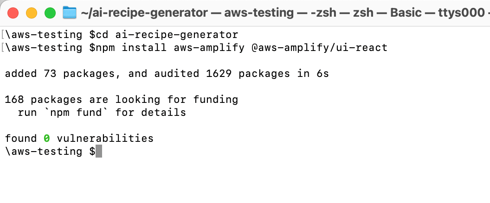
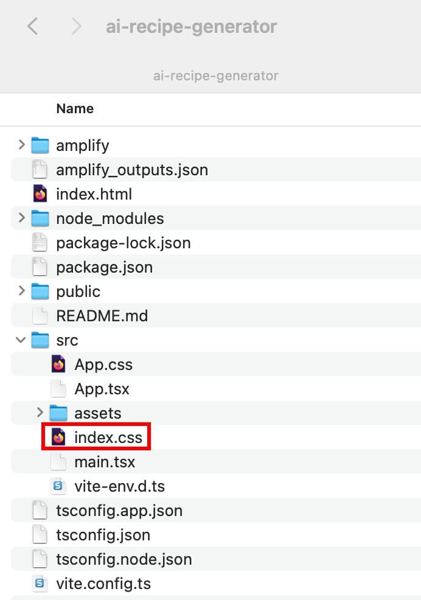
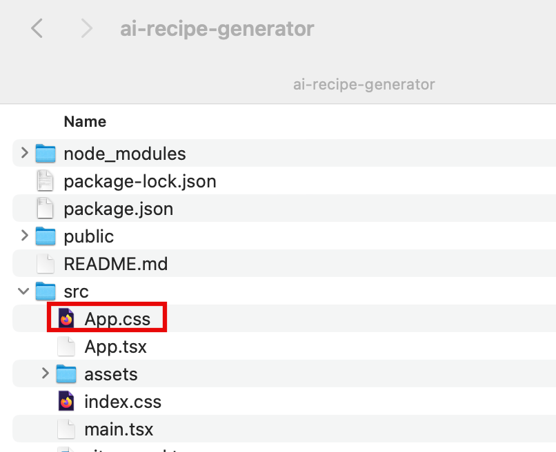
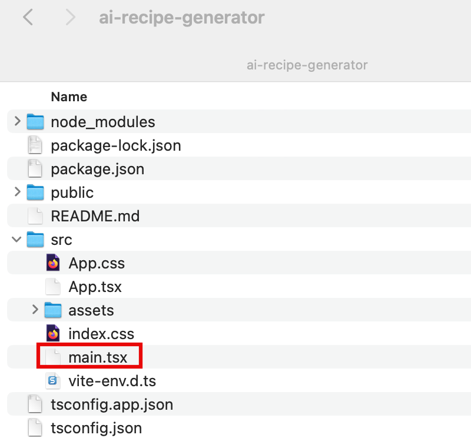
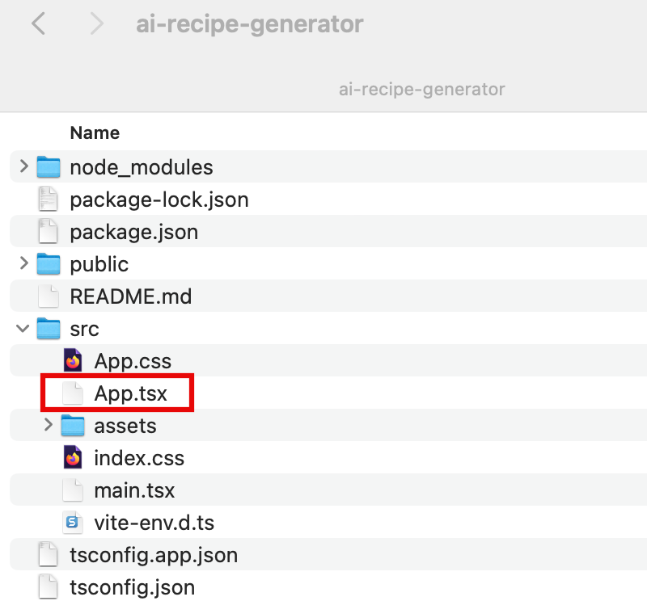
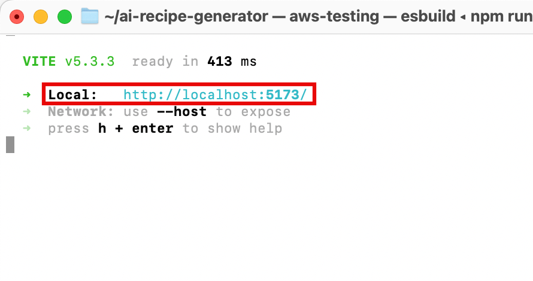
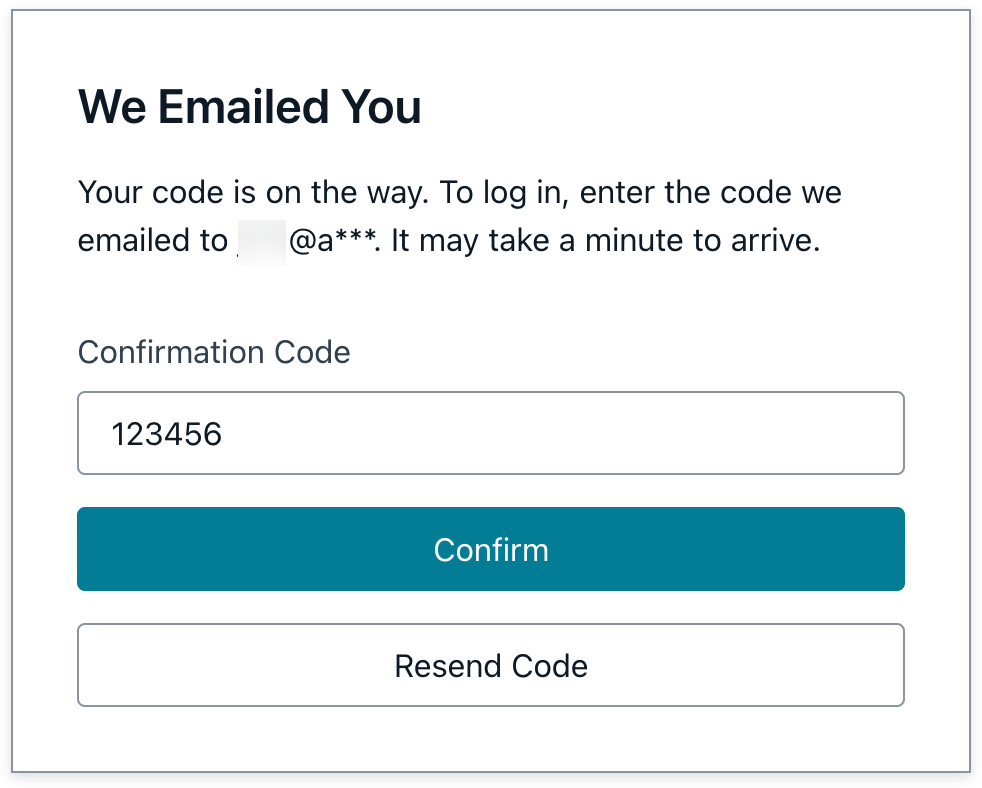
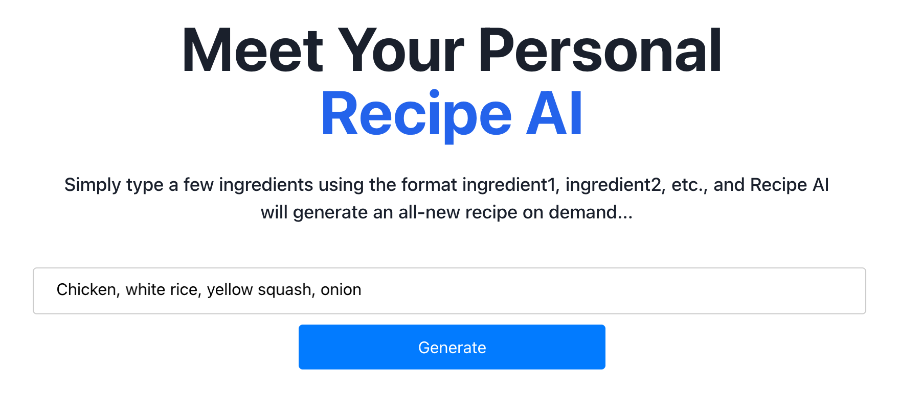

# Task 5: Build the Frontend

|                      |                                                                                                                                                                                                                                                                                                                                                      |
| -------------------- | ---------------------------------------------------------------------------------------------------------------------------------------------------------------------------------------------------------------------------------------------------------------------------------------------------------------------------------------------------- | ------------------------------------------------------------------------------------------------------------------------------------------------------------------------------------------------------------------------------------------------------------------------------------------------------------------------------------------------------------------------------------------------------------------------------------------------------------------------------------------------------------------------------------------------------------------------------------------------------------------------------------------------------------------------------------------------------------------------------------------------------------------------------------------------------------------------------------------------------------------------------------------------------------------------------------------------------------------------------------------------------------------------------------------------------------------------------------------------------------------------------------------------------------------------------------------------------------------------------------------------------------------------------------------------------------------------------------------------------------------------------------------------------------------------------------------------------------------------------------------------------------------------------------------------------------------------------------------------------------------------------------------------------------------------------------------------------------------------------------------------------------------------------------------------------------------------------------------------------------------------------------------------------------------------------------------------------------------------------------------------------------------------------------------------------------------------------------------------------------------------------------------------------------------------------------------------------------------------------------------------------------------------------------------------------------------------------------------------------------------------------------------------------------------------------------------------------------------------------------------------------------------------------------------------------------------------------------------------------------------------------------------------------------------------------------------------------------------------------------------------------------------------------------------------------------------------------------------------------------------------------------------------------------------------------------------------------------------------------------------------------------------------------------------------------------------------------------------------------------------------------------------------------------------------------------------------------------------------------------------------------------------------------------------------------------------------------------------------------------------------------------------------------------------------------------------------------------------------------------------------------------------------------------------------------------------------------------------------------------------------------------------------------------------------------------------------------------------------------------------------------------------------------------------------------------------------------------------------------------------------------------------------------------------------------------------------------------------------------------------------------------------------------------------------------------------------------------------------------------------------------------------------------------------------------------------------------------------------------------------------------------------------------------------------------------------------------------------------------------------------------------------------------------------------------------------------------------------------------------------------------------------------------------------------------------------------------------------------------------------------------------------------------------------------------------------------------------------------------------------------------------------------------------------------------------------------------------------------------------------------------------------------------------------------------------------------------------------------------------------------------------------------------------------------------------------------------------------------------------------------------------------------------------------------------------------------------------------------------------------------------------------------------------------------------------------------------------------------------------------------------------------------------------------------------------------------------------------------------------------------------------------------------------------------------------------------------------------------------------------------------------------------------------------------------------------------------------------------------------------------------------------------------------------------------------------------------------------------------------------------------------------------------------------------------------------------------------------------------------------------------------------------------------------------------------------------------------------------------------------------------------------------------------------------------------------------------------------------------------------------------------------------------------------------------------------------------------------------------------------------------------------------------------------------------------------------------------------------------------------------------------------------------------------------------------------------------------------------------------------------------------------------------------------------------------------------------------------------------------------------------------------------------------------------------------------------------------------------------------------------------------------------------------------------------------------------------------------------------------------------------------------------------------------------------------------------------------------------------------------------------------------------------------------------------------------------------------------------------------------------------------------------------------------------------------------------------------------------------------------------------------------------------------------------------------------------------------------------------------------------------------------------------------------------------------------------------------------------------------------------------------------------------------------------------------------------------------------------------------------------------------------------------------------------------------------------------------------------------------------------------------------------------------------------------------------------------------------------------------------------------------------------------------------------------------------------------------------------------------------------------------------------------------------------------------------------------------------------------------------------------------------------------------------------------------------------------------------------------------------------------------------------------------------------------------------------------------------------------------------------------------------------------------------------------------------------------------------------------------------------------------------------------------------------------------------------------------------------------------------------------------------------------------------------------------------------------------------------------------------------------------------------------------------------------------------------------------------------------------------------------------------------------------------------------------------------------------------------------------------------------------------------------------------------------------------------------------------------------------------------------------------------------------------------------------------------------------------------------------------------------------------------------------------------------------------------------------------------------------------------------------------------------------------------------------------------------------------------------------------------------------------------------------------------------------------------------------------------------------------------------------------------------------------------------------------------------------ |
| **Time to complete** | 5 minutes                                                                                                                                                                                                                                                                                                                                            |
| **Get help**         | [Troubleshooting Amplify](https://docs.amplify.aws/react/build-a-backend/troubleshooting/ "https://docs.amplify.aws/react/build-a-backend/troubleshooting/") [Troubleshooting common issues using Amplify UI](https://ui.docs.amplify.aws/react/getting-started/troubleshooting "https://ui.docs.amplify.aws/react/getting-started/troubleshooting") | ## Overview In this task, you will update the website you created in module one to use the Amplify UI component library to scaffold out an entire user authentication flow, allowing users to sign up, sign in, and reset their password and invoke the GraphQL API to use the customer query for generating recipe based on a list of ingredients. ## What you will accomplish In this tutorial, you will:  • Install the Amplify client libraries  • Configure your React app to add the authentication flow and invoke the GraphQL API ## Implementation You will need two Amplify libraries for your project. The main **aws-amplify library** contains all of the client-side APIs for connecting your app's frontend to your backend, and the **@aws-amplify/ui-react** library contains framework-specific UI components.  • Install the libraries **Open** a new terminal window, **navigate** to your projects root folder (**ai-recipe-generator**), and **run** the following command to install the libraries. `npm install aws-amplify @aws-amplify/ui-react`  1. Modify the Index CSS On your local machine, navigate to the \***\*ai-recipe-generator/src/index.css\*\*** file, and **update** it with the following code to center the App UI. Then, **save** the file. `:root { font-family: Inter, system-ui, Avenir, Helvetica, Arial, sans-serif; line-height: 1.5; font-weight: 400; color: rgba(255, 255, 255, 0.87); font-synthesis: none; text-rendering: optimizeLegibility; -webkit-font-smoothing: antialiased; -moz-osx-font-smoothing: grayscale; max-width: 1280px; margin: 0 auto; padding: 2rem; } .card { padding: 2em; } .read-the-docs { color: #888; } .box:nth-child(3n + 1) { grid-column: 1; } .box:nth-child(3n + 2) { grid-column: 2; } .box:nth-child(3n + 3) { grid-column: 3; }`  2. Modify the App CSS **Update** the _src/App.css_ file with the following code to style the ingredients form. Then, **save** the file. `.app-container { margin: 0 auto; padding: 20px; text-align: center; } .header-container { padding-bottom: 2.5rem; margin:  auto; text-align: center; align-items: center; max-width: 48rem; } .main-header { font-size: 2.25rem; font-weight: bold; color: #1a202c; } .main-header .highlight { color: #2563eb; } @media (min-width: 640px) { .main-header { font-size: 3.75rem; } } .description { font-weight: 500; font-size: 1.125rem; max-width: 65ch; color: #1a202c; } .form-container { margin-bottom: 20px; } .search-container { display: flex; flex-direction: column; gap: 10px; align-items: center; } .wide-input { width: 100%; padding: 10px; font-size: 16px; border: 1px solid #ccc; border-radius: 4px; } .search-button { width: 100%; /* Make the button full width */ max-width: 300px; /* Set a maximum width for the button */ padding: 10px; font-size: 16px; background-color: #007bff; color: white; border: none; border-radius: 4px; cursor: pointer; } .search-button:hover { background-color: #0056b3; } .result-container { margin-top: 20px; transition: height 0.3s ease-out; overflow: hidden; } .loader-container { display: flex; flex-direction: column; align-items: center; gap: 10px; } .result { background-color: #f8f9fa; border: 1px solid #e9ecef; border-radius: 4px; padding: 15px; white-space: pre-wrap; word-wrap: break-word; color: black; font-weight: bold; text-align: left; /* Align text to the left */ }`  1. Add authentication On your local machine, navigate to the **ai-recipe-generator/src/main.tsx** file, and **update** it with the following code. Then, **save** the file.  • The code will use the Amplify Authenticator component to scaffold out an entire user authentication flow allowing users to sign up, sign in, reset their password, and confirm sign-in for multifactor authentication (MFA). `import React from "react"; import ReactDOM from "react-dom/client"; import App from "./App.jsx"; import "./index.css"; import { Authenticator } from "@aws-amplify/ui-react"; ReactDOM.createRoot(document.getElementById("root")!).render( <React.StrictMode> <Authenticator> <App /> </Authenticator> </React.StrictMode> );`  2. Configure the Amplify library **Open** the \***\*ai-recipe-generator/src/App.tsx\*\*** file, and **update** it with [this code](https://d1.awsstatic.com/onedam/marketing-channels/website/aws/en_US/getting-started/approved/assets/build-serverless-web-app-gen-ai-mod-5-tutorial-app-tsx.pdf "https://d1.awsstatic.com/onedam/marketing-channels/website/aws/en_US/getting-started/approved/assets/build-serverless-web-app-gen-ai-mod-5-tutorial-app-tsx.pdf"). Then, **save** the file.  • The code starts by configuring the Amplify library with the client configuration file (**amplify_outputs.json)**. It then generates a data client using the **generateClient()**function. The app presents a form to users for submitting a list of ingredients. Once submitted, it will use the data client to pass the list to the **askBedrock** query and retrieve the generated recipe then display it to the user.  3. Launch the app **Open** a new terminal window, **navigate** to your projects root directory (**ai-recipe-generator**), and **run** the following command to launch the app: `npm run dev` 4. Open the app Select the **Local host link** to open the Vite + React application.  5. Create an account Choose the **Create Account** tab, and use the authentication flow to create a new user by entering your **email address** and a **password**. Then, choose **Create Account**.  6. Enter verification code You will get a verification code sent to your email. Enter the **verification code** to log in to the app.  7. Generate recipes When signed in, you can start **inputting ingredients** and **generating recipes.**  8. Push changes In the open terminal window, **run** the following command to push the changes to GitHub: `git add . git commit -m 'connect to bedrock' git push origin main`  9. View your changes **Sign in** to the AWS Management console in a new browser window, and **open** the AWS Amplify console at [https://console.aws.amazon.com/amplify/apps](https://console.aws.amazon.com/amplify/apps "https://console.aws.amazon.com/amplify/apps"). AWS Amplify automatically builds your source code and deployed your app at \***\*https://...amplifyapp.com\*\***, and on every git push your deployment instance will update. Select the **Visit deployed URL** button to see your web app up and running live.  ## Conclusion You have now connected your app to the Amplify backend and built a frontend to generate a recipe based on a list of ingredients submitted by the user. |
