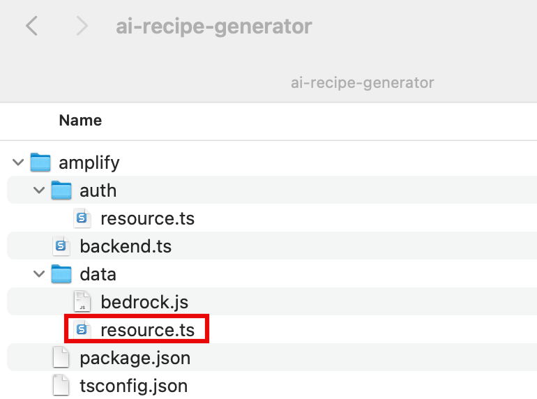
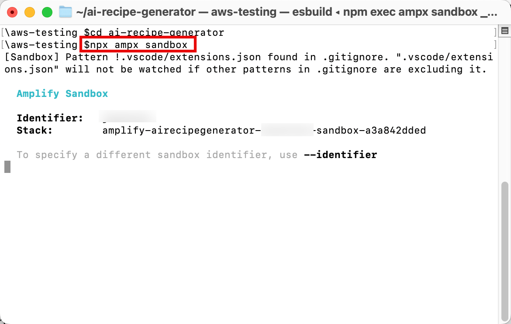
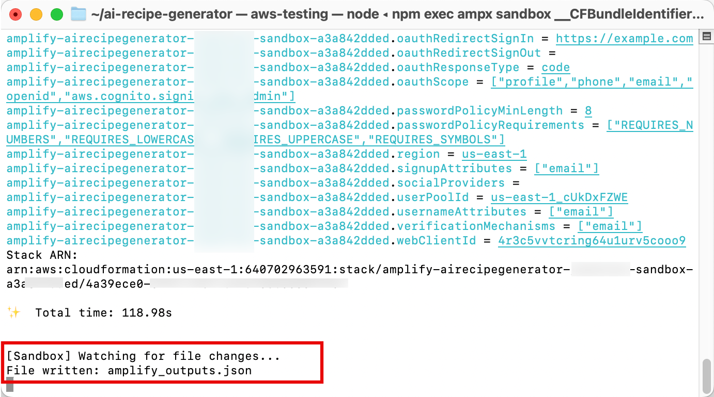
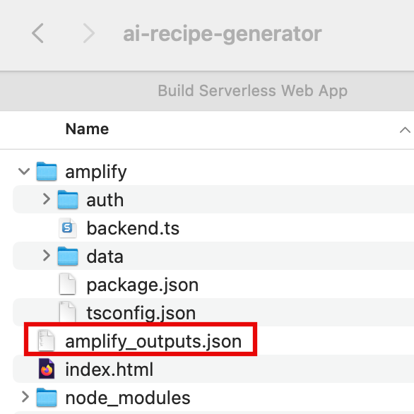

# Task 4: Deploy the Backend API

## Overview

In this task, you will configure a custom query that will
reference the data source and the resolver you defined
the previous model to produce a recipe based on a list of
ingredients. This query will use a custom type to structure the
response from Amazon Bedrock. 

## What you will accomplish

In this tutorial, you will:

- Define a GraphQL Query that takes an array of strings
- Define a custom type to be used to structure the response from
  the query

## Implementation

|                      |                                                                                                                                                                                                                                                                                                       |
| -------------------- | ----------------------------------------------------------------------------------------------------------------------------------------------------------------------------------------------------------------------------------------------------------------------------------------------------- |
| **Time to complete** | 5 minutes                                                                                                                                                                                                                                                                                             |
| **Get help**         | [Troubleshooting<br>Amplify](https://docs.amplify.aws/react/build-a-backend/troubleshooting/ "https://docs.amplify.aws/react/build-a-backend/troubleshooting/")<br>[Learn<br>about Data](https://docs.amplify.aws/react/build-a-backend/data/ "https://docs.amplify.aws/react/build-a-backend/data/") |

1. Update the resource.ts file

On your local machine, navigate to the
**ai-recipe-generator/amplify/data/resource.ts**
file, and **update** it with the
following code. Then, **save** the
file.

    * The following code defines the **askBedrock**
     query that takes an array of strings called
     **ingredients** and returns a
     **BedrockResponse**. The
     **.handler(a.handler.custom({ entry:
     "./bedrock.js", dataSource: "bedrockDS"
     }))** line sets up a custom handler for this query,
     defined in **bedrock.js**, using
     **bedrockDS** as its data source.

```
import { type ClientSchema, a, defineData } from "@aws-amplify/backend";

const schema = a.schema({
  BedrockResponse: a.customType({
    body: a.string(),
    error: a.string(),
  }),
  askBedrock: a
    .query()
    .arguments({ ingredients: a.string().array() })
    .returns(a.ref("BedrockResponse"))
    .authorization((allow) => [allow.authenticated()])
    .handler(
      a.handler.custom({
        entry: "./bedrock.js",
        dataSource: "bedrockDS"
      })
    ),
});

export type Schema = ClientSchema<typeof schema>;

export const data = defineData({
  schema,
  authorizationModes: {
    defaultAuthorizationMode: "apiKey",
    apiKeyAuthorizationMode: {
      expiresInDays: 30,
    },
  },
});
```

 2. Deploy resources

**Open** a new terminal window, **navigate** to your apps project folder (ai-recipe-generator), and
**run** the following command to deploy cloud resources
into an isolated development space so you can iterate fast.

```
npx ampx sandbox
```

 3. View confirmation message

After the cloud sandbox has been fully deployed, your terminal will display a
confirmation message.

 4. Verify outputs file creation

Verify that the _amplify_outputs.json_ file was
**generated** and **added** to your project.



## Conclusion

You have configured a GraphQL API to define a custom query to
connect to Amazon Bedrock and generate recipes based on a list of
ingredients.
