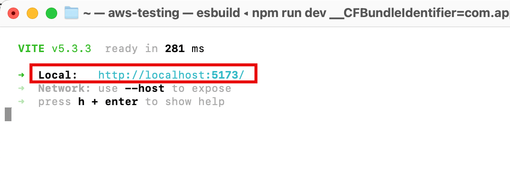
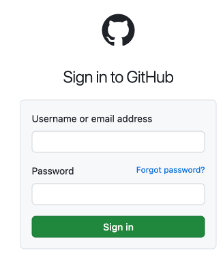
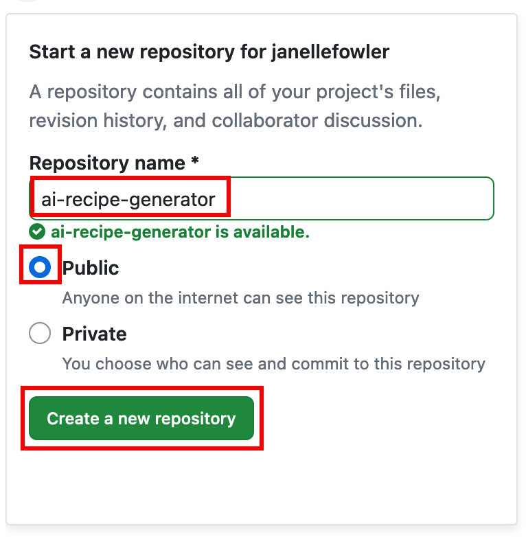
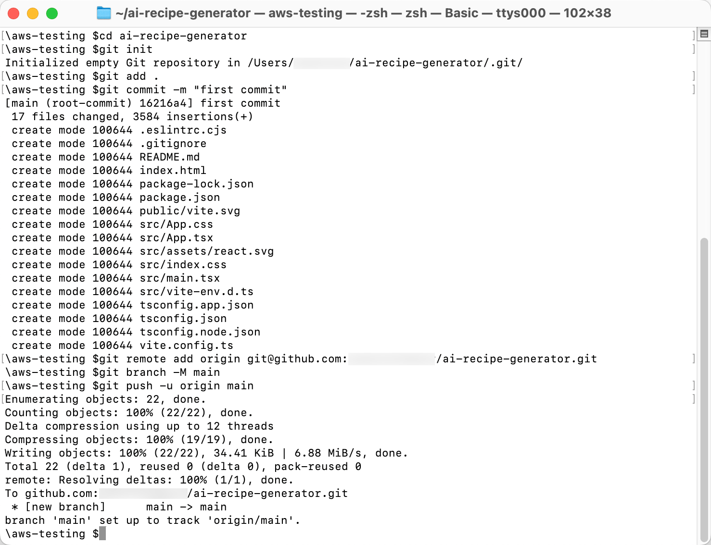
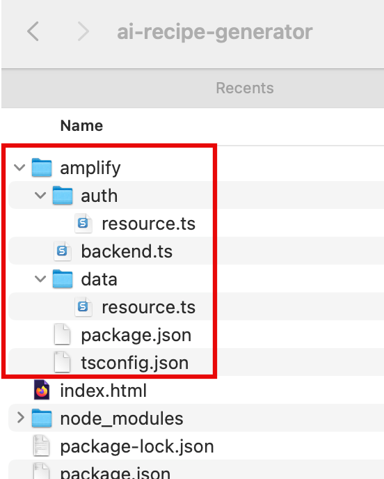
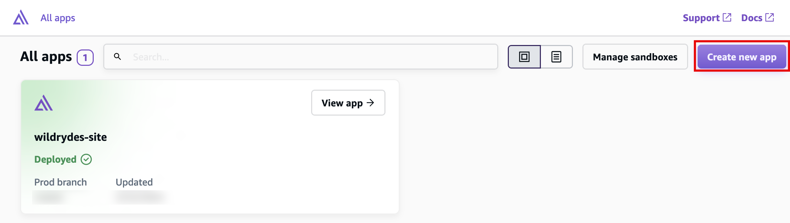
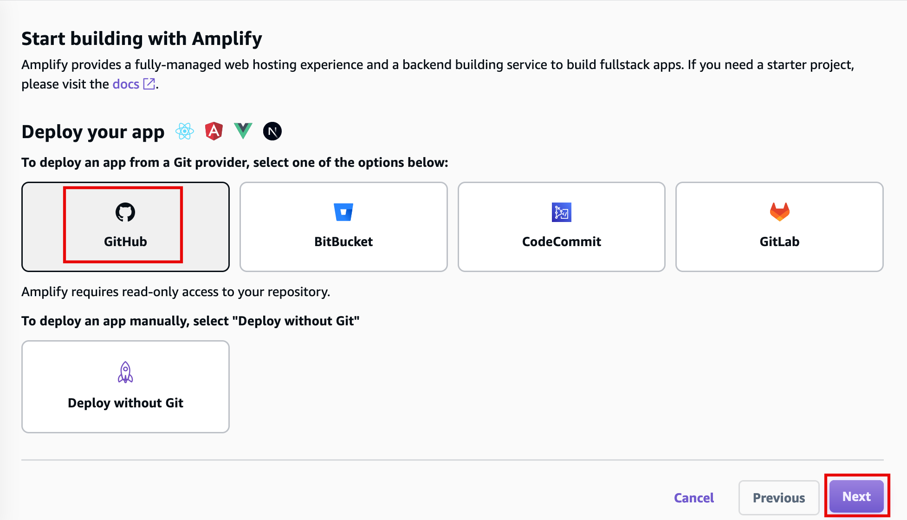
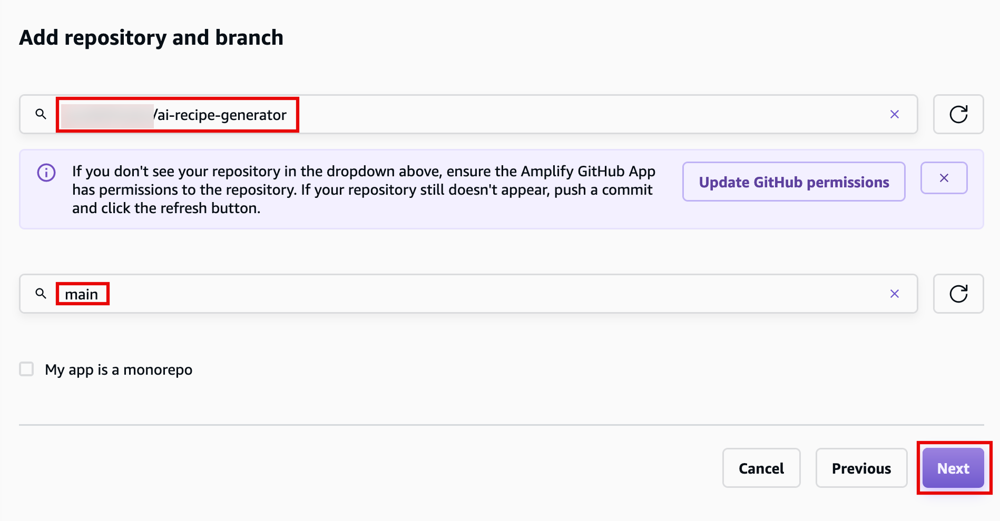
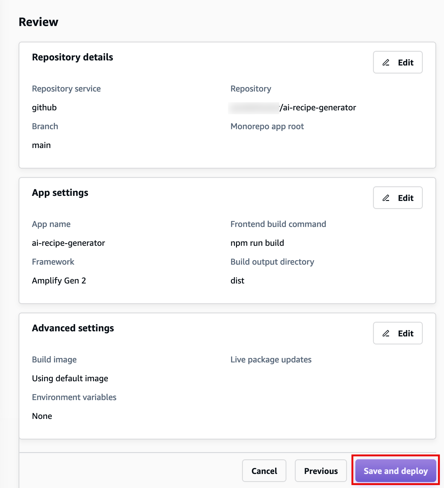

# Task 1: Host a Static Website

|                      |                                                                                                                                                                                                                                                                                                                                                                                                                                              |
| -------------------- | -------------------------------------------------------------------------------------------------------------------------------------------------------------------------------------------------------------------------------------------------------------------------------------------------------------------------------------------------------------------------------------------------------------------------------------------- |
| **Time to complete** | 5 minutes                                                                                                                                                                                                                                                                                                                                                                                                                                    |
| **Requires**         | • A GitHub account<br>• GitHub SSH connection                                                                                                                                                                                                                                                                                                                                                                                                |
| **Get help**         | [Troubleshooting Amplify](https://docs.amplify.aws/react/build-a-backend/troubleshooting/ "https://docs.amplify.aws/react/build-a-backend/troubleshooting/")<br>[How Amplify<br>works](https://docs.amplify.aws/react/how-amplify-works/ "https://docs.amplify.aws/react/how-amplify-works/")<br>[Learn about<br>Hosting](https://docs.amplify.aws/react/deploy-and-host/hosting/ "https://docs.amplify.aws/react/deploy-and-host/hosting/") |

## Overview

AWS Amplify offers a Git-based CI/CD workflow for building,
deploying, and hosting single-page web applications or static
sites with backends. When connected to a Git repository, Amplify
determines the build settings for both the frontend framework and
any configured backend resources, and automatically deploys
updates with every code commit.

In this task, you will start by creating a new React application
and pushing it to a GitHub repository. You will then connect the
repository to AWS Amplify web hosting and deploy it to a globally
available content delivery network (CDN) hosted on an
**amplifyapp.com** domain.

## What you will accomplish

In this tutorial, you will:

- Create a new web application
- Set up Amplify on your project

## Implementation

1. Create the application

In a new terminal or command line window, run the following
command to use Vite to create a React application:

```
npm create vite@latest ai-recipe-generator -- --template react-ts -y
cd ai-recipe-generator
npm install
npm run dev

```

 2. Open the application

In the terminal window, select and open the Local link to view the
Vite + React application.


In this step, you will create a GitHub repository and commit your
code to the repository. You will need a GitHub account to complete
this step, if you do not have an account,
[sign up here](https://github.com/ "https://github.com/").

###### Note

If you have never used
GitHub on your computer, follow
[these
steps](https://docs.github.com/en/authentication/connecting-to-github-with-ssh "https://docs.github.com/en/authentication/connecting-to-github-with-ssh") before continuing to allow connection to your account.

1. Sign in to GitHub

**Sign in** to GitHub at
[https://github.com/](https://github.com/ "https://github.com/").

 2. Start a new repository

In the **Start a new repository**
section, make the following selections:

    * For **Repository name**, enter
     **ai-recipe-generator**, and
     choose the **Public** radio
     button.
    * Then select, **Create a new
     repository**.

 3. Initialize Git

**Open** a new terminal window,
**navigate** to your projects root
folder (**ai-recipe-generator**), and
**run** the following commands to
initialize a git and push of the application to the new GitHub
repo:

###### Note

Replace the
**SSH GitHub URL** in the command
with your GitHub URL.

```
git init
git add .
git commit -m "first commit"
git remote add origin git@github.com:<your-username>/ai-recipe-generator.git
git branch -M main
git push -u origin main

```



1. Install Amplify

Open a new terminal window, navigate to your app's root folder
(**ai-recipe-generator**), and run the following
command:

```
npm create amplify@latest -y
```

 2. View directory

Running the previous command will scaffold a lightweight Amplify
project in the app’s directory.



1. **Sign in** to the AWS Management Console in a new browser window,
   and **open** the AWS Amplify console at [https://console.aws.amazon.com/amplify/apps](https://console.aws.amazon.com/amplify/apps "https://console.aws.amazon.com/amplify/apps").

Choose **Create new app**.

 2. Select GitHub to deploy your app

On the **Start building with Amplify** page, for
**Deploy your app**, select **GitHub**, and select **Next**.

 3. Authenticate with GitHub

When prompted, **authenticate** with GitHub. You will
be automatically redirected back to the Amplify console.

Choose the **repository** and **main branch** you created earlier.

Then select **Next**.

 4. Select Next

Leave the default **build settings**, and select
**Next**.

 5. Review configuration

Review the inputs selected, and choose **Save and
deploy**.

 6. View your app

AWS Amplify will now **build** your source code and
**deploy** your app at \***\*https://...amplifyapp.com\*\***, and on every git push
your deployment instance will update. It may take up to 5 minutes to deploy your app.

Once the build completes, select the **Visit deployed
URL** button to see your web app up and running live.


## Conclusion

You have deployed a React application to AWS by integrating with
GitHub and using AWS Amplify. With AWS Amplify, you can continuously
deploy your application in the Cloud and host it on a globally
available CDN.
