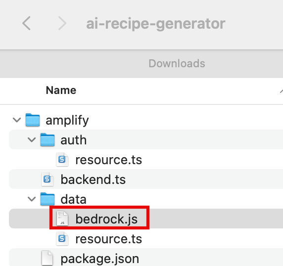
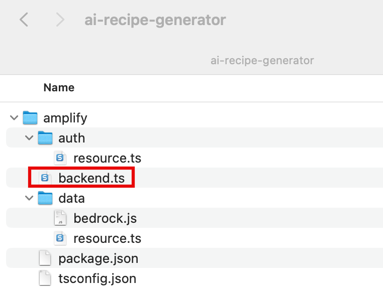

# Task 3: Build a Serverless Backend

|                      |                                                                                                                                                                                                                                                                                                                                                                                                            |
| -------------------- | ---------------------------------------------------------------------------------------------------------------------------------------------------------------------------------------------------------------------------------------------------------------------------------------------------------------------------------------------------------------------------------------------------------- |
| **Time to complete** | 10 minutes                                                                                                                                                                                                                                                                                                                                                                                                 |
| **Requires**         | A text editor. Here are a few free ones:<br>• [Atom](https://atom.io/ "https://atom.io/")<br>• [Notepad++](https://notepad-plus-plus.org/ "https://notepad-plus-plus.org/")<br>• [Sublime](https://www.sublimetext.com/ "https://www.sublimetext.com/")<br>• [Vim](https://www.vim.org/ "https://www.vim.org/")<br>• [Visual Studio Code](https://code.visualstudio.com/ "https://code.visualstudio.com/") |
| **Get help**         | [Troubleshooting<br>Lambda Functions](https://docs.amplify.aws/react/build-a-backend/functions/ "https://docs.amplify.aws/react/build-a-backend/functions/")                                                                                                                                                                                                                                               |

## Overview

In this task, you will configure a serverless function using AWS Amplify and AWS Lambda. This function takes an input parameter
i.e. ingredients to generate a prompt. It then sends this prompt
to Amazon Bedrock via an HTTP POST request to the Claude 3 Sonnet
model. The body of the request includes the prompt string within a
messages array.

## What you will accomplish

In this tutorial, you will:

- Add Amazon Bedrock as a data source
- Configure custom business logic handler code

## Implementation

1. Create a Lambda function

On your local machine, navigate to the
**ai-recipe-generator/amplify/data** folder, and
**create** a file named
**bedrock.js**.

 2. Add the function code

Then, **update** the file with the
following code:

```
export function request(ctx) {
    const { ingredients = [] } = ctx.args;

    // Construct the prompt with the provided ingredients
    const prompt = `Suggest a recipe idea using these ingredients: ${ingredients.join(", ")}.`;

    // Return the request configuration
    return {
      resourcePath: `/model/anthropic.claude-3-sonnet-20240229-v1:0/invoke`,
      method: "POST",
      params: {
        headers: {
          "Content-Type": "application/json",
        },
        body: JSON.stringify({
          anthropic_version: "bedrock-2023-05-31",
          max_tokens: 1000,
          messages: [
            {
              role: "user",
              content: [
                {
                  type: "text",
                  text: `\n\nHuman: ${prompt}\n\nAssistant:`,
                },
              ],
            },
          ],
        }),
      },
    };
  }

  export function response(ctx) {
    // Parse the response body
    const parsedBody = JSON.parse(ctx.result.body);
    // Extract the text content from the response
    const res = {
      body: parsedBody.content[0].text,
    };
    // Return the response
    return res;
  }
```

This code defines a request function that constructs the HTTP request to invoke the Claude 3
Sonnet foundation model in Amazon Bedrock. The response function parses the response
and returns the generated recipe.

- Update the backend file

Update the **amplify/backend.ts** file with the
following code. Then, save the file.

```
import { defineBackend } from "@aws-amplify/backend";
import { data } from "./data/resource";
import { PolicyStatement } from "aws-cdk-lib/aws-iam";
import { auth } from "./auth/resource";

const backend = defineBackend({
  auth,
  data,
});

const bedrockDataSource = backend.data.resources.graphqlApi.addHttpDataSource(
  "bedrockDS",
  "https://bedrock-runtime.us-east-1.amazonaws.com",
  {
    authorizationConfig: {
      signingRegion: "us-east-1",
      signingServiceName: "bedrock",
    },
  }
);

bedrockDataSource.grantPrincipal.addToPrincipalPolicy(
  new PolicyStatement({
    resources: [
      "arn:aws:bedrock:us-east-1::foundation-model/anthropic.claude-3-sonnet-20240229-v1:0",
    ],
    actions: ["bedrock:InvokeModel"],

  })
);
```

    + The code adds an HTTP data source for Amazon Bedrock to your
     API and grant it permissions to invoke the Claude model.



## Conclusion

You have defined a Lambda function using Amplify, and added Amazon
Bedrock as an HTTP data source.
