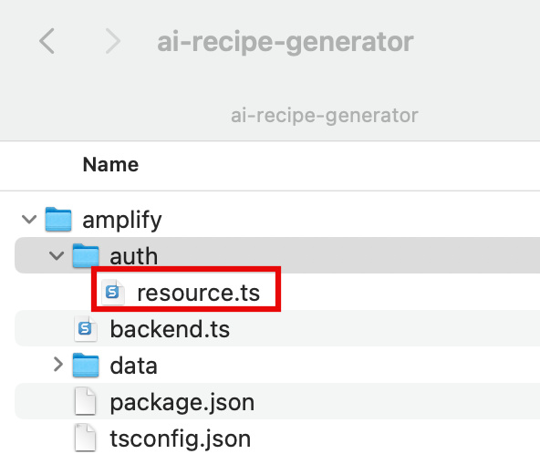
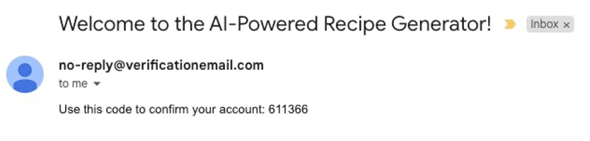
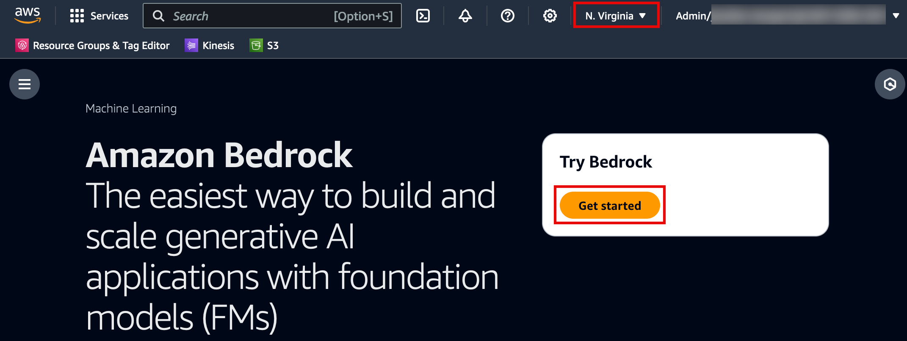
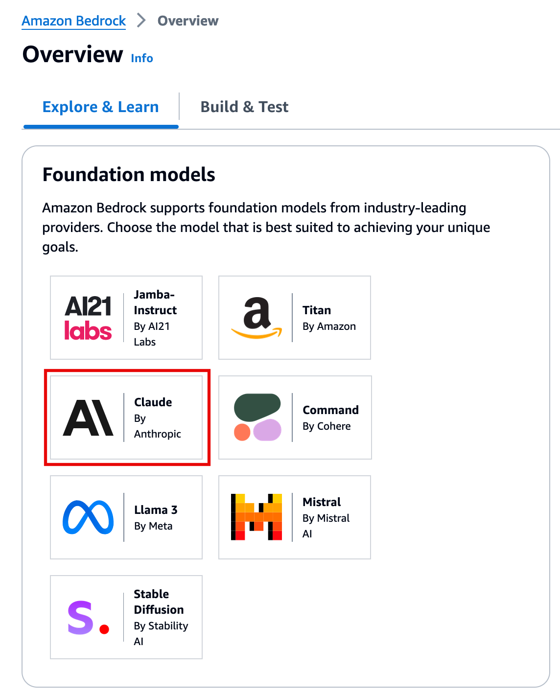
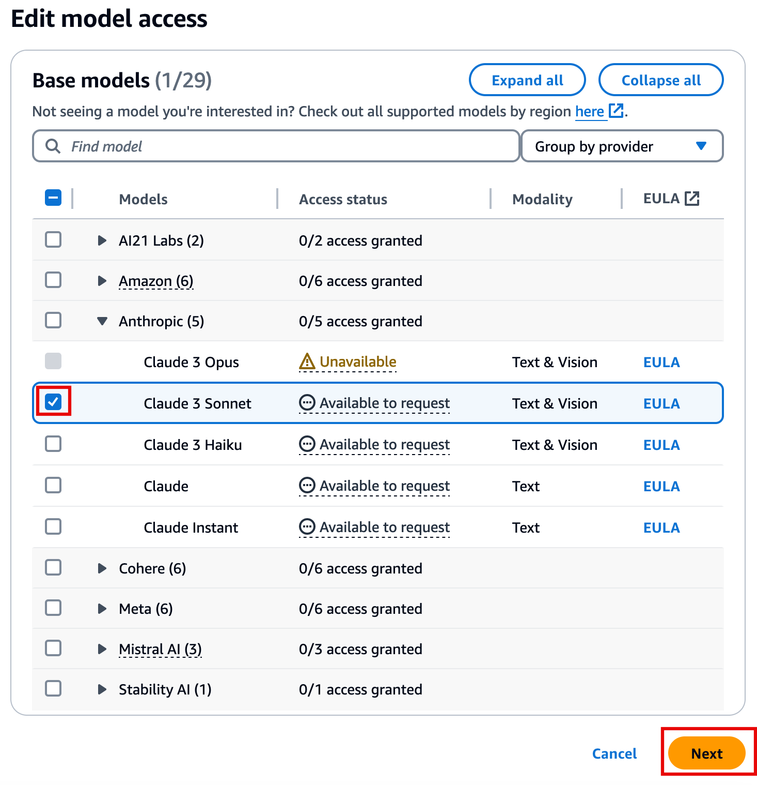

# Task 2: Manage Users

|                      |                                                                                                                                                                                                                                                                                                                                                                                                                                                              |
| -------------------- | ------------------------------------------------------------------------------------------------------------------------------------------------------------------------------------------------------------------------------------------------------------------------------------------------------------------------------------------------------------------------------------------------------------------------------------------------------------ | ----------------------------------------------------------------------------------------------------------------------------------------------------------------------------------------------------------------------------------------------------------------------------------------------------------------------------------------------------------------------------------------------------------------------------------------------------------------------------------------------------------------------------------------------------------------------------------------------------------------------------------------------------------------------------------------------------------------------------------------------------------------------------------------------------------------------------------------------------------------------------------------------------------------------------------------------------------------------------------------------------------------------------------------------------------------------------------------------------------------------------------------------------------------------------------------------------------------------------------------------------------------------------------------------------------------------------------------------------------------------------------------------------------------------------------------------------------------------------------------------------------------------------------------------------------------------------------------------------------------------------------------------------------------------------------------------------------------------------------------------------------------------------------------------------------------------------------------------------------------------------------------------------------------------------------------------------------------------------------------------------------------------------------------------------------------------------------------------------------------------------------------------------------------------------------------------------------------------------------------------------------------------------------------------------------------------------------------------------------------------------------------------------------------------------------------------------------------------------------------------------------------------------------------------------------------------------------------------------------------------------------------------------------------------------------------------------------------------------------------------------------------------------------------------------------------------------------------------------------------------------------------------------------------------------------------------------------------------------------------------------------------------------------------------------------------------------------------------------------------------------------------------------------------------------------------------------------------------------------------------------------------------------------------------------------------------------------------------------------------------------------------------------------------------------------------------------------------------------------------------------------------------------------------------------------------------------------------------------------------------------------------------------------------------------------------------------------------------------------------------------------------------------------------------------------------------------------------------------------------------------------------------------------------------------------------------------------------------------------------------------------------------------------------------------------------------------------------------------------------------------------------------------------------------------------------------------------------------------------------------------------------------------------------------------------------------------------------------------------------------------------------------------------------------------------------------------------------------------------------------------------------------------------------------------------------------------------------------------------------------------------------------------------------------------------------------------------------------------------------------------------------------------------------------------------------------------------------------------------------------------------------------------------------------------------------------------------------------------------------------------------------------------------------------------------------------------------------------------------------------------------------------------------------------------------------------------------------------------------------------------------- |
| **Time to complete** | 15 minutes                                                                                                                                                                                                                                                                                                                                                                                                                                                   |
| **Requires**         | A text editor. Here are a few free ones:  • [Atom](https://atom.io/ "https://atom.io/")  • [Notepad++](https://notepad-plus-plus.org/ "https://notepad-plus-plus.org/")  • [Sublime](https://www.sublimetext.com/ "https://www.sublimetext.com/")  • [Vim](https://www.vim.org/ "https://www.vim.org/")  • [Visual Studio Code](https://code.visualstudio.com/ "https://code.visualstudio.com/")                                              |
| **Get help**         |  • [Troubleshooting Amplify](https://docs.amplify.aws/react/build-a-backend/troubleshooting/ "https://docs.amplify.aws/react/build-a-backend/troubleshooting/")  • [Troubleshooting Amazon Bedrock](../../../bedrock/latest/userguide/what-is-bedrock.md "../../../bedrock/latest/userguide/what-is-bedrock.md")  • [Learn about Auth](https://docs.amplify.aws/react/build-a-backend/auth/ "https://docs.amplify.aws/react/build-a-backend/auth/") | ## Overview Now that you have a React web app, you will configure an authentication resource for the app using AWS Amplify Auth, powered by Amazon Cognito. Cognito is a powerful user directory service that manages user registration, authentication, account recovery, and more. You will use the AWS Management Console to enable access to Amazon Bedrock and Claude 3 Sonnet foundation model, which the app will use to generate recipes. ## What you will accomplish In this tutorial, you will:  • Set up Amplify Authentication  • Set up access to Claude 3 Sonnet from Anthropic ## Implementation The app uses email as the default login mechanism. When the users sign up, they receive a verification email. In this step, you will customize the verification email that is sent to users. 1. Modify the resource file On your local machine, navigate to the **ai-generated-recipes**/**amplify/auth/resource.ts** file and **update** it with the following code. Then, **save** the file. ``import { defineAuth } from "@aws-amplify/backend"; export const auth = defineAuth({ loginWith: { email: { verificationEmailStyle: "CODE", verificationEmailSubject: "Welcome to the AI-Powered Recipe Generator!", verificationEmailBody: (createCode) => `Use this code to confirm your account: ${createCode()}`, }, }, });``  2. View the customized email The following image is an example of the customized verification email.  Amazon Bedrock enables users to request access to a variety of Generative AI models. In this tutorial, you will need access to Claude 3 Sonnet from Anthropic. 1. Open the Bedrock console **Sign in** to the AWS Management console in a new browser window, and **open** the AWS Amazon Bedrock console at [https://console.aws.amazon.com/bedrock/](https://console.aws.amazon.com/bedrock/ "https://console.aws.amazon.com/bedrock/"). **Verify** that you are in the \***\*N. Virginia us-east-1\*\*** region, and choose **Get started**.  2. Select the Claude model In the **Foundation models** section, choose the **Claude model**.  3. Request access to Claude 3 Sonnet Scroll down to the **Claude models** section, and choose the **Claude 3 Sonnet** tab, and select **Request model access**. ###### Note If you already have access to some models, then the button will display **Manage model access**.  4. Request model access In the Base models section, for **Claude 3 Sonnet**, choose **Available to request,** and select **Request model access**.  5. Choose Next On the **Edit model access** page, choose **Next**.  6. Submit request On the **Review and Submit** page, choose **Submit**.  ## Conclusion You have configured Amplify for authentication and customized the verification email, and enabled access to Amazon Bedrock and Claude 3 Sonnet. |
