# Connect to Private Amazon RDS PostgreSQL Database Using AWS CloudShell

|                      |                                                                                                                                                                                                               |
| -------------------- | ------------------------------------------------------------------------------------------------------------------------------------------------------------------------------------------------------------- |
| **AWS experience**   | Beginner                                                                                                                                                                                                      |
| **Time to complete** | 30 minutes                                                                                                                                                                                                    |
| **Cost to complete** | Less than $1 when completed in 1 hour                                                                                                                                                                         |
| **Services used**    | [AWS CloudShell](https://aws.amazon.com/cloudshell/ "https://aws.amazon.com/cloudshell/") and [Amazon RDS for<br>PostgreSQL](https://aws.amazon.com/rds/postgresql/ "https://aws.amazon.com/rds/postgresql/") |
| **Last updated**     | February 23, 2026                                                                                                                                                                                             |

## Introduction

Following AWS best practices, databases should be hosted in private subnets within an [Amazon Virtual Private Cloud (Amazon VPC)](../../../vpc/latest/userguide/what-is-amazon-vpc.md "../../../vpc/latest/userguide/what-is-amazon-vpc.md") for enhanced security. When an Amazon RDS PostgreSQL database is hosted in private subnets without public access, you must create another instance in a public subnet and then connect to the database instance. Alternatively, you can establish a connection by creating an [AWS Client VPN](https://aws.amazon.com/vpn/client-vpn/ "https://aws.amazon.com/vpn/client-vpn/"); however, both options incur additional costs.

A simpler and more cost-effective alternative is to use [AWS CloudShell](https://aws.amazon.com/cloudshell/ "https://aws.amazon.com/cloudshell/"). AWS CloudShell is a browser-based, pre-authenticated shell that you can launch directly from the AWS Management Console. The AWS CloudShell VPC feature allows you to create a CloudShell environment within your VPC. For each VPC environment, you can specify a VPC, add a subnet, and associate up to five security groups. CloudShell inherits the network configuration of the VPC, enabling you to use CloudShell securely within the same subnet as other resources in the VPC and connect to them.

There is no additional charge for AWS CloudShell. You only pay for other AWS resources you use with CloudShell to create and run your applications.

## Prerequisites

Before starting this tutorial, you will need:

- An AWS account: If you don't already have one, follow the [Setting Up Your AWS Environment](https://aws.amazon.com/getting-started/guides/setup-environment/ "https://aws.amazon.com/getting-started/guides/setup-environment/") getting started guide for a quick overview.

## Tasks

This tutorial is divided into the following short tasks. You must complete each task
before moving on to the next one.

1. Create a custom Amazon Virtual Private Cloud with public and private subnets (5 Minutes)
2. Create an Amazon RDS PostgreSQL database hosted in private subnets within an Amazon VPC. (10
   Minutes)
3. Set up an AWS CloudShell Virtual Private Cloud environment and test connectivity (10
   Minutes)
4. Clean up resources (5 Minutes)

## Implementation

In this task, you will use an AWS CloudFormation template to create a custom Amazon VPC with public and private subnets.

1. Open [AWS CloudShell](https://console.aws.amazon.com/cloudshell/ "https://console.aws.amazon.com/cloudshell/")
2. Copy and paste the following commands into CloudShell:

```
git clone https://github.com/aws-samples/sample-Amazon-Q-Developer-Cookbook.git
cd sample-Amazon-Q-Developer-Cookbook/dev-vpc-with-private-subnet/example-result/custom-vpc
chmod 700 deploy.sh
./deploy.sh
```

3. Choose **Paste**.

The commands performed the following actions:

    * Deployed an AWS CloudFormation template in a VPC with a pair of public and private
     subnets spread across two Availability Zones.
    * Deployed an internet gateway with a default route on the public subnets.
    * Deployed a NAT gateway and default routes for the NAT gateway in the private
     subnets.

4. Open [AWS CloudFormation](https://console.aws.amazon.com/cloudformation/ "https://console.aws.amazon.com/cloudformation/") and wait for the Status column of the **custom-vpc** stack to show CREATE_COMPLETE.
5. Open [Amazon VPC](https://console.aws.amazon.com/vpcconsole/ "https://console.aws.amazon.com/vpcconsole/").
6. Select **Your VPCs** from the left menu.
7. Select **CustomVPC**, and then select the **Resource map tab** to review the layout of the subnets and route tables.

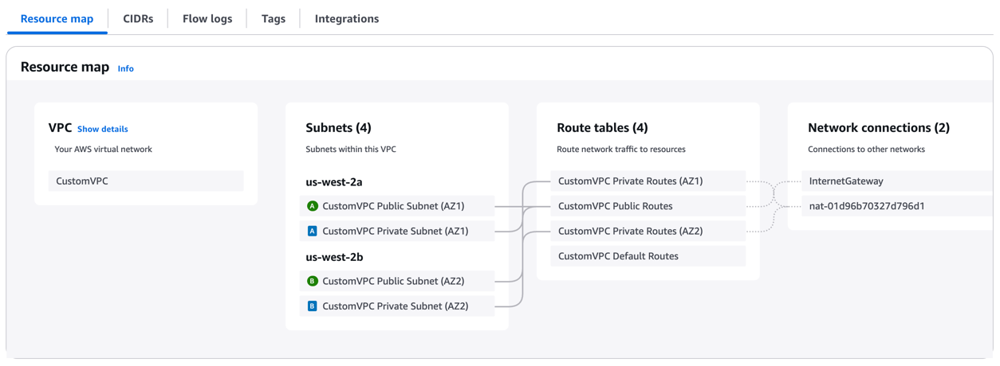
In this task, you will create an Amazon RDS PostgreSQL database hosted in private subnets
within an Amazon VPC you've created in the previous task.

1. Open the [Amazon RDS](https://console.aws.amazon.com/rds/ "https://console.aws.amazon.com/rds/") console, and select **Create a database**.

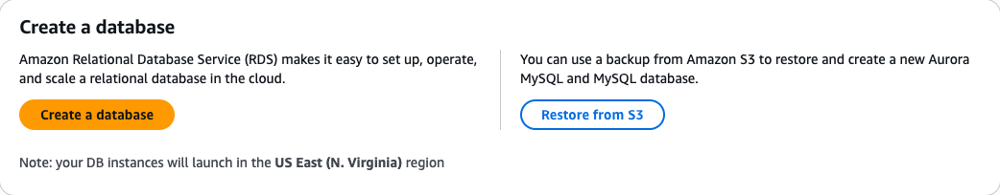 2. For Engine options, select **PostgreSQL** Engine type.

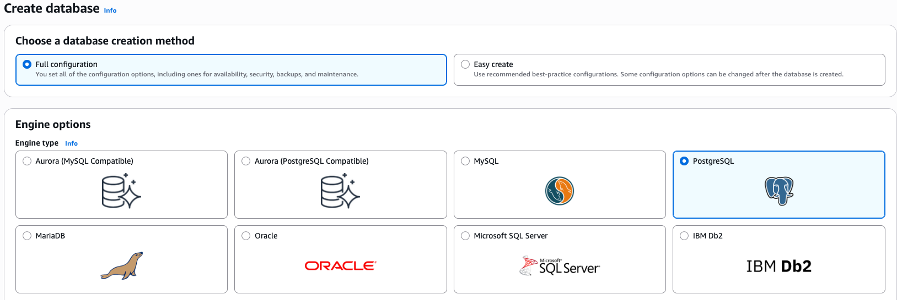 3. For Engine version, select **PostgreSQL 16.8-R2**.

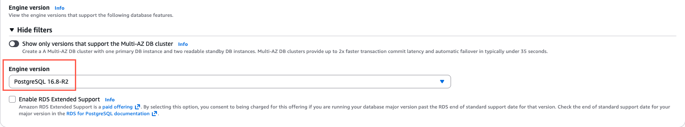 4. Select the **Dev/Test** template with the **Single-AZ DB instance deployment** option.

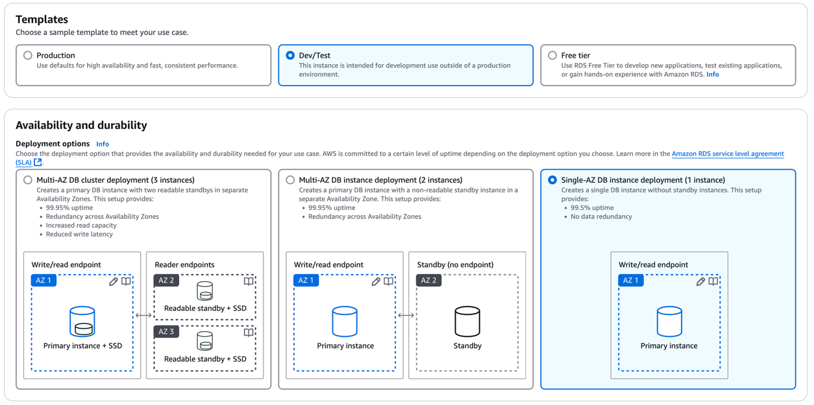 5. Name your DB instance identifier.

    1. For example, **postgresql-demo**

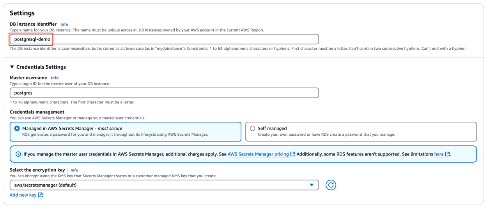 6. Under Instance Configuration, select **Burstable classes**. 7. Select **db.t3.medium** for DB instance class, and set Allocated Storage to **20GB**.

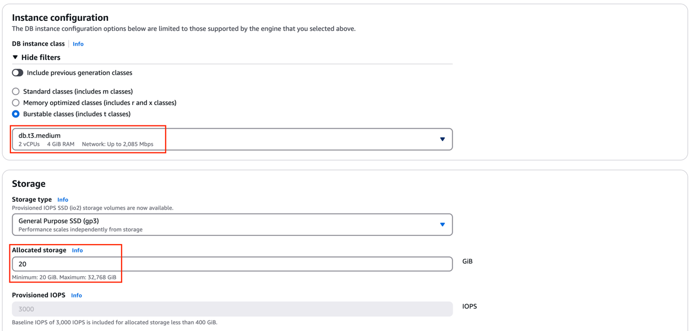 8. Under **Connectivity**:

    * Select the **CustomVPC** you created in previous task.
    * Confirm that the **Public access** setting is set to **No**.
    * Select the **default security group**.

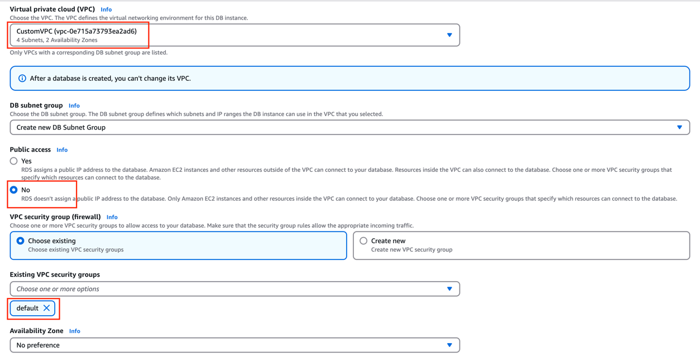 9. Leave all other options as their default settings, and choose **Create database**. 10. After the database instance successfully creates, select **View connection Details**.

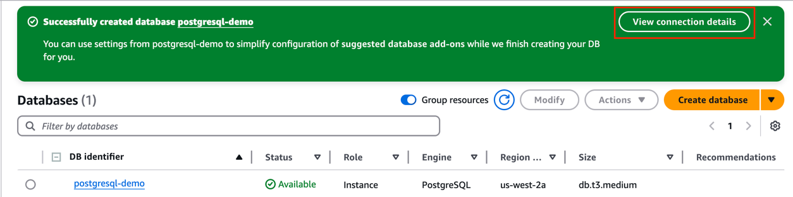 11. Copy the hostname of the instance, and select **Manage Credentials**.

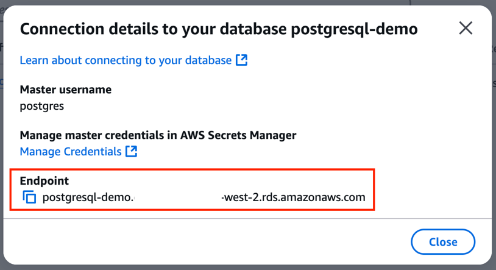 12. Retrieve the password by selecting **Retrieve secret
value**.

###### Important

Take note of the **username**, **Endpoint**, and **password**. You will need these values for your VPC environment in the next task.

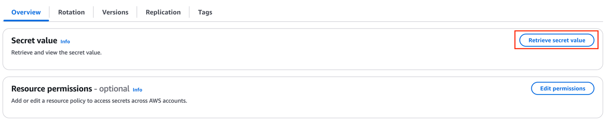
In this task, you will set up an AWS CloudShell VPC environment and test
connectivity.

1. Open [AWS CloudShell](https://console.aws.amazon.com/cloudshell/ "https://console.aws.amazon.com/cloudshell/"), and select the **+** button to bring up an option for **Create VPC environment**.

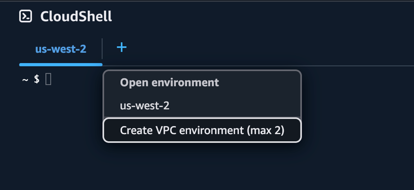 2. Name the VPC environment.

    1. For example, **cloudshell-vpc-demo**.

3. Select **CustomVPC**, any **Private subnet,** and the **default security group**.
4. Choose **Create**.

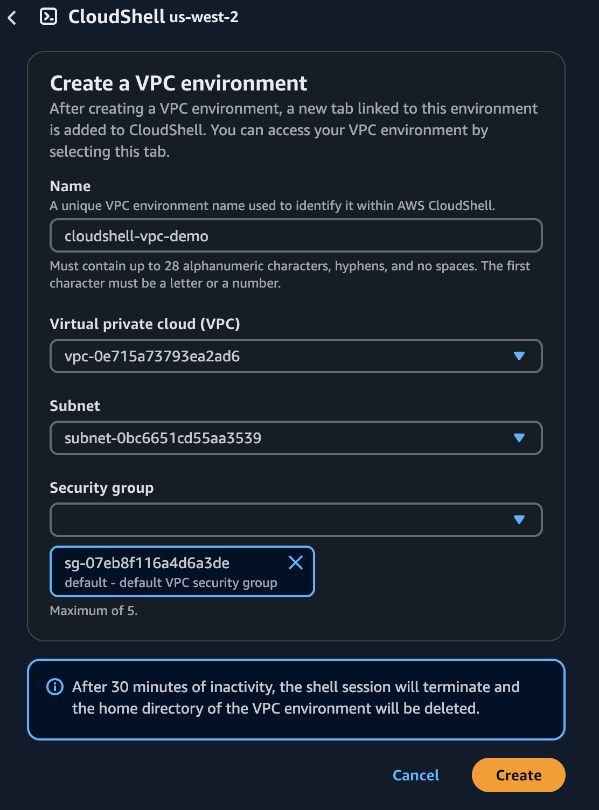

###### Note

Public IP addresses are not allocated to CloudShell VPC environments by default. VPC environments created in public subnets with routing tables configured to route all traffic to Internet Gateway will not have access to public internet, but private subnets configured with Network Address Translation (NAT) have access to public internet. VPC environments created in such private subnets will have access to public internet. 5. Once the environment is set up, install version 16 of PostgreSQL by copying and pasting these commands. 6. Choose **Paste**.

###### Note

It is possible that your PostgreSQL version may be outdated compared to your Amazon RDS PostgreSQL database. These commands remove the older version and installs PostgreSQL version 16.

```
psql --version
sudo dnf remove postgresql15* -y
sudo dnf clean all
```

7. After that completes, copy and paste the following command to install version 16 of PostgreSQL.
8. Choose **Paste**.

```
sudo dnf install postgresql16 -y
```

9. In your AWS CloudShell VPC environment, run the following PostgreSQL command:

###### Note

These are the values at the end of Task 2.

```
psql -h `<HOSTNAME>` -U `<USERNAME>`
```

###### Note

`<HOSTNAME>` is your database endpoint

`<USERNAME>` is your database administrator username 10. Enter your **password** to finish establishing a connection to your database.

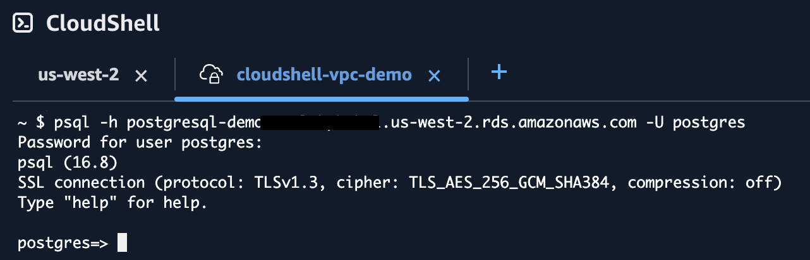 11. Validate your setup by running this test command:

```
CREATE DATABASE demodb;
```

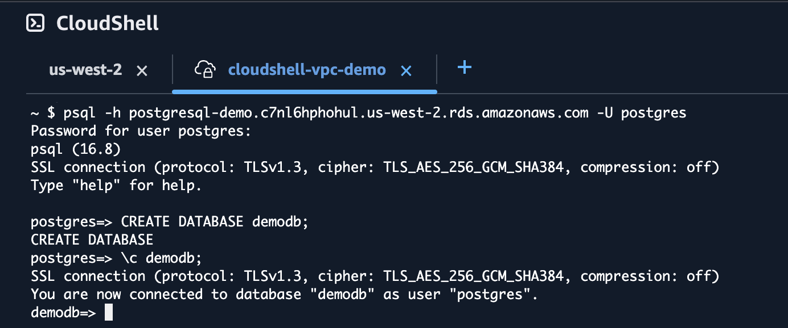
To avoid unexpected charges, follow these clean-up steps:

1. Open [AWS CloudShell](https://console.aws.amazon.com/cloudshell/ "https://console.aws.amazon.com/cloudshell/"), and select
   **Delete**.

###### Note

VPC environments do not have persistent storage. The $HOME directory is deleted when your VPC environment times out (after 20-30 minutes of inactivity), or when you delete or restart your environment.

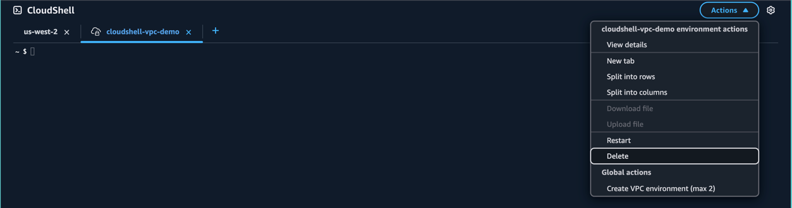 2. Enter **delete**, and choose **Delete** to confirm
the deletion of the VPC environment. 3. Open [Amazon RDS](https://console.aws.amazon.com/rds/ "https://console.aws.amazon.com/rds/"), and select
**Databases**. 4. Select **postgresql-demo**. 5. Select **Actions**, and select
**Delete.**

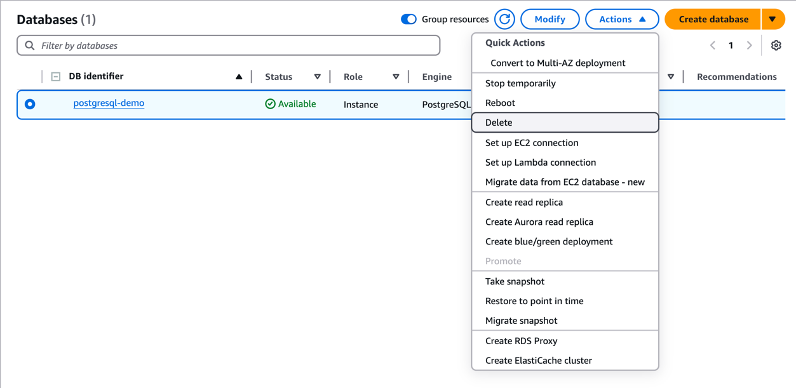 6. Enter **delete me** to remove the PostgreSQL database instance. 7. Open [AWS CloudFormation](https://console.aws.amazon.com/cloudformation/ "https://console.aws.amazon.com/cloudformation/"), and select
**custom-vpc**. 8. Select **Delete.**

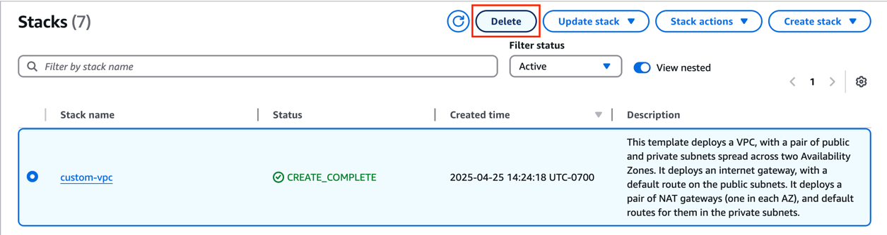 9. Choose **Delete** to remove the CloudFormation stack.

## Conclusion

You have learned how to connect to an Amazon RDS PostgreSQL instance in private subnets within Amazon VPC using AWS CloudShell.
