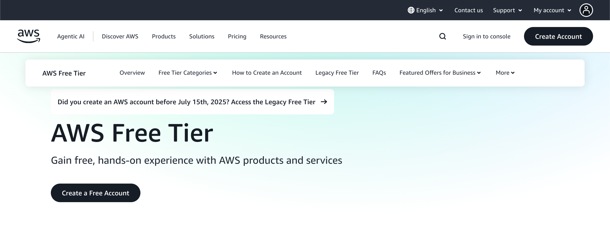
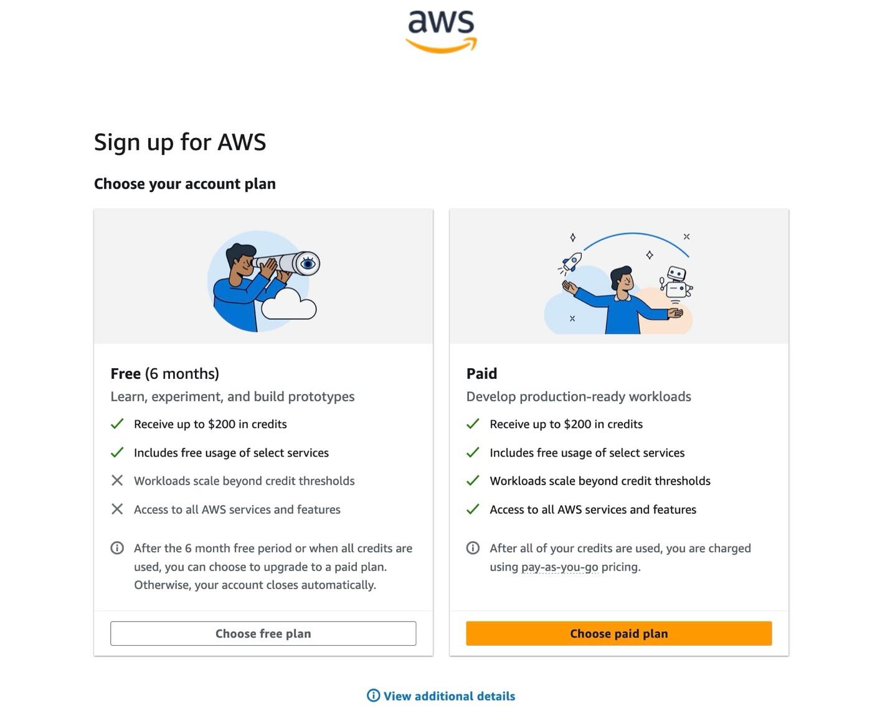
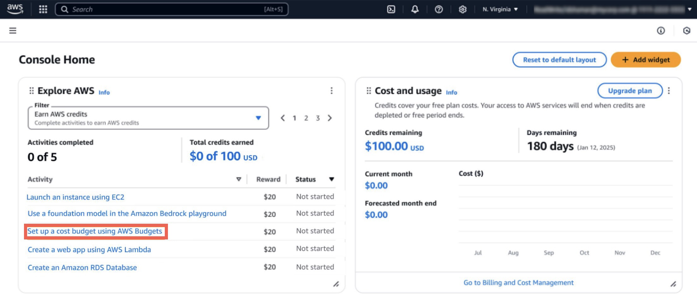
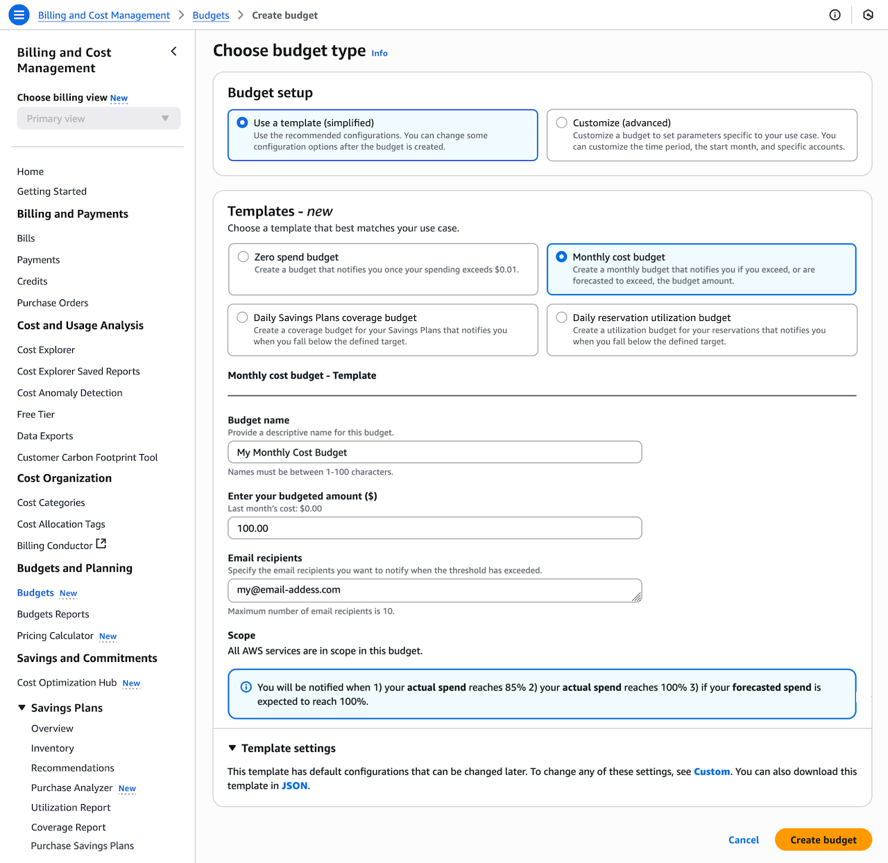
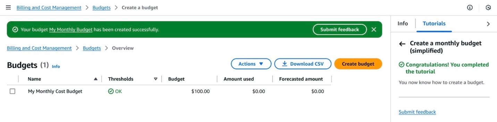
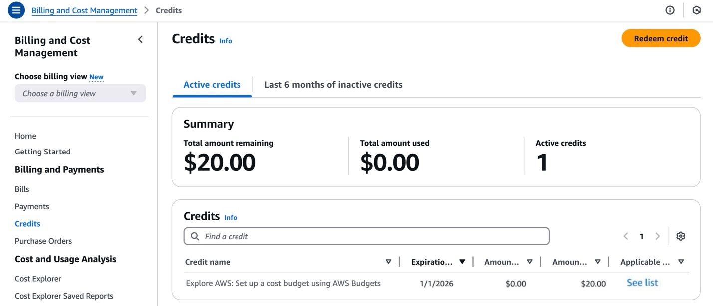

# Control Your AWS Costs

|                      |                 |
| -------------------- | --------------- |
| **AWS experience**   | Beginner        |
| **Time to complete** | 10 minutes      |
| **Cost to complete** | Free Tier       |
| **Last updated**     | October 8, 2025 |

## Overview

[AWS Free Tier](https://aws.amazon.com/free "https://aws.amazon.com/free") allows you to explore
AWS services at no cost within specified usage limits, which makes it easier to get started
with AWS. [AWS Budgets](https://aws.amazon.com/aws-cost-management/aws-budgets/ "https://aws.amazon.com/aws-cost-management/aws-budgets/")
automatically monitors your Free Tier usage and helps you track your AWS spending.

In this tutorial, you will learn to track your AWS Free Tier usage, manage credits, and
set up cost alerts using AWS Budgets.

AWS Free Tier includes:

- $100 USD in credits
- Up to $100 USD additional credits ($20 each) for exploring key services:
  - [Amazon EC2](https://aws.amazon.com/pm/ec2/ "https://aws.amazon.com/pm/ec2/") - You'll learn how to launch
    an EC2 instance and terminate it.
  - [Amazon RDS](https://aws.amazon.com/free/database/ "https://aws.amazon.com/free/database/") - You'll learn the
    basic configuration options for launching an RDS database.
  - [AWS Lambda](https://aws.amazon.com/pm/lambda/ "https://aws.amazon.com/pm/lambda/") - You'll learn to build
    a straightforward web application consisting of a Lambda function with a function
    URL.
  - [Amazon Bedrock](https://aws.amazon.com/bedrock "https://aws.amazon.com/bedrock") - You'll learn how to
    submit a prompt to generate a response in the Amazon Bedrock text playground.
  - [AWS
    Budgets](https://aws.amazon.com/aws-cost-management/aws-budgets/ "https://aws.amazon.com/aws-cost-management/aws-budgets/") - You'll learn how to set a budget that alerts you when you exceed
    your budgeted cost amount.

### Exploration period

- 6 months to use your credits

## What you will accomplish

In this tutorial, you will learn how to:

- Navigate the new Free Tier credit system
- Earn additional credits through service exploration
- Monitor your Free Tier usage
- Set up cost control alerts

## Prerequisites

Before starting this tutorial, you will need:

- A supported web browser (latest version of Chrome or Firefox)
- An AWS account created after July 15, 2025: If you don't already have one,
  follow the [Setting Up Your
  AWS Environment](../setup-environment/setup-environment.md "../setup-environment/setup-environment.md") tutorial for a quick overview.

###### Note

New accounts may need 24 hours before accessing all services in this
tutorial.

###### Note

Accounts created before July 15, 2025 will remain on the [Legacy AWS Free Tier](https://aws.amazon.com/free/legacy/?p=free&c=hp2&z=1&refid=edd99ad1-8768-4359-aea7-4dea4da27a3d "https://aws.amazon.com/free/legacy/?p=free&c=hp2&z=1&refid=edd99ad1-8768-4359-aea7-4dea4da27a3d") program.

## Implementation

- Open the AWS Free Tier page, under the AWS Free Tier header, choose **Create a
  Free Account**.

When signing up for Free Tier you can choose between two plans:

    + Free Plan: Explore AWS for up to 6 months without cost or commitment. You won't be charged unless you switch to the Paid Plan.
    + Paid Plan: Develop production-ready workloads with access to all AWS services and features.

You can see the credit details in the **Explore
AWS** widget in the [AWS Management Console](https://console.aws.amazon.com/?trk=769a1a2b-8c19-4976-9c45-b6b1226c7d20&sc_channel=el "https://console.aws.amazon.com/?trk=769a1a2b-8c19-4976-9c45-b6b1226c7d20&sc_channel=el").

These activities are designed to expose you to important building blocks of AWS,
including cost and usage that show up in the AWS Billing and Cost Management Console. These charges are deducted
from your Free Tier credits and help teach you about selecting the appropriate instance
sizes to minimize your costs.

1. Choose **Set up a cost budget using AWS
   Budgets** to earn your first $20 credits. It redirects to the [AWS
   Billing and Cost Management console](https://console.aws.amazon.com/billing/home?trk=769a1a2b-8c19-4976-9c45-b6b1226c7d20&sc_channel=el "https://console.aws.amazon.com/billing/home?trk=769a1a2b-8c19-4976-9c45-b6b1226c7d20&sc_channel=el").

 2. On the **Choose budget type page**, choose Use a
template (simplified) and Monthly cost budget. 3. Enter a **name** for your monthly cost budget, set
the budgeted amount to **100.00** (credited amount from
account creation), and enter your **email address** to receive spend
updates.

 4. Choose **Create budget**.

###### Note

We'll send an email alert when 50 percent, 25 percent, or 10 percent of your AWS credits
remain. We'll also send notifications to the AWS console and your email inbox when you
have 15 days, 7 days, and 2 days left in your 6-month free period. After your free
period ends, we'll send you an email with instructions on how to upgrade to a paid plan.
You'll have 90 days to reopen your account by upgrading to a paid plan.

You can go to the Credits page in the left navigation pane in the [AWS Billing and Cost Management Console](https://console.aws.amazon.com/billing/home "https://console.aws.amazon.com/billing/home") to confirm your $20 in
credits.

###### Note

It can take up to 10 minutes for your credits to appear.

You can receive an additional $80 by completing the remaining four activities.

## Conclusion

Congratulations! You have finished the Control your AWS Costs tutorial.

You have successfully analyzed your Free Tier usage, explored and managed your credits,
and set up cost alerts using AWS Budgets. You can now confidentially explore the portfolio
of services without incurring costs, making it even easier to get started with AWS.

For more information about AWS Free Tier, see the [AWS Free Tier User Guide](../../../awsaccountbilling/latest/aboutv2/free-tier.md "../../../awsaccountbilling/latest/aboutv2/free-tier.md"), [AWS Free Tier Blog](https://aws.amazon.com/blogs/aws/aws-free-tier-update-new-customers-can-get-started-and-explore-aws-with-up-to-200-in-credits/ "https://aws.amazon.com/blogs/aws/aws-free-tier-update-new-customers-can-get-started-and-explore-aws-with-up-to-200-in-credits/"), or [AWS Free Tier FAQs](https://aws.amazon.com/free/free-tier-faqs/ "https://aws.amazon.com/free/free-tier-faqs/").
