# Create an Audio Transcript with Amazon Transcribe

|                      |                                                                                                                                                                                                         |
| -------------------- | ------------------------------------------------------------------------------------------------------------------------------------------------------------------------------------------------------- | ----------------------------------------------------------------------------------------------------------------------------------------------------------------------------------------------------------------------------------------------------------------------------------------------------------------------------------------------------------------------------------------------------------------------------------------------------------------------------------------------------------------------------------------------------------------------------------------------------------------------------------------------------------------------------------------------------------------------------------------------------------------------------------------------------------------------------------------------------------------------------------------------------------------------------------------------------------------------------------------------------------------------------------------------------------------------------------------------------------------------------------------------------------------------------------------------------------------------------------------------------------------------------------------------------------------------------------------------------------------------------------------------------------------------------------------------------------------------------------------------------------------------------------------------------------------------------------------------------------------------------------------------------------------------------------------------------------------------------------------------------------------------------------------------------------------------------------------------------------------------------------------------------------------------------------------------------------------------------------------------------------------------------------------------------------------------------------------------------------------------------------------------------------------------------------------------------------------------------------------------------------------------------------------------------------------------------------------------------------------------------------------------------------------------------------------------------------------------------------------------------------------------------------------------------------------------------------------------------------------------------------------------------------------------------------------------------------------------------------------------------------------------------------------------------------------------------------------------------------------------------------------------------------------------------------------------------------------------------------------------------------------------------------------------------------------------------------------------------------------------------------------------------------------------------------------------------------------------------------------------------------------------------------------------------------------------------------------------------------------------------------------------------------------------------------------------------------------------------------------------------------------------------------------------------------------------------------------------------------------------------------------------------------------------------------------------------------------------------------------------------------------------------------------------------------------------------------------------------------------------------------------------------------------------------------------------------------------------------------------------------------------------------------------------------------------------------------------------------------------------------------------------------------------------------------------------------------------------------------------------------------------------------------------------------------------------------------------------------------------------------------------------------------------------------------------------------------------------------------------------------------------------------------------------------------------------------------------------------------------------------------------------------------------------------------------------------------------------------------------------------------------------------------------------------------------------------------------------------------------------------------------------------------------------------------------------------------------------------------------------------------------------------------------------------------------------------------------------------------------------------------------------------------------------------------------------------------------------------------------------------------------------------------------------------------------------------------------------------------------------------------------------------------------------------------------------------------------------------------------------------------------------------------------------------------------------------------------------------------------------------------------------------------------------------------------------------------------------------------------------------------------------------------------------------------------------------------------------------------------------------------------------------------------------------------------------------------------------------------------------------------------------------------------------------------------------------------------------------------------------------------------------------------------------------------------------------------------------------------------------------------------------------------------------------------------------------------------------------------------------------------------------------------------------------------------------------------------------------------------------------------------------------------------------------------------------------------------------------------------------------------------------------------------------------------------------------------------------------------------------------------------------------------------------------------------------------------------------------------------------------------------------------------------------------------------------------------------------------------------------------------------------------------------------------------------------------------------------------------------------------------------------------------------------------------------------------------------------------------------------------------------------------------------------------------------------------------------------------------------------------------------------------------------------------------------------------------------------------------------------------------------------------------------------------------------------------------------------------------------------------------------------------------------------------------------------------------------------------------------------------------------------------------------------------------------------------------------------------------------------------------------------------------------------------------------------------------------------------------------------------------------------------------------------------------------------------------------------------------------------------------------------------------------------------------------------------------------------------------------------------------------------------------------------------------------------------------------------------------------------------------------------------------------------------------------------------------------------------------------------------------------------------------------------------------------------------------------------------------------------------------------------------------------------------------------------------------------------------------------------------------------------------------------------------------------------------------------------------------------------------------------------------------------------------------------------------------------------------------------------------------------------------------------------------------------------------------------------------------------------------------------------------------------------------------------------------------------------------------------------------------------------------------------------------------------------------------------------------------------------------------------------------------------------------------------------------------------------------------------------------------------------------------------------------------------------------------------------------------------------------------------------------------------------------------------------------------------------------------------------------------------------------------------------------------------------------------------------------------------------------------------------------------------------------------------------------------------------------------------------------------------------------------------------------------------------------------------------------------------------------------------------------------------------------------------------------------------------------------------------------------------------------------------------------------------------------------------------------------------------------------------------------------------------------------------------------------------------------------------------------------------------------------------------------------------------------------------------------------------------------------------------------------------------------------------------------------------------------------------------------------------------------------------------------------------------------------------------------------------------------------------------------------------------------------------------------------------------------------------------------------------------------------------------------------------------------------------------------------------------------------------------------------------------------------------------------------------------------------------------------------------------------------------------------------------------------------------------------------------------------------------------------------------------------------------------------------------------------------------------------------------------------------------------------------------------------------------------------------------------------------------------------------------------------------------------------------------------------------------------------------------------------------------------------------------------------------------------------------------------------------------------------------------------------------------------------------------------------------------------------------------------------------------------------------------------------------------------------------- |
| **AWS experience**   | Beginner                                                                                                                                                                                                |
| **Time to complete** | 10 minutes                                                                                                                                                                                              |
| **Cost to complete** | Free Tier eligible                                                                                                                                                                                      |
| **Requires**         |  • AWS account NoteAccounts created within the last 24 hours might not yet have access to the services required for this tutorial.  • Recommended browser: The latest version of Chome or Firefox |
| **Last updated**     | July 5, 2022                                                                                                                                                                                            | ## Overview In this step-by-step tutorial, you will learn how to use [Amazon Transcribe](https://aws.amazon.com/transcribe/ "https://aws.amazon.com/transcribe/") to create a text transcript of a recorded audio file using the [AWS Management Console](https://console.aws.amazon.com/transcribe/ "https://console.aws.amazon.com/transcribe/"). Amazon Transcribe is an automatic speech recognition (ASR) service that makes it easy for developers to add speech-to-text capability to their applications. Using the Amazon Transcribe API, you can analyze audio files stored in Amazon Simple Storage Service (Amazon S3) and have the service return a text file of the transcribed speech. As a developer, creating transcriptions of customer service calls or generating subtitles on audio and video content are common challenges requiring speech-to-text capabilities. This challenge could be solved by building your own machine learning models from scratch. However, this option is time-intensive, expensive, and requires machine learning expertise. Instead of taking the difficult route, you can use Amazon Transcribe, a pre-trained and fully managed service, which provides fast and high-quality transcriptions. In this tutorial you will download a sample audio file then upload it to an Amazon S3 bucket that you will create. Then you will use Amazon Transcribe to create a transcript from the sample audio clip using the AWS Management Console. This tutorial is a demo of the functionality that is available when using the AWS CLI or the [Amazon Transcribe API](../../../transcribe/latest/dg/getting-started-asc-api.md "../../../transcribe/latest/dg/getting-started-asc-api.md"). For production or proof of concept implementations, we recommend using these programmatic interfaces rather than the Amazon Transcribe Console. ## Implementation In this step, you will download a sample audio file, create an S3 bucket, then upload the sample file to the S3 bucket. Amazon Transcribe accesses audio and video files for transcription exclusively from S3 buckets. 1. Download the file To download the sample audio file to transcribe later in the tutorial, choose [transcribe-sample.mp3](https://d1.awsstatic.com/tmt/create-audio-transcript-transcribe/transcribe-sample.5fc2109bb28268d10fbc677e64b7e59256783d3c.mp3 "https://d1.awsstatic.com/tmt/create-audio-transcript-transcribe/transcribe-sample.5fc2109bb28268d10fbc677e64b7e59256783d3c.mp3"). 2. Open the console Select [AWS Management Console](https://console.aws.amazon.com/console/home "https://console.aws.amazon.com/console/home") to open the console in a new browser window, so you can keep this step-by-step guide open. When the screen loads, enter your user name and password to get started. Using the **Region** drop down, select a Region that has Amazon Transcribe. 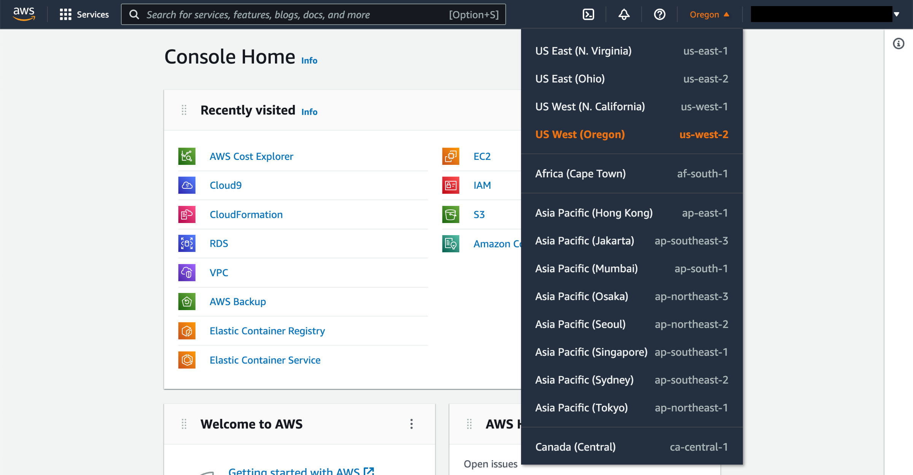 3. Open the S3 console Type **S3** in the search bar and select **S3** to open the console. 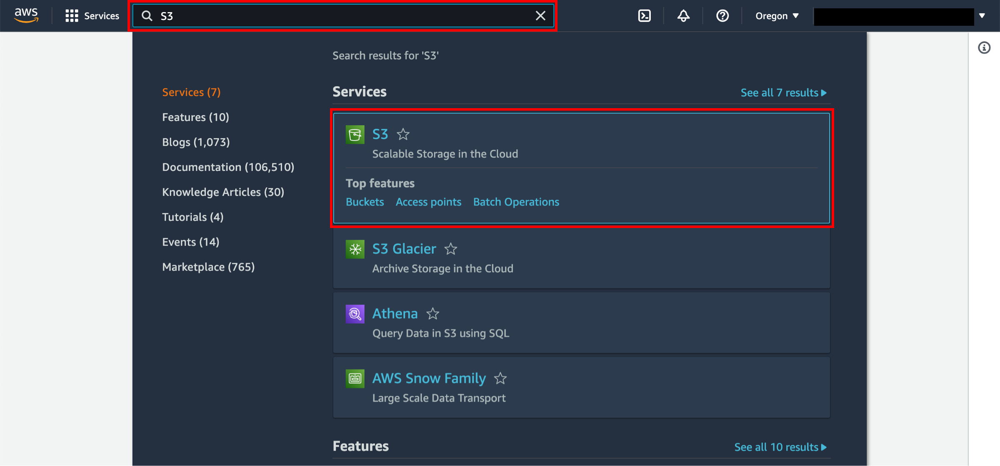 4. Create a bucket In the S3 dashboard choose **Create bucket**. If this is the first time you have created a bucket, you will see a screen that looks like the image pictured here. If you have already created S3 buckets, your S3 dashboard will list all the buckets you have created. 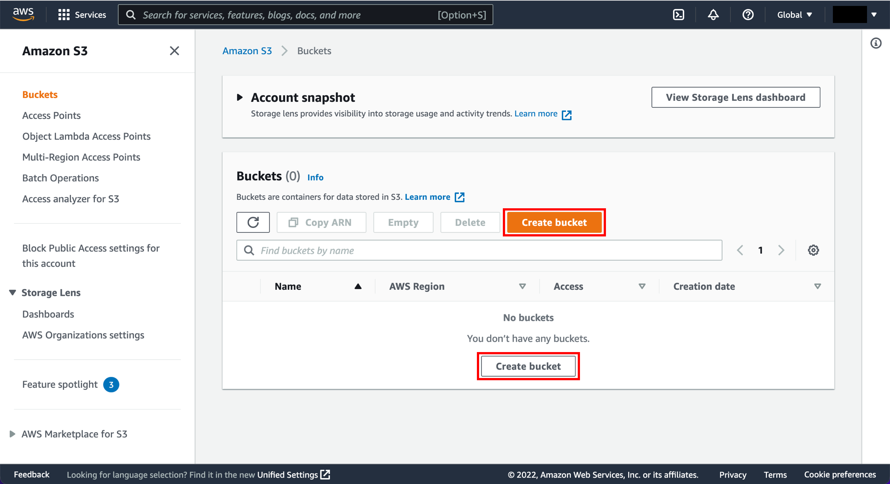 5. Enter a bucket name Enter a unique bucket name. Bucket names must be unique across all existing bucket names in Amazon S3. There are a number of other [restrictions on S3 bucket names](../../../AmazonS3/latest/dev/BucketRestrictions.md "../../../AmazonS3/latest/dev/BucketRestrictions.md") as well. Then select a Region to create your bucket in. 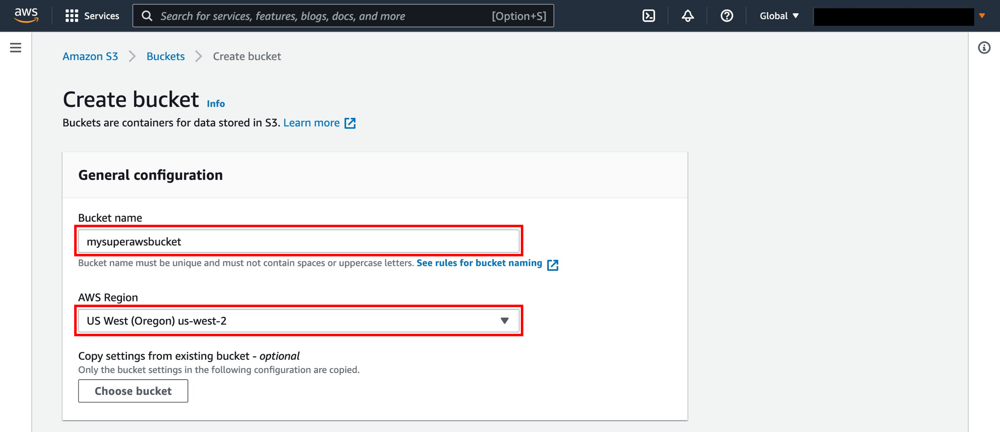 6. Review configuration details and create bucket You have the ability to set up permissions for your S3 bucket. Leave the default values and scroll down. You have many useful options for your S3 bucket including [Versioning](../../../AmazonS3/latest/dev/Versioning.md "../../../AmazonS3/latest/dev/Versioning.md"), [Server Access Logging](../../../AmazonS3/latest/user-guide/server-access-logging.md "../../../AmazonS3/latest/user-guide/server-access-logging.md"), [Tags](../../../AmazonS3/latest/dev/BucketBilling.md "../../../AmazonS3/latest/dev/BucketBilling.md"), [Object-level Logging](../../../awscloudtrail/latest/userguide/logging-management-and-data-events-with-cloudtrail.md#logging-data-events "../../../awscloudtrail/latest/userguide/logging-management-and-data-events-with-cloudtrail.md#logging-data-events"), and [Default Encryption](../../../AmazonS3/latest/dev/bucket-encryption.md "../../../AmazonS3/latest/dev/bucket-encryption.md"). We won't enable these features for this tutorial. Select **Create bucket**. 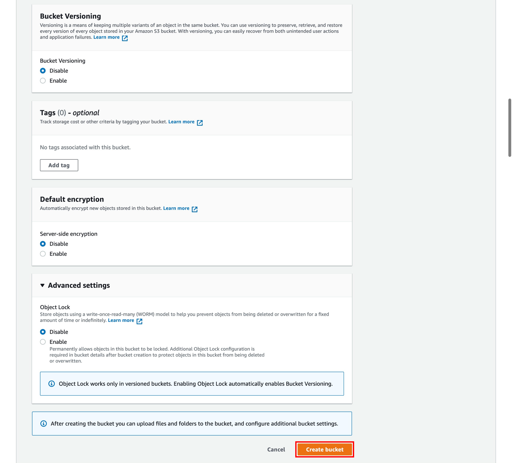 7. Select your bucket You will see your new bucket in the S3 console. Click on your bucket’s name to navigate to the bucket. Your bucket name will not be the same as pictured in the screenshot to the right. 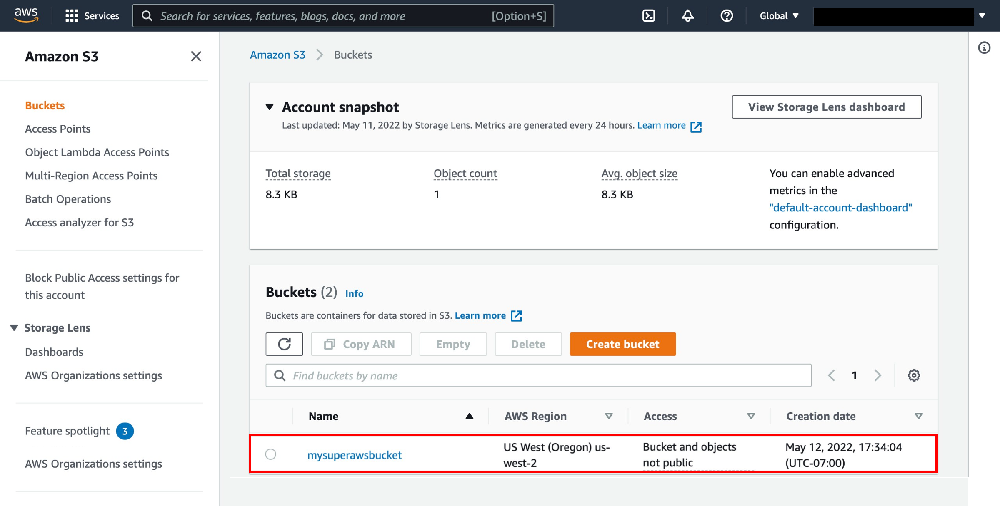 8. Upload the sample file You are in your bucket’s home page. Select **Upload**. 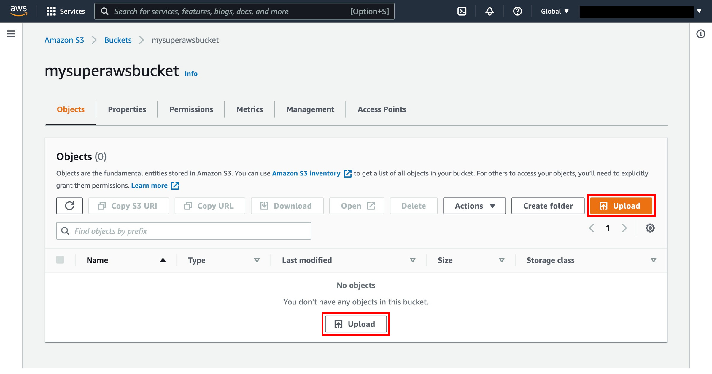 9. Select the sample file and upload it Upload the transcribe-sample.mp3 file by selecting **Add files** and selecting the file or dragging the transcribe-sample.mp3 file to the upload box. Select **Upload**. 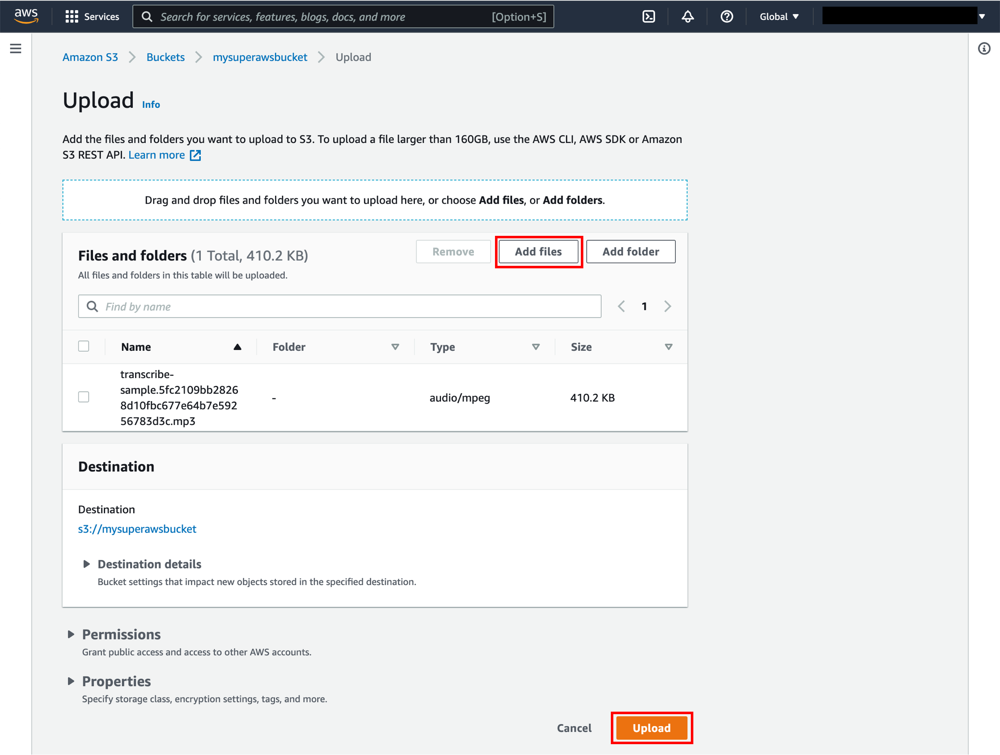 10. Copy the S3 URI On successful upload, select the **transcribe-sample.mp3** file in your bucket. A file detail page will be displayed for the transcribe-sample.mp3 file. Copy the S3 URI link to the file and save it for use later in the tutorial. 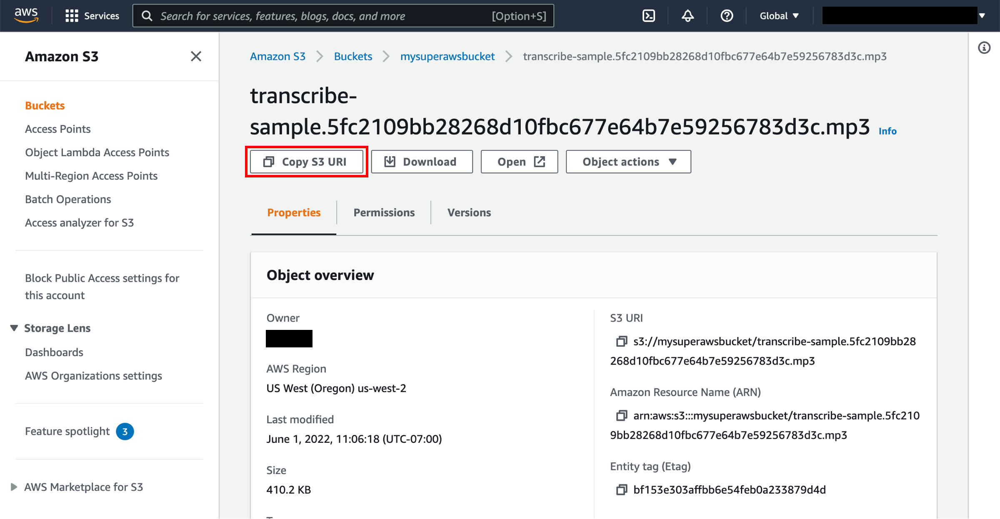 In this step, you will create and run a transcription job using the Amazon Transcribe console. 1. Open the Transcribe console From the top menu bar, select **Services** then begin typing **Transcribe** in the search bar and select **Amazon Transcribe** to open the service console. 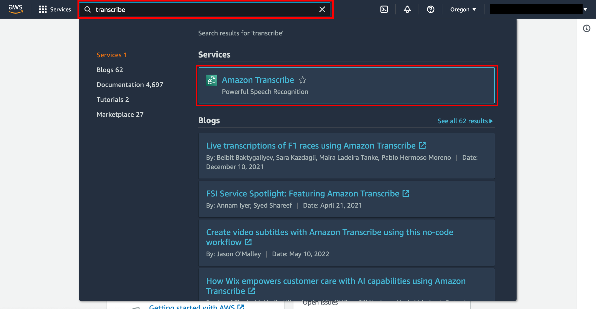 2. Open the Transcription jobs page On the Amazon Transcribe console main page, open the navigation pane and click **Transcription jobs**. 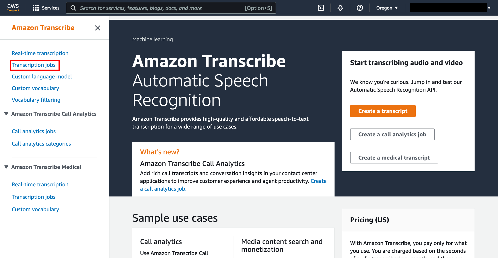 3. Create Transcription job On the **Transcription jobs** page, click **Create job**. 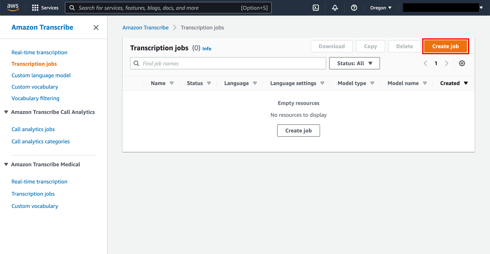 4. Specify job details On the **Create transcription job** page, in the **Name** field, type **sample-transcription-job.** Leave the default **Language** as **English**. Leave the default **Model type** as **General model.** In the **Input file location on S3** field, paste the link to the sample file in your S3 bucket. The link to your sample file will be different than the one shown in the screenshot to the right. You can use the **Custom vocabulary** feature to help Amazon Translate recognize words and phrases that are specific to your application, such as a non-English name like Etienne. You won't use this feature in this tutorial. 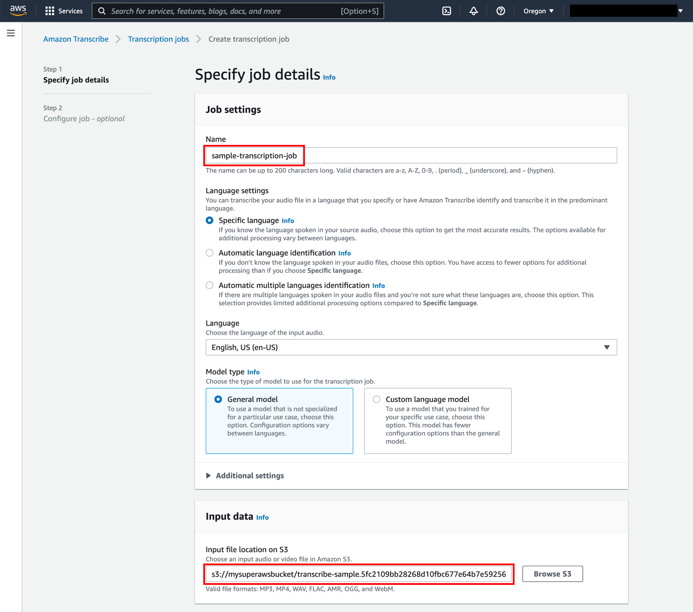 5. Specify output data Leave the default **Output data location type** as **Service-managed S3 bucket.** Amazon Transcribe supports WebVTT (VTT) and SubRip (SRT) file types for subtitles. In the **Subtitle file format** field, you can choose either or both file types for output. If you select both types, you get two files that are exported to the same S3 bucket. Neither format is used in this tutorial. Select **Next.** 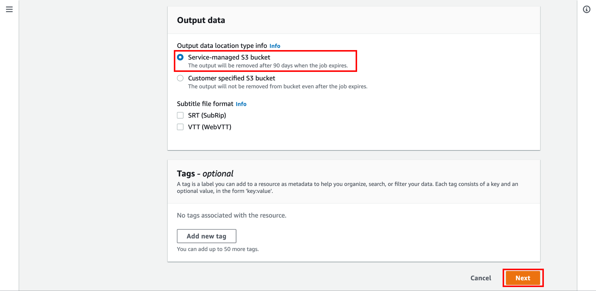 6. Create job You can configure additional audio, content, and custom vocabulary settings on the **Configure job** page. For this tutorial, leave the default choices and select **Create job.**  In this step, you will learn how to check on the progress and review the results of your transcription job. 1. Monitor the status of the job After you click the **Create job** button, you will be taken to the **Transcription jobs** screen. It will show the status of **sample-transcription-job**. The status can be **In progress**, **Complete**, or **Failed**. When the status is **Complete**, click on the **sample-transcription-job** link in the **Name** column to view the transcription results. 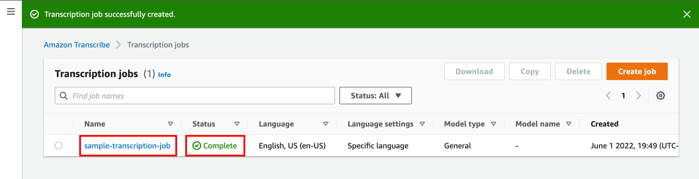 2. Check the transcription output Next you will see the **sample-transcription-job** details. Scroll down to the **Transcription** panel to view the transcription job output. In the **JSON** pane you can view the transcription results as it would be returned from the Transcribe API or AWS CLI. 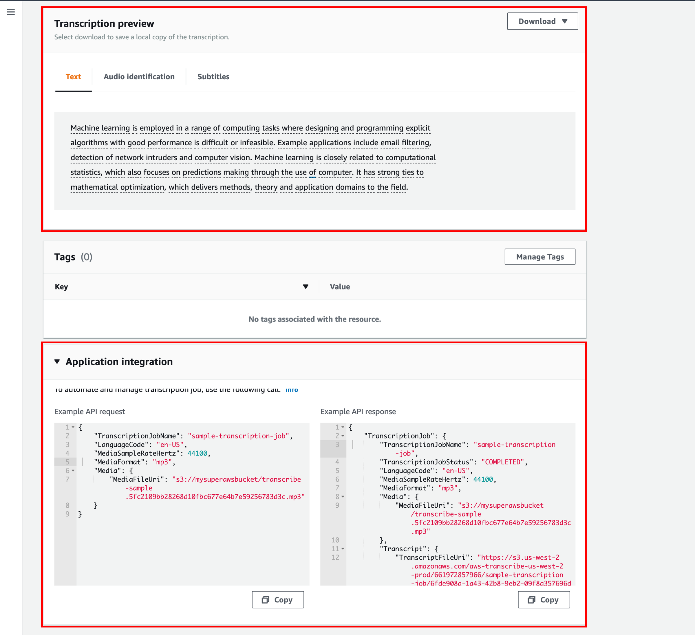 In this step, you will delete the sample file from your S3 bucket to avoid unnecessary charges. 1. Open the S3 console In this upper navigation menu, begin typing **S3** in the search bar and select **S3** to open the console.  2. Navigate to the bucket Scroll through your S3 buckets and find the bucket that you created earlier in this tutorial. Click on this bucket name to view the contents of the bucket. Your bucket name will be different in the screenshot to the right.  3. Delete the sample file Select the **transcribe-sample.mp3** file contained within your bucket and select **Delete**. Confirm the deletion. 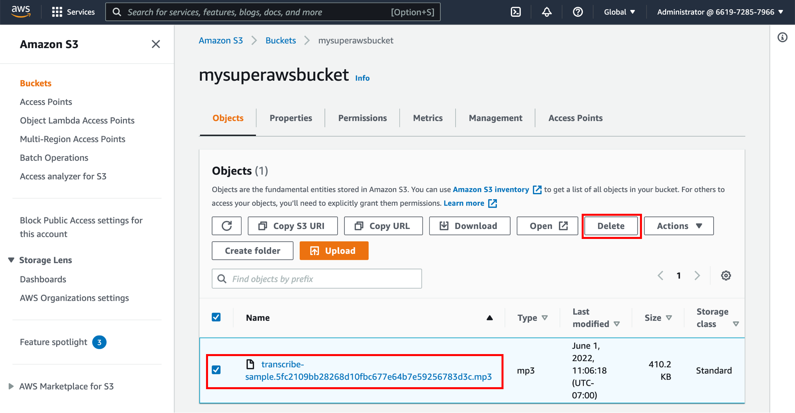 ## Conclusion As you have seen in this tutorial, Amazon Transcribe enables voice to text at scale. Use Amazon Transcribe for a wide range of audio or videos files, such as customer service calls, business meetings, broadcast TV, and on-demand videos. |
