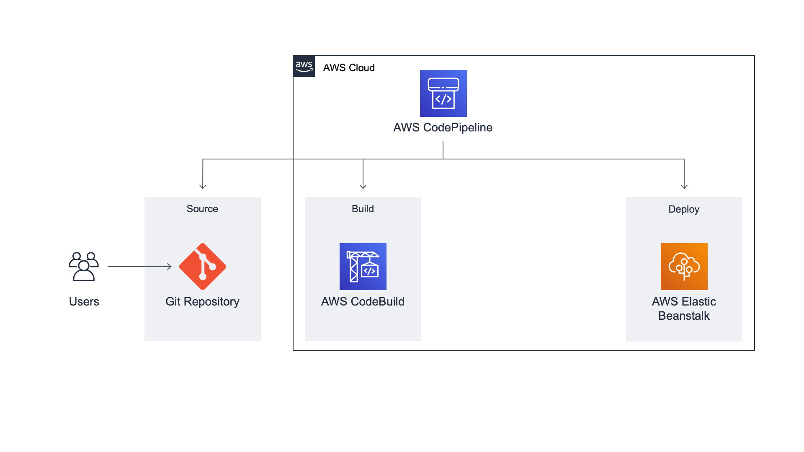

# Module 4: Create Delivery Pipeline

|                      |                                                                                                                                           |
| -------------------- | ----------------------------------------------------------------------------------------------------------------------------------------- | -------------------------------------------------------------------------------------------------------------------------------------------------------------------------------------------------------------------------------------------------------------------------------------------------------------------------------------------------------------------------------------------------------------------------------------------------------------------------------------------------------------------------------------------------------------------------------------------------------------------------------------------------------------------------------------------------------------------------------------------------------------------------------------------------------------------------------------------------------------------------------------------------------------------------------------------------------------------------------------------------------------------------------------------------------------------------------------------------------------------------------------------------------------------------------------------------------------------------------------------------------------------------------------------------------------------------------------------------------------------------------------------------------------------------------------------------------------------------------------------------------------------------------------------------------------------------------------------------------------------------------------------------------------------------------------------------------------------------------------------------------------------------------------------------------------------------------------------------------------------------------------------------------------------------------------------------------------------------------------------------------------------------------------------------------------------------------------------------------------------------------------------------------------------------------------------------------------------------------------------------------------------------------------------------------------------------------------------------------------------------------------------------------------------------------------------------------------------------------------------------------------------------------------------------------------------------------------------------------------------------------------------------------------------------------------------------------------------------------------------------------------------------------------------------------------------------------------------------------------------------------------------------------------------------------------------------------------------------------------------------------------------------------------------------------------------------------------------------------------------------------------------------------------------------------------------------------------------------------------------------------------------------------------------------------------------------------------------------------------------------------------------------------------------------------------------------------------------------------------------------------------------------------------------------------------------------------------------------------------------------------------------------------------------------------------------------------------------------------------------------------------------------------------------------------------------------------------------------------------------------------------------------------------------------------------------------------------------------------------------------------------------------------------------------------------------------------------------------------------------------------------------------------------------------------------------------------------------------------------------------------------------------------------------------------------------------------------------------------------------------------------------------------------------------------------------------------------------------------------------------------------------------------------------------------------------------------------------------------------------------------------------------------------------------------------------------------------------------------------------------------------------------------------------------------------------------------------------------------------------------------------------- |
| **Time to complete** | 10 minutes                                                                                                                                |
| **Services used**    | [AWS CodePipeline](https://aws.amazon.com/codepipeline/?e=gs2020&p=cicd-four "https://aws.amazon.com/codepipeline/?e=gs2020&p=cicd-four") | ## Overview In this module, you will use AWS CodePipeline to set up a continuous delivery pipeline with source, build, and deploy stages. The pipeline will detect changes in the code stored in your GitHub repository, build the source code using AWS CodeBuild, and then deploy your application to AWS Elastic Beanstalk. ## What you will accomplish In this module, you will:  • Set up a continuous delivery pipeline on AWS CodePipeline  • Configure a source stage using your GitHub repo  • Configure a build stage using AWS CodeBuild  • Configure a deploy stage using your AWS Elastic Beanstalk application  • Deploy the application hosted on GitHub to Elastic Beanstalk through a pipeline ## Key concepts **Continuous delivery**—Software development practice that allows developers to release software more quickly by automating the build, test, and deploy processes. **Pipeline**—Workflow model that describes how software changes go through the release process. Each pipeline is made up of a series of stages. **Stage**—Logical division of a pipeline, where actions are performed. A stage might be a build stage, where the source code is built and tests are run. It can also be a deployment stage, where code is deployed to runtime environments. **Action**—Set of tasks performed in a stage of the pipeline. For example, a source action can start a pipeline when source code is updated, and a deploy action can deploy code to a compute service like AWS Elastic Beanstalk. ## Implementation 1. In a browser window, open the [AWS CodePipeline console](https://console.aws.amazon.com/codesuite/codepipeline/start "https://console.aws.amazon.com/codesuite/codepipeline/start"). 2. Choose the orange **Create pipeline** button. A new screen will open up so you can set up the pipeline. 3. In the **Pipeline name** field, enter **Pipeline-DevOpsGettingStarted.** 4. Confirm that **New service role** is selected. 5. Choose the orange **Next** button. 1. Select **GitHub version 1** from the **Source provider** dropdown menu. 2. Choose the white **Connect to GitHub** button. A new browser tab will open asking you to give AWS CodePipeline access to your GitHub repo. 3. Choose the green **Authorize aws-codesuite** button. Next, you will see a green box with the message **You have successfully configured the action with the provider.** 4. From the **Repository** dropdown, select the repo you created in Module 1. 5. Select **main** from the **branch** dropdown menu. 6. Confirm that **GitHub webhooks** is selected. 7. Choose the orange **Next** button. 1. From the **Build provider** dropdown menu, select **AWS CodeBuild.** 2. Under **Region** confirm that the **US West (Oregon)** Region is selected. 3. Select **Build-DevOpsGettingStarted** under **Project name.** 4. Choose the orange **Next** button. 1. Select **AWS Elastic Beanstalk** from the **Deploy provider** dropdown menu. 2. Under **Region,** confirm that the **US West (Oregon)** Region is selected. 3. Select the field under **Application name** and confirm you can see the app **DevOpsGettingStarted** created in Module 2. 4. Select **DevOpsGettingStarted-env** from the **Environment name** textbox. 5. Choose the orange **Next** button. You will now see a page where you can review the pipeline configuration. 6. Choose the orange **Create pipeline** button. While watching the pipeline execution, you will see a page with a green bar at the top. This page shows all the steps defined for the pipeline and, after a few minutes, each will change from blue to green. 1. Once the **Deploy** stage has switched to green and it says **Succeeded,** choose **AWS Elastic Beanstalk.** A new tab listing your AWS Elastic Beanstalk environments will open. 2. Select the URL in the **Devopsgettingstarted-env** row. You should see a webpage with a white background and the text you included in your GitHub commit in Module 1. #### Application architecture Here's what our architecture looks like now: We have created a continuous delivery pipeline on AWS CodePipeline with three stages: source, build, and deploy. The source code from the GitHub repo created in [Module 1: Set Up Git Repo](module-one.md "module-one.md") is part of the source stage. That source code is then built by AWS CodeBuild in the build stage. Finally, the built code is deployed to the AWS Elastic Beanstalk environment created in [Module 3: Create Build Project](module-three.md "module-three.md").  |
