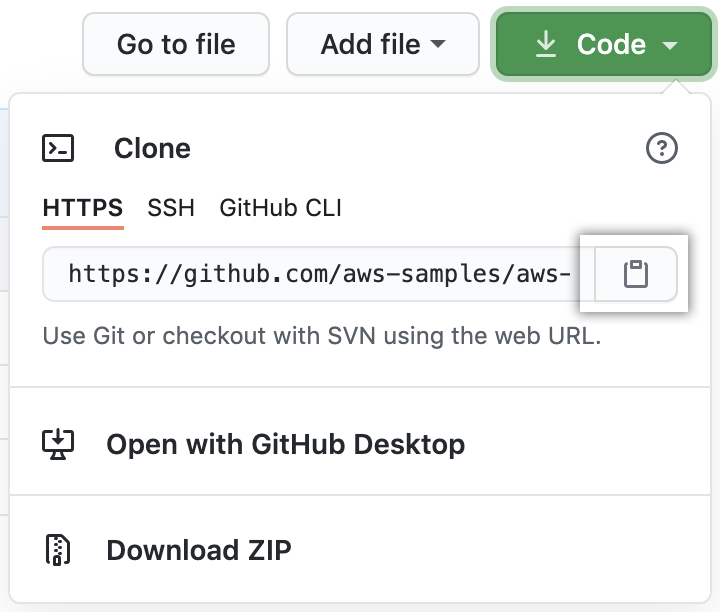
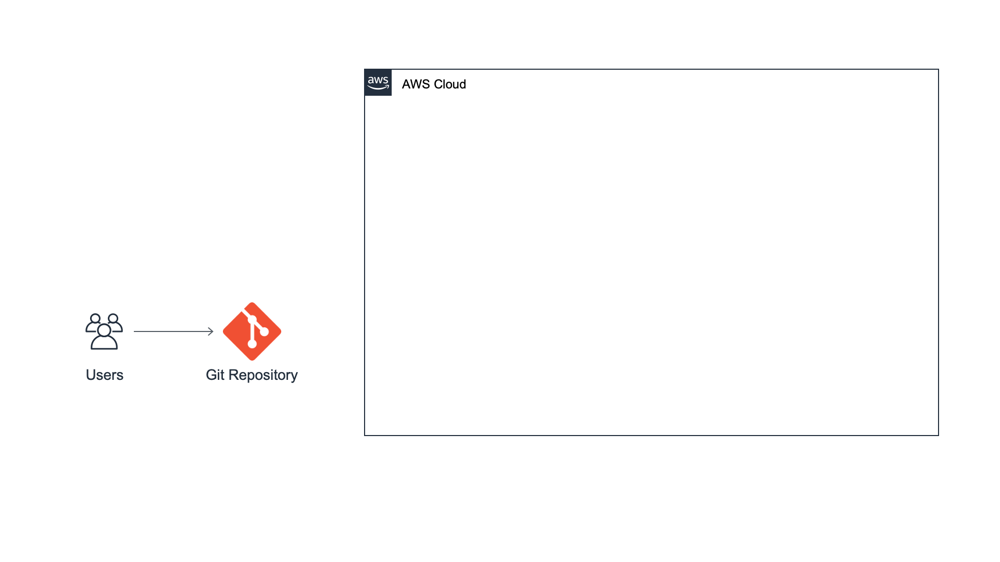

# Module 1: Set Up Git Repo

|                      |                                                                                                                                                                                                                                                                                                                                                                                                                                                                                                                                                                               |
| -------------------- | ----------------------------------------------------------------------------------------------------------------------------------------------------------------------------------------------------------------------------------------------------------------------------------------------------------------------------------------------------------------------------------------------------------------------------------------------------------------------------------------------------------------------------------------------------------------------------- | ------------------------------------------------------------------------------------------------------------------------------------------------------------------------------------------------------------------------------------------------------------------------------------------------------------------------------------------------------------------------------------------------------------------------------------------------------------------------------------------------------------------------------------------------------------------------------------------------------------------------------------------------------------------------------------------------------------------------------------------------------------------------------------------------------------------------------------------------------------------------------------------------------------------------------------------------------------------------------------------------------------------------------------------------------------------------------------------------------------------------------------------------------------------------------------------------------------------------------------------------------------------------------------------------------------------------------------------------------------------------------------------------------------------------------------------------------------------------------------------------------------------------------------------------------------------------------------------------------------------------------------------------------------------------------------------------------------------------------------------------------------------------------------------------------------------------------------------------------------------------------------------------------------------------------------------------------------------------------------------------------------------------------------------------------------------------------------------------------------------------------------------------------------------------------------------------------------------------------------------------------------------------------------------------------------------------------------------------------------------------------------------------------------------------------------------------------------------------------------------------------------------------------------------------------------------------------------------------------------------------------------------------------------------------------------------------------------------------------------------------------------------------------------------------------------------------------------------------------------------------------------------------------------------------------------------------------------------------------------------------------------------------------------------------------------------------------------------------------------------------------------------------------------------------------------------------------------------------------------------------------------------------------------------------------------------------------------------------------------------------------------------------------------------------------------------------------------------------------------------------------------------------------------------------------------------------------------------------------------------------------------------------------------------------------------------------------------------------------------------------------------------------------------------------------------------------------------------------------------------------------------------------------------------------------------------------------------------------------------------------------------------------------------------------------------------------------------------------------------------------------------------------------------------------------------------------------------------------------------------------------------------------------------------------------------------------------------------------------------------------------------------------------------------------------------------------------------------------------------------------------------------------------------------------------------------------------------------------------------------------------------------------------------------------------------------------------------------------------------------------------------------------------------------------------------------------------------------------------------------------------------------------------------------------------------------------------------------------------------------------------------------------------------------------------------------------------------------------------------------------------------------------------------------------------------------------------------------------------------------------------------------------------------------------------------------------------------------------------------------------------------------------------------------------------------------------------------------------------------------------------------------------------------------------------------------------------------------------------------------------------- |
| **Time to complete** | 5 minutes                                                                                                                                                                                                                                                                                                                                                                                                                                                                                                                                                                     |
| **Requires**         |  • [GitHub](https://github.com/ "https://github.com/") account  • [Git](https://git-scm.com/ "https://git-scm.com/") installed on your computer  • A text editor. Here are a few options (in alphabetical order): + [Atom](https://atom.io/ "https://atom.io/") + [Notepad++](https://notepad-plus-plus.org/ "https://notepad-plus-plus.org/") + [Sublime](https://www.sublimetext.com/ "https://www.sublimetext.com/") + [Vim](https://www.vim.org/ "https://www.vim.org/") + [Visual Studio Code](https://code.visualstudio.com/ "https://code.visualstudio.com/") | ## Overview In this module, you will set up a repository for your code so it can be easily accessed over the Internet. In this example, we will be using [GitHub](https://github.com/ "https://github.com/"), but there are other Git-compatible options you can use, including [AWS CodeCommit](https://aws.amazon.com/codecommit/ "https://aws.amazon.com/codecommit/"). In one of the following modules you will connect this hosted repo to our pipeline, so every time you push a new commit to it your build process is started. ## What you will accomplish  • Fork a GitHub repository to create a new one  • Store code and metadata in GitHub  • Interact with a code repository using Git ## Key concepts **Version control—**A system for storing source code and tracking any changes to it. Changes are stored as versions, so a developer can easily compare versions or choose to revert to an older version. **Git—**An [open-source version control tool](https://git-scm.com/ "https://git-scm.com/") for managing changes to source code. **Git repository (repo)—**All the files and directories that will be tracked by the version control system, including metadata. Each user will interact with a complete copy locally and push files to the hosted version to share changes. **Git commit—**The method to add changes to a Git repository. **Pushing to a repository—**Copying any changes stored via a commit from a local repository to a hosted one. **Forking a repository—**Creating a copy of an existing repository. ## Implementation This tutorial assumes you have an existing GitHub account and Git installed on your computer. If you don't have either of these two installed, you can follow these [step-by-step instructions](https://docs.github.com/en/github/getting-started-with-github/quickstart "https://docs.github.com/en/github/getting-started-with-github/quickstart"). 1. Sign in to GitHub In a new browser tab, navigate to [GitHub](https://github.com/ "https://github.com/") and make sure you are logged into your account. 2. Open the repo In that same tab, open the [aws-elastic-beanstalk-express-js-sample](https://github.com/aws-samples/aws-elastic-beanstalk-express-js-sample "https://github.com/aws-samples/aws-elastic-beanstalk-express-js-sample") repo. 3. Fork the repo Choose the white**Fork** button on the top right corner of the screen. Next, you will see a small window asking you where you would like to fork the repo. 4. Create the fork Verify it is showing your account and choose **Create a fork**. After a few seconds, your browser will display a copy of the repo in your account under **Repositories**. 1. Copy the repo URL Go to the [repository](https://github.com/aws-samples/aws-elastic-beanstalk-express-js-sample "https://github.com/aws-samples/aws-elastic-beanstalk-express-js-sample") and choose the green **Code** button near the top of the page. To clone the repository using HTTPS, confirm that the heading says **Clone with HTTPS.** If not, select the **Use HTTPS** link. Choose the white button with a clipboard icon on it (to the right of the URL).  2. Open a terminal If you're on a Mac or Linux computer, open your terminal. If you're on Windows, launch Git Bash. 3. Clone the repo In the terminal or Bash platform, whichever you are using, enter the following command and paste the URL you just copied when you clicked the clipboard icon. Be sure to change "YOUR-USERNAME" to your GitHub username. You should see a message in your terminal that starts with **Cloning into.** This command creates a new folder that has a copy of the files from the GitHub repo. `git clone https://github.com/YOUR-USERNAME/aws-elastic-beanstalk-express-js-sample` 4. Modify the app.js file In the new folder there is a file named **app.js.** Open**app.js** in your favorite code editor. Change the message in line 5 to say something other than "Hello World!" and save the file. 5. Commit and push the change Go to the folder created with the name **aws-elastic-beanstalk-express-js-sample/** and **Commit** the change with the following commands: `git add app.js git commit -m "change message"` Push the local changes to the remote repo hosted on GitHub with the following command. Note that you need to configure **Personal access tokens (classic)** under **Developer Settings** in GitHub for remote authentication. `git push`  • Verify the repo updated In your browser window, open [GitHub](https://github.com/ "https://github.com/"). In the left navigation panel, under **Repositories,** select **aws-elastic-beanstalk-express-js-sample**. Choose the **app.js** file. The contents of the file, including your change, should be displayed. #### Application architecture Here is what our architecture looks like right now. We have created a code repository containing a simple web app. We will be using this repository to start our continuous delivery pipeline. It's important to set it up properly so we push code to it.  |
