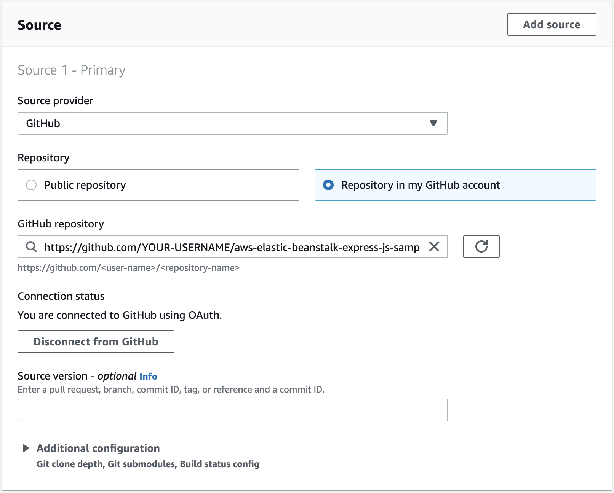
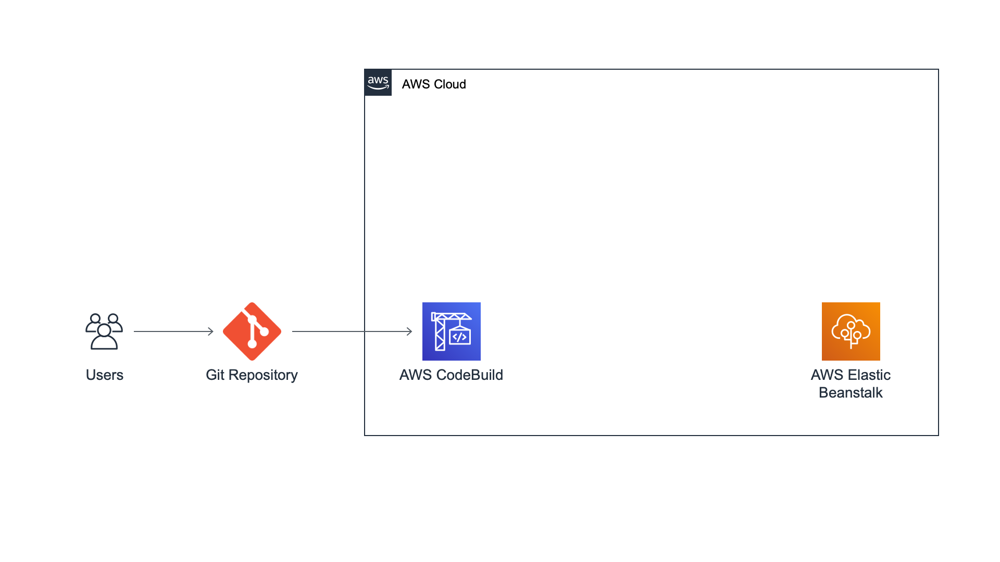

# Module 3: Create Build Project

|                      |                                                          |
| -------------------- | -------------------------------------------------------- | ---------------------------------------------------------------------------------------------------------------------------------------------------------------------------------------------------------------------------------------------------------------------------------------------------------------------------------------------------------------------------------------------------------------------------------------------------------------------------------------------------------------------------------------------------------------------------------------------------------------------------------------------------------------------------------------------------------------------------------------------------------------------------------------------------------------------------------------------------------------------------------------------------------------------------------------------------------------------------------------------------------------------------------------------------------------------------------------------------------------------------------------------------------------------------------------------------------------------------------------------------------------------------------------------------------------------------------------------------------------------------------------------------------------------------------------------------------------------------------------------------------------------------------------------------------------------------------------------------------------------------------------------------------------------------------------------------------------------------------------------------------------------------------------------------------------------------------------------------------------------------------------------------------------------------------------------------------------------------------------------------------------------------------------------------------------------------------------------------------------------------------------------------------------------------------------------------------------------------------------------------------------------------------------------------------------------------------------------------------------------------------------------------------------------------------------------------------------------------------------------------------------------------------------------------------------------------------------------------------------------------------------------------------------------------------------------------------------------------------------------------------------------------------------------------------------------------------------------------------------------------------------------------------------------------------------------------------------------------------------------------------------------------------------------------------------------------------------------------------------------------------------------------------------------------------------------------------------------------------------------------------------------------------------------------------------------------------------------------------------------------------------------------------------------------------------------------------------------------------------------------------------------------------------------------------------------------------------------------------------------------------------------------------------------------------------------------------------------------------------------------------------------------------------------------------------------------------------------------------------------------------------------------------------------------------------------------------------------------------------------------------------------------------------------------------------------------------------------------------------------------------------------------------------------------------------------------------------------------------------------------------------------------------------------------------------------------------------------------------------------------------------------------------------------------------------------------------------------------------------------------------------------- |
| **Time to complete** | 5 minutes                                                |
| **Services used**    | [AWS CodeBuild](https://codebuild/ "https://codebuild/") | ## Overview In this module, you will use [AWS CodeBuild](https://aws.amazon.com/codebuild/ "https://aws.amazon.com/codebuild/") to build the source code previously stored in your GitHub repository. AWS CodeBuild is a fully managed continuous integration service that compiles source code, runs tests, and produces software packages that are ready to deploy. ## What you will accomplish In this module, you will:  • Create a build project with AWS CodeBuild  • Set up GitHub as the source provider for a build project  • Run a build on AWS CodeBuild ## Key concepts **Build process—**Process that converts source code files into an executable software artifact. It may include the following steps: compiling source code, running tests, and packaging software for deployment. **Continuous integration—**Software development practice of regularly pushing changes to a hosted repository, after which automated builds and tests are run. **Build environment—**Represents a combination of the operating system, programming language runtime, and tools that CodeBuild uses to run a build. **Buildspec—**Collection of build commands and related settings, in YAML format, that CodeBuild uses to run a build. **Build Project—**Includes information about how to run a build, including where to get the source code, which build environment to use, which build commands to run, and where to store the build output. **OAuth—**[Open protocol](https://oauth.net/ "https://oauth.net/") for secure authorization. OAuth enables you to [connect your GitHub account to third-party applications](https://docs.github.com/en/github/authenticating-to-github/authorizing-oauth-apps "https://docs.github.com/en/github/authenticating-to-github/authorizing-oauth-apps"), including AWS CodeBuild. ## Implementation 1. Create a project In a new browser tab, open the [AWS CodeBuild console](https://console.aws.amazon.com/codesuite/codebuild/start "https://console.aws.amazon.com/codesuite/codebuild/start"). Choose the orange **Create project** button. 2. Configure the project In the **Project name** field, enter**Build-DevOpsGettingStarted.** Select**GitHub** from the **Source provider** dropdown menu. Confirm that the **Connect using OAuth** radio button is selected. Choose the white **Connect to GitHub** button. A new browser tab will open asking you to give AWS CodeBuild access to your GitHub repo. Choose the green **Authorize aws-codesuite** button. Enter your GitHub password. Choose the orange **Confirm** button. Select **Repository in my GitHub account.** Enter **aws-elastic-beanstalk-express-js-sample** in the search field. Select the repo you forked in Module 1. After selecting your repo, your screen should look like the screenshot.  3. Continue configuring the project Confirm that **Managed Image** is selected. Select **Amazon Linux 2**from the **Operating system** dropdown menu. Select **Standard** from the **Runtime(s)** dropdown menu. Select **aws/codebuild/amazonlinux2-x86_64-standard:3.0** from the **Image** dropdown menu. Confirm that **Always use the latest image for this runtime version** is selected for **Image version.** Confirm that **Linux** is selected for **Environment type.** Confirm that **New service role** is selected. 1. Open the build command editor Select **Insert build commands.** Choose **Switch to editor.** 2. Update the Buildspec file **Replace** the Buildspec in the editor with the code below: `version: 0.2 phases: build: commands:  • npm i --save artifacts: files:  • '**/*'` #### Application architecture Here's what our architecture looks like now. We have created a build project on AWS CodeBuild to run the build process of the Hello World! web app from our GitHub repository. We will be using this build project as the build step in our continuous delivery pipeline, which we will create in the next module.  |
